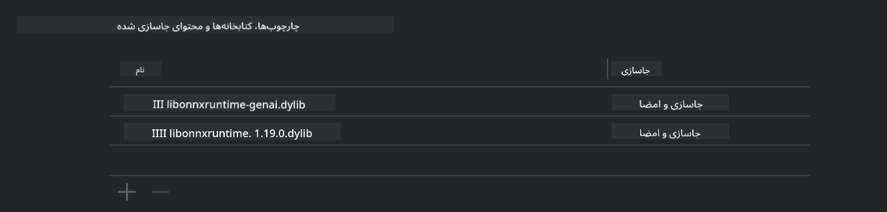
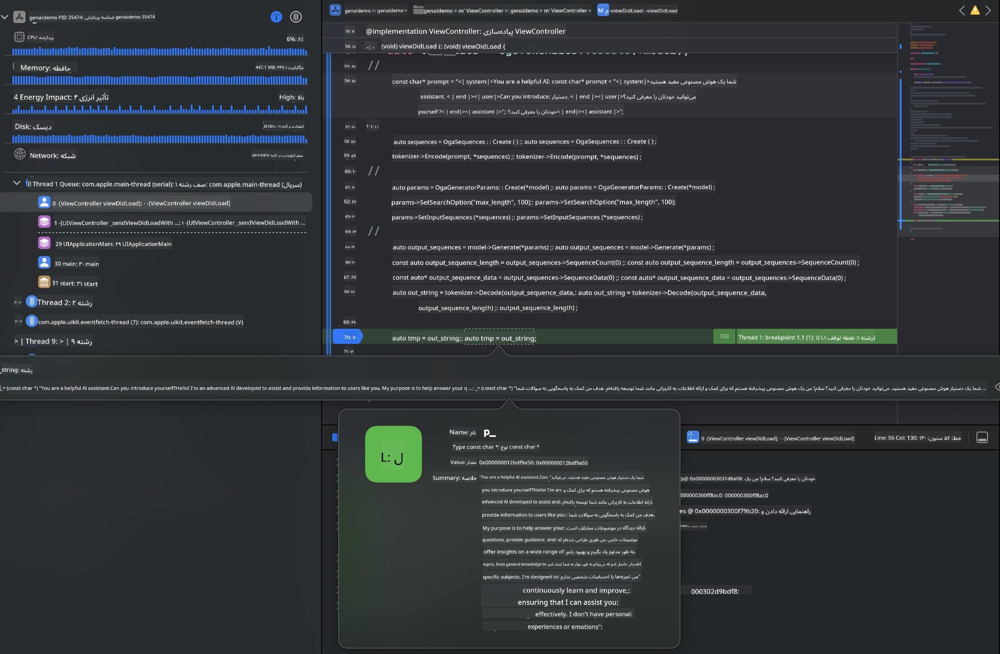

<!--
CO_OP_TRANSLATOR_METADATA:
{
  "original_hash": "82af197df38d25346a98f1f0e84d1698",
  "translation_date": "2025-07-16T20:18:07+00:00",
  "source_file": "md/01.Introduction/03/iOS_Inference.md",
  "language_code": "fa"
}
-->
# **استنتاج Phi-3 در iOS**

Phi-3-mini سری جدیدی از مدل‌ها از مایکروسافت است که امکان استقرار مدل‌های زبان بزرگ (LLMs) را روی دستگاه‌های لبه و دستگاه‌های اینترنت اشیا فراهم می‌کند. Phi-3-mini برای iOS، اندروید و استقرار روی دستگاه‌های لبه در دسترس است و اجازه می‌دهد هوش مصنوعی مولد در محیط‌های BYOD پیاده‌سازی شود. مثال زیر نحوه استقرار Phi-3-mini روی iOS را نشان می‌دهد.

## **1. آماده‌سازی**

- **الف.** macOS 14+
- **ب.** Xcode 15+
- **ج.** iOS SDK 17.x (آیفون 14 با A16 یا بالاتر)
- **د.** نصب Python 3.10+ (استفاده از Conda توصیه می‌شود)
- **ه.** نصب کتابخانه پایتون: `python-flatbuffers`
- **و.** نصب CMake

### Semantic Kernel و استنتاج

Semantic Kernel یک چارچوب برنامه‌نویسی است که به شما امکان می‌دهد برنامه‌هایی سازگار با Azure OpenAI Service، مدل‌های OpenAI و حتی مدل‌های محلی بسازید. دسترسی به سرویس‌های محلی از طریق Semantic Kernel، ادغام آسان با سرور مدل Phi-3-mini خودتان را ممکن می‌سازد.

### فراخوانی مدل‌های کوانتیزه شده با Ollama یا LlamaEdge

بسیاری از کاربران ترجیح می‌دهند مدل‌های کوانتیزه شده را برای اجرای محلی مدل‌ها استفاده کنند. [Ollama](https://ollama.com) و [LlamaEdge](https://llamaedge.com) به کاربران اجازه می‌دهند مدل‌های کوانتیزه مختلف را فراخوانی کنند:

#### **Ollama**

می‌توانید به‌طور مستقیم `ollama run phi3` را اجرا کنید یا به صورت آفلاین آن را پیکربندی کنید. یک Modelfile با مسیر فایل `gguf` خود بسازید. نمونه کد اجرای مدل کوانتیزه شده Phi-3-mini:

```gguf
FROM {Add your gguf file path}
TEMPLATE \"\"\"<|user|> .Prompt<|end|> <|assistant|>\"\"\"
PARAMETER stop <|end|>
PARAMETER num_ctx 4096
```

#### **LlamaEdge**

اگر می‌خواهید از `gguf` همزمان در فضای ابری و دستگاه‌های لبه استفاده کنید، LlamaEdge گزینه مناسبی است.

## **2. کامپایل ONNX Runtime برای iOS**

```bash

git clone https://github.com/microsoft/onnxruntime.git

cd onnxruntime

./build.sh --build_shared_lib --ios --skip_tests --parallel --build_dir ./build_ios --ios --apple_sysroot iphoneos --osx_arch arm64 --apple_deploy_target 17.5 --cmake_generator Xcode --config Release

cd ../

```

### **توجه**

- **الف.** قبل از کامپایل، مطمئن شوید Xcode به درستی پیکربندی شده و آن را به عنوان دایرکتوری توسعه‌دهنده فعال در ترمینال تنظیم کنید:

    ```bash
    sudo xcode-select -switch /Applications/Xcode.app/Contents/Developer
    ```

- **ب.** ONNX Runtime باید برای پلتفرم‌های مختلف کامپایل شود. برای iOS می‌توانید برای `arm64` یا `x86_64` کامپایل کنید.

- **ج.** توصیه می‌شود برای کامپایل از آخرین نسخه iOS SDK استفاده کنید. البته اگر نیاز به سازگاری با نسخه‌های قبلی دارید، می‌توانید از نسخه قدیمی‌تر هم استفاده کنید.

## **3. کامپایل هوش مصنوعی مولد با ONNX Runtime برای iOS**

> **توجه:** چون هوش مصنوعی مولد با ONNX Runtime در حالت پیش‌نمایش است، لطفاً از احتمال تغییرات آگاه باشید.

```bash

git clone https://github.com/microsoft/onnxruntime-genai
 
cd onnxruntime-genai
 
mkdir ort
 
cd ort
 
mkdir include
 
mkdir lib
 
cd ../
 
cp ../onnxruntime/include/onnxruntime/core/session/onnxruntime_c_api.h ort/include
 
cp ../onnxruntime/build_ios/Release/Release-iphoneos/libonnxruntime*.dylib* ort/lib
 
export OPENCV_SKIP_XCODEBUILD_FORCE_TRYCOMPILE_DEBUG=1
 
python3 build.py --parallel --build_dir ./build_ios --ios --ios_sysroot iphoneos --ios_arch arm64 --ios_deployment_target 17.5 --cmake_generator Xcode --cmake_extra_defines CMAKE_XCODE_ATTRIBUTE_CODE_SIGNING_ALLOWED=NO

```

## **4. ایجاد یک اپلیکیشن در Xcode**

من Objective-C را به عنوان روش توسعه اپلیکیشن انتخاب کردم، چون استفاده از هوش مصنوعی مولد با API C++ ONNX Runtime در Objective-C سازگاری بهتری دارد. البته می‌توانید فراخوانی‌های مرتبط را از طریق Swift bridging هم انجام دهید.


## **5. کپی مدل کوانتیزه شده INT4 ONNX به پروژه اپلیکیشن**

ما باید مدل کوانتیزه شده INT4 در فرمت ONNX را وارد کنیم که ابتدا باید آن را دانلود کنید.


پس از دانلود، باید آن را به دایرکتوری Resources پروژه در Xcode اضافه کنید.


## **6. افزودن API C++ در ViewControllers**

> **توجه:**

- **الف.** فایل‌های هدر مربوط به C++ را به پروژه اضافه کنید.

  

- **ب.** کتابخانه داینامیک `onnxruntime-genai` را در Xcode وارد کنید.

  

- **ج.** از کد نمونه C برای تست استفاده کنید. همچنین می‌توانید ویژگی‌های اضافی مانند ChatUI را برای عملکرد بیشتر اضافه کنید.

- **د.** چون باید در پروژه از C++ استفاده کنید، نام فایل `ViewController.m` را به `ViewController.mm` تغییر دهید تا پشتیبانی از Objective-C++ فعال شود.

```objc

    NSString *llmPath = [[NSBundle mainBundle] resourcePath];
    char const *modelPath = llmPath.cString;

    auto model =  OgaModel::Create(modelPath);

    auto tokenizer = OgaTokenizer::Create(*model);

    const char* prompt = "<|system|>You are a helpful AI assistant.<|end|><|user|>Can you introduce yourself?<|end|><|assistant|>";

    auto sequences = OgaSequences::Create();
    tokenizer->Encode(prompt, *sequences);

    auto params = OgaGeneratorParams::Create(*model);
    params->SetSearchOption("max_length", 100);
    params->SetInputSequences(*sequences);

    auto output_sequences = model->Generate(*params);
    const auto output_sequence_length = output_sequences->SequenceCount(0);
    const auto* output_sequence_data = output_sequences->SequenceData(0);
    auto out_string = tokenizer->Decode(output_sequence_data, output_sequence_length);
    
    auto tmp = out_string;

```

## **7. اجرای اپلیکیشن**

پس از اتمام تنظیمات، می‌توانید اپلیکیشن را اجرا کنید و نتایج استنتاج مدل Phi-3-mini را مشاهده کنید.



برای نمونه کدهای بیشتر و دستورالعمل‌های دقیق‌تر، به [مخزن نمونه‌های Phi-3 Mini](https://github.com/Azure-Samples/Phi-3MiniSamples/tree/main/ios) مراجعه کنید.

**سلب مسئولیت**:  
این سند با استفاده از سرویس ترجمه هوش مصنوعی [Co-op Translator](https://github.com/Azure/co-op-translator) ترجمه شده است. در حالی که ما در تلاش برای دقت هستیم، لطفاً توجه داشته باشید که ترجمه‌های خودکار ممکن است حاوی خطاها یا نواقصی باشند. سند اصلی به زبان بومی خود باید به عنوان منبع معتبر در نظر گرفته شود. برای اطلاعات حیاتی، ترجمه حرفه‌ای انسانی توصیه می‌شود. ما مسئول هیچ گونه سوءتفاهم یا تفسیر نادرستی که از استفاده این ترجمه ناشی شود، نیستیم.