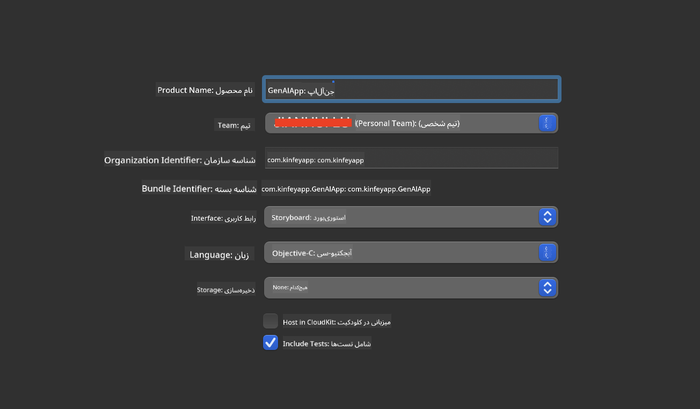
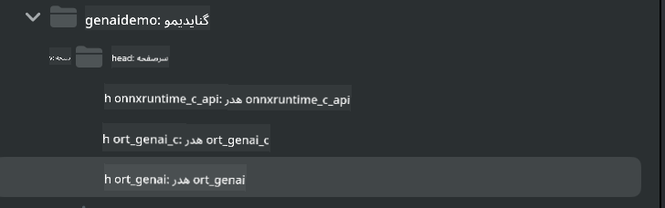

<!--
CO_OP_TRANSLATOR_METADATA:
{
  "original_hash": "82af197df38d25346a98f1f0e84d1698",
  "translation_date": "2025-05-07T14:28:59+00:00",
  "source_file": "md/01.Introduction/03/iOS_Inference.md",
  "language_code": "fa"
}
-->
# **استنتاج Phi-3 در iOS**

Phi-3-mini سری جدیدی از مدل‌های مایکروسافت است که امکان استقرار مدل‌های زبان بزرگ (LLM) را روی دستگاه‌های لبه و دستگاه‌های IoT فراهم می‌کند. Phi-3-mini برای استقرار در iOS، اندروید و دستگاه‌های لبه در دسترس است و اجازه می‌دهد هوش مصنوعی مولد در محیط‌های BYOD به کار گرفته شود. نمونه زیر نحوه استقرار Phi-3-mini روی iOS را نشان می‌دهد.

## **1. آماده‌سازی**

- **الف.** macOS 14 به بالا  
- **ب.** Xcode 15 به بالا  
- **ج.** iOS SDK نسخه 17.x (آیفون 14 با چیپ A16 یا بالاتر)  
- **د.** نصب Python 3.10 به بالا (پیشنهاد می‌شود از Conda استفاده کنید)  
- **ه.** نصب کتابخانه پایتون: `python-flatbuffers`  
- **و.** نصب CMake  

### Semantic Kernel و استنتاج

Semantic Kernel یک چارچوب برنامه‌نویسی است که امکان ساخت برنامه‌های سازگار با Azure OpenAI Service، مدل‌های OpenAI و حتی مدل‌های محلی را فراهم می‌کند. دسترسی به سرویس‌های محلی از طریق Semantic Kernel، ادغام آسان با سرور مدل Phi-3-mini خود میزبان را ممکن می‌سازد.

### فراخوانی مدل‌های کوانتیزه شده با Ollama یا LlamaEdge

بسیاری از کاربران ترجیح می‌دهند مدل‌های کوانتیزه شده را برای اجرای مدل‌ها به صورت محلی استفاده کنند. [Ollama](https://ollama.com) و [LlamaEdge](https://llamaedge.com) امکان فراخوانی مدل‌های کوانتیزه مختلف را فراهم می‌کنند:

#### **Ollama**

شما می‌توانید `ollama run phi3` را مستقیماً اجرا کنید یا به صورت آفلاین پیکربندی نمایید. یک Modelfile با مسیر فایل `gguf` خود بسازید. نمونه کد اجرای مدل Phi-3-mini کوانتیزه شده:

```gguf
FROM {Add your gguf file path}
TEMPLATE \"\"\"<|user|> .Prompt<|end|> <|assistant|>\"\"\"
PARAMETER stop <|end|>
PARAMETER num_ctx 4096
```

#### **LlamaEdge**

اگر می‌خواهید `gguf` را همزمان در کلود و دستگاه‌های لبه استفاده کنید، LlamaEdge گزینه مناسبی است.

## **2. کامپایل ONNX Runtime برای iOS**

```bash

git clone https://github.com/microsoft/onnxruntime.git

cd onnxruntime

./build.sh --build_shared_lib --ios --skip_tests --parallel --build_dir ./build_ios --ios --apple_sysroot iphoneos --osx_arch arm64 --apple_deploy_target 17.5 --cmake_generator Xcode --config Release

cd ../

```

### **توجه**

- **الف.** قبل از کامپایل، مطمئن شوید که Xcode به درستی تنظیم شده و آن را به عنوان دایرکتوری توسعه‌دهنده فعال در ترمینال قرار دهید:

    ```bash
    sudo xcode-select -switch /Applications/Xcode.app/Contents/Developer
    ```

- **ب.** ONNX Runtime باید برای پلتفرم‌های مختلف کامپایل شود. برای iOS می‌توانید برای `arm64` or `x86_64` کامپایل کنید.

- **ج.** توصیه می‌شود برای کامپایل از آخرین نسخه iOS SDK استفاده کنید. البته اگر نیاز به سازگاری با SDKهای قدیمی‌تر دارید، می‌توانید نسخه قدیمی‌تر را هم به کار ببرید.

## **3. کامپایل Generative AI با ONNX Runtime برای iOS**

> **Note:** چون Generative AI با ONNX Runtime در حالت پیش‌نمایش است، لطفاً از احتمال تغییرات آگاه باشید.

```bash

git clone https://github.com/microsoft/onnxruntime-genai
 
cd onnxruntime-genai
 
mkdir ort
 
cd ort
 
mkdir include
 
mkdir lib
 
cd ../
 
cp ../onnxruntime/include/onnxruntime/core/session/onnxruntime_c_api.h ort/include
 
cp ../onnxruntime/build_ios/Release/Release-iphoneos/libonnxruntime*.dylib* ort/lib
 
export OPENCV_SKIP_XCODEBUILD_FORCE_TRYCOMPILE_DEBUG=1
 
python3 build.py --parallel --build_dir ./build_ios --ios --ios_sysroot iphoneos --ios_arch arm64 --ios_deployment_target 17.5 --cmake_generator Xcode --cmake_extra_defines CMAKE_XCODE_ATTRIBUTE_CODE_SIGNING_ALLOWED=NO

```

## **4. ساخت یک اپلیکیشن در Xcode**

من Objective-C را به عنوان روش توسعه اپلیکیشن انتخاب کردم، چون با استفاده از API سی‌پلاس‌پلاس ONNX Runtime، سازگاری بهتری با Objective-C دارد. البته می‌توانید فراخوانی‌های مربوطه را از طریق پل Swift هم انجام دهید.



## **5. کپی مدل کوانتیزه شده ONNX با فرمت INT4 به پروژه اپلیکیشن**

ما باید مدل کوانتیزه شده INT4 در فرمت ONNX را وارد کنیم که ابتدا باید آن را دانلود کنید.


پس از دانلود، باید آن را به دایرکتوری Resources پروژه در Xcode اضافه کنید.


## **6. افزودن API سی‌پلاس‌پلاس در ViewControllers**

> **توجه:**

- **الف.** فایل‌های هدر مربوط به C++ را به پروژه اضافه کنید.

  

- **ب.** فایل `onnxruntime-genai` dynamic library in Xcode.

  

- **c.** Use the C Samples code for testing. You can also add additional features like ChatUI for more functionality.

- **d.** Since you need to use C++ in your project, rename `ViewController.m` to `ViewController.mm` را شامل کنید تا پشتیبانی Objective-C++ فعال شود.

```objc

    NSString *llmPath = [[NSBundle mainBundle] resourcePath];
    char const *modelPath = llmPath.cString;

    auto model =  OgaModel::Create(modelPath);

    auto tokenizer = OgaTokenizer::Create(*model);

    const char* prompt = "<|system|>You are a helpful AI assistant.<|end|><|user|>Can you introduce yourself?<|end|><|assistant|>";

    auto sequences = OgaSequences::Create();
    tokenizer->Encode(prompt, *sequences);

    auto params = OgaGeneratorParams::Create(*model);
    params->SetSearchOption("max_length", 100);
    params->SetInputSequences(*sequences);

    auto output_sequences = model->Generate(*params);
    const auto output_sequence_length = output_sequences->SequenceCount(0);
    const auto* output_sequence_data = output_sequences->SequenceData(0);
    auto out_string = tokenizer->Decode(output_sequence_data, output_sequence_length);
    
    auto tmp = out_string;

```

## **7. اجرای اپلیکیشن**

پس از تکمیل تنظیمات، می‌توانید اپلیکیشن را اجرا کنید و نتایج استنتاج مدل Phi-3-mini را مشاهده نمایید.


برای نمونه کدهای بیشتر و دستورالعمل‌های دقیق‌تر، به [مخزن Phi-3 Mini Samples](https://github.com/Azure-Samples/Phi-3MiniSamples/tree/main/ios) مراجعه کنید.

**سلب مسئولیت**:  
این سند با استفاده از سرویس ترجمه هوش مصنوعی [Co-op Translator](https://github.com/Azure/co-op-translator) ترجمه شده است. در حالی که ما در تلاش برای دقت هستیم، لطفاً توجه داشته باشید که ترجمه‌های خودکار ممکن است حاوی خطاها یا نادرستی‌هایی باشند. سند اصلی به زبان بومی خود باید به عنوان منبع معتبر در نظر گرفته شود. برای اطلاعات حیاتی، ترجمه حرفه‌ای انسانی توصیه می‌شود. ما مسئول هیچ گونه سوءتفاهم یا تفسیر نادرستی که از استفاده این ترجمه ناشی شود، نیستیم.