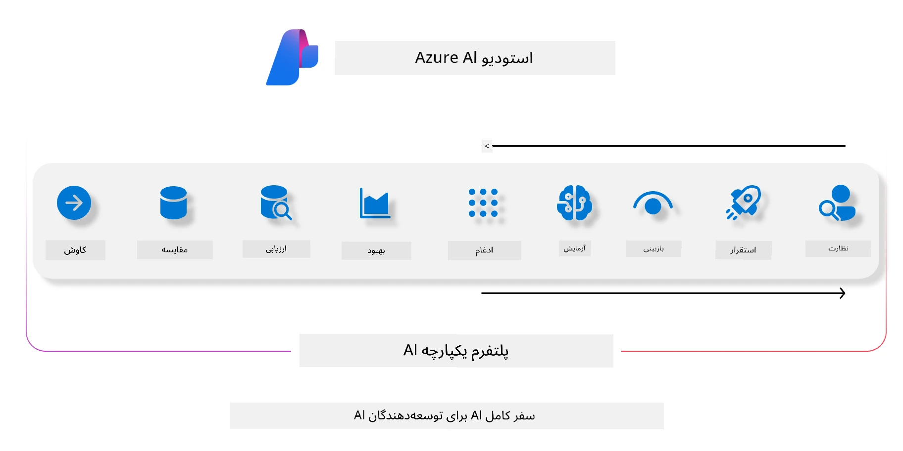
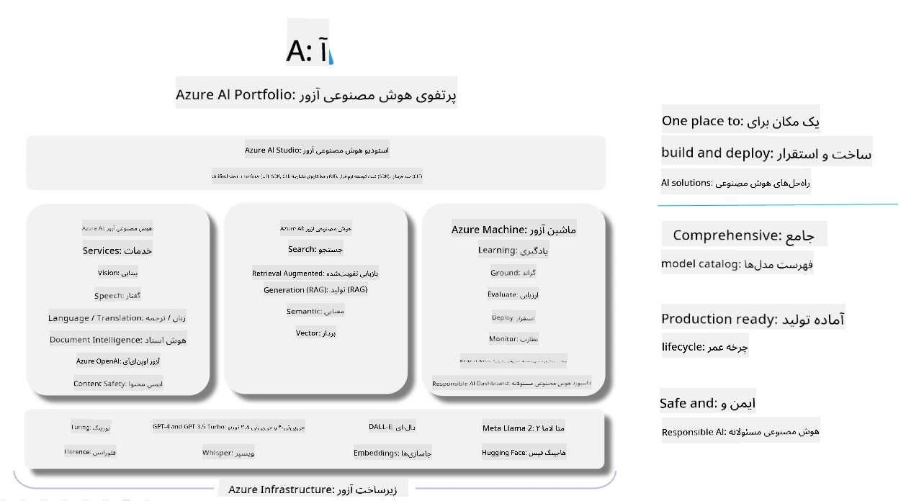

# **استفاده از Microsoft Foundry برای ارزیابی**

چگونه برنامه تولیدی هوش مصنوعی خود را با استفاده از [Microsoft Foundry](https://ai.azure.com?WT.mc_id=aiml-138114-kinfeylo) ارزیابی کنیم. چه شما در حال ارزیابی مکالمات تک‌مرحله‌ای باشید و چه چند مرحله‌ای، Microsoft Foundry ابزارهایی برای ارزیابی عملکرد مدل و ایمنی فراهم می‌کند.

## چگونه برنامه‌های تولیدی هوش مصنوعی را با Microsoft Foundry ارزیابی کنیم  
برای دستورالعمل‌های بیشتر به [مستندات Microsoft Foundry](https://learn.microsoft.com/azure/ai-studio/how-to/evaluate-generative-ai-app?WT.mc_id=aiml-138114-kinfeylo) مراجعه کنید

در اینجا مراحل آغاز کار آمده است:

## ارزیابی مدل‌های تولیدی هوش مصنوعی در Microsoft Foundry

**پیش‌نیازها**

- یک مجموعه داده آزمایشی در قالب CSV یا JSON.
- یک مدل تولیدی هوش مصنوعی مستقر شده (مانند Phi-3، GPT 3.5، GPT 4، یا مدل‌های Davinci).
- یک محیط اجرای دارای یک نمونه محاسباتی برای اجرای ارزیابی.

## معیارهای ارزیابی از پیش ساخته شده

Microsoft Foundry به شما امکان می‌دهد هم مکالمات تک‌مرحله‌ای و هم مکالمات پیچیده چندمرحله‌ای را ارزیابی کنید.  
برای سناریوهای بازیابی پیش‌تقویت شده (RAG)، جایی که مدل بر داده‌های خاصی بنا شده است، می‌توانید عملکرد را با استفاده از معیارهای ارزیابی از پیش ساخته شده بسنجید.  
همچنین می‌توانید سناریوهای کلی پاسخگویی به سوالات تک مرحله‌ای (غیر RAG) را ارزیابی کنید.

## ایجاد یک اجرای ارزیابی

از رابط کاربری Microsoft Foundry، به صفحه Evaluate یا صفحه Prompt Flow بروید.  
جادوی ایجاد ارزیابی را دنبال کنید تا یک اجرای ارزیابی تنظیم کنید. یک نام اختیاری برای ارزیابی خود وارد کنید.  
سناریوی مرتبط با اهداف برنامه‌تان را انتخاب کنید.  
یک یا چند معیار ارزیابی را برای سنجش خروجی مدل انتخاب کنید.

## جریان ارزیابی سفارشی (اختیاری)

برای انعطاف‌پذیری بیشتر، می‌توانید یک جریان ارزیابی سفارشی ایجاد کنید. فرایند ارزیابی را بر اساس نیازهای خاص خود تنظیم کنید.

## مشاهده نتایج

پس از اجرای ارزیابی، در Microsoft Foundry لاگ‌ها را مشاهده، بررسی و تجزیه و تحلیل دقیق معیارهای ارزیابی را انجام دهید.  
بینشی درباره قابلیت‌ها و محدودیت‌های برنامه خود کسب کنید.

**توجه** Microsoft Foundry فعلاً در نسخه پیش‌نمایش عمومی است، بنابراین از آن برای آزمایش و توسعه استفاده کنید. برای بارهای کاری تولیدی، گزینه‌های دیگر را مد نظر قرار دهید.  
برای جزئیات بیشتر و دستورالعمل‌های گام به گام، [مستندات رسمی AI Foundry](https://learn.microsoft.com/azure/ai-studio/?WT.mc_id=aiml-138114-kinfeylo) را بررسی کنید.

---

<!-- CO-OP TRANSLATOR DISCLAIMER START -->
**سلب مسئولیت**:  
این سند با استفاده از سرویس ترجمه ماشینی [Co-op Translator](https://github.com/Azure/co-op-translator) ترجمه شده است. در حالی که تلاش می‌کنیم دقت ترجمه حفظ شود، لطفاً توجه داشته باشید که ترجمه‌های خودکار ممکن است حاوی خطاها یا نواقصی باشند. سند اصلی به زبان بومی خود باید به عنوان منبع معتبر در نظر گرفته شود. برای اطلاعات حیاتی، توصیه می‌شود از ترجمه حرفه‌ای انسانی استفاده شود. ما مسئول هیچگونه سوءتفاهم یا برداشت نادرستی ناشی از استفاده از این ترجمه نمی‌باشیم.
<!-- CO-OP TRANSLATOR DISCLAIMER END -->