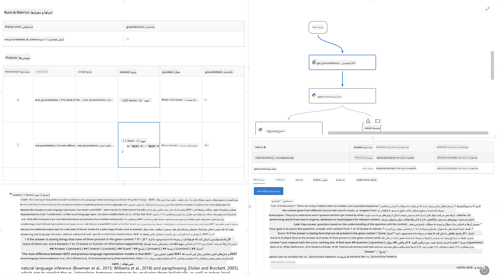

<!--
CO_OP_TRANSLATOR_METADATA:
{
  "original_hash": "3cbe7629d254f1043193b7fe22524d55",
  "translation_date": "2025-07-16T22:36:01+00:00",
  "source_file": "md/01.Introduction/05/Promptflow.md",
  "language_code": "fa"
}
-->
# **معرفی Promptflow**

[Microsoft Prompt Flow](https://microsoft.github.io/promptflow/index.html?WT.mc_id=aiml-138114-kinfeylo) یک ابزار خودکارسازی گردش کار بصری است که به کاربران امکان می‌دهد با استفاده از قالب‌های از پیش ساخته شده و کانکتورهای سفارشی، گردش‌های کاری خودکار ایجاد کنند. این ابزار برای توسعه‌دهندگان و تحلیل‌گران کسب‌وکار طراحی شده تا بتوانند به سرعت فرآیندهای خودکار برای وظایفی مانند مدیریت داده‌ها، همکاری و بهینه‌سازی فرآیندها بسازند. با Prompt Flow، کاربران می‌توانند به راحتی خدمات، برنامه‌ها و سیستم‌های مختلف را به هم متصل کرده و فرآیندهای پیچیده کسب‌وکار را خودکار کنند.

Microsoft Prompt Flow به منظور ساده‌سازی چرخه توسعه کامل برنامه‌های هوش مصنوعی مبتنی بر مدل‌های زبان بزرگ (LLMs) طراحی شده است. چه در مرحله ایده‌پردازی، نمونه‌سازی، آزمایش، ارزیابی یا استقرار برنامه‌های مبتنی بر LLM باشید، Prompt Flow روند کار را آسان‌تر کرده و به شما امکان می‌دهد برنامه‌های LLM با کیفیت تولید بسازید.

## ویژگی‌ها و مزایای کلیدی استفاده از Microsoft Prompt Flow:

**تجربه نویسندگی تعاملی**

Prompt Flow ساختار جریان شما را به صورت بصری نمایش می‌دهد و فهم و پیمایش پروژه‌ها را آسان می‌کند.  
تجربه کدنویسی شبیه به دفترچه یادداشت را برای توسعه و اشکال‌زدایی کارآمد جریان فراهم می‌کند.

**انواع و تنظیمات Prompt**

چندین نوع مختلف از prompt بسازید و مقایسه کنید تا فرآیند اصلاح تدریجی را تسهیل کنید. عملکرد promptهای مختلف را ارزیابی کرده و مؤثرترین‌ها را انتخاب کنید.

**جریان‌های ارزیابی داخلی**  
کیفیت و اثربخشی promptها و جریان‌های خود را با استفاده از ابزارهای ارزیابی داخلی بسنجید.  
درک کنید که برنامه‌های مبتنی بر LLM شما چقدر خوب عمل می‌کنند.

**منابع جامع**

Prompt Flow شامل کتابخانه‌ای از ابزارها، نمونه‌ها و قالب‌های از پیش ساخته شده است. این منابع نقطه شروعی برای توسعه، الهام‌بخش خلاقیت و تسریع روند کار هستند.

**همکاری و آمادگی سازمانی**

از همکاری تیمی پشتیبانی می‌کند و به چندین کاربر اجازه می‌دهد به صورت مشترک روی پروژه‌های مهندسی prompt کار کنند.  
کنترل نسخه را حفظ کرده و دانش را به طور مؤثر به اشتراک بگذارید. کل فرآیند مهندسی prompt را از توسعه و ارزیابی تا استقرار و نظارت ساده کنید.

## ارزیابی در Prompt Flow

در Microsoft Prompt Flow، ارزیابی نقش مهمی در سنجش عملکرد مدل‌های هوش مصنوعی شما دارد. بیایید ببینیم چگونه می‌توانید جریان‌ها و معیارهای ارزیابی را در Prompt Flow سفارشی کنید:

**درک ارزیابی در Prompt Flow**

در Prompt Flow، یک جریان نمایانگر دنباله‌ای از گره‌ها است که ورودی را پردازش کرده و خروجی تولید می‌کنند. جریان‌های ارزیابی نوع خاصی از جریان‌ها هستند که برای سنجش عملکرد یک اجرا بر اساس معیارها و اهداف مشخص طراحی شده‌اند.

**ویژگی‌های کلیدی جریان‌های ارزیابی**

معمولاً پس از اجرای جریان مورد آزمایش اجرا می‌شوند و از خروجی‌های آن استفاده می‌کنند.  
امتیازها یا معیارهایی را برای اندازه‌گیری عملکرد جریان آزمایش شده محاسبه می‌کنند. معیارها می‌توانند شامل دقت، امتیاز مرتبط بودن یا هر معیار مرتبط دیگری باشند.

### سفارشی‌سازی جریان‌های ارزیابی

**تعریف ورودی‌ها**

جریان‌های ارزیابی باید خروجی‌های اجرای مورد آزمایش را دریافت کنند. ورودی‌ها را مشابه جریان‌های استاندارد تعریف کنید.  
برای مثال، اگر در حال ارزیابی یک جریان پرسش و پاسخ هستید، یک ورودی را "answer" نام‌گذاری کنید. اگر در حال ارزیابی یک جریان دسته‌بندی هستید، ورودی را "category" بنامید. همچنین ممکن است ورودی‌های حقیقت زمینه (مانند برچسب‌های واقعی) نیز لازم باشد.

**خروجی‌ها و معیارها**

جریان‌های ارزیابی نتایجی تولید می‌کنند که عملکرد جریان آزمایش شده را اندازه‌گیری می‌کنند. معیارها می‌توانند با استفاده از Python یا LLM محاسبه شوند. از تابع log_metric() برای ثبت معیارهای مرتبط استفاده کنید.

**استفاده از جریان‌های ارزیابی سفارشی**

جریان ارزیابی خود را متناسب با وظایف و اهداف خاص خود توسعه دهید. معیارها را بر اساس اهداف ارزیابی خود سفارشی کنید.  
این جریان ارزیابی سفارشی را برای اجرای دسته‌ای در آزمایش‌های گسترده به کار ببرید.

## روش‌های ارزیابی داخلی

Prompt Flow همچنین روش‌های ارزیابی داخلی ارائه می‌دهد.  
می‌توانید اجرای دسته‌ای ارسال کرده و از این روش‌ها برای ارزیابی عملکرد جریان خود با داده‌های بزرگ استفاده کنید.  
نتایج ارزیابی را مشاهده، معیارها را مقایسه و در صورت نیاز تکرار کنید.  
به یاد داشته باشید، ارزیابی برای اطمینان از اینکه مدل‌های هوش مصنوعی شما معیارها و اهداف مورد نظر را برآورده می‌کنند، ضروری است. برای دستورالعمل‌های دقیق‌تر در مورد توسعه و استفاده از جریان‌های ارزیابی در Microsoft Prompt Flow، مستندات رسمی را بررسی کنید.

در خلاصه، Microsoft Prompt Flow به توسعه‌دهندگان این امکان را می‌دهد که برنامه‌های LLM با کیفیت بالا بسازند، با ساده‌سازی مهندسی prompt و فراهم کردن محیط توسعه قدرتمند. اگر با LLMها کار می‌کنید، Prompt Flow ابزاری ارزشمند برای کاوش است. برای دستورالعمل‌های دقیق‌تر در مورد توسعه و استفاده از جریان‌های ارزیابی در Microsoft Prompt Flow، به [مستندات ارزیابی Prompt Flow](https://learn.microsoft.com/azure/machine-learning/prompt-flow/how-to-develop-an-evaluation-flow?view=azureml-api-2?WT.mc_id=aiml-138114-kinfeylo) مراجعه کنید.

**سلب مسئولیت**:  
این سند با استفاده از سرویس ترجمه هوش مصنوعی [Co-op Translator](https://github.com/Azure/co-op-translator) ترجمه شده است. در حالی که ما در تلاش برای دقت هستیم، لطفاً توجه داشته باشید که ترجمه‌های خودکار ممکن است حاوی خطاها یا نادرستی‌هایی باشند. سند اصلی به زبان بومی خود باید به عنوان منبع معتبر در نظر گرفته شود. برای اطلاعات حیاتی، ترجمه حرفه‌ای انسانی توصیه می‌شود. ما مسئول هیچ گونه سوءتفاهم یا تفسیر نادرستی که از استفاده از این ترجمه ناشی شود، نیستیم.