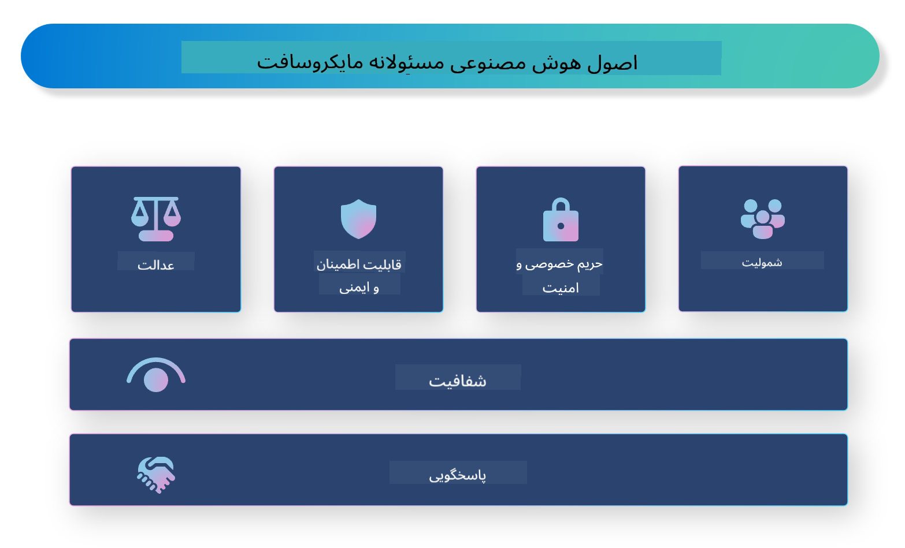

<!--
CO_OP_TRANSLATOR_METADATA:
{
  "original_hash": "805b96b20152936d8f4c587d90d6e06e",
  "translation_date": "2025-07-16T22:47:48+00:00",
  "source_file": "md/01.Introduction/05/ResponsibleAI.md",
  "language_code": "fa"
}
-->
# **معرفی هوش مصنوعی مسئولانه**

[Microsoft Responsible AI](https://www.microsoft.com/ai/responsible-ai?WT.mc_id=aiml-138114-kinfeylo) ابتکاری است که هدف آن کمک به توسعه‌دهندگان و سازمان‌ها برای ساخت سیستم‌های هوش مصنوعی شفاف، قابل اعتماد و پاسخگو است. این ابتکار راهنمایی‌ها و منابعی را برای توسعه راهکارهای هوش مصنوعی مسئولانه که با اصول اخلاقی مانند حفظ حریم خصوصی، عدالت و شفافیت همسو هستند، ارائه می‌دهد. همچنین به بررسی برخی چالش‌ها و بهترین روش‌های مرتبط با ساخت سیستم‌های هوش مصنوعی مسئولانه خواهیم پرداخت.

## مرور کلی بر Microsoft Responsible AI

**اصول اخلاقی**

Microsoft Responsible AI بر پایه مجموعه‌ای از اصول اخلاقی مانند حفظ حریم خصوصی، عدالت، شفافیت، پاسخگویی و ایمنی هدایت می‌شود. این اصول به گونه‌ای طراحی شده‌اند که اطمینان حاصل شود سیستم‌های هوش مصنوعی به شکلی اخلاقی و مسئولانه توسعه می‌یابند.

**هوش مصنوعی شفاف**

Microsoft Responsible AI بر اهمیت شفافیت در سیستم‌های هوش مصنوعی تأکید دارد. این شامل ارائه توضیحات واضح درباره نحوه عملکرد مدل‌های هوش مصنوعی و همچنین اطمینان از در دسترس بودن عمومی منابع داده و الگوریتم‌ها است.

**هوش مصنوعی پاسخگو**

[Microsoft Responsible AI](https://www.microsoft.com/ai/responsible-ai?WT.mc_id=aiml-138114-kinfeylo) توسعه سیستم‌های هوش مصنوعی پاسخگو را ترویج می‌کند، سیستم‌هایی که می‌توانند بینشی درباره نحوه تصمیم‌گیری مدل‌های هوش مصنوعی ارائه دهند. این موضوع به کاربران کمک می‌کند تا خروجی‌های سیستم‌های هوش مصنوعی را بهتر درک کرده و به آن‌ها اعتماد کنند.

**شمولیت**

سیستم‌های هوش مصنوعی باید به گونه‌ای طراحی شوند که به نفع همه باشند. مایکروسافت هدف دارد هوش مصنوعی فراگیری ایجاد کند که دیدگاه‌های متنوع را در نظر گرفته و از تعصب یا تبعیض جلوگیری کند.

**قابلیت اطمینان و ایمنی**

اطمینان از اینکه سیستم‌های هوش مصنوعی قابل اعتماد و ایمن هستند، بسیار حیاتی است. مایکروسافت بر ساخت مدل‌های مقاوم تمرکز دارد که عملکردی پایدار داشته و از نتایج مضر جلوگیری کنند.

**عدالت در هوش مصنوعی**

Microsoft Responsible AI اذعان دارد که سیستم‌های هوش مصنوعی ممکن است در صورت آموزش با داده‌ها یا الگوریتم‌های مغرضانه، تعصبات را تداوم بخشند. این ابتکار راهنمایی‌هایی برای توسعه سیستم‌های هوش مصنوعی عادلانه ارائه می‌دهد که بر اساس عواملی مانند نژاد، جنسیت یا سن تبعیض قائل نشوند.

**حریم خصوصی و امنیت**

Microsoft Responsible AI بر اهمیت حفاظت از حریم خصوصی کاربران و امنیت داده‌ها در سیستم‌های هوش مصنوعی تأکید دارد. این شامل پیاده‌سازی رمزنگاری قوی داده‌ها و کنترل‌های دسترسی، و همچنین انجام ممیزی‌های منظم برای شناسایی آسیب‌پذیری‌ها است.

**پاسخگویی و مسئولیت‌پذیری**

Microsoft Responsible AI پاسخگویی و مسئولیت‌پذیری در توسعه و استقرار هوش مصنوعی را ترویج می‌کند. این شامل اطمینان از آگاهی توسعه‌دهندگان و سازمان‌ها نسبت به خطرات احتمالی مرتبط با سیستم‌های هوش مصنوعی و اتخاذ تدابیری برای کاهش این خطرات است.

## بهترین روش‌ها برای ساخت سیستم‌های هوش مصنوعی مسئولانه

**توسعه مدل‌های هوش مصنوعی با استفاده از مجموعه داده‌های متنوع**

برای جلوگیری از تعصب در سیستم‌های هوش مصنوعی، استفاده از مجموعه داده‌های متنوع که نمایانگر دیدگاه‌ها و تجربیات مختلف باشد، اهمیت دارد.

**استفاده از تکنیک‌های هوش مصنوعی قابل توضیح**

تکنیک‌های هوش مصنوعی قابل توضیح به کاربران کمک می‌کنند تا بفهمند مدل‌های هوش مصنوعی چگونه تصمیم می‌گیرند، که این موضوع می‌تواند اعتماد به سیستم را افزایش دهد.

**ممیزی منظم سیستم‌های هوش مصنوعی برای شناسایی آسیب‌پذیری‌ها**

ممیزی‌های منظم سیستم‌های هوش مصنوعی می‌تواند به شناسایی خطرات و آسیب‌پذیری‌های احتمالی که نیاز به رسیدگی دارند، کمک کند.

**پیاده‌سازی رمزنگاری قوی داده‌ها و کنترل‌های دسترسی**

رمزنگاری داده‌ها و کنترل‌های دسترسی می‌تواند به حفاظت از حریم خصوصی و امنیت کاربران در سیستم‌های هوش مصنوعی کمک کند.

**رعایت اصول اخلاقی در توسعه هوش مصنوعی**

رعایت اصول اخلاقی مانند عدالت، شفافیت و پاسخگویی می‌تواند به ایجاد اعتماد در سیستم‌های هوش مصنوعی کمک کرده و اطمینان حاصل کند که این سیستم‌ها به شکلی مسئولانه توسعه می‌یابند.

## استفاده از AI Foundry برای هوش مصنوعی مسئولانه

[Azure AI Foundry](https://ai.azure.com?WT.mc_id=aiml-138114-kinfeylo) پلتفرمی قدرتمند است که به توسعه‌دهندگان و سازمان‌ها امکان می‌دهد به سرعت برنامه‌های هوشمند، پیشرفته، آماده بازار و مسئولانه ایجاد کنند. در ادامه برخی ویژگی‌ها و قابلیت‌های کلیدی Azure AI Foundry آمده است:

**APIها و مدل‌های آماده استفاده**

Azure AI Foundry APIها و مدل‌های از پیش ساخته و قابل سفارشی‌سازی ارائه می‌دهد. این موارد طیف گسترده‌ای از وظایف هوش مصنوعی را پوشش می‌دهند، از جمله هوش مصنوعی مولد، پردازش زبان طبیعی برای مکالمات، جستجو، نظارت، ترجمه، گفتار، بینایی و تصمیم‌گیری.

**Prompt Flow**

Prompt flow در Azure AI Foundry به شما امکان می‌دهد تجربیات هوش مصنوعی مکالمه‌ای ایجاد کنید. این قابلیت به شما اجازه می‌دهد جریان‌های مکالمه را طراحی و مدیریت کنید و ساخت چت‌بات‌ها، دستیارهای مجازی و سایر برنامه‌های تعاملی را آسان‌تر می‌کند.

**Retrieval Augmented Generation (RAG)**

RAG تکنیکی است که رویکردهای مبتنی بر بازیابی و مولد را ترکیب می‌کند. این روش کیفیت پاسخ‌های تولید شده را با بهره‌گیری از دانش پیشین (بازیابی) و تولید خلاقانه (مولد) بهبود می‌بخشد.

**معیارهای ارزیابی و نظارت برای هوش مصنوعی مولد**

Azure AI Foundry ابزارهایی برای ارزیابی و نظارت بر مدل‌های هوش مصنوعی مولد فراهم می‌کند. شما می‌توانید عملکرد، عدالت و سایر معیارهای مهم را ارزیابی کنید تا از استقرار مسئولانه اطمینان حاصل شود. علاوه بر این، اگر داشبوردی ساخته‌اید، می‌توانید از رابط کاربری بدون کد در Azure Machine Learning Studio برای سفارشی‌سازی و ایجاد داشبورد هوش مصنوعی مسئولانه و کارت امتیاز مرتبط بر اساس کتابخانه‌های پایتون [Repsonsible AI Toolbox](https://responsibleaitoolbox.ai/?WT.mc_id=aiml-138114-kinfeylo) استفاده کنید. این کارت امتیاز به شما کمک می‌کند تا نکات کلیدی مرتبط با عدالت، اهمیت ویژگی‌ها و سایر ملاحظات استقرار مسئولانه را با ذینفعان فنی و غیر فنی به اشتراک بگذارید.

برای استفاده از AI Foundry با هوش مصنوعی مسئولانه، می‌توانید این بهترین روش‌ها را دنبال کنید:

**تعریف مسئله و اهداف سیستم هوش مصنوعی خود**

قبل از شروع فرآیند توسعه، مهم است که مسئله یا هدفی که سیستم هوش مصنوعی شما قصد حل آن را دارد، به وضوح تعریف کنید. این کار به شما کمک می‌کند داده‌ها، الگوریتم‌ها و منابع لازم برای ساخت مدل مؤثر را شناسایی کنید.

**جمع‌آوری و پیش‌پردازش داده‌های مرتبط**

کیفیت و کمیت داده‌های استفاده شده در آموزش سیستم هوش مصنوعی تأثیر قابل توجهی بر عملکرد آن دارد. بنابراین، مهم است که داده‌های مرتبط را جمع‌آوری، پاک‌سازی، پیش‌پردازش کرده و اطمینان حاصل کنید که نماینده جمعیت یا مسئله‌ای است که قصد حل آن را دارید.

**انتخاب ارزیابی مناسب**

الگوریتم‌های ارزیابی مختلفی وجود دارد. انتخاب مناسب‌ترین الگوریتم بر اساس داده‌ها و مسئله شما اهمیت دارد.

**ارزیابی و تفسیر مدل**

پس از ساخت مدل هوش مصنوعی، مهم است که عملکرد آن را با استفاده از معیارهای مناسب ارزیابی کرده و نتایج را به شکلی شفاف تفسیر کنید. این کار به شما کمک می‌کند هرگونه تعصب یا محدودیت در مدل را شناسایی کرده و در صورت نیاز بهبود دهید.

**اطمینان از شفافیت و قابلیت توضیح**

سیستم‌های هوش مصنوعی باید شفاف و قابل توضیح باشند تا کاربران بتوانند بفهمند چگونه کار می‌کنند و تصمیمات چگونه گرفته می‌شوند. این موضوع به ویژه برای برنامه‌هایی که تأثیرات قابل توجهی بر زندگی انسان‌ها دارند، مانند حوزه‌های بهداشت، مالی و حقوقی اهمیت دارد.

**نظارت و به‌روزرسانی مدل**

سیستم‌های هوش مصنوعی باید به طور مداوم نظارت و به‌روزرسانی شوند تا اطمینان حاصل شود که در طول زمان دقیق و مؤثر باقی می‌مانند. این نیازمند نگهداری، آزمایش و آموزش مجدد مداوم مدل است.

در پایان، Microsoft Responsible AI ابتکاری است که هدف آن کمک به توسعه‌دهندگان و سازمان‌ها برای ساخت سیستم‌های هوش مصنوعی شفاف، قابل اعتماد و پاسخگو است. به یاد داشته باشید که پیاده‌سازی هوش مصنوعی مسئولانه حیاتی است و Azure AI Foundry تلاش می‌کند این موضوع را برای سازمان‌ها عملی کند. با پیروی از اصول اخلاقی و بهترین روش‌ها، می‌توانیم اطمینان حاصل کنیم که سیستم‌های هوش مصنوعی به شکلی مسئولانه توسعه یافته و به کار گرفته می‌شوند که به نفع کل جامعه باشد.

**سلب مسئولیت**:  
این سند با استفاده از سرویس ترجمه هوش مصنوعی [Co-op Translator](https://github.com/Azure/co-op-translator) ترجمه شده است. در حالی که ما در تلاش برای دقت هستیم، لطفاً توجه داشته باشید که ترجمه‌های خودکار ممکن است حاوی خطاها یا نادرستی‌هایی باشند. سند اصلی به زبان بومی خود باید به عنوان منبع معتبر در نظر گرفته شود. برای اطلاعات حیاتی، ترجمه حرفه‌ای انسانی توصیه می‌شود. ما مسئول هیچ گونه سوءتفاهم یا تفسیر نادرستی که از استفاده این ترجمه ناشی شود، نیستیم.