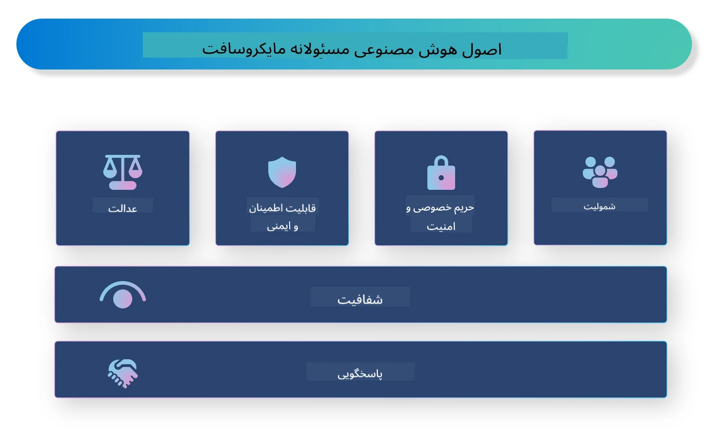

# **معرفی هوش مصنوعی مسئولانه**

[هوش مصنوعی مسئولانه مایکروسافت](https://www.microsoft.com/ai/responsible-ai?WT.mc_id=aiml-138114-kinfeylo) یک ابتکار است که هدف آن کمک به توسعه‌دهندگان و سازمان‌ها برای ساخت سیستم‌های هوش مصنوعی شفاف، قابل اعتماد و مسئولانه است. این ابتکار راهنمایی‌ها و منابعی را برای توسعه راهکارهای هوش مصنوعی مسئولانه ارائه می‌دهد که با اصول اخلاقی مانند حریم خصوصی، عدالت و شفافیت هماهنگ هستند. همچنین برخی از چالش‌ها و بهترین شیوه‌های مرتبط با ساخت سیستم‌های هوش مصنوعی مسئولانه را بررسی خواهیم کرد.

## مروری بر هوش مصنوعی مسئولانه مایکروسافت

**اصول اخلاقی**

هوش مصنوعی مسئولانه مایکروسافت توسط مجموعه‌ای از اصول اخلاقی هدایت می‌شود، مانند حریم خصوصی، عدالت، شفافیت، پاسخگویی و ایمنی. این اصول طراحی شده‌اند تا اطمینان حاصل کنند که سیستم‌های هوش مصنوعی به شکلی اخلاقی و مسئولانه توسعه می‌یابند.

**هوش مصنوعی شفاف**

هوش مصنوعی مسئولانه مایکروسافت بر اهمیت شفافیت در سیستم‌های هوش مصنوعی تأکید می‌کند. این شامل ارائه توضیحات واضح درباره نحوه عملکرد مدل‌های هوش مصنوعی و اطمینان از اینکه منابع داده و الگوریتم‌ها به صورت عمومی در دسترس هستند.

**هوش مصنوعی پاسخگو**

[هوش مصنوعی مسئولانه مایکروسافت](https://www.microsoft.com/ai/responsible-ai?WT.mc_id=aiml-138114-kinfeylo) توسعه سیستم‌های هوش مصنوعی پاسخگو را ترویج می‌کند که می‌توانند دیدگاه‌هایی در مورد نحوه تصمیم‌گیری مدل‌های هوش مصنوعی ارائه دهند. این می‌تواند به کاربران کمک کند تا خروجی‌های سیستم‌های هوش مصنوعی را بهتر درک کنند و به آن‌ها اعتماد نمایند.

**شمول**

سیستم‌های هوش مصنوعی باید به گونه‌ای طراحی شوند که برای همه مفید باشند. مایکروسافت هدف دارد هوش مصنوعی جامع ایجاد کند که دیدگاه‌های متنوع را در نظر گرفته و از تعصب یا تبعیض جلوگیری نماید.

**قابلیت اطمینان و ایمنی**

اطمینان از اینکه سیستم‌های هوش مصنوعی قابل اعتماد و ایمن هستند بسیار حیاتی است. مایکروسافت بر ساخت مدل‌های مقاوم تمرکز دارد که عملکرد ثابتی داشته و از نتایج مضر جلوگیری می‌کنند.

**عدالت در هوش مصنوعی**

هوش مصنوعی مسئولانه مایکروسافت اذعان دارد که سیستم‌های هوش مصنوعی ممکن است تعصبات را پدیدار کنند اگر بر داده‌ها یا الگوریتم‌های متعصب آموزش داده شوند. این ابتکار راهنمایی‌هایی برای توسعه سیستم‌های هوش مصنوعی عادلانه ارائه می‌دهد که بر اساس عواملی مانند نژاد، جنسیت یا سن تبعیض قائل نشوند.

**حریم خصوصی و امنیت**

هوش مصنوعی مسئولانه مایکروسافت بر اهمیت حفاظت از حریم خصوصی کاربران و امنیت داده‌ها در سیستم‌های هوش مصنوعی تأکید دارد. این شامل پیاده‌سازی رمزگذاری قوی داده‌ها و کنترل دسترسی، همچنین بررسی‌های منظم سیستم‌های هوش مصنوعی برای شناسایی آسیب‌پذیری‌ها می‌شود.

**پاسخگویی و مسئولیت**

هوش مصنوعی مسئولانه مایکروسافت پاسخگویی و مسئولیت در توسعه و استقرار هوش مصنوعی را ترویج می‌کند. این شامل اطمینان از اینکه توسعه‌دهندگان و سازمان‌ها نسبت به خطرات احتمالی سیستم‌های هوش مصنوعی آگاه هستند و اقدامات لازم برای کاهش این خطرات را انجام می‌دهند.

## بهترین شیوه‌ها برای ساخت سیستم‌های هوش مصنوعی مسئولانه

**توسعه مدل‌های هوش مصنوعی با استفاده از مجموعه داده‌های متنوع**

برای جلوگیری از تعصب در سیستم‌های هوش مصنوعی، استفاده از مجموعه داده‌های متنوع که نمایانگر طیف وسیعی از دیدگاه‌ها و تجربیات باشند، مهم است.

**استفاده از تکنیک‌های هوش مصنوعی قابل توضیح**

تکنیک‌های هوش مصنوعی قابل توضیح می‌توانند به کاربران کمک کنند تا بفهمند مدل‌های هوش مصنوعی چگونه تصمیم‌ می‌گیرند، که این می‌تواند اعتماد به سیستم را افزایش دهد.

**بازرسی منظم سیستم‌های هوش مصنوعی برای آسیب‌پذیری‌ها**

بازرسی‌های منظم سیستم‌های هوش مصنوعی می‌تواند به شناسایی خطرات و آسیب‌پذیری‌های احتمالی که نیاز به رسیدگی دارند، کمک کند.

**پیاده‌سازی رمزگذاری قوی داده‌ها و کنترل دسترسی**

رمزگذاری داده‌ها و کنترل دسترسی می‌توانند به حفاظت از حریم خصوصی و امنیت کاربران در سیستم‌های هوش مصنوعی کمک کنند.

**پیروی از اصول اخلاقی در توسعه هوش مصنوعی**

رعایت اصول اخلاقی مانند عدالت، شفافیت و پاسخگویی می‌تواند به ایجاد اعتماد در سیستم‌های هوش مصنوعی کمک کند و تضمین کند که آن‌ها به صورت مسئولانه توسعه می‌یابند.

## استفاده از AI Foundry برای هوش مصنوعی مسئولانه

[مایکروسافت Foundry](https://ai.azure.com?WT.mc_id=aiml-138114-kinfeylo) یک پلتفرم قدرتمند است که به توسعه‌دهندگان و سازمان‌ها اجازه می‌دهد برنامه‌های هوشمند، پیشرفته، آماده بازار و مسئولانه را به سرعت ایجاد کنند. در اینجا برخی از ویژگی‌ها و قابلیت‌های کلیدی مایکروسافت Foundry آورده شده است:

**APIها و مدل‌های آماده استفاده**

مایکروسافت Foundry APIها و مدل‌های پیش‌ساخته و قابل سفارشی‌سازی ارائه می‌دهد. این موارد شامل طیف وسیعی از وظایف هوش مصنوعی مانند هوش مصنوعی مولد، پردازش زبان طبیعی برای مکالمات، جستجو، نظارت، ترجمه، گفتار، بینایی و تصمیم‌گیری می‌شود.

**جریان راهنمایی (Prompt Flow)**

جریان راهنمایی در مایکروسافت Foundry به شما امکان می‌دهد تجربه‌های هوش مصنوعی محاوره‌ای ایجاد کنید. این امکان را به شما می‌دهد تا جریان‌های مکالمه‌ای طراحی و مدیریت کنید که ساخت چت‌بات‌ها، دستیارهای مجازی و برنامه‌های تعاملی دیگر را آسان‌تر می‌کند.

**تولید تقویت‌شده بازخوانی (RAG)**

RAG تکنیکی است که رویکردهای مبتنی بر بازخوانی و تولید را ترکیب می‌کند. این کیفیت پاسخ‌های تولید شده را با بهره‌گیری همزمان از دانش پیشین (بازخوانی) و تولید خلاقانه (تولید) افزایش می‌دهد.

**معیارهای ارزیابی و نظارت برای هوش مصنوعی مولد**

مایکروسافت Foundry ابزارهایی برای ارزیابی و نظارت بر مدل‌های هوش مصنوعی مولد فراهم می‌کند. شما می‌توانید عملکرد، عدالت و معیارهای مهم دیگر را ارزیابی کنید تا از استقرار مسئولانه اطمینان حاصل شود. علاوه بر این، اگر داشبوردی ایجاد کرده باشید، می‌توانید از رابط کاربری بدون کد در Azure Machine Learning Studio برای سفارشی‌سازی و ایجاد داشبورد هوش مصنوعی مسئولانه و کارت امتیاز مرتبط بر اساس کتابخانه‌های پایتون [Responsible AI Toolbox](https://responsibleaitoolbox.ai/?WT.mc_id=aiml-138114-kinfeylo) استفاده کنید. این کارت امتیاز به شما کمک می‌کند نکات کلیدی مرتبط با عدالت، اهمیت ویژگی‌ها و دیگر ملاحظات استقرار مسئولانه را با ذینفعان فنی و غیر فنی به اشتراک بگذارید.

برای استفاده از AI Foundry با هوش مصنوعی مسئولانه، می‌توانید این بهترین شیوه‌ها را دنبال کنید:

**مشخص کردن مسئله و اهداف سیستم هوش مصنوعی خود**

قبل از شروع فرآیند توسعه، مهم است که مسئله یا هدفی را که سیستم هوش مصنوعی شما قصد دارد حل کند به وضوح تعریف کنید. این به شما کمک می‌کند داده‌ها، الگوریتم‌ها و منابع لازم برای ساخت یک مدل مؤثر را شناسایی کنید.

**جمع‌آوری و پیش‌پردازش داده‌های مرتبط**

کیفیت و کمیت داده‌های استفاده شده در آموزش سیستم هوش مصنوعی می‌تواند تأثیر قابل توجهی بر عملکرد آن داشته باشد. بنابراین، مهم است که داده‌های مرتبط را جمع‌آوری کنید، آن‌ها را تمیز و پیش‌پردازش نمایید و اطمینان حاصل کنید که نماینده جمعیت یا مسئله‌ای است که می‌خواهید حل کنید.

**انتخاب ارزیابی مناسب**

الگوریتم‌های ارزیابی مختلفی موجود است. مهم است که براساس داده‌ها و مسئله خود، مناسب‌ترین الگوریتم را انتخاب کنید.

**ارزیابی و تفسیر مدل**

پس از ساخت مدل هوش مصنوعی، مهم است عملکرد آن را با استفاده از معیارهای مناسب ارزیابی کرده و نتایج را به صورت شفاف تفسیر نمایید. این به شما کمک می‌کند تا هر گونه تعصب یا محدودیت مدل را شناسایی کرده و در صورت نیاز بهبودهای لازم را انجام دهید.

**اطمینان از شفافیت و قابلیت توضیح**

سیستم‌های هوش مصنوعی باید شفاف و قابل توضیح باشند تا کاربران بتوانند بفهمند چگونه کار می‌کنند و چگونه تصمیم‌ها گرفته می‌شوند. این خصوصاً برای کاربردهایی که تأثیر قابل توجهی بر زندگی انسان‌ها دارند، مانند بهداشت، امور مالی و سیستم‌های حقوقی اهمیت دارد.

**نظارت و به‌روزرسانی مدل**

سیستم‌های هوش مصنوعی باید به طور مداوم نظارت و به‌روزرسانی شوند تا اطمینان حاصل شود که در طول زمان دقیق و مؤثر باقی می‌مانند. این نیازمند نگهداری، آزمایش و آموزش مجدد مدل به صورت مداوم است.

در پایان، هوش مصنوعی مسئولانه مایکروسافت ابتکاری است که به توسعه‌دهندگان و سازمان‌ها کمک می‌کند سیستم‌های هوش مصنوعی شفاف، قابل اعتماد و پاسخگو بسازند. به یاد داشته باشید که اجرای هوش مصنوعی مسئولانه حیاتی است و مایکروسافت Foundry هدف دارد آن را برای سازمان‌ها عملی سازد. با پیروی از اصول اخلاقی و بهترین شیوه‌ها، می‌توانیم اطمینان حاصل کنیم که سیستم‌های هوش مصنوعی به صورت مسئولانه توسعه و استقرار می‌یابند و به نفع کل جامعه هستند.

---

<!-- CO-OP TRANSLATOR DISCLAIMER START -->
**توضیح مسئولیت**:
این سند با استفاده از خدمات ترجمه ماشینی هوش مصنوعی [Co-op Translator](https://github.com/Azure/co-op-translator) ترجمه شده است. در حالی که ما به دقت تلاش می‌کنیم، لطفاً توجه داشته باشید که ترجمه‌های خودکار ممکن است دارای اشتباهات یا نادرستی‌هایی باشند. سند اصلی به زبان مادری آن باید به عنوان منبع معتبر در نظر گرفته شود. برای اطلاعات حیاتی، ترجمه حرفه‌ای انسانی توصیه می‌شود. ما مسئول هیچ گونه سوتفاهم یا برداشت نادرستی که ناشی از استفاده این ترجمه باشد نیستیم.
<!-- CO-OP TRANSLATOR DISCLAIMER END -->