# ارزیابی مدل Phi-3 / Phi-3.5 تنظیم‌شده در Azure AI Foundry با تمرکز بر اصول هوش مصنوعی مسئولانه مایکروسافت

این نمونه جامع (E2E) بر اساس راهنمای "[ارزیابی مدل‌های تنظیم‌شده Phi-3 / 3.5 در Azure AI Foundry با تمرکز بر هوش مصنوعی مسئولانه مایکروسافت](https://techcommunity.microsoft.com/blog/educatordeveloperblog/evaluate-fine-tuned-phi-3--3-5-models-in-azure-ai-studio-focusing-on-microsofts-/4227850?WT.mc_id=aiml-137032-kinfeylo)" از جامعه فنی مایکروسافت تهیه شده است.

## مرور کلی

### چگونه می‌توانید ایمنی و عملکرد مدل تنظیم‌شده Phi-3 / Phi-3.5 را در Azure AI Foundry ارزیابی کنید؟

تنظیم دقیق یک مدل گاهی ممکن است به پاسخ‌های ناخواسته یا نامطلوب منجر شود. برای اطمینان از اینکه مدل ایمن و مؤثر باقی می‌ماند، مهم است که پتانسیل مدل برای تولید محتوای مضر و توانایی آن در ارائه پاسخ‌های دقیق، مرتبط و منسجم را ارزیابی کنید. در این آموزش، شما یاد می‌گیرید چگونه ایمنی و عملکرد مدل تنظیم‌شده Phi-3 / Phi-3.5 را که با Prompt flow در Azure AI Foundry یکپارچه شده است، ارزیابی کنید.

در اینجا فرآیند ارزیابی Azure AI Foundry آمده است.

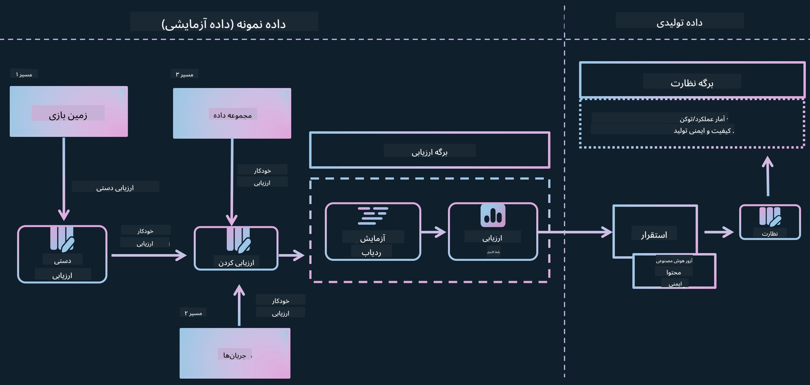

*منبع تصویر: [ارزیابی برنامه‌های هوش مصنوعی مولد](https://learn.microsoft.com/azure/ai-studio/concepts/evaluation-approach-gen-ai?wt.mc_id%3Dstudentamb_279723)*

> [!NOTE]
>
> برای اطلاعات دقیق‌تر و دسترسی به منابع بیشتر درباره Phi-3 / Phi-3.5، لطفاً به [Phi-3CookBook](https://github.com/microsoft/Phi-3CookBook?wt.mc_id=studentamb_279723) مراجعه کنید.

### پیش‌نیازها

- [Python](https://www.python.org/downloads)
- [اشتراک Azure](https://azure.microsoft.com/free?wt.mc_id=studentamb_279723)
- [Visual Studio Code](https://code.visualstudio.com)
- مدل تنظیم‌شده Phi-3 / Phi-3.5

### فهرست مطالب

1. [**سناریو ۱: معرفی ارزیابی Prompt flow در Azure AI Foundry**](../../../../../../md/02.Application/01.TextAndChat/Phi3)

    - [معرفی ارزیابی ایمنی](../../../../../../md/02.Application/01.TextAndChat/Phi3)
    - [معرفی ارزیابی عملکرد](../../../../../../md/02.Application/01.TextAndChat/Phi3)

1. [**سناریو ۲: ارزیابی مدل Phi-3 / Phi-3.5 در Azure AI Foundry**](../../../../../../md/02.Application/01.TextAndChat/Phi3)

    - [قبل از شروع](../../../../../../md/02.Application/01.TextAndChat/Phi3)
    - [استقرار Azure OpenAI برای ارزیابی مدل Phi-3 / Phi-3.5](../../../../../../md/02.Application/01.TextAndChat/Phi3)
    - [ارزیابی مدل تنظیم‌شده Phi-3 / Phi-3.5 با استفاده از ارزیابی Prompt flow در Azure AI Foundry](../../../../../../md/02.Application/01.TextAndChat/Phi3)

1. [تبریک!](../../../../../../md/02.Application/01.TextAndChat/Phi3)

## **سناریو ۱: معرفی ارزیابی Prompt flow در Azure AI Foundry**

### معرفی ارزیابی ایمنی

برای اطمینان از اخلاقی و ایمن بودن مدل هوش مصنوعی شما، ارزیابی آن بر اساس اصول هوش مصنوعی مسئولانه مایکروسافت بسیار مهم است. در Azure AI Foundry، ارزیابی‌های ایمنی به شما امکان می‌دهد آسیب‌پذیری مدل خود در برابر حملات jailbreak و پتانسیل آن برای تولید محتوای مضر را ارزیابی کنید که مستقیماً با این اصول همسو است.

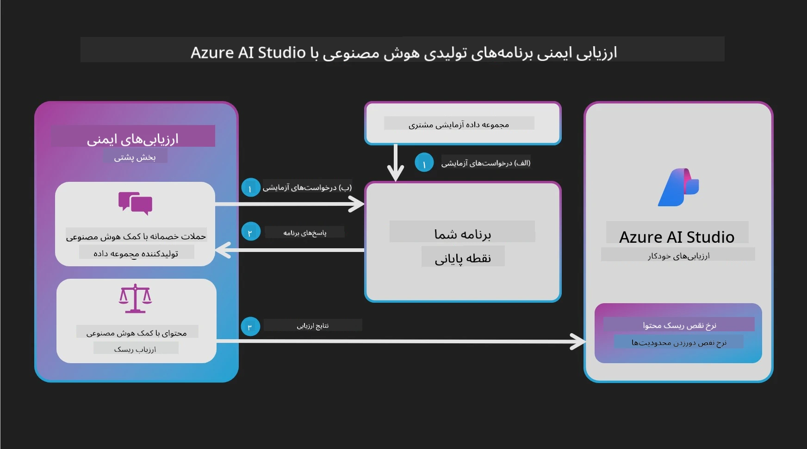

*منبع تصویر: [ارزیابی برنامه‌های هوش مصنوعی مولد](https://learn.microsoft.com/azure/ai-studio/concepts/evaluation-approach-gen-ai?wt.mc_id%3Dstudentamb_279723)*

#### اصول هوش مصنوعی مسئولانه مایکروسافت

قبل از شروع مراحل فنی، درک اصول هوش مصنوعی مسئولانه مایکروسافت ضروری است؛ چارچوب اخلاقی که برای هدایت توسعه، استقرار و عملکرد مسئولانه سیستم‌های هوش مصنوعی طراحی شده است. این اصول راهنمای طراحی، توسعه و استقرار مسئولانه سیستم‌های هوش مصنوعی هستند و تضمین می‌کنند که فناوری‌های هوش مصنوعی به شکلی عادلانه، شفاف و فراگیر ساخته شوند. این اصول پایه‌ای برای ارزیابی ایمنی مدل‌های هوش مصنوعی هستند.

اصول هوش مصنوعی مسئولانه مایکروسافت شامل موارد زیر است:

- **عدالت و فراگیری**: سیستم‌های هوش مصنوعی باید با همه به طور عادلانه رفتار کنند و از تأثیرگذاری متفاوت بر گروه‌های مشابه خودداری کنند. به عنوان مثال، وقتی سیستم‌های هوش مصنوعی در زمینه درمان پزشکی، درخواست‌های وام یا استخدام راهنمایی می‌دهند، باید به همه کسانی که علائم، شرایط مالی یا صلاحیت‌های حرفه‌ای مشابه دارند، توصیه‌های یکسانی ارائه دهند.

- **قابلیت اطمینان و ایمنی**: برای ایجاد اعتماد، ضروری است که سیستم‌های هوش مصنوعی به طور قابل اعتماد، ایمن و مداوم عمل کنند. این سیستم‌ها باید بتوانند همانطور که طراحی شده‌اند عمل کنند، به شرایط غیرمنتظره به صورت ایمن پاسخ دهند و در برابر دستکاری‌های مضر مقاومت کنند. رفتار آنها و تنوع شرایطی که می‌توانند مدیریت کنند، بازتابی از موقعیت‌ها و شرایطی است که توسعه‌دهندگان در طول طراحی و آزمایش پیش‌بینی کرده‌اند.

- **شفافیت**: وقتی سیستم‌های هوش مصنوعی به تصمیم‌گیری‌هایی کمک می‌کنند که تأثیرات بزرگی بر زندگی افراد دارند، ضروری است که مردم بفهمند این تصمیمات چگونه گرفته شده‌اند. به عنوان مثال، یک بانک ممکن است از سیستم هوش مصنوعی برای تصمیم‌گیری درباره اعتبارسنجی یک فرد استفاده کند. یک شرکت ممکن است از سیستم هوش مصنوعی برای تعیین واجد شرایط‌ترین کاندیداها برای استخدام بهره ببرد.

- **حریم خصوصی و امنیت**: با گسترش هوش مصنوعی، حفاظت از حریم خصوصی و امنیت اطلاعات شخصی و تجاری اهمیت و پیچیدگی بیشتری پیدا می‌کند. با هوش مصنوعی، حریم خصوصی و امنیت داده‌ها نیازمند توجه دقیق هستند زیرا دسترسی به داده‌ها برای سیستم‌های هوش مصنوعی جهت ارائه پیش‌بینی‌ها و تصمیمات دقیق و آگاهانه درباره افراد ضروری است.

- **پاسخگویی**: افرادی که سیستم‌های هوش مصنوعی را طراحی و استقرار می‌دهند باید مسئول عملکرد سیستم‌های خود باشند. سازمان‌ها باید از استانداردهای صنعتی برای توسعه هنجارهای پاسخگویی بهره ببرند. این هنجارها می‌توانند تضمین کنند که سیستم‌های هوش مصنوعی مرجع نهایی در هیچ تصمیمی که بر زندگی افراد تأثیر می‌گذارد، نباشند و همچنین اطمینان دهند که انسان‌ها کنترل معناداری بر سیستم‌های هوش مصنوعی بسیار خودکار دارند.

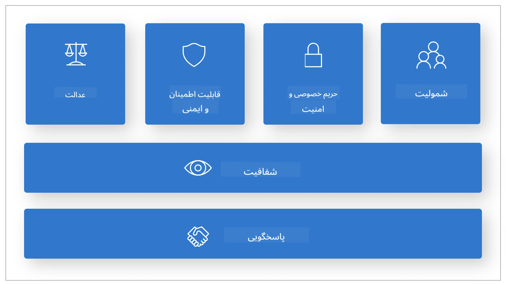

*منبع تصویر: [هوش مصنوعی مسئولانه چیست؟](https://learn.microsoft.com/azure/machine-learning/concept-responsible-ai?view=azureml-api-2&viewFallbackFrom=azureml-api-2%253fwt.mc_id%3Dstudentamb_279723)*

> [!NOTE]
> برای کسب اطلاعات بیشتر درباره اصول هوش مصنوعی مسئولانه مایکروسافت، به [هوش مصنوعی مسئولانه چیست؟](https://learn.microsoft.com/azure/machine-learning/concept-responsible-ai?view=azureml-api-2?wt.mc_id=studentamb_279723) مراجعه کنید.

#### معیارهای ایمنی

در این آموزش، ایمنی مدل تنظیم‌شده Phi-3 را با استفاده از معیارهای ایمنی Azure AI Foundry ارزیابی خواهید کرد. این معیارها به شما کمک می‌کنند تا پتانسیل مدل برای تولید محتوای مضر و آسیب‌پذیری آن در برابر حملات jailbreak را بسنجید. معیارهای ایمنی شامل موارد زیر است:

- **محتوای مرتبط با خودآسیبی**: ارزیابی می‌کند که آیا مدل تمایل به تولید محتوای مرتبط با خودآسیبی دارد یا خیر.
- **محتوای نفرت‌انگیز و ناعادلانه**: ارزیابی می‌کند که آیا مدل تمایل به تولید محتوای نفرت‌انگیز یا ناعادلانه دارد یا خیر.
- **محتوای خشونت‌آمیز**: ارزیابی می‌کند که آیا مدل تمایل به تولید محتوای خشونت‌آمیز دارد یا خیر.
- **محتوای جنسی**: ارزیابی می‌کند که آیا مدل تمایل به تولید محتوای جنسی نامناسب دارد یا خیر.

ارزیابی این جنبه‌ها تضمین می‌کند که مدل هوش مصنوعی محتوای مضر یا توهین‌آمیز تولید نکند و با ارزش‌های اجتماعی و استانداردهای قانونی همسو باشد.

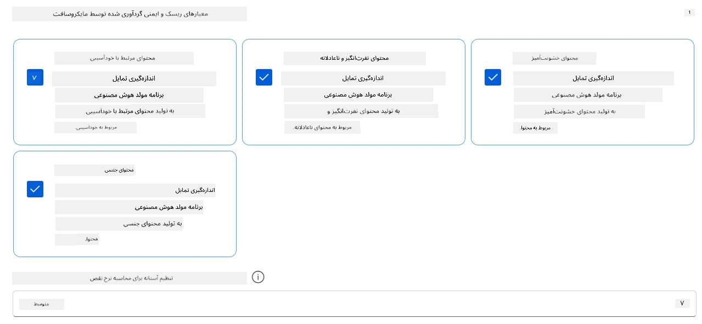

### معرفی ارزیابی عملکرد

برای اطمینان از اینکه مدل هوش مصنوعی شما طبق انتظار عمل می‌کند، ارزیابی عملکرد آن بر اساس معیارهای عملکرد اهمیت دارد. در Azure AI Foundry، ارزیابی‌های عملکرد به شما امکان می‌دهد اثربخشی مدل خود را در تولید پاسخ‌های دقیق، مرتبط و منسجم بسنجید.


*منبع تصویر: [ارزیابی برنامه‌های هوش مصنوعی مولد](https://learn.microsoft.com/azure/ai-studio/concepts/evaluation-approach-gen-ai?wt.mc_id%3Dstudentamb_279723)*

#### معیارهای عملکرد

در این آموزش، عملکرد مدل تنظیم‌شده Phi-3 / Phi-3.5 را با استفاده از معیارهای عملکرد Azure AI Foundry ارزیابی خواهید کرد. این معیارها به شما کمک می‌کنند اثربخشی مدل را در تولید پاسخ‌های دقیق، مرتبط و منسجم بسنجید. معیارهای عملکرد شامل موارد زیر است:

- **مبنایی بودن (Groundedness)**: ارزیابی می‌کند که پاسخ‌های تولید شده چقدر با اطلاعات منبع ورودی همخوانی دارند.
- **ارتباط (Relevance)**: میزان مرتبط بودن پاسخ‌های تولید شده با سوالات داده شده را ارزیابی می‌کند.
- **انسجام (Coherence)**: ارزیابی می‌کند که متن تولید شده چقدر روان است، به طور طبیعی خوانده می‌شود و شبیه زبان انسانی است.
- **روان بودن (Fluency)**: مهارت زبانی متن تولید شده را ارزیابی می‌کند.
- **شباهت به GPT (GPT Similarity)**: پاسخ تولید شده را با حقیقت زمینه‌ای برای میزان شباهت مقایسه می‌کند.
- **امتیاز F1 (F1 Score)**: نسبت کلمات مشترک بین پاسخ تولید شده و داده‌های منبع را محاسبه می‌کند.

این معیارها به شما کمک می‌کنند اثربخشی مدل را در تولید پاسخ‌های دقیق، مرتبط و منسجم ارزیابی کنید.

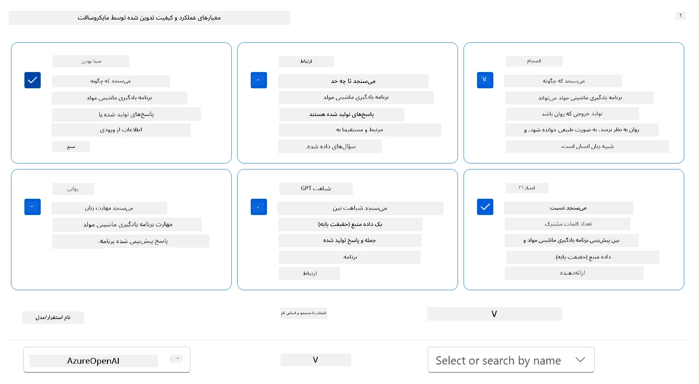

## **سناریو ۲: ارزیابی مدل Phi-3 / Phi-3.5 در Azure AI Foundry**

### قبل از شروع

این آموزش ادامه پست‌های قبلی وبلاگ، "[تنظیم دقیق و یکپارچه‌سازی مدل‌های سفارشی Phi-3 با Prompt Flow: راهنمای گام‌به‌گام](https://techcommunity.microsoft.com/t5/educator-developer-blog/fine-tune-and-integrate-custom-phi-3-models-with-prompt-flow/ba-p/4178612?wt.mc_id=studentamb_279723)" و "[تنظیم دقیق و یکپارچه‌سازی مدل‌های سفارشی Phi-3 با Prompt Flow در Azure AI Foundry](https://techcommunity.microsoft.com/t5/educator-developer-blog/fine-tune-and-integrate-custom-phi-3-models-with-prompt-flow-in/ba-p/4191726?wt.mc_id=studentamb_279723)" است. در این پست‌ها، فرآیند تنظیم دقیق مدل Phi-3 / Phi-3.5 در Azure AI Foundry و یکپارچه‌سازی آن با Prompt flow را مرور کردیم.

در این آموزش، شما یک مدل Azure OpenAI را به عنوان ارزیاب در Azure AI Foundry مستقر می‌کنید و از آن برای ارزیابی مدل تنظیم‌شده Phi-3 / Phi-3.5 خود استفاده خواهید کرد.

قبل از شروع این آموزش، مطمئن شوید که پیش‌نیازهای زیر را دارید، همانطور که در آموزش‌های قبلی توضیح داده شده است:

1. یک مجموعه داده آماده برای ارزیابی مدل تنظیم‌شده Phi-3 / Phi-3.5.
2. یک مدل Phi-3 / Phi-3.5 که تنظیم دقیق شده و در Azure Machine Learning مستقر شده است.
3. یک Prompt flow که با مدل تنظیم‌شده Phi-3 / Phi-3.5 شما در Azure AI Foundry یکپارچه شده است.

> [!NOTE]
> شما از فایل *test_data.jsonl* که در پوشه داده‌ها از مجموعه داده **ULTRACHAT_200k** دانلود شده در پست‌های قبلی وبلاگ قرار دارد، به عنوان مجموعه داده برای ارزیابی مدل تنظیم‌شده Phi-3 / Phi-3.5 استفاده خواهید کرد.

#### یکپارچه‌سازی مدل سفارشی Phi-3 / Phi-3.5 با Prompt flow در Azure AI Foundry (رویکرد کدنویسی)
> [!NOTE]
> اگر رویکرد کم‌کد شرح داده شده در "[Fine-Tune and Integrate Custom Phi-3 Models with Prompt Flow in Azure AI Foundry](https://techcommunity.microsoft.com/t5/educator-developer-blog/fine-tune-and-integrate-custom-phi-3-models-with-prompt-flow-in/ba-p/4191726?wt.mc_id=studentamb_279723)" را دنبال کرده‌اید، می‌توانید این تمرین را رد کنید و به تمرین بعدی بروید.
> با این حال، اگر رویکرد کد-محور شرح داده شده در "[Fine-Tune and Integrate Custom Phi-3 Models with Prompt Flow: Step-by-Step Guide](https://techcommunity.microsoft.com/t5/educator-developer-blog/fine-tune-and-integrate-custom-phi-3-models-with-prompt-flow/ba-p/4178612?wt.mc_id=studentamb_279723)" را برای تنظیم دقیق و استقرار مدل Phi-3 / Phi-3.5 خود دنبال کرده‌اید، روند اتصال مدل به Prompt flow کمی متفاوت است. شما این روند را در این تمرین خواهید آموخت.
برای ادامه، باید مدل Phi-3 / Phi-3.5 تنظیم‌شده خود را در Prompt flow در Azure AI Foundry ادغام کنید.

#### ایجاد Azure AI Foundry Hub

قبل از ایجاد پروژه، باید یک Hub بسازید. Hub مانند یک Resource Group عمل می‌کند و به شما امکان می‌دهد چندین پروژه را در Azure AI Foundry سازماندهی و مدیریت کنید.

1. وارد [Azure AI Foundry](https://ai.azure.com/?wt.mc_id=studentamb_279723) شوید.

1. از تب سمت چپ، **All hubs** را انتخاب کنید.

1. از منوی ناوبری، **+ New hub** را انتخاب کنید.

    

1. کارهای زیر را انجام دهید:

    - نام **Hub** را وارد کنید. این نام باید منحصر به فرد باشد.
    - اشتراک Azure خود را انتخاب کنید.
    - گروه منابع (**Resource group**) مورد نظر را انتخاب کنید (در صورت نیاز یک گروه جدید بسازید).
    - موقعیت مکانی (**Location**) مورد نظر خود را انتخاب کنید.
    - سرویس‌های Azure AI که می‌خواهید متصل کنید را انتخاب کنید (در صورت نیاز یک سرویس جدید بسازید).
    - گزینه **Connect Azure AI Search** را روی **Skip connecting** تنظیم کنید.

    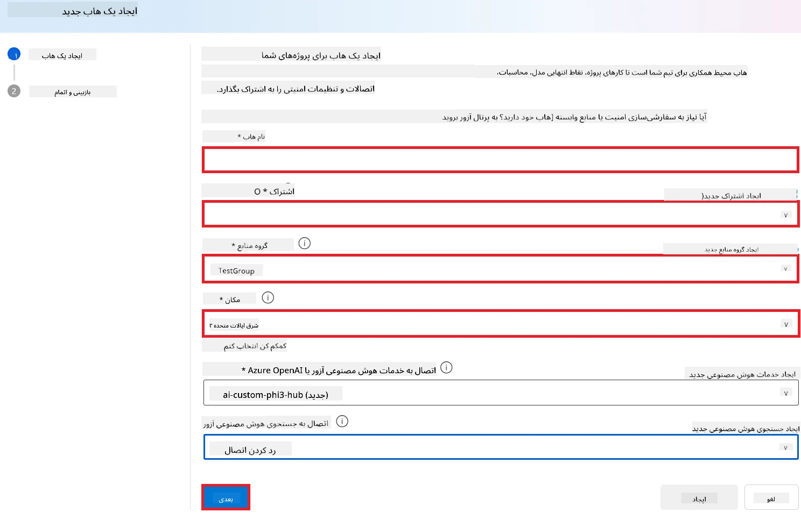

1. روی **Next** کلیک کنید.

#### ایجاد پروژه Azure AI Foundry

1. در Hub ساخته شده، از تب سمت چپ **All projects** را انتخاب کنید.

1. از منوی ناوبری، **+ New project** را انتخاب کنید.

    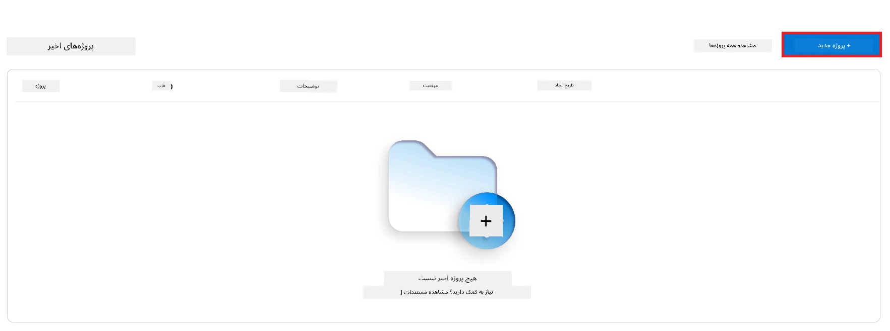

1. نام پروژه (**Project name**) را وارد کنید. این نام باید منحصر به فرد باشد.

    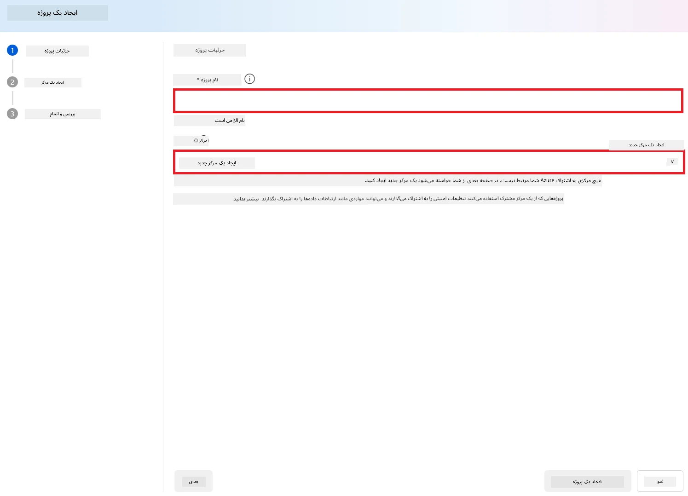

1. روی **Create a project** کلیک کنید.

#### افزودن اتصال سفارشی برای مدل تنظیم‌شده Phi-3 / Phi-3.5

برای ادغام مدل سفارشی Phi-3 / Phi-3.5 خود با Prompt flow، باید نقطه پایان (endpoint) و کلید مدل را در یک اتصال سفارشی ذخیره کنید. این تنظیمات دسترسی به مدل سفارشی شما را در Prompt flow فراهم می‌کند.

#### تنظیم کلید API و آدرس endpoint مدل تنظیم‌شده Phi-3 / Phi-3.5

1. به [Azure ML Studio](https://ml.azure.com/home?wt.mc_id=studentamb_279723) مراجعه کنید.

1. به فضای کاری Azure Machine learning که ساخته‌اید بروید.

1. از تب سمت چپ، **Endpoints** را انتخاب کنید.

    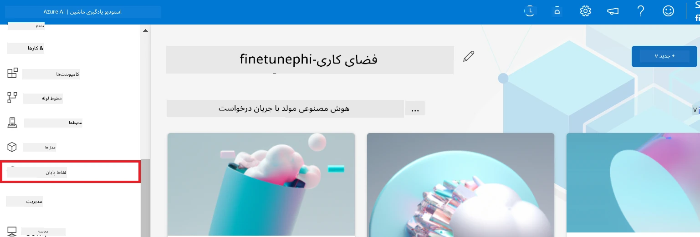

1. نقطه پایانی که ساخته‌اید را انتخاب کنید.

    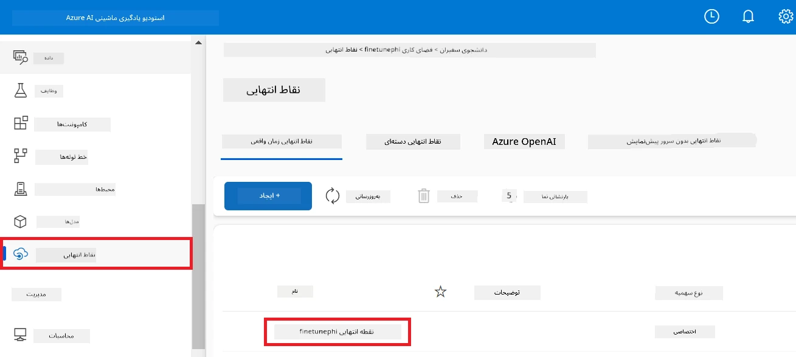

1. از منوی ناوبری، **Consume** را انتخاب کنید.

1. **REST endpoint** و **Primary key** خود را کپی کنید.

    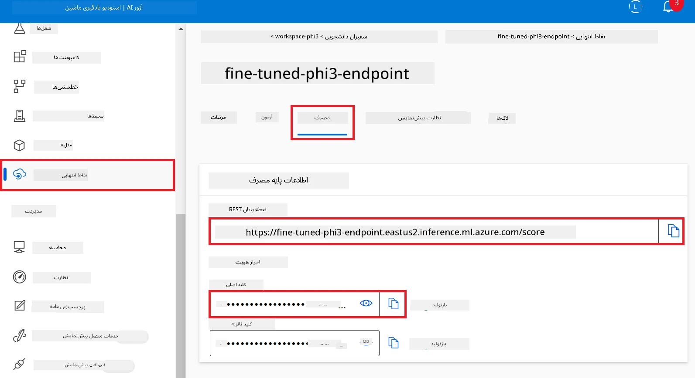

#### افزودن اتصال سفارشی

1. به [Azure AI Foundry](https://ai.azure.com/?wt.mc_id=studentamb_279723) مراجعه کنید.

1. به پروژه Azure AI Foundry که ساخته‌اید بروید.

1. در پروژه ساخته شده، از تب سمت چپ **Settings** را انتخاب کنید.

1. روی **+ New connection** کلیک کنید.

    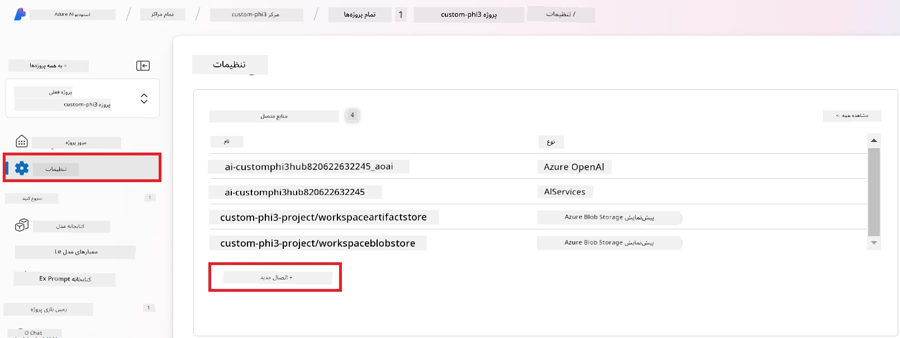

1. از منوی ناوبری، **Custom keys** را انتخاب کنید.

    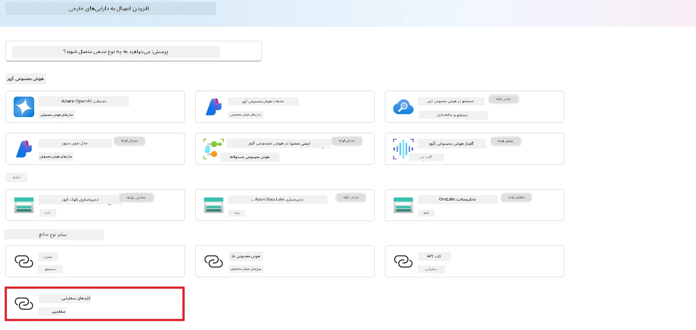

1. کارهای زیر را انجام دهید:

    - روی **+ Add key value pairs** کلیک کنید.
    - برای نام کلید، **endpoint** را وارد کنید و آدرس endpoint که از Azure ML Studio کپی کرده‌اید را در فیلد مقدار قرار دهید.
    - دوباره روی **+ Add key value pairs** کلیک کنید.
    - برای نام کلید، **key** را وارد کنید و کلیدی که از Azure ML Studio کپی کرده‌اید را در فیلد مقدار قرار دهید.
    - پس از افزودن کلیدها، گزینه **is secret** را فعال کنید تا کلیدها مخفی بمانند.

    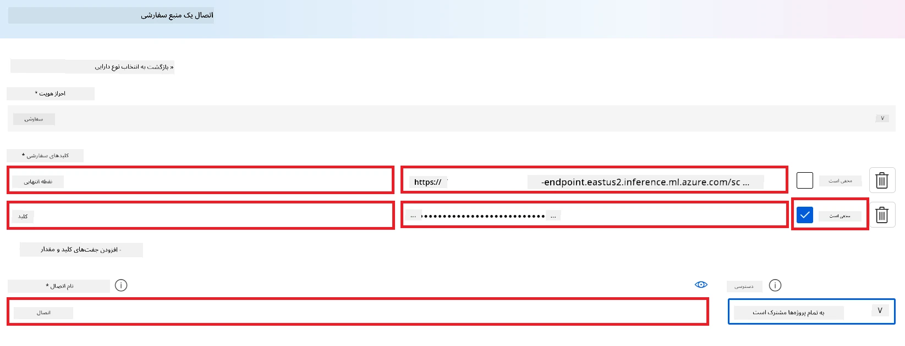

1. روی **Add connection** کلیک کنید.

#### ایجاد Prompt flow

شما یک اتصال سفارشی در Azure AI Foundry اضافه کرده‌اید. حالا بیایید با مراحل زیر یک Prompt flow بسازیم. سپس این Prompt flow را به اتصال سفارشی متصل می‌کنیم تا از مدل تنظیم‌شده در Prompt flow استفاده کنیم.

1. به پروژه Azure AI Foundry که ساخته‌اید بروید.

1. از تب سمت چپ، **Prompt flow** را انتخاب کنید.

1. از منوی ناوبری، **+ Create** را انتخاب کنید.

    

1. از منوی ناوبری، **Chat flow** را انتخاب کنید.

    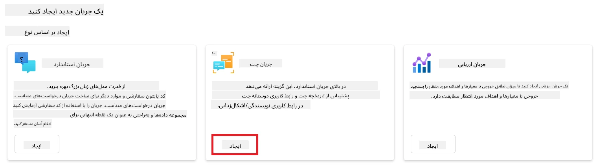

1. نام پوشه (**Folder name**) مورد نظر را وارد کنید.

    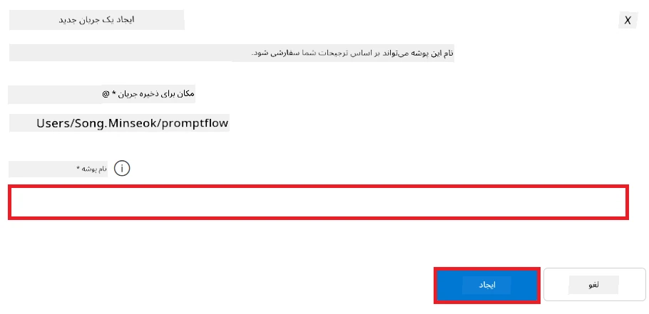

1. روی **Create** کلیک کنید.

#### تنظیم Prompt flow برای گفتگو با مدل سفارشی Phi-3 / Phi-3.5

شما باید مدل تنظیم‌شده Phi-3 / Phi-3.5 را در یک Prompt flow ادغام کنید. با این حال، Prompt flow موجود برای این منظور طراحی نشده است. بنابراین باید Prompt flow را بازطراحی کنید تا امکان ادغام مدل سفارشی فراهم شود.

1. در Prompt flow، کارهای زیر را برای بازسازی جریان موجود انجام دهید:

    - حالت **Raw file mode** را انتخاب کنید.
    - تمام کدهای موجود در فایل *flow.dag.yml* را حذف کنید.
    - کد زیر را به *flow.dag.yml* اضافه کنید.

        ```yml
        inputs:
          input_data:
            type: string
            default: "Who founded Microsoft?"

        outputs:
          answer:
            type: string
            reference: ${integrate_with_promptflow.output}

        nodes:
        - name: integrate_with_promptflow
          type: python
          source:
            type: code
            path: integrate_with_promptflow.py
          inputs:
            input_data: ${inputs.input_data}
        ```

    - روی **Save** کلیک کنید.

    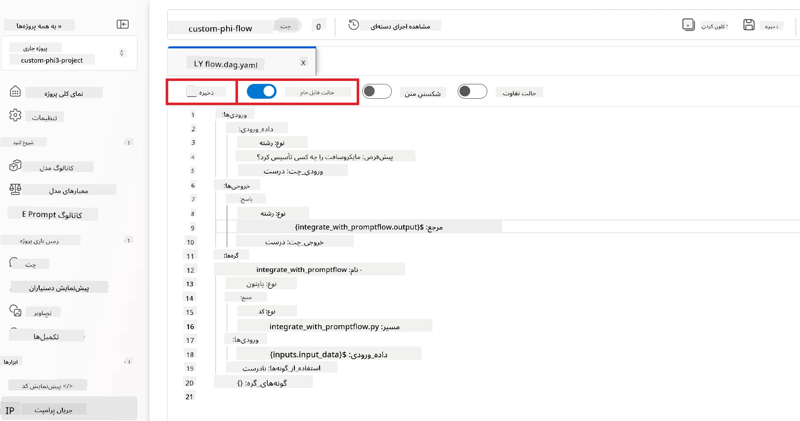

1. کد زیر را به فایل *integrate_with_promptflow.py* اضافه کنید تا از مدل سفارشی Phi-3 / Phi-3.5 در Prompt flow استفاده شود.

    ```python
    import logging
    import requests
    from promptflow import tool
    from promptflow.connections import CustomConnection

    # Logging setup
    logging.basicConfig(
        format="%(asctime)s - %(levelname)s - %(name)s - %(message)s",
        datefmt="%Y-%m-%d %H:%M:%S",
        level=logging.DEBUG
    )
    logger = logging.getLogger(__name__)

    def query_phi3_model(input_data: str, connection: CustomConnection) -> str:
        """
        Send a request to the Phi-3 / Phi-3.5 model endpoint with the given input data using Custom Connection.
        """

        # "connection" is the name of the Custom Connection, "endpoint", "key" are the keys in the Custom Connection
        endpoint_url = connection.endpoint
        api_key = connection.key

        headers = {
            "Content-Type": "application/json",
            "Authorization": f"Bearer {api_key}"
        }
    data = {
        "input_data": [input_data],
        "params": {
            "temperature": 0.7,
            "max_new_tokens": 128,
            "do_sample": True,
            "return_full_text": True
            }
        }
        try:
            response = requests.post(endpoint_url, json=data, headers=headers)
            response.raise_for_status()
            
            # Log the full JSON response
            logger.debug(f"Full JSON response: {response.json()}")

            result = response.json()["output"]
            logger.info("Successfully received response from Azure ML Endpoint.")
            return result
        except requests.exceptions.RequestException as e:
            logger.error(f"Error querying Azure ML Endpoint: {e}")
            raise

    @tool
    def my_python_tool(input_data: str, connection: CustomConnection) -> str:
        """
        Tool function to process input data and query the Phi-3 / Phi-3.5 model.
        """
        return query_phi3_model(input_data, connection)

    ```

    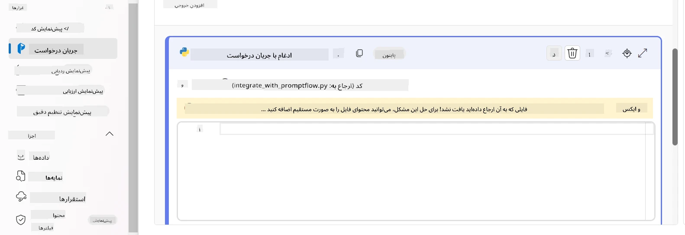

> [!NOTE]
> برای اطلاعات بیشتر درباره استفاده از Prompt flow در Azure AI Foundry، می‌توانید به [Prompt flow in Azure AI Foundry](https://learn.microsoft.com/azure/ai-studio/how-to/prompt-flow) مراجعه کنید.

1. گزینه‌های **Chat input** و **Chat output** را برای فعال‌سازی گفتگو با مدل خود انتخاب کنید.

    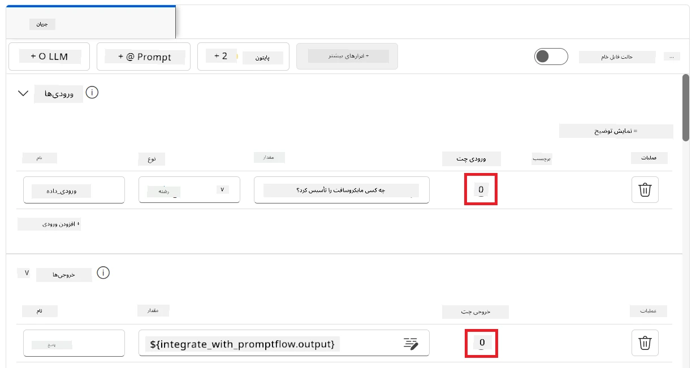

1. اکنون آماده‌اید تا با مدل سفارشی Phi-3 / Phi-3.5 خود گفتگو کنید. در تمرین بعدی، یاد می‌گیرید چگونه Prompt flow را اجرا کرده و از آن برای گفتگو با مدل تنظیم‌شده استفاده کنید.

> [!NOTE]
>
> جریان بازسازی شده باید شبیه تصویر زیر باشد:
>
> 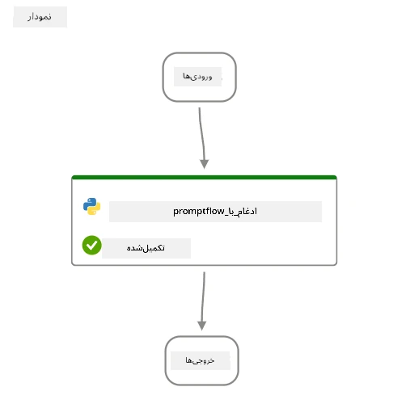
>

#### شروع Prompt flow

1. روی **Start compute sessions** کلیک کنید تا Prompt flow شروع شود.

    

1. روی **Validate and parse input** کلیک کنید تا پارامترها به‌روزرسانی شوند.

    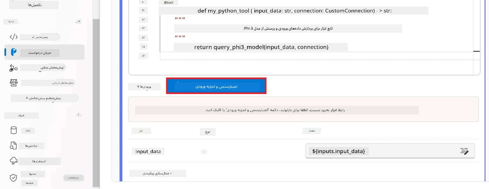

1. مقدار **connection** را به اتصال سفارشی که ساخته‌اید انتخاب کنید. برای مثال، *connection*.

    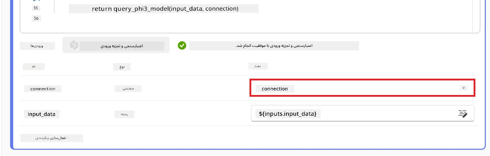

#### گفتگو با مدل سفارشی Phi-3 / Phi-3.5

1. روی **Chat** کلیک کنید.

    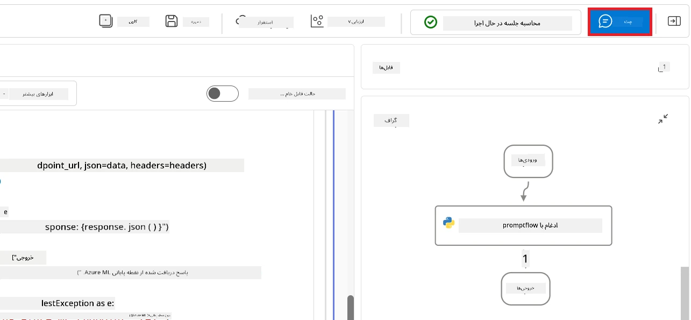

1. در اینجا نمونه‌ای از نتایج آمده است: اکنون می‌توانید با مدل سفارشی Phi-3 / Phi-3.5 خود گفتگو کنید. توصیه می‌شود سوالات خود را بر اساس داده‌های استفاده شده برای تنظیم مدل مطرح کنید.

    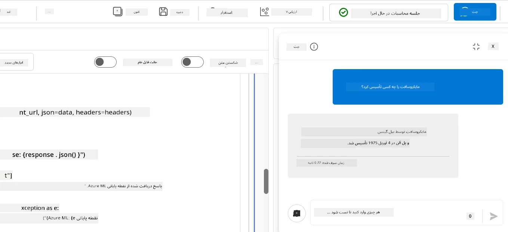

### استقرار Azure OpenAI برای ارزیابی مدل Phi-3 / Phi-3.5

برای ارزیابی مدل Phi-3 / Phi-3.5 در Azure AI Foundry، باید یک مدل Azure OpenAI مستقر کنید. این مدل برای ارزیابی عملکرد مدل Phi-3 / Phi-3.5 استفاده خواهد شد.

#### استقرار Azure OpenAI

1. وارد [Azure AI Foundry](https://ai.azure.com/?wt.mc_id=studentamb_279723) شوید.

1. به پروژه Azure AI Foundry که ساخته‌اید بروید.

    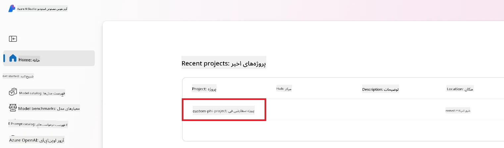

1. در پروژه ساخته شده، از تب سمت چپ **Deployments** را انتخاب کنید.

1. از منوی ناوبری، **+ Deploy model** را انتخاب کنید.

1. گزینه **Deploy base model** را انتخاب کنید.

    

1. مدل Azure OpenAI مورد نظر خود را انتخاب کنید. برای مثال، **gpt-4o**.

    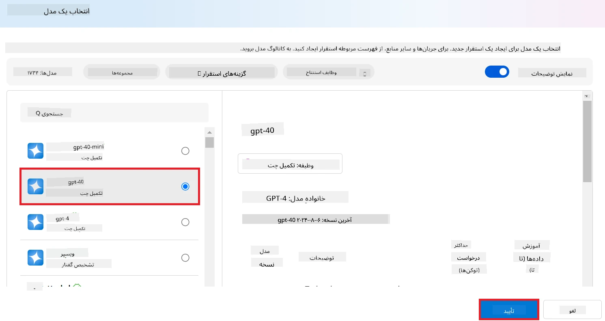

1. روی **Confirm** کلیک کنید.

### ارزیابی مدل تنظیم‌شده Phi-3 / Phi-3.5 با استفاده از ارزیابی Prompt flow در Azure AI Foundry

### شروع یک ارزیابی جدید

1. به [Azure AI Foundry](https://ai.azure.com/?wt.mc_id=studentamb_279723) مراجعه کنید.

1. به پروژه Azure AI Foundry که ساخته‌اید بروید.

    

1. در پروژه ساخته شده، از تب سمت چپ **Evaluation** را انتخاب کنید.

1. از منوی ناوبری، **+ New evaluation** را انتخاب کنید.

    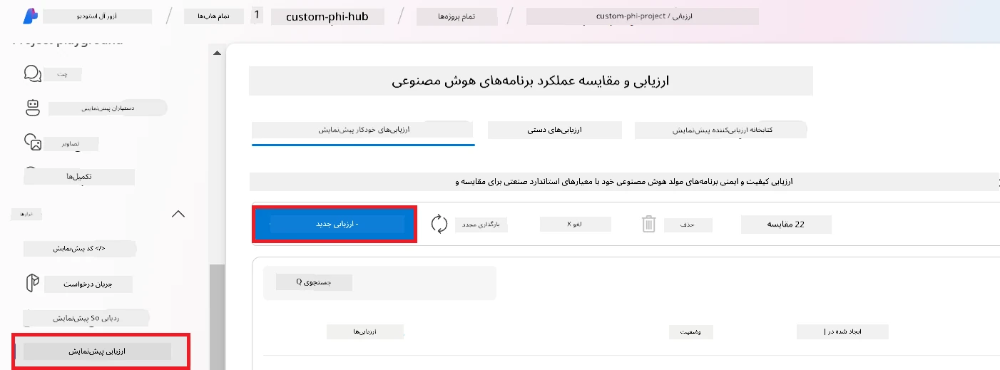

1. ارزیابی **Prompt flow** را انتخاب کنید.

    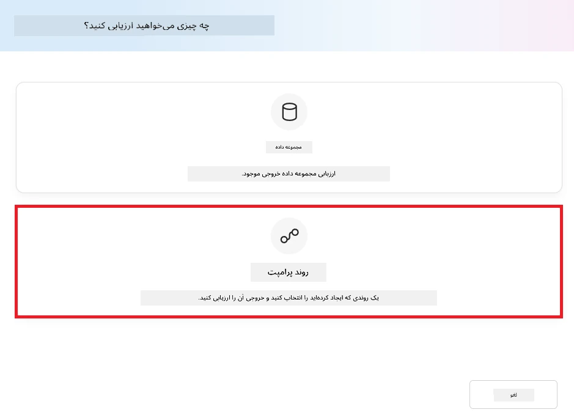

1. کارهای زیر را انجام دهید:

    - نام ارزیابی را وارد کنید. این نام باید منحصر به فرد باشد.
    - نوع کار را روی **Question and answer without context** تنظیم کنید، زیرا مجموعه داده **UlTRACHAT_200k** استفاده شده در این آموزش فاقد زمینه است.
    - Prompt flow مورد نظر برای ارزیابی را انتخاب کنید.

    

1. روی **Next** کلیک کنید.

1. کارهای زیر را انجام دهید:

    - روی **Add your dataset** کلیک کنید تا مجموعه داده را بارگذاری کنید. برای مثال، می‌توانید فایل مجموعه داده آزمایشی مانند *test_data.json1* را که همراه با مجموعه داده **ULTRACHAT_200k** ارائه شده است، بارگذاری کنید.
    - ستون مناسب مجموعه داده را انتخاب کنید که با داده‌های شما مطابقت دارد. برای مثال، اگر از مجموعه داده **ULTRACHAT_200k** استفاده می‌کنید، ستون **${data.prompt}** را انتخاب کنید.

    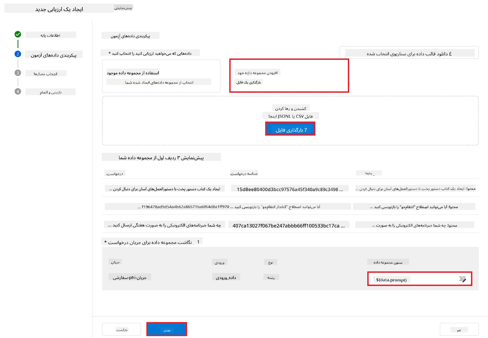

1. روی **Next** کلیک کنید.

1. برای پیکربندی معیارهای عملکرد و کیفیت، کارهای زیر را انجام دهید:

    - معیارهای عملکرد و کیفیت مورد نظر خود را انتخاب کنید.
    - مدل Azure OpenAI که برای ارزیابی ساخته‌اید را انتخاب کنید. برای مثال، **gpt-4o**.

    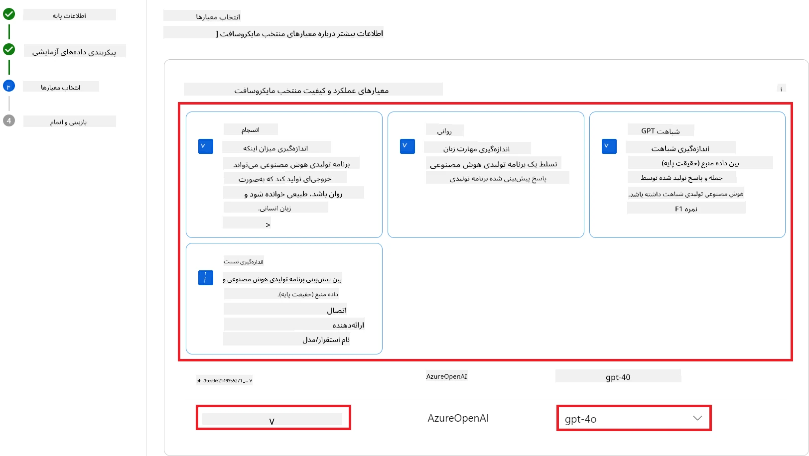

1. برای پیکربندی معیارهای ریسک و ایمنی، کارهای زیر را انجام دهید:

    - معیارهای ریسک و ایمنی مورد نظر خود را انتخاب کنید.
    - آستانه‌ای برای محاسبه نرخ خطا انتخاب کنید. برای مثال، **Medium**.
    - برای **question**، منبع داده را روی **{$data.prompt}** تنظیم کنید.
    - برای **answer**، منبع داده را روی **{$run.outputs.answer}** تنظیم کنید.
    - برای **ground_truth**، منبع داده را روی **{$data.message}** تنظیم کنید.

    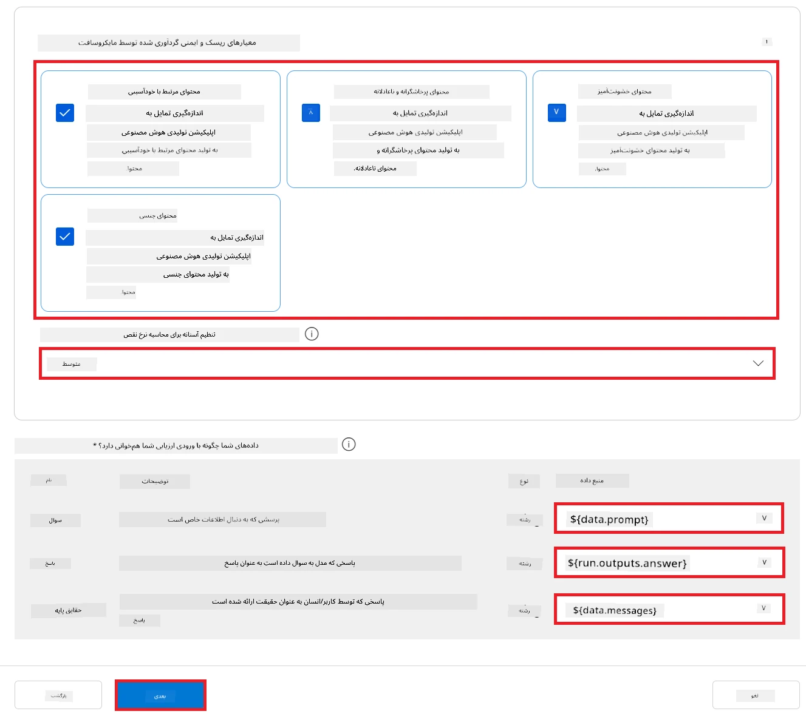

1. روی **Next** کلیک کنید.

1. روی **Submit** کلیک کنید تا ارزیابی آغاز شود.

1. ارزیابی مدتی طول می‌کشد تا کامل شود. می‌توانید پیشرفت را در تب **Evaluation** دنبال کنید.

### مرور نتایج ارزیابی
> [!NOTE]
> نتایج ارائه شده در زیر برای نشان دادن روند ارزیابی است. در این آموزش، از مدلی استفاده کرده‌ایم که روی یک مجموعه داده نسبتاً کوچک تنظیم شده است، که ممکن است منجر به نتایج کمتر بهینه شود. نتایج واقعی ممکن است بسته به اندازه، کیفیت و تنوع مجموعه داده استفاده شده و همچنین پیکربندی خاص مدل، به طور قابل توجهی متفاوت باشد.
پس از اتمام ارزیابی، می‌توانید نتایج مربوط به معیارهای عملکرد و ایمنی را بررسی کنید.

1. معیارهای عملکرد و کیفیت:

    - اثربخشی مدل در تولید پاسخ‌های منسجم، روان و مرتبط را ارزیابی کنید.

    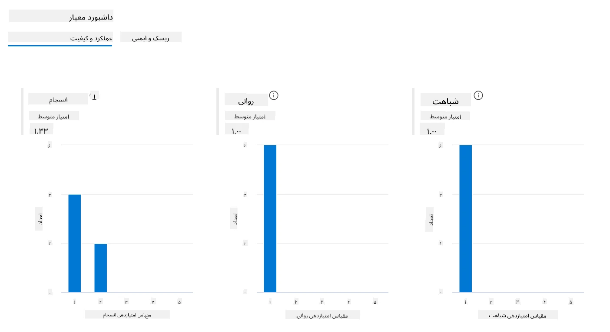

1. معیارهای ریسک و ایمنی:

    - اطمینان حاصل کنید که خروجی‌های مدل ایمن بوده و با اصول هوش مصنوعی مسئولانه هم‌راستا هستند و از هرگونه محتوای مضر یا توهین‌آمیز اجتناب می‌کنند.

    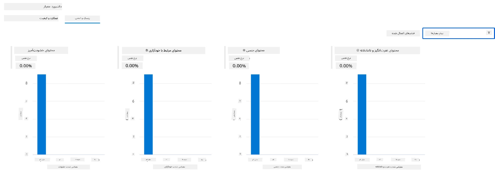

1. می‌توانید برای مشاهده **نتایج دقیق معیارها** به پایین صفحه اسکرول کنید.

    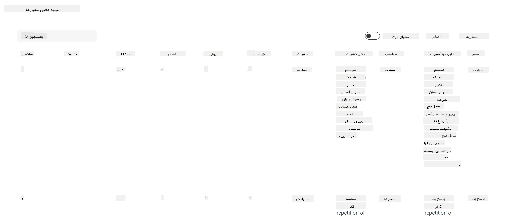

1. با ارزیابی مدل سفارشی Phi-3 / Phi-3.5 خود بر اساس معیارهای عملکرد و ایمنی، می‌توانید تأیید کنید که مدل نه تنها مؤثر است، بلکه به اصول هوش مصنوعی مسئولانه پایبند بوده و آماده استفاده در دنیای واقعی است.

## تبریک!

### شما این آموزش را به پایان رساندید

شما با موفقیت مدل Phi-3 تنظیم‌شده را که با Prompt flow در Azure AI Foundry یکپارچه شده است، ارزیابی کردید. این گامی مهم در اطمینان از این است که مدل‌های هوش مصنوعی شما نه تنها عملکرد خوبی دارند، بلکه به اصول هوش مصنوعی مسئولانه مایکروسافت پایبند بوده و به شما کمک می‌کنند برنامه‌های هوش مصنوعی قابل اعتماد و مطمئن بسازید.


## پاک‌سازی منابع Azure

برای جلوگیری از هزینه‌های اضافی، منابع Azure خود را پاک کنید. به پرتال Azure بروید و منابع زیر را حذف کنید:

- منبع Azure Machine learning
- نقطه انتهایی مدل Azure Machine learning
- منبع پروژه Azure AI Foundry
- منبع Prompt flow در Azure AI Foundry

### مراحل بعدی

#### مستندات

- [ارزیابی سیستم‌های هوش مصنوعی با استفاده از داشبورد Responsible AI](https://learn.microsoft.com/azure/machine-learning/concept-responsible-ai-dashboard?view=azureml-api-2&source=recommendations?wt.mc_id=studentamb_279723)
- [معیارهای ارزیابی و نظارت برای هوش مصنوعی مولد](https://learn.microsoft.com/azure/ai-studio/concepts/evaluation-metrics-built-in?tabs=definition?wt.mc_id=studentamb_279723)
- [مستندات Azure AI Foundry](https://learn.microsoft.com/azure/ai-studio/?wt.mc_id=studentamb_279723)
- [مستندات Prompt flow](https://microsoft.github.io/promptflow/?wt.mc_id=studentamb_279723)

#### محتوای آموزشی

- [مقدمه‌ای بر رویکرد Responsible AI مایکروسافت](https://learn.microsoft.com/training/modules/introduction-to-microsofts-responsible-ai-approach/?source=recommendations?wt.mc_id=studentamb_279723)
- [مقدمه‌ای بر Azure AI Foundry](https://learn.microsoft.com/training/modules/introduction-to-azure-ai-studio/?wt.mc_id=studentamb_279723)

### منابع

- [هوش مصنوعی مسئولانه چیست؟](https://learn.microsoft.com/azure/machine-learning/concept-responsible-ai?view=azureml-api-2?wt.mc_id=studentamb_279723)
- [معرفی ابزارهای جدید در Azure AI برای کمک به ساخت برنامه‌های هوش مصنوعی مولد امن‌تر و قابل اعتمادتر](https://azure.microsoft.com/blog/announcing-new-tools-in-azure-ai-to-help-you-build-more-secure-and-trustworthy-generative-ai-applications/?wt.mc_id=studentamb_279723)
- [ارزیابی برنامه‌های هوش مصنوعی مولد](https://learn.microsoft.com/azure/ai-studio/concepts/evaluation-approach-gen-ai?wt.mc_id%3Dstudentamb_279723)

**سلب مسئولیت**:  
این سند با استفاده از سرویس ترجمه هوش مصنوعی [Co-op Translator](https://github.com/Azure/co-op-translator) ترجمه شده است. در حالی که ما در تلاش برای دقت هستیم، لطفاً توجه داشته باشید که ترجمه‌های خودکار ممکن است حاوی خطاها یا نواقصی باشند. سند اصلی به زبان بومی خود باید به عنوان منبع معتبر در نظر گرفته شود. برای اطلاعات حیاتی، ترجمه حرفه‌ای انسانی توصیه می‌شود. ما مسئول هیچ گونه سوءتفاهم یا تفسیر نادرستی که از استفاده این ترجمه ناشی شود، نیستیم.