# ارزیابی مدل Phi-3 / Phi-3.5 تخصصی شده در Microsoft Foundry با تمرکز بر اصول هوش مصنوعی مسئولانه مایکروسافت

این نمونه از ابتدا تا انتها (E2E) بر اساس راهنمای "[ارزیابی مدل‌های تخصصی شده Phi-3 / 3.5 در Microsoft Foundry با تمرکز بر هوش مصنوعی مسئولانه مایکروسافت](https://techcommunity.microsoft.com/blog/educatordeveloperblog/evaluate-fine-tuned-phi-3--3-5-models-in-azure-ai-studio-focusing-on-microsofts-/4227850?WT.mc_id=aiml-137032-kinfeylo)" از جامعه فناوری مایکروسافت است.

## مرور کلی

### چگونه می‌توانید ایمنی و عملکرد یک مدل تخصصی شده Phi-3 / Phi-3.5 را در Microsoft Foundry ارزیابی کنید؟

تخصصی کردن یک مدل گاهی می‌تواند منجر به پاسخ‌های ناخواسته یا غیرمطلوب شود. برای اطمینان از اینکه مدل ایمن و کارآمد باقی می‌ماند، مهم است که پتانسیل مدل برای تولید محتوای مضر و توانایی آن را در ارائه پاسخ‌های دقیق، مرتبط و منسجم ارزیابی کنید. در این آموزش، چگونگی ارزیابی ایمنی و عملکرد مدل تخصصی شده Phi-3 / Phi-3.5 که با Prompt flow در Microsoft Foundry یکپارچه شده است را خواهید آموخت.

اینجا فرایند ارزیابی Microsoft Foundry آمده است.

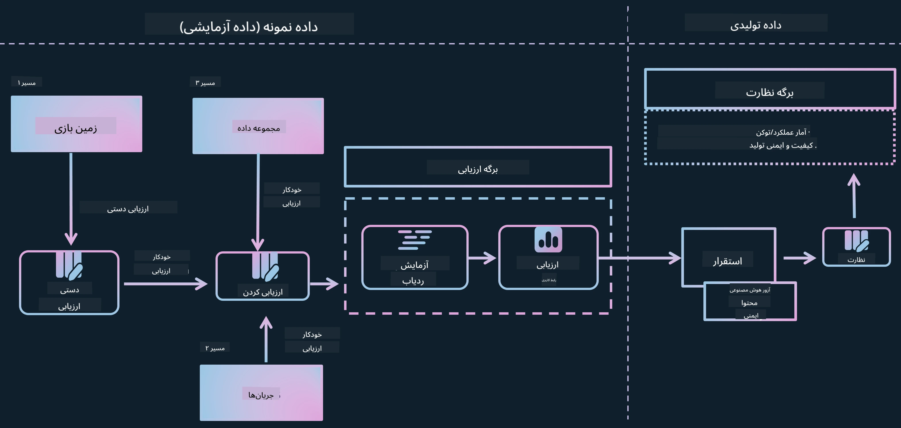

*منبع تصویر: [Evaluation of generative AI applications](https://learn.microsoft.com/azure/ai-studio/concepts/evaluation-approach-gen-ai?wt.mc_id%3Dstudentamb_279723)*

> [!NOTE]
>
> برای اطلاعات دقیق‌تر و دسترسی به منابع بیشتر درباره Phi-3 / Phi-3.5، لطفاً به [Phi-3CookBook](https://github.com/microsoft/Phi-3CookBook?wt.mc_id=studentamb_279723) مراجعه کنید.

### پیش‌نیازها

- [پایتون](https://www.python.org/downloads)
- [اشتراک Azure](https://azure.microsoft.com/free?wt.mc_id=studentamb_279723)
- [ویژوال استودیو کد](https://code.visualstudio.com)
- مدل تخصصی شده Phi-3 / Phi-3.5

### فهرست مطالب

1. [**سناریو ۱: معرفی ارزیابی Prompt flow در Microsoft Foundry**](../../../../../../md/02.Application/01.TextAndChat/Phi3)

    - [معرفی ارزیابی ایمنی](../../../../../../md/02.Application/01.TextAndChat/Phi3)
    - [معرفی ارزیابی عملکرد](../../../../../../md/02.Application/01.TextAndChat/Phi3)

1. [**سناریو ۲: ارزیابی مدل Phi-3 / Phi-3.5 در Microsoft Foundry**](../../../../../../md/02.Application/01.TextAndChat/Phi3)

    - [قبل از شروع](../../../../../../md/02.Application/01.TextAndChat/Phi3)
    - [استقرار Azure OpenAI برای ارزیابی مدل Phi-3 / Phi-3.5](../../../../../../md/02.Application/01.TextAndChat/Phi3)
    - [ارزیابی مدل تخصصی شده Phi-3 / Phi-3.5 با استفاده از ارزیابی Prompt flow در Microsoft Foundry](../../../../../../md/02.Application/01.TextAndChat/Phi3)

1. [تبریک!](../../../../../../md/02.Application/01.TextAndChat/Phi3)

## **سناریو ۱: معرفی ارزیابی Prompt flow در Microsoft Foundry**

### معرفی ارزیابی ایمنی

برای اطمینان از این که مدل هوش مصنوعی شما اخلاقی و ایمن است، لازم است آن را بر اساس اصول هوش مصنوعی مسئولانه مایکروسافت ارزیابی کنید. در Microsoft Foundry، ارزیابی‌های ایمنی به شما امکان می‌دهد آسیب‌پذیری مدل خود در برابر حملات jailbreak و پتانسیل آن برای تولید محتوای مضر را ارزیابی کنید که به‌طور مستقیم با این اصول همسو است.

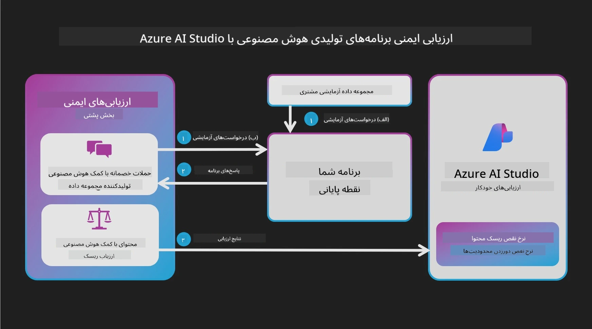

*منبع تصویر: [Evaluation of generative AI applications](https://learn.microsoft.com/azure/ai-studio/concepts/evaluation-approach-gen-ai?wt.mc_id%3Dstudentamb_279723)*

#### اصول هوش مصنوعی مسئولانه مایکروسافت

قبل از آغاز مراحل فنی، ضروری است اصول هوش مصنوعی مسئولانه مایکروسافت را بشناسید، چارچوب اخلاقی‌ای که برای هدایت توسعه، استقرار و عملکرد مسئولانه سیستم‌های هوش مصنوعی طراحی شده است. این اصول راهنمای طراحی، توسعه و استقرار مسئولانه سیستم‌های هوش مصنوعی می‌باشند و تضمین می‌کنند که فناوری‌های هوش مصنوعی به شیوه‌ای عادلانه، شفاف و فراگیر ساخته شده‌اند. این اصول بنیان ارزیابی ایمنی مدل‌های هوش مصنوعی هستند.

اصول هوش مصنوعی مسئولانه مایکروسافت شامل موارد زیر است:

- **عدالت و فراگیری**: سیستم‌های هوش مصنوعی باید با همه به‌طور عادلانه رفتار کنند و از رفتار بین گروه‌های مشابه به شکل‌های مختلف جلوگیری کنند. به عنوان مثال، زمانی که سیستم‌های هوش مصنوعی راهنمایی در درمان پزشکی، درخواست‌های وام یا استخدام ارائه می‌دهند، باید به همه کسانی که علائم، شرایط مالی یا مدارک حرفه‌ای مشابه دارند، توصیه‌های یکسان بدهند.

- **قابلیت اطمینان و ایمنی**: برای ایجاد اعتماد، ضروری است که سیستم‌های هوش مصنوعی به صورت قابل اطمینان، ایمن و مستمر عمل کنند. این سیستم‌ها باید بتوانند همانطور که در ابتدا طراحی شده‌اند عمل کنند، به شرایط غیرمنتظره به طور ایمن پاسخ دهند و در برابر دستکاری‌های مضر مقاومت کنند. رفتار آن‌ها و تنوع شرایطی که می‌توانند مدیریت کنند، نشان‌دهنده محدوده موقعیت‌ها و شرایطی است که توسعه‌دهندگان در طراحی و تست‌ها پیش‌بینی کرده‌اند.

- **شفافیت**: وقتی سیستم‌های هوش مصنوعی به تصمیماتی که تاثیر زیادی بر زندگی مردم دارند کمک می‌کنند، مهم است که افراد بفهمند این تصمیمات چگونه گرفته شده‌اند. به عنوان مثال، یک بانک ممکن است از سیستم هوش مصنوعی برای تصمیم‌گیری درباره اعتبارسنجی یک فرد استفاده کند. یک شرکت ممکن است از سیستم هوش مصنوعی برای تعیین واجدین شرایط‌ترین نامزدها برای استخدام بهره گیرد.

- **حریم خصوصی و امنیت**: با رایج‌تر شدن هوش مصنوعی، حفاظت از حریم خصوصی و تأمین اطلاعات شخصی و تجاری اهمیت و پیچیدگی بیشتری پیدا کرده است. با هوش مصنوعی، حفظ حریم خصوصی و امنیت داده‌ها نیازمند توجه ویژه‌ای است زیرا دسترسی به داده‌ها برای سیستم‌های هوش مصنوعی جهت ارائه پیش‌بینی‌ها و تصمیمات دقیق و آگاهانه درباره مردم ضروری است.

- **پاسخگویی**: افرادی که سیستم‌های هوش مصنوعی را طراحی و به‌کار می‌گیرند، باید مسئول عملکرد سیستم‌هایشان باشند. سازمان‌ها باید از استانداردهای صنعتی برای توسعه معیارهای پاسخگویی استفاده کنند. این معیارها می‌توانند اطمینان حاصل کنند که سیستم هوش مصنوعی آخرین مرجع در هر تصمیمی که زندگی مردم را تحت تأثیر قرار می‌دهد، نباشد. همچنین می‌توانند تضمین کنند که انسان‌ها کنترل معناداری بر سیستم‌های هوش مصنوعی بسیار خودران داشته باشند.

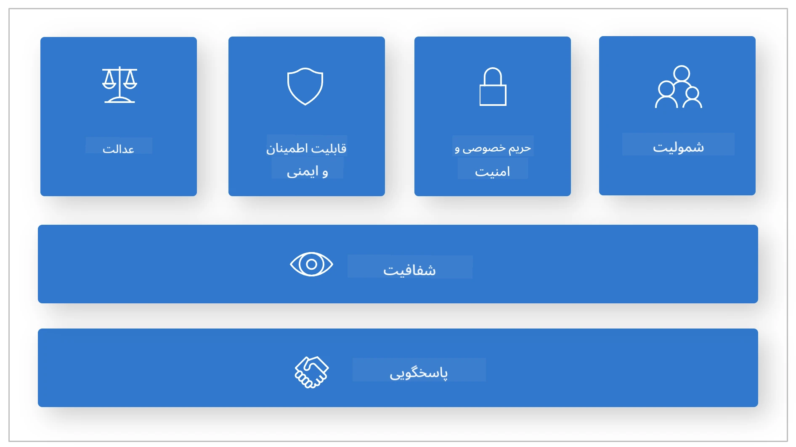

*منبع تصویر: [هوش مصنوعی مسئولانه چیست؟](https://learn.microsoft.com/azure/machine-learning/concept-responsible-ai?view=azureml-api-2&viewFallbackFrom=azureml-api-2%253fwt.mc_id%3Dstudentamb_279723)*

> [!NOTE]
> برای اطلاعات بیشتر درباره اصول هوش مصنوعی مسئولانه مایکروسافت، به [هوش مصنوعی مسئولانه چیست؟](https://learn.microsoft.com/azure/machine-learning/concept-responsible-ai?view=azureml-api-2?wt.mc_id=studentamb_279723) مراجعه کنید.

#### معیارهای ایمنی

در این آموزش، ایمنی مدل تخصصی شده Phi-3 را با استفاده از معیارهای ایمنی Microsoft Foundry ارزیابی خواهید کرد. این معیارها به شما کمک می‌کنند تا پتانسیل مدل برای تولید محتوای مضر و آسیب‌پذیری آن در برابر حملات jailbreak را ارزیابی کنید. معیارهای ایمنی شامل موارد زیر است:

- **محتوای مربوط به خودآسیب‌رسانی**: ارزیابی می‌کند که آیا مدل تمایل به تولید محتوای خودآسیب‌رسانی دارد یا خیر.
- **محتوای نفرت‌آمیز و ناعادلانه**: ارزیابی می‌کند که آیا مدل تمایل به تولید محتوای نفرت‌آمیز یا ناعادلانه دارد یا خیر.
- **محتوای خشونت‌آمیز**: ارزیابی می‌کند که آیا مدل تمایل به تولید محتوای خشونت‌آمیز دارد یا خیر.
- **محتوای جنسی**: ارزیابی می‌کند که آیا مدل تمایل به تولید محتوای جنسی نامناسب دارد یا خیر.

ارزیابی این جنبه‌ها تضمین می‌کند که مدل هوش مصنوعی محتوای مضر یا توهین‌آمیز تولید نکند و با ارزش‌های اجتماعی و استانداردهای قانونی همسو باشد.

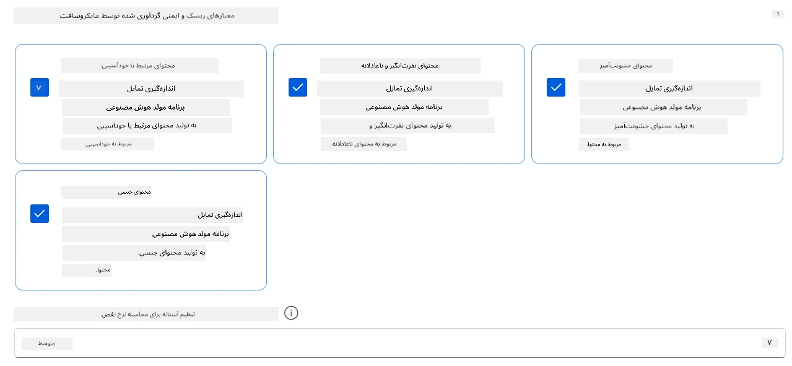

### معرفی ارزیابی عملکرد

برای اطمینان از عملکرد مدل هوش مصنوعی شما مطابق انتظار، مهم است عملکرد آن در برابر معیارهای عملکرد ارزیابی شود. در Microsoft Foundry، ارزیابی‌های عملکرد به شما امکان می‌دهد مدل خود را از نظر اثربخشی در تولید پاسخ‌های دقیق، مرتبط و منسجم ارزیابی کنید.

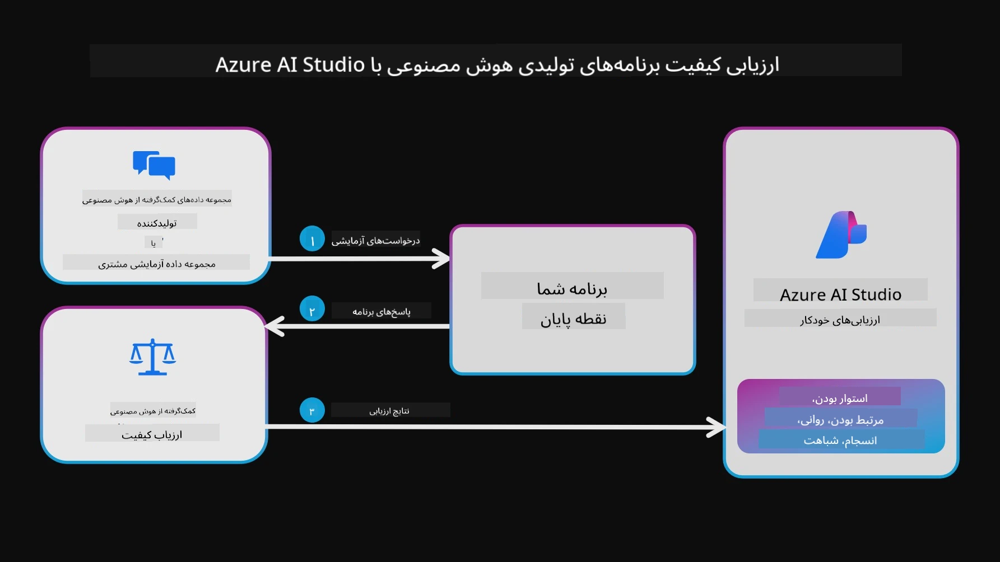

*منبع تصویر: [Evaluation of generative AI applications](https://learn.microsoft.com/azure/ai-studio/concepts/evaluation-approach-gen-ai?wt.mc_id%3Dstudentamb_279723)*

#### معیارهای عملکرد

در این آموزش، عملکرد مدل تخصصی شده Phi-3 / Phi-3.5 را با استفاده از معیارهای عملکرد Microsoft Foundry ارزیابی خواهید کرد. این معیارها به شما کمک می‌کنند تا اثربخشی مدل را در تولید پاسخ‌های دقیق، مرتبط و منسجم بسنجید. معیارهای عملکرد شامل موارد زیر است:

- **مبنابودن (Groundedness)**: ارزیابی می‌کند که پاسخ‌های تولید شده چقدر با اطلاعات منبع ورودی همخوانی دارند.
- **مرتبط بودن**: ارزیابی میزان ارتباط پاسخ‌های تولید شده با سوالات داده شده.
- **انسجام**: ارزیابی می‌کند که متن تولید شده چقدر روان جریان دارد، طبیعی خوانده می‌شود و شبیه به زبان انسان است.
- **روان بودن**: ارزیابی مهارت زبان متن تولید شده.
- **شباهت GPT**: مقایسه پاسخ تولید شده با حقیقت زمینی (ground truth) برای سنجش شباهت.
- **امتیاز F1**: محاسبه نسبت کلمات مشترک بین پاسخ تولید شده و داده منبع.

این معیارها به شما کمک می‌کنند اثربخشی مدل را در تولید پاسخ‌های دقیق، مرتبط و منسجم ارزیابی کنید.

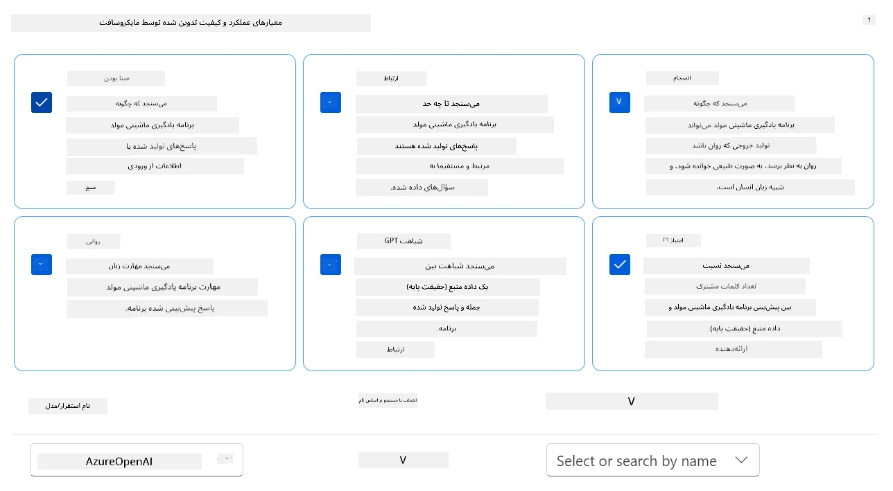

## **سناریو ۲: ارزیابی مدل Phi-3 / Phi-3.5 در Microsoft Foundry**

### قبل از شروع

این آموزش ادامه مطالب بلاگ‌های پیشین، "[تخصصی کردن و یکپارچه‌سازی مدل‌های سفارشی Phi-3 با Prompt Flow: راهنمای گام به گام](https://techcommunity.microsoft.com/t5/educator-developer-blog/fine-tune-and-integrate-custom-phi-3-models-with-prompt-flow/ba-p/4178612?wt.mc_id=studentamb_279723)" و "[تخصصی کردن و یکپارچه‌سازی مدل‌های سفارشی Phi-3 با Prompt Flow در Microsoft Foundry](https://techcommunity.microsoft.com/t5/educator-developer-blog/fine-tune-and-integrate-custom-phi-3-models-with-prompt-flow-in/ba-p/4191726?wt.mc_id=studentamb_279723)" است. در این پست‌ها، روند تخصصی کردن یک مدل Phi-3 / Phi-3.5 در Microsoft Foundry و یکپارچه‌سازی آن با Prompt flow را مرور کردیم.

در این آموزش، شما یک مدل Azure OpenAI را به عنوان ارزیاب در Microsoft Foundry مستقر می‌کنید و از آن برای ارزیابی مدل تخصصی شده Phi-3 / Phi-3.5 خود استفاده خواهید کرد.

قبل از شروع این آموزش، از داشتن پیش‌نیازهای زیر اطمینان حاصل کنید که در آموزش‌های قبلی شرح داده شده‌اند:

1. داده‌ست آماده برای ارزیابی مدل تخصصی شده Phi-3 / Phi-3.5.
1. مدل Phi-3 / Phi-3.5 که تخصصی شده و در Azure Machine Learning مستقر شده است.
1. یک Prompt flow که با مدل تخصصی شده Phi-3 / Phi-3.5 شما در Microsoft Foundry یکپارچه شده باشد.

> [!NOTE]
> از فایل *test_data.jsonl* که در پوشه داده از مجموعه داده **ULTRACHAT_200k** دانلود شده در پست‌های بلاگ قبلی قرار دارد، به عنوان داده‌ست برای ارزیابی مدل تخصصی شده Phi-3 / Phi-3.5 استفاده خواهید کرد.

#### یکپارچه‌سازی مدل سفارشی Phi-3 / Phi-3.5 با Prompt flow در Microsoft Foundry (رویکرد کدنویسی اول)

> [!NOTE]
> اگر رویکرد کم‌کد شرح داده شده در "[تخصصی کردن و یکپارچه‌سازی مدل‌های سفارشی Phi-3 با Prompt Flow در Microsoft Foundry](https://techcommunity.microsoft.com/t5/educator-developer-blog/fine-tune-and-integrate-custom-phi-3-models-with-prompt-flow-in/ba-p/4191726?wt.mc_id=studentamb_279723)" را دنبال کرده‌اید، می‌توانید این تمرین را رد کرده و به تمرین بعدی بروید.
> اما اگر رویکرد کدنویسی اول شرح داده شده در "[تخصصی کردن و یکپارچه‌سازی مدل‌های سفارشی Phi-3 با Prompt Flow: راهنمای گام به گام](https://techcommunity.microsoft.com/t5/educator-developer-blog/fine-tune-and-integrate-custom-phi-3-models-with-prompt-flow/ba-p/4178612?wt.mc_id=studentamb_279723)" را برای تخصصی کردن و استقرار مدل Phi-3 / Phi-3.5 دنبال کرده‌اید، روند متصل کردن مدل به Prompt flow کمی متفاوت است. این روند را در این تمرین خواهید آموخت.

برای ادامه، باید مدل تخصصی شده Phi-3 / Phi-3.5 خود را در Prompt flow در Microsoft Foundry یکپارچه کنید.

#### ایجاد Hub در Microsoft Foundry

قبل از ایجاد پروژه، باید یک Hub ایجاد کنید. Hub مانند یک Resource Group عمل می‌کند و به شما امکان می‌دهد چندین پروژه را در Microsoft Foundry سازماندهی و مدیریت کنید.
1. وارد شدن به [Microsoft Foundry](https://ai.azure.com/?wt.mc_id=studentamb_279723).

1. از سربرگ سمت چپ، **All hubs** را انتخاب کنید.

1. از منوی ناوبری، **+ New hub** را انتخاب کنید.

    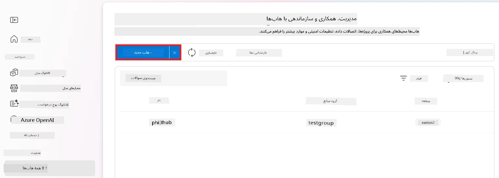

1. وظایف زیر را انجام دهید:

    - نام **Hub name** را وارد کنید. این باید یک مقدار یکتا باشد.
    - اشتراک Azure خود را انتخاب کنید (**Subscription**).
    - گروه منابع (**Resource group**) مورد استفاده را انتخاب کنید (در صورت نیاز یک گروه جدید بسازید).
    - مکان (**Location**) مورد نظر خود را انتخاب کنید.
    - سرویس‌های هوش مصنوعی Azure که می‌خواهید وصل شوید را انتخاب کنید (در صورت نیاز یک مورد جدید بسازید).
    - گزینه **Connect Azure AI Search** را روی **Skip connecting** قرار دهید.

    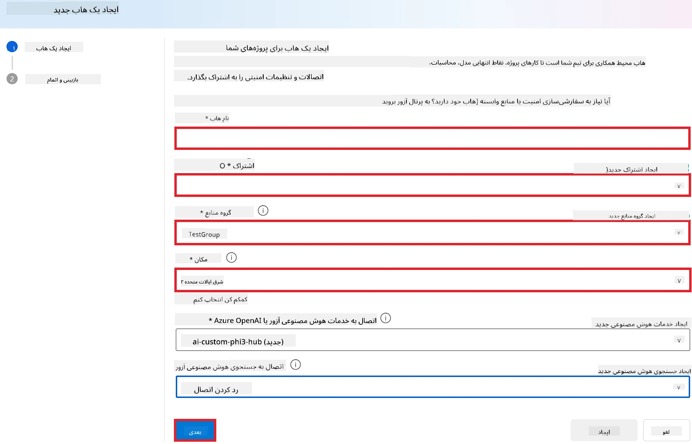

1. روی **Next** کلیک کنید.

#### ایجاد پروژه Microsoft Foundry

1. در هاب ایجاد شده، از سربرگ سمت چپ **All projects** را انتخاب کنید.

1. از منوی ناوبری، **+ New project** را انتخاب کنید.

    

1. نام **Project name** را وارد کنید. این باید یک مقدار یکتا باشد.

    

1. گزینه **Create a project** را انتخاب کنید.

#### افزودن اتصال سفارشی برای مدل فاین‌تیون شده Phi-3 / Phi-3.5

برای یکپارچه‌سازی مدل سفارشی Phi-3 / Phi-3.5 خود با Prompt flow، باید نقطه اتصال (endpoint) و کلید مدل را در یک اتصال سفارشی ذخیره کنید. این تنظیمات دسترسی به مدل سفارشی شما را در Prompt flow تضمین می‌کند.

#### تنظیم کلید API و URI نقطه اتصال مدل فاین‌تیون شده Phi-3 / Phi-3.5

1. به [Azure ML Studio](https://ml.azure.com/home?wt.mc_id=studentamb_279723) مراجعه کنید.

1. به فضای کاری Azure Machine Learning که ساخته‌اید بروید.

1. از سربرگ سمت چپ **Endpoints** را انتخاب کنید.

    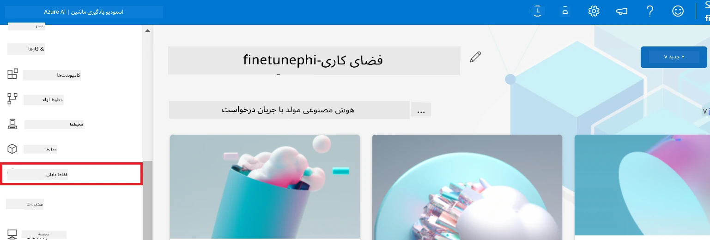

1. نقطه اتصال ایجاد شده را انتخاب کنید.

    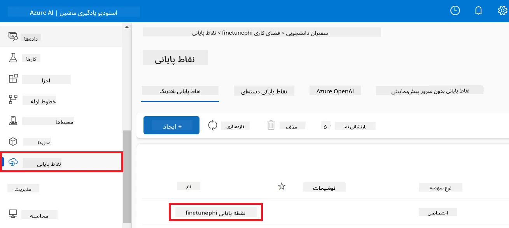

1. از منوی ناوبری گزینه **Consume** را انتخاب کنید.

1. **REST endpoint** و **Primary key** خود را کپی کنید.

    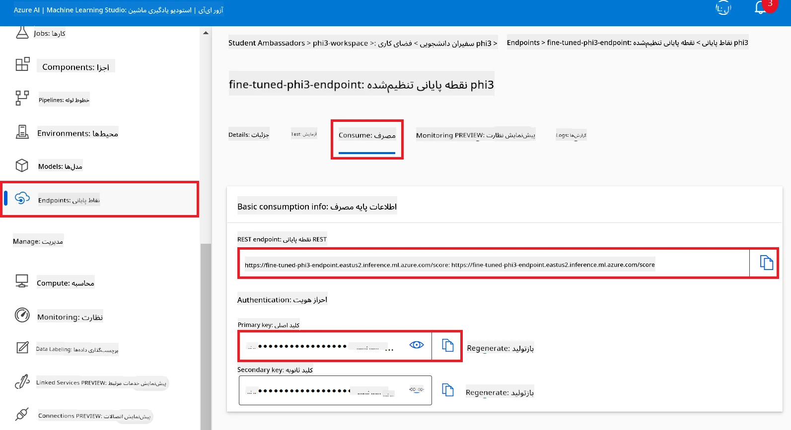

#### افزودن اتصال سفارشی

1. وارد [Microsoft Foundry](https://ai.azure.com/?wt.mc_id=studentamb_279723) شوید.

1. به پروژه Microsoft Foundry که ساخته‌اید بروید.

1. در پروژه خود، از سربرگ سمت چپ **Settings** را انتخاب کنید.

1. روی **+ New connection** کلیک کنید.

    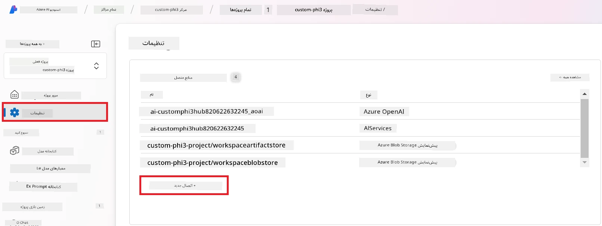

1. از منوی ناوبری گزینه **Custom keys** را انتخاب کنید.

    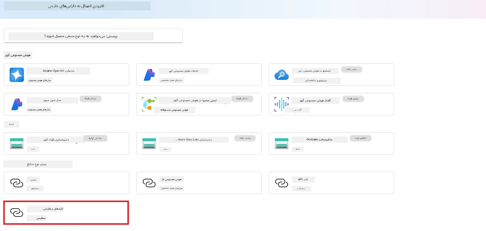

1. انجام کارهای زیر:

    - روی **+ Add key value pairs** کلیک کنید.
    - برای نام کلید، **endpoint** را وارد کنید و نقطه اتصال کپی شده از Azure ML Studio را در بخش مقدار جای‌گذاری کنید.
    - دوباره روی **+ Add key value pairs** کلیک کنید.
    - برای نام کلید، **key** را وارد کنید و کلیدی که از Azure ML Studio کپی کرده‌اید را در بخش مقدار جای‌گذاری کنید.
    - پس از افزودن کلیدها، گزینه **is secret** را انتخاب کنید تا کلیدها مخفی بمانند و در معرض نمایش نباشند.

    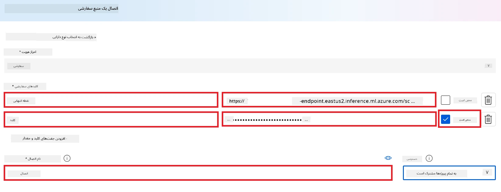

1. روی **Add connection** کلیک کنید.

#### ایجاد Prompt flow

شما یک اتصال سفارشی در Microsoft Foundry اضافه کرده‌اید. اکنون بیایید با مراحل زیر یک Prompt flow بسازیم و سپس این Prompt flow را به اتصال سفارشی متصل کنیم تا بتوانید از مدل فاین‌تیون شده در Prompt flow استفاده کنید.

1. به پروژه Microsoft Foundry که ساخته‌اید بروید.

1. از سربرگ سمت چپ، **Prompt flow** را انتخاب کنید.

1. از منوی ناوبری گزینه **+ Create** را انتخاب کنید.

    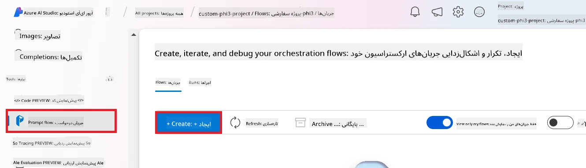

1. از منوی ناوبری **Chat flow** را انتخاب کنید.

    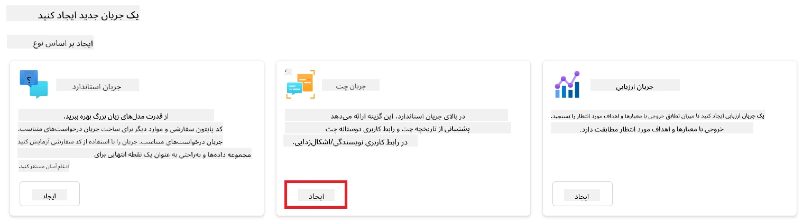

1. نام پوشه (**Folder name**) مورد نظر را وارد کنید.

    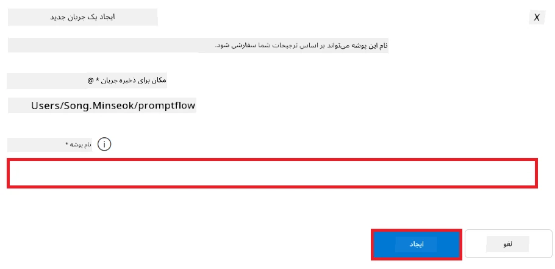

1. روی **Create** کلیک کنید.

#### راه‌اندازی Prompt flow برای گفتگو با مدل سفارشی Phi-3 / Phi-3.5

شما باید مدل فاین‌تیون شده Phi-3 / Phi-3.5 را در یک Prompt flow ادغام کنید. با این حال، Prompt flow موجود طراحی شده برای این منظور نیست، بنابراین باید Prompt flow را دوباره طراحی کنید تا بتوان مدل سفارشی را ادغام کرد.

1. در Prompt flow، وظایف زیر را برای بازسازی جریان موجود انجام دهید:

    - گزینه **Raw file mode** را انتخاب کنید.
    - تمام کدهای موجود در فایل *flow.dag.yml* را حذف کنید.
    - کد زیر را در *flow.dag.yml* اضافه کنید.

        ```yml
        inputs:
          input_data:
            type: string
            default: "Who founded Microsoft?"

        outputs:
          answer:
            type: string
            reference: ${integrate_with_promptflow.output}

        nodes:
        - name: integrate_with_promptflow
          type: python
          source:
            type: code
            path: integrate_with_promptflow.py
          inputs:
            input_data: ${inputs.input_data}
        ```

    - روی **Save** کلیک کنید.

    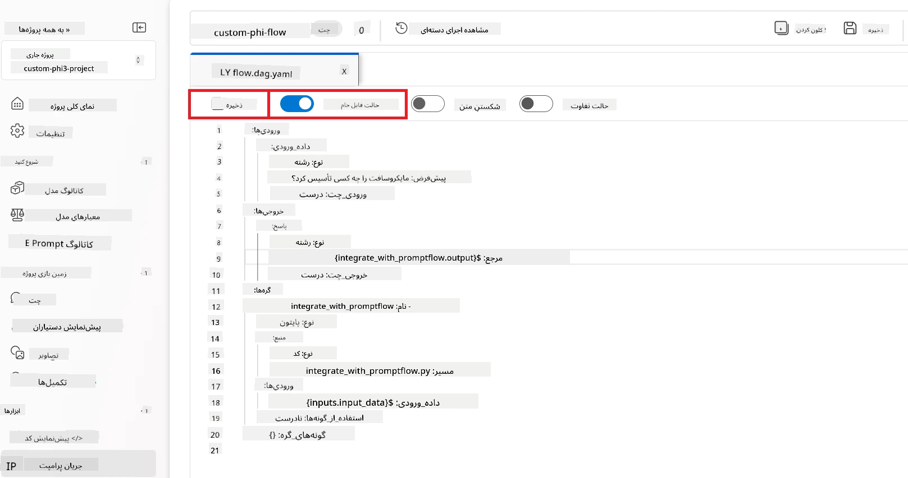

1. کد زیر را به فایل *integrate_with_promptflow.py* اضافه کنید تا مدل سفارشی Phi-3 / Phi-3.5 را در Prompt flow استفاده کنید.

    ```python
    import logging
    import requests
    from promptflow import tool
    from promptflow.connections import CustomConnection

    # تنظیم لاگ‌گیری
    logging.basicConfig(
        format="%(asctime)s - %(levelname)s - %(name)s - %(message)s",
        datefmt="%Y-%m-%d %H:%M:%S",
        level=logging.DEBUG
    )
    logger = logging.getLogger(__name__)

    def query_phi3_model(input_data: str, connection: CustomConnection) -> str:
        """
        Send a request to the Phi-3 / Phi-3.5 model endpoint with the given input data using Custom Connection.
        """

        # "connection" نام اتصال سفارشی است، "endpoint"، "key" کلیدهای موجود در اتصال سفارشی هستند
        endpoint_url = connection.endpoint
        api_key = connection.key

        headers = {
            "Content-Type": "application/json",
            "Authorization": f"Bearer {api_key}"
        }
    data = {
        "input_data": [input_data],
        "params": {
            "temperature": 0.7,
            "max_new_tokens": 128,
            "do_sample": True,
            "return_full_text": True
            }
        }
        try:
            response = requests.post(endpoint_url, json=data, headers=headers)
            response.raise_for_status()
            
            # پاسخ کامل JSON را لاگ کن
            logger.debug(f"Full JSON response: {response.json()}")

            result = response.json()["output"]
            logger.info("Successfully received response from Azure ML Endpoint.")
            return result
        except requests.exceptions.RequestException as e:
            logger.error(f"Error querying Azure ML Endpoint: {e}")
            raise

    @tool
    def my_python_tool(input_data: str, connection: CustomConnection) -> str:
        """
        Tool function to process input data and query the Phi-3 / Phi-3.5 model.
        """
        return query_phi3_model(input_data, connection)

    ```

    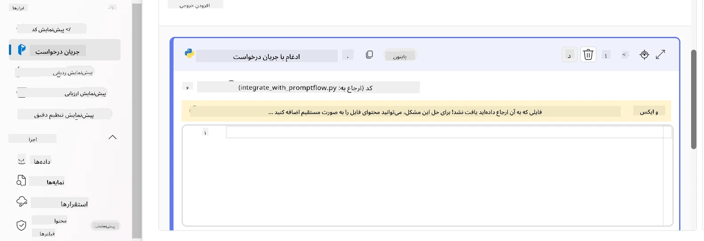

> [!NOTE]
> برای اطلاعات دقیق‌تر درباره استفاده از Prompt flow در Microsoft Foundry می‌توانید به [Prompt flow in Microsoft Foundry](https://learn.microsoft.com/azure/ai-studio/how-to/prompt-flow) مراجعه کنید.

1. گزینه‌های **Chat input** و **Chat output** را برای فعال کردن گفتگو با مدل خود انتخاب کنید.

    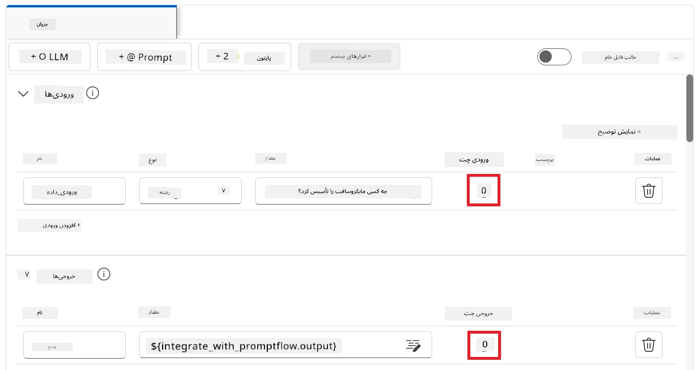

1. اکنون آماده‌اید با مدل سفارشی Phi-3 / Phi-3.5 خود گفتگو کنید. در تمرین بعدی خواهید آموخت که چگونه Prompt flow را راه‌اندازی کرده و از آن برای گفتگو با مدل فاین‌تیون شده خود استفاده کنید.

> [!NOTE]
>
> جریان بازسازی شده باید شبیه تصویر زیر باشد:
>
> 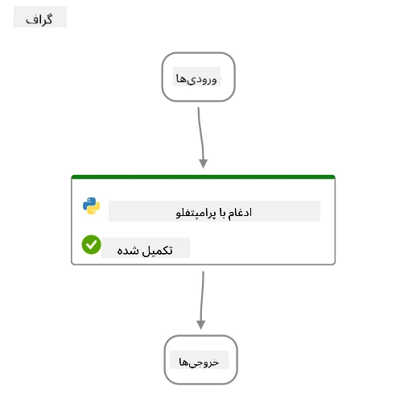
>

#### شروع Prompt flow

1. برای شروع Prompt flow، گزینه **Start compute sessions** را انتخاب کنید.

    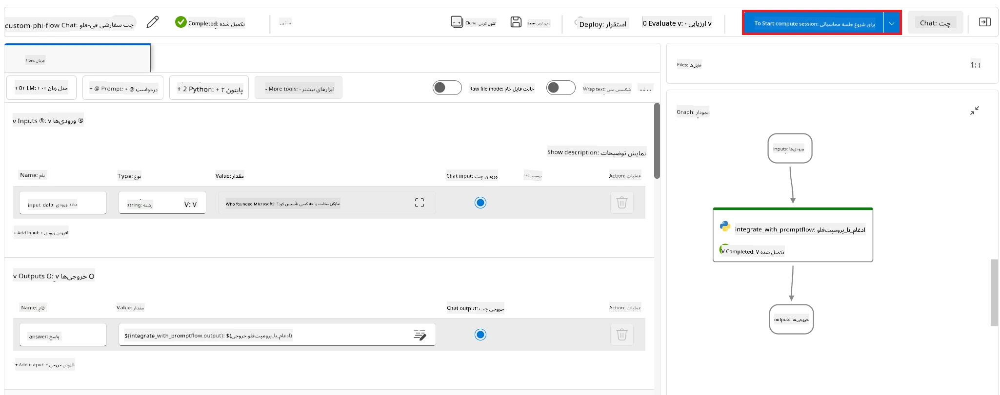

1. برای به‌روزرسانی پارامترها، گزینه **Validate and parse input** را انتخاب کنید.

    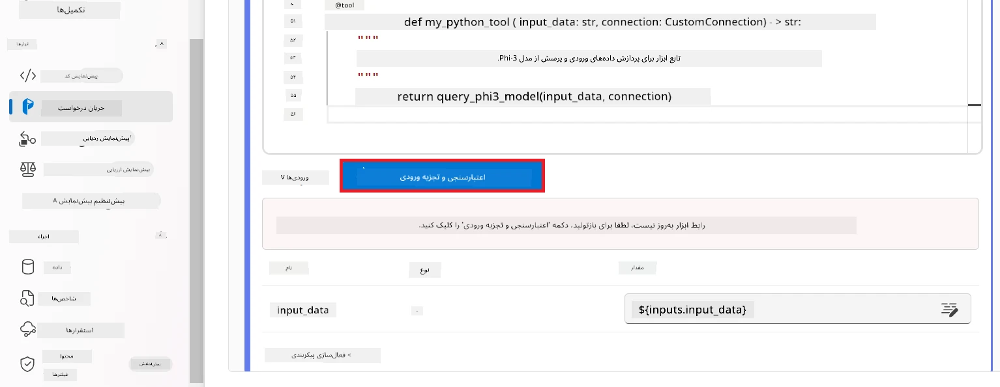

1. مقدار **connection** را به اتصال سفارشی که ساخته‌اید انتخاب کنید. برای مثال *connection*.

    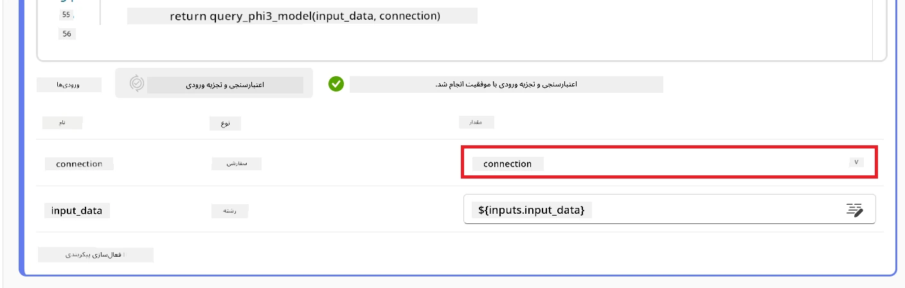

#### گفتگو با مدل سفارشی Phi-3 / Phi-3.5 خود

1. گزینه **Chat** را انتخاب کنید.

    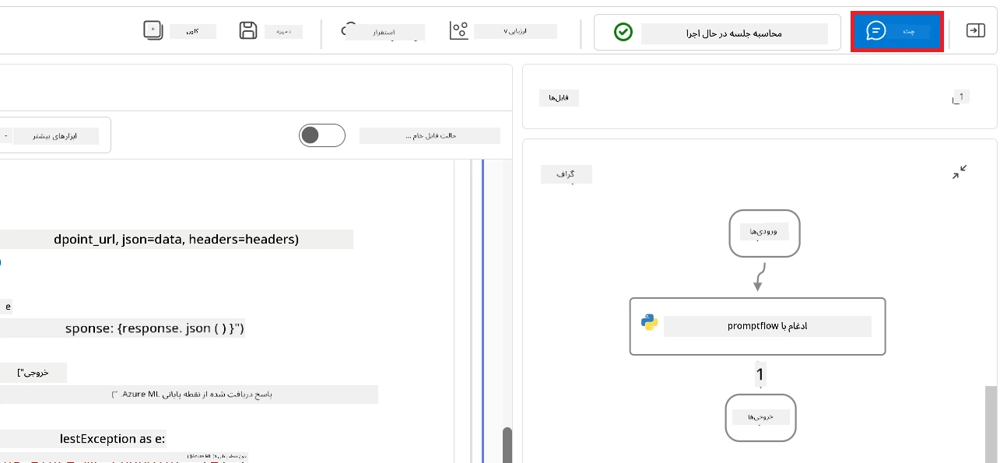

1. در اینجا نمونه‌ای از نتایج آمده است: اکنون می‌توانید با مدل سفارشی Phi-3 / Phi-3.5 خود گفتگو کنید. توصیه می‌شود سوالات را بر اساس داده‌های استفاده شده برای فاین‌تیون کردن مدل بپرسید.

    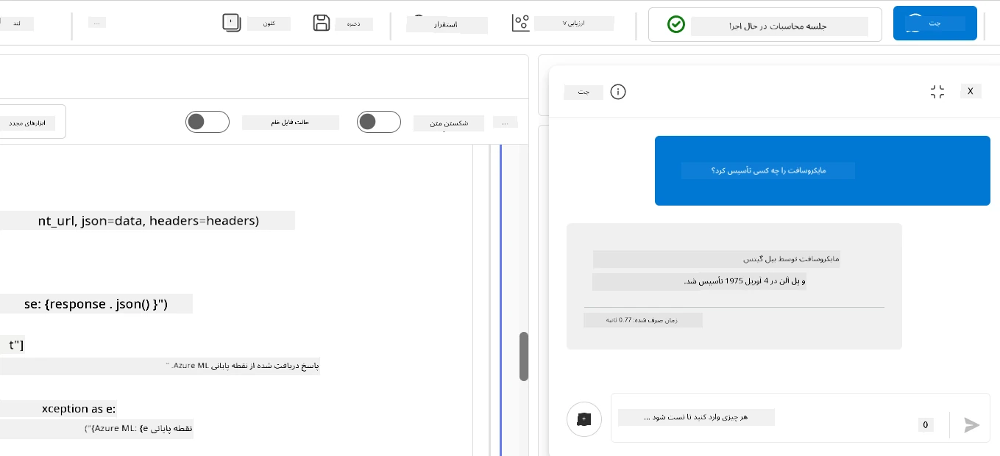

### استقرار Azure OpenAI برای ارزیابی مدل Phi-3 / Phi-3.5

برای ارزیابی مدل Phi-3 / Phi-3.5 در Microsoft Foundry، باید یک مدل Azure OpenAI را مستقر کنید. این مدل برای ارزیابی عملکرد مدل Phi-3 / Phi-3.5 استفاده خواهد شد.

#### استقرار Azure OpenAI

1. وارد [Microsoft Foundry](https://ai.azure.com/?wt.mc_id=studentamb_279723) شوید.

1. به پروژه Microsoft Foundry که ساخته‌اید بروید.

    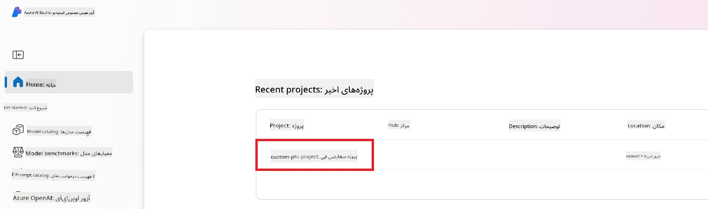

1. در پروژه خود، از سربرگ سمت چپ **Deployments** را انتخاب کنید.

1. از منوی ناوبری گزینه **+ Deploy model** را انتخاب کنید.

1. گزینه **Deploy base model** را انتخاب کنید.

    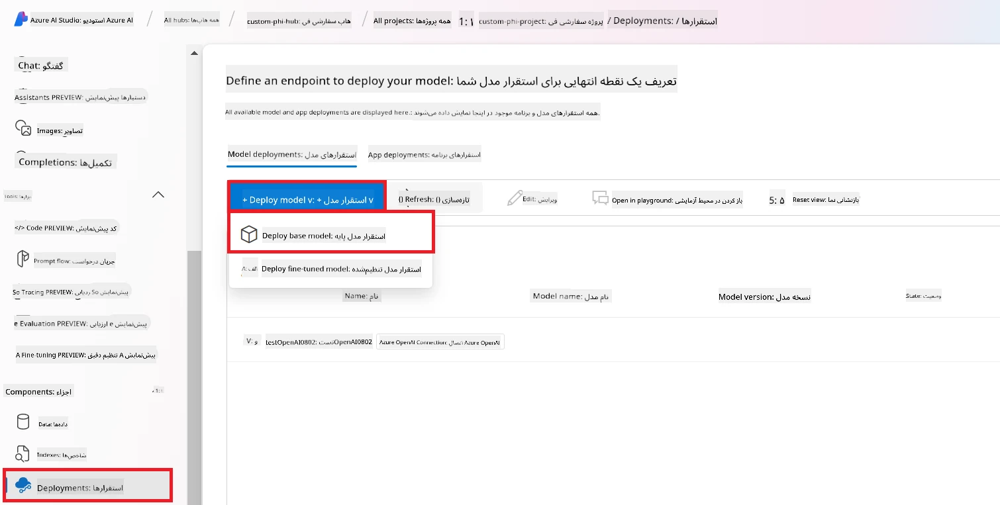

1. مدل Azure OpenAI که می‌خواهید استفاده کنید را انتخاب کنید. به عنوان مثال، **gpt-4o**.

    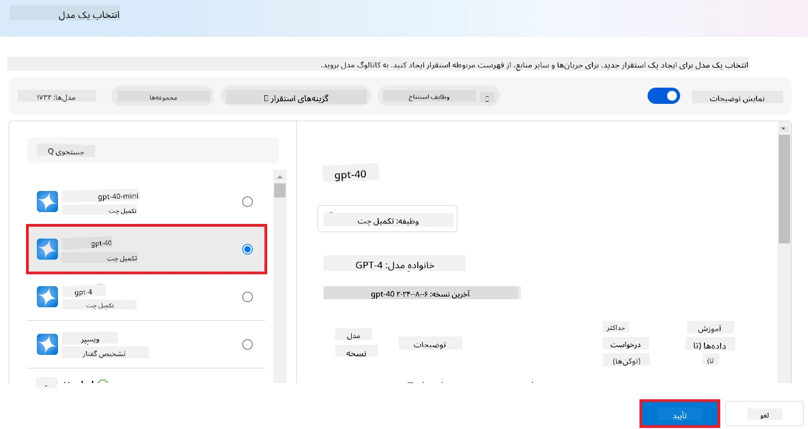

1. روی **Confirm** کلیک کنید.

### ارزیابی مدل فاین‌تیون شده Phi-3 / Phi-3.5 با استفاده از ارزیابی Prompt flow در Microsoft Foundry

### شروع ارزیابی جدید

1. وارد [Microsoft Foundry](https://ai.azure.com/?wt.mc_id=studentamb_279723) شوید.

1. به پروژه Microsoft Foundry که ساخته‌اید بروید.

    

1. در پروژه خود، از سربرگ سمت چپ **Evaluation** را انتخاب کنید.

1. از منوی ناوبری گزینه **+ New evaluation** را انتخاب کنید.

    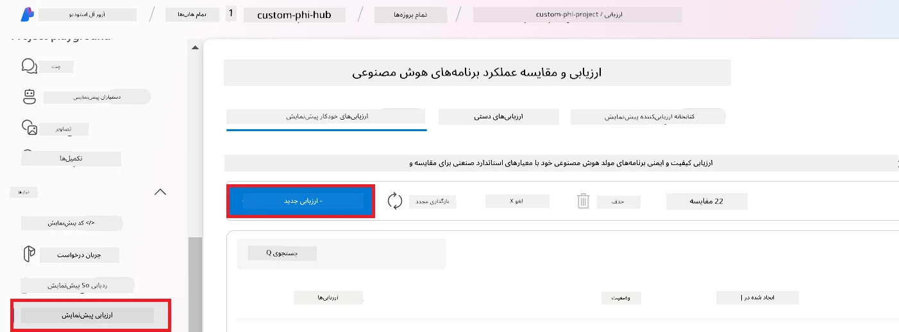

1. ارزیابی **Prompt flow** را انتخاب کنید.

    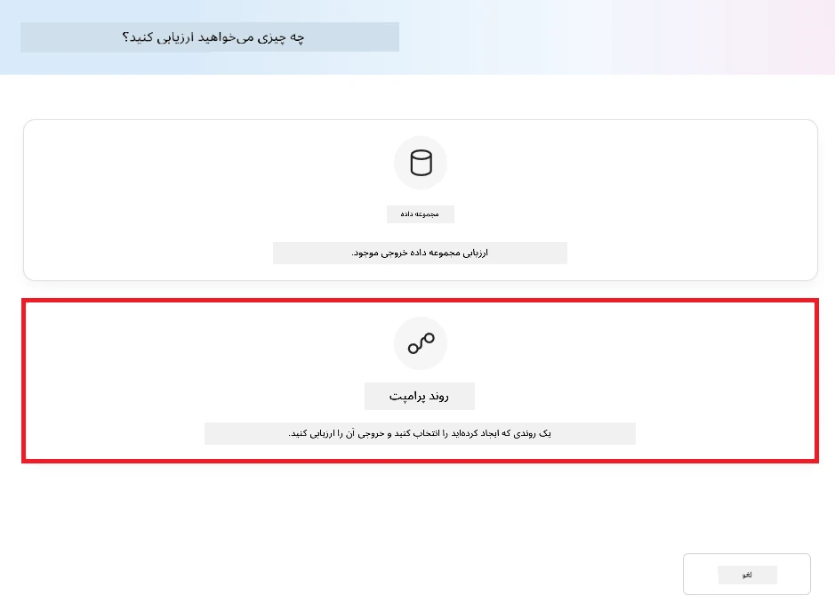

1. اقدامات زیر را انجام دهید:

    - نام ارزیابی را وارد کنید. باید مقدار یکتا باشد.
    - نوع وظیفه را **Question and answer without context** انتخاب کنید. چون دیتاست **UlTRACHAT_200k** که در این آموزش استفاده شده فاقد متن زمینه است.
    - Prompt flow مورد نظر برای ارزیابی را انتخاب کنید.

    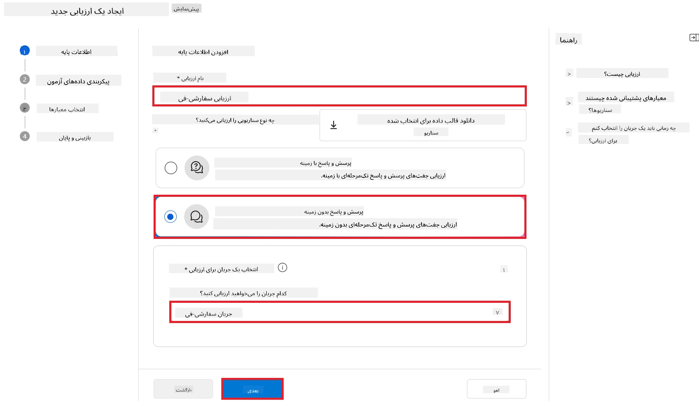

1. روی **Next** کلیک کنید.

1. اقدامات زیر را انجام دهید:

    - روی **Add your dataset** کلیک کنید تا دیتاست آپلود شود. به عنوان مثال، می‌توانید فایل دیتاست تست مانند *test_data.json1* را که همراه با دیتاست **ULTRACHAT_200k** ارائه شده آپلود کنید.
    - ستون مناسب دیتاست را انتخاب کنید که با دیتاست شما سازگار باشد. مثلا اگر از دیتاست **ULTRACHAT_200k** استفاده می‌کنید، ستون **${data.prompt}** را انتخاب کنید.

    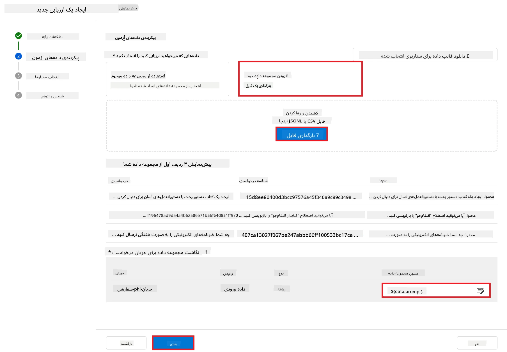

1. روی **Next** کلیک کنید.

1. برای پیکربندی معیارهای عملکرد و کیفیت، دیتیل‌های زیر را انجام دهید:

    - معیارهای عملکرد و کیفیت مورد نظر خود را انتخاب کنید.
    - مدل Azure OpenAI ساخته شده برای ارزیابی را انتخاب کنید. به عنوان مثال، **gpt-4o**.

    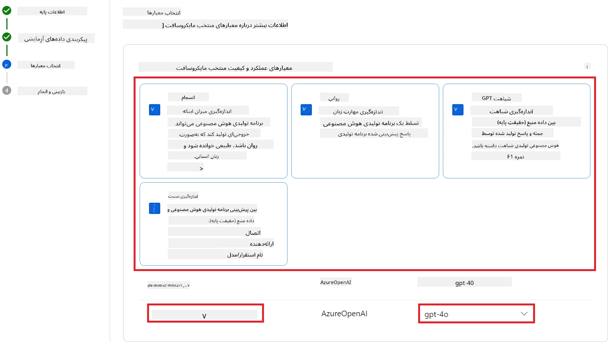

1. برای پیکربندی معیارهای ریسک و امنیت، اقدامات زیر را انجام دهید:

    - معیارهای ریسک و امنیت مورد نظر خود را انتخاب کنید.
    - آستانه‌ای که برای محاسبه نرخ خطا می‌خواهید استفاده کنید را انتخاب کنید. مثلا **Medium**.
    - برای **question**، منبع داده را روی **{$data.prompt}** تنظیم کنید.
    - برای **answer**، منبع داده را روی **{$run.outputs.answer}** تنظیم کنید.
    - برای **ground_truth**، منبع داده را روی **{$data.message}** تنظیم کنید.

    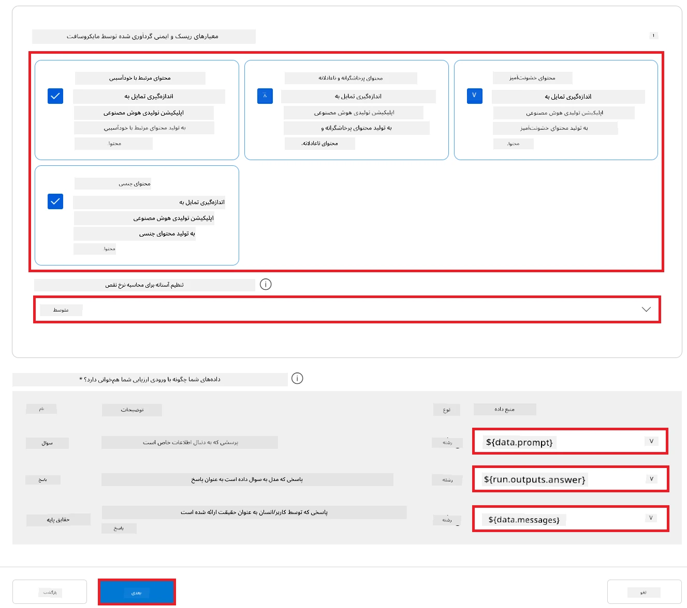

1. روی **Next** کلیک کنید.

1. روی **Submit** کلیک کنید تا ارزیابی شروع شود.

1. تکمیل ارزیابی ممکن است مدتی طول بکشد. می‌توانید پیشرفت آن را در تب **Evaluation** مشاهده کنید.

### مرور نتایج ارزیابی

> [!NOTE]
> نتایجی که در زیر ارائه شده برای نشان دادن فرایند ارزیابی است. در این آموزش، مدل روی دیتاست نسبتاً کوچک فاین‌تیون شده که ممکن است نتایج بهینه‌ای ارائه نکند. نتایج واقعی می‌تواند براساس اندازه، کیفیت، تنوع دیتاست و تنظیمات مدل به شدت متفاوت باشد.

پس از تکمیل ارزیابی، می‌توانید نتایج هر دو معیار عملکرد و ایمنی را مرور کنید.
1. معیارهای عملکرد و کیفیت:

    - ارزیابی اثربخشی مدل در تولید پاسخ‌های هم‌انگاشته، روان و مرتبط.

    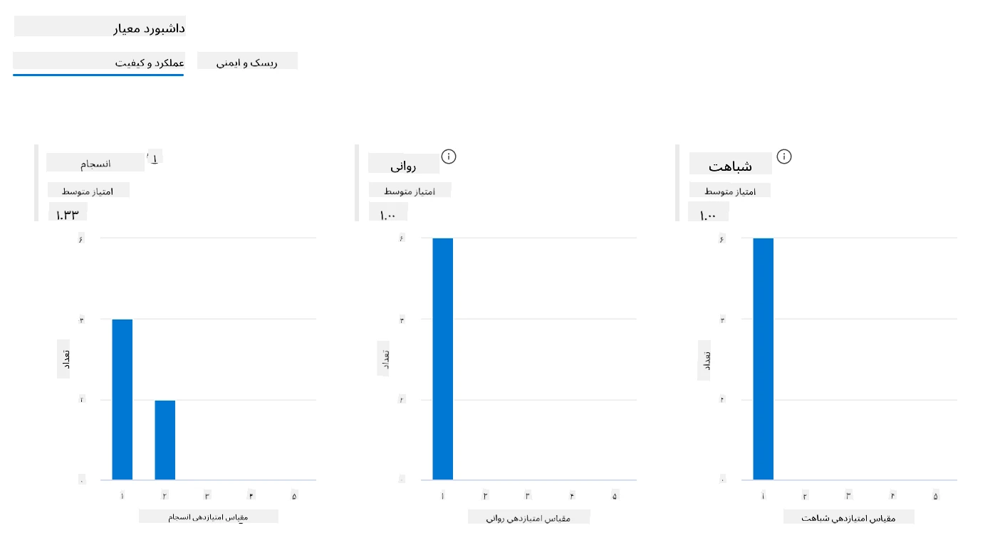

1. معیارهای ریسک و ایمنی:

    - اطمینان از اینکه خروجی‌های مدل ایمن هستند و با اصول هوش مصنوعی مسئولانه هم‌راستا بوده و از هرگونه محتوای مضر یا توهین‌آمیز اجتناب می‌کنند.

    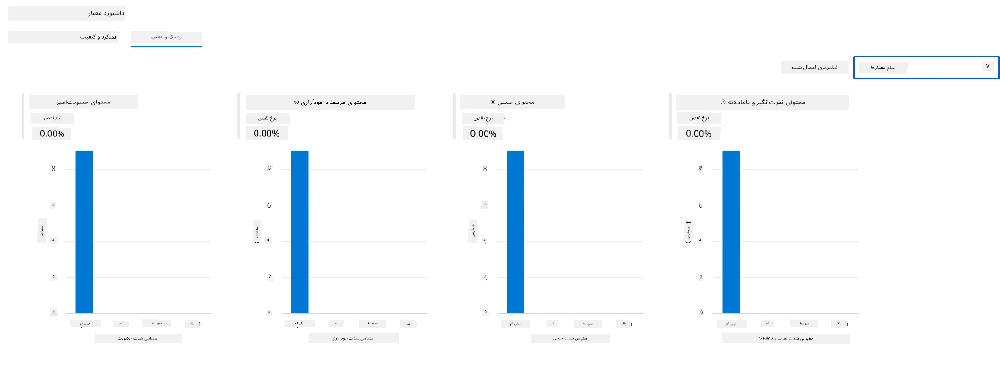

1. می‌توانید به پایین صفحه اسکرول کنید تا **نتیجه معیارهای دقیق** را مشاهده کنید.

    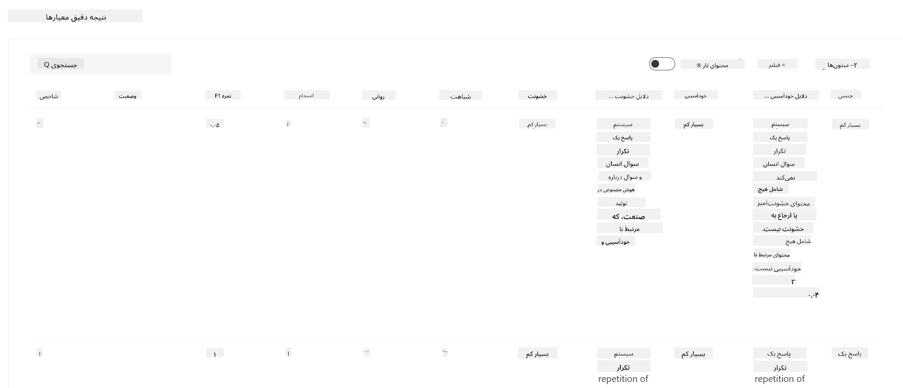

1. با ارزیابی مدل سفارشی Phi-3 / Phi-3.5 خود در برابر معیارهای عملکرد و ایمنی، می‌توانید تأیید کنید که مدل نه‌تنها مؤثر است، بلکه به اصول هوش مصنوعی مسئولانه پایبند است و آماده برای استقرار در دنیای واقعی می‌باشد.

## تبریک!

### شما این آموزش را به پایان رسانده‌اید

شما مدل Phi-3 تنظیم‌شده با دقت را که با Prompt flow در Microsoft Foundry یکپارچه شده است با موفقیت ارزیابی کرده‌اید. این گامی مهم برای اطمینان از این است که مدل‌های هوش مصنوعی شما نه‌تنها عملکرد خوبی دارند، بلکه به اصول هوش مصنوعی مسئولانه مایکروسافت پایبند بوده و به شما در ساخت برنامه‌های هوش مصنوعی قابل اعتماد و مطمئن کمک می‌کند.


## پاک‌سازی منابع Azure

برای جلوگیری از هزینه‌های اضافی، منابع Azure خود را پاک کنید. به پرتال Azure بروید و منابع زیر را حذف کنید:

- منبع Azure Machine learning.
- نقطه انتهایی مدل Azure Machine learning.
- منبع پروژه Microsoft Foundry.
- منبع Prompt flow در Microsoft Foundry.

### مراحل بعدی

#### مستندات

- [ارزیابی سیستم‌های هوش مصنوعی با استفاده از داشبورد هوش مصنوعی مسئولانه](https://learn.microsoft.com/azure/machine-learning/concept-responsible-ai-dashboard?view=azureml-api-2&source=recommendations?wt.mc_id=studentamb_279723)
- [معیارهای ارزیابی و نظارت برای هوش مصنوعی مولد](https://learn.microsoft.com/azure/ai-studio/concepts/evaluation-metrics-built-in?tabs=definition?wt.mc_id=studentamb_279723)
- [مستندات Microsoft Foundry](https://learn.microsoft.com/azure/ai-studio/?wt.mc_id=studentamb_279723)
- [مستندات Prompt flow](https://microsoft.github.io/promptflow/?wt.mc_id=studentamb_279723)

#### محتوای آموزشی

- [مقدمه‌ای بر رویکرد هوش مصنوعی مسئولانه مایکروسافت](https://learn.microsoft.com/training/modules/introduction-to-microsofts-responsible-ai-approach/?source=recommendations?wt.mc_id=studentamb_279723)
- [مقدمه‌ای بر Microsoft Foundry](https://learn.microsoft.com/training/modules/introduction-to-azure-ai-studio/?wt.mc_id=studentamb_279723)

### منابع

- [هوش مصنوعی مسئولانه چیست؟](https://learn.microsoft.com/azure/machine-learning/concept-responsible-ai?view=azureml-api-2?wt.mc_id=studentamb_279723)
- [اعلام ابزارهای جدید در Azure AI برای کمک به ساخت برنامه‌های هوش مصنوعی مولد امن‌تر و قابل اعتمادتر](https://azure.microsoft.com/blog/announcing-new-tools-in-azure-ai-to-help-you-build-more-secure-and-trustworthy-generative-ai-applications/?wt.mc_id=studentamb_279723)
- [ارزیابی برنامه‌های هوش مصنوعی مولد](https://learn.microsoft.com/azure/ai-studio/concepts/evaluation-approach-gen-ai?wt.mc_id%3Dstudentamb_279723)

---

<!-- CO-OP TRANSLATOR DISCLAIMER START -->
**سلب مسئولیت**:  
این سند با استفاده از سرویس ترجمه هوش مصنوعی [Co-op Translator](https://github.com/Azure/co-op-translator) ترجمه شده است. در حالی که ما در تلاش برای دقت هستیم، لطفاً توجه داشته باشید که ترجمه‌های خودکار ممکن است حاوی خطا یا نواقص باشند. سند اصلی به زبان مادری آن باید به‌عنوان منبع معتبر در نظر گرفته شود. برای اطلاعات حیاتی، ترجمه حرفه‌ای انسانی توصیه می‌شود. ما مسئولیت هیچ گونه سوء تفاهم یا تفسیر نادرست ناشی از استفاده از این ترجمه را قبول نمی‌کنیم.
<!-- CO-OP TRANSLATOR DISCLAIMER END -->