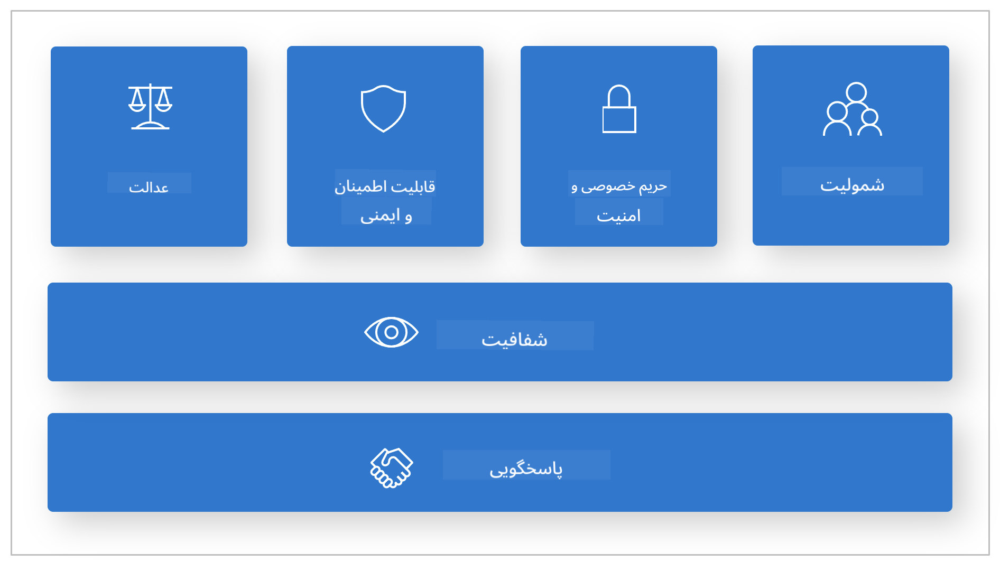
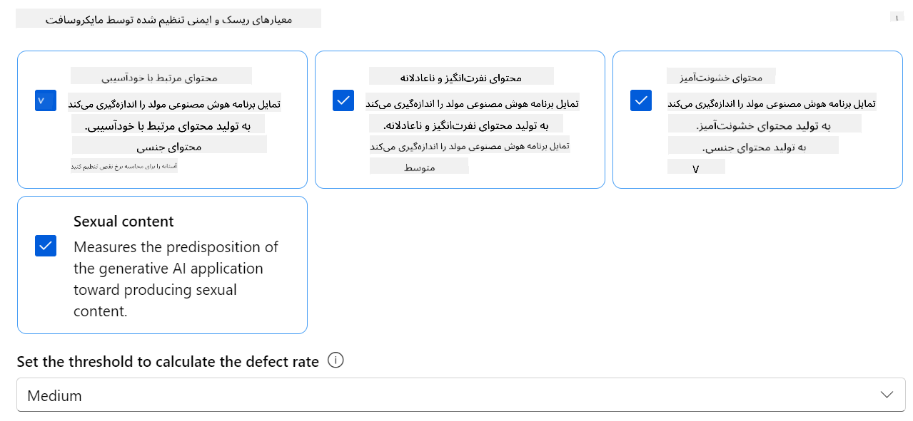
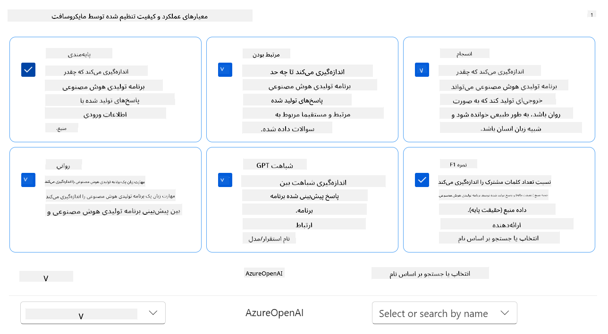
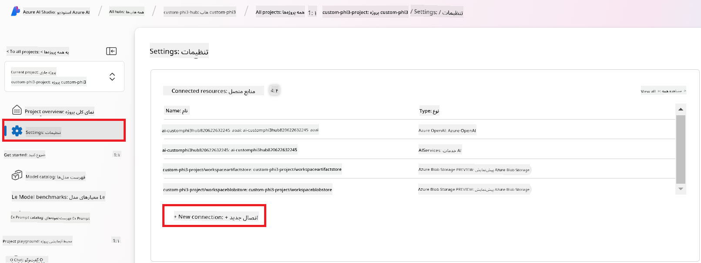
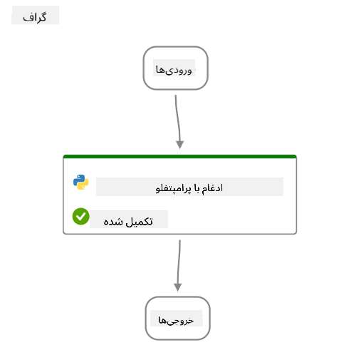
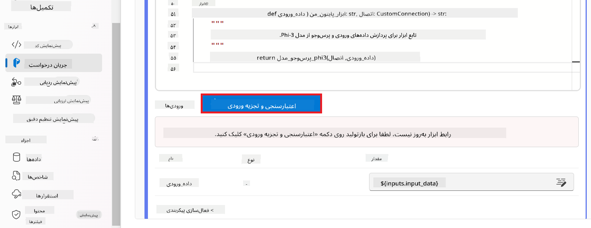
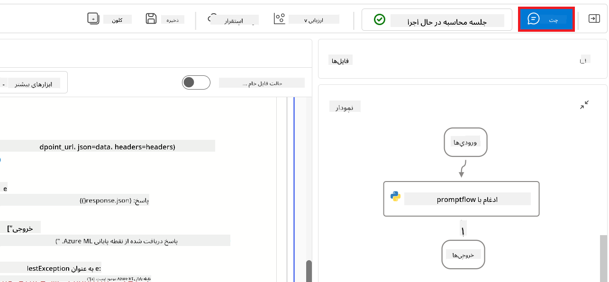
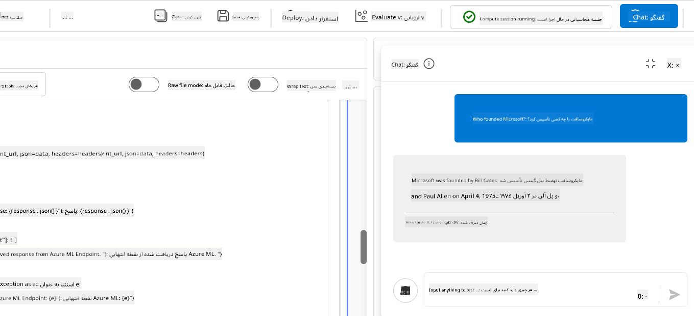

<!--
CO_OP_TRANSLATOR_METADATA:
{
  "original_hash": "80a853c08e4ee25ef9b4bfcedd8990da",
  "translation_date": "2025-05-07T14:20:48+00:00",
  "source_file": "md/02.Application/01.TextAndChat/Phi3/E2E_Phi-3-Evaluation_AIFoundry.md",
  "language_code": "fa"
}
-->
# ارزیابی مدل Fine-tuned Phi-3 / Phi-3.5 در Azure AI Foundry با تمرکز بر اصول مسئولانه هوش مصنوعی مایکروسافت

این نمونه کامل (E2E) بر اساس راهنمای "[Evaluate Fine-tuned Phi-3 / 3.5 Models in Azure AI Foundry Focusing on Microsoft's Responsible AI](https://techcommunity.microsoft.com/blog/educatordeveloperblog/evaluate-fine-tuned-phi-3--3-5-models-in-azure-ai-studio-focusing-on-microsofts-/4227850?WT.mc_id=aiml-137032-kinfeylo)" از جامعه فناوری مایکروسافت است.

## مرور کلی

### چگونه می‌توانید ایمنی و عملکرد مدل Fine-tuned Phi-3 / Phi-3.5 را در Azure AI Foundry ارزیابی کنید؟

فاین‌تیون کردن مدل گاهی ممکن است به پاسخ‌های ناخواسته یا نامطلوب منجر شود. برای اطمینان از اینکه مدل ایمن و مؤثر باقی می‌ماند، مهم است که پتانسیل مدل برای تولید محتوای مضر و توانایی آن در ارائه پاسخ‌های دقیق، مرتبط و منسجم را ارزیابی کنید. در این آموزش، شما یاد می‌گیرید چگونه ایمنی و عملکرد مدل Fine-tuned Phi-3 / Phi-3.5 که با Prompt flow در Azure AI Foundry ادغام شده را ارزیابی کنید.

فرآیند ارزیابی Azure AI Foundry به شرح زیر است.


*منبع تصویر: [Evaluation of generative AI applications](https://learn.microsoft.com/azure/ai-studio/concepts/evaluation-approach-gen-ai?wt.mc_id%3Dstudentamb_279723)*

> [!NOTE]
>
> برای اطلاعات دقیق‌تر و دسترسی به منابع بیشتر درباره Phi-3 / Phi-3.5، لطفاً به [Phi-3CookBook](https://github.com/microsoft/Phi-3CookBook?wt.mc_id=studentamb_279723) مراجعه کنید.

### پیش‌نیازها

- [Python](https://www.python.org/downloads)
- [اشتراک Azure](https://azure.microsoft.com/free?wt.mc_id=studentamb_279723)
- [Visual Studio Code](https://code.visualstudio.com)
- مدل Fine-tuned Phi-3 / Phi-3.5

### فهرست مطالب

1. [**سناریو 1: معرفی ارزیابی Prompt flow در Azure AI Foundry**](../../../../../../md/02.Application/01.TextAndChat/Phi3)

    - [معرفی ارزیابی ایمنی](../../../../../../md/02.Application/01.TextAndChat/Phi3)
    - [معرفی ارزیابی عملکرد](../../../../../../md/02.Application/01.TextAndChat/Phi3)

1. [**سناریو 2: ارزیابی مدل Phi-3 / Phi-3.5 در Azure AI Foundry**](../../../../../../md/02.Application/01.TextAndChat/Phi3)

    - [قبل از شروع](../../../../../../md/02.Application/01.TextAndChat/Phi3)
    - [استقرار Azure OpenAI برای ارزیابی مدل Phi-3 / Phi-3.5](../../../../../../md/02.Application/01.TextAndChat/Phi3)
    - [ارزیابی مدل Fine-tuned Phi-3 / Phi-3.5 با استفاده از ارزیابی Prompt flow در Azure AI Foundry](../../../../../../md/02.Application/01.TextAndChat/Phi3)

1. [تبریک!](../../../../../../md/02.Application/01.TextAndChat/Phi3)

## **سناریو 1: معرفی ارزیابی Prompt flow در Azure AI Foundry**

### معرفی ارزیابی ایمنی

برای اطمینان از اخلاقی و ایمن بودن مدل هوش مصنوعی شما، ارزیابی آن بر اساس اصول مسئولانه هوش مصنوعی مایکروسافت ضروری است. در Azure AI Foundry، ارزیابی‌های ایمنی به شما امکان می‌دهد آسیب‌پذیری مدل خود در برابر حملات jailbreak و پتانسیل آن برای تولید محتوای مضر را ارزیابی کنید که مستقیماً با این اصول هم‌راستا است.


*منبع تصویر: [Evaluation of generative AI applications](https://learn.microsoft.com/azure/ai-studio/concepts/evaluation-approach-gen-ai?wt.mc_id%3Dstudentamb_279723)*

#### اصول مسئولانه هوش مصنوعی مایکروسافت

قبل از شروع مراحل فنی، درک اصول مسئولانه هوش مصنوعی مایکروسافت ضروری است؛ چارچوب اخلاقی‌ای که برای هدایت توسعه، استقرار و عملیات مسئولانه سیستم‌های هوش مصنوعی طراحی شده است. این اصول طراحی، توسعه و استقرار مسئولانه سیستم‌های هوش مصنوعی را هدایت می‌کنند و تضمین می‌کنند که فناوری‌های هوش مصنوعی به شکلی عادلانه، شفاف و فراگیر ساخته شوند. این اصول پایه‌ای برای ارزیابی ایمنی مدل‌های هوش مصنوعی هستند.

اصول مسئولانه هوش مصنوعی مایکروسافت شامل موارد زیر است:

- **عدالت و فراگیری**: سیستم‌های هوش مصنوعی باید با همه به طور عادلانه رفتار کنند و از تأثیرگذاری متفاوت بر گروه‌های مشابه اجتناب کنند. برای مثال، وقتی سیستم‌های هوش مصنوعی راهنمایی‌هایی درباره درمان پزشکی، درخواست وام یا استخدام ارائه می‌دهند، باید به همه افرادی که علائم، شرایط مالی یا صلاحیت‌های حرفه‌ای مشابه دارند، توصیه‌های مشابهی بدهند.

- **قابلیت اطمینان و ایمنی**: برای ایجاد اعتماد، حیاتی است که سیستم‌های هوش مصنوعی به طور قابل اطمینان، ایمن و مداوم عمل کنند. این سیستم‌ها باید بتوانند همانطور که در ابتدا طراحی شده‌اند کار کنند، به شرایط پیش‌بینی نشده به صورت ایمن پاسخ دهند و در برابر دستکاری‌های مضر مقاومت کنند. رفتار آن‌ها و تنوع شرایطی که می‌توانند مدیریت کنند، بازتابی از دامنه موقعیت‌ها و شرایطی است که توسعه‌دهندگان در طول طراحی و آزمایش پیش‌بینی کرده‌اند.

- **شفافیت**: وقتی سیستم‌های هوش مصنوعی به تصمیماتی کمک می‌کنند که تأثیرات زیادی بر زندگی مردم دارند، ضروری است که مردم بفهمند این تصمیمات چگونه گرفته شده‌اند. برای مثال، یک بانک ممکن است از سیستم هوش مصنوعی برای تعیین اعتبارسنجی فرد استفاده کند. یک شرکت ممکن است از سیستم هوش مصنوعی برای انتخاب واجدترین کاندیداها برای استخدام استفاده کند.

- **حریم خصوصی و امنیت**: با گسترش هوش مصنوعی، حفاظت از حریم خصوصی و امنیت اطلاعات شخصی و تجاری اهمیت و پیچیدگی بیشتری پیدا کرده است. با هوش مصنوعی، حریم خصوصی و امنیت داده‌ها نیازمند توجه ویژه‌ای هستند زیرا دسترسی به داده‌ها برای سیستم‌های هوش مصنوعی ضروری است تا پیش‌بینی‌ها و تصمیمات دقیق و آگاهانه درباره افراد اتخاذ کنند.

- **پاسخگویی**: افرادی که سیستم‌های هوش مصنوعی را طراحی و پیاده‌سازی می‌کنند باید مسئول نحوه عملکرد سیستم‌های خود باشند. سازمان‌ها باید از استانداردهای صنعتی برای توسعه هنجارهای پاسخگویی استفاده کنند. این هنجارها می‌توانند تضمین کنند که سیستم‌های هوش مصنوعی مرجع نهایی هیچ تصمیمی که زندگی مردم را تحت تأثیر قرار می‌دهد نیستند و همچنین اطمینان دهند که انسان‌ها کنترل معناداری بر سیستم‌های هوش مصنوعی کاملاً خودکار دارند.



*منبع تصویر: [What is Responsible AI?](https://learn.microsoft.com/azure/machine-learning/concept-responsible-ai?view=azureml-api-2&viewFallbackFrom=azureml-api-2%253fwt.mc_id%3Dstudentamb_279723)*

> [!NOTE]
> برای کسب اطلاعات بیشتر درباره اصول مسئولانه هوش مصنوعی مایکروسافت، به [What is Responsible AI?](https://learn.microsoft.com/azure/machine-learning/concept-responsible-ai?view=azureml-api-2?wt.mc_id=studentamb_279723) مراجعه کنید.

#### معیارهای ایمنی

در این آموزش، ایمنی مدل Fine-tuned Phi-3 را با استفاده از معیارهای ایمنی Azure AI Foundry ارزیابی خواهید کرد. این معیارها به شما کمک می‌کنند تا پتانسیل مدل برای تولید محتوای مضر و آسیب‌پذیری آن در برابر حملات jailbreak را بسنجید. معیارهای ایمنی شامل موارد زیر است:

- **محتوای مرتبط با خودآسیبی**: ارزیابی می‌کند که آیا مدل تمایل به تولید محتوای مرتبط با خودآسیبی دارد یا خیر.
- **محتوای نفرت‌انگیز و ناعادلانه**: ارزیابی می‌کند که آیا مدل تمایل به تولید محتوای نفرت‌انگیز یا ناعادلانه دارد یا خیر.
- **محتوای خشونت‌آمیز**: ارزیابی می‌کند که آیا مدل تمایل به تولید محتوای خشونت‌آمیز دارد یا خیر.
- **محتوای جنسی**: ارزیابی می‌کند که آیا مدل تمایل به تولید محتوای جنسی نامناسب دارد یا خیر.

ارزیابی این جنبه‌ها تضمین می‌کند که مدل هوش مصنوعی محتوای مضر یا توهین‌آمیز تولید نکند و با ارزش‌های اجتماعی و استانداردهای قانونی هم‌راستا باشد.



### معرفی ارزیابی عملکرد

برای اطمینان از اینکه مدل هوش مصنوعی شما مطابق انتظار عمل می‌کند، مهم است که عملکرد آن را بر اساس معیارهای عملکرد ارزیابی کنید. در Azure AI Foundry، ارزیابی‌های عملکرد به شما امکان می‌دهند اثربخشی مدل خود را در تولید پاسخ‌های دقیق، مرتبط و منسجم بسنجید.


*منبع تصویر: [Evaluation of generative AI applications](https://learn.microsoft.com/azure/ai-studio/concepts/evaluation-approach-gen-ai?wt.mc_id%3Dstudentamb_279723)*

#### معیارهای عملکرد

در این آموزش، عملکرد مدل Fine-tuned Phi-3 / Phi-3.5 را با استفاده از معیارهای عملکرد Azure AI Foundry ارزیابی خواهید کرد. این معیارها به شما کمک می‌کنند اثربخشی مدل را در تولید پاسخ‌های دقیق، مرتبط و منسجم بسنجید. معیارهای عملکرد شامل موارد زیر است:

- **مبنایی بودن**: ارزیابی می‌کند که پاسخ‌های تولید شده چقدر با اطلاعات منبع ورودی هم‌راستا هستند.
- **مرتبط بودن**: میزان ارتباط پاسخ‌های تولید شده با سوالات داده شده را ارزیابی می‌کند.
- **انسجام**: ارزیابی می‌کند که متن تولید شده چقدر روان، طبیعی و شبیه زبان انسانی است.
- **روان بودن**: مهارت زبانی متن تولید شده را ارزیابی می‌کند.
- **شباهت به GPT**: پاسخ تولید شده را با حقیقت زمینه برای سنجش شباهت مقایسه می‌کند.
- **امتیاز F1**: نسبت کلمات مشترک بین پاسخ تولید شده و داده منبع را محاسبه می‌کند.

این معیارها به شما کمک می‌کنند اثربخشی مدل را در تولید پاسخ‌های دقیق، مرتبط و منسجم بسنجید.



## **سناریو 2: ارزیابی مدل Phi-3 / Phi-3.5 در Azure AI Foundry**

### قبل از شروع

این آموزش ادامه پست‌های قبلی وبلاگ، "[Fine-Tune and Integrate Custom Phi-3 Models with Prompt Flow: Step-by-Step Guide](https://techcommunity.microsoft.com/t5/educator-developer-blog/fine-tune-and-integrate-custom-phi-3-models-with-prompt-flow/ba-p/4178612?wt.mc_id=studentamb_279723)" و "[Fine-Tune and Integrate Custom Phi-3 Models with Prompt Flow in Azure AI Foundry](https://techcommunity.microsoft.com/t5/educator-developer-blog/fine-tune-and-integrate-custom-phi-3-models-with-prompt-flow-in/ba-p/4191726?wt.mc_id=studentamb_279723)" است. در این پست‌ها، فرآیند فاین‌تیون مدل Phi-3 / Phi-3.5 در Azure AI Foundry و ادغام آن با Prompt flow را مرور کردیم.

در این آموزش، شما یک مدل Azure OpenAI را به عنوان ارزیاب در Azure AI Foundry مستقر می‌کنید و از آن برای ارزیابی مدل Fine-tuned Phi-3 / Phi-3.5 خود استفاده خواهید کرد.

قبل از شروع این آموزش، مطمئن شوید که پیش‌نیازهای زیر را دارید، همانطور که در آموزش‌های قبلی توضیح داده شده است:

1. یک مجموعه داده آماده برای ارزیابی مدل Fine-tuned Phi-3 / Phi-3.5.
1. یک مدل Phi-3 / Phi-3.5 که فاین‌تیون شده و در Azure Machine Learning مستقر شده است.
1. یک Prompt flow که با مدل Fine-tuned Phi-3 / Phi-3.5 شما در Azure AI Foundry ادغام شده است.

> [!NOTE]
> شما از فایل *test_data.jsonl* که در پوشه داده‌ها از مجموعه داده **ULTRACHAT_200k** دانلود شده در پست‌های قبلی وبلاگ قرار دارد، به عنوان مجموعه داده برای ارزیابی مدل Fine-tuned Phi-3 / Phi-3.5 استفاده خواهید کرد.

#### ادغام مدل سفارشی Phi-3 / Phi-3.5 با Prompt flow در Azure AI Foundry (رویکرد کد اول)

> [!NOTE]
> اگر رویکرد کم‌کد که در "[Fine-Tune and Integrate Custom Phi-3 Models with Prompt Flow in Azure AI Foundry](https://techcommunity.microsoft.com/t5/educator-developer-blog/fine-tune-and-integrate-custom-phi-3-models-with-prompt-flow-in/ba-p/4191726?wt.mc_id=studentamb_279723)" توضیح داده شده را دنبال کرده‌اید، می‌توانید این تمرین را رد کنید و به تمرین بعدی بروید.
> با این حال، اگر رویکرد کد اول که در "[Fine-Tune and Integrate Custom Phi-3 Models with Prompt Flow: Step-by-Step Guide](https://techcommunity.microsoft.com/t5/educator-developer-blog/fine-tune-and-integrate-custom-phi-3-models-with-prompt-flow/ba-p/4178612?wt.mc_id=studentamb_279723)" توضیح داده شده را برای فاین‌تیون و استقرار مدل Phi-3 / Phi-3.5 خود دنبال کرده‌اید، فرآیند اتصال مدل به Prompt flow کمی متفاوت است. شما این فرآیند را در این تمرین یاد خواهید گرفت.

برای ادامه، باید مدل Fine-tuned Phi-3 / Phi-3.5 خود را در Prompt flow در Azure AI Foundry ادغام کنید.

#### ایجاد Azure AI Foundry Hub

قبل از ایجاد پروژه، باید یک Hub ایجاد کنید. Hub مانند Resource Group عمل می‌کند و به شما امکان می‌دهد چندین پروژه را در Azure AI Foundry سازماندهی و مدیریت کنید.

1. وارد [Azure AI Foundry](https://ai.azure.com/?wt.mc_id=studentamb_279723) شوید.

1. از تب سمت چپ، **All hubs** را انتخاب کنید.

1. از منوی ناوبری، **+ New hub** را انتخاب کنید.

    

1. کارهای زیر را انجام دهید:

    - نام **Hub** را وارد کنید. باید یک مقدار یکتا باشد.
    - اشتراک Azure خود را انتخاب کنید.
    - گروه منابع (**Resource group**) مورد استفاده را انتخاب کنید (در صورت نیاز یک گروه جدید ایجاد کنید).
    - مکان (**Location**) مورد نظر خود را انتخاب کنید.
    - **Connect Azure AI Services** مورد استفاده را انتخاب کنید (در صورت نیاز یک مورد جدید ایجاد کنید).
    - برای **Connect Azure AI Search** گزینه **Skip connecting** را انتخاب کنید.


1. گزینه **Next** را انتخاب کنید.

#### ایجاد پروژه Azure AI Foundry

1. در هابی که ایجاد کرده‌اید، از تب سمت چپ گزینه **All projects** را انتخاب کنید.

1. از منوی ناوبری گزینه **+ New project** را انتخاب کنید.

    

1. نام پروژه (**Project name**) را وارد کنید. این نام باید منحصر به فرد باشد.

    

1. گزینه **Create a project** را انتخاب کنید.

#### افزودن اتصال سفارشی برای مدل تنظیم‌شده Phi-3 / Phi-3.5

برای ادغام مدل سفارشی Phi-3 / Phi-3.5 خود با Prompt flow، باید نقطه انتهایی و کلید مدل را در یک اتصال سفارشی ذخیره کنید. این تنظیم تضمین می‌کند که به مدل سفارشی Phi-3 / Phi-3.5 خود در Prompt flow دسترسی داشته باشید.

#### تنظیم api key و endpoint uri مدل تنظیم‌شده Phi-3 / Phi-3.5

1. به [Azure ML Studio](https://ml.azure.com/home?wt.mc_id=studentamb_279723) مراجعه کنید.

1. به فضای کاری Azure Machine learning که ایجاد کرده‌اید، بروید.

1. از تب سمت چپ گزینه **Endpoints** را انتخاب کنید.

    

1. نقطه انتهایی که ایجاد کرده‌اید را انتخاب کنید.

    

1. از منوی ناوبری گزینه **Consume** را انتخاب کنید.

1. **REST endpoint** و **Primary key** خود را کپی کنید.

    

#### افزودن اتصال سفارشی

1. به [Azure AI Foundry](https://ai.azure.com/?wt.mc_id=studentamb_279723) مراجعه کنید.

1. به پروژه Azure AI Foundry که ایجاد کرده‌اید، بروید.

1. در پروژه‌ای که ایجاد کرده‌اید، از تب سمت چپ گزینه **Settings** را انتخاب کنید.

1. گزینه **+ New connection** را انتخاب کنید.

    

1. از منوی ناوبری گزینه **Custom keys** را انتخاب کنید.

    

1. کارهای زیر را انجام دهید:

    - گزینه **+ Add key value pairs** را انتخاب کنید.
    - برای نام کلید، **endpoint** را وارد کنید و نقطه انتهایی که از Azure ML Studio کپی کرده‌اید را در فیلد مقدار وارد کنید.
    - دوباره گزینه **+ Add key value pairs** را انتخاب کنید.
    - برای نام کلید، **key** را وارد کنید و کلیدی که از Azure ML Studio کپی کرده‌اید را در فیلد مقدار وارد کنید.
    - پس از افزودن کلیدها، گزینه **is secret** را انتخاب کنید تا کلیدها مخفی بمانند.

    

1. گزینه **Add connection** را انتخاب کنید.

#### ایجاد Prompt flow

شما یک اتصال سفارشی در Azure AI Foundry اضافه کرده‌اید. حالا بیایید با استفاده از مراحل زیر یک Prompt flow ایجاد کنیم. سپس این Prompt flow را به اتصال سفارشی متصل خواهید کرد تا بتوانید از مدل تنظیم‌شده در داخل Prompt flow استفاده کنید.

1. به پروژه Azure AI Foundry که ایجاد کرده‌اید بروید.

1. از تب سمت چپ گزینه **Prompt flow** را انتخاب کنید.

1. از منوی ناوبری گزینه **+ Create** را انتخاب کنید.

    

1. از منوی ناوبری گزینه **Chat flow** را انتخاب کنید.

    

1. نام پوشه (**Folder name**) را وارد کنید.

    

1. گزینه **Create** را انتخاب کنید.

#### راه‌اندازی Prompt flow برای گفتگو با مدل سفارشی Phi-3 / Phi-3.5

شما باید مدل تنظیم‌شده Phi-3 / Phi-3.5 را در یک Prompt flow ادغام کنید. با این حال، Prompt flow موجود برای این منظور طراحی نشده است. بنابراین باید Prompt flow را بازطراحی کنید تا امکان ادغام مدل سفارشی فراهم شود.

1. در Prompt flow، کارهای زیر را برای بازسازی جریان موجود انجام دهید:

    - گزینه **Raw file mode** را انتخاب کنید.
    - تمام کد موجود در فایل *flow.dag.yml* را حذف کنید.
    - کد زیر را به *flow.dag.yml* اضافه کنید.

        ```yml
        inputs:
          input_data:
            type: string
            default: "Who founded Microsoft?"

        outputs:
          answer:
            type: string
            reference: ${integrate_with_promptflow.output}

        nodes:
        - name: integrate_with_promptflow
          type: python
          source:
            type: code
            path: integrate_with_promptflow.py
          inputs:
            input_data: ${inputs.input_data}
        ```

    - گزینه **Save** را انتخاب کنید.

    

1. کد زیر را به *integrate_with_promptflow.py* اضافه کنید تا از مدل سفارشی Phi-3 / Phi-3.5 در Prompt flow استفاده کنید.

    ```python
    import logging
    import requests
    from promptflow import tool
    from promptflow.connections import CustomConnection

    # Logging setup
    logging.basicConfig(
        format="%(asctime)s - %(levelname)s - %(name)s - %(message)s",
        datefmt="%Y-%m-%d %H:%M:%S",
        level=logging.DEBUG
    )
    logger = logging.getLogger(__name__)

    def query_phi3_model(input_data: str, connection: CustomConnection) -> str:
        """
        Send a request to the Phi-3 / Phi-3.5 model endpoint with the given input data using Custom Connection.
        """

        # "connection" is the name of the Custom Connection, "endpoint", "key" are the keys in the Custom Connection
        endpoint_url = connection.endpoint
        api_key = connection.key

        headers = {
            "Content-Type": "application/json",
            "Authorization": f"Bearer {api_key}"
        }
    data = {
        "input_data": [input_data],
        "params": {
            "temperature": 0.7,
            "max_new_tokens": 128,
            "do_sample": True,
            "return_full_text": True
            }
        }
        try:
            response = requests.post(endpoint_url, json=data, headers=headers)
            response.raise_for_status()
            
            # Log the full JSON response
            logger.debug(f"Full JSON response: {response.json()}")

            result = response.json()["output"]
            logger.info("Successfully received response from Azure ML Endpoint.")
            return result
        except requests.exceptions.RequestException as e:
            logger.error(f"Error querying Azure ML Endpoint: {e}")
            raise

    @tool
    def my_python_tool(input_data: str, connection: CustomConnection) -> str:
        """
        Tool function to process input data and query the Phi-3 / Phi-3.5 model.
        """
        return query_phi3_model(input_data, connection)

    ```

    

> [!NOTE]
> برای اطلاعات دقیق‌تر درباره استفاده از Prompt flow در Azure AI Foundry، می‌توانید به [Prompt flow in Azure AI Foundry](https://learn.microsoft.com/azure/ai-studio/how-to/prompt-flow) مراجعه کنید.

1. گزینه‌های **Chat input** و **Chat output** را برای فعال کردن گفتگو با مدل خود انتخاب کنید.

    

1. حالا آماده‌اید تا با مدل سفارشی Phi-3 / Phi-3.5 خود گفتگو کنید. در تمرین بعدی، یاد خواهید گرفت چگونه Prompt flow را راه‌اندازی کنید و از آن برای گفتگو با مدل تنظیم‌شده استفاده کنید.

> [!NOTE]
>
> جریان بازسازی‌شده باید مشابه تصویر زیر باشد:
>
> 
>

#### شروع Prompt flow

1. گزینه **Start compute sessions** را برای شروع Prompt flow انتخاب کنید.

    

1. گزینه **Validate and parse input** را برای به‌روزرسانی پارامترها انتخاب کنید.

    

1. مقدار **connection** را به اتصال سفارشی که ایجاد کرده‌اید تنظیم کنید. برای مثال، *connection*.

    

#### گفتگو با مدل سفارشی Phi-3 / Phi-3.5

1. گزینه **Chat** را انتخاب کنید.

    

1. این یک نمونه از نتایج است: اکنون می‌توانید با مدل سفارشی Phi-3 / Phi-3.5 خود گفتگو کنید. توصیه می‌شود سوالات خود را بر اساس داده‌های استفاده‌شده برای تنظیم دقیق مطرح کنید.

    

### استقرار Azure OpenAI برای ارزیابی مدل Phi-3 / Phi-3.5

برای ارزیابی مدل Phi-3 / Phi-3.5 در Azure AI Foundry، باید یک مدل Azure OpenAI را مستقر کنید. این مدل برای ارزیابی عملکرد مدل Phi-3 / Phi-3.5 استفاده خواهد شد.

#### استقرار Azure OpenAI

1. وارد [Azure AI Foundry](https://ai.azure.com/?wt.mc_id=studentamb_279723) شوید.

1. به پروژه Azure AI Foundry که ایجاد کرده‌اید بروید.

    

1. در پروژه‌ای که ایجاد کرده‌اید، از تب سمت چپ گزینه **Deployments** را انتخاب کنید.

1. از منوی ناوبری گزینه **+ Deploy model** را انتخاب کنید.

1. گزینه **Deploy base model** را انتخاب کنید.

    

1. مدل Azure OpenAI که می‌خواهید استفاده کنید را انتخاب کنید. برای مثال، **gpt-4o**.

    

1. گزینه **Confirm** را انتخاب کنید.

### ارزیابی مدل تنظیم‌شده Phi-3 / Phi-3.5 با استفاده از ارزیابی Prompt flow در Azure AI Foundry

### شروع یک ارزیابی جدید

1. به [Azure AI Foundry](https://ai.azure.com/?wt.mc_id=studentamb_279723) مراجعه کنید.

1. به پروژه Azure AI Foundry که ایجاد کرده‌اید بروید.

    

1. در پروژه‌ای که ایجاد کرده‌اید، از تب سمت چپ گزینه **Evaluation** را انتخاب کنید.

1. از منوی ناوبری گزینه **+ New evaluation** را انتخاب کنید.


1. ارزیابی **Prompt flow** را انتخاب کنید.

    

1. کارهای زیر را انجام دهید:

    - نام ارزیابی را وارد کنید. باید یک مقدار منحصر به فرد باشد.
    - نوع کار را **Question and answer without context** انتخاب کنید. زیرا داده‌های **UlTRACHAT_200k** که در این آموزش استفاده شده‌اند، شامل زمینه نیستند.
    - جریان پرامپتی را که می‌خواهید ارزیابی کنید، انتخاب کنید.

    

1. روی **Next** کلیک کنید.

1. کارهای زیر را انجام دهید:

    - برای بارگذاری داده‌ها، **Add your dataset** را انتخاب کنید. به عنوان مثال، می‌توانید فایل داده آزمایشی مانند *test_data.json1* را که هنگام دانلود مجموعه داده **ULTRACHAT_200k** همراه آن است، بارگذاری کنید.
    - ستون مناسب **Dataset column** را که با داده‌های شما مطابقت دارد، انتخاب کنید. به عنوان مثال، اگر از مجموعه داده **ULTRACHAT_200k** استفاده می‌کنید، **${data.prompt}** را به عنوان ستون داده انتخاب کنید.

    

1. روی **Next** کلیک کنید.

1. برای پیکربندی معیارهای عملکرد و کیفیت، کارهای زیر را انجام دهید:

    - معیارهای عملکرد و کیفیت مورد نظر خود را انتخاب کنید.
    - مدل Azure OpenAI که برای ارزیابی ساخته‌اید را انتخاب کنید. به عنوان مثال، **gpt-4o** را انتخاب کنید.

    

1. برای پیکربندی معیارهای ریسک و ایمنی، کارهای زیر را انجام دهید:

    - معیارهای ریسک و ایمنی مورد نظر خود را انتخاب کنید.
    - آستانه‌ای که برای محاسبه نرخ خطا می‌خواهید استفاده کنید را انتخاب کنید. به عنوان مثال، **Medium** را انتخاب کنید.
    - برای **question**، منبع داده را روی **{$data.prompt}** تنظیم کنید.
    - برای **answer**، منبع داده را روی **{$run.outputs.answer}** تنظیم کنید.
    - برای **ground_truth**، منبع داده را روی **{$data.message}** تنظیم کنید.

    

1. روی **Next** کلیک کنید.

1. برای شروع ارزیابی، روی **Submit** کلیک کنید.

1. ارزیابی مدتی طول می‌کشد تا کامل شود. می‌توانید پیشرفت را در تب **Evaluation** دنبال کنید.

### مرور نتایج ارزیابی

> [!NOTE]
> نتایج ارائه شده در زیر برای نشان دادن روند ارزیابی است. در این آموزش، از مدلی استفاده شده که روی مجموعه داده نسبتاً کوچکی آموزش دیده است، که ممکن است به نتایج بهینه نرسد. نتایج واقعی ممکن است بسته به اندازه، کیفیت و تنوع داده‌های استفاده شده و همچنین پیکربندی خاص مدل به طور قابل توجهی متفاوت باشد.

پس از پایان ارزیابی، می‌توانید نتایج مربوط به معیارهای عملکرد و ایمنی را مرور کنید.

1. معیارهای عملکرد و کیفیت:

    - اثربخشی مدل در تولید پاسخ‌های منسجم، روان و مرتبط را ارزیابی کنید.

    

1. معیارهای ریسک و ایمنی:

    - اطمینان حاصل کنید که خروجی‌های مدل ایمن بوده و با اصول هوش مصنوعی مسئولانه همسو باشند و از هرگونه محتوای مضر یا توهین‌آمیز اجتناب شود.

    

1. می‌توانید برای مشاهده **نتایج دقیق معیارها** به پایین صفحه اسکرول کنید.

    

1. با ارزیابی مدل سفارشی Phi-3 / Phi-3.5 خود بر اساس معیارهای عملکرد و ایمنی، می‌توانید تأیید کنید که مدل نه تنها مؤثر است، بلکه مطابق با اصول هوش مصنوعی مسئولانه عمل می‌کند و آماده استفاده در دنیای واقعی است.

## تبریک!

### شما این آموزش را کامل کردید

شما با موفقیت مدل Phi-3 را که با Prompt flow در Azure AI Foundry یکپارچه شده است، ارزیابی کردید. این گامی مهم برای اطمینان از این است که مدل‌های هوش مصنوعی شما نه تنها عملکرد خوبی دارند، بلکه با اصول هوش مصنوعی مسئولانه مایکروسافت همسو هستند تا به شما در ساخت برنامه‌های هوش مصنوعی قابل اعتماد و مطمئن کمک کنند.


## پاک‌سازی منابع Azure

برای جلوگیری از هزینه‌های اضافی، منابع Azure خود را پاک کنید. به پرتال Azure بروید و منابع زیر را حذف کنید:

- منبع Azure Machine learning.
- نقطه انتهایی مدل Azure Machine learning.
- منبع پروژه Azure AI Foundry.
- منبع Prompt flow در Azure AI Foundry.

### مراحل بعدی

#### مستندات

- [ارزیابی سیستم‌های هوش مصنوعی با استفاده از داشبورد Responsible AI](https://learn.microsoft.com/azure/machine-learning/concept-responsible-ai-dashboard?view=azureml-api-2&source=recommendations?wt.mc_id=studentamb_279723)
- [معیارهای ارزیابی و نظارت برای هوش مصنوعی مولد](https://learn.microsoft.com/azure/ai-studio/concepts/evaluation-metrics-built-in?tabs=definition?wt.mc_id=studentamb_279723)
- [مستندات Azure AI Foundry](https://learn.microsoft.com/azure/ai-studio/?wt.mc_id=studentamb_279723)
- [مستندات Prompt flow](https://microsoft.github.io/promptflow/?wt.mc_id=studentamb_279723)

#### محتوای آموزشی

- [مقدمه‌ای بر رویکرد Responsible AI مایکروسافت](https://learn.microsoft.com/training/modules/introduction-to-microsofts-responsible-ai-approach/?source=recommendations?wt.mc_id=studentamb_279723)
- [مقدمه‌ای بر Azure AI Foundry](https://learn.microsoft.com/training/modules/introduction-to-azure-ai-studio/?wt.mc_id=studentamb_279723)

### منابع

- [هوش مصنوعی مسئولانه چیست؟](https://learn.microsoft.com/azure/machine-learning/concept-responsible-ai?view=azureml-api-2?wt.mc_id=studentamb_279723)
- [معرفی ابزارهای جدید در Azure AI برای کمک به ساخت برنامه‌های هوش مصنوعی مولد امن‌تر و قابل اعتمادتر](https://azure.microsoft.com/blog/announcing-new-tools-in-azure-ai-to-help-you-build-more-secure-and-trustworthy-generative-ai-applications/?wt.mc_id=studentamb_279723)
- [ارزیابی برنامه‌های هوش مصنوعی مولد](https://learn.microsoft.com/azure/ai-studio/concepts/evaluation-approach-gen-ai?wt.mc_id%3Dstudentamb_279723)

**سلب مسئولیت**:  
این سند با استفاده از سرویس ترجمه هوش مصنوعی [Co-op Translator](https://github.com/Azure/co-op-translator) ترجمه شده است. در حالی که ما در تلاش برای دقت هستیم، لطفاً توجه داشته باشید که ترجمه‌های خودکار ممکن است حاوی اشتباهات یا نواقصی باشند. سند اصلی به زبان بومی خود باید به عنوان منبع معتبر در نظر گرفته شود. برای اطلاعات حیاتی، ترجمه حرفه‌ای انسانی توصیه می‌شود. ما مسئول هیچ گونه سوءتفاهم یا برداشت نادرستی که از استفاده این ترجمه ناشی شود، نیستیم.