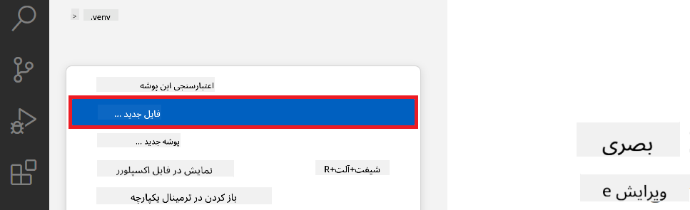
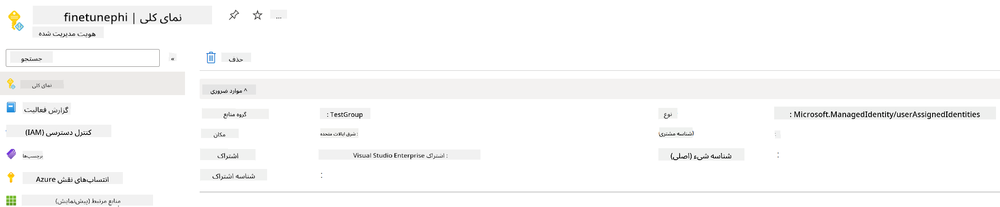

<!--
CO_OP_TRANSLATOR_METADATA:
{
  "original_hash": "7ca2c30fdb802664070e9cfbf92e24fe",
  "translation_date": "2026-01-05T17:00:09+00:00",
  "source_file": "md/02.Application/01.TextAndChat/Phi3/E2E_Phi-3-FineTuning_PromptFlow_Integration.md",
  "language_code": "fa"
}
-->
# آموزش بهینه‌سازی و یکپارچه‌سازی مدل‌های سفارشی Phi-3 با Prompt flow

این نمونه پایان به پایان (E2E) بر اساس راهنمای "[بهینه‌سازی و یکپارچه‌سازی مدل‌های سفارشی Phi-3 با Prompt Flow: راهنمای گام به گام](https://techcommunity.microsoft.com/t5/educator-developer-blog/fine-tune-and-integrate-custom-phi-3-models-with-prompt-flow/ba-p/4178612?WT.mc_id=aiml-137032-kinfeylo)" از جامعه فناوری مایکروسافت است. این راهنما فرآیندهای بهینه‌سازی، استقرار و یکپارچه‌سازی مدل‌های سفارشی Phi-3 با Prompt flow را معرفی می‌کند.

## مرور کلی

در این نمونه پایان به پایان، شما یاد می‌گیرید چگونه مدل Phi-3 را بهینه‌سازی کنید و آن را با Prompt flow یکپارچه کنید. با استفاده از Azure Machine Learning و Prompt flow، شما یک جریان کاری برای استقرار و استفاده از مدل‌های هوش مصنوعی سفارشی ایجاد خواهید کرد. این نمونه E2E به سه سناریو تقسیم شده است:

**سناریو ۱: راه‌اندازی منابع Azure و آماده‌سازی برای بهینه‌سازی**

**سناریو ۲: بهینه‌سازی مدل Phi-3 و استقرار در Azure Machine Learning Studio**

**سناریو ۳: یکپارچه‌سازی با Prompt flow و گفتگو با مدل سفارشی شما**

در اینجا یک نمای کلی از این نمونه E2E آمده است.


### فهرست مطالب

1. **[سناریو ۱: راه‌اندازی منابع Azure و آماده‌سازی برای بهینه‌سازی](../../../../../../md/02.Application/01.TextAndChat/Phi3)**
    - [ایجاد کار فضای کاری Azure Machine Learning](../../../../../../md/02.Application/01.TextAndChat/Phi3)
    - [درخواست سهمیه GPU در اشتراک Azure](../../../../../../md/02.Application/01.TextAndChat/Phi3)
    - [افزودن انتساب نقش](../../../../../../md/02.Application/01.TextAndChat/Phi3)
    - [راه‌اندازی پروژه](../../../../../../md/02.Application/01.TextAndChat/Phi3)
    - [آماده‌سازی مجموعه داده برای بهینه‌سازی](../../../../../../md/02.Application/01.TextAndChat/Phi3)

1. **[سناریو ۲: بهینه‌سازی مدل Phi-3 و استقرار در Azure Machine Learning Studio](../../../../../../md/02.Application/01.TextAndChat/Phi3)**
    - [راه‌اندازی Azure CLI](../../../../../../md/02.Application/01.TextAndChat/Phi3)
    - [بهینه‌سازی مدل Phi-3](../../../../../../md/02.Application/01.TextAndChat/Phi3)
    - [استقرار مدل بهینه شده](../../../../../../md/02.Application/01.TextAndChat/Phi3)

1. **[سناریو ۳: یکپارچه‌سازی با Prompt flow و گفتگو با مدل سفارشی شما](../../../../../../md/02.Application/01.TextAndChat/Phi3)**
    - [یکپارچه‌سازی مدل سفارشی Phi-3 با Prompt flow](../../../../../../md/02.Application/01.TextAndChat/Phi3)
    - [گفتگو با مدل سفارشی شما](../../../../../../md/02.Application/01.TextAndChat/Phi3)

## سناریو ۱: راه‌اندازی منابع Azure و آماده‌سازی برای بهینه‌سازی

### ایجاد کار فضای کاری Azure Machine Learning

1. عبارت *azure machine learning* را در **نوار جستجو** در بالای صفحه پورتال تایپ کنید و **Azure Machine Learning** را از گزینه‌های ظاهر شده انتخاب کنید.

    

1. از منوی ناوبری، گزینه **+ Create** را انتخاب کنید.

1. از منوی ناوبری، گزینه **New workspace** را انتخاب کنید.

    

1. موارد زیر را انجام دهید:

    - اشتراک Azure خود را انتخاب کنید.
    - **Resource group** مورد استفاده را انتخاب کنید (در صورت نیاز یک مورد جدید بسازید).
    - نام **Workspace** را وارد کنید. باید یک مقدار یکتا باشد.
    - منطقه (Region) مورد نظر خود را انتخاب کنید.
    - حساب ذخیره‌سازی (Storage account) مورد استفاده را انتخاب کنید (در صورت نیاز جدید بسازید).
    - گنجه کلید (Key vault) مورد استفاده را انتخاب کنید (در صورت نیاز جدید بسازید).
    - Application insights مورد استفاده را انتخاب کنید (در صورت نیاز جدید بسازید).
    - رجیستری کانتینر (Container registry) مورد استفاده را انتخاب کنید (در صورت نیاز جدید بسازید).

    

1. گزینه **Review + Create** را انتخاب کنید.

1. گزینه **Create** را انتخاب کنید.

### درخواست سهمیه GPU در اشتراک Azure

در این نمونه E2E، شما برای بهینه‌سازی از *Standard_NC24ads_A100_v4 GPU* استفاده خواهید کرد که نیازمند درخواست سهمیه است، و برای استقرار از *Standard_E4s_v3* CPU استفاده می‌کنید که نیازمند درخواست سهمیه نیست.

> [!NOTE]
>
> تنها اشتراک‌های Pay-As-You-Go (نوع اشتراک استاندارد) واجد شرایط تخصیص GPU هستند؛ اشتراک‌های بهره‌مند فعلاً پشتیبانی نمی‌شوند.
>
> برای کسانی که از اشتراک‌های بهره‌مند (مانند Visual Studio Enterprise Subscription) استفاده می‌کنند یا می‌خواهند فرآیند بهینه‌سازی و استقرار را سریعاً آزمایش کنند، این آموزش همچنین راهنمایی‌هایی برای بهینه‌سازی با مجموعه داده کوچک‌تر و استفاده از CPU ارائه می‌دهد. با این حال، لازم به ذکر است که نتایج بهینه‌سازی هنگام استفاده از GPU و مجموعه داده بزرگ‌تر به طور قابل توجهی بهتر است.

1. به [Azure ML Studio](https://ml.azure.com/home?wt.mc_id=studentamb_279723) مراجعه کنید.

1. جهت درخواست سهمیه *Standard NCADSA100v4 Family*، موارد زیر را انجام دهید:

    - از تب سمت چپ گزینه **Quota** را انتخاب کنید.
    - خانواده ماشین مجازی مورد نظر را انتخاب کنید. برای مثال، **Standard NCADSA100v4 Family Cluster Dedicated vCPUs** که شامل GPU *Standard_NC24ads_A100_v4* است را انتخاب کنید.
    - گزینه **Request quota** را از منوی ناوبری انتخاب کنید.

        

    - در صفحه درخواست سهمیه، مقدار **New cores limit** مورد نظر خود را وارد کنید. برای مثال، ۲۴.
    - در صفحه درخواست سهمیه، گزینه **Submit** را برای درخواست سهمیه GPU انتخاب کنید.

> [!NOTE]
> می‌توانید GPU یا CPU مناسب با نیاز خود را با مراجعه به سند [Sizes for Virtual Machines in Azure](https://learn.microsoft.com/azure/virtual-machines/sizes/overview?tabs=breakdownseries%2Cgeneralsizelist%2Ccomputesizelist%2Cmemorysizelist%2Cstoragesizelist%2Cgpusizelist%2Cfpgasizelist%2Chpcsizelist) انتخاب کنید.

### افزودن انتساب نقش

برای بهینه‌سازی و استقرار مدل‌ها، باید ابتدا یک شناسه مدیریتی تخصیص داده شده به کاربر (User Assigned Managed Identity - UAI) ایجاد کنید و مجوزهای مناسب را به آن بدهید. این UAI برای احراز هویت در هنگام استقرار استفاده خواهد شد.

#### ایجاد User Assigned Managed Identity(UAI)

1. عبارت *managed identities* را در **نوار جستجو** در بالای صفحه پورتال تایپ کنید و **Managed Identities** را از گزینه‌های ظاهر شده انتخاب کنید.

    

1. گزینه **+ Create** را انتخاب کنید.

    

1. موارد زیر را انجام دهید:

    - اشتراک Azure خود را انتخاب کنید.
    - **Resource group** مورد استفاده را انتخاب کنید (در صورت نیاز جدید بسازید).
    - منطقه (Region) مورد نظر خود را انتخاب کنید.
    - نام **Name** را وارد کنید. باید یکتا باشد.

1. گزینه **Review + create** را انتخاب کنید.

1. سپس **+ Create** را انتخاب کنید.

#### افزودن انتساب نقش Contributor به Managed Identity

1. به منبع Managed Identity که ایجاد کرده‌اید بروید.

1. از تب سمت چپ، گزینه **Azure role assignments** را انتخاب کنید.

1. از منوی ناوبری، گزینه **+Add role assignment** را انتخاب کنید.

1. در صفحه افزودن انتساب نقش، موارد زیر را انجام دهید:
    - **Scope** را روی **Resource group** تنظیم کنید.
    - اشتراک Azure خود را انتخاب کنید.
    - گروه منابع (Resource group) مورد استفاده را انتخاب کنید.
    - نقش (Role) را روی **Contributor** تنظیم کنید.

    

1. گزینه **Save** را انتخاب کنید.

#### افزودن انتصاب نقش Storage Blob Data Reader به Managed Identity

1. عبارت *storage accounts* را در **نوار جستجو** در بالای صفحه پورتال تایپ کنید و **Storage accounts** را انتخاب کنید.

    

1. حساب ذخیره‌سازی مرتبط با فضای کاری Azure Machine Learning که ایجاد کرده‌اید را انتخاب کنید. برای مثال، *finetunephistorage*.

1. برای رفتن به صفحه افزودن انتساب نقش، موارد زیر را انجام دهید:

    - به حساب ذخیره‌سازی Azure که ایجاد کرده‌اید بروید.
    - از تب سمت چپ، گزینه **Access Control (IAM)** را انتخاب کنید.
    - از منوی ناوبری، گزینه **+ Add** را انتخاب کنید.
    - گزینه **Add role assignment** را انتخاب کنید.

    

1. در صفحه افزودن انتساب نقش، موارد زیر را انجام دهید:

    - در صفحه Role، عبارت *Storage Blob Data Reader* را در **نوار جستجو** تایپ کنید و **Storage Blob Data Reader** را انتخاب کنید.
    - در صفحه Role، گزینه **Next** را انتخاب کنید.
    - در صفحه اعضا (Members)، گزینه **Assign access to** را روی **Managed identity** تنظیم کنید.
    - در صفحه اعضا، گزینه **+ Select members** را انتخاب کنید.
    - در صفحه انتخاب شناسه‌های مدیریت شده، اشتراک Azure خود را انتخاب کنید.
    - شناسه مدیریت شده (Managed identity) را انتخاب کنید.
    - همان شناسه مدیریت شده‌ای که ساخته‌اید را انتخاب کنید. برای مثال، *finetunephi-managedidentity*.
    - گزینه **Select** را انتخاب کنید.

    

1. گزینه **Review + assign** را انتخاب کنید.

#### افزودن انتساب نقش AcrPull به Managed Identity

1. عبارت *container registries* را در **نوار جستجو** در بالای صفحه پورتال تایپ کنید و **Container registries** را انتخاب کنید.

    

1. رجیستری کانتینری که مربوط به فضای کاری Azure Machine Learning است را انتخاب کنید. برای مثال، *finetunephicontainerregistries*

1. برای رفتن به صفحه افزودن انتساب نقش، موارد زیر را انجام دهید:

    - از تب سمت چپ گزینه **Access Control (IAM)** را انتخاب کنید.
    - از منوی ناوبری گزینه **+ Add** را انتخاب کنید.
    - گزینه **Add role assignment** را انتخاب کنید.

1. در صفحه افزودن انتساب نقش، موارد زیر را انجام دهید:

    - در صفحه Role، عبارت *AcrPull* را در نوار جستجو تایپ و **AcrPull** را انتخاب کنید.
    - روی **Next** کلیک کنید.
    - در صفحه اعضا، گزینه **Assign access to** را روی **Managed identity** قرار دهید.
    - روی **+ Select members** کلیک کنید.
    - اشتراک Azure خود را انتخاب کنید.
    - شناسه مدیریت شده (Managed identity) خود را انتخاب کنید.
    - همان شناسه مدیریتی که ساخته‌اید را انتخاب کنید. برای مثال، *finetunephi-managedidentity*.
    - روی **Select** کلیک کنید.
    - در نهایت گزینه **Review + assign** را انتخاب کنید.

### راه‌اندازی پروژه

حال یک پوشه بسازید تا در آن کار کنید و یک محیط مجازی ایجاد کنید تا برنامه‌ای بنویسید که با کاربران تعامل داشته باشد و از تاریخچه گفتگوهای ذخیره شده در Azure Cosmos DB برای پاسخگویی به درخواست‌ها استفاده کند.

#### ایجاد پوشه کاری

1. یک پنجره ترمینال باز کنید و دستور زیر را برای ایجاد پوشه‌ای به نام *finetune-phi* در مسیر پیش‌فرض تایپ کنید.

    ```console
    mkdir finetune-phi
    ```

1. دستور زیر را در ترمینال وارد کنید تا به پوشه *finetune-phi* که ایجاد کرده‌اید بروید.

    ```console
    cd finetune-phi
    ```

#### ایجاد محیط مجازی

1. دستور زیر را در ترمینال وارد کنید تا یک محیط مجازی به نام *.venv* ایجاد شود.

    ```console
    python -m venv .venv
    ```

1. دستور زیر را برای فعال کردن محیط مجازی وارد کنید.

    ```console
    .venv\Scripts\activate.bat
    ```

> [!NOTE]
>
> اگر به درستی فعال شد، باید *(.venv)* قبل از نشانگر دستور (command prompt) دیده شود.

#### نصب بسته‌های مورد نیاز

1. دستورات زیر را در ترمینال وارد کنید تا بسته‌های مورد نیاز نصب شوند.

    ```console
    pip install datasets==2.19.1
    pip install transformers==4.41.1
    pip install azure-ai-ml==1.16.0
    pip install torch==2.3.1
    pip install trl==0.9.4
    pip install promptflow==1.12.0
    ```

#### ایجاد فایل‌های پروژه
در این تمرین، فایل‌های اساسی برای پروژه‌مان را ایجاد خواهید کرد. این فایل‌ها شامل اسکریپت‌هایی برای دانلود دیتاست، راه‌اندازی محیط Azure Machine Learning، ریزتنظیم مدل Phi-3، و استقرار مدل ریزتنظیم شده هستند. همچنین یک فایل *conda.yml* برای راه‌اندازی محیط ریزتنظیم ایجاد خواهید کرد.

در این تمرین شما:

- یک فایل *download_dataset.py* برای دانلود دیتاست ایجاد می‌کنید.
- یک فایل *setup_ml.py* برای راه‌اندازی محیط Azure Machine Learning ایجاد می‌کنید.
- یک فایل *fine_tune.py* در پوشه *finetuning_dir* برای ریزتنظیم مدل Phi-3 با استفاده از دیتاست ایجاد می‌کنید.
- یک فایل *conda.yml* برای تنظیم محیط ریزتنظیم ایجاد می‌کنید.
- یک فایل *deploy_model.py* برای استقرار مدل ریزتنظیم شده ایجاد می‌کنید.
- یک فایل *integrate_with_promptflow.py* برای ادغام مدل ریزتنظیم شده و اجرای مدل با استفاده از Prompt flow ایجاد می‌کنید.
- یک فایل flow.dag.yml برای راه‌اندازی ساختار گردش کار در Prompt flow ایجاد می‌کنید.
- یک فایل *config.py* برای وارد کردن اطلاعات Azure ایجاد می‌کنید.

> [!NOTE]
>
> ساختار کامل پوشه:
>
> ```text
> └── YourUserName
> .    └── finetune-phi
> .        ├── finetuning_dir
> .        │      └── fine_tune.py
> .        ├── conda.yml
> .        ├── config.py
> .        ├── deploy_model.py
> .        ├── download_dataset.py
> .        ├── flow.dag.yml
> .        ├── integrate_with_promptflow.py
> .        └── setup_ml.py
> ```

1. نرم‌افزار **Visual Studio Code** را باز کنید.

1. از نوار منو **File** را انتخاب کنید.

1. گزینه **Open Folder** را انتخاب کنید.

1. پوشه *finetune-phi* که قبلاً ایجاد کرده‌اید، و در مسیر *C:\Users\yourUserName\finetune-phi* قرار دارد را انتخاب کنید.

    

1. در پنل سمت چپ Visual Studio Code، راست‌کلیک کرده و **New File** را انتخاب کنید تا یک فایل جدید به نام *download_dataset.py* ایجاد کنید.

1. در پنل سمت چپ Visual Studio Code، راست‌کلیک کرده و **New File** را انتخاب کنید تا یک فایل جدید به نام *setup_ml.py* ایجاد کنید.

1. در پنل سمت چپ Visual Studio Code، راست‌کلیک کرده و **New File** را انتخاب کنید تا یک فایل جدید به نام *deploy_model.py* ایجاد کنید.

    

1. در پنل سمت چپ Visual Studio Code، راست‌کلیک کرده و **New Folder** را انتخاب کنید تا یک پوشه جدید به نام *finetuning_dir* ایجاد کنید.

1. در پوشه *finetuning_dir*، یک فایل جدید به نام *fine_tune.py* ایجاد کنید.

#### ایجاد و پیکربندی فایل *conda.yml*

1. در پنل سمت چپ Visual Studio Code، راست‌کلیک کرده و **New File** را انتخاب کنید تا یک فایل جدید به نام *conda.yml* ایجاد کنید.

1. کد زیر را در فایل *conda.yml* اضافه کنید تا محیط ریزتنظیم مدل Phi-3 را راه‌اندازی کنید.

    ```yml
    name: phi-3-training-env
    channels:
      - defaults
      - conda-forge
    dependencies:
      - python=3.10
      - pip
      - numpy<2.0
      - pip:
          - torch==2.4.0
          - torchvision==0.19.0
          - trl==0.8.6
          - transformers==4.41
          - datasets==2.21.0
          - azureml-core==1.57.0
          - azure-storage-blob==12.19.0
          - azure-ai-ml==1.16
          - azure-identity==1.17.1
          - accelerate==0.33.0
          - mlflow==2.15.1
          - azureml-mlflow==1.57.0
    ```

#### ایجاد و پیکربندی فایل *config.py*

1. در پنل سمت چپ Visual Studio Code، راست‌کلیک کرده و **New File** را انتخاب کنید تا یک فایل جدید به نام *config.py* ایجاد کنید.

1. کد زیر را در فایل *config.py* اضافه کنید تا اطلاعات Azure خود را وارد کنید.

    ```python
    # تنظیمات آزور
    AZURE_SUBSCRIPTION_ID = "your_subscription_id"
    AZURE_RESOURCE_GROUP_NAME = "your_resource_group_name" # "TestGroup"

    # تنظیمات یادگیری ماشین آزور
    AZURE_ML_WORKSPACE_NAME = "your_workspace_name" # "finetunephi-workspace"

    # تنظیمات هویت مدیریت شده آزور
    AZURE_MANAGED_IDENTITY_CLIENT_ID = "your_azure_managed_identity_client_id"
    AZURE_MANAGED_IDENTITY_NAME = "your_azure_managed_identity_name" # "finetunephi-mangedidentity"
    AZURE_MANAGED_IDENTITY_RESOURCE_ID = f"/subscriptions/{AZURE_SUBSCRIPTION_ID}/resourceGroups/{AZURE_RESOURCE_GROUP_NAME}/providers/Microsoft.ManagedIdentity/userAssignedIdentities/{AZURE_MANAGED_IDENTITY_NAME}"

    # مسیرهای فایل مجموعه داده
    TRAIN_DATA_PATH = "data/train_data.jsonl"
    TEST_DATA_PATH = "data/test_data.jsonl"

    # تنظیمات مدل تنظیم دقیق شده
    AZURE_MODEL_NAME = "your_fine_tuned_model_name" # "finetune-phi-model"
    AZURE_ENDPOINT_NAME = "your_fine_tuned_model_endpoint_name" # "finetune-phi-endpoint"
    AZURE_DEPLOYMENT_NAME = "your_fine_tuned_model_deployment_name" # "finetune-phi-deployment"

    AZURE_ML_API_KEY = "your_fine_tuned_model_api_key"
    AZURE_ML_ENDPOINT = "your_fine_tuned_model_endpoint_uri" # "https://{your-endpoint-name}.{your-region}.inference.ml.azure.com/score"
    ```

#### افزودن متغیرهای محیطی Azure

1. مراحل زیر را برای افزودن Azure Subscription ID انجام دهید:

    - در **نوار جستجو** در بالای صفحه پرتال، عبارت *subscriptions* را تایپ کرده و از گزینه‌های ظاهر شده **Subscriptions** را انتخاب کنید.
    - اشتراک Azure که در حال استفاده هستید را انتخاب کنید.
    - شناسه اشتراک خود را کپی کرده و در فایل *config.py* جای‌گذاری کنید.

    

1. مراحل زیر را برای افزودن نام Workspace Azure انجام دهید:

    - به منبع Azure Machine Learning که ایجاد کرده‌اید بروید.
    - نام حساب خود را کپی کرده و در فایل *config.py* جای‌گذاری کنید.

    

1. مراحل زیر را برای افزودن نام Azure Resource Group انجام دهید:

    - به منبع Azure Machine Learning که ایجاد کرده‌اید بروید.
    - نام گروه منابع Azure خود را کپی کرده و در فایل *config.py* جای‌گذاری کنید.

    

2. مراحل زیر را برای افزودن نام Azure Managed Identity انجام دهید:

    - به منبع Managed Identities که ایجاد کرده‌اید بروید.
    - نام Azure Managed Identity خود را کپی کرده و در فایل *config.py* جای‌گذاری کنید.

    

### آماده‌سازی دیتاست برای ریزتنظیم

در این تمرین، فایل *download_dataset.py* را اجرا خواهید کرد تا دیتاست *ULTRACHAT_200k* را در محیط محلی خود دانلود کنید. سپس از این دیتاست برای ریزتنظیم مدل Phi-3 در Azure Machine Learning استفاده خواهید کرد.

#### دانلود دیتاست با استفاده از *download_dataset.py*

1. فایل *download_dataset.py* را در Visual Studio Code باز کنید.

1. کد زیر را در فایل *download_dataset.py* اضافه کنید.

    ```python
    import json
    import os
    from datasets import load_dataset
    from config import (
        TRAIN_DATA_PATH,
        TEST_DATA_PATH)

    def load_and_split_dataset(dataset_name, config_name, split_ratio):
        """
        Load and split a dataset.
        """
        # بارگذاری مجموعه داده با نام، پیکربندی و نسبت تقسیم مشخص شده
        dataset = load_dataset(dataset_name, config_name, split=split_ratio)
        print(f"Original dataset size: {len(dataset)}")
        
        # تقسیم مجموعه داده به مجموعه‌های آموزش و آزمایش (۸۰٪ آموزش، ۲۰٪ آزمایش)
        split_dataset = dataset.train_test_split(test_size=0.2)
        print(f"Train dataset size: {len(split_dataset['train'])}")
        print(f"Test dataset size: {len(split_dataset['test'])}")
        
        return split_dataset

    def save_dataset_to_jsonl(dataset, filepath):
        """
        Save a dataset to a JSONL file.
        """
        # ایجاد دایرکتوری در صورتی که وجود نداشته باشد
        os.makedirs(os.path.dirname(filepath), exist_ok=True)
        
        # باز کردن فایل در حالت نوشتن
        with open(filepath, 'w', encoding='utf-8') as f:
            # تکرار بر روی هر رکورد در مجموعه داده
            for record in dataset:
                # تبدیل رکورد به یک شیء JSON و نوشتن آن در فایل
                json.dump(record, f)
                # نوشتن یک کاراکتر خط جدید برای جدا کردن رکوردها
                f.write('\n')
        
        print(f"Dataset saved to {filepath}")

    def main():
        """
        Main function to load, split, and save the dataset.
        """
        # بارگذاری و تقسیم مجموعه داده ULTRACHAT_200k با پیکربندی و نسبت تقسیم خاص
        dataset = load_and_split_dataset("HuggingFaceH4/ultrachat_200k", 'default', 'train_sft[:1%]')
        
        # استخراج مجموعه‌های آموزش و آزمایش از تقسیم انجام شده
        train_dataset = dataset['train']
        test_dataset = dataset['test']

        # ذخیره مجموعه آموزش در یک فایل JSONL
        save_dataset_to_jsonl(train_dataset, TRAIN_DATA_PATH)
        
        # ذخیره مجموعه آزمایش در یک فایل JSONL جداگانه
        save_dataset_to_jsonl(test_dataset, TEST_DATA_PATH)

    if __name__ == "__main__":
        main()

    ```

> [!TIP]
>
> **راهنمای ریزتنظیم با دیتاست حداقلی با استفاده از CPU**
>
> اگر می‌خواهید برای ریزتنظیم از CPU استفاده کنید، این روش برای دارندگان اشتراک‌های benefit (مانند Visual Studio Enterprise Subscription) یا برای تست سریع فرآیند ریزتنظیم و استقرار ایده‌آل است.
>
> خط `dataset = load_and_split_dataset("HuggingFaceH4/ultrachat_200k", 'default', 'train_sft[:1%]')` را با `dataset = load_and_split_dataset("HuggingFaceH4/ultrachat_200k", 'default', 'train_sft[:10]')` جایگزین کنید.
>

1. فرمان زیر را در ترمینال خود وارد کنید تا اسکریپت اجرا شده و دیتاست در محیط محلی شما دانلود شود.

    ```console
    python download_data.py
    ```

1. مطمئن شوید که دیتاست‌ها با موفقیت در مسیر محلی *finetune-phi/data* ذخیره شده‌اند.

> [!NOTE]
>
> **حجم دیتاست و زمان ریزتنظیم**
>
> در این نمونه E2E، شما تنها از 1٪ دیتاست (`train_sft[:1%]`) استفاده می‌کنید. این مقدار داده را به طور قابل توجهی کاهش می‌دهد و فازهای آپلود و ریزتنظیم را تسریع می‌کند. می‌توانید درصد را تنظیم کنید تا تعادل مناسب بین زمان آموزش و عملکرد مدل را بیابید. استفاده از زیرمجموعه کوچکتر دیتاست زمان ریزتنظیم را کاهش داده و فرآیند را برای نمونه E2E قابل مدیریت‌تر می‌کند.

## سناریو 2: ریزتنظیم مدل Phi-3 و استقرار در Azure Machine Learning Studio

### تنظیم Azure CLI

برای احراز هویت محیط خود باید Azure CLI را راه‌اندازی کنید. Azure CLI به شما این امکان را می‌دهد که منابع Azure را مستقیماً از خط فرمان مدیریت کنید و اعتبارنامه‌های لازم برای دسترسی Azure Machine Learning به این منابع را فراهم می‌کند. برای شروع، [Azure CLI](https://learn.microsoft.com/cli/azure/install-azure-cli) را نصب کنید.

1. یک پنجره ترمینال باز کنید و فرمان زیر را برای ورود به حساب Azure خود وارد کنید.

    ```console
    az login
    ```

1. حساب Azure خود را برای استفاده انتخاب کنید.

1. اشتراک Azure خود را برای استفاده انتخاب کنید.

    

> [!TIP]
>
> اگر در ورود به Azure مشکل دارید، می‌توانید از کد دستگاه استفاده کنید. یک پنجره ترمینال باز کنید و فرمان زیر را برای ورود به حساب Azure خود وارد کنید:
>
> ```console
> az login --use-device-code
> ```
>

### ریزتنظیم مدل Phi-3

در این تمرین، مدل Phi-3 را با استفاده از دیتاست ارائه شده ریزتنظیم می‌کنید. ابتدا فرآیند ریزتنظیم را در فایل *fine_tune.py* تعریف می‌کنید. سپس، محیط Azure Machine Learning را پیکربندی کرده و فرآیند ریزتنظیم را با اجرای فایل *setup_ml.py* آغاز می‌کنید. این اسکریپت اطمینان حاصل می‌کند که ریزتنظیم در محیط Azure Machine Learning انجام می‌شود.

با اجرای *setup_ml.py*، فرآیند ریزتنظیم را در محیط Azure Machine Learning اجرا خواهید کرد.

#### افزودن کد به فایل *fine_tune.py*

1. به پوشه *finetuning_dir* بروید و فایل *fine_tune.py* را در Visual Studio Code باز کنید.

1. کد زیر را در فایل *fine_tune.py* اضافه کنید.

    ```python
    import argparse
    import sys
    import logging
    import os
    from datasets import load_dataset
    import torch
    import mlflow
    from transformers import AutoModelForCausalLM, AutoTokenizer, TrainingArguments
    from trl import SFTTrainer

    # برای جلوگیری از خطای INVALID_PARAMETER_VALUE در MLflow، ادغام MLflow را غیرفعال کنید
    os.environ["DISABLE_MLFLOW_INTEGRATION"] = "True"

    # تنظیم ثبت لاگ
    logging.basicConfig(
        format="%(asctime)s - %(levelname)s - %(name)s - %(message)s",
        datefmt="%Y-%m-%d %H:%M:%S",
        handlers=[logging.StreamHandler(sys.stdout)],
        level=logging.WARNING
    )
    logger = logging.getLogger(__name__)

    def initialize_model_and_tokenizer(model_name, model_kwargs):
        """
        Initialize the model and tokenizer with the given pretrained model name and arguments.
        """
        model = AutoModelForCausalLM.from_pretrained(model_name, **model_kwargs)
        tokenizer = AutoTokenizer.from_pretrained(model_name)
        tokenizer.model_max_length = 2048
        tokenizer.pad_token = tokenizer.unk_token
        tokenizer.pad_token_id = tokenizer.convert_tokens_to_ids(tokenizer.pad_token)
        tokenizer.padding_side = 'right'
        return model, tokenizer

    def apply_chat_template(example, tokenizer):
        """
        Apply a chat template to tokenize messages in the example.
        """
        messages = example["messages"]
        if messages[0]["role"] != "system":
            messages.insert(0, {"role": "system", "content": ""})
        example["text"] = tokenizer.apply_chat_template(
            messages, tokenize=False, add_generation_prompt=False
        )
        return example

    def load_and_preprocess_data(train_filepath, test_filepath, tokenizer):
        """
        Load and preprocess the dataset.
        """
        train_dataset = load_dataset('json', data_files=train_filepath, split='train')
        test_dataset = load_dataset('json', data_files=test_filepath, split='train')
        column_names = list(train_dataset.features)

        train_dataset = train_dataset.map(
            apply_chat_template,
            fn_kwargs={"tokenizer": tokenizer},
            num_proc=10,
            remove_columns=column_names,
            desc="Applying chat template to train dataset",
        )

        test_dataset = test_dataset.map(
            apply_chat_template,
            fn_kwargs={"tokenizer": tokenizer},
            num_proc=10,
            remove_columns=column_names,
            desc="Applying chat template to test dataset",
        )

        return train_dataset, test_dataset

    def train_and_evaluate_model(train_dataset, test_dataset, model, tokenizer, output_dir):
        """
        Train and evaluate the model.
        """
        training_args = TrainingArguments(
            bf16=True,
            do_eval=True,
            output_dir=output_dir,
            eval_strategy="epoch",
            learning_rate=5.0e-06,
            logging_steps=20,
            lr_scheduler_type="cosine",
            num_train_epochs=3,
            overwrite_output_dir=True,
            per_device_eval_batch_size=4,
            per_device_train_batch_size=4,
            remove_unused_columns=True,
            save_steps=500,
            seed=0,
            gradient_checkpointing=True,
            gradient_accumulation_steps=1,
            warmup_ratio=0.2,
        )

        trainer = SFTTrainer(
            model=model,
            args=training_args,
            train_dataset=train_dataset,
            eval_dataset=test_dataset,
            max_seq_length=2048,
            dataset_text_field="text",
            tokenizer=tokenizer,
            packing=True
        )

        train_result = trainer.train()
        trainer.log_metrics("train", train_result.metrics)

        mlflow.transformers.log_model(
            transformers_model={"model": trainer.model, "tokenizer": tokenizer},
            artifact_path=output_dir,
        )

        tokenizer.padding_side = 'left'
        eval_metrics = trainer.evaluate()
        eval_metrics["eval_samples"] = len(test_dataset)
        trainer.log_metrics("eval", eval_metrics)

    def main(train_file, eval_file, model_output_dir):
        """
        Main function to fine-tune the model.
        """
        model_kwargs = {
            "use_cache": False,
            "trust_remote_code": True,
            "torch_dtype": torch.bfloat16,
            "device_map": None,
            "attn_implementation": "eager"
        }

        # pretrained_model_name = "microsoft/Phi-3-mini-4k-instruct"
        pretrained_model_name = "microsoft/Phi-3.5-mini-instruct"

        with mlflow.start_run():
            model, tokenizer = initialize_model_and_tokenizer(pretrained_model_name, model_kwargs)
            train_dataset, test_dataset = load_and_preprocess_data(train_file, eval_file, tokenizer)
            train_and_evaluate_model(train_dataset, test_dataset, model, tokenizer, model_output_dir)

    if __name__ == "__main__":
        parser = argparse.ArgumentParser()
        parser.add_argument("--train-file", type=str, required=True, help="Path to the training data")
        parser.add_argument("--eval-file", type=str, required=True, help="Path to the evaluation data")
        parser.add_argument("--model_output_dir", type=str, required=True, help="Directory to save the fine-tuned model")
        args = parser.parse_args()
        main(args.train_file, args.eval_file, args.model_output_dir)

    ```

1. فایل *fine_tune.py* را ذخیره کرده و ببندید.

> [!TIP]
> **شما می‌توانید مدل Phi-3.5 را ریزتنظیم کنید**
>
> در فایل *fine_tune.py*، می‌توانید مقدار `pretrained_model_name` را از `"microsoft/Phi-3-mini-4k-instruct"` به هر مدل دلخواهی که می‌خواهید ریزتنظیم کنید تغییر دهید. برای مثال، اگر آن را به `"microsoft/Phi-3.5-mini-instruct"` تغییر دهید، مدل Phi-3.5-mini-instruct برای ریزتنظیم استفاده خواهد شد. برای یافتن نام مدل مورد نظر خود به [Hugging Face](https://huggingface.co/) مراجعه کرده، مدل را جستجو کنید و نام آن را در زمینه `pretrained_model_name` در اسکریپت خود کپی و جای‌گذاری کنید.
>
> <image type="content" src="../../../../imgs/02/FineTuning-PromptFlow/finetunephi3.5.png" alt-text="ریزتنظیم Phi-3.5.">
>

#### افزودن کد به فایل *setup_ml.py*

1. فایل *setup_ml.py* را در Visual Studio Code باز کنید.

1. کد زیر را در فایل *setup_ml.py* اضافه کنید.

    ```python
    import logging
    from azure.ai.ml import MLClient, command, Input
    from azure.ai.ml.entities import Environment, AmlCompute
    from azure.identity import AzureCliCredential
    from config import (
        AZURE_SUBSCRIPTION_ID,
        AZURE_RESOURCE_GROUP_NAME,
        AZURE_ML_WORKSPACE_NAME,
        TRAIN_DATA_PATH,
        TEST_DATA_PATH
    )

    # ثابت‌ها

    # خطوط زیر را برای استفاده از نمونه CPU جهت آموزش فعال کنید
    # COMPUTE_INSTANCE_TYPE = "Standard_E16s_v3" # سی‌پی‌یو
    # COMPUTE_NAME = "cpu-e16s-v3"
    # DOCKER_IMAGE_NAME = "mcr.microsoft.com/azureml/openmpi4.1.0-ubuntu20.04:latest"

    # خطوط زیر را برای استفاده از نمونه GPU جهت آموزش فعال کنید
    COMPUTE_INSTANCE_TYPE = "Standard_NC24ads_A100_v4"
    COMPUTE_NAME = "gpu-nc24s-a100-v4"
    DOCKER_IMAGE_NAME = "mcr.microsoft.com/azureml/curated/acft-hf-nlp-gpu:59"

    CONDA_FILE = "conda.yml"
    LOCATION = "eastus2" # جایگزین با مکان خوشه محاسباتی شما
    FINETUNING_DIR = "./finetuning_dir" # مسیر به اسکریپت تنظیم دقیق
    TRAINING_ENV_NAME = "phi-3-training-environment" # نام محیط آموزش
    MODEL_OUTPUT_DIR = "./model_output" # مسیر به دایرکتوری خروجی مدل در azure ml

    # تنظیم لاگ‌گیری برای ردیابی فرآیند
    logger = logging.getLogger(__name__)
    logging.basicConfig(
        format="%(asctime)s - %(levelname)s - %(name)s - %(message)s",
        datefmt="%Y-%m-%d %H:%M:%S",
        level=logging.WARNING
    )

    def get_ml_client():
        """
        Initialize the ML Client using Azure CLI credentials.
        """
        credential = AzureCliCredential()
        return MLClient(credential, AZURE_SUBSCRIPTION_ID, AZURE_RESOURCE_GROUP_NAME, AZURE_ML_WORKSPACE_NAME)

    def create_or_get_environment(ml_client):
        """
        Create or update the training environment in Azure ML.
        """
        env = Environment(
            image=DOCKER_IMAGE_NAME,  # تصویر داکر برای محیط
            conda_file=CONDA_FILE,  # فایل محیط Conda
            name=TRAINING_ENV_NAME,  # نام محیط
        )
        return ml_client.environments.create_or_update(env)

    def create_or_get_compute_cluster(ml_client, compute_name, COMPUTE_INSTANCE_TYPE, location):
        """
        Create or update the compute cluster in Azure ML.
        """
        try:
            compute_cluster = ml_client.compute.get(compute_name)
            logger.info(f"Compute cluster '{compute_name}' already exists. Reusing it for the current run.")
        except Exception:
            logger.info(f"Compute cluster '{compute_name}' does not exist. Creating a new one with size {COMPUTE_INSTANCE_TYPE}.")
            compute_cluster = AmlCompute(
                name=compute_name,
                size=COMPUTE_INSTANCE_TYPE,
                location=location,
                tier="Dedicated",  # سطح خوشه محاسباتی
                min_instances=0,  # حداقل تعداد نمونه‌ها
                max_instances=1  # حداکثر تعداد نمونه‌ها
            )
            ml_client.compute.begin_create_or_update(compute_cluster).wait()  # منتظر بمانید تا خوشه ایجاد شود
        return compute_cluster

    def create_fine_tuning_job(env, compute_name):
        """
        Set up the fine-tuning job in Azure ML.
        """
        return command(
            code=FINETUNING_DIR,  # مسیر به fine_tune.py
            command=(
                "python fine_tune.py "
                "--train-file ${{inputs.train_file}} "
                "--eval-file ${{inputs.eval_file}} "
                "--model_output_dir ${{inputs.model_output}}"
            ),
            environment=env,  # محیط آموزش
            compute=compute_name,  # خوشه محاسباتی جهت استفاده
            inputs={
                "train_file": Input(type="uri_file", path=TRAIN_DATA_PATH),  # مسیر به فایل داده‌های آموزشی
                "eval_file": Input(type="uri_file", path=TEST_DATA_PATH),  # مسیر به فایل داده‌های ارزیابی
                "model_output": MODEL_OUTPUT_DIR
            }
        )

    def main():
        """
        Main function to set up and run the fine-tuning job in Azure ML.
        """
        # مقداردهی اولیه کلاینت ML
        ml_client = get_ml_client()

        # ایجاد محیط
        env = create_or_get_environment(ml_client)
        
        # ایجاد یا دریافت خوشه محاسباتی موجود
        create_or_get_compute_cluster(ml_client, COMPUTE_NAME, COMPUTE_INSTANCE_TYPE, LOCATION)

        # ایجاد و ارسال کار تنظیم دقیق
        job = create_fine_tuning_job(env, COMPUTE_NAME)
        returned_job = ml_client.jobs.create_or_update(job)  # ارسال کار
        ml_client.jobs.stream(returned_job.name)  # پخش لاگ‌های کار
        
        # ضبط نام کار
        job_name = returned_job.name
        print(f"Job name: {job_name}")

    if __name__ == "__main__":
        main()

    ```

1. مقادیر `COMPUTE_INSTANCE_TYPE`، `COMPUTE_NAME` و `LOCATION` را با اطلاعات مخصوص خود جایگزین کنید.

    ```python
   # برای استفاده از یک نمونه GPU برای آموزش، خطوط زیر را از کامنت خارج کنید
    COMPUTE_INSTANCE_TYPE = "Standard_NC24ads_A100_v4"
    COMPUTE_NAME = "gpu-nc24s-a100-v4"
    ...
    LOCATION = "eastus2" # با محل خوشه محاسباتی خود جایگزین کنید
    ```

> [!TIP]
>
> **راهنمای ریزتنظیم با دیتاست حداقلی با استفاده از CPU**
>
> اگر می‌خواهید برای ریزتنظیم از CPU استفاده کنید، این روش برای دارندگان اشتراک‌های benefit (مانند Visual Studio Enterprise Subscription) یا برای تست سریع فرآیند ریزتنظیم و استقرار ایده‌آل است.
>
> 1. فایل *setup_ml* را باز کنید.
> 1. مقادیر `COMPUTE_INSTANCE_TYPE`، `COMPUTE_NAME` و `DOCKER_IMAGE_NAME` را با مقادیر زیر جایگزین کنید. اگر به *Standard_E16s_v3* دسترسی ندارید، می‌توانید از یک نمونه معادل CPU استفاده کنید یا درخواست کوتاژ جدید دهید.
> 1. مقدار `LOCATION` را با اطلاعات مخصوص خود جایگزین کنید.
>
>    ```python
>    # Uncomment the following lines to use a CPU instance for training
>    COMPUTE_INSTANCE_TYPE = "Standard_E16s_v3" # cpu
>    COMPUTE_NAME = "cpu-e16s-v3"
>    DOCKER_IMAGE_NAME = "mcr.microsoft.com/azureml/openmpi4.1.0-ubuntu20.04:latest"
>    LOCATION = "eastus2" # Replace with the location of your compute cluster
>    ```
>

1. فرمان زیر را وارد کنید تا اسکریپت *setup_ml.py* اجرا شده و فرآیند ریزتنظیم در Azure Machine Learning آغاز شود.

    ```python
    python setup_ml.py
    ```

1. در این تمرین، مدل Phi-3 را با موفقیت با استفاده از Azure Machine Learning ریزتنظیم کردید. با اجرای اسکریپت *setup_ml.py*، محیط Azure Machine Learning راه‌اندازی شده و فرآیند ریزتنظیمی که در فایل *fine_tune.py* تعریف شده است آغاز شده است. لطفاً توجه داشته باشید که فرآیند ریزتنظیم ممکن است زمان قابل توجهی طول بکشد. پس از اجرای فرمان `python setup_ml.py`، باید منتظر بمانید تا فرآیند کامل شود. می‌توانید وضعیت کار ریزتنظیم را با دنبال کردن لینکی که در ترمینال به پرتال Azure Machine Learning ارائه شده است، مشاهده کنید.

    

### استقرار مدل ریزتنظیم شده

برای ادغام مدل ریزتنظیم شده Phi-3 با Prompt Flow، لازم است مدل را مستقر کنید تا برای استنباط بلادرنگ در دسترس باشد. این فرآیند شامل ثبت مدل، ایجاد endpoint آنلاین و استقرار مدل است.

#### تنظیم نام مدل، نام endpoint، و نام استقرار برای فرآیند استقرار

1. فایل *config.py* را باز کنید.

1. مقدار `AZURE_MODEL_NAME = "your_fine_tuned_model_name"` را با نام دلخواه مدل خود جایگزین کنید.

1. مقدار `AZURE_ENDPOINT_NAME = "your_fine_tuned_model_endpoint_name"` را با نام دلخواه endpoint خود جایگزین کنید.

1. مقدار `AZURE_DEPLOYMENT_NAME = "your_fine_tuned_model_deployment_name"` را با نام دلخواه استقرار خود جایگزین کنید.

#### افزودن کد به فایل *deploy_model.py*

اجرای فایل *deploy_model.py* کل فرآیند استقرار را خودکار می‌کند. این فایل مدل را ثبت کرده، یک endpoint ایجاد می‌کند و استقرار را بر اساس تنظیمات مشخص شده در فایل config.py، که شامل نام مدل، نام endpoint و نام استقرار است، انجام می‌دهد.

1. فایل *deploy_model.py* را در Visual Studio Code باز کنید.

1. کد زیر را در فایل *deploy_model.py* اضافه کنید.

    ```python
    import logging
    from azure.identity import AzureCliCredential
    from azure.ai.ml import MLClient
    from azure.ai.ml.entities import Model, ProbeSettings, ManagedOnlineEndpoint, ManagedOnlineDeployment, IdentityConfiguration, ManagedIdentityConfiguration, OnlineRequestSettings
    from azure.ai.ml.constants import AssetTypes

    # واردات پیکربندی
    from config import (
        AZURE_SUBSCRIPTION_ID,
        AZURE_RESOURCE_GROUP_NAME,
        AZURE_ML_WORKSPACE_NAME,
        AZURE_MANAGED_IDENTITY_RESOURCE_ID,
        AZURE_MANAGED_IDENTITY_CLIENT_ID,
        AZURE_MODEL_NAME,
        AZURE_ENDPOINT_NAME,
        AZURE_DEPLOYMENT_NAME
    )

    # ثوابت
    JOB_NAME = "your-job-name"
    COMPUTE_INSTANCE_TYPE = "Standard_E4s_v3"

    deployment_env_vars = {
        "SUBSCRIPTION_ID": AZURE_SUBSCRIPTION_ID,
        "RESOURCE_GROUP_NAME": AZURE_RESOURCE_GROUP_NAME,
        "UAI_CLIENT_ID": AZURE_MANAGED_IDENTITY_CLIENT_ID,
    }

    # تنظیمات ثبت لاگ
    logging.basicConfig(
        format="%(asctime)s - %(levelname)s - %(name)s - %(message)s",
        datefmt="%Y-%m-%d %H:%M:%S",
        level=logging.DEBUG
    )
    logger = logging.getLogger(__name__)

    def get_ml_client():
        """Initialize and return the ML Client."""
        credential = AzureCliCredential()
        return MLClient(credential, AZURE_SUBSCRIPTION_ID, AZURE_RESOURCE_GROUP_NAME, AZURE_ML_WORKSPACE_NAME)

    def register_model(ml_client, model_name, job_name):
        """Register a new model."""
        model_path = f"azureml://jobs/{job_name}/outputs/artifacts/paths/model_output"
        logger.info(f"Registering model {model_name} from job {job_name} at path {model_path}.")
        run_model = Model(
            path=model_path,
            name=model_name,
            description="Model created from run.",
            type=AssetTypes.MLFLOW_MODEL,
        )
        model = ml_client.models.create_or_update(run_model)
        logger.info(f"Registered model ID: {model.id}")
        return model

    def delete_existing_endpoint(ml_client, endpoint_name):
        """Delete existing endpoint if it exists."""
        try:
            endpoint_result = ml_client.online_endpoints.get(name=endpoint_name)
            logger.info(f"Deleting existing endpoint {endpoint_name}.")
            ml_client.online_endpoints.begin_delete(name=endpoint_name).result()
            logger.info(f"Deleted existing endpoint {endpoint_name}.")
        except Exception as e:
            logger.info(f"No existing endpoint {endpoint_name} found to delete: {e}")

    def create_or_update_endpoint(ml_client, endpoint_name, description=""):
        """Create or update an endpoint."""
        delete_existing_endpoint(ml_client, endpoint_name)
        logger.info(f"Creating new endpoint {endpoint_name}.")
        endpoint = ManagedOnlineEndpoint(
            name=endpoint_name,
            description=description,
            identity=IdentityConfiguration(
                type="user_assigned",
                user_assigned_identities=[ManagedIdentityConfiguration(resource_id=AZURE_MANAGED_IDENTITY_RESOURCE_ID)]
            )
        )
        endpoint_result = ml_client.online_endpoints.begin_create_or_update(endpoint).result()
        logger.info(f"Created new endpoint {endpoint_name}.")
        return endpoint_result

    def create_or_update_deployment(ml_client, endpoint_name, deployment_name, model):
        """Create or update a deployment."""

        logger.info(f"Creating deployment {deployment_name} for endpoint {endpoint_name}.")
        deployment = ManagedOnlineDeployment(
            name=deployment_name,
            endpoint_name=endpoint_name,
            model=model.id,
            instance_type=COMPUTE_INSTANCE_TYPE,
            instance_count=1,
            environment_variables=deployment_env_vars,
            request_settings=OnlineRequestSettings(
                max_concurrent_requests_per_instance=3,
                request_timeout_ms=180000,
                max_queue_wait_ms=120000
            ),
            liveness_probe=ProbeSettings(
                failure_threshold=30,
                success_threshold=1,
                period=100,
                initial_delay=500,
            ),
            readiness_probe=ProbeSettings(
                failure_threshold=30,
                success_threshold=1,
                period=100,
                initial_delay=500,
            ),
        )
        deployment_result = ml_client.online_deployments.begin_create_or_update(deployment).result()
        logger.info(f"Created deployment {deployment.name} for endpoint {endpoint_name}.")
        return deployment_result

    def set_traffic_to_deployment(ml_client, endpoint_name, deployment_name):
        """Set traffic to the specified deployment."""
        try:
            # دریافت جزئیات نقطه پایان فعلی
            endpoint = ml_client.online_endpoints.get(name=endpoint_name)
            
            # ثبت تخصیص ترافیک فعلی برای اشکال‌زدایی
            logger.info(f"Current traffic allocation: {endpoint.traffic}")
            
            # تنظیم تخصیص ترافیک برای استقرار
            endpoint.traffic = {deployment_name: 100}
            
            # به‌روزرسانی نقطه پایان با تخصیص ترافیک جدید
            endpoint_poller = ml_client.online_endpoints.begin_create_or_update(endpoint)
            updated_endpoint = endpoint_poller.result()
            
            # ثبت تخصیص ترافیک به‌روزرسانی شده برای اشکال‌زدایی
            logger.info(f"Updated traffic allocation: {updated_endpoint.traffic}")
            logger.info(f"Set traffic to deployment {deployment_name} at endpoint {endpoint_name}.")
            return updated_endpoint
        except Exception as e:
            # ثبت هر گونه خطایی که در طول فرایند رخ می‌دهد
            logger.error(f"Failed to set traffic to deployment: {e}")
            raise


    def main():
        ml_client = get_ml_client()

        registered_model = register_model(ml_client, AZURE_MODEL_NAME, JOB_NAME)
        logger.info(f"Registered model ID: {registered_model.id}")

        endpoint = create_or_update_endpoint(ml_client, AZURE_ENDPOINT_NAME, "Endpoint for finetuned Phi-3 model")
        logger.info(f"Endpoint {AZURE_ENDPOINT_NAME} is ready.")

        try:
            deployment = create_or_update_deployment(ml_client, AZURE_ENDPOINT_NAME, AZURE_DEPLOYMENT_NAME, registered_model)
            logger.info(f"Deployment {AZURE_DEPLOYMENT_NAME} is created for endpoint {AZURE_ENDPOINT_NAME}.")

            set_traffic_to_deployment(ml_client, AZURE_ENDPOINT_NAME, AZURE_DEPLOYMENT_NAME)
            logger.info(f"Traffic is set to deployment {AZURE_DEPLOYMENT_NAME} at endpoint {AZURE_ENDPOINT_NAME}.")
        except Exception as e:
            logger.error(f"Failed to create or update deployment: {e}")

    if __name__ == "__main__":
        main()

    ```

1. مراحل زیر را برای به‌دست آوردن `JOB_NAME` انجام دهید:

    - به منبع Azure Machine Learning که ایجاد کرده‌اید بروید.
    - گزینه **Studio web URL** را انتخاب کنید تا فضای کاری Azure Machine Learning باز شود.
    - از تب سمت چپ، **Jobs** را انتخاب کنید.
    - آزمایش مربوط به ریزتنظیم را انتخاب کنید. به عنوان مثال، *finetunephi*.
    - کاری که ایجاد کرده‌اید را انتخاب کنید.
- نام شغل خود را در متغیر `JOB_NAME = "your-job-name"` در فایل *deploy_model.py* کپی و جای‌گذاری کنید.

1. مقدار `COMPUTE_INSTANCE_TYPE` را با جزئیات خاص خود جایگزین کنید.

1. فرمان زیر را برای اجرای اسکریپت *deploy_model.py* و شروع فرآیند استقرار در Azure Machine Learning تایپ کنید.

    ```python
    python deploy_model.py
    ```

> [!WARNING]
> برای جلوگیری از هزینه‌های اضافی در حساب خود، حتماً نقطه انتهایی ایجاد شده را در فضای کاری Azure Machine Learning حذف کنید.
>

#### بررسی وضعیت استقرار در فضای کاری Azure Machine Learning

1. به [Azure ML Studio](https://ml.azure.com/home?wt.mc_id=studentamb_279723) مراجعه کنید.

1. به فضای کاری Azure Machine Learning که ایجاد کرده‌اید بروید.

1. **Studio web URL** را برای باز کردن فضای کاری Azure Machine Learning انتخاب کنید.

1. از تب سمت چپ **Endpoints** را انتخاب کنید.

    

2. نقطه انتهایی که ایجاد کرده‌اید را انتخاب کنید.

    

3. در این صفحه، می‌توانید نقاط انتهایی ایجاد شده در طی فرآیند استقرار را مدیریت کنید.

## سناریو ۳: ادغام با Prompt flow و گفتگو با مدل سفارشی خود

### ادغام مدل Phi-3 سفارشی با Prompt flow

پس از استقرار موفقیت‌آمیز مدل بهینه‌شده خود، حال می‌توانید آن را با Prompt flow ادغام کنید تا در برنامه‌های بلادرنگ از مدل خود استفاده کرده و انواع وظایف تعاملی را با مدل Phi-3 سفارشی خود انجام دهید.

#### تنظیم کلید API و آدرس نقطه انتهایی مدل Phi-3 بهینه‌شده

1. به فضای کاری Azure Machine Learning که ایجاد کرده‌اید بروید.
1. از تب سمت چپ، **Endpoints** را انتخاب کنید.
1. نقطه انتهایی که ایجاد کرده‌اید را انتخاب کنید.
1. از منوی ناوبری **Consume** را انتخاب کنید.
1. **REST endpoint** خود را کپی کرده و در فایل *config.py* جای‌گذاری کنید، به‌طوری‌که مقدار `AZURE_ML_ENDPOINT = "your_fine_tuned_model_endpoint_uri"` را با **REST endpoint** خود جایگزین کنید.
1. **Primary key** خود را کپی کرده و در فایل *config.py* جای‌گذاری کنید، به ‌طوری‌که مقدار `AZURE_ML_API_KEY = "your_fine_tuned_model_api_key"` را با **Primary key** خود جایگزین کنید.

    

#### افزودن کد به فایل *flow.dag.yml*

1. فایل *flow.dag.yml* را در Visual Studio Code باز کنید.

1. کد زیر را در *flow.dag.yml* اضافه کنید.

    ```yml
    inputs:
      input_data:
        type: string
        default: "Who founded Microsoft?"

    outputs:
      answer:
        type: string
        reference: ${integrate_with_promptflow.output}

    nodes:
    - name: integrate_with_promptflow
      type: python
      source:
        type: code
        path: integrate_with_promptflow.py
      inputs:
        input_data: ${inputs.input_data}
    ```

#### افزودن کد به فایل *integrate_with_promptflow.py*

1. فایل *integrate_with_promptflow.py* را در Visual Studio Code باز کنید.

1. کد زیر را در *integrate_with_promptflow.py* اضافه کنید.

    ```python
    import logging
    import requests
    from promptflow.core import tool
    import asyncio
    import platform
    from config import (
        AZURE_ML_ENDPOINT,
        AZURE_ML_API_KEY
    )

    # تنظیمات ثبت لاگ
    logging.basicConfig(
        format="%(asctime)s - %(levelname)s - %(name)s - %(message)s",
        datefmt="%Y-%m-%d %H:%M:%S",
        level=logging.DEBUG
    )
    logger = logging.getLogger(__name__)

    def query_azml_endpoint(input_data: list, endpoint_url: str, api_key: str) -> str:
        """
        Send a request to the Azure ML endpoint with the given input data.
        """
        headers = {
            "Content-Type": "application/json",
            "Authorization": f"Bearer {api_key}"
        }
        data = {
            "input_data": [input_data],
            "params": {
                "temperature": 0.7,
                "max_new_tokens": 128,
                "do_sample": True,
                "return_full_text": True
            }
        }
        try:
            response = requests.post(endpoint_url, json=data, headers=headers)
            response.raise_for_status()
            result = response.json()[0]
            logger.info("Successfully received response from Azure ML Endpoint.")
            return result
        except requests.exceptions.RequestException as e:
            logger.error(f"Error querying Azure ML Endpoint: {e}")
            raise

    def setup_asyncio_policy():
        """
        Setup asyncio event loop policy for Windows.
        """
        if platform.system() == 'Windows':
            asyncio.set_event_loop_policy(asyncio.WindowsSelectorEventLoopPolicy())
            logger.info("Set Windows asyncio event loop policy.")

    @tool
    def my_python_tool(input_data: str) -> str:
        """
        Tool function to process input data and query the Azure ML endpoint.
        """
        setup_asyncio_policy()
        return query_azml_endpoint(input_data, AZURE_ML_ENDPOINT, AZURE_ML_API_KEY)

    ```

### گفتگو با مدل سفارشی خود

1. فرمان زیر را برای اجرای اسکریپت *deploy_model.py* و شروع فرآیند استقرار در Azure Machine Learning تایپ کنید.

    ```python
    pf flow serve --source ./ --port 8080 --host localhost
    ```

1. در اینجا نمونه‌ای از نتایج آمده است: اکنون می‌توانید با مدل Phi-3 سفارشی خود گفتگو کنید. توصیه می‌شود سوالات خود را بر اساس داده‌های استفاده شده برای تنظیم دقیق مطرح کنید.

    

---

<!-- CO-OP TRANSLATOR DISCLAIMER START -->
**سلب مسئولیت**:  
این سند با استفاده از خدمات ترجمه هوش مصنوعی [Co-op Translator](https://github.com/Azure/co-op-translator) ترجمه شده است. در حالی که ما تلاش می‌کنیم دقت را رعایت کنیم، لطفاً توجه داشته باشید که ترجمه‌های خودکار ممکن است شامل خطاها یا نواقصی باشند. سند اصلی به زبان مادری آن باید به عنوان منبع معتبر در نظر گرفته شود. برای اطلاعات حیاتی، استفاده از ترجمه حرفه‌ای انسانی توصیه می‌شود. ما مسئول هیچ‌گونه سوءتفاهم یا تفسیر نادرستی که از استفاده از این ترجمه ناشی شود، نمی‌باشیم.
<!-- CO-OP TRANSLATOR DISCLAIMER END -->