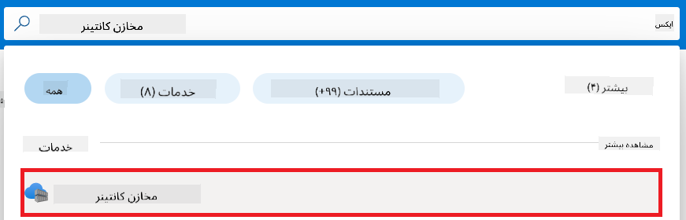
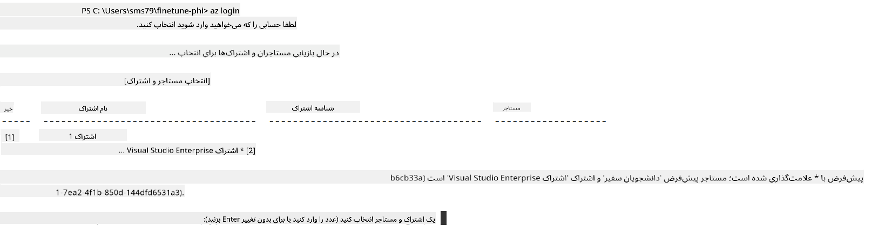

<!--
CO_OP_TRANSLATOR_METADATA:
{
  "original_hash": "455be2b7b9c3390d367d528f8fab2aa0",
  "translation_date": "2025-05-07T13:59:43+00:00",
  "source_file": "md/02.Application/01.TextAndChat/Phi3/E2E_Phi-3-FineTuning_PromptFlow_Integration.md",
  "language_code": "fa"
}
-->
# آموزش ریزتنظیم و یکپارچه‌سازی مدل‌های سفارشی Phi-3 با Prompt flow

این نمونه جامع (E2E) بر اساس راهنمای «[Fine-Tune and Integrate Custom Phi-3 Models with Prompt Flow: Step-by-Step Guide](https://techcommunity.microsoft.com/t5/educator-developer-blog/fine-tune-and-integrate-custom-phi-3-models-with-prompt-flow/ba-p/4178612?WT.mc_id=aiml-137032-kinfeylo)» از جامعه فناوری مایکروسافت تهیه شده است. در این نمونه، فرایندهای ریزتنظیم، استقرار و یکپارچه‌سازی مدل‌های سفارشی Phi-3 با Prompt flow معرفی می‌شوند.

## مرور کلی

در این نمونه جامع، یاد می‌گیرید چگونه مدل Phi-3 را ریزتنظیم کرده و آن را با Prompt flow یکپارچه کنید. با بهره‌گیری از Azure Machine Learning و Prompt flow، یک جریان کاری برای استقرار و استفاده از مدل‌های هوش مصنوعی سفارشی ایجاد خواهید کرد. این نمونه جامع به سه سناریو تقسیم شده است:

**سناریو ۱: راه‌اندازی منابع Azure و آماده‌سازی برای ریزتنظیم**

**سناریو ۲: ریزتنظیم مدل Phi-3 و استقرار در Azure Machine Learning Studio**

**سناریو ۳: یکپارچه‌سازی با Prompt flow و گفتگو با مدل سفارشی خود**

در ادامه، نمای کلی این نمونه جامع را مشاهده می‌کنید.


### فهرست مطالب

1. **[سناریو ۱: راه‌اندازی منابع Azure و آماده‌سازی برای ریزتنظیم](../../../../../../md/02.Application/01.TextAndChat/Phi3)**
    - [ساخت یک Workspace در Azure Machine Learning](../../../../../../md/02.Application/01.TextAndChat/Phi3)
    - [درخواست سهمیه GPU در اشتراک Azure](../../../../../../md/02.Application/01.TextAndChat/Phi3)
    - [افزودن نقش به کاربر](../../../../../../md/02.Application/01.TextAndChat/Phi3)
    - [راه‌اندازی پروژه](../../../../../../md/02.Application/01.TextAndChat/Phi3)
    - [آماده‌سازی داده‌ها برای ریزتنظیم](../../../../../../md/02.Application/01.TextAndChat/Phi3)

1. **[سناریو ۲: ریزتنظیم مدل Phi-3 و استقرار در Azure Machine Learning Studio](../../../../../../md/02.Application/01.TextAndChat/Phi3)**
    - [راه‌اندازی Azure CLI](../../../../../../md/02.Application/01.TextAndChat/Phi3)
    - [ریزتنظیم مدل Phi-3](../../../../../../md/02.Application/01.TextAndChat/Phi3)
    - [استقرار مدل ریزتنظیم شده](../../../../../../md/02.Application/01.TextAndChat/Phi3)

1. **[سناریو ۳: یکپارچه‌سازی با Prompt flow و گفتگو با مدل سفارشی](../../../../../../md/02.Application/01.TextAndChat/Phi3)**
    - [یکپارچه‌سازی مدل سفارشی Phi-3 با Prompt flow](../../../../../../md/02.Application/01.TextAndChat/Phi3)
    - [گفتگو با مدل سفارشی خود](../../../../../../md/02.Application/01.TextAndChat/Phi3)

## سناریو ۱: راه‌اندازی منابع Azure و آماده‌سازی برای ریزتنظیم

### ساخت یک Workspace در Azure Machine Learning

1. در نوار جستجو در بالای صفحه پورتال، عبارت *azure machine learning* را تایپ کنید و گزینه **Azure Machine Learning** را از نتایج انتخاب کنید.

    

1. از منوی ناوبری، گزینه **+ Create** را انتخاب کنید.

1. از منوی ناوبری، گزینه **New workspace** را انتخاب کنید.

    

1. موارد زیر را انجام دهید:

    - اشتراک Azure خود را انتخاب کنید.
    - گروه منابع (Resource group) مورد نظر را انتخاب کنید (در صورت نیاز یک گروه جدید بسازید).
    - نام Workspace را وارد کنید. این نام باید یکتا باشد.
    - منطقه (Region) مورد نظر را انتخاب کنید.
    - حساب ذخیره‌سازی (Storage account) را انتخاب کنید (در صورت نیاز یک حساب جدید بسازید).
    - کلید مخزن (Key vault) را انتخاب کنید (در صورت نیاز یک کلید جدید بسازید).
    - Application insights را انتخاب کنید (در صورت نیاز یک مورد جدید بسازید).
    - مخزن کانتینر (Container registry) را انتخاب کنید (در صورت نیاز یک مخزن جدید بسازید).

    

1. گزینه **Review + Create** را انتخاب کنید.

1. سپس روی **Create** کلیک کنید.

### درخواست سهمیه GPU در اشتراک Azure

در این نمونه جامع، برای ریزتنظیم از GPU مدل *Standard_NC24ads_A100_v4* استفاده می‌شود که نیاز به درخواست سهمیه دارد. برای استقرار از CPU مدل *Standard_E4s_v3* استفاده می‌شود که نیاز به درخواست سهمیه ندارد.

> [!NOTE]
>
> فقط اشتراک‌های Pay-As-You-Go (نوع اشتراک استاندارد) برای تخصیص GPU مجاز هستند؛ اشتراک‌های مزایایی فعلاً پشتیبانی نمی‌شوند.
>
> اگر از اشتراک‌های مزایایی مانند Visual Studio Enterprise Subscription استفاده می‌کنید یا می‌خواهید فرآیند ریزتنظیم و استقرار را سریعاً آزمایش کنید، این آموزش راهنمایی‌هایی برای ریزتنظیم با مجموعه داده کوچک‌تر و استفاده از CPU نیز ارائه می‌دهد. البته لازم است بدانید که نتایج ریزتنظیم با استفاده از GPU و داده‌های بزرگ‌تر به‌طور قابل توجهی بهتر خواهد بود.

1. به [Azure ML Studio](https://ml.azure.com/home?wt.mc_id=studentamb_279723) مراجعه کنید.

1. برای درخواست سهمیه *Standard NCADSA100v4 Family* مراحل زیر را انجام دهید:

    - از تب سمت چپ، گزینه **Quota** را انتخاب کنید.
    - خانواده ماشین مجازی مورد نظر را انتخاب کنید. مثلاً **Standard NCADSA100v4 Family Cluster Dedicated vCPUs** که شامل GPU مدل *Standard_NC24ads_A100_v4* است.
    - از منوی ناوبری، گزینه **Request quota** را انتخاب کنید.

        

    - در صفحه درخواست سهمیه، محدودیت جدید هسته‌ها (**New cores limit**) را وارد کنید. مثلاً ۲۴.
    - سپس روی **Submit** کلیک کنید تا سهمیه GPU درخواست شود.

> [!NOTE]
> برای انتخاب GPU یا CPU مناسب، می‌توانید به سند [Sizes for Virtual Machines in Azure](https://learn.microsoft.com/azure/virtual-machines/sizes/overview?tabs=breakdownseries%2Cgeneralsizelist%2Ccomputesizelist%2Cmemorysizelist%2Cstoragesizelist%2Cgpusizelist%2Cfpgasizelist%2Chpcsizelist) مراجعه کنید.

### افزودن نقش به کاربر

برای ریزتنظیم و استقرار مدل‌ها، ابتدا باید یک هویت مدیریتی اختصاصی (User Assigned Managed Identity یا UAI) بسازید و مجوزهای لازم را به آن بدهید. این UAI برای احراز هویت در هنگام استقرار استفاده خواهد شد.

#### ساخت User Assigned Managed Identity (UAI)

1. در نوار جستجو در بالای صفحه، عبارت *managed identities* را تایپ کنید و گزینه **Managed Identities** را انتخاب کنید.

    

1. روی **+ Create** کلیک کنید.

    

1. موارد زیر را انجام دهید:

    - اشتراک Azure خود را انتخاب کنید.
    - گروه منابع مورد نظر را انتخاب کنید (در صورت نیاز یک گروه جدید بسازید).
    - منطقه (Region) مورد نظر را انتخاب کنید.
    - نامی یکتا وارد کنید.

1. گزینه **Review + create** را انتخاب کنید.

1. روی **+ Create** کلیک کنید.

#### افزودن نقش Contributor به Managed Identity

1. به منبع Managed Identity که ساختید بروید.

1. از تب سمت چپ، گزینه **Azure role assignments** را انتخاب کنید.

1. از منوی ناوبری، گزینه **+Add role assignment** را انتخاب کنید.

1. در صفحه افزودن نقش، موارد زیر را انجام دهید:
    - **Scope** را روی **Resource group** تنظیم کنید.
    - اشتراک Azure خود را انتخاب کنید.
    - گروه منابع مورد نظر را انتخاب کنید.
    - نقش (**Role**) را روی **Contributor** تنظیم کنید.

    

1. روی **Save** کلیک کنید.

#### افزودن نقش Storage Blob Data Reader به Managed Identity

1. در نوار جستجو، عبارت *storage accounts* را تایپ کرده و گزینه **Storage accounts** را انتخاب کنید.

    

1. حساب ذخیره‌سازی که به Azure Machine Learning workspace شما مرتبط است را انتخاب کنید. مثلاً *finetunephistorage*.

1. برای رفتن به صفحه افزودن نقش، مراحل زیر را انجام دهید:

    - به حساب ذخیره‌سازی Azure که ساختید بروید.
    - از تب سمت چپ، گزینه **Access Control (IAM)** را انتخاب کنید.
    - از منوی ناوبری، گزینه **+ Add** را انتخاب کنید.
    - سپس **Add role assignment** را انتخاب کنید.

    

1. در صفحه افزودن نقش، موارد زیر را انجام دهید:

    - در صفحه نقش، عبارت *Storage Blob Data Reader* را در نوار جستجو تایپ کرده و گزینه **Storage Blob Data Reader** را انتخاب کنید.
    - روی **Next** کلیک کنید.
    - در صفحه اعضا (Members)، گزینه **Assign access to** را روی **Managed identity** تنظیم کنید.
    - روی **+ Select members** کلیک کنید.
    - در صفحه انتخاب Managed identities، اشتراک Azure خود را انتخاب کنید.
    - Managed identity ساخته شده را انتخاب کنید. مثلاً *finetunephi-managedidentity*.
    - روی **Select** کلیک کنید.

    

1. روی **Review + assign** کلیک کنید.

#### افزودن نقش AcrPull به Managed Identity

1. در نوار جستجو، عبارت *container registries* را تایپ کرده و گزینه **Container registries** را انتخاب کنید.

    

1. مخزن کانتینری که به Azure Machine Learning workspace مرتبط است را انتخاب کنید. مثلاً *finetunephicontainerregistries*

1. برای رفتن به صفحه افزودن نقش، مراحل زیر را انجام دهید:

    - از تب سمت چپ، گزینه **Access Control (IAM)** را انتخاب کنید.
    - از منوی ناوبری، گزینه **+ Add** را انتخاب کنید.
    - سپس **Add role assignment** را انتخاب کنید.

1. در صفحه افزودن نقش، موارد زیر را انجام دهید:

    - در صفحه نقش، عبارت *AcrPull* را در نوار جستجو تایپ کرده و گزینه **AcrPull** را انتخاب کنید.
    - روی **Next** کلیک کنید.
    - در صفحه اعضا، گزینه **Assign access to** را روی **Managed identity** تنظیم کنید.
    - روی **+ Select members** کلیک کنید.
    - اشتراک Azure خود را انتخاب کنید.
    - Managed identity ساخته شده را انتخاب کنید. مثلاً *finetunephi-managedidentity*.
    - روی **Select** کلیک کنید.
    - روی **Review + assign** کلیک کنید.

### راه‌اندازی پروژه

اکنون یک پوشه برای کار ایجاد می‌کنید و یک محیط مجازی راه‌اندازی می‌کنید تا برنامه‌ای توسعه دهید که با کاربران تعامل داشته باشد و از تاریخچه چت ذخیره شده در Azure Cosmos DB برای پاسخگویی استفاده کند.

#### ایجاد پوشه کاری

1. یک پنجره ترمینال باز کنید و دستور زیر را برای ایجاد پوشه‌ای به نام *finetune-phi* در مسیر پیش‌فرض وارد کنید.

    ```console
    mkdir finetune-phi
    ```

1. برای رفتن به پوشه *finetune-phi*، دستور زیر را در ترمینال وارد کنید.

    ```console
    cd finetune-phi
    ```

#### ایجاد محیط مجازی

1. دستور زیر را در ترمینال وارد کنید تا یک محیط مجازی به نام *.venv* بسازید.

    ```console
    python -m venv .venv
    ```

1. دستور زیر را برای فعال‌سازی محیط مجازی وارد کنید.

    ```console
    .venv\Scripts\activate.bat
    ```

> [!NOTE]
>
> اگر درست انجام شده باشد، قبل از خط فرمان عبارت *(.venv)* را خواهید دید.

#### نصب بسته‌های مورد نیاز

1. دستورات زیر را در ترمینال وارد کنید تا بسته‌های لازم نصب شوند.

    ```console
    pip install datasets==2.19.1
    pip install transformers==4.41.1
    pip install azure-ai-ml==1.16.0
    pip install torch==2.3.1
    pip install trl==0.9.4
    pip install promptflow==1.12.0
    ```

#### ایجاد فایل‌های پروژه

در این تمرین، فایل‌های اصلی پروژه را ایجاد می‌کنید. این فایل‌ها شامل اسکریپت‌هایی برای دانلود داده‌ها، راه‌اندازی محیط Azure Machine Learning، ریزتنظیم مدل Phi-3 و استقرار مدل ریزتنظیم شده هستند. همچنین یک فایل *conda.yml* برای راه‌اندازی محیط ریزتنظیم ایجاد خواهید کرد.

در این تمرین موارد زیر را انجام می‌دهید:

- ایجاد فایل *download_dataset.py* برای دانلود داده‌ها.
- ایجاد فایل *setup_ml.py* برای راه‌اندازی محیط Azure Machine Learning.
- ایجاد فایل *fine_tune.py* در پوشه *finetuning_dir* برای ریزتنظیم مدل Phi-3 با استفاده از داده‌ها.
- ایجاد فایل *conda.yml* برای راه‌اندازی محیط ریزتنظیم.
- ایجاد فایل *deploy_model.py* برای استقرار مدل ریزتنظیم شده.
- ایجاد فایل *integrate_with_promptflow.py* برای یکپارچه‌سازی مدل ریزتنظیم شده و اجرای آن با Prompt flow.
- ایجاد فایل *flow.dag.yml* برای ساختاردهی جریان کاری Prompt flow.
- ایجاد فایل *config.py* برای وارد کردن اطلاعات Azure.

> [!NOTE]
>
> ساختار کامل پوشه:
>
> ```text
> └── YourUserName
> .    └── finetune-phi
> .        ├── finetuning_dir
> .        │      └── fine_tune.py
> .        ├── conda.yml
> .        ├── config.py
> .        ├── deploy_model.py
> .        ├── download_dataset.py
> .        ├── flow.dag.yml
> .        ├── integrate_with_promptflow.py
> .        └── setup_ml.py
> ```

1. برنامه **Visual Studio Code** را باز کنید.

1. از نوار منو، گزینه **File** را انتخاب کنید.

1. گزینه **Open Folder** را انتخاب کنید.

1. پوشه *finetune-phi* که ساختید را انتخاب کنید، معمولاً در مسیر *C:\Users\yourUserName\finetune-phi* قرار دارد.

    

1. در پنل سمت چپ Visual Studio Code، راست‌کلیک کرده و گزینه **New File** را انتخاب کنید تا فایلی به نام *download_dataset.py* بسازید.

1. مجدداً در پنل سمت چپ راست‌کلیک کرده و **New File** را انتخاب کنید تا فایلی به نام *setup_ml.py* بسازید.

1. همین کار را تکرار کنید تا فایل *deploy_model.py* ساخته شود.

    

1. در پنل سمت چپ، راست‌کلیک کرده و گزینه **New Folder** را انتخاب کنید تا پوشه‌ای به نام *finetuning_dir* ساخته شود.

1. در پوشه *finetuning_dir*، فایلی به نام *fine_tune.py* بسازید.

#### ایجاد و پیکربندی فایل *conda.yml*

1. در پنل سمت چپ Visual Studio Code، راست‌کلیک کرده و **New File** را انتخاب کنید تا فایل *conda.yml* ساخته شود.

1. کد زیر را در فایل *conda.yml* قرار دهید تا محیط ریزتنظیم مدل Phi-3 تنظیم شود.

    ```yml
    name: phi-3-training-env
    channels:
      - defaults
      - conda-forge
    dependencies:
      - python=3.10
      - pip
      - numpy<2.0
      - pip:
          - torch==2.4.0
          - torchvision==0.19.0
          - trl==0.8.6
          - transformers==4.41
          - datasets==2.21.0
          - azureml-core==1.57.0
          - azure-storage-blob==12.19.0
          - azure-ai-ml==1.16
          - azure-identity==1.17.1
          - accelerate==0.33.0
          - mlflow==2.15.1
          - azureml-mlflow==1.57.0
    ```

#### ایجاد و پیکربندی فایل *config.py*

1. در پنل سمت چپ Visual Studio Code، راست‌کلیک کرده و **New File** را انتخاب کنید تا فایل *config.py* ساخته شود.

1. کد زیر را در فایل *config.py* وارد کنید تا اطلاعات Azure شما در آن قرار گیرد.

    ```python
    # Azure settings
    AZURE_SUBSCRIPTION_ID = "your_subscription_id"
    AZURE_RESOURCE_GROUP_NAME = "your_resource_group_name" # "TestGroup"

    # Azure Machine Learning settings
    AZURE_ML_WORKSPACE_NAME = "your_workspace_name" # "finetunephi-workspace"

    # Azure Managed Identity settings
    AZURE_MANAGED_IDENTITY_CLIENT_ID = "your_azure_managed_identity_client_id"
    AZURE_MANAGED_IDENTITY_NAME = "your_azure_managed_identity_name" # "finetunephi-mangedidentity"
    AZURE_MANAGED_IDENTITY_RESOURCE_ID = f"/subscriptions/{AZURE_SUBSCRIPTION_ID}/resourceGroups/{AZURE_RESOURCE_GROUP_NAME}/providers/Microsoft.ManagedIdentity/userAssignedIdentities/{AZURE_MANAGED_IDENTITY_NAME}"

    # Dataset file paths
    TRAIN_DATA_PATH = "data/train_data.jsonl"
    TEST_DATA_PATH = "data/test_data.jsonl"

    # Fine-tuned model settings
    AZURE_MODEL_NAME = "your_fine_tuned_model_name" # "finetune-phi-model"
    AZURE_ENDPOINT_NAME = "your_fine_tuned_model_endpoint_name" # "finetune-phi-endpoint"
    AZURE_DEPLOYMENT_NAME = "your_fine_tuned_model_deployment_name" # "finetune-phi-deployment"

    AZURE_ML_API_KEY = "your_fine_tuned_model_api_key"
    AZURE_ML_ENDPOINT = "your_fine_tuned_model_endpoint_uri" # "https://{your-endpoint-name}.{your-region}.inference.ml.azure.com/score"
    ```

#### افزودن متغیرهای محیطی Azure

1. برای افزودن شناسه اشتراک Azure، مراحل زیر را انجام دهید:

    - در نوار جستجو در بالای صفحه پورتال، عبارت *subscriptions* را تایپ کنید و گزینه **Subscriptions** را انتخاب کنید.
    - اشتراک Azure که در حال حاضر استفاده می‌کنید را انتخاب کنید.
    - شناسه اشتراک (Subscription ID) را کپی کرده و در فایل *config.py* جای‌گذاری کنید.


1. برای افزودن نام Azure Workspace، مراحل زیر را انجام دهید:

    - به منبع Azure Machine Learning که ایجاد کرده‌اید بروید.
    - نام حساب خود را در فایل *config.py* کپی و جای‌گذاری کنید.

    

1. برای افزودن نام گروه منابع Azure، مراحل زیر را انجام دهید:

    - به منبع Azure Machine Learning که ایجاد کرده‌اید بروید.
    - نام گروه منابع Azure خود را در فایل *config.py* کپی و جای‌گذاری کنید.

    

2. برای افزودن نام هویت مدیریت شده Azure، مراحل زیر را انجام دهید:

    - به منبع Managed Identities که ایجاد کرده‌اید بروید.
    - نام هویت مدیریت شده Azure خود را در فایل *config.py* کپی و جای‌گذاری کنید.

    

### آماده‌سازی مجموعه داده برای فاین‌تیونینگ

در این تمرین، فایل *download_dataset.py* را اجرا خواهید کرد تا مجموعه داده‌های *ULTRACHAT_200k* را به محیط محلی خود دانلود کنید. سپس از این مجموعه داده‌ها برای فاین‌تیونینگ مدل Phi-3 در Azure Machine Learning استفاده خواهید کرد.

#### دانلود مجموعه داده با استفاده از *download_dataset.py*

1. فایل *download_dataset.py* را در Visual Studio Code باز کنید.

1. کد زیر را در *download_dataset.py* اضافه کنید.

    ```python
    import json
    import os
    from datasets import load_dataset
    from config import (
        TRAIN_DATA_PATH,
        TEST_DATA_PATH)

    def load_and_split_dataset(dataset_name, config_name, split_ratio):
        """
        Load and split a dataset.
        """
        # Load the dataset with the specified name, configuration, and split ratio
        dataset = load_dataset(dataset_name, config_name, split=split_ratio)
        print(f"Original dataset size: {len(dataset)}")
        
        # Split the dataset into train and test sets (80% train, 20% test)
        split_dataset = dataset.train_test_split(test_size=0.2)
        print(f"Train dataset size: {len(split_dataset['train'])}")
        print(f"Test dataset size: {len(split_dataset['test'])}")
        
        return split_dataset

    def save_dataset_to_jsonl(dataset, filepath):
        """
        Save a dataset to a JSONL file.
        """
        # Create the directory if it does not exist
        os.makedirs(os.path.dirname(filepath), exist_ok=True)
        
        # Open the file in write mode
        with open(filepath, 'w', encoding='utf-8') as f:
            # Iterate over each record in the dataset
            for record in dataset:
                # Dump the record as a JSON object and write it to the file
                json.dump(record, f)
                # Write a newline character to separate records
                f.write('\n')
        
        print(f"Dataset saved to {filepath}")

    def main():
        """
        Main function to load, split, and save the dataset.
        """
        # Load and split the ULTRACHAT_200k dataset with a specific configuration and split ratio
        dataset = load_and_split_dataset("HuggingFaceH4/ultrachat_200k", 'default', 'train_sft[:1%]')
        
        # Extract the train and test datasets from the split
        train_dataset = dataset['train']
        test_dataset = dataset['test']

        # Save the train dataset to a JSONL file
        save_dataset_to_jsonl(train_dataset, TRAIN_DATA_PATH)
        
        # Save the test dataset to a separate JSONL file
        save_dataset_to_jsonl(test_dataset, TEST_DATA_PATH)

    if __name__ == "__main__":
        main()

    ```

> [!TIP]
>
> **راهنمای فاین‌تیونینگ با مجموعه داده کوچک با استفاده از CPU**
>
> اگر می‌خواهید از CPU برای فاین‌تیونینگ استفاده کنید، این روش برای کسانی که اشتراک‌های بهره‌مند (مانند Visual Studio Enterprise Subscription) دارند یا می‌خواهند فرآیند فاین‌تیونینگ و استقرار را سریع آزمایش کنند، مناسب است.
>
> جایگزین کنید `dataset = load_and_split_dataset("HuggingFaceH4/ultrachat_200k", 'default', 'train_sft[:1%]')` with `dataset = load_and_split_dataset("HuggingFaceH4/ultrachat_200k", 'default', 'train_sft[:10]')`
>

1. دستور زیر را در ترمینال خود تایپ کنید تا اسکریپت اجرا شده و مجموعه داده به محیط محلی شما دانلود شود.

    ```console
    python download_data.py
    ```

1. اطمینان حاصل کنید که مجموعه داده‌ها با موفقیت در دایرکتوری *finetune-phi/data* در محیط محلی شما ذخیره شده‌اند.

> [!NOTE]
>
> **اندازه مجموعه داده و زمان فاین‌تیونینگ**
>
> در این نمونه انتها به انتها (E2E)، تنها ۱٪ از مجموعه داده (`train_sft[:1%]`) استفاده می‌شود. این کار مقدار داده‌ها را به طور قابل توجهی کاهش داده و سرعت آپلود و فاین‌تیونینگ را افزایش می‌دهد. می‌توانید درصد را تنظیم کنید تا تعادل مناسبی بین زمان آموزش و عملکرد مدل پیدا کنید. استفاده از زیرمجموعه کوچکتر مجموعه داده، زمان مورد نیاز برای فاین‌تیونینگ را کاهش داده و فرآیند را برای نمونه E2E قابل مدیریت‌تر می‌کند.

## سناریو ۲: فاین‌تیونینگ مدل Phi-3 و استقرار در Azure Machine Learning Studio

### راه‌اندازی Azure CLI

برای احراز هویت محیط خود باید Azure CLI را راه‌اندازی کنید. Azure CLI به شما امکان می‌دهد منابع Azure را مستقیماً از خط فرمان مدیریت کنید و اطلاعات لازم برای دسترسی Azure Machine Learning به این منابع را فراهم می‌کند. برای شروع، [Azure CLI را نصب کنید](https://learn.microsoft.com/cli/azure/install-azure-cli).

1. یک پنجره ترمینال باز کنید و دستور زیر را برای ورود به حساب Azure خود وارد کنید.

    ```console
    az login
    ```

1. حساب Azure خود را برای استفاده انتخاب کنید.

1. اشتراک Azure خود را برای استفاده انتخاب کنید.

    

> [!TIP]
>
> اگر در ورود به Azure مشکل دارید، از کد دستگاه استفاده کنید. یک پنجره ترمینال باز کنید و دستور زیر را برای ورود به حساب Azure خود وارد کنید:
>
> ```console
> az login --use-device-code
> ```
>

### فاین‌تیونینگ مدل Phi-3

در این تمرین، مدل Phi-3 را با استفاده از مجموعه داده ارائه شده فاین‌تیون خواهید کرد. ابتدا فرآیند فاین‌تیونینگ را در فایل *fine_tune.py* تعریف می‌کنید. سپس محیط Azure Machine Learning را پیکربندی کرده و فرآیند فاین‌تیونینگ را با اجرای فایل *setup_ml.py* شروع می‌کنید. این اسکریپت تضمین می‌کند که فاین‌تیونینگ در محیط Azure Machine Learning انجام شود.

با اجرای *setup_ml.py*، فرآیند فاین‌تیونینگ در محیط Azure Machine Learning اجرا خواهد شد.

#### افزودن کد به فایل *fine_tune.py*

1. به پوشه *finetuning_dir* بروید و فایل *fine_tune.py* را در Visual Studio Code باز کنید.

1. کد زیر را در *fine_tune.py* اضافه کنید.

    ```python
    import argparse
    import sys
    import logging
    import os
    from datasets import load_dataset
    import torch
    import mlflow
    from transformers import AutoModelForCausalLM, AutoTokenizer, TrainingArguments
    from trl import SFTTrainer

    # To avoid the INVALID_PARAMETER_VALUE error in MLflow, disable MLflow integration
    os.environ["DISABLE_MLFLOW_INTEGRATION"] = "True"

    # Logging setup
    logging.basicConfig(
        format="%(asctime)s - %(levelname)s - %(name)s - %(message)s",
        datefmt="%Y-%m-%d %H:%M:%S",
        handlers=[logging.StreamHandler(sys.stdout)],
        level=logging.WARNING
    )
    logger = logging.getLogger(__name__)

    def initialize_model_and_tokenizer(model_name, model_kwargs):
        """
        Initialize the model and tokenizer with the given pretrained model name and arguments.
        """
        model = AutoModelForCausalLM.from_pretrained(model_name, **model_kwargs)
        tokenizer = AutoTokenizer.from_pretrained(model_name)
        tokenizer.model_max_length = 2048
        tokenizer.pad_token = tokenizer.unk_token
        tokenizer.pad_token_id = tokenizer.convert_tokens_to_ids(tokenizer.pad_token)
        tokenizer.padding_side = 'right'
        return model, tokenizer

    def apply_chat_template(example, tokenizer):
        """
        Apply a chat template to tokenize messages in the example.
        """
        messages = example["messages"]
        if messages[0]["role"] != "system":
            messages.insert(0, {"role": "system", "content": ""})
        example["text"] = tokenizer.apply_chat_template(
            messages, tokenize=False, add_generation_prompt=False
        )
        return example

    def load_and_preprocess_data(train_filepath, test_filepath, tokenizer):
        """
        Load and preprocess the dataset.
        """
        train_dataset = load_dataset('json', data_files=train_filepath, split='train')
        test_dataset = load_dataset('json', data_files=test_filepath, split='train')
        column_names = list(train_dataset.features)

        train_dataset = train_dataset.map(
            apply_chat_template,
            fn_kwargs={"tokenizer": tokenizer},
            num_proc=10,
            remove_columns=column_names,
            desc="Applying chat template to train dataset",
        )

        test_dataset = test_dataset.map(
            apply_chat_template,
            fn_kwargs={"tokenizer": tokenizer},
            num_proc=10,
            remove_columns=column_names,
            desc="Applying chat template to test dataset",
        )

        return train_dataset, test_dataset

    def train_and_evaluate_model(train_dataset, test_dataset, model, tokenizer, output_dir):
        """
        Train and evaluate the model.
        """
        training_args = TrainingArguments(
            bf16=True,
            do_eval=True,
            output_dir=output_dir,
            eval_strategy="epoch",
            learning_rate=5.0e-06,
            logging_steps=20,
            lr_scheduler_type="cosine",
            num_train_epochs=3,
            overwrite_output_dir=True,
            per_device_eval_batch_size=4,
            per_device_train_batch_size=4,
            remove_unused_columns=True,
            save_steps=500,
            seed=0,
            gradient_checkpointing=True,
            gradient_accumulation_steps=1,
            warmup_ratio=0.2,
        )

        trainer = SFTTrainer(
            model=model,
            args=training_args,
            train_dataset=train_dataset,
            eval_dataset=test_dataset,
            max_seq_length=2048,
            dataset_text_field="text",
            tokenizer=tokenizer,
            packing=True
        )

        train_result = trainer.train()
        trainer.log_metrics("train", train_result.metrics)

        mlflow.transformers.log_model(
            transformers_model={"model": trainer.model, "tokenizer": tokenizer},
            artifact_path=output_dir,
        )

        tokenizer.padding_side = 'left'
        eval_metrics = trainer.evaluate()
        eval_metrics["eval_samples"] = len(test_dataset)
        trainer.log_metrics("eval", eval_metrics)

    def main(train_file, eval_file, model_output_dir):
        """
        Main function to fine-tune the model.
        """
        model_kwargs = {
            "use_cache": False,
            "trust_remote_code": True,
            "torch_dtype": torch.bfloat16,
            "device_map": None,
            "attn_implementation": "eager"
        }

        # pretrained_model_name = "microsoft/Phi-3-mini-4k-instruct"
        pretrained_model_name = "microsoft/Phi-3.5-mini-instruct"

        with mlflow.start_run():
            model, tokenizer = initialize_model_and_tokenizer(pretrained_model_name, model_kwargs)
            train_dataset, test_dataset = load_and_preprocess_data(train_file, eval_file, tokenizer)
            train_and_evaluate_model(train_dataset, test_dataset, model, tokenizer, model_output_dir)

    if __name__ == "__main__":
        parser = argparse.ArgumentParser()
        parser.add_argument("--train-file", type=str, required=True, help="Path to the training data")
        parser.add_argument("--eval-file", type=str, required=True, help="Path to the evaluation data")
        parser.add_argument("--model_output_dir", type=str, required=True, help="Directory to save the fine-tuned model")
        args = parser.parse_args()
        main(args.train_file, args.eval_file, args.model_output_dir)

    ```

1. فایل *fine_tune.py* را ذخیره و ببندید.

> [!TIP]
> **می‌توانید مدل Phi-3.5 را فاین‌تیون کنید**
>
> در فایل *fine_tune.py*، می‌توانید مقدار فیلد `pretrained_model_name` from `"microsoft/Phi-3-mini-4k-instruct"` to any model you want to fine-tune. For example, if you change it to `"microsoft/Phi-3.5-mini-instruct"`, you'll be using the Phi-3.5-mini-instruct model for fine-tuning. To find and use the model name you prefer, visit [Hugging Face](https://huggingface.co/), search for the model you're interested in, and then copy and paste its name into the `pretrained_model_name` را در اسکریپت خود تغییر دهید.
>
> :::image type="content" source="../../imgs/03/FineTuning-PromptFlow/finetunephi3.5.png" alt-text="فاین‌تیونینگ Phi-3.5":::
>

#### افزودن کد به فایل *setup_ml.py*

1. فایل *setup_ml.py* را در Visual Studio Code باز کنید.

1. کد زیر را در *setup_ml.py* اضافه کنید.

    ```python
    import logging
    from azure.ai.ml import MLClient, command, Input
    from azure.ai.ml.entities import Environment, AmlCompute
    from azure.identity import AzureCliCredential
    from config import (
        AZURE_SUBSCRIPTION_ID,
        AZURE_RESOURCE_GROUP_NAME,
        AZURE_ML_WORKSPACE_NAME,
        TRAIN_DATA_PATH,
        TEST_DATA_PATH
    )

    # Constants

    # Uncomment the following lines to use a CPU instance for training
    # COMPUTE_INSTANCE_TYPE = "Standard_E16s_v3" # cpu
    # COMPUTE_NAME = "cpu-e16s-v3"
    # DOCKER_IMAGE_NAME = "mcr.microsoft.com/azureml/openmpi4.1.0-ubuntu20.04:latest"

    # Uncomment the following lines to use a GPU instance for training
    COMPUTE_INSTANCE_TYPE = "Standard_NC24ads_A100_v4"
    COMPUTE_NAME = "gpu-nc24s-a100-v4"
    DOCKER_IMAGE_NAME = "mcr.microsoft.com/azureml/curated/acft-hf-nlp-gpu:59"

    CONDA_FILE = "conda.yml"
    LOCATION = "eastus2" # Replace with the location of your compute cluster
    FINETUNING_DIR = "./finetuning_dir" # Path to the fine-tuning script
    TRAINING_ENV_NAME = "phi-3-training-environment" # Name of the training environment
    MODEL_OUTPUT_DIR = "./model_output" # Path to the model output directory in azure ml

    # Logging setup to track the process
    logger = logging.getLogger(__name__)
    logging.basicConfig(
        format="%(asctime)s - %(levelname)s - %(name)s - %(message)s",
        datefmt="%Y-%m-%d %H:%M:%S",
        level=logging.WARNING
    )

    def get_ml_client():
        """
        Initialize the ML Client using Azure CLI credentials.
        """
        credential = AzureCliCredential()
        return MLClient(credential, AZURE_SUBSCRIPTION_ID, AZURE_RESOURCE_GROUP_NAME, AZURE_ML_WORKSPACE_NAME)

    def create_or_get_environment(ml_client):
        """
        Create or update the training environment in Azure ML.
        """
        env = Environment(
            image=DOCKER_IMAGE_NAME,  # Docker image for the environment
            conda_file=CONDA_FILE,  # Conda environment file
            name=TRAINING_ENV_NAME,  # Name of the environment
        )
        return ml_client.environments.create_or_update(env)

    def create_or_get_compute_cluster(ml_client, compute_name, COMPUTE_INSTANCE_TYPE, location):
        """
        Create or update the compute cluster in Azure ML.
        """
        try:
            compute_cluster = ml_client.compute.get(compute_name)
            logger.info(f"Compute cluster '{compute_name}' already exists. Reusing it for the current run.")
        except Exception:
            logger.info(f"Compute cluster '{compute_name}' does not exist. Creating a new one with size {COMPUTE_INSTANCE_TYPE}.")
            compute_cluster = AmlCompute(
                name=compute_name,
                size=COMPUTE_INSTANCE_TYPE,
                location=location,
                tier="Dedicated",  # Tier of the compute cluster
                min_instances=0,  # Minimum number of instances
                max_instances=1  # Maximum number of instances
            )
            ml_client.compute.begin_create_or_update(compute_cluster).wait()  # Wait for the cluster to be created
        return compute_cluster

    def create_fine_tuning_job(env, compute_name):
        """
        Set up the fine-tuning job in Azure ML.
        """
        return command(
            code=FINETUNING_DIR,  # Path to fine_tune.py
            command=(
                "python fine_tune.py "
                "--train-file ${{inputs.train_file}} "
                "--eval-file ${{inputs.eval_file}} "
                "--model_output_dir ${{inputs.model_output}}"
            ),
            environment=env,  # Training environment
            compute=compute_name,  # Compute cluster to use
            inputs={
                "train_file": Input(type="uri_file", path=TRAIN_DATA_PATH),  # Path to the training data file
                "eval_file": Input(type="uri_file", path=TEST_DATA_PATH),  # Path to the evaluation data file
                "model_output": MODEL_OUTPUT_DIR
            }
        )

    def main():
        """
        Main function to set up and run the fine-tuning job in Azure ML.
        """
        # Initialize ML Client
        ml_client = get_ml_client()

        # Create Environment
        env = create_or_get_environment(ml_client)
        
        # Create or get existing compute cluster
        create_or_get_compute_cluster(ml_client, COMPUTE_NAME, COMPUTE_INSTANCE_TYPE, LOCATION)

        # Create and Submit Fine-Tuning Job
        job = create_fine_tuning_job(env, COMPUTE_NAME)
        returned_job = ml_client.jobs.create_or_update(job)  # Submit the job
        ml_client.jobs.stream(returned_job.name)  # Stream the job logs
        
        # Capture the job name
        job_name = returned_job.name
        print(f"Job name: {job_name}")

    if __name__ == "__main__":
        main()

    ```

1. `COMPUTE_INSTANCE_TYPE`, `COMPUTE_NAME`, and `LOCATION` را با جزئیات خود جایگزین کنید.

    ```python
   # Uncomment the following lines to use a GPU instance for training
    COMPUTE_INSTANCE_TYPE = "Standard_NC24ads_A100_v4"
    COMPUTE_NAME = "gpu-nc24s-a100-v4"
    ...
    LOCATION = "eastus2" # Replace with the location of your compute cluster
    ```

> [!TIP]
>
> **راهنمای فاین‌تیونینگ با مجموعه داده کوچک با استفاده از CPU**
>
> اگر می‌خواهید از CPU برای فاین‌تیونینگ استفاده کنید، این روش برای کسانی که اشتراک‌های بهره‌مند (مانند Visual Studio Enterprise Subscription) دارند یا می‌خواهند فرآیند فاین‌تیونینگ و استقرار را سریع آزمایش کنند، مناسب است.
>
> 1. فایل *setup_ml* را باز کنید.
> 1. `COMPUTE_INSTANCE_TYPE`, `COMPUTE_NAME`, and `DOCKER_IMAGE_NAME` with the following. If you do not have access to *Standard_E16s_v3*, you can use an equivalent CPU instance or request a new quota.
> 1. Replace `LOCATION` را با جزئیات خود جایگزین کنید.
>
>    ```python
>    # Uncomment the following lines to use a CPU instance for training
>    COMPUTE_INSTANCE_TYPE = "Standard_E16s_v3" # cpu
>    COMPUTE_NAME = "cpu-e16s-v3"
>    DOCKER_IMAGE_NAME = "mcr.microsoft.com/azureml/openmpi4.1.0-ubuntu20.04:latest"
>    LOCATION = "eastus2" # Replace with the location of your compute cluster
>    ```
>

1. دستور زیر را برای اجرای اسکریپت *setup_ml.py* و شروع فرآیند فاین‌تیونینگ در Azure Machine Learning تایپ کنید.

    ```python
    python setup_ml.py
    ```

1. در این تمرین، مدل Phi-3 را با موفقیت با استفاده از Azure Machine Learning فاین‌تیون کردید. با اجرای اسکریپت *setup_ml.py*، محیط Azure Machine Learning را راه‌اندازی کرده و فرآیند فاین‌تیونینگ تعریف شده در فایل *fine_tune.py* را آغاز کردید. توجه داشته باشید که فرآیند فاین‌تیونینگ ممکن است زمان قابل توجهی ببرد. پس از اجرای `python setup_ml.py` command, you need to wait for the process to complete. You can monitor the status of the fine-tuning job by following the link provided in the terminal to the Azure Machine Learning portal.

    

### Deploy the fine-tuned model

To integrate the fine-tuned Phi-3 model with Prompt Flow, you need to deploy the model to make it accessible for real-time inference. This process involves registering the model, creating an online endpoint, and deploying the model.

#### Set the model name, endpoint name, and deployment name for deployment

1. Open *config.py* file.

1. Replace `AZURE_MODEL_NAME = "your_fine_tuned_model_name"` with the desired name for your model.

1. Replace `AZURE_ENDPOINT_NAME = "your_fine_tuned_model_endpoint_name"` with the desired name for your endpoint.

1. Replace `AZURE_DEPLOYMENT_NAME = "your_fine_tuned_model_deployment_name"` نام مورد نظر برای استقرار خود را وارد کنید.

#### افزودن کد به فایل *deploy_model.py*

اجرای فایل *deploy_model.py* کل فرآیند استقرار را خودکار می‌کند. این فایل مدل را ثبت می‌کند، یک endpoint ایجاد می‌کند و بر اساس تنظیمات مشخص شده در فایل config.py که شامل نام مدل، نام endpoint و نام استقرار است، استقرار را انجام می‌دهد.

1. فایل *deploy_model.py* را در Visual Studio Code باز کنید.

1. کد زیر را در *deploy_model.py* اضافه کنید.

    ```python
    import logging
    from azure.identity import AzureCliCredential
    from azure.ai.ml import MLClient
    from azure.ai.ml.entities import Model, ProbeSettings, ManagedOnlineEndpoint, ManagedOnlineDeployment, IdentityConfiguration, ManagedIdentityConfiguration, OnlineRequestSettings
    from azure.ai.ml.constants import AssetTypes

    # Configuration imports
    from config import (
        AZURE_SUBSCRIPTION_ID,
        AZURE_RESOURCE_GROUP_NAME,
        AZURE_ML_WORKSPACE_NAME,
        AZURE_MANAGED_IDENTITY_RESOURCE_ID,
        AZURE_MANAGED_IDENTITY_CLIENT_ID,
        AZURE_MODEL_NAME,
        AZURE_ENDPOINT_NAME,
        AZURE_DEPLOYMENT_NAME
    )

    # Constants
    JOB_NAME = "your-job-name"
    COMPUTE_INSTANCE_TYPE = "Standard_E4s_v3"

    deployment_env_vars = {
        "SUBSCRIPTION_ID": AZURE_SUBSCRIPTION_ID,
        "RESOURCE_GROUP_NAME": AZURE_RESOURCE_GROUP_NAME,
        "UAI_CLIENT_ID": AZURE_MANAGED_IDENTITY_CLIENT_ID,
    }

    # Logging setup
    logging.basicConfig(
        format="%(asctime)s - %(levelname)s - %(name)s - %(message)s",
        datefmt="%Y-%m-%d %H:%M:%S",
        level=logging.DEBUG
    )
    logger = logging.getLogger(__name__)

    def get_ml_client():
        """Initialize and return the ML Client."""
        credential = AzureCliCredential()
        return MLClient(credential, AZURE_SUBSCRIPTION_ID, AZURE_RESOURCE_GROUP_NAME, AZURE_ML_WORKSPACE_NAME)

    def register_model(ml_client, model_name, job_name):
        """Register a new model."""
        model_path = f"azureml://jobs/{job_name}/outputs/artifacts/paths/model_output"
        logger.info(f"Registering model {model_name} from job {job_name} at path {model_path}.")
        run_model = Model(
            path=model_path,
            name=model_name,
            description="Model created from run.",
            type=AssetTypes.MLFLOW_MODEL,
        )
        model = ml_client.models.create_or_update(run_model)
        logger.info(f"Registered model ID: {model.id}")
        return model

    def delete_existing_endpoint(ml_client, endpoint_name):
        """Delete existing endpoint if it exists."""
        try:
            endpoint_result = ml_client.online_endpoints.get(name=endpoint_name)
            logger.info(f"Deleting existing endpoint {endpoint_name}.")
            ml_client.online_endpoints.begin_delete(name=endpoint_name).result()
            logger.info(f"Deleted existing endpoint {endpoint_name}.")
        except Exception as e:
            logger.info(f"No existing endpoint {endpoint_name} found to delete: {e}")

    def create_or_update_endpoint(ml_client, endpoint_name, description=""):
        """Create or update an endpoint."""
        delete_existing_endpoint(ml_client, endpoint_name)
        logger.info(f"Creating new endpoint {endpoint_name}.")
        endpoint = ManagedOnlineEndpoint(
            name=endpoint_name,
            description=description,
            identity=IdentityConfiguration(
                type="user_assigned",
                user_assigned_identities=[ManagedIdentityConfiguration(resource_id=AZURE_MANAGED_IDENTITY_RESOURCE_ID)]
            )
        )
        endpoint_result = ml_client.online_endpoints.begin_create_or_update(endpoint).result()
        logger.info(f"Created new endpoint {endpoint_name}.")
        return endpoint_result

    def create_or_update_deployment(ml_client, endpoint_name, deployment_name, model):
        """Create or update a deployment."""

        logger.info(f"Creating deployment {deployment_name} for endpoint {endpoint_name}.")
        deployment = ManagedOnlineDeployment(
            name=deployment_name,
            endpoint_name=endpoint_name,
            model=model.id,
            instance_type=COMPUTE_INSTANCE_TYPE,
            instance_count=1,
            environment_variables=deployment_env_vars,
            request_settings=OnlineRequestSettings(
                max_concurrent_requests_per_instance=3,
                request_timeout_ms=180000,
                max_queue_wait_ms=120000
            ),
            liveness_probe=ProbeSettings(
                failure_threshold=30,
                success_threshold=1,
                period=100,
                initial_delay=500,
            ),
            readiness_probe=ProbeSettings(
                failure_threshold=30,
                success_threshold=1,
                period=100,
                initial_delay=500,
            ),
        )
        deployment_result = ml_client.online_deployments.begin_create_or_update(deployment).result()
        logger.info(f"Created deployment {deployment.name} for endpoint {endpoint_name}.")
        return deployment_result

    def set_traffic_to_deployment(ml_client, endpoint_name, deployment_name):
        """Set traffic to the specified deployment."""
        try:
            # Fetch the current endpoint details
            endpoint = ml_client.online_endpoints.get(name=endpoint_name)
            
            # Log the current traffic allocation for debugging
            logger.info(f"Current traffic allocation: {endpoint.traffic}")
            
            # Set the traffic allocation for the deployment
            endpoint.traffic = {deployment_name: 100}
            
            # Update the endpoint with the new traffic allocation
            endpoint_poller = ml_client.online_endpoints.begin_create_or_update(endpoint)
            updated_endpoint = endpoint_poller.result()
            
            # Log the updated traffic allocation for debugging
            logger.info(f"Updated traffic allocation: {updated_endpoint.traffic}")
            logger.info(f"Set traffic to deployment {deployment_name} at endpoint {endpoint_name}.")
            return updated_endpoint
        except Exception as e:
            # Log any errors that occur during the process
            logger.error(f"Failed to set traffic to deployment: {e}")
            raise


    def main():
        ml_client = get_ml_client()

        registered_model = register_model(ml_client, AZURE_MODEL_NAME, JOB_NAME)
        logger.info(f"Registered model ID: {registered_model.id}")

        endpoint = create_or_update_endpoint(ml_client, AZURE_ENDPOINT_NAME, "Endpoint for finetuned Phi-3 model")
        logger.info(f"Endpoint {AZURE_ENDPOINT_NAME} is ready.")

        try:
            deployment = create_or_update_deployment(ml_client, AZURE_ENDPOINT_NAME, AZURE_DEPLOYMENT_NAME, registered_model)
            logger.info(f"Deployment {AZURE_DEPLOYMENT_NAME} is created for endpoint {AZURE_ENDPOINT_NAME}.")

            set_traffic_to_deployment(ml_client, AZURE_ENDPOINT_NAME, AZURE_DEPLOYMENT_NAME)
            logger.info(f"Traffic is set to deployment {AZURE_DEPLOYMENT_NAME} at endpoint {AZURE_ENDPOINT_NAME}.")
        except Exception as e:
            logger.error(f"Failed to create or update deployment: {e}")

    if __name__ == "__main__":
        main()

    ```

1. برای به‌دست آوردن `JOB_NAME`:

    - Navigate to Azure Machine Learning resource that you created.
    - Select **Studio web URL** to open the Azure Machine Learning workspace.
    - Select **Jobs** from the left side tab.
    - Select the experiment for fine-tuning. For example, *finetunephi*.
    - Select the job that you created.
    - Copy and paste your job Name into the `JOB_NAME = "your-job-name"` in *deploy_model.py* file.

1. Replace `COMPUTE_INSTANCE_TYPE`، جزئیات خود را وارد کنید.

1. دستور زیر را برای اجرای اسکریپت *deploy_model.py* و شروع فرآیند استقرار در Azure Machine Learning تایپ کنید.

    ```python
    python deploy_model.py
    ```

> [!WARNING]
> برای جلوگیری از هزینه‌های اضافی روی حساب خود، حتماً endpoint ایجاد شده در فضای کاری Azure Machine Learning را حذف کنید.
>

#### بررسی وضعیت استقرار در فضای کاری Azure Machine Learning

1. به [Azure ML Studio](https://ml.azure.com/home?wt.mc_id=studentamb_279723) مراجعه کنید.

1. به فضای کاری Azure Machine Learning که ایجاد کرده‌اید بروید.

1. روی **Studio web URL** کلیک کنید تا فضای کاری Azure Machine Learning باز شود.

1. از تب سمت چپ، **Endpoints** را انتخاب کنید.

    

2. Endpoint ایجاد شده را انتخاب کنید.

    

3. در این صفحه می‌توانید مدیریت endpoints ایجاد شده در فرآیند استقرار را انجام دهید.

## سناریو ۳: ادغام با Prompt flow و چت با مدل سفارشی خود

### ادغام مدل سفارشی Phi-3 با Prompt flow

پس از استقرار موفق مدل فاین‌تیون شده، اکنون می‌توانید آن را با Prompt flow ادغام کنید تا مدل خود را در برنامه‌های بلادرنگ استفاده کنید و انواع وظایف تعاملی را با مدل سفارشی Phi-3 خود انجام دهید.

#### تنظیم api key و آدرس endpoint مدل فاین‌تیون شده Phi-3

1. به فضای کاری Azure Machine Learning که ایجاد کرده‌اید بروید.
1. از تب سمت چپ، **Endpoints** را انتخاب کنید.
1. Endpoint ایجاد شده را انتخاب کنید.
1. از منوی ناوبری، **Consume** را انتخاب کنید.
1. مقدار **REST endpoint** را کپی کرده و در فایل *config.py* جای‌گذاری کنید، به‌گونه‌ای که `AZURE_ML_ENDPOINT = "your_fine_tuned_model_endpoint_uri"` with your **REST endpoint**.
1. Copy and paste your **Primary key** into the *config.py* file, replacing `AZURE_ML_API_KEY = "your_fine_tuned_model_api_key"` با کلید اصلی شما جایگزین شود.

    

#### افزودن کد به فایل *flow.dag.yml*

1. فایل *flow.dag.yml* را در Visual Studio Code باز کنید.

1. کد زیر را در *flow.dag.yml* اضافه کنید.

    ```yml
    inputs:
      input_data:
        type: string
        default: "Who founded Microsoft?"

    outputs:
      answer:
        type: string
        reference: ${integrate_with_promptflow.output}

    nodes:
    - name: integrate_with_promptflow
      type: python
      source:
        type: code
        path: integrate_with_promptflow.py
      inputs:
        input_data: ${inputs.input_data}
    ```

#### افزودن کد به فایل *integrate_with_promptflow.py*

1. فایل *integrate_with_promptflow.py* را در Visual Studio Code باز کنید.

1. کد زیر را در *integrate_with_promptflow.py* اضافه کنید.

    ```python
    import logging
    import requests
    from promptflow.core import tool
    import asyncio
    import platform
    from config import (
        AZURE_ML_ENDPOINT,
        AZURE_ML_API_KEY
    )

    # Logging setup
    logging.basicConfig(
        format="%(asctime)s - %(levelname)s - %(name)s - %(message)s",
        datefmt="%Y-%m-%d %H:%M:%S",
        level=logging.DEBUG
    )
    logger = logging.getLogger(__name__)

    def query_azml_endpoint(input_data: list, endpoint_url: str, api_key: str) -> str:
        """
        Send a request to the Azure ML endpoint with the given input data.
        """
        headers = {
            "Content-Type": "application/json",
            "Authorization": f"Bearer {api_key}"
        }
        data = {
            "input_data": [input_data],
            "params": {
                "temperature": 0.7,
                "max_new_tokens": 128,
                "do_sample": True,
                "return_full_text": True
            }
        }
        try:
            response = requests.post(endpoint_url, json=data, headers=headers)
            response.raise_for_status()
            result = response.json()[0]
            logger.info("Successfully received response from Azure ML Endpoint.")
            return result
        except requests.exceptions.RequestException as e:
            logger.error(f"Error querying Azure ML Endpoint: {e}")
            raise

    def setup_asyncio_policy():
        """
        Setup asyncio event loop policy for Windows.
        """
        if platform.system() == 'Windows':
            asyncio.set_event_loop_policy(asyncio.WindowsSelectorEventLoopPolicy())
            logger.info("Set Windows asyncio event loop policy.")

    @tool
    def my_python_tool(input_data: str) -> str:
        """
        Tool function to process input data and query the Azure ML endpoint.
        """
        setup_asyncio_policy()
        return query_azml_endpoint(input_data, AZURE_ML_ENDPOINT, AZURE_ML_API_KEY)

    ```

### چت با مدل سفارشی خود

1. دستور زیر را برای اجرای اسکریپت *deploy_model.py* و شروع فرآیند استقرار در Azure Machine Learning تایپ کنید.

    ```python
    pf flow serve --source ./ --port 8080 --host localhost
    ```

1. نمونه‌ای از نتایج: اکنون می‌توانید با مدل سفارشی Phi-3 خود چت کنید. توصیه می‌شود سوالات خود را بر اساس داده‌های استفاده شده برای فاین‌تیونینگ مطرح کنید.

    

**سلب مسئولیت**:  
این سند با استفاده از سرویس ترجمه هوش مصنوعی [Co-op Translator](https://github.com/Azure/co-op-translator) ترجمه شده است. در حالی که ما برای دقت تلاش می‌کنیم، لطفاً توجه داشته باشید که ترجمه‌های خودکار ممکن است شامل خطاها یا نادرستی‌هایی باشند. سند اصلی به زبان بومی خود باید به عنوان منبع معتبر در نظر گرفته شود. برای اطلاعات حیاتی، ترجمه حرفه‌ای انسانی توصیه می‌شود. ما مسئول هیچ گونه سوء تفاهم یا تفسیر نادرستی که از استفاده این ترجمه ناشی شود، نیستیم.