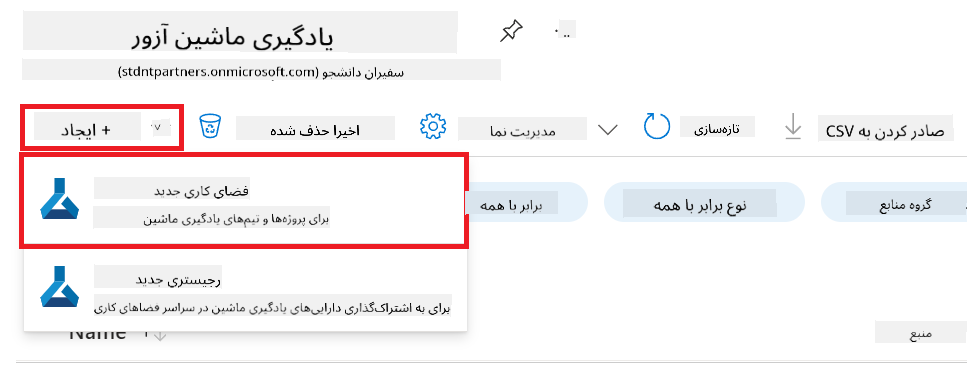
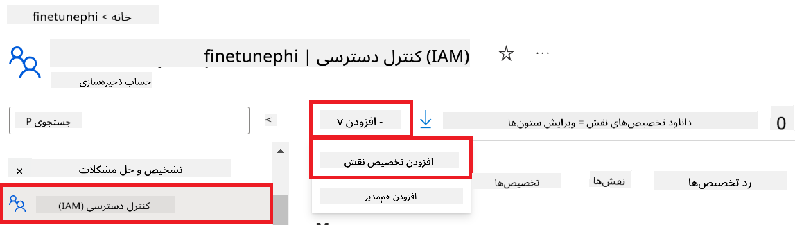
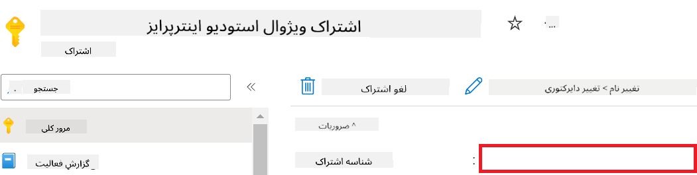

<!--
CO_OP_TRANSLATOR_METADATA:
{
  "original_hash": "455be2b7b9c3390d367d528f8fab2aa0",
  "translation_date": "2025-07-17T00:08:11+00:00",
  "source_file": "md/02.Application/01.TextAndChat/Phi3/E2E_Phi-3-FineTuning_PromptFlow_Integration.md",
  "language_code": "fa"
}
-->
# آموزش تنظیم دقیق و یکپارچه‌سازی مدل‌های سفارشی Phi-3 با Prompt flow

این نمونه‌ی جامع (E2E) بر اساس راهنمای "[Fine-Tune and Integrate Custom Phi-3 Models with Prompt Flow: Step-by-Step Guide](https://techcommunity.microsoft.com/t5/educator-developer-blog/fine-tune-and-integrate-custom-phi-3-models-with-prompt-flow/ba-p/4178612?WT.mc_id=aiml-137032-kinfeylo)" از جامعه فنی مایکروسافت تهیه شده است. این راهنما فرآیندهای تنظیم دقیق، استقرار و یکپارچه‌سازی مدل‌های سفارشی Phi-3 با Prompt flow را معرفی می‌کند.

## مرور کلی

در این نمونه جامع، شما یاد می‌گیرید چگونه مدل Phi-3 را تنظیم دقیق کرده و آن را با Prompt flow یکپارچه کنید. با استفاده از Azure Machine Learning و Prompt flow، یک جریان کاری برای استقرار و استفاده از مدل‌های هوش مصنوعی سفارشی ایجاد خواهید کرد. این نمونه به سه سناریو تقسیم شده است:

**سناریو ۱: راه‌اندازی منابع Azure و آماده‌سازی برای تنظیم دقیق**

**سناریو ۲: تنظیم دقیق مدل Phi-3 و استقرار در Azure Machine Learning Studio**

**سناریو ۳: یکپارچه‌سازی با Prompt flow و گفتگو با مدل سفارشی شما**

در ادامه، نمای کلی این نمونه جامع را مشاهده می‌کنید.


### فهرست مطالب

1. **[سناریو ۱: راه‌اندازی منابع Azure و آماده‌سازی برای تنظیم دقیق](../../../../../../md/02.Application/01.TextAndChat/Phi3)**
    - [ایجاد یک Workspace در Azure Machine Learning](../../../../../../md/02.Application/01.TextAndChat/Phi3)
    - [درخواست سهمیه GPU در اشتراک Azure](../../../../../../md/02.Application/01.TextAndChat/Phi3)
    - [افزودن انتساب نقش](../../../../../../md/02.Application/01.TextAndChat/Phi3)
    - [راه‌اندازی پروژه](../../../../../../md/02.Application/01.TextAndChat/Phi3)
    - [آماده‌سازی مجموعه داده برای تنظیم دقیق](../../../../../../md/02.Application/01.TextAndChat/Phi3)

1. **[سناریو ۲: تنظیم دقیق مدل Phi-3 و استقرار در Azure Machine Learning Studio](../../../../../../md/02.Application/01.TextAndChat/Phi3)**
    - [راه‌اندازی Azure CLI](../../../../../../md/02.Application/01.TextAndChat/Phi3)
    - [تنظیم دقیق مدل Phi-3](../../../../../../md/02.Application/01.TextAndChat/Phi3)
    - [استقرار مدل تنظیم دقیق شده](../../../../../../md/02.Application/01.TextAndChat/Phi3)

1. **[سناریو ۳: یکپارچه‌سازی با Prompt flow و گفتگو با مدل سفارشی شما](../../../../../../md/02.Application/01.TextAndChat/Phi3)**
    - [یکپارچه‌سازی مدل سفارشی Phi-3 با Prompt flow](../../../../../../md/02.Application/01.TextAndChat/Phi3)
    - [گفتگو با مدل سفارشی شما](../../../../../../md/02.Application/01.TextAndChat/Phi3)

## سناریو ۱: راه‌اندازی منابع Azure و آماده‌سازی برای تنظیم دقیق

### ایجاد یک Workspace در Azure Machine Learning

1. در نوار جستجو در بالای صفحه پورتال، عبارت *azure machine learning* را تایپ کنید و از گزینه‌های نمایش داده شده، **Azure Machine Learning** را انتخاب کنید.

    

1. از منوی ناوبری، گزینه **+ Create** را انتخاب کنید.

1. از منوی ناوبری، گزینه **New workspace** را انتخاب کنید.

    

1. موارد زیر را انجام دهید:

    - اشتراک Azure خود را انتخاب کنید.
    - گروه منابع (Resource group) مورد نظر را انتخاب کنید (در صورت نیاز، یک گروه جدید بسازید).
    - نام Workspace را وارد کنید. این نام باید منحصر به فرد باشد.
    - منطقه (Region) مورد نظر خود را انتخاب کنید.
    - حساب ذخیره‌سازی (Storage account) را انتخاب کنید (در صورت نیاز، یک حساب جدید بسازید).
    - Key vault را انتخاب کنید (در صورت نیاز، یک مورد جدید بسازید).
    - Application insights را انتخاب کنید (در صورت نیاز، یک مورد جدید بسازید).
    - Container registry را انتخاب کنید (در صورت نیاز، یک مورد جدید بسازید).

    

1. گزینه **Review + Create** را انتخاب کنید.

1. سپس روی **Create** کلیک کنید.

### درخواست سهمیه GPU در اشتراک Azure

در این نمونه جامع، برای تنظیم دقیق از GPU مدل *Standard_NC24ads_A100_v4* استفاده می‌کنید که نیاز به درخواست سهمیه دارد، و برای استقرار از CPU مدل *Standard_E4s_v3* استفاده می‌شود که نیازی به درخواست سهمیه ندارد.

> [!NOTE]
>
> تنها اشتراک‌های Pay-As-You-Go (نوع اشتراک استاندارد) واجد شرایط تخصیص GPU هستند؛ اشتراک‌های بهره‌مند (benefit) در حال حاضر پشتیبانی نمی‌شوند.
>
> برای کسانی که از اشتراک‌های بهره‌مند مانند Visual Studio Enterprise Subscription استفاده می‌کنند یا می‌خواهند فرآیند تنظیم دقیق و استقرار را سریعاً آزمایش کنند، این آموزش راهنمایی‌هایی برای تنظیم دقیق با مجموعه داده حداقلی و استفاده از CPU ارائه می‌دهد. با این حال، توجه داشته باشید که نتایج تنظیم دقیق با استفاده از GPU و مجموعه داده‌های بزرگ‌تر به مراتب بهتر است.

1. به [Azure ML Studio](https://ml.azure.com/home?wt.mc_id=studentamb_279723) مراجعه کنید.

1. برای درخواست سهمیه *Standard NCADSA100v4 Family* مراحل زیر را انجام دهید:

    - از تب سمت چپ، گزینه **Quota** را انتخاب کنید.
    - خانواده ماشین مجازی (Virtual machine family) مورد نظر را انتخاب کنید. به عنوان مثال، **Standard NCADSA100v4 Family Cluster Dedicated vCPUs** که شامل GPU مدل *Standard_NC24ads_A100_v4* است.
    - از منوی ناوبری، گزینه **Request quota** را انتخاب کنید.

        

    - در صفحه درخواست سهمیه، مقدار **New cores limit** مورد نظر خود را وارد کنید. مثلاً ۲۴.
    - سپس روی **Submit** کلیک کنید تا درخواست سهمیه GPU ثبت شود.

> [!NOTE]
> می‌توانید با مراجعه به سند [Sizes for Virtual Machines in Azure](https://learn.microsoft.com/azure/virtual-machines/sizes/overview?tabs=breakdownseries%2Cgeneralsizelist%2Ccomputesizelist%2Cmemorysizelist%2Cstoragesizelist%2Cgpusizelist%2Cfpgasizelist%2Chpcsizelist) GPU یا CPU مناسب نیاز خود را انتخاب کنید.

### افزودن انتساب نقش

برای تنظیم دقیق و استقرار مدل‌ها، ابتدا باید یک User Assigned Managed Identity (UAI) ایجاد کرده و مجوزهای لازم را به آن اختصاص دهید. این UAI برای احراز هویت در هنگام استقرار استفاده خواهد شد.

#### ایجاد User Assigned Managed Identity (UAI)

1. در نوار جستجو در بالای صفحه پورتال، عبارت *managed identities* را تایپ کنید و از گزینه‌های نمایش داده شده، **Managed Identities** را انتخاب کنید.

    

1. گزینه **+ Create** را انتخاب کنید.

    

1. موارد زیر را انجام دهید:

    - اشتراک Azure خود را انتخاب کنید.
    - گروه منابع (Resource group) مورد نظر را انتخاب کنید (در صورت نیاز، یک گروه جدید بسازید).
    - منطقه (Region) مورد نظر خود را انتخاب کنید.
    - نامی وارد کنید که باید منحصر به فرد باشد.

1. گزینه **Review + create** را انتخاب کنید.

1. سپس روی **+ Create** کلیک کنید.

#### افزودن انتساب نقش Contributor به Managed Identity

1. به منبع Managed Identity که ایجاد کرده‌اید بروید.

1. از تب سمت چپ، گزینه **Azure role assignments** را انتخاب کنید.

1. از منوی ناوبری، گزینه **+Add role assignment** را انتخاب کنید.

1. در صفحه افزودن انتساب نقش، موارد زیر را انجام دهید:
    - محدوده (Scope) را روی **Resource group** تنظیم کنید.
    - اشتراک Azure خود را انتخاب کنید.
    - گروه منابع (Resource group) مورد نظر را انتخاب کنید.
    - نقش (Role) را روی **Contributor** تنظیم کنید.

    

1. روی **Save** کلیک کنید.

#### افزودن انتساب نقش Storage Blob Data Reader به Managed Identity

1. در نوار جستجو در بالای صفحه پورتال، عبارت *storage accounts* را تایپ کنید و از گزینه‌های نمایش داده شده، **Storage accounts** را انتخاب کنید.

    

1. حساب ذخیره‌سازی مرتبط با Azure Machine Learning workspace که ایجاد کرده‌اید را انتخاب کنید. به عنوان مثال، *finetunephistorage*.

1. برای رفتن به صفحه افزودن انتساب نقش، مراحل زیر را انجام دهید:

    - به حساب ذخیره‌سازی Azure که ایجاد کرده‌اید بروید.
    - از تب سمت چپ، گزینه **Access Control (IAM)** را انتخاب کنید.
    - از منوی ناوبری، گزینه **+ Add** را انتخاب کنید.
    - سپس **Add role assignment** را انتخاب کنید.

    

1. در صفحه افزودن انتساب نقش، موارد زیر را انجام دهید:

    - در صفحه نقش، عبارت *Storage Blob Data Reader* را در نوار جستجو وارد کنید و از گزینه‌های نمایش داده شده، **Storage Blob Data Reader** را انتخاب کنید.
    - روی **Next** کلیک کنید.
    - در صفحه اعضا، گزینه **Assign access to** را روی **Managed identity** تنظیم کنید.
    - روی **+ Select members** کلیک کنید.
    - در صفحه انتخاب Managed identities، اشتراک Azure خود را انتخاب کنید.
    - Managed identity مورد نظر را انتخاب کنید. به عنوان مثال، *finetunephi-managedidentity*.
    - روی **Select** کلیک کنید.

    

1. روی **Review + assign** کلیک کنید.

#### افزودن انتساب نقش AcrPull به Managed Identity

1. در نوار جستجو در بالای صفحه پورتال، عبارت *container registries* را تایپ کنید و از گزینه‌های نمایش داده شده، **Container registries** را انتخاب کنید.

    

1. رجیستری کانتینری که به Azure Machine Learning workspace مرتبط است را انتخاب کنید. به عنوان مثال، *finetunephicontainerregistries*

1. برای رفتن به صفحه افزودن انتساب نقش، مراحل زیر را انجام دهید:

    - از تب سمت چپ، گزینه **Access Control (IAM)** را انتخاب کنید.
    - از منوی ناوبری، گزینه **+ Add** را انتخاب کنید.
    - سپس **Add role assignment** را انتخاب کنید.

1. در صفحه افزودن انتساب نقش، موارد زیر را انجام دهید:

    - در صفحه نقش، عبارت *AcrPull* را در نوار جستجو وارد کنید و از گزینه‌های نمایش داده شده، **AcrPull** را انتخاب کنید.
    - روی **Next** کلیک کنید.
    - در صفحه اعضا، گزینه **Assign access to** را روی **Managed identity** تنظیم کنید.
    - روی **+ Select members** کلیک کنید.
    - در صفحه انتخاب Managed identities، اشتراک Azure خود را انتخاب کنید.
    - Managed identity مورد نظر را انتخاب کنید. به عنوان مثال، *finetunephi-managedidentity*.
    - روی **Select** کلیک کنید.
    - روی **Review + assign** کلیک کنید.

### راه‌اندازی پروژه

اکنون یک پوشه برای کار ایجاد می‌کنید و یک محیط مجازی راه‌اندازی می‌کنید تا برنامه‌ای توسعه دهید که با کاربران تعامل داشته باشد و از تاریخچه چت ذخیره شده در Azure Cosmos DB برای پاسخگویی بهتر استفاده کند.

#### ایجاد پوشه‌ای برای کار در آن

1. یک پنجره ترمینال باز کنید و دستور زیر را برای ایجاد پوشه‌ای به نام *finetune-phi* در مسیر پیش‌فرض وارد کنید.

    ```console
    mkdir finetune-phi
    ```

1. دستور زیر را در ترمینال وارد کنید تا به پوشه *finetune-phi* که ایجاد کرده‌اید بروید.

    ```console
    cd finetune-phi
    ```

#### ایجاد محیط مجازی

1. دستور زیر را در ترمینال وارد کنید تا محیط مجازی‌ای به نام *.venv* ایجاد شود.

    ```console
    python -m venv .venv
    ```

1. دستور زیر را در ترمینال وارد کنید تا محیط مجازی فعال شود.

    ```console
    .venv\Scripts\activate.bat
    ```
> [!NOTE]
>
> اگر درست انجام شده باشد، باید *(.venv)* را قبل از خط فرمان ببینید.
#### نصب بسته‌های مورد نیاز

1. دستورات زیر را در ترمینال خود وارد کنید تا بسته‌های مورد نیاز نصب شوند.

    ```console
    pip install datasets==2.19.1
    pip install transformers==4.41.1
    pip install azure-ai-ml==1.16.0
    pip install torch==2.3.1
    pip install trl==0.9.4
    pip install promptflow==1.12.0
    ```

#### ایجاد فایل‌های پروژه

در این تمرین، فایل‌های ضروری برای پروژه‌مان را ایجاد خواهید کرد. این فایل‌ها شامل اسکریپت‌هایی برای دانلود دیتاست، راه‌اندازی محیط Azure Machine Learning، فاین‌تیون مدل Phi-3 و استقرار مدل فاین‌تیون شده هستند. همچنین یک فایل *conda.yml* برای راه‌اندازی محیط فاین‌تیون ایجاد خواهید کرد.

در این تمرین، شما:

- یک فایل *download_dataset.py* برای دانلود دیتاست ایجاد می‌کنید.
- یک فایل *setup_ml.py* برای راه‌اندازی محیط Azure Machine Learning ایجاد می‌کنید.
- یک فایل *fine_tune.py* در پوشه *finetuning_dir* برای فاین‌تیون مدل Phi-3 با استفاده از دیتاست ایجاد می‌کنید.
- یک فایل *conda.yml* برای راه‌اندازی محیط فاین‌تیون ایجاد می‌کنید.
- یک فایل *deploy_model.py* برای استقرار مدل فاین‌تیون شده ایجاد می‌کنید.
- یک فایل *integrate_with_promptflow.py* برای ادغام مدل فاین‌تیون شده و اجرای آن با استفاده از Prompt flow ایجاد می‌کنید.
- یک فایل flow.dag.yml برای تنظیم ساختار جریان کاری در Prompt flow ایجاد می‌کنید.
- یک فایل *config.py* برای وارد کردن اطلاعات Azure ایجاد می‌کنید.

> [!NOTE]
>
> ساختار کامل پوشه‌ها:
>
> ```text
> └── YourUserName
> .    └── finetune-phi
> .        ├── finetuning_dir
> .        │      └── fine_tune.py
> .        ├── conda.yml
> .        ├── config.py
> .        ├── deploy_model.py
> .        ├── download_dataset.py
> .        ├── flow.dag.yml
> .        ├── integrate_with_promptflow.py
> .        └── setup_ml.py
> ```

1. **Visual Studio Code** را باز کنید.

1. از نوار منو، گزینه **File** را انتخاب کنید.

1. گزینه **Open Folder** را انتخاب کنید.

1. پوشه *finetune-phi* که ایجاد کرده‌اید و در مسیر *C:\Users\yourUserName\finetune-phi* قرار دارد را انتخاب کنید.

    

1. در پنل سمت چپ Visual Studio Code، راست‌کلیک کرده و **New File** را انتخاب کنید تا فایل جدیدی به نام *download_dataset.py* ایجاد شود.

1. در پنل سمت چپ Visual Studio Code، راست‌کلیک کرده و **New File** را انتخاب کنید تا فایل جدیدی به نام *setup_ml.py* ایجاد شود.

1. در پنل سمت چپ Visual Studio Code، راست‌کلیک کرده و **New File** را انتخاب کنید تا فایل جدیدی به نام *deploy_model.py* ایجاد شود.

    

1. در پنل سمت چپ Visual Studio Code، راست‌کلیک کرده و **New Folder** را انتخاب کنید تا پوشه‌ای به نام *finetuning_dir* ایجاد شود.

1. در پوشه *finetuning_dir*، فایل جدیدی به نام *fine_tune.py* ایجاد کنید.

#### ایجاد و پیکربندی فایل *conda.yml*

1. در پنل سمت چپ Visual Studio Code، راست‌کلیک کرده و **New File** را انتخاب کنید تا فایل جدیدی به نام *conda.yml* ایجاد شود.

1. کد زیر را در فایل *conda.yml* وارد کنید تا محیط فاین‌تیون مدل Phi-3 راه‌اندازی شود.

    ```yml
    name: phi-3-training-env
    channels:
      - defaults
      - conda-forge
    dependencies:
      - python=3.10
      - pip
      - numpy<2.0
      - pip:
          - torch==2.4.0
          - torchvision==0.19.0
          - trl==0.8.6
          - transformers==4.41
          - datasets==2.21.0
          - azureml-core==1.57.0
          - azure-storage-blob==12.19.0
          - azure-ai-ml==1.16
          - azure-identity==1.17.1
          - accelerate==0.33.0
          - mlflow==2.15.1
          - azureml-mlflow==1.57.0
    ```

#### ایجاد و پیکربندی فایل *config.py*

1. در پنل سمت چپ Visual Studio Code، راست‌کلیک کرده و **New File** را انتخاب کنید تا فایل جدیدی به نام *config.py* ایجاد شود.

1. کد زیر را در فایل *config.py* وارد کنید تا اطلاعات Azure خود را وارد کنید.

    ```python
    # Azure settings
    AZURE_SUBSCRIPTION_ID = "your_subscription_id"
    AZURE_RESOURCE_GROUP_NAME = "your_resource_group_name" # "TestGroup"

    # Azure Machine Learning settings
    AZURE_ML_WORKSPACE_NAME = "your_workspace_name" # "finetunephi-workspace"

    # Azure Managed Identity settings
    AZURE_MANAGED_IDENTITY_CLIENT_ID = "your_azure_managed_identity_client_id"
    AZURE_MANAGED_IDENTITY_NAME = "your_azure_managed_identity_name" # "finetunephi-mangedidentity"
    AZURE_MANAGED_IDENTITY_RESOURCE_ID = f"/subscriptions/{AZURE_SUBSCRIPTION_ID}/resourceGroups/{AZURE_RESOURCE_GROUP_NAME}/providers/Microsoft.ManagedIdentity/userAssignedIdentities/{AZURE_MANAGED_IDENTITY_NAME}"

    # Dataset file paths
    TRAIN_DATA_PATH = "data/train_data.jsonl"
    TEST_DATA_PATH = "data/test_data.jsonl"

    # Fine-tuned model settings
    AZURE_MODEL_NAME = "your_fine_tuned_model_name" # "finetune-phi-model"
    AZURE_ENDPOINT_NAME = "your_fine_tuned_model_endpoint_name" # "finetune-phi-endpoint"
    AZURE_DEPLOYMENT_NAME = "your_fine_tuned_model_deployment_name" # "finetune-phi-deployment"

    AZURE_ML_API_KEY = "your_fine_tuned_model_api_key"
    AZURE_ML_ENDPOINT = "your_fine_tuned_model_endpoint_uri" # "https://{your-endpoint-name}.{your-region}.inference.ml.azure.com/score"
    ```

#### افزودن متغیرهای محیطی Azure

1. برای افزودن Azure Subscription ID مراحل زیر را انجام دهید:

    - در نوار جستجو در بالای صفحه پورتال، عبارت *subscriptions* را تایپ کنید و از گزینه‌های ظاهر شده **Subscriptions** را انتخاب کنید.
    - اشتراک Azure که در حال استفاده هستید را انتخاب کنید.
    - شناسه اشتراک (Subscription ID) را کپی کرده و در فایل *config.py* جای‌گذاری کنید.

    

1. برای افزودن نام Workspace Azure مراحل زیر را انجام دهید:

    - به منبع Azure Machine Learning که ایجاد کرده‌اید بروید.
    - نام حساب خود را کپی کرده و در فایل *config.py* جای‌گذاری کنید.

    

1. برای افزودن نام Resource Group Azure مراحل زیر را انجام دهید:

    - به منبع Azure Machine Learning که ایجاد کرده‌اید بروید.
    - نام Resource Group خود را کپی کرده و در فایل *config.py* جای‌گذاری کنید.

    

2. برای افزودن نام Managed Identity Azure مراحل زیر را انجام دهید:

    - به منبع Managed Identities که ایجاد کرده‌اید بروید.
    - نام Managed Identity خود را کپی کرده و در فایل *config.py* جای‌گذاری کنید.

    

### آماده‌سازی دیتاست برای فاین‌تیون

در این تمرین، فایل *download_dataset.py* را اجرا می‌کنید تا دیتاست *ULTRACHAT_200k* را در محیط محلی خود دانلود کنید. سپس از این دیتاست برای فاین‌تیون مدل Phi-3 در Azure Machine Learning استفاده خواهید کرد.

#### دانلود دیتاست با استفاده از *download_dataset.py*

1. فایل *download_dataset.py* را در Visual Studio Code باز کنید.

1. کد زیر را در فایل *download_dataset.py* وارد کنید.

    ```python
    import json
    import os
    from datasets import load_dataset
    from config import (
        TRAIN_DATA_PATH,
        TEST_DATA_PATH)

    def load_and_split_dataset(dataset_name, config_name, split_ratio):
        """
        Load and split a dataset.
        """
        # Load the dataset with the specified name, configuration, and split ratio
        dataset = load_dataset(dataset_name, config_name, split=split_ratio)
        print(f"Original dataset size: {len(dataset)}")
        
        # Split the dataset into train and test sets (80% train, 20% test)
        split_dataset = dataset.train_test_split(test_size=0.2)
        print(f"Train dataset size: {len(split_dataset['train'])}")
        print(f"Test dataset size: {len(split_dataset['test'])}")
        
        return split_dataset

    def save_dataset_to_jsonl(dataset, filepath):
        """
        Save a dataset to a JSONL file.
        """
        # Create the directory if it does not exist
        os.makedirs(os.path.dirname(filepath), exist_ok=True)
        
        # Open the file in write mode
        with open(filepath, 'w', encoding='utf-8') as f:
            # Iterate over each record in the dataset
            for record in dataset:
                # Dump the record as a JSON object and write it to the file
                json.dump(record, f)
                # Write a newline character to separate records
                f.write('\n')
        
        print(f"Dataset saved to {filepath}")

    def main():
        """
        Main function to load, split, and save the dataset.
        """
        # Load and split the ULTRACHAT_200k dataset with a specific configuration and split ratio
        dataset = load_and_split_dataset("HuggingFaceH4/ultrachat_200k", 'default', 'train_sft[:1%]')
        
        # Extract the train and test datasets from the split
        train_dataset = dataset['train']
        test_dataset = dataset['test']

        # Save the train dataset to a JSONL file
        save_dataset_to_jsonl(train_dataset, TRAIN_DATA_PATH)
        
        # Save the test dataset to a separate JSONL file
        save_dataset_to_jsonl(test_dataset, TEST_DATA_PATH)

    if __name__ == "__main__":
        main()

    ```

> [!TIP]
>
> **راهنمای فاین‌تیون با دیتاست کوچک با استفاده از CPU**
>
> اگر می‌خواهید از CPU برای فاین‌تیون استفاده کنید، این روش برای کسانی که اشتراک‌های ویژه (مانند Visual Studio Enterprise Subscription) دارند یا می‌خواهند فرایند فاین‌تیون و استقرار را سریع تست کنند، ایده‌آل است.
>
> خط `dataset = load_and_split_dataset("HuggingFaceH4/ultrachat_200k", 'default', 'train_sft[:1%]')` را با `dataset = load_and_split_dataset("HuggingFaceH4/ultrachat_200k", 'default', 'train_sft[:10]')` جایگزین کنید.
>

1. دستور زیر را در ترمینال وارد کنید تا اسکریپت اجرا شده و دیتاست در محیط محلی شما دانلود شود.

    ```console
    python download_data.py
    ```

1. مطمئن شوید که دیتاست‌ها با موفقیت در مسیر *finetune-phi/data* در محیط محلی شما ذخیره شده‌اند.

> [!NOTE]
>
> **حجم دیتاست و زمان فاین‌تیون**
>
> در این نمونه E2E، تنها از ۱٪ دیتاست (`train_sft[:1%]`) استفاده می‌کنید. این کار حجم داده‌ها را به طور قابل توجهی کاهش می‌دهد و سرعت آپلود و فاین‌تیون را افزایش می‌دهد. می‌توانید درصد را تنظیم کنید تا تعادل مناسبی بین زمان آموزش و عملکرد مدل پیدا کنید. استفاده از زیرمجموعه کوچکتر دیتاست، زمان مورد نیاز برای فاین‌تیون را کاهش می‌دهد و فرایند را برای نمونه E2E قابل مدیریت‌تر می‌کند.

## سناریو ۲: فاین‌تیون مدل Phi-3 و استقرار در Azure Machine Learning Studio

### راه‌اندازی Azure CLI

برای احراز هویت محیط خود باید Azure CLI را راه‌اندازی کنید. Azure CLI به شما امکان می‌دهد منابع Azure را مستقیماً از خط فرمان مدیریت کنید و اعتبارنامه‌های لازم برای دسترسی Azure Machine Learning به این منابع را فراهم می‌کند. برای شروع، [Azure CLI را نصب کنید](https://learn.microsoft.com/cli/azure/install-azure-cli).

1. یک پنجره ترمینال باز کنید و دستور زیر را برای ورود به حساب Azure خود وارد کنید.

    ```console
    az login
    ```

1. حساب Azure خود را برای استفاده انتخاب کنید.

1. اشتراک Azure خود را برای استفاده انتخاب کنید.

    

> [!TIP]
>
> اگر در ورود به Azure مشکل دارید، می‌توانید از کد دستگاه استفاده کنید. یک پنجره ترمینال باز کنید و دستور زیر را برای ورود به حساب Azure خود وارد کنید:
>
> ```console
> az login --use-device-code
> ```
>

### فاین‌تیون مدل Phi-3

در این تمرین، مدل Phi-3 را با استفاده از دیتاست ارائه شده فاین‌تیون می‌کنید. ابتدا فرایند فاین‌تیون را در فایل *fine_tune.py* تعریف می‌کنید. سپس محیط Azure Machine Learning را پیکربندی کرده و فرایند فاین‌تیون را با اجرای فایل *setup_ml.py* آغاز می‌کنید. این اسکریپت اطمینان می‌دهد که فاین‌تیون در محیط Azure Machine Learning انجام شود.

با اجرای *setup_ml.py*، فرایند فاین‌تیون در محیط Azure Machine Learning اجرا خواهد شد.

#### افزودن کد به فایل *fine_tune.py*

1. به پوشه *finetuning_dir* بروید و فایل *fine_tune.py* را در Visual Studio Code باز کنید.

1. کد زیر را در فایل *fine_tune.py* وارد کنید.

    ```python
    import argparse
    import sys
    import logging
    import os
    from datasets import load_dataset
    import torch
    import mlflow
    from transformers import AutoModelForCausalLM, AutoTokenizer, TrainingArguments
    from trl import SFTTrainer

    # To avoid the INVALID_PARAMETER_VALUE error in MLflow, disable MLflow integration
    os.environ["DISABLE_MLFLOW_INTEGRATION"] = "True"

    # Logging setup
    logging.basicConfig(
        format="%(asctime)s - %(levelname)s - %(name)s - %(message)s",
        datefmt="%Y-%m-%d %H:%M:%S",
        handlers=[logging.StreamHandler(sys.stdout)],
        level=logging.WARNING
    )
    logger = logging.getLogger(__name__)

    def initialize_model_and_tokenizer(model_name, model_kwargs):
        """
        Initialize the model and tokenizer with the given pretrained model name and arguments.
        """
        model = AutoModelForCausalLM.from_pretrained(model_name, **model_kwargs)
        tokenizer = AutoTokenizer.from_pretrained(model_name)
        tokenizer.model_max_length = 2048
        tokenizer.pad_token = tokenizer.unk_token
        tokenizer.pad_token_id = tokenizer.convert_tokens_to_ids(tokenizer.pad_token)
        tokenizer.padding_side = 'right'
        return model, tokenizer

    def apply_chat_template(example, tokenizer):
        """
        Apply a chat template to tokenize messages in the example.
        """
        messages = example["messages"]
        if messages[0]["role"] != "system":
            messages.insert(0, {"role": "system", "content": ""})
        example["text"] = tokenizer.apply_chat_template(
            messages, tokenize=False, add_generation_prompt=False
        )
        return example

    def load_and_preprocess_data(train_filepath, test_filepath, tokenizer):
        """
        Load and preprocess the dataset.
        """
        train_dataset = load_dataset('json', data_files=train_filepath, split='train')
        test_dataset = load_dataset('json', data_files=test_filepath, split='train')
        column_names = list(train_dataset.features)

        train_dataset = train_dataset.map(
            apply_chat_template,
            fn_kwargs={"tokenizer": tokenizer},
            num_proc=10,
            remove_columns=column_names,
            desc="Applying chat template to train dataset",
        )

        test_dataset = test_dataset.map(
            apply_chat_template,
            fn_kwargs={"tokenizer": tokenizer},
            num_proc=10,
            remove_columns=column_names,
            desc="Applying chat template to test dataset",
        )

        return train_dataset, test_dataset

    def train_and_evaluate_model(train_dataset, test_dataset, model, tokenizer, output_dir):
        """
        Train and evaluate the model.
        """
        training_args = TrainingArguments(
            bf16=True,
            do_eval=True,
            output_dir=output_dir,
            eval_strategy="epoch",
            learning_rate=5.0e-06,
            logging_steps=20,
            lr_scheduler_type="cosine",
            num_train_epochs=3,
            overwrite_output_dir=True,
            per_device_eval_batch_size=4,
            per_device_train_batch_size=4,
            remove_unused_columns=True,
            save_steps=500,
            seed=0,
            gradient_checkpointing=True,
            gradient_accumulation_steps=1,
            warmup_ratio=0.2,
        )

        trainer = SFTTrainer(
            model=model,
            args=training_args,
            train_dataset=train_dataset,
            eval_dataset=test_dataset,
            max_seq_length=2048,
            dataset_text_field="text",
            tokenizer=tokenizer,
            packing=True
        )

        train_result = trainer.train()
        trainer.log_metrics("train", train_result.metrics)

        mlflow.transformers.log_model(
            transformers_model={"model": trainer.model, "tokenizer": tokenizer},
            artifact_path=output_dir,
        )

        tokenizer.padding_side = 'left'
        eval_metrics = trainer.evaluate()
        eval_metrics["eval_samples"] = len(test_dataset)
        trainer.log_metrics("eval", eval_metrics)

    def main(train_file, eval_file, model_output_dir):
        """
        Main function to fine-tune the model.
        """
        model_kwargs = {
            "use_cache": False,
            "trust_remote_code": True,
            "torch_dtype": torch.bfloat16,
            "device_map": None,
            "attn_implementation": "eager"
        }

        # pretrained_model_name = "microsoft/Phi-3-mini-4k-instruct"
        pretrained_model_name = "microsoft/Phi-3.5-mini-instruct"

        with mlflow.start_run():
            model, tokenizer = initialize_model_and_tokenizer(pretrained_model_name, model_kwargs)
            train_dataset, test_dataset = load_and_preprocess_data(train_file, eval_file, tokenizer)
            train_and_evaluate_model(train_dataset, test_dataset, model, tokenizer, model_output_dir)

    if __name__ == "__main__":
        parser = argparse.ArgumentParser()
        parser.add_argument("--train-file", type=str, required=True, help="Path to the training data")
        parser.add_argument("--eval-file", type=str, required=True, help="Path to the evaluation data")
        parser.add_argument("--model_output_dir", type=str, required=True, help="Directory to save the fine-tuned model")
        args = parser.parse_args()
        main(args.train_file, args.eval_file, args.model_output_dir)

    ```

1. فایل *fine_tune.py* را ذخیره و ببندید.

> [!TIP]
> **می‌توانید مدل Phi-3.5 را فاین‌تیون کنید**
>
> در فایل *fine_tune.py*، می‌توانید مقدار `pretrained_model_name` را از `"microsoft/Phi-3-mini-4k-instruct"` به هر مدلی که می‌خواهید فاین‌تیون کنید تغییر دهید. برای مثال، اگر آن را به `"microsoft/Phi-3.5-mini-instruct"` تغییر دهید، از مدل Phi-3.5-mini-instruct برای فاین‌تیون استفاده خواهید کرد. برای پیدا کردن و استفاده از نام مدل مورد نظر، به [Hugging Face](https://huggingface.co/) مراجعه کنید، مدل مورد علاقه خود را جستجو کنید و نام آن را در فیلد `pretrained_model_name` در اسکریپت خود کپی کنید.
>
> :::image type="content" source="../../imgs/03/FineTuning-PromptFlow/finetunephi3.5.png" alt-text="فاین‌تیون Phi-3.5.":::
>

#### افزودن کد به فایل *setup_ml.py*

1. فایل *setup_ml.py* را در Visual Studio Code باز کنید.

1. کد زیر را در فایل *setup_ml.py* وارد کنید.

    ```python
    import logging
    from azure.ai.ml import MLClient, command, Input
    from azure.ai.ml.entities import Environment, AmlCompute
    from azure.identity import AzureCliCredential
    from config import (
        AZURE_SUBSCRIPTION_ID,
        AZURE_RESOURCE_GROUP_NAME,
        AZURE_ML_WORKSPACE_NAME,
        TRAIN_DATA_PATH,
        TEST_DATA_PATH
    )

    # Constants

    # Uncomment the following lines to use a CPU instance for training
    # COMPUTE_INSTANCE_TYPE = "Standard_E16s_v3" # cpu
    # COMPUTE_NAME = "cpu-e16s-v3"
    # DOCKER_IMAGE_NAME = "mcr.microsoft.com/azureml/openmpi4.1.0-ubuntu20.04:latest"

    # Uncomment the following lines to use a GPU instance for training
    COMPUTE_INSTANCE_TYPE = "Standard_NC24ads_A100_v4"
    COMPUTE_NAME = "gpu-nc24s-a100-v4"
    DOCKER_IMAGE_NAME = "mcr.microsoft.com/azureml/curated/acft-hf-nlp-gpu:59"

    CONDA_FILE = "conda.yml"
    LOCATION = "eastus2" # Replace with the location of your compute cluster
    FINETUNING_DIR = "./finetuning_dir" # Path to the fine-tuning script
    TRAINING_ENV_NAME = "phi-3-training-environment" # Name of the training environment
    MODEL_OUTPUT_DIR = "./model_output" # Path to the model output directory in azure ml

    # Logging setup to track the process
    logger = logging.getLogger(__name__)
    logging.basicConfig(
        format="%(asctime)s - %(levelname)s - %(name)s - %(message)s",
        datefmt="%Y-%m-%d %H:%M:%S",
        level=logging.WARNING
    )

    def get_ml_client():
        """
        Initialize the ML Client using Azure CLI credentials.
        """
        credential = AzureCliCredential()
        return MLClient(credential, AZURE_SUBSCRIPTION_ID, AZURE_RESOURCE_GROUP_NAME, AZURE_ML_WORKSPACE_NAME)

    def create_or_get_environment(ml_client):
        """
        Create or update the training environment in Azure ML.
        """
        env = Environment(
            image=DOCKER_IMAGE_NAME,  # Docker image for the environment
            conda_file=CONDA_FILE,  # Conda environment file
            name=TRAINING_ENV_NAME,  # Name of the environment
        )
        return ml_client.environments.create_or_update(env)

    def create_or_get_compute_cluster(ml_client, compute_name, COMPUTE_INSTANCE_TYPE, location):
        """
        Create or update the compute cluster in Azure ML.
        """
        try:
            compute_cluster = ml_client.compute.get(compute_name)
            logger.info(f"Compute cluster '{compute_name}' already exists. Reusing it for the current run.")
        except Exception:
            logger.info(f"Compute cluster '{compute_name}' does not exist. Creating a new one with size {COMPUTE_INSTANCE_TYPE}.")
            compute_cluster = AmlCompute(
                name=compute_name,
                size=COMPUTE_INSTANCE_TYPE,
                location=location,
                tier="Dedicated",  # Tier of the compute cluster
                min_instances=0,  # Minimum number of instances
                max_instances=1  # Maximum number of instances
            )
            ml_client.compute.begin_create_or_update(compute_cluster).wait()  # Wait for the cluster to be created
        return compute_cluster

    def create_fine_tuning_job(env, compute_name):
        """
        Set up the fine-tuning job in Azure ML.
        """
        return command(
            code=FINETUNING_DIR,  # Path to fine_tune.py
            command=(
                "python fine_tune.py "
                "--train-file ${{inputs.train_file}} "
                "--eval-file ${{inputs.eval_file}} "
                "--model_output_dir ${{inputs.model_output}}"
            ),
            environment=env,  # Training environment
            compute=compute_name,  # Compute cluster to use
            inputs={
                "train_file": Input(type="uri_file", path=TRAIN_DATA_PATH),  # Path to the training data file
                "eval_file": Input(type="uri_file", path=TEST_DATA_PATH),  # Path to the evaluation data file
                "model_output": MODEL_OUTPUT_DIR
            }
        )

    def main():
        """
        Main function to set up and run the fine-tuning job in Azure ML.
        """
        # Initialize ML Client
        ml_client = get_ml_client()

        # Create Environment
        env = create_or_get_environment(ml_client)
        
        # Create or get existing compute cluster
        create_or_get_compute_cluster(ml_client, COMPUTE_NAME, COMPUTE_INSTANCE_TYPE, LOCATION)

        # Create and Submit Fine-Tuning Job
        job = create_fine_tuning_job(env, COMPUTE_NAME)
        returned_job = ml_client.jobs.create_or_update(job)  # Submit the job
        ml_client.jobs.stream(returned_job.name)  # Stream the job logs
        
        # Capture the job name
        job_name = returned_job.name
        print(f"Job name: {job_name}")

    if __name__ == "__main__":
        main()

    ```

1. مقادیر `COMPUTE_INSTANCE_TYPE`، `COMPUTE_NAME` و `LOCATION` را با جزئیات خود جایگزین کنید.

    ```python
   # Uncomment the following lines to use a GPU instance for training
    COMPUTE_INSTANCE_TYPE = "Standard_NC24ads_A100_v4"
    COMPUTE_NAME = "gpu-nc24s-a100-v4"
    ...
    LOCATION = "eastus2" # Replace with the location of your compute cluster
    ```

> [!TIP]
>
> **راهنمای فاین‌تیون با دیتاست کوچک با استفاده از CPU**
>
> اگر می‌خواهید از CPU برای فاین‌تیون استفاده کنید، این روش برای کسانی که اشتراک‌های ویژه (مانند Visual Studio Enterprise Subscription) دارند یا می‌خواهند فرایند فاین‌تیون و استقرار را سریع تست کنند، ایده‌آل است.
>
> 1. فایل *setup_ml* را باز کنید.
> 1. مقادیر `COMPUTE_INSTANCE_TYPE`، `COMPUTE_NAME` و `DOCKER_IMAGE_NAME` را با مقادیر زیر جایگزین کنید. اگر به *Standard_E16s_v3* دسترسی ندارید، می‌توانید از نمونه CPU معادل استفاده کنید یا درخواست سهمیه جدید دهید.
> 1. مقدار `LOCATION` را با جزئیات خود جایگزین کنید.
>
>    ```python
>    # Uncomment the following lines to use a CPU instance for training
>    COMPUTE_INSTANCE_TYPE = "Standard_E16s_v3" # cpu
>    COMPUTE_NAME = "cpu-e16s-v3"
>    DOCKER_IMAGE_NAME = "mcr.microsoft.com/azureml/openmpi4.1.0-ubuntu20.04:latest"
>    LOCATION = "eastus2" # Replace with the location of your compute cluster
>    ```
>

1. دستور زیر را وارد کنید تا اسکریپت *setup_ml.py* اجرا شده و فرایند فاین‌تیون در Azure Machine Learning آغاز شود.

    ```python
    python setup_ml.py
    ```

1. در این تمرین، شما با موفقیت مدل Phi-3 را با استفاده از Azure Machine Learning فاین‌تیون کردید. با اجرای اسکریپت *setup_ml.py*، محیط Azure Machine Learning را راه‌اندازی کرده و فرایند فاین‌تیون تعریف شده در فایل *fine_tune.py* را آغاز کردید. توجه داشته باشید که فرایند فاین‌تیون ممکن است زمان قابل توجهی طول بکشد. پس از اجرای دستور `python setup_ml.py` باید منتظر بمانید تا فرایند کامل شود. می‌توانید وضعیت کار فاین‌تیون را با دنبال کردن لینکی که در ترمینال به پورتال Azure Machine Learning داده شده است، مشاهده کنید.

    

### استقرار مدل فاین‌تیون شده

برای ادغام مدل فاین‌تیون شده Phi-3 با Prompt Flow، باید مدل را استقرار دهید تا برای استنتاج در زمان واقعی قابل دسترسی باشد. این فرایند شامل ثبت مدل، ایجاد یک endpoint آنلاین و استقرار مدل است.

#### تنظیم نام مدل، نام endpoint و نام استقرار برای استقرار

1. فایل *config.py* را باز کنید.

1. مقدار `AZURE_MODEL_NAME = "your_fine_tuned_model_name"` را با نام دلخواه مدل خود جایگزین کنید.

1. مقدار `AZURE_ENDPOINT_NAME = "your_fine_tuned_model_endpoint_name"` را با نام دلخواه endpoint خود جایگزین کنید.

1. مقدار `AZURE_DEPLOYMENT_NAME = "your_fine_tuned_model_deployment_name"` را با نام دلخواه استقرار خود جایگزین کنید.

#### افزودن کد به فایل *deploy_model.py*

اجرای فایل *deploy_model.py* کل فرایند استقرار را خودکار می‌کند. این فایل مدل را ثبت می‌کند، یک endpoint ایجاد می‌کند و استقرار را بر اساس تنظیمات مشخص شده در فایل *config.py* که شامل نام مدل، نام endpoint و نام استقرار است، انجام می‌دهد.

1. فایل *deploy_model.py* را در Visual Studio Code باز کنید.

1. کد زیر را در فایل *deploy_model.py* وارد کنید.

    ```python
    import logging
    from azure.identity import AzureCliCredential
    from azure.ai.ml import MLClient
    from azure.ai.ml.entities import Model, ProbeSettings, ManagedOnlineEndpoint, ManagedOnlineDeployment, IdentityConfiguration, ManagedIdentityConfiguration, OnlineRequestSettings
    from azure.ai.ml.constants import AssetTypes

    # Configuration imports
    from config import (
        AZURE_SUBSCRIPTION_ID,
        AZURE_RESOURCE_GROUP_NAME,
        AZURE_ML_WORKSPACE_NAME,
        AZURE_MANAGED_IDENTITY_RESOURCE_ID,
        AZURE_MANAGED_IDENTITY_CLIENT_ID,
        AZURE_MODEL_NAME,
        AZURE_ENDPOINT_NAME,
        AZURE_DEPLOYMENT_NAME
    )

    # Constants
    JOB_NAME = "your-job-name"
    COMPUTE_INSTANCE_TYPE = "Standard_E4s_v3"

    deployment_env_vars = {
        "SUBSCRIPTION_ID": AZURE_SUBSCRIPTION_ID,
        "RESOURCE_GROUP_NAME": AZURE_RESOURCE_GROUP_NAME,
        "UAI_CLIENT_ID": AZURE_MANAGED_IDENTITY_CLIENT_ID,
    }

    # Logging setup
    logging.basicConfig(
        format="%(asctime)s - %(levelname)s - %(name)s - %(message)s",
        datefmt="%Y-%m-%d %H:%M:%S",
        level=logging.DEBUG
    )
    logger = logging.getLogger(__name__)

    def get_ml_client():
        """Initialize and return the ML Client."""
        credential = AzureCliCredential()
        return MLClient(credential, AZURE_SUBSCRIPTION_ID, AZURE_RESOURCE_GROUP_NAME, AZURE_ML_WORKSPACE_NAME)

    def register_model(ml_client, model_name, job_name):
        """Register a new model."""
        model_path = f"azureml://jobs/{job_name}/outputs/artifacts/paths/model_output"
        logger.info(f"Registering model {model_name} from job {job_name} at path {model_path}.")
        run_model = Model(
            path=model_path,
            name=model_name,
            description="Model created from run.",
            type=AssetTypes.MLFLOW_MODEL,
        )
        model = ml_client.models.create_or_update(run_model)
        logger.info(f"Registered model ID: {model.id}")
        return model

    def delete_existing_endpoint(ml_client, endpoint_name):
        """Delete existing endpoint if it exists."""
        try:
            endpoint_result = ml_client.online_endpoints.get(name=endpoint_name)
            logger.info(f"Deleting existing endpoint {endpoint_name}.")
            ml_client.online_endpoints.begin_delete(name=endpoint_name).result()
            logger.info(f"Deleted existing endpoint {endpoint_name}.")
        except Exception as e:
            logger.info(f"No existing endpoint {endpoint_name} found to delete: {e}")

    def create_or_update_endpoint(ml_client, endpoint_name, description=""):
        """Create or update an endpoint."""
        delete_existing_endpoint(ml_client, endpoint_name)
        logger.info(f"Creating new endpoint {endpoint_name}.")
        endpoint = ManagedOnlineEndpoint(
            name=endpoint_name,
            description=description,
            identity=IdentityConfiguration(
                type="user_assigned",
                user_assigned_identities=[ManagedIdentityConfiguration(resource_id=AZURE_MANAGED_IDENTITY_RESOURCE_ID)]
            )
        )
        endpoint_result = ml_client.online_endpoints.begin_create_or_update(endpoint).result()
        logger.info(f"Created new endpoint {endpoint_name}.")
        return endpoint_result

    def create_or_update_deployment(ml_client, endpoint_name, deployment_name, model):
        """Create or update a deployment."""

        logger.info(f"Creating deployment {deployment_name} for endpoint {endpoint_name}.")
        deployment = ManagedOnlineDeployment(
            name=deployment_name,
            endpoint_name=endpoint_name,
            model=model.id,
            instance_type=COMPUTE_INSTANCE_TYPE,
            instance_count=1,
            environment_variables=deployment_env_vars,
            request_settings=OnlineRequestSettings(
                max_concurrent_requests_per_instance=3,
                request_timeout_ms=180000,
                max_queue_wait_ms=120000
            ),
            liveness_probe=ProbeSettings(
                failure_threshold=30,
                success_threshold=1,
                period=100,
                initial_delay=500,
            ),
            readiness_probe=ProbeSettings(
                failure_threshold=30,
                success_threshold=1,
                period=100,
                initial_delay=500,
            ),
        )
        deployment_result = ml_client.online_deployments.begin_create_or_update(deployment).result()
        logger.info(f"Created deployment {deployment.name} for endpoint {endpoint_name}.")
        return deployment_result

    def set_traffic_to_deployment(ml_client, endpoint_name, deployment_name):
        """Set traffic to the specified deployment."""
        try:
            # Fetch the current endpoint details
            endpoint = ml_client.online_endpoints.get(name=endpoint_name)
            
            # Log the current traffic allocation for debugging
            logger.info(f"Current traffic allocation: {endpoint.traffic}")
            
            # Set the traffic allocation for the deployment
            endpoint.traffic = {deployment_name: 100}
            
            # Update the endpoint with the new traffic allocation
            endpoint_poller = ml_client.online_endpoints.begin_create_or_update(endpoint)
            updated_endpoint = endpoint_poller.result()
            
            # Log the updated traffic allocation for debugging
            logger.info(f"Updated traffic allocation: {updated_endpoint.traffic}")
            logger.info(f"Set traffic to deployment {deployment_name} at endpoint {endpoint_name}.")
            return updated_endpoint
        except Exception as e:
            # Log any errors that occur during the process
            logger.error(f"Failed to set traffic to deployment: {e}")
            raise


    def main():
        ml_client = get_ml_client()

        registered_model = register_model(ml_client, AZURE_MODEL_NAME, JOB_NAME)
        logger.info(f"Registered model ID: {registered_model.id}")

        endpoint = create_or_update_endpoint(ml_client, AZURE_ENDPOINT_NAME, "Endpoint for finetuned Phi-3 model")
        logger.info(f"Endpoint {AZURE_ENDPOINT_NAME} is ready.")

        try:
            deployment = create_or_update_deployment(ml_client, AZURE_ENDPOINT_NAME, AZURE_DEPLOYMENT_NAME, registered_model)
            logger.info(f"Deployment {AZURE_DEPLOYMENT_NAME} is created for endpoint {AZURE_ENDPOINT_NAME}.")

            set_traffic_to_deployment(ml_client, AZURE_ENDPOINT_NAME, AZURE_DEPLOYMENT_NAME)
            logger.info(f"Traffic is set to deployment {AZURE_DEPLOYMENT_NAME} at endpoint {AZURE_ENDPOINT_NAME}.")
        except Exception as e:
            logger.error(f"Failed to create or update deployment: {e}")

    if __name__ == "__main__":
        main()

    ```

1. برای دریافت `JOB_NAME` مراحل زیر را انجام دهید:

    - به منبع Azure Machine Learning که ایجاد کرده‌اید بروید.
    - گزینه **Studio web URL** را انتخاب کنید تا فضای کاری Azure Machine Learning باز شود.
    - از تب سمت چپ، گزینه **Jobs** را انتخاب کنید.
    - آزمایشی که برای فاین‌تیون ایجاد کرده‌اید را انتخاب کنید. برای مثال، *finetunephi*.
    - کاری که ایجاد کرده‌اید را انتخاب کنید.
- نام شغل خود را در فایل *deploy_model.py* در متغیر `JOB_NAME = "your-job-name"` کپی و جای‌گذاری کنید.

1. مقدار `COMPUTE_INSTANCE_TYPE` را با جزئیات مخصوص خود جایگزین کنید.

1. دستور زیر را برای اجرای اسکریپت *deploy_model.py* و شروع فرآیند استقرار در Azure Machine Learning وارد کنید.

    ```python
    python deploy_model.py
    ```


> [!WARNING]
> برای جلوگیری از هزینه‌های اضافی در حساب خود، حتماً نقطه انتهایی ایجاد شده در فضای کاری Azure Machine Learning را حذف کنید.
>

#### بررسی وضعیت استقرار در فضای کاری Azure Machine Learning

1. به [Azure ML Studio](https://ml.azure.com/home?wt.mc_id=studentamb_279723) مراجعه کنید.

1. به فضای کاری Azure Machine Learning که ایجاد کرده‌اید بروید.

1. برای باز کردن فضای کاری Azure Machine Learning، **Studio web URL** را انتخاب کنید.

1. از تب سمت چپ، **Endpoints** را انتخاب کنید.

    

2. نقطه انتهایی که ایجاد کرده‌اید را انتخاب کنید.

    

3. در این صفحه می‌توانید نقاط انتهایی ایجاد شده در طول فرآیند استقرار را مدیریت کنید.

## سناریو ۳: ادغام با Prompt flow و گفتگو با مدل سفارشی شما

### ادغام مدل سفارشی Phi-3 با Prompt flow

پس از استقرار موفق مدل فاین‌تیون شده خود، اکنون می‌توانید آن را با Prompt flow ادغام کنید تا مدل خود را در برنامه‌های زمان واقعی به کار ببرید و انواع وظایف تعاملی را با مدل سفارشی Phi-3 خود انجام دهید.

#### تنظیم کلید api و آدرس endpoint مدل فاین‌تیون شده Phi-3

1. به فضای کاری Azure Machine Learning که ایجاد کرده‌اید بروید.
1. از تب سمت چپ، **Endpoints** را انتخاب کنید.
1. نقطه انتهایی که ایجاد کرده‌اید را انتخاب کنید.
1. از منوی ناوبری، **Consume** را انتخاب کنید.
1. **REST endpoint** خود را کپی کرده و در فایل *config.py* جای‌گذاری کنید، به طوری که مقدار `AZURE_ML_ENDPOINT = "your_fine_tuned_model_endpoint_uri"` با **REST endpoint** شما جایگزین شود.
1. **Primary key** خود را کپی کرده و در فایل *config.py* جای‌گذاری کنید، به طوری که مقدار `AZURE_ML_API_KEY = "your_fine_tuned_model_api_key"` با **Primary key** شما جایگزین شود.

    

#### افزودن کد به فایل *flow.dag.yml*

1. فایل *flow.dag.yml* را در Visual Studio Code باز کنید.

1. کد زیر را به فایل *flow.dag.yml* اضافه کنید.

    ```yml
    inputs:
      input_data:
        type: string
        default: "Who founded Microsoft?"

    outputs:
      answer:
        type: string
        reference: ${integrate_with_promptflow.output}

    nodes:
    - name: integrate_with_promptflow
      type: python
      source:
        type: code
        path: integrate_with_promptflow.py
      inputs:
        input_data: ${inputs.input_data}
    ```

#### افزودن کد به فایل *integrate_with_promptflow.py*

1. فایل *integrate_with_promptflow.py* را در Visual Studio Code باز کنید.

1. کد زیر را به فایل *integrate_with_promptflow.py* اضافه کنید.

    ```python
    import logging
    import requests
    from promptflow.core import tool
    import asyncio
    import platform
    from config import (
        AZURE_ML_ENDPOINT,
        AZURE_ML_API_KEY
    )

    # Logging setup
    logging.basicConfig(
        format="%(asctime)s - %(levelname)s - %(name)s - %(message)s",
        datefmt="%Y-%m-%d %H:%M:%S",
        level=logging.DEBUG
    )
    logger = logging.getLogger(__name__)

    def query_azml_endpoint(input_data: list, endpoint_url: str, api_key: str) -> str:
        """
        Send a request to the Azure ML endpoint with the given input data.
        """
        headers = {
            "Content-Type": "application/json",
            "Authorization": f"Bearer {api_key}"
        }
        data = {
            "input_data": [input_data],
            "params": {
                "temperature": 0.7,
                "max_new_tokens": 128,
                "do_sample": True,
                "return_full_text": True
            }
        }
        try:
            response = requests.post(endpoint_url, json=data, headers=headers)
            response.raise_for_status()
            result = response.json()[0]
            logger.info("Successfully received response from Azure ML Endpoint.")
            return result
        except requests.exceptions.RequestException as e:
            logger.error(f"Error querying Azure ML Endpoint: {e}")
            raise

    def setup_asyncio_policy():
        """
        Setup asyncio event loop policy for Windows.
        """
        if platform.system() == 'Windows':
            asyncio.set_event_loop_policy(asyncio.WindowsSelectorEventLoopPolicy())
            logger.info("Set Windows asyncio event loop policy.")

    @tool
    def my_python_tool(input_data: str) -> str:
        """
        Tool function to process input data and query the Azure ML endpoint.
        """
        setup_asyncio_policy()
        return query_azml_endpoint(input_data, AZURE_ML_ENDPOINT, AZURE_ML_API_KEY)

    ```

### گفتگو با مدل سفارشی خود

1. دستور زیر را برای اجرای اسکریپت *deploy_model.py* و شروع فرآیند استقرار در Azure Machine Learning وارد کنید.

    ```python
    pf flow serve --source ./ --port 8080 --host localhost
    ```

1. در اینجا نمونه‌ای از نتایج آمده است: اکنون می‌توانید با مدل سفارشی Phi-3 خود گفتگو کنید. توصیه می‌شود سوالات خود را بر اساس داده‌های استفاده شده برای فاین‌تیون مطرح کنید.

    

**سلب مسئولیت**:  
این سند با استفاده از سرویس ترجمه هوش مصنوعی [Co-op Translator](https://github.com/Azure/co-op-translator) ترجمه شده است. در حالی که ما در تلاش برای دقت هستیم، لطفاً توجه داشته باشید که ترجمه‌های خودکار ممکن است حاوی خطاها یا نادرستی‌هایی باشند. سند اصلی به زبان بومی خود باید به عنوان منبع معتبر در نظر گرفته شود. برای اطلاعات حیاتی، ترجمه حرفه‌ای انسانی توصیه می‌شود. ما مسئول هیچ گونه سوءتفاهم یا تفسیر نادرستی که از استفاده از این ترجمه ناشی شود، نیستیم.