<!--
CO_OP_TRANSLATOR_METADATA:
{
  "original_hash": "ecbd9179a21edbaafaf114d47f09f3e3",
  "translation_date": "2025-07-17T01:03:16+00:00",
  "source_file": "md/02.Application/01.TextAndChat/Phi3/E2E_Phi-3-FineTuning_PromptFlow_Integration_AIFoundry.md",
  "language_code": "fa"
}
-->
# تنظیم دقیق و یکپارچه‌سازی مدل‌های سفارشی Phi-3 با Prompt flow در Azure AI Foundry

این نمونه جامع (E2E) بر اساس راهنمای "[تنظیم دقیق و یکپارچه‌سازی مدل‌های سفارشی Phi-3 با Prompt Flow در Azure AI Foundry](https://techcommunity.microsoft.com/t5/educator-developer-blog/fine-tune-and-integrate-custom-phi-3-models-with-prompt-flow-in/ba-p/4191726?WT.mc_id=aiml-137032-kinfeylo)" از جامعه فنی مایکروسافت تهیه شده است. این راهنما فرآیندهای تنظیم دقیق، استقرار و یکپارچه‌سازی مدل‌های سفارشی Phi-3 با Prompt flow در Azure AI Foundry را معرفی می‌کند. برخلاف نمونه E2E "[تنظیم دقیق و یکپارچه‌سازی مدل‌های سفارشی Phi-3 با Prompt Flow](./E2E_Phi-3-FineTuning_PromptFlow_Integration.md)" که شامل اجرای کد به صورت محلی بود، این آموزش به طور کامل بر روی تنظیم دقیق و یکپارچه‌سازی مدل شما در Azure AI / ML Studio تمرکز دارد.

## مرور کلی

در این نمونه جامع، شما یاد می‌گیرید چگونه مدل Phi-3 را تنظیم دقیق کرده و آن را با Prompt flow در Azure AI Foundry یکپارچه کنید. با استفاده از Azure AI / ML Studio، یک جریان کاری برای استقرار و استفاده از مدل‌های هوش مصنوعی سفارشی ایجاد خواهید کرد. این نمونه جامع به سه سناریو تقسیم شده است:

**سناریو ۱: راه‌اندازی منابع Azure و آماده‌سازی برای تنظیم دقیق**

**سناریو ۲: تنظیم دقیق مدل Phi-3 و استقرار در Azure Machine Learning Studio**

**سناریو ۳: یکپارچه‌سازی با Prompt flow و گفتگو با مدل سفارشی خود در Azure AI Foundry**

در ادامه، نمای کلی این نمونه جامع را مشاهده می‌کنید.


### فهرست مطالب

1. **[سناریو ۱: راه‌اندازی منابع Azure و آماده‌سازی برای تنظیم دقیق](../../../../../../md/02.Application/01.TextAndChat/Phi3)**
    - [ایجاد یک Workspace در Azure Machine Learning](../../../../../../md/02.Application/01.TextAndChat/Phi3)
    - [درخواست سهمیه GPU در اشتراک Azure](../../../../../../md/02.Application/01.TextAndChat/Phi3)
    - [افزودن انتساب نقش](../../../../../../md/02.Application/01.TextAndChat/Phi3)
    - [راه‌اندازی پروژه](../../../../../../md/02.Application/01.TextAndChat/Phi3)
    - [آماده‌سازی مجموعه داده برای تنظیم دقیق](../../../../../../md/02.Application/01.TextAndChat/Phi3)

1. **[سناریو ۲: تنظیم دقیق مدل Phi-3 و استقرار در Azure Machine Learning Studio](../../../../../../md/02.Application/01.TextAndChat/Phi3)**
    - [تنظیم دقیق مدل Phi-3](../../../../../../md/02.Application/01.TextAndChat/Phi3)
    - [استقرار مدل Phi-3 تنظیم دقیق شده](../../../../../../md/02.Application/01.TextAndChat/Phi3)

1. **[سناریو ۳: یکپارچه‌سازی با Prompt flow و گفتگو با مدل سفارشی خود در Azure AI Foundry](../../../../../../md/02.Application/01.TextAndChat/Phi3)**
    - [یکپارچه‌سازی مدل سفارشی Phi-3 با Prompt flow](../../../../../../md/02.Application/01.TextAndChat/Phi3)
    - [گفتگو با مدل سفارشی Phi-3 خود](../../../../../../md/02.Application/01.TextAndChat/Phi3)

## سناریو ۱: راه‌اندازی منابع Azure و آماده‌سازی برای تنظیم دقیق

### ایجاد یک Workspace در Azure Machine Learning

1. در نوار جستجو در بالای صفحه پورتال، عبارت *azure machine learning* را تایپ کنید و از گزینه‌های ظاهر شده **Azure Machine Learning** را انتخاب کنید.

    

2. از منوی ناوبری، گزینه **+ Create** را انتخاب کنید.

3. از منوی ناوبری، گزینه **New workspace** را انتخاب کنید.

    

4. موارد زیر را انجام دهید:

    - اشتراک Azure خود را انتخاب کنید.
    - گروه منابع (Resource group) مورد نظر را انتخاب کنید (در صورت نیاز یک گروه جدید بسازید).
    - نام Workspace را وارد کنید. این نام باید منحصر به فرد باشد.
    - منطقه (Region) مورد نظر خود را انتخاب کنید.
    - حساب ذخیره‌سازی (Storage account) مورد استفاده را انتخاب کنید (در صورت نیاز یک حساب جدید بسازید).
    - کلید مخزن (Key vault) مورد استفاده را انتخاب کنید (در صورت نیاز یک کلید جدید بسازید).
    - Application insights مورد استفاده را انتخاب کنید (در صورت نیاز یک نمونه جدید بسازید).
    - رجیستری کانتینر (Container registry) مورد استفاده را انتخاب کنید (در صورت نیاز یک رجیستری جدید بسازید).

    

5. گزینه **Review + Create** را انتخاب کنید.

6. گزینه **Create** را انتخاب کنید.

### درخواست سهمیه GPU در اشتراک Azure

در این آموزش، شما یاد می‌گیرید چگونه مدل Phi-3 را با استفاده از GPUها تنظیم دقیق و مستقر کنید. برای تنظیم دقیق، از GPU مدل *Standard_NC24ads_A100_v4* استفاده خواهید کرد که نیاز به درخواست سهمیه دارد. برای استقرار نیز از GPU مدل *Standard_NC6s_v3* استفاده می‌شود که آن هم نیاز به درخواست سهمیه دارد.

> [!NOTE]
>
> تنها اشتراک‌های Pay-As-You-Go (نوع اشتراک استاندارد) واجد شرایط تخصیص GPU هستند؛ اشتراک‌های بهره‌مند در حال حاضر پشتیبانی نمی‌شوند.
>

1. به [Azure ML Studio](https://ml.azure.com/home?wt.mc_id=studentamb_279723) مراجعه کنید.

1. برای درخواست سهمیه *Standard NCADSA100v4 Family* مراحل زیر را انجام دهید:

    - از تب سمت چپ، گزینه **Quota** را انتخاب کنید.
    - خانواده ماشین مجازی مورد نظر را انتخاب کنید. به عنوان مثال، **Standard NCADSA100v4 Family Cluster Dedicated vCPUs** که شامل GPU مدل *Standard_NC24ads_A100_v4* است.
    - از منوی ناوبری، گزینه **Request quota** را انتخاب کنید.

        

    - در صفحه درخواست سهمیه، مقدار **New cores limit** مورد نظر خود را وارد کنید. مثلاً ۲۴.
    - در همان صفحه، گزینه **Submit** را برای ارسال درخواست سهمیه انتخاب کنید.

1. برای درخواست سهمیه *Standard NCSv3 Family* مراحل زیر را انجام دهید:

    - از تب سمت چپ، گزینه **Quota** را انتخاب کنید.
    - خانواده ماشین مجازی مورد نظر را انتخاب کنید. به عنوان مثال، **Standard NCSv3 Family Cluster Dedicated vCPUs** که شامل GPU مدل *Standard_NC6s_v3* است.
    - از منوی ناوبری، گزینه **Request quota** را انتخاب کنید.
    - در صفحه درخواست سهمیه، مقدار **New cores limit** مورد نظر خود را وارد کنید. مثلاً ۲۴.
    - در همان صفحه، گزینه **Submit** را برای ارسال درخواست سهمیه انتخاب کنید.

### افزودن انتساب نقش

برای تنظیم دقیق و استقرار مدل‌های خود، ابتدا باید یک هویت مدیریت شده اختصاصی کاربر (User Assigned Managed Identity یا UAI) ایجاد کرده و مجوزهای مناسب را به آن اختصاص دهید. این UAI برای احراز هویت در هنگام استقرار استفاده خواهد شد.

#### ایجاد User Assigned Managed Identity (UAI)

1. در نوار جستجو در بالای صفحه پورتال، عبارت *managed identities* را تایپ کنید و از گزینه‌های ظاهر شده **Managed Identities** را انتخاب کنید.

    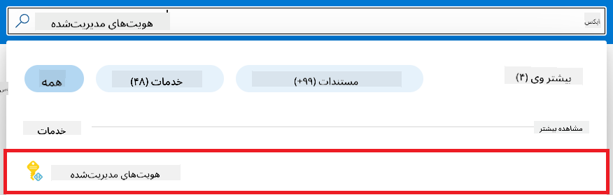

1. گزینه **+ Create** را انتخاب کنید.

    

1. موارد زیر را انجام دهید:

    - اشتراک Azure خود را انتخاب کنید.
    - گروه منابع (Resource group) مورد نظر را انتخاب کنید (در صورت نیاز یک گروه جدید بسازید).
    - منطقه (Region) مورد نظر خود را انتخاب کنید.
    - نامی وارد کنید که باید منحصر به فرد باشد.

    

1. گزینه **Review + create** را انتخاب کنید.

1. گزینه **+ Create** را انتخاب کنید.

#### افزودن انتساب نقش Contributor به Managed Identity

1. به منبع Managed Identity که ایجاد کرده‌اید بروید.

1. از تب سمت چپ، گزینه **Azure role assignments** را انتخاب کنید.

1. از منوی ناوبری، گزینه **+Add role assignment** را انتخاب کنید.

1. در صفحه افزودن انتساب نقش، موارد زیر را انجام دهید:
    - **Scope** را روی **Resource group** تنظیم کنید.
    - اشتراک Azure خود را انتخاب کنید.
    - گروه منابع (Resource group) مورد نظر را انتخاب کنید.
    - نقش (Role) را روی **Contributor** تنظیم کنید.

    

2. گزینه **Save** را انتخاب کنید.

#### افزودن انتساب نقش Storage Blob Data Reader به Managed Identity

1. در نوار جستجو در بالای صفحه پورتال، عبارت *storage accounts* را تایپ کنید و از گزینه‌های ظاهر شده **Storage accounts** را انتخاب کنید.

    

1. حساب ذخیره‌سازی مرتبط با Azure Machine Learning workspace که ایجاد کرده‌اید را انتخاب کنید. به عنوان مثال، *finetunephistorage*.

1. برای رفتن به صفحه افزودن انتساب نقش، مراحل زیر را انجام دهید:

    - به حساب ذخیره‌سازی Azure که ایجاد کرده‌اید بروید.
    - از تب سمت چپ، گزینه **Access Control (IAM)** را انتخاب کنید.
    - از منوی ناوبری، گزینه **+ Add** را انتخاب کنید.
    - گزینه **Add role assignment** را انتخاب کنید.

    

1. در صفحه افزودن انتساب نقش، موارد زیر را انجام دهید:

    - در صفحه نقش، عبارت *Storage Blob Data Reader* را در نوار جستجو وارد کنید و از گزینه‌های ظاهر شده **Storage Blob Data Reader** را انتخاب کنید.
    - در صفحه نقش، گزینه **Next** را انتخاب کنید.
    - در صفحه اعضا، گزینه **Assign access to** را روی **Managed identity** تنظیم کنید.
    - در صفحه اعضا، گزینه **+ Select members** را انتخاب کنید.
    - در صفحه انتخاب Managed Identities، اشتراک Azure خود را انتخاب کنید.
    - در همان صفحه، Managed Identity را روی **Manage Identity** تنظیم کنید.
    - Managed Identity که ایجاد کرده‌اید را انتخاب کنید. به عنوان مثال، *finetunephi-managedidentity*.
    - گزینه **Select** را انتخاب کنید.

    

1. گزینه **Review + assign** را انتخاب کنید.

#### افزودن انتساب نقش AcrPull به Managed Identity

1. در نوار جستجو در بالای صفحه پورتال، عبارت *container registries* را تایپ کنید و از گزینه‌های ظاهر شده **Container registries** را انتخاب کنید.

    

1. رجیستری کانتینری که با Azure Machine Learning workspace مرتبط است را انتخاب کنید. به عنوان مثال، *finetunephicontainerregistry*

1. برای رفتن به صفحه افزودن انتساب نقش، مراحل زیر را انجام دهید:

    - از تب سمت چپ، گزینه **Access Control (IAM)** را انتخاب کنید.
    - از منوی ناوبری، گزینه **+ Add** را انتخاب کنید.
    - گزینه **Add role assignment** را انتخاب کنید.

1. در صفحه افزودن انتساب نقش، موارد زیر را انجام دهید:

    - در صفحه نقش، عبارت *AcrPull* را در نوار جستجو وارد کنید و از گزینه‌های ظاهر شده **AcrPull** را انتخاب کنید.
    - در صفحه نقش، گزینه **Next** را انتخاب کنید.
    - در صفحه اعضا، گزینه **Assign access to** را روی **Managed identity** تنظیم کنید.
    - در صفحه اعضا، گزینه **+ Select members** را انتخاب کنید.
    - در صفحه انتخاب Managed Identities، اشتراک Azure خود را انتخاب کنید.
    - در همان صفحه، Managed Identity را روی **Manage Identity** تنظیم کنید.
    - Managed Identity که ایجاد کرده‌اید را انتخاب کنید. به عنوان مثال، *finetunephi-managedidentity*.
    - گزینه **Select** را انتخاب کنید.
    - گزینه **Review + assign** را انتخاب کنید.

### راه‌اندازی پروژه

برای دانلود مجموعه داده‌های مورد نیاز برای تنظیم دقیق، باید یک محیط محلی راه‌اندازی کنید.

در این تمرین، شما:

- یک پوشه برای کار ایجاد می‌کنید.
- یک محیط مجازی می‌سازید.
- بسته‌های مورد نیاز را نصب می‌کنید.
- یک فایل *download_dataset.py* برای دانلود مجموعه داده ایجاد می‌کنید.

#### ایجاد یک پوشه برای کار در آن

1. یک پنجره ترمینال باز کنید و دستور زیر را برای ایجاد پوشه‌ای به نام *finetune-phi* در مسیر پیش‌فرض وارد کنید.

    ```console
    mkdir finetune-phi
    ```

2. دستور زیر را در ترمینال خود وارد کنید تا به پوشه *finetune-phi* که ایجاد کرده‌اید بروید.
#### ایجاد یک محیط مجازی

1. دستور زیر را در ترمینال خود وارد کنید تا یک محیط مجازی به نام *.venv* ایجاد شود.

2. دستور زیر را در ترمینال خود وارد کنید تا محیط مجازی فعال شود.

> [!NOTE]
> اگر درست انجام شده باشد، باید *(.venv)* را قبل از نشانگر فرمان ببینید.

#### نصب بسته‌های مورد نیاز

1. دستورات زیر را در ترمینال خود وارد کنید تا بسته‌های مورد نیاز نصب شوند.

#### ایجاد فایل `download_dataset.py`

> [!NOTE]
> ساختار کامل پوشه:
>
> 1. **Visual Studio Code** را باز کنید.
>
> 2. از نوار منو، گزینه **File** را انتخاب کنید.
>
> 3. گزینه **Open Folder** را انتخاب کنید.
>
> 4. پوشه *finetune-phi* که ایجاد کرده‌اید و در مسیر *C:\Users\yourUserName\finetune-phi* قرار دارد را انتخاب کنید.

    

5. در پنل سمت چپ Visual Studio Code، راست‌کلیک کرده و گزینه **New File** را انتخاب کنید تا فایلی جدید به نام *download_dataset.py* ایجاد شود.

    

### آماده‌سازی داده‌ها برای فاین‌تیونینگ

در این تمرین، فایل *download_dataset.py* را اجرا خواهید کرد تا داده‌های *ultrachat_200k* را به محیط محلی خود دانلود کنید. سپس از این داده‌ها برای فاین‌تیون مدل Phi-3 در Azure Machine Learning استفاده خواهید کرد.

در این تمرین، شما:

- کدی به فایل *download_dataset.py* اضافه می‌کنید تا داده‌ها را دانلود کند.
- فایل *download_dataset.py* را اجرا می‌کنید تا داده‌ها به محیط محلی شما دانلود شوند.

#### دانلود داده‌ها با استفاده از *download_dataset.py*

1. فایل *download_dataset.py* را در Visual Studio Code باز کنید.

2. کد زیر را در فایل *download_dataset.py* وارد کنید.

3. دستور زیر را در ترمینال خود وارد کنید تا اسکریپت اجرا شده و داده‌ها به محیط محلی شما دانلود شوند.

4. اطمینان حاصل کنید که داده‌ها با موفقیت در مسیر *finetune-phi/data* در محیط محلی شما ذخیره شده‌اند.

> [!NOTE]
>
> #### نکته‌ای درباره حجم داده‌ها و زمان فاین‌تیونینگ
>
> در این آموزش، تنها از ۱٪ داده‌ها استفاده می‌کنید (`split='train[:1%]'`). این کار حجم داده‌ها را به طور قابل توجهی کاهش می‌دهد و سرعت آپلود و فاین‌تیونینگ را افزایش می‌دهد. می‌توانید درصد را تنظیم کنید تا تعادل مناسبی بین زمان آموزش و عملکرد مدل پیدا کنید. استفاده از زیرمجموعه کوچکتر داده‌ها، زمان مورد نیاز برای فاین‌تیونینگ را کاهش می‌دهد و فرآیند را برای آموزش‌های آموزشی قابل مدیریت‌تر می‌کند.

## سناریو ۲: فاین‌تیون مدل Phi-3 و استقرار در Azure Machine Learning Studio

### فاین‌تیون مدل Phi-3

در این تمرین، مدل Phi-3 را در Azure Machine Learning Studio فاین‌تیون خواهید کرد.

در این تمرین، شما:

- یک کلاستر محاسباتی برای فاین‌تیونینگ ایجاد می‌کنید.
- مدل Phi-3 را در Azure Machine Learning Studio فاین‌تیون می‌کنید.

#### ایجاد کلاستر محاسباتی برای فاین‌تیونینگ

1. به [Azure ML Studio](https://ml.azure.com/home?wt.mc_id=studentamb_279723) مراجعه کنید.

2. از تب سمت چپ، گزینه **Compute** را انتخاب کنید.

3. از منوی ناوبری، گزینه **Compute clusters** را انتخاب کنید.

4. روی **+ New** کلیک کنید.

    

5. موارد زیر را انجام دهید:

    - منطقه (**Region**) مورد نظر خود را انتخاب کنید.
    - سطح ماشین مجازی (**Virtual machine tier**) را روی **Dedicated** تنظیم کنید.
    - نوع ماشین مجازی (**Virtual machine type**) را روی **GPU** تنظیم کنید.
    - فیلتر اندازه ماشین مجازی (**Virtual machine size**) را روی **Select from all options** قرار دهید.
    - اندازه ماشین مجازی را روی **Standard_NC24ads_A100_v4** انتخاب کنید.

    

6. روی **Next** کلیک کنید.

7. موارد زیر را انجام دهید:

    - نام کلاستر (**Compute name**) را وارد کنید. این نام باید یکتا باشد.
    - حداقل تعداد نودها (**Minimum number of nodes**) را روی **0** تنظیم کنید.
    - حداکثر تعداد نودها (**Maximum number of nodes**) را روی **1** تنظیم کنید.
    - زمان بیکاری قبل از کاهش مقیاس (**Idle seconds before scale down**) را روی **120** تنظیم کنید.

    

8. روی **Create** کلیک کنید.

#### فاین‌تیون مدل Phi-3

1. به [Azure ML Studio](https://ml.azure.com/home?wt.mc_id=studentamb_279723) مراجعه کنید.

2. فضای کاری Azure Machine Learning که ایجاد کرده‌اید را انتخاب کنید.

    

3. موارد زیر را انجام دهید:

    - از تب سمت چپ، گزینه **Model catalog** را انتخاب کنید.
    - در نوار جستجو، عبارت *phi-3-mini-4k* را تایپ کنید و گزینه **Phi-3-mini-4k-instruct** را از نتایج انتخاب کنید.

    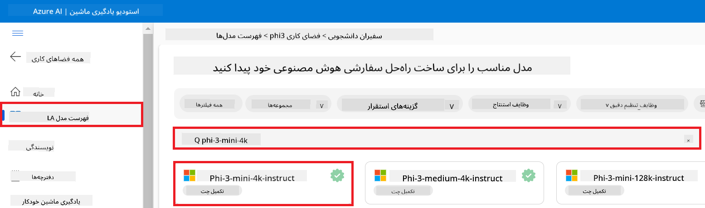

4. از منوی ناوبری، گزینه **Fine-tune** را انتخاب کنید.

    

5. موارد زیر را انجام دهید:

    - نوع کار (**Select task type**) را روی **Chat completion** تنظیم کنید.
    - روی **+ Select data** کلیک کنید تا داده‌های آموزش (**Training data**) را بارگذاری کنید.
    - نوع بارگذاری داده‌های اعتبارسنجی (**Validation data upload type**) را روی **Provide different validation data** تنظیم کنید.
    - روی **+ Select data** کلیک کنید تا داده‌های اعتبارسنجی (**Validation data**) را بارگذاری کنید.

    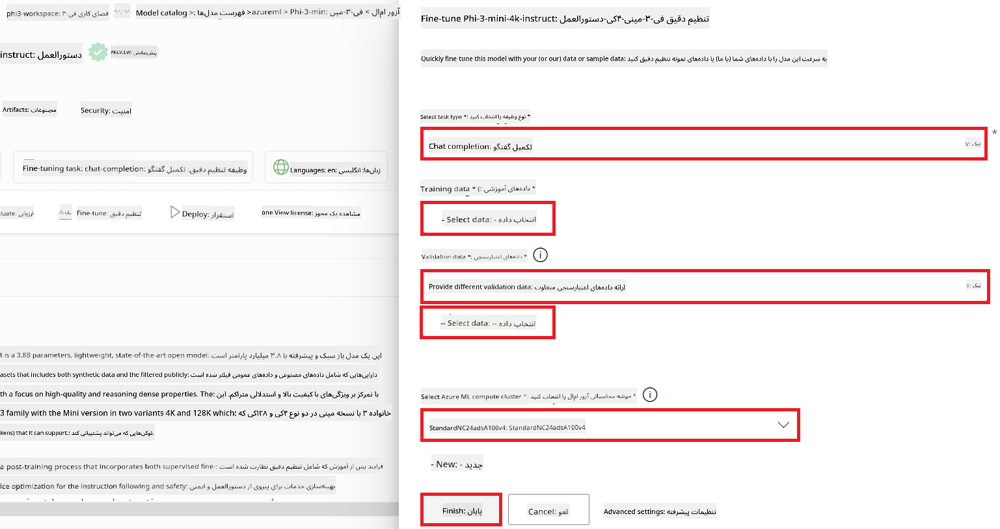

    > [!TIP]
    >
    > می‌توانید با انتخاب **Advanced settings** تنظیماتی مانند **learning_rate** و **lr_scheduler_type** را برای بهینه‌سازی فرآیند فاین‌تیونینگ بر اساس نیازهای خاص خود سفارشی کنید.

6. روی **Finish** کلیک کنید.

7. در این تمرین، شما با موفقیت مدل Phi-3 را با استفاده از Azure Machine Learning فاین‌تیون کردید. توجه داشته باشید که فرآیند فاین‌تیونینگ ممکن است زمان قابل توجهی طول بکشد. پس از اجرای کار فاین‌تیونینگ، باید منتظر بمانید تا تکمیل شود. می‌توانید وضعیت کار فاین‌تیونینگ را با مراجعه به تب Jobs در سمت چپ فضای کاری Azure Machine Learning خود مشاهده کنید. در سری بعدی، مدل فاین‌تیون شده را مستقر کرده و آن را با Prompt flow یکپارچه خواهید کرد.

    

### استقرار مدل فاین‌تیون شده Phi-3

برای یکپارچه‌سازی مدل فاین‌تیون شده Phi-3 با Prompt flow، باید مدل را مستقر کنید تا برای استنتاج در زمان واقعی قابل دسترسی باشد. این فرآیند شامل ثبت مدل، ایجاد یک نقطه انتهایی آنلاین و استقرار مدل است.

در این تمرین، شما:

- مدل فاین‌تیون شده را در فضای کاری Azure Machine Learning ثبت می‌کنید.
- یک نقطه انتهایی آنلاین ایجاد می‌کنید.
- مدل ثبت شده فاین‌تیون شده Phi-3 را مستقر می‌کنید.

#### ثبت مدل فاین‌تیون شده

1. به [Azure ML Studio](https://ml.azure.com/home?wt.mc_id=studentamb_279723) مراجعه کنید.

2. فضای کاری Azure Machine Learning که ایجاد کرده‌اید را انتخاب کنید.

    

3. از تب سمت چپ، گزینه **Models** را انتخاب کنید.

4. روی **+ Register** کلیک کنید.

5. گزینه **From a job output** را انتخاب کنید.

    

6. کاری که ایجاد کرده‌اید را انتخاب کنید.

    

7. روی **Next** کلیک کنید.

8. نوع مدل (**Model type**) را روی **MLflow** تنظیم کنید.

9. اطمینان حاصل کنید که **Job output** انتخاب شده است؛ این گزینه باید به صورت خودکار انتخاب شده باشد.

    

10. روی **Next** کلیک کنید.

11. روی **Register** کلیک کنید.

    

12. می‌توانید مدل ثبت شده خود را با مراجعه به منوی **Models** در تب سمت چپ مشاهده کنید.

    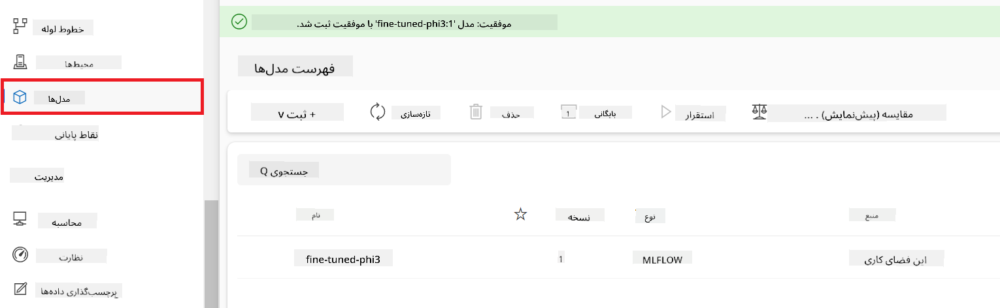

#### استقرار مدل فاین‌تیون شده

1. به فضای کاری Azure Machine Learning که ایجاد کرده‌اید بروید.

2. از تب سمت چپ، گزینه **Endpoints** را انتخاب کنید.

3. از منوی ناوبری، گزینه **Real-time endpoints** را انتخاب کنید.

    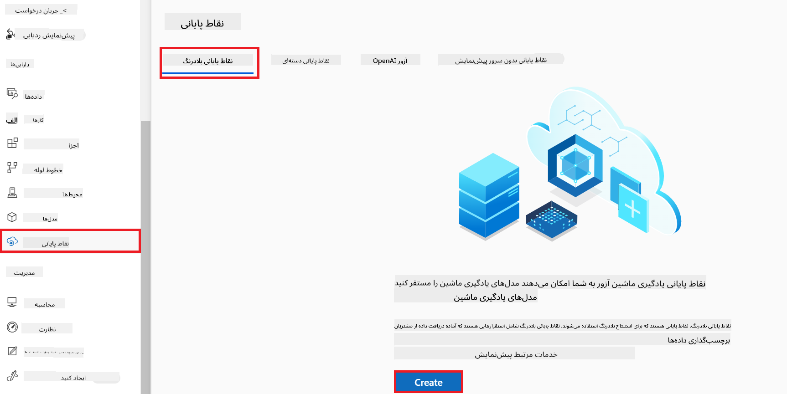

4. روی **Create** کلیک کنید.

5. مدل ثبت شده‌ای که ایجاد کرده‌اید را انتخاب کنید.

    

6. روی **Select** کلیک کنید.

7. موارد زیر را انجام دهید:

    - ماشین مجازی (**Virtual machine**) را روی *Standard_NC6s_v3* تنظیم کنید.
    - تعداد نمونه‌ها (**Instance count**) را به دلخواه انتخاب کنید، مثلاً *1*.
    - نقطه انتهایی (**Endpoint**) را روی **New** تنظیم کنید تا یک نقطه انتهایی جدید ایجاد شود.
    - نام نقطه انتهایی (**Endpoint name**) را وارد کنید. این نام باید یکتا باشد.
    - نام استقرار (**Deployment name**) را وارد کنید. این نام باید یکتا باشد.

    

8. روی **Deploy** کلیک کنید.

> [!WARNING]
> برای جلوگیری از هزینه‌های اضافی در حساب خود، حتماً نقطه انتهایی ایجاد شده را در فضای کاری Azure Machine Learning حذف کنید.
>

#### بررسی وضعیت استقرار در فضای کاری Azure Machine Learning

1. به فضای کاری Azure Machine Learning که ایجاد کرده‌اید بروید.

2. از تب سمت چپ، گزینه **Endpoints** را انتخاب کنید.

3. نقطه انتهایی که ایجاد کرده‌اید را انتخاب کنید.

    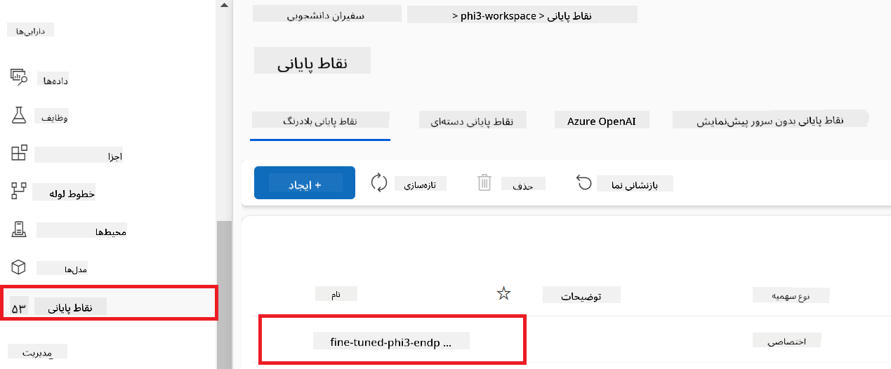

4. در این صفحه می‌توانید نقاط انتهایی را در طول فرآیند استقرار مدیریت کنید.

> [!NOTE]
> پس از اتمام استقرار، مطمئن شوید که **Live traffic** روی **100%** تنظیم شده است. اگر اینطور نیست، روی **Update traffic** کلیک کنید تا تنظیمات ترافیک را اصلاح کنید. توجه داشته باشید که اگر ترافیک روی ۰٪ باشد، نمی‌توانید مدل را تست کنید.
>
> 
>

## سناریو ۳: یکپارچه‌سازی با Prompt flow و گفتگو با مدل سفارشی خود در Azure AI Foundry

### یکپارچه‌سازی مدل سفارشی Phi-3 با Prompt flow

پس از استقرار موفق مدل فاین‌تیون شده، اکنون می‌توانید آن را با Prompt Flow یکپارچه کنید تا مدل خود را در برنامه‌های زمان واقعی استفاده کنید و انواع وظایف تعاملی را با مدل سفارشی Phi-3 خود انجام دهید.

در این تمرین، شما:

- Azure AI Foundry Hub را ایجاد می‌کنید.
- پروژه Azure AI Foundry را ایجاد می‌کنید.
- Prompt flow را ایجاد می‌کنید.
- یک اتصال سفارشی برای مدل فاین‌تیون شده Phi-3 اضافه می‌کنید.
- Prompt flow را برای گفتگو با مدل سفارشی Phi-3 خود تنظیم می‌کنید.
> [!NOTE]
> شما همچنین می‌توانید با استفاده از Azure ML Studio، با Promptflow ادغام شوید. همان روند ادغام را می‌توان در Azure ML Studio نیز به کار برد.
#### ایجاد Azure AI Foundry Hub

قبل از ایجاد پروژه، باید یک Hub بسازید. Hub مانند یک Resource Group عمل می‌کند و به شما امکان می‌دهد چندین پروژه را در Azure AI Foundry سازماندهی و مدیریت کنید.

1. به [Azure AI Foundry](https://ai.azure.com/?WT.mc_id=aiml-137032-kinfeylo) مراجعه کنید.

1. از تب سمت چپ، **All hubs** را انتخاب کنید.

1. از منوی ناوبری، **+ New hub** را انتخاب کنید.

    

1. کارهای زیر را انجام دهید:

    - نام **Hub** را وارد کنید. این نام باید منحصر به فرد باشد.
    - اشتراک Azure خود را انتخاب کنید.
    - گروه منابع (**Resource group**) مورد نظر را انتخاب کنید (در صورت نیاز یک گروه جدید بسازید).
    - موقعیت مکانی (**Location**) مورد نظر خود را انتخاب کنید.
    - سرویس‌های Azure AI که می‌خواهید متصل کنید را انتخاب کنید (در صورت نیاز یک اتصال جدید بسازید).
    - گزینه **Connect Azure AI Search** را روی **Skip connecting** تنظیم کنید.

    

1. روی **Next** کلیک کنید.

#### ایجاد پروژه Azure AI Foundry

1. در Hub که ساختید، از تب سمت چپ **All projects** را انتخاب کنید.

1. از منوی ناوبری، **+ New project** را انتخاب کنید.

    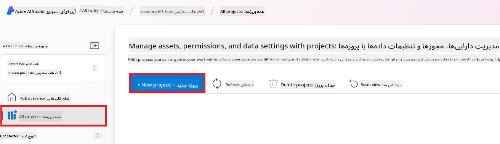

1. نام **Project** را وارد کنید. این نام باید منحصر به فرد باشد.

    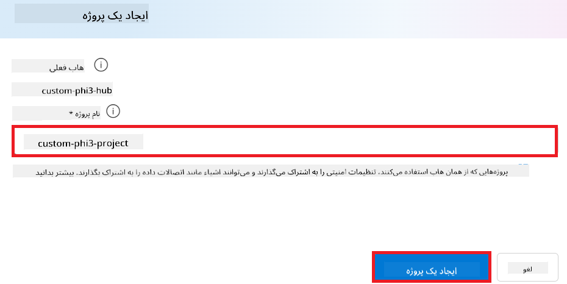

1. روی **Create a project** کلیک کنید.

#### افزودن اتصال سفارشی برای مدل Phi-3 تنظیم‌شده

برای ادغام مدل سفارشی Phi-3 خود با Prompt flow، باید نقطه انتهایی (endpoint) و کلید مدل را در یک اتصال سفارشی ذخیره کنید. این کار دسترسی به مدل سفارشی Phi-3 شما را در Prompt flow ممکن می‌سازد.

#### تنظیم کلید API و آدرس endpoint مدل Phi-3 تنظیم‌شده

1. به [Azure ML Studio](https://ml.azure.com/home?WT.mc_id=aiml-137032-kinfeylo) مراجعه کنید.

1. به فضای کاری Azure Machine learning که ایجاد کرده‌اید بروید.

1. از تب سمت چپ، **Endpoints** را انتخاب کنید.

    

1. نقطه انتهایی که ساخته‌اید را انتخاب کنید.

    

1. از منوی ناوبری، **Consume** را انتخاب کنید.

1. **REST endpoint** و **Primary key** خود را کپی کنید.

    

#### افزودن اتصال سفارشی

1. به [Azure AI Foundry](https://ai.azure.com/?WT.mc_id=aiml-137032-kinfeylo) مراجعه کنید.

1. به پروژه Azure AI Foundry که ایجاد کرده‌اید بروید.

1. در پروژه، از تب سمت چپ **Settings** را انتخاب کنید.

1. روی **+ New connection** کلیک کنید.

    

1. از منوی ناوبری، **Custom keys** را انتخاب کنید.

    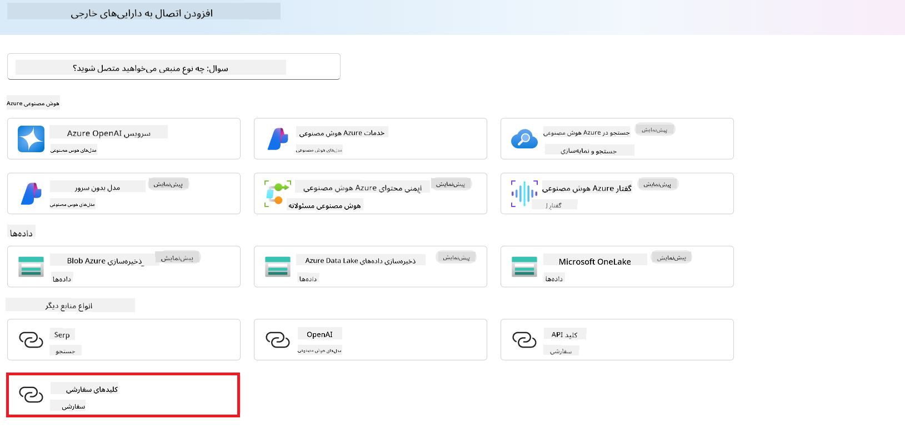

1. کارهای زیر را انجام دهید:

    - روی **+ Add key value pairs** کلیک کنید.
    - برای نام کلید، **endpoint** را وارد کنید و آدرس endpoint که از Azure ML Studio کپی کرده‌اید را در فیلد مقدار قرار دهید.
    - دوباره روی **+ Add key value pairs** کلیک کنید.
    - برای نام کلید، **key** را وارد کنید و کلیدی که از Azure ML Studio کپی کرده‌اید را در فیلد مقدار قرار دهید.
    - پس از افزودن کلیدها، گزینه **is secret** را فعال کنید تا کلیدها مخفی بمانند.

    

1. روی **Add connection** کلیک کنید.

#### ایجاد Prompt flow

شما یک اتصال سفارشی در Azure AI Foundry اضافه کرده‌اید. حالا بیایید با مراحل زیر یک Prompt flow بسازیم. سپس این Prompt flow را به اتصال سفارشی متصل می‌کنیم تا بتوانید از مدل تنظیم‌شده در Prompt flow استفاده کنید.

1. به پروژه Azure AI Foundry که ایجاد کرده‌اید بروید.

1. از تب سمت چپ، **Prompt flow** را انتخاب کنید.

1. از منوی ناوبری، **+ Create** را انتخاب کنید.

    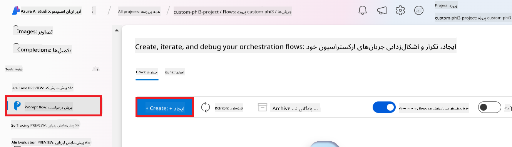

1. از منوی ناوبری، **Chat flow** را انتخاب کنید.

    

1. نام **Folder** مورد نظر را وارد کنید.

    

2. روی **Create** کلیک کنید.

#### تنظیم Prompt flow برای گفتگو با مدل سفارشی Phi-3

شما باید مدل تنظیم‌شده Phi-3 را در یک Prompt flow ادغام کنید. با این حال، Prompt flow موجود برای این منظور طراحی نشده است. بنابراین باید Prompt flow را بازطراحی کنید تا امکان ادغام مدل سفارشی فراهم شود.

1. در Prompt flow، برای بازسازی جریان موجود، کارهای زیر را انجام دهید:

    - حالت **Raw file mode** را انتخاب کنید.
    - تمام کدهای موجود در فایل *flow.dag.yml* را حذف کنید.
    - کد زیر را به فایل *flow.dag.yml* اضافه کنید.

        ```yml
        inputs:
          input_data:
            type: string
            default: "Who founded Microsoft?"

        outputs:
          answer:
            type: string
            reference: ${integrate_with_promptflow.output}

        nodes:
        - name: integrate_with_promptflow
          type: python
          source:
            type: code
            path: integrate_with_promptflow.py
          inputs:
            input_data: ${inputs.input_data}
        ```

    - روی **Save** کلیک کنید.

    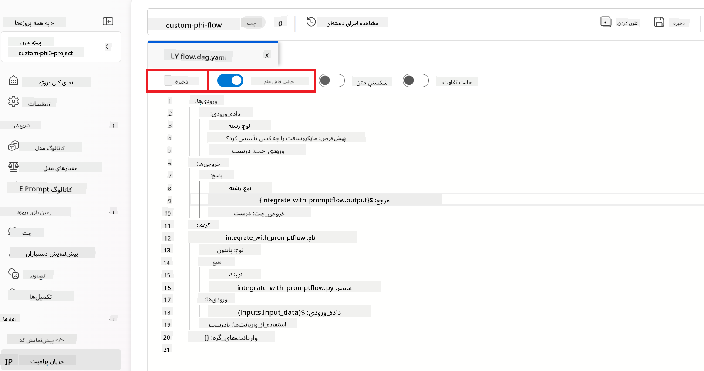

1. کد زیر را به فایل *integrate_with_promptflow.py* اضافه کنید تا از مدل سفارشی Phi-3 در Prompt flow استفاده شود.

    ```python
    import logging
    import requests
    from promptflow import tool
    from promptflow.connections import CustomConnection

    # Logging setup
    logging.basicConfig(
        format="%(asctime)s - %(levelname)s - %(name)s - %(message)s",
        datefmt="%Y-%m-%d %H:%M:%S",
        level=logging.DEBUG
    )
    logger = logging.getLogger(__name__)

    def query_phi3_model(input_data: str, connection: CustomConnection) -> str:
        """
        Send a request to the Phi-3 model endpoint with the given input data using Custom Connection.
        """

        # "connection" is the name of the Custom Connection, "endpoint", "key" are the keys in the Custom Connection
        endpoint_url = connection.endpoint
        api_key = connection.key

        headers = {
            "Content-Type": "application/json",
            "Authorization": f"Bearer {api_key}"
        }
        data = {
            "input_data": {
                "input_string": [
                    {"role": "user", "content": input_data}
                ],
                "parameters": {
                    "temperature": 0.7,
                    "max_new_tokens": 128
                }
            }
        }
        try:
            response = requests.post(endpoint_url, json=data, headers=headers)
            response.raise_for_status()
            
            # Log the full JSON response
            logger.debug(f"Full JSON response: {response.json()}")

            result = response.json()["output"]
            logger.info("Successfully received response from Azure ML Endpoint.")
            return result
        except requests.exceptions.RequestException as e:
            logger.error(f"Error querying Azure ML Endpoint: {e}")
            raise

    @tool
    def my_python_tool(input_data: str, connection: CustomConnection) -> str:
        """
        Tool function to process input data and query the Phi-3 model.
        """
        return query_phi3_model(input_data, connection)

    ```

    

> [!NOTE]
> برای اطلاعات بیشتر درباره استفاده از Prompt flow در Azure AI Foundry، می‌توانید به [Prompt flow in Azure AI Foundry](https://learn.microsoft.com/azure/ai-studio/how-to/prompt-flow) مراجعه کنید.

1. گزینه‌های **Chat input** و **Chat output** را انتخاب کنید تا امکان گفتگو با مدل فراهم شود.

    

1. حالا آماده‌اید تا با مدل سفارشی Phi-3 خود گفتگو کنید. در تمرین بعدی، یاد می‌گیرید چگونه Prompt flow را اجرا کرده و از آن برای گفتگو با مدل تنظیم‌شده استفاده کنید.

> [!NOTE]
>
> جریان بازسازی شده باید شبیه تصویر زیر باشد:
>
> 
>

### گفتگو با مدل سفارشی Phi-3

حالا که مدل سفارشی Phi-3 خود را تنظیم و با Prompt flow ادغام کرده‌اید، آماده‌اید تا با آن تعامل داشته باشید. این تمرین شما را در راه‌اندازی و شروع گفتگو با مدل از طریق Prompt flow راهنمایی می‌کند. با دنبال کردن این مراحل، می‌توانید از قابلیت‌های مدل تنظیم‌شده Phi-3 برای انجام وظایف و مکالمات مختلف به طور کامل بهره‌مند شوید.

- با مدل سفارشی Phi-3 خود از طریق Prompt flow گفتگو کنید.

#### شروع Prompt flow

1. برای شروع Prompt flow، روی **Start compute sessions** کلیک کنید.

    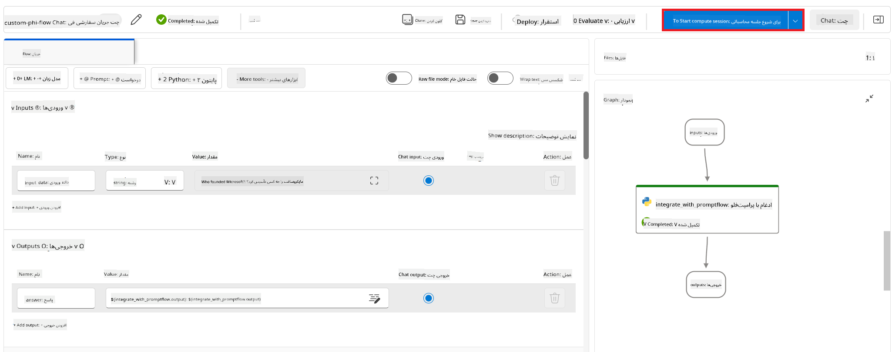

1. برای به‌روزرسانی پارامترها، روی **Validate and parse input** کلیک کنید.

    

1. مقدار **connection** را به اتصال سفارشی که ساخته‌اید انتخاب کنید. برای مثال، *connection*.

    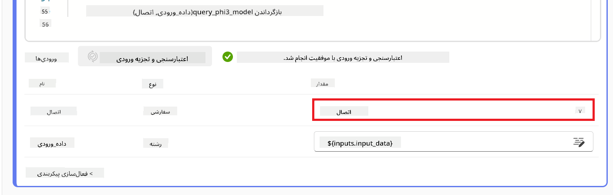

#### گفتگو با مدل سفارشی

1. روی **Chat** کلیک کنید.

    

1. در اینجا نمونه‌ای از نتایج آمده است: حالا می‌توانید با مدل سفارشی Phi-3 خود گفتگو کنید. توصیه می‌شود سوالات خود را بر اساس داده‌های استفاده شده برای تنظیم مدل مطرح کنید.

    

**سلب مسئولیت**:  
این سند با استفاده از سرویس ترجمه هوش مصنوعی [Co-op Translator](https://github.com/Azure/co-op-translator) ترجمه شده است. در حالی که ما در تلاش برای دقت هستیم، لطفاً توجه داشته باشید که ترجمه‌های خودکار ممکن است حاوی خطاها یا نادرستی‌هایی باشند. سند اصلی به زبان بومی خود باید به عنوان منبع معتبر در نظر گرفته شود. برای اطلاعات حیاتی، ترجمه حرفه‌ای انسانی توصیه می‌شود. ما مسئول هیچ گونه سوءتفاهم یا تفسیر نادرستی که از استفاده از این ترجمه ناشی شود، نیستیم.