<!--
CO_OP_TRANSLATOR_METADATA:
{
  "original_hash": "0df910a227098303cc392b6ad204c271",
  "translation_date": "2026-01-06T04:12:14+00:00",
  "source_file": "md/02.Application/01.TextAndChat/Phi3/E2E_Phi-3-FineTuning_PromptFlow_Integration_AIFoundry.md",
  "language_code": "fa"
}
-->
# ریزتنظیم و ادغام مدل‌های سفارشی Phi-3 با Prompt flow در Azure AI Foundry

این نمونه جامع (E2E) بر اساس راهنمای "[ریزتنظیم و ادغام مدل‌های سفارشی Phi-3 با Prompt Flow در Azure AI Foundry](https://techcommunity.microsoft.com/t5/educator-developer-blog/fine-tune-and-integrate-custom-phi-3-models-with-prompt-flow-in/ba-p/4191726?WT.mc_id=aiml-137032-kinfeylo)" از جامعه فنی مایکروسافت تهیه شده است. این راهنما فرآیندهای ریزتنظیم، استقرار و ادغام مدل‌های سفارشی Phi-3 با Prompt flow در Azure AI Foundry را معرفی می‌کند. بر خلاف نمونه E2E "[ریزتنظیم و ادغام مدل‌های سفارشی Phi-3 با Prompt Flow](./E2E_Phi-3-FineTuning_PromptFlow_Integration.md)" که شامل اجرای کد به صورت محلی بود، این آموزش به طور کامل بر ریزتنظیم و ادغام مدل شما در داخل Azure AI / ML Studio تمرکز دارد.

## مرور کلی

در این نمونه E2E، شما نحوه ریزتنظیم مدل Phi-3 و ادغام آن با Prompt flow در Azure AI Foundry را خواهید آموخت. با بهره‌گیری از Azure AI / ML Studio، شما یک جریان کاری برای استقرار و استفاده از مدل‌های سفارشی هوش مصنوعی ایجاد خواهید کرد. این نمونه E2E به سه سناریو تقسیم شده است:

**سناریو ۱: راه‌اندازی منابع Azure و آماده‌سازی برای ریزتنظیم**

**سناریو ۲: ریزتنظیم مدل Phi-3 و استقرار در Azure Machine Learning Studio**

**سناریو ۳: ادغام با Prompt flow و گفتگو با مدل سفارشی خود در Azure AI Foundry**

در ادامه یک مرور کلی از این نمونه E2E ارائه شده است.

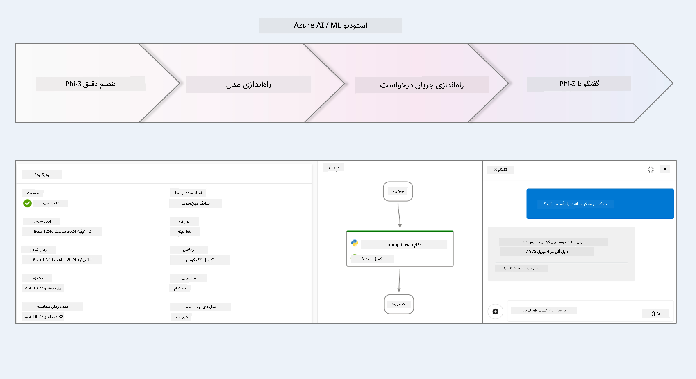

### فهرست مطالب

1. **[سناریو ۱: راه‌اندازی منابع Azure و آماده‌سازی برای ریزتنظیم](../../../../../../md/02.Application/01.TextAndChat/Phi3)**
    - [ایجاد یک Workspace در Azure Machine Learning](../../../../../../md/02.Application/01.TextAndChat/Phi3)
    - [درخواست سهمیه GPU در اشتراک Azure](../../../../../../md/02.Application/01.TextAndChat/Phi3)
    - [افزودن انتصاب نقش](../../../../../../md/02.Application/01.TextAndChat/Phi3)
    - [راه‌اندازی پروژه](../../../../../../md/02.Application/01.TextAndChat/Phi3)
    - [آماده‌سازی داده‌ها برای ریزتنظیم](../../../../../../md/02.Application/01.TextAndChat/Phi3)

1. **[سناریو ۲: ریزتنظیم مدل Phi-3 و استقرار در Azure Machine Learning Studio](../../../../../../md/02.Application/01.TextAndChat/Phi3)**
    - [ریزتنظیم مدل Phi-3](../../../../../../md/02.Application/01.TextAndChat/Phi3)
    - [استقرار مدل ریزتنظیم‌شده Phi-3](../../../../../../md/02.Application/01.TextAndChat/Phi3)

1. **[سناریو ۳: ادغام با Prompt flow و گفتگو با مدل سفارشی خود در Azure AI Foundry](../../../../../../md/02.Application/01.TextAndChat/Phi3)**
    - [ادغام مدل سفارشی Phi-3 با Prompt flow](../../../../../../md/02.Application/01.TextAndChat/Phi3)
    - [گفتگو با مدل سفارشی Phi-3 خود](../../../../../../md/02.Application/01.TextAndChat/Phi3)

## سناریو ۱: راه‌اندازی منابع Azure و آماده‌سازی برای ریزتنظیم

### ایجاد یک Workspace در Azure Machine Learning

1. در قسمت **نوار جستجو** در بالای صفحه پورتال، عبارت *azure machine learning* را تایپ کنید و از گزینه‌های نمایش داده شده، **Azure Machine Learning** را انتخاب کنید.

    

2. از منوی ناوبری گزینه **+ ایجاد** را انتخاب کنید.

3. از منوی ناوبری، **Workspace جدید** را انتخاب کنید.

    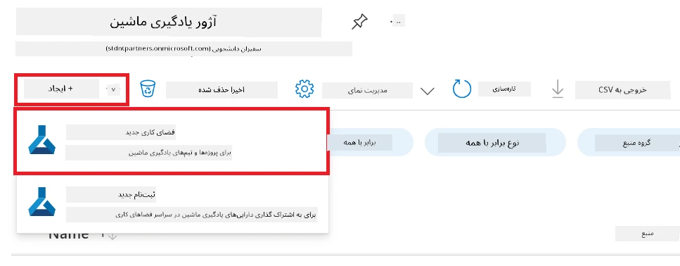

4. موارد زیر را انجام دهید:

    - اشتراک Azure خود را انتخاب کنید.
    - گروه منابع مورد نظر (Resource group) را انتخاب یا در صورت نیاز یک مورد جدید ایجاد کنید.
    - نام Workspace را وارد کنید. این مقدار باید یکتا باشد.
    - منطقه (Region) مورد نظر خود را انتخاب کنید.
    - حساب ذخیره‌سازی (Storage account) مورد نظر را انتخاب یا در صورت نیاز جدید بسازید.
    - کلید مخزن (Key vault) مورد نظر را انتخاب یا جدید بسازید.
    - Application insights مورد استفاده را انتخاب یا جدید بسازید.
    - رجیستری کانتینر (Container registry) مورد استفاده را انتخاب یا جدید بسازید.

    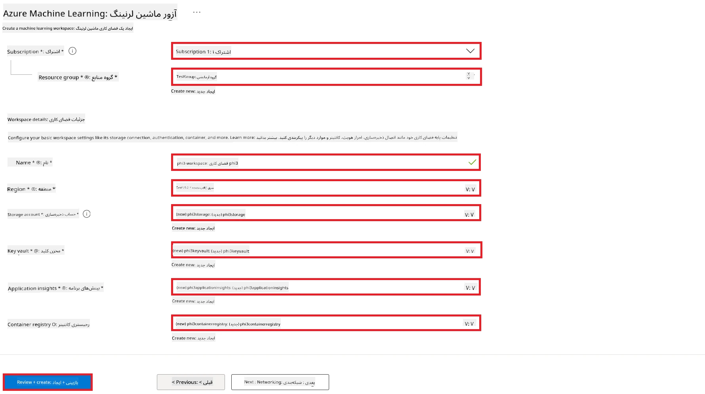

5. گزینه **بررسی + ایجاد** را انتخاب کنید.

6. سپس **ایجاد** را انتخاب کنید.

### درخواست سهمیه GPU در اشتراک Azure

در این آموزش، شما نحوه ریزتنظیم و استقرار مدل Phi-3 را با استفاده از GPU خواهید آموخت. برای ریزتنظیم، از GPU نوع *Standard_NC24ads_A100_v4* استفاده خواهید کرد که نیاز به درخواست سهمیه دارد. برای استقرار، از GPU نوع *Standard_NC6s_v3* استفاده خواهید کرد که آن نیز نیاز به درخواست سهمیه دارد.

> [!NOTE]
>
> فقط اشتراک‌های Pay-As-You-Go (نوع اشتراک استاندارد) برای تخصیص GPU واجد شرایط هستند؛ اشتراک‌های بهره‌مند فعلاً پشتیبانی نمی‌شوند.
>

1. به [Azure ML Studio](https://ml.azure.com/home?wt.mc_id=studentamb_279723) مراجعه کنید.

1. برای درخواست سهمیه *Standard NCADSA100v4 Family* اقدامات زیر را انجام دهید:

    - از برگه سمت چپ، گزینه **Quota** را انتخاب کنید.
    - خانواده ماشین مجازی (Virtual machine family) مورد نظر را انتخاب کنید. به عنوان مثال، گزینه **Standard NCADSA100v4 Family Cluster Dedicated vCPUs** را انتخاب کنید که شامل GPU *Standard_NC24ads_A100_v4* است.
    - از منوی ناوبری، **Request quota** را انتخاب کنید.

        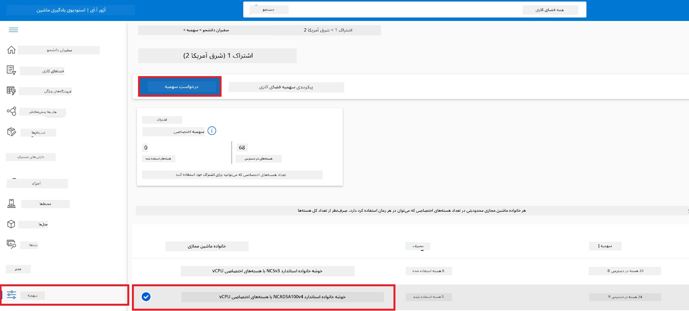

    - در صفحه درخواست سهمیه، **حداکثر هسته‌های جدید** مورد نظر خود را وارد کنید. به عنوان مثال، 24.
    - در همان صفحه، گزینه **ارسال** (Submit) را انتخاب کنید تا سهمیه GPU درخواست شود.

1. برای درخواست سهمیه *Standard NCSv3 Family* اقدامات زیر را انجام دهید:

    - گزینه **Quota** را از برگه سمت چپ انتخاب کنید.
    - خانواده ماشین مجازی مورد نظر را انتخاب کنید. مثلاً **Standard NCSv3 Family Cluster Dedicated vCPUs** که شامل GPU *Standard_NC6s_v3* است.
    - گزینه **Request quota** را از منوی ناوبری انتخاب کنید.
    - در صفحه درخواست سهمیه، **حداکثر هسته‌های جدید** مورد نظر را وارد کنید؛ مثلاً 24.
    - گزینه **ارسال** را بزنید تا درخواست سهمیه GPU ارسال شود.

### افزودن انتصاب نقش

برای ریزتنظیم و استقرار مدل‌ها باید ابتدا یک Managed Identity اختصاص‌داده شده به کاربر (User Assigned Managed Identity - UAI) ایجاد کرده و دسترسی‌های لازم را به آن بدهید. این UAI در هنگام استقرار برای احراز هویت مورد استفاده قرار می‌گیرد.

#### ایجاد User Assigned Managed Identity (UAI)

1. در نوار جستجو در بالای صفحه پورتال، عبارت *managed identities* را تایپ کنید و از گزینه‌های نمایش داده شده، **Managed Identities** را انتخاب کنید.

    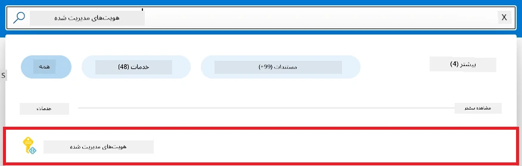

2. گزینه **+ ایجاد** را انتخاب کنید.

    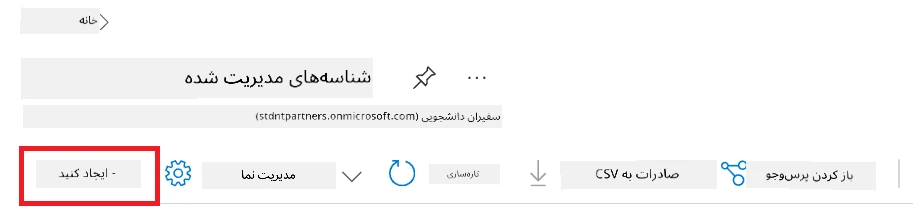

3. موارد زیر را انجام دهید:

    - اشتراک Azure خود را انتخاب کنید.
    - گروه منابع مورد استفاده را انتخاب یا جدید بسازید.
    - منطقه (Region) مورد نظر را انتخاب کنید.
    - نام (Name) را وارد کنید که باید یک مقدار یکتا باشد.

    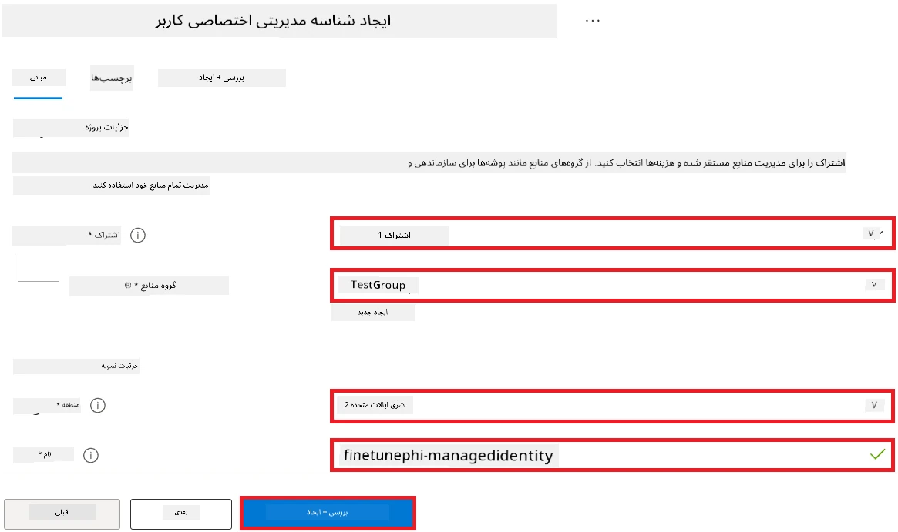

4. گزینه **بررسی + ایجاد** را انتخاب کنید.

5. سپس گزینه **+ ایجاد** را انتخاب کنید.

#### افزودن نقش Contributor به Managed Identity

1. به منبع Managed Identity که ایجاد کرده‌اید بروید.

2. از تب سمت چپ، گزینه **Azure role assignments** را انتخاب کنید.

3. از منوی ناوبری، **+ افزودن انتصاب نقش** را انتخاب کنید.

4. در صفحه افزودن انتصاب نقش، موارد زیر را انجام دهید:

    - محدوده (Scope) را روی **Resource group** تنظیم کنید.
    - اشتراک Azure خود را انتخاب کنید.
    - گروه منابع مورد استفاده را انتخاب کنید.
    - نقش (Role) را روی **Contributor** قرار دهید.

    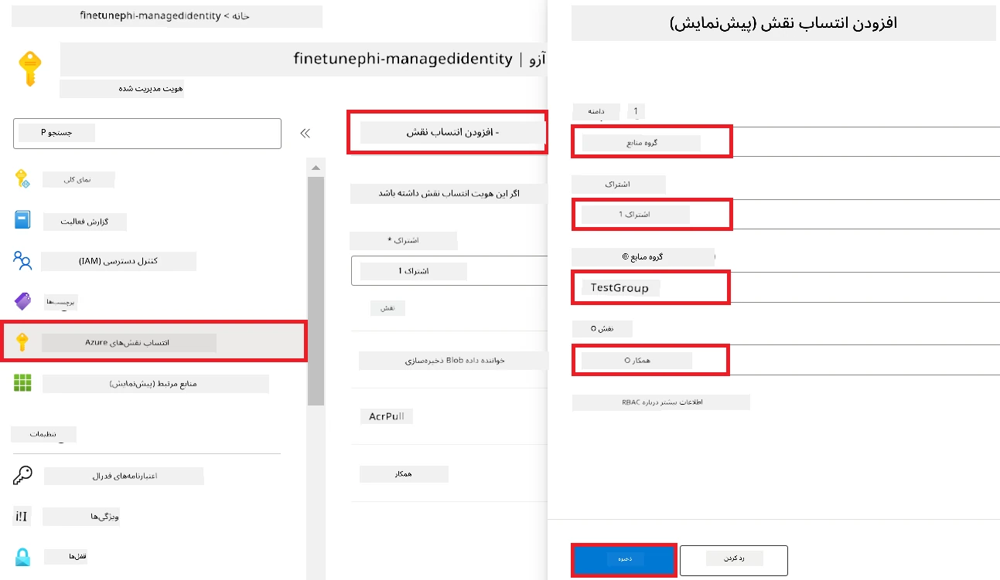

2. گزینه **ذخیره** را انتخاب کنید.

#### افزودن نقش Storage Blob Data Reader به Managed Identity

1. در نوار جستجو در بالای صفحه پورتال، عبارت *storage accounts* را تایپ کنید و از گزینه‌های نمایش داده شده، **Storage accounts** را انتخاب کنید.

    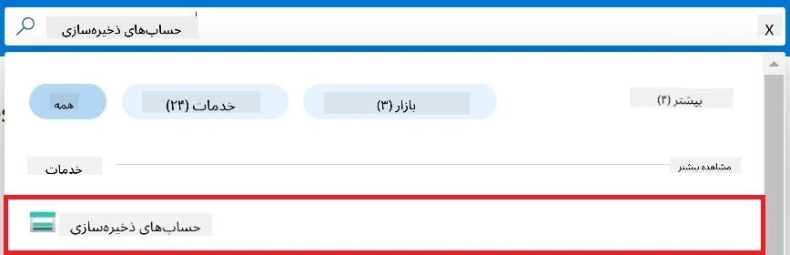

2. حساب ذخیره‌سازی مرتبط با Workspace Azure Machine Learning که ساخته‌اید را انتخاب کنید. مثلاً *finetunephistorage*.

3. برای رفتن به صفحه افزودن انتصاب نقش، موارد زیر را انجام دهید:

    - به حساب ذخیره‌سازی Azure که ایجاد کرده‌اید بروید.
    - از تب سمت چپ، گزینه **Access Control (IAM)** را انتخاب کنید.
    - از منوی ناوبری، **+ افزودن** را انتخاب کنید.
    - از منوی ناوبری، **افزودن انتصاب نقش** را انتخاب کنید.

    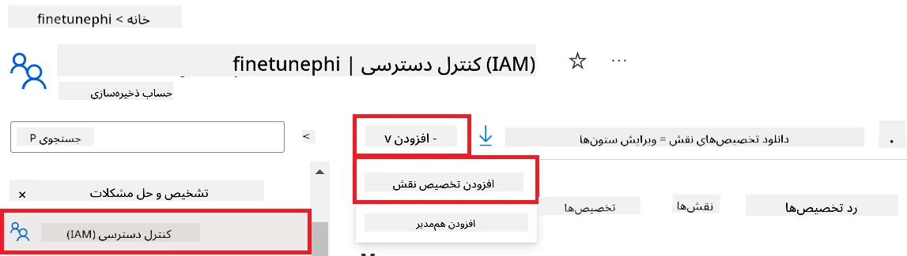

4. در صفحه افزودن انتصاب نقش، موارد زیر را انجام دهید:

    - در صفحه نقش، عبارت *Storage Blob Data Reader* را در نوار جستجو وارد کنید و از گزینه‌های نمایش داده شده، **Storage Blob Data Reader** را انتخاب کنید.
    - در صفحه نقش، **بعدی** (Next) را انتخاب کنید.
    - در صفحه اعضا، گزینه **اختصاص دسترسی به** را روی **Managed identity** تنظیم کنید.
    - در صفحه اعضا، گزینه **+ Select members** را انتخاب کنید.
    - در صفحه انتخاب Managed Identities، اشتراک Azure خود را انتخاب کنید.
    - Managed identity را روی **Manage Identity** تنظیم کنید.
    - Managed Identity که ساخته‌اید را انتخاب کنید. به عنوان مثال، *finetunephi-managedidentity*.
    - گزینه **انتخاب** (Select) را بزنید.

    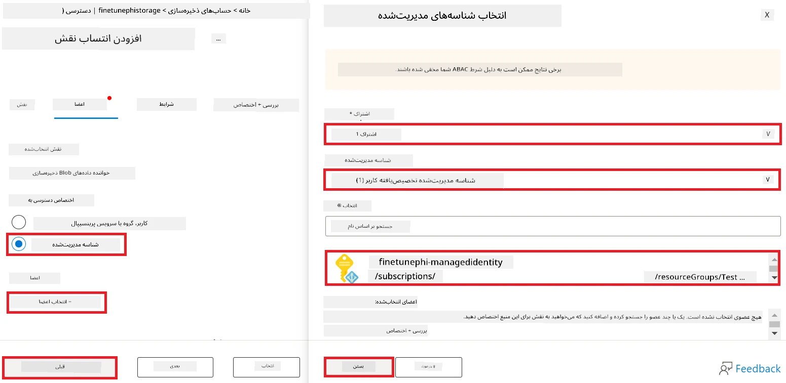

5. گزینه **بررسی + اختصاص** (Review + assign) را انتخاب کنید.

#### افزودن نقش AcrPull به Managed Identity

1. در نوار جستجو در بالای صفحه پورتال، عبارت *container registries* را تایپ کنید و از گزینه‌ها، **Container registries** را انتخاب کنید.

    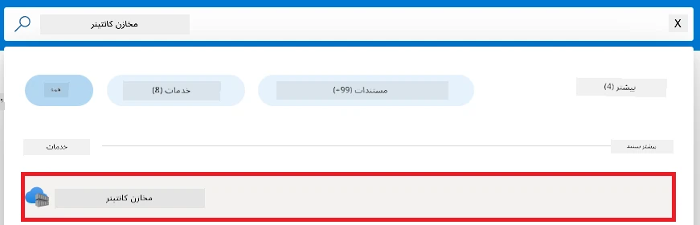

2. رجیستری کانتینری که مرتبط با Azure Machine Learning workspace است را انتخاب کنید. مثلاً *finetunephicontainerregistry*

3. برای رفتن به صفحه افزودن انتصاب نقش، موارد زیر را اجرا کنید:

    - از تب سمت چپ، **Access Control (IAM)** را انتخاب کنید.
    - از منوی ناوبری، **+ افزودن** را انتخاب کنید.
    - از منوی ناوبری، **افزودن انتصاب نقش** را انتخاب کنید.

4. در صفحه افزودن انتصاب نقش، کارهای زیر را انجام دهید:

    - در صفحه نقش، عبارت *AcrPull* را در نوار جستجو وارد کرده و از گزینه‌ها، **AcrPull** را انتخاب کنید.
    - در صفحه نقش، **بعدی** (Next) را بزنید.
    - در صفحه اعضا، **اختصاص دسترسی به** را روی **Managed identity** تنظیم کنید.
    - در صفحه اعضا، گزینه **+ Select members** را انتخاب کنید.
    - اشتراک Azure خود را انتخاب کنید.
    - Managed identity را روی **Manage Identity** تنظیم کنید.
    - Managed Identity که ایجاد کرده‌اید را انتخاب کنید؛ مثلاً *finetunephi-managedidentity*.
    - گزینه **انتخاب** را بزنید.
    - گزینه **بررسی + اختصاص** را انتخاب کنید.

### راه‌اندازی پروژه

برای دانلود مجموعه داده‌های لازم برای ریزتنظیم، باید یک محیط محلی راه‌اندازی کنید.

در این تمرین شما:

- فولدری برای کار کردن ایجاد خواهید کرد.
- یک محیط مجازی می‌سازید.
- بسته‌های مورد نیاز را نصب می‌کنید.
- یک فایل *download_dataset.py* برای دانلود مجموعه داده‌ها ایجاد می‌کنید.

#### ایجاد فولدری برای کار کردن داخل آن

1. یک پنجره ترمینال باز کنید و دستور زیر را برای ایجاد فولدری با نام *finetune-phi* در مسیر پیش‌فرض وارد کنید.

    ```console
    mkdir finetune-phi
    ```

2. دستور زیر را داخل ترمینال خود تایپ کنید تا به پوشه *finetune-phi* که ساخته‌اید، بروید.

    ```console
    cd finetune-phi
    ```

#### ایجاد یک محیط مجازی

1. دستور زیر را داخل ترمینال خود تایپ کنید تا یک محیط مجازی به نام *.venv* ایجاد کنید.

    ```console
    python -m venv .venv
    ```

2. دستور زیر را داخل ترمینال خود تایپ کنید تا محیط مجازی را فعال کنید.

    ```console
    .venv\Scripts\activate.bat
    ```

> [!NOTE]
> اگر موفق بود، باید *(.venv)* را قبل از نشانگر دستور ببینید.

#### نصب پکیج‌های مورد نیاز

1. دستورهای زیر را داخل ترمینال خود تایپ کنید تا پکیج‌های مورد نیاز نصب شوند.

    ```console
    pip install datasets==2.19.1
    ```

#### ایجاد فایل `donload_dataset.py`

> [!NOTE]
> ساختار کامل پوشه:
>
> ```text
> └── YourUserName
> .    └── finetune-phi
> .        └── download_dataset.py
> ```

1. **Visual Studio Code** را باز کنید.

1. از نوار منو گزینه **File** را انتخاب کنید.

1. گزینه **Open Folder** را انتخاب کنید.

1. پوشه *finetune-phi* که ساخته‌اید و در مسیر *C:\Users\yourUserName\finetune-phi* قرار دارد را انتخاب کنید.

    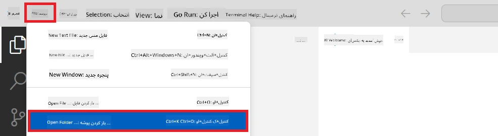

1. در پنل سمت چپ Visual Studio Code روی فضای خالی کلیک راست کرده و **New File** را انتخاب کنید تا یک فایل جدید به نام *download_dataset.py* ایجاد کنید.

    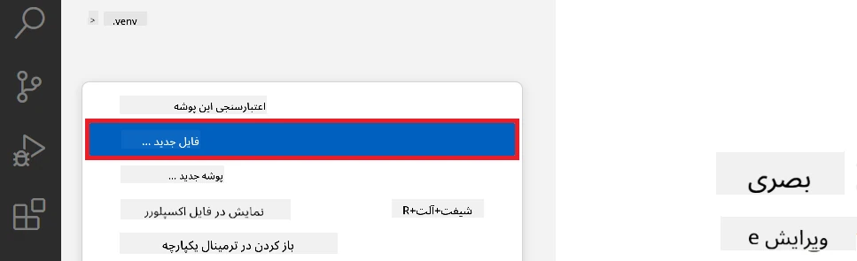

### آماده‌سازی داده‌ها برای فاین‌تیونینگ

در این تمرین، فایل *download_dataset.py* را اجرا می‌کنید تا دیتاست *ultrachat_200k* را به محیط محلی خود دانلود کنید. سپس از این دیتاست‌ها برای فاین‌تیون مدل Phi-3 در Azure Machine Learning استفاده خواهید کرد.

در این تمرین، شما:

- کدی به فایل *download_dataset.py* اضافه می‌کنید تا دیتاست‌ها را دانلود کند.
- فایل *download_dataset.py* را اجرا می‌کنید تا دیتاست‌ها را به محیط محلی خود دانلود کنید.

#### دانلود دیتاست خود با استفاده از *download_dataset.py*

1. فایل *download_dataset.py* را در Visual Studio Code باز کنید.

1. کد زیر را در فایل *download_dataset.py* اضافه کنید.

    ```python
    import json
    import os
    from datasets import load_dataset

    def load_and_split_dataset(dataset_name, config_name, split_ratio):
        """
        Load and split a dataset.
        """
        # بارگذاری مجموعه داده با نام مشخص شده، پیکربندی و نسبت تقسیم
        dataset = load_dataset(dataset_name, config_name, split=split_ratio)
        print(f"Original dataset size: {len(dataset)}")
        
        # تقسیم مجموعه داده به مجموعه‌های آموزش و آزمایش (۸۰٪ آموزش، ۲۰٪ آزمایش)
        split_dataset = dataset.train_test_split(test_size=0.2)
        print(f"Train dataset size: {len(split_dataset['train'])}")
        print(f"Test dataset size: {len(split_dataset['test'])}")
        
        return split_dataset

    def save_dataset_to_jsonl(dataset, filepath):
        """
        Save a dataset to a JSONL file.
        """
        # ایجاد پوشه در صورت عدم وجود
        os.makedirs(os.path.dirname(filepath), exist_ok=True)
        
        # باز کردن فایل در حالت نوشتن
        with open(filepath, 'w', encoding='utf-8') as f:
            # پیمایش در هر رکورد از مجموعه داده
            for record in dataset:
                # ذخیره رکورد به صورت شیء JSON و نوشتن آن در فایل
                json.dump(record, f)
                # نوشتن کاراکتر خط جدید برای جدا کردن رکوردها
                f.write('\n')
        
        print(f"Dataset saved to {filepath}")

    def main():
        """
        Main function to load, split, and save the dataset.
        """
        # بارگذاری و تقسیم مجموعه داده ULTRACHAT_200k با پیکربندی و نسبت تقسیم مشخص
        dataset = load_and_split_dataset("HuggingFaceH4/ultrachat_200k", 'default', 'train_sft[:1%]')
        
        # استخراج مجموعه داده‌های آموزش و آزمایش از تقسیم‌بندی
        train_dataset = dataset['train']
        test_dataset = dataset['test']

        # ذخیره مجموعه داده آموزش در یک فایل JSONL
        save_dataset_to_jsonl(train_dataset, "data/train_data.jsonl")
        
        # ذخیره مجموعه داده آزمایش در یک فایل JSONL جداگانه
        save_dataset_to_jsonl(test_dataset, "data/test_data.jsonl")

    if __name__ == "__main__":
        main()

    ```

1. دستور زیر را در ترمینال خود تایپ کنید تا اسکریپت اجرا شده و دیتاست به محیط محلی شما دانلود شود.

    ```console
    python download_dataset.py
    ```

1. مطمئن شوید که دیتاست‌ها به درستی در پوشه محلی *finetune-phi/data* ذخیره شده‌اند.

> [!NOTE]
>
> #### نکته‌ای درباره اندازه دیتاست و زمان فاین‌تیونینگ
>
> در این آموزش، تنها 1٪ از دیتاست (`split='train[:1%]'`) استفاده شده است. این کار حجم داده‌ها را به طور قابل توجهی کاهش می‌دهد و فرآیند آپلود و فاین‌تیونینگ را تسریع می‌کند. شما می‌توانید درصد را تنظیم کنید تا تعادل مناسبی بین زمان آموزش و عملکرد مدل پیدا کنید. استفاده از زیرمجموعه کوچکتر دیتاست زمان لازم برای فاین‌تیونینگ را کاهش داده و این فرآیند را برای آموزش راحت‌تر می‌کند.

## سناریو ۲: فاین‌تیون مدل Phi-3 و استقرار در Azure Machine Learning Studio

### فاین‌تیون مدل Phi-3

در این تمرین، مدل Phi-3 را در Azure Machine Learning Studio فاین‌تیون خواهید کرد.

در این تمرین، شما:

- کلاستر محاسباتی برای فاین‌تیون ایجاد می‌کنید.
- مدل Phi-3 را در Azure Machine Learning Studio فاین‌تیون می‌کنید.

#### ایجاد کلاستر محاسباتی برای فاین‌تیون

1. به [Azure ML Studio](https://ml.azure.com/home?wt.mc_id=studentamb_279723) مراجعه کنید.

1. از تب سمت چپ، گزینه **Compute** را انتخاب کنید.

1. از منوی ناوبری، **Compute clusters** را انتخاب کنید.

1. روی **+ New** کلیک کنید.

    

1. موارد زیر را انجام دهید:

    - منطقه‌ای (**Region**) که می‌خواهید استفاده کنید را انتخاب کنید.
    - نوع ماشین مجازی (Virtual machine tier) را روی **Dedicated** تنظیم کنید.
    - نوع ماشین مجازی را روی **GPU** قرار دهید.
    - فیلتر اندازه ماشین مجازی را روی **Select from all options** بگذارید.
    - اندازه ماشین مجازی را روی **Standard_NC24ads_A100_v4** تنظیم کنید.

    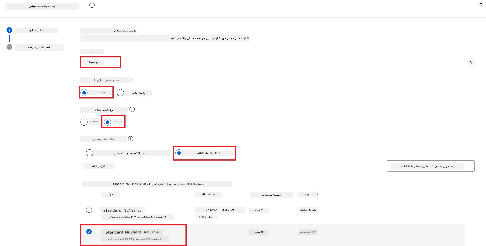

1. روی **Next** کلیک کنید.

1. موارد زیر را انجام دهید:

    - نام کامپیوتر را وارد کنید. این مقدار باید یکتا باشد.
    - حداقل تعداد گره‌ها (Minimum number of nodes) را روی **0** قرار دهید.
    - حداکثر تعداد گره‌ها (Maximum number of nodes) را روی **1** قرار دهید.
    - زمان بیکاری قبل از کاهش مقیاس (Idle seconds before scale down) را روی **120** تنظیم کنید.

    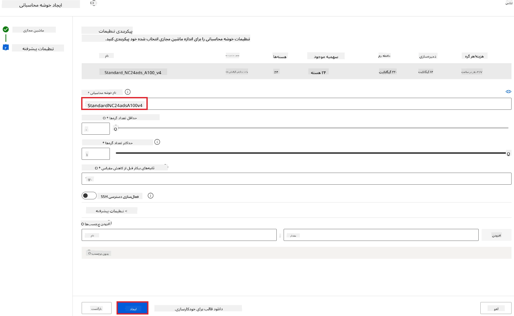

1. روی **Create** کلیک کنید.

#### فاین‌تیون مدل Phi-3

1. به [Azure ML Studio](https://ml.azure.com/home?wt.mc_id=studentamb_279723) مراجعه کنید.

1. فضای کاری Azure Machine Learning که ساخته‌اید را انتخاب کنید.

    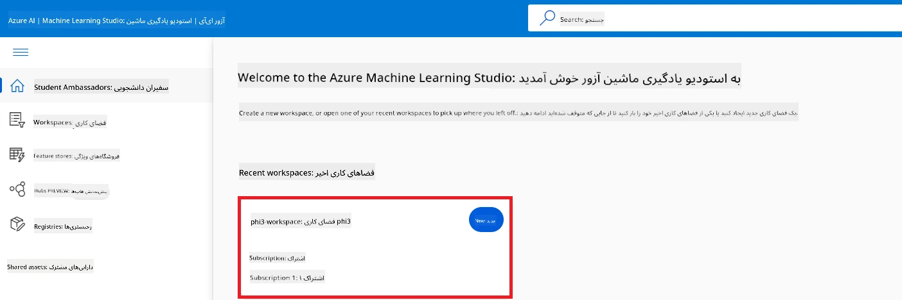

1. موارد زیر را انجام دهید:

    - از تب سمت چپ، **Model catalog** را انتخاب کنید.
    - در نوار جستجو، *phi-3-mini-4k* را تایپ کنید و گزینه **Phi-3-mini-4k-instruct** را از گزینه‌های ظاهر شده انتخاب کنید.

    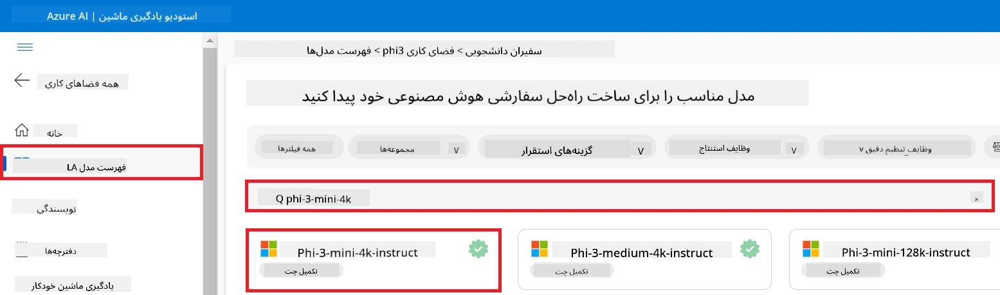

1. از منوی ناوبری، **Fine-tune** را انتخاب کنید.

    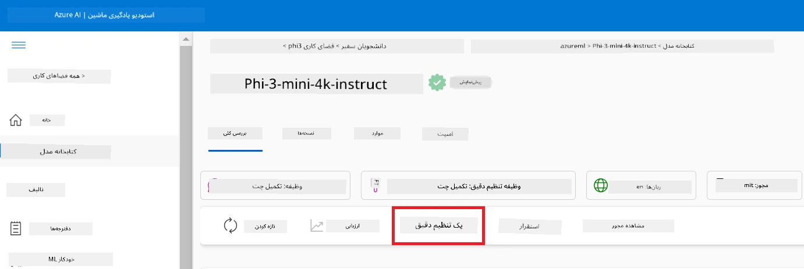

1. موارد زیر را انجام دهید:

    - نوع کار (Select task type) را روی **Chat completion** تنظیم کنید.
    - برای آپلود داده‌های آموزش، **+ Select data** را انتخاب کنید.
    - نوع آپلود داده‌های اعتبارسنجی (Validation data) را روی **Provide different validation data** بگذارید.
    - برای آپلود داده‌های اعتبارسنجی، **+ Select data** را انتخاب کنید.

    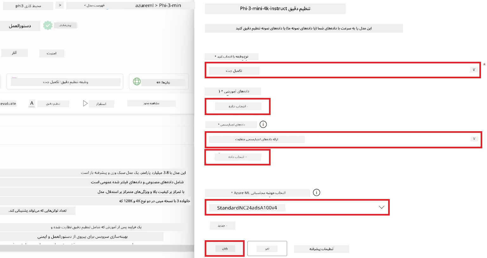

> [!TIP]
>
> می‌توانید با انتخاب **Advanced settings** تنظیمات مثل **learning_rate** و **lr_scheduler_type** را برای بهینه‌سازی فرایند فاین‌تیونینگ طبق نیاز خود سفارشی کنید.

1. روی **Finish** کلیک کنید.

1. در این تمرین، شما موفق شدید مدل Phi-3 را با استفاده از Azure Machine Learning فاین‌تیون کنید. توجه داشته باشید که فرایند فاین‌تیونینگ ممکن است زمان قابل توجهی طول بکشد. پس از اجرای کار فاین‌تیونینگ باید منتظر بمانید تا کامل شود. می‌توانید وضعیت کار فاین‌تیونینگ را با رفتن به تب Jobs در سمت چپ فضای کاری Azure Machine Learning خود مشاهده کنید. در سری بعدی، مدل فاین‌تیون شده را مستقر و با Prompt flow ادغام خواهید کرد.

    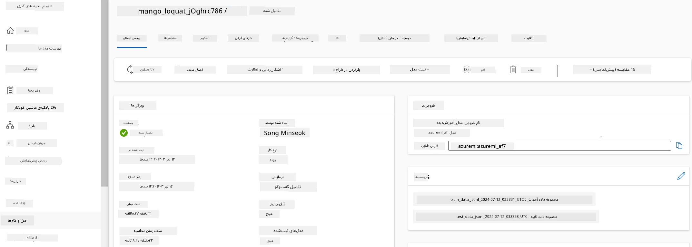

### استقرار مدل Phi-3 فاین‌تیون شده

برای ادغام مدل Phi-3 فاین‌تیون شده با Prompt flow، باید مدل را استقرار دهید تا برای استنتاج بلادرنگ (real-time inference) قابل دسترسی باشد. این فرایند شامل ثبت مدل، ایجاد یک نقطه پایان آنلاین و استقرار مدل است.

در این تمرین، شما:

- مدل فاین‌تیون شده را در فضای کاری Azure Machine Learning ثبت می‌کنید.
- نقطه پایان آنلاین ایجاد می‌کنید.
- مدل Phi-3 فاین‌تیون شده ثبت شده را استقرار می‌دهید.

#### ثبت مدل فاین‌تیون شده

1. به [Azure ML Studio](https://ml.azure.com/home?wt.mc_id=studentamb_279723) مراجعه کنید.

1. فضای کاری Azure Machine Learning که ساخته‌اید را انتخاب کنید.

    

1. از تب سمت چپ، گزینه **Models** را انتخاب کنید.
1. روی **+ Register** کلیک کنید.
1. گزینه **From a job output** را انتخاب کنید.

    

1. کاری که ساخته‌اید را انتخاب کنید.

    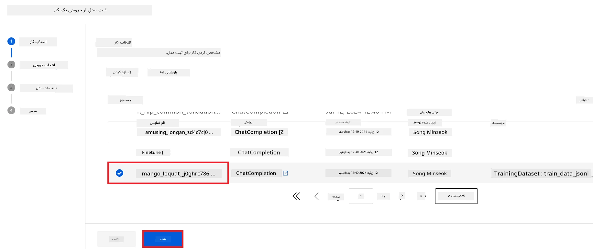

1. روی **Next** کلیک کنید.

1. نوع مدل (Model type) را روی **MLflow** بگذارید.

1. مطمئن شوید که **Job output** انتخاب شده است؛ این گزینه به صورت خودکار انتخاب خواهد شد.

    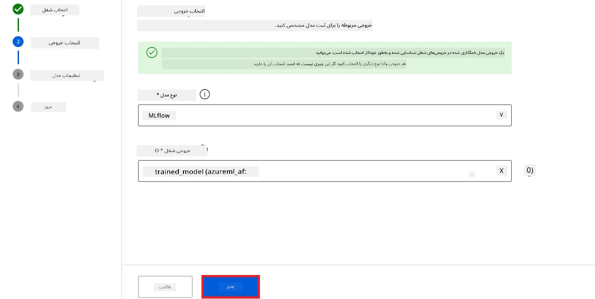

2. روی **Next** کلیک کنید.

3. روی **Register** کلیک کنید.

    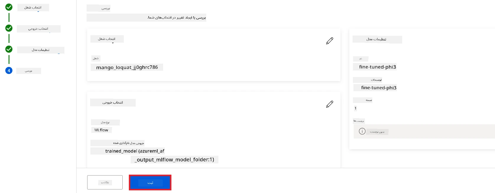

4. می‌توانید مدل ثبت شده خود را با رفتن به منوی **Models** از تب سمت چپ مشاهده کنید.

    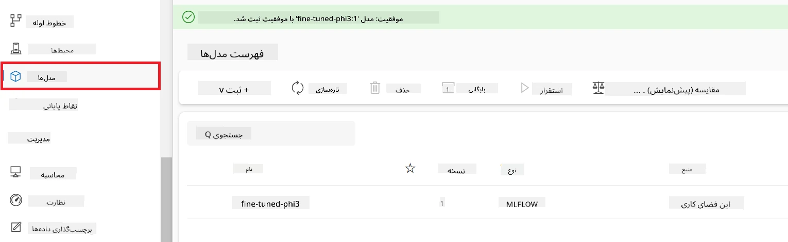

#### استقرار مدل فاین‌تیون شده

1. به فضای کاری Azure Machine Learning که ساخته‌اید بروید.

1. از تب سمت چپ، گزینه **Endpoints** را انتخاب کنید.

1. از منوی ناوبری، **Real-time endpoints** را انتخاب کنید.

    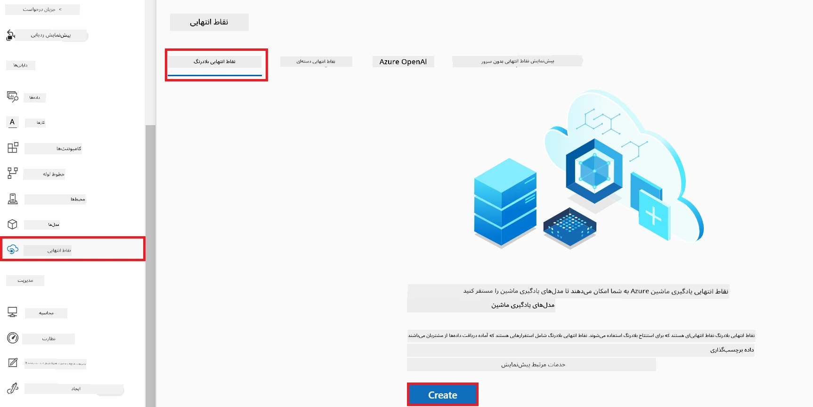

1. روی **Create** کلیک کنید.

1. مدل ثبت شده‌ای که ایجاد کرده‌اید را انتخاب کنید.

    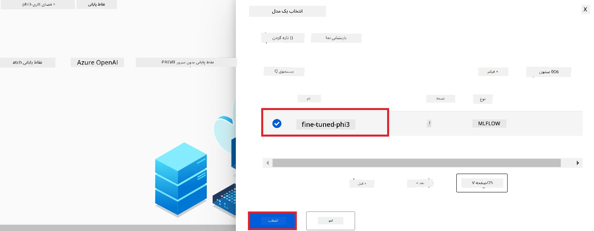

1. روی **Select** کلیک کنید.

1. موارد زیر را تنظیم کنید:

    - گزینه **Virtual machine** را روی *Standard_NC6s_v3* تنظیم کنید.
    - تعداد نمونه‌ای (Instance count) که می‌خواهید استفاده کنید را انتخاب کنید. به عنوان مثال، *1*.
    - گزینه **Endpoint** را روی **New** بگذارید تا یک نقطه پایان جدید ایجاد شود.
    - نام نقطه پایان (**Endpoint name**) را وارد کنید. این مقدار باید یکتا باشد.
    - نام استقرار (**Deployment name**) را وارد کنید. این مقدار باید یکتا باشد.

    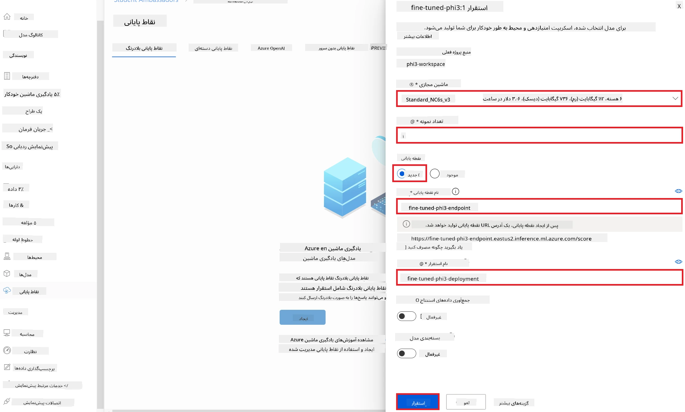

1. روی **Deploy** کلیک کنید.

> [!WARNING]
> برای جلوگیری از هزینه‌های اضافی روی حساب خود، حتماً نقطه پایانی ایجاد شده را در فضای کاری Azure Machine Learning حذف کنید.
>

#### بررسی وضعیت استقرار در Azure Machine Learning Workspace

1. به فضای کاری Azure Machine Learning که ساخته‌اید بروید.

1. از تب سمت چپ، **Endpoints** را انتخاب کنید.

1. نقطه پایانی که ایجاد کرده‌اید را انتخاب کنید.

    

1. در این صفحه، می‌توانید نقاط پایان را در طول فرایند استقرار مدیریت کنید.

> [!NOTE]
> پس از تکمیل استقرار، مطمئن شوید که **Live traffic** روی **100٪** تنظیم شده است. اگر اینطور نیست، برای تنظیم، **Update traffic** را انتخاب کنید. توجه داشته باشید که اگر ترافیک روی 0٪ تنظیم شده باشد، نمی‌توانید مدل را آزمایش کنید.
>
> 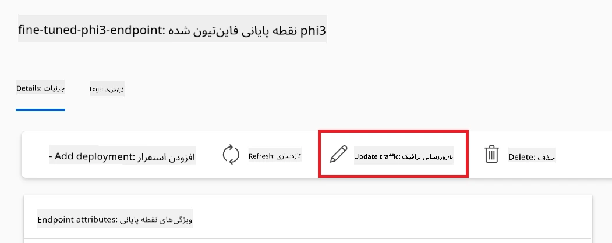
>

## سناریو ۳: ادغام با Prompt flow و چت با مدل سفارشی خود در Azure AI Foundry

### ادغام مدل سفارشی Phi-3 با Prompt flow

پس از استقرار موفقیت‌آمیز مدل فاین‌تیون شده، اکنون می‌توانید آن را با Prompt Flow ادغام کنید تا در برنامه‌های بلادرنگ خود از مدل استفاده کنید و کارهای تعاملی متنوعی با مدل سفارشی Phi-3 خود انجام دهید.

در این تمرین، شما:

- ایجاد Azure AI Foundry Hub.
- ایجاد پروژه Azure AI Foundry.
- ایجاد Prompt flow.
- افزودن اتصال سفارشی برای مدل Phi-3 فاین‌تیون شده.
- تنظیم Prompt flow برای چت با مدل سفارشی Phi-3 خود.

> [!NOTE]
> شما همچنین می‌توانید با استفاده از Azure ML Studio ادغام با Promptflow را انجام دهید. همان فرایند ادغام را می‌توان در Azure ML Studio نیز اعمال کرد.

#### ایجاد Azure AI Foundry Hub

قبل از ایجاد پروژه، باید یک Hub ایجاد کنید. یک Hub مانند Resource Group عمل می‌کند و به شما امکان می‌دهد چندین پروژه را در Azure AI Foundry سازماندهی و مدیریت کنید.

1. به [Azure AI Foundry](https://ai.azure.com/?WT.mc_id=aiml-137032-kinfeylo) مراجعه کنید.

1. از تب سمت چپ، گزینه **All hubs** را انتخاب کنید.

1. از منوی ناوبری، **+ New hub** را انتخاب کنید.
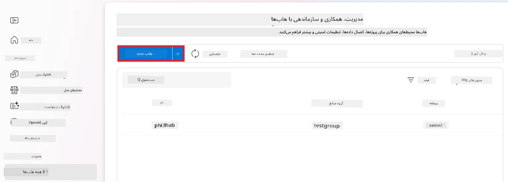

۱. کارهای زیر را انجام دهید:

    - **نام هاب** را وارد کنید. باید یک مقدار یکتا باشد.
    - اشتراک Azure خود را انتخاب کنید.
    - **گروه منابع** مورد استفاده را انتخاب کنید (در صورت نیاز یک گروه جدید ایجاد کنید).
    - **مکان** مورد نظر برای استفاده را انتخاب کنید.
    - **اتصال به خدمات هوش مصنوعی Azure** را انتخاب کنید (در صورت نیاز یک اتصال جدید ایجاد کنید).
    - اتصال به **جستجوی هوش مصنوعی Azure** را به **رد کردن اتصال** تنظیم کنید.

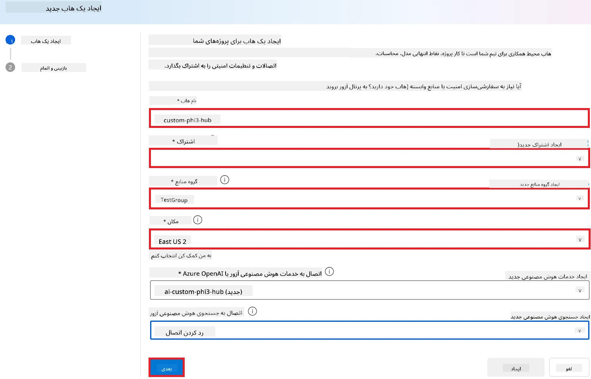

۱. روی **بعدی** کلیک کنید.

#### ایجاد پروژه Azure AI Foundry

۱. در هابی که ایجاد کردید، از تب سمت چپ **تمام پروژه‌ها** را انتخاب کنید.

۱. از منوی ناوبری **+ پروژه جدید** را انتخاب کنید.

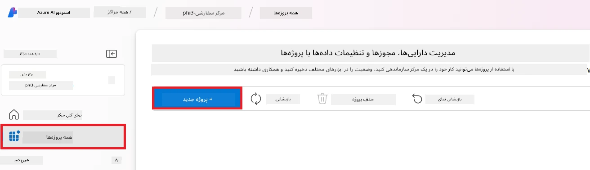

۱. **نام پروژه** را وارد کنید. باید یک مقدار یکتا باشد.

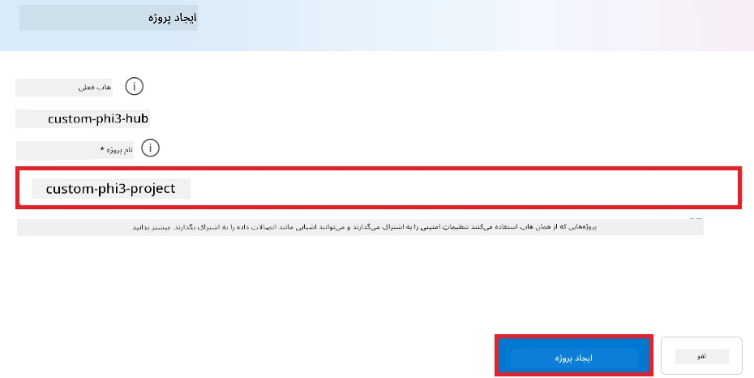

۱. روی **ایجاد پروژه** کلیک کنید.

#### افزودن اتصال سفارشی برای مدل فاین‌تیون شده Phi-3

برای ادغام مدل سفارشی Phi-3 خود با Prompt flow، باید نقطه پایان و کلید مدل را در یک اتصال سفارشی ذخیره کنید. این تنظیم دسترسی به مدل سفارشی Phi-3 شما در Prompt flow را تضمین می‌کند.

#### تنظیم کلید api و URI نقطه پایان مدل فاین‌تیون شده Phi-3

۱. به [Azure ML Studio](https://ml.azure.com/home?WT.mc_id=aiml-137032-kinfeylo) مراجعه کنید.

۱. به فضای کاری Azure Machine learning که ایجاد کرده‌اید بروید.

۱. از تب سمت چپ، **Endpoints** را انتخاب کنید.

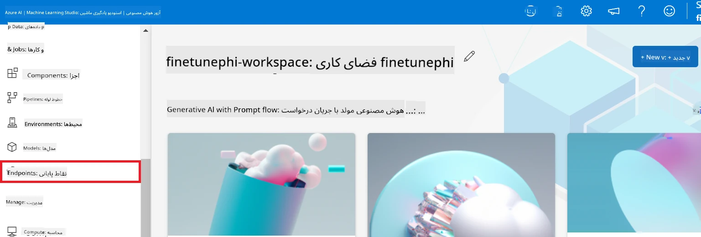

۱. نقطه پایانی که ایجاد کرده‌اید را انتخاب کنید.

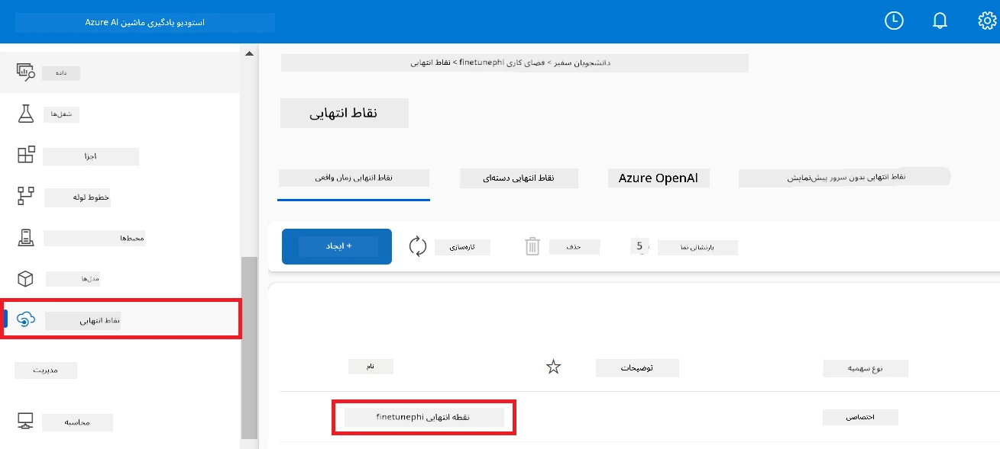

۱. از منوی ناوبری **Consume** را انتخاب کنید.

۱. **REST endpoint** و **کلید اولیه** خود را کپی کنید.

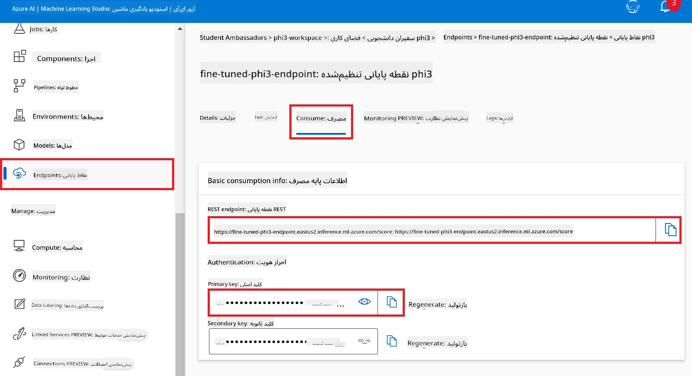

#### افزودن اتصال سفارشی

۱. به [Azure AI Foundry](https://ai.azure.com/?WT.mc_id=aiml-137032-kinfeylo) مراجعه کنید.

۱. به پروژه Azure AI Foundry که ایجاد کرده‌اید بروید.

۱. در پروژه‌ای که ایجاد کرده‌اید، از تب سمت چپ **تنظیمات** را انتخاب کنید.

۱. روی **+ اتصال جدید** کلیک کنید.


۱. از منوی ناوبری **کلیدهای سفارشی** را انتخاب کنید.

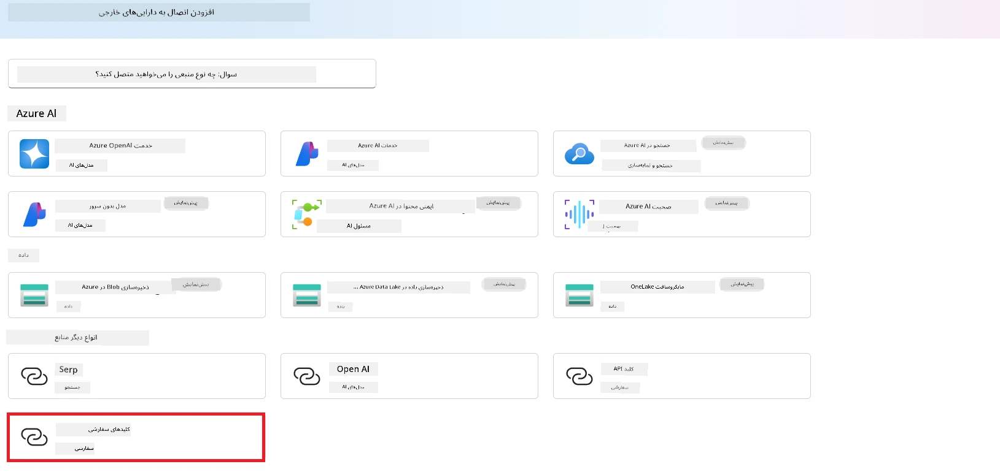

۱. کارهای زیر را انجام دهید:

    - روی **+ افزودن جفت کلید-مقدار** کلیک کنید.
    - برای نام کلید، **endpoint** را وارد کنید و نقطه پایانی که از Azure ML Studio کپی کرده‌اید را در قسمت مقدار الصاق کنید.
    - مجدداً روی **+ افزودن جفت کلید-مقدار** کلیک کنید.
    - برای نام کلید، **key** را وارد کنید و کلیدی که از Azure ML Studio کپی کرده‌اید را در قسمت مقدار الصاق کنید.
    - پس از افزودن کلیدها، گزینه **is secret** را انتخاب کنید تا از افشای کلید جلوگیری شود.

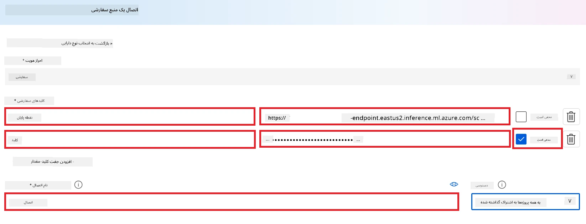

۱. روی **افزودن اتصال** کلیک کنید.

#### ایجاد Prompt flow

شما یک اتصال سفارشی در Azure AI Foundry اضافه کرده‌اید. حال بیایید یک Prompt flow با مراحل زیر ایجاد کنیم. سپس این Prompt flow را به اتصال سفارشی متصل می‌کنیم تا بتوانید از مدل فاین‌تیون شده درون Prompt flow استفاده کنید.

۱. به پروژه Azure AI Foundry که ایجاد کرده‌اید بروید.

۱. از تب سمت چپ **Prompt flow** را انتخاب کنید.

۱. از منوی ناوبری **+ ایجاد** را انتخاب کنید.

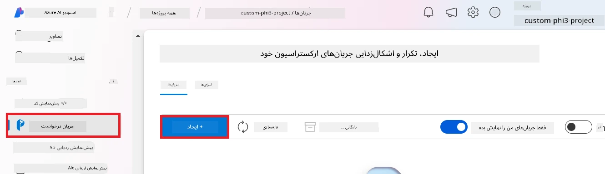

۱. از منوی ناوبری **Chat flow** را انتخاب کنید.

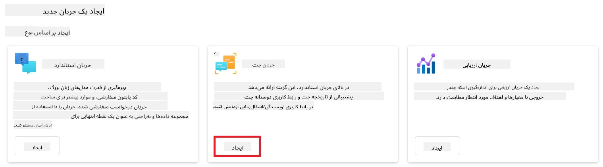

۱. **نام پوشه** مورد استفاده را وارد کنید.

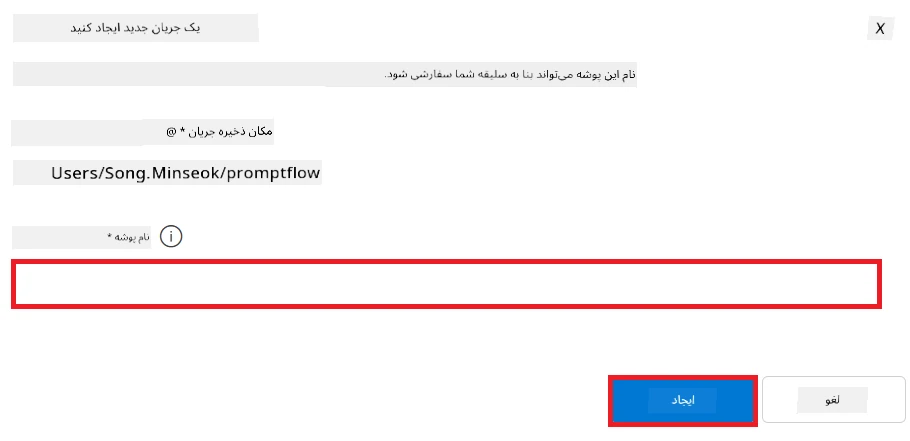

۲. روی **ایجاد** کلیک کنید.

#### راه‌اندازی Prompt flow برای چت با مدل سفارشی Phi-3 شما

شما باید مدل فاین‌تیون شده Phi-3 را در Prompt flow ادغام کنید. با این حال، Prompt flow موجود برای این منظور طراحی نشده است. بنابراین باید Prompt flow را برای فعال‌سازی ادغام مدل سفارشی بازطراحی کنید.

۱. در Prompt flow، برای بازسازی جریان موجود، کارهای زیر را انجام دهید:

    - حالت **Raw file mode** را انتخاب کنید.
    - تمام کدهای موجود در فایل *flow.dag.yml* را حذف کنید.
    - کد زیر را به فایل *flow.dag.yml* اضافه کنید.

        ```yml
        inputs:
          input_data:
            type: string
            default: "Who founded Microsoft?"

        outputs:
          answer:
            type: string
            reference: ${integrate_with_promptflow.output}

        nodes:
        - name: integrate_with_promptflow
          type: python
          source:
            type: code
            path: integrate_with_promptflow.py
          inputs:
            input_data: ${inputs.input_data}
        ```

    - روی **ذخیره** کلیک کنید.

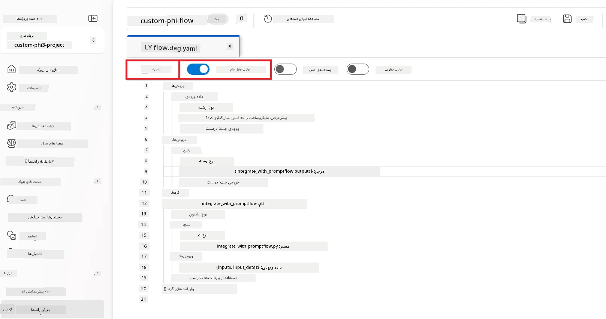

۱. کد زیر را به فایل *integrate_with_promptflow.py* اضافه کنید تا از مدل سفارشی Phi-3 در Prompt flow استفاده شود.

    ```python
    import logging
    import requests
    from promptflow import tool
    from promptflow.connections import CustomConnection

    # تنظیمات لاگ‌گیری
    logging.basicConfig(
        format="%(asctime)s - %(levelname)s - %(name)s - %(message)s",
        datefmt="%Y-%m-%d %H:%M:%S",
        level=logging.DEBUG
    )
    logger = logging.getLogger(__name__)

    def query_phi3_model(input_data: str, connection: CustomConnection) -> str:
        """
        Send a request to the Phi-3 model endpoint with the given input data using Custom Connection.
        """

        # "connection" نام اتصال سفارشی است، "endpoint"، "key" کلیدهای موجود در اتصال سفارشی هستند
        endpoint_url = connection.endpoint
        api_key = connection.key

        headers = {
            "Content-Type": "application/json",
            "Authorization": f"Bearer {api_key}"
        }
        data = {
            "input_data": {
                "input_string": [
                    {"role": "user", "content": input_data}
                ],
                "parameters": {
                    "temperature": 0.7,
                    "max_new_tokens": 128
                }
            }
        }
        try:
            response = requests.post(endpoint_url, json=data, headers=headers)
            response.raise_for_status()
            
            # پاسخ کامل JSON را لاگ کن
            logger.debug(f"Full JSON response: {response.json()}")

            result = response.json()["output"]
            logger.info("Successfully received response from Azure ML Endpoint.")
            return result
        except requests.exceptions.RequestException as e:
            logger.error(f"Error querying Azure ML Endpoint: {e}")
            raise

    @tool
    def my_python_tool(input_data: str, connection: CustomConnection) -> str:
        """
        Tool function to process input data and query the Phi-3 model.
        """
        return query_phi3_model(input_data, connection)

    ```

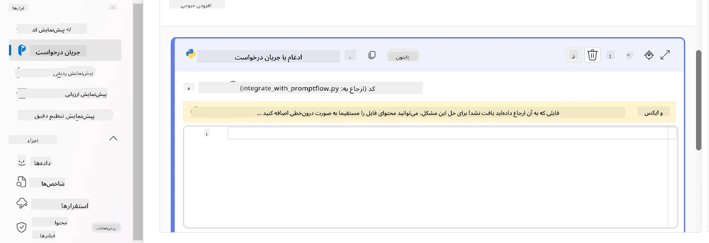

> [!NOTE]
> برای اطلاعات دقیق‌تر در مورد استفاده از Prompt flow در Azure AI Foundry، می‌توانید به [Prompt flow در Azure AI Foundry](https://learn.microsoft.com/azure/ai-studio/how-to/prompt-flow) مراجعه کنید.

۱. برای فعال کردن چت با مدل خود، گزینه‌های **Chat input** و **Chat output** را انتخاب کنید.

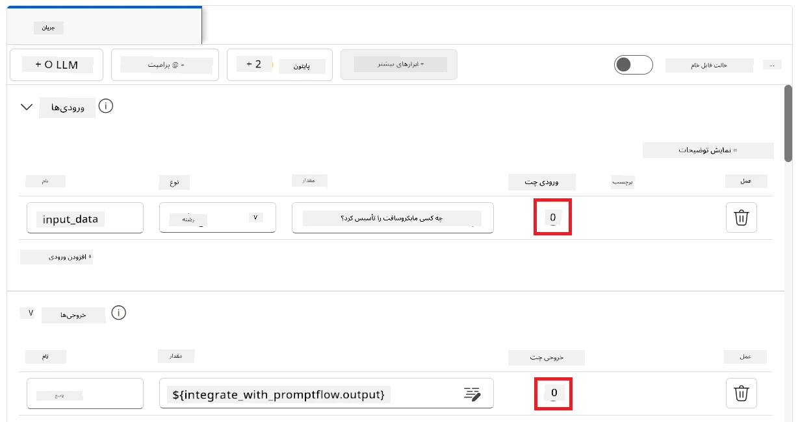

۱. اکنون آماده‌اید تا با مدل سفارشی Phi-3 خود چت کنید. در تمرین بعدی، خواهید آموخت چگونه Prompt flow را شروع کرده و از آن برای چت با مدل فاین‌تیون شده Phi-3 خود استفاده کنید.

> [!NOTE]
>
> جریان بازسازی شده باید شبیه تصویر زیر باشد:
>
> 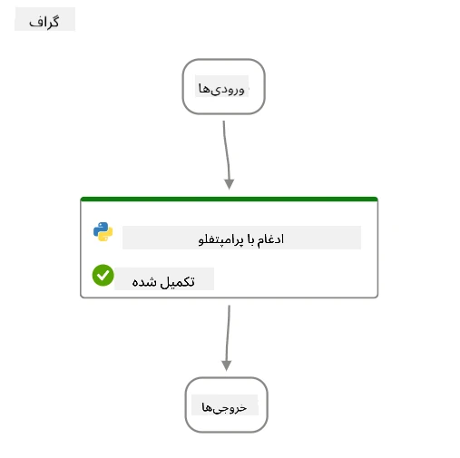
>

### چت با مدل سفارشی Phi-3 شما

اکنون که مدل سفارشی Phi-3 خود را فاین‌تیون کرده و با Prompt flow ادغام کرده‌اید، آماده‌اید تا با آن تعامل داشته باشید. این تمرین شما را در فرایند راه‌اندازی و شروع چت با مدل با استفاده از Prompt flow راهنمایی می‌کند. با دنبال کردن این مراحل، قادر خواهید بود از قابلیت‌های مدل فاین‌تیون شده Phi-3 خود برای وظایف و گفتگوهای مختلف به طور کامل بهره‌برداری کنید.

- با مدل سفارشی Phi-3 خود با استفاده از Prompt flow چت کنید.

#### شروع Prompt flow

۱. برای شروع Prompt flow روی **Start compute sessions** کلیک کنید.


۱. برای تازه‌سازی پارامترها، روی **Validate and parse input** کلیک کنید.


۱. مقدار **connection** را به اتصال سفارشی که ایجاد کرده‌اید انتخاب کنید. به عنوان مثال، *connection*.

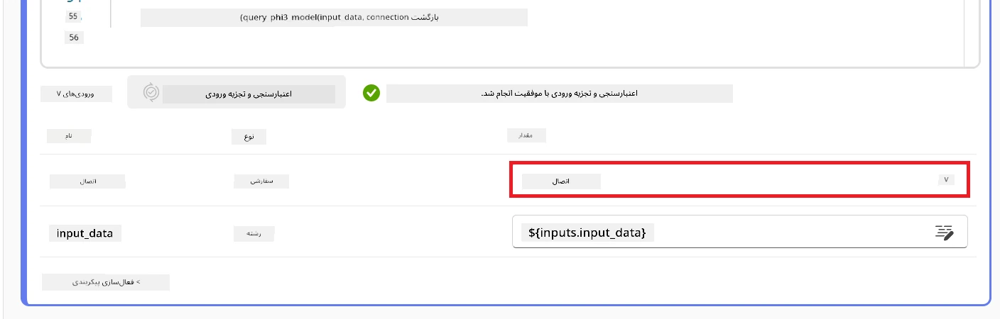

#### چت با مدل سفارشی شما

۱. روی **Chat** کلیک کنید.

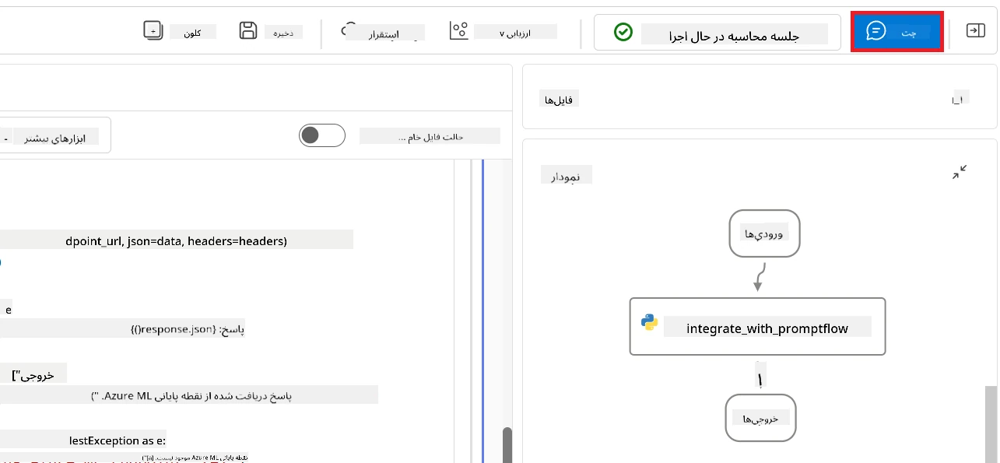

۱. در اینجا یک نمونه از نتایج نشان داده شده است: اکنون می‌توانید با مدل سفارشی Phi-3 خود چت کنید. توصیه می‌شود سوالاتی بر اساس داده‌های مورد استفاده برای فاین‌تیون مطرح کنید.

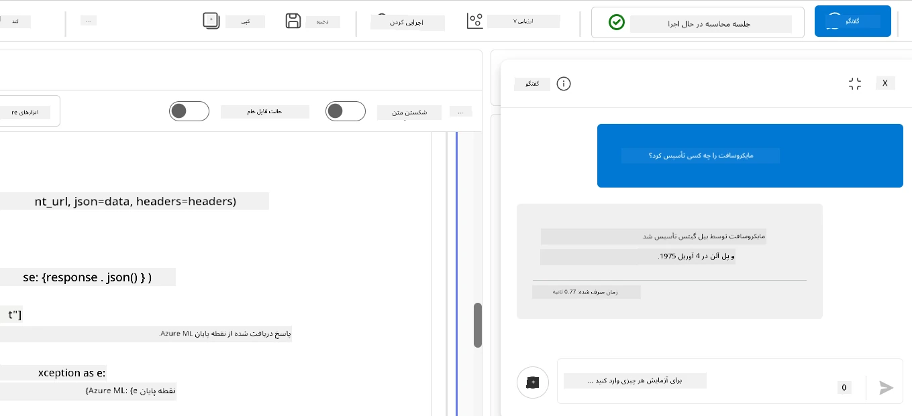

---

<!-- CO-OP TRANSLATOR DISCLAIMER START -->
**توجه**:  
این سند با استفاده از سرویس ترجمه هوش مصنوعی [Co-op Translator](https://github.com/Azure/co-op-translator) ترجمه شده است. در حالی که ما در تلاش برای دقت هستیم، لطفاً توجه داشته باشید که ترجمه‌های خودکار ممکن است حاوی خطاها یا نادرستی‌هایی باشد. سند اصلی به زبان بومی خود باید به عنوان منبع معتبر در نظر گرفته شود. برای اطلاعات حیاتی، توصیه می‌شود از ترجمه حرفه‌ای انسانی استفاده شود. ما در قبال هرگونه سوءتفاهم یا تفسیر نادرست ناشی از استفاده از این ترجمه مسئولیتی نداریم.
<!-- CO-OP TRANSLATOR DISCLAIMER END -->