# تنظیم دقیق و یکپارچه‌سازی مدل‌های سفارشی Phi-3 با Prompt flow در Microsoft Foundry

این نمونه انتها به انتها (E2E) بر اساس راهنمای «[تنظیم دقیق و یکپارچه‌سازی مدل‌های سفارشی Phi-3 با Prompt Flow در Microsoft Foundry](https://techcommunity.microsoft.com/t5/educator-developer-blog/fine-tune-and-integrate-custom-phi-3-models-with-prompt-flow-in/ba-p/4191726?WT.mc_id=aiml-137032-kinfeylo)» از جامعه فناوری مایکروسافت است. این راهنما فرایندهای تنظیم دقیق، استقرار و یکپارچه‌سازی مدل‌های سفارشی Phi-3 با Prompt flow در Microsoft Foundry را معرفی می‌کند. برخلاف نمونه انتها به انتهای «[تنظیم دقیق و یکپارچه‌سازی مدل‌های سفارشی Phi-3 با Prompt Flow](./E2E_Phi-3-FineTuning_PromptFlow_Integration.md)» که شامل اجرای کد به‌صورت محلی بود، این آموزش کاملاً بر روی تنظیم دقیق و یکپارچه‌سازی مدل شما در Azure AI / ML Studio تمرکز دارد.

## مرور کلی

در این نمونه انتها به انتها، شما خواهید آموخت چگونه مدل Phi-3 را به‌صورت دقیق تنظیم کنید و آن را با Prompt flow در Microsoft Foundry یکپارچه‌سازی نمایید. با بهره‌گیری از Azure AI / ML Studio، یک گردش کار برای استقرار و استفاده از مدل‌های سفارشی هوش مصنوعی ایجاد خواهید کرد. این نمونه به سه سناریو تقسیم شده است:

**سناریو 1: راه‌اندازی منابع Azure و آماده‌سازی برای تنظیم دقیق**

**سناریو 2: تنظیم دقیق مدل Phi-3 و استقرار در Azure Machine Learning Studio**

**سناریو 3: یکپارچه‌سازی با Prompt flow و چت با مدل سفارشی خود در Microsoft Foundry**

در اینجا مرور کلی این نمونه انتها به انتها آمده است.

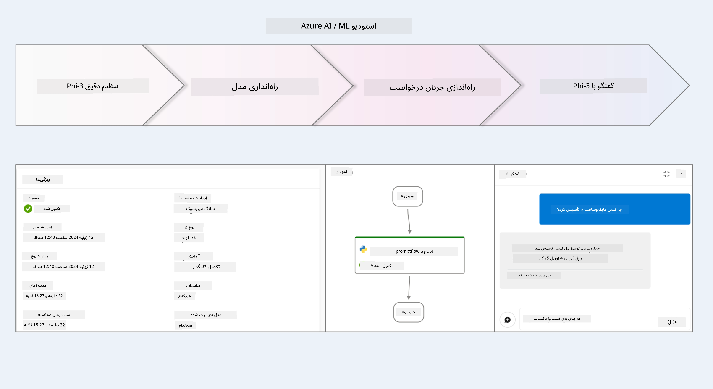

### فهرست مطالب

1. **[سناریو 1: راه‌اندازی منابع Azure و آماده‌سازی برای تنظیم دقیق](../../../../../../md/02.Application/01.TextAndChat/Phi3)**
    - [ایجاد یک فضای کاری Azure Machine Learning](../../../../../../md/02.Application/01.TextAndChat/Phi3)
    - [درخواست سهمیه GPU در اشتراک Azure](../../../../../../md/02.Application/01.TextAndChat/Phi3)
    - [افزودن انتساب نقش](../../../../../../md/02.Application/01.TextAndChat/Phi3)
    - [راه‌اندازی پروژه](../../../../../../md/02.Application/01.TextAndChat/Phi3)
    - [آماده‌سازی مجموعه داده برای تنظیم دقیق](../../../../../../md/02.Application/01.TextAndChat/Phi3)

1. **[سناریو 2: تنظیم دقیق مدل Phi-3 و استقرار در Azure Machine Learning Studio](../../../../../../md/02.Application/01.TextAndChat/Phi3)**
    - [تنظیم دقیق مدل Phi-3](../../../../../../md/02.Application/01.TextAndChat/Phi3)
    - [استقرار مدل Phi-3 تنظیم دقیق شده](../../../../../../md/02.Application/01.TextAndChat/Phi3)

1. **[سناریو 3: یکپارچه‌سازی با Prompt flow و چت با مدل سفارشی خود در Microsoft Foundry](../../../../../../md/02.Application/01.TextAndChat/Phi3)**
    - [یکپارچه‌سازی مدل سفارشی Phi-3 با Prompt flow](../../../../../../md/02.Application/01.TextAndChat/Phi3)
    - [چت با مدل سفارشی Phi-3 خود](../../../../../../md/02.Application/01.TextAndChat/Phi3)

## سناریو 1: راه‌اندازی منابع Azure و آماده‌سازی برای تنظیم دقیق

### ایجاد یک فضای کاری Azure Machine Learning

1. در **نوار جستجو** در بالای صفحه پرتال، *azure machine learning* را تایپ کنید و از گزینه‌های ظاهر شده **Azure Machine Learning** را انتخاب کنید.

    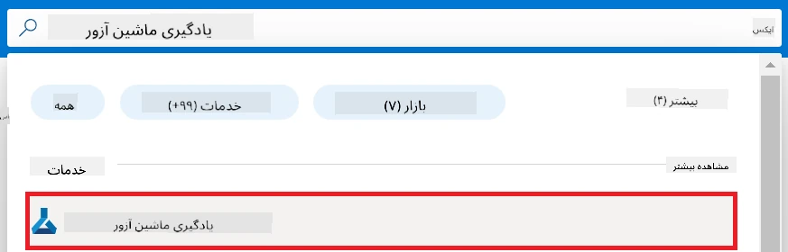

2. از منوی ناوبر، **+ Create** را انتخاب کنید.

3. از منوی ناوبر، **New workspace** را انتخاب کنید.

    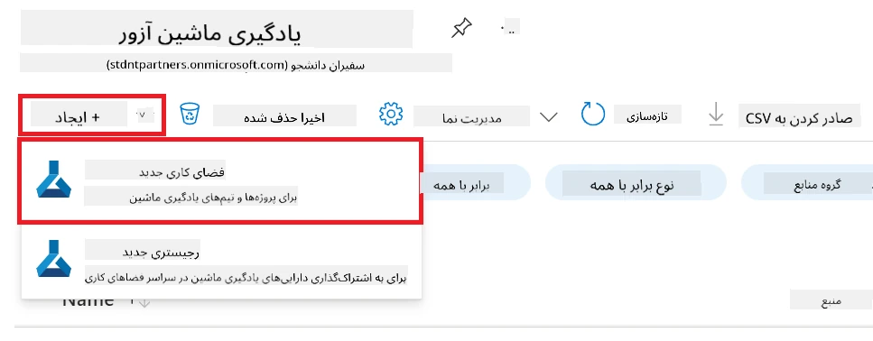

4. کارهای زیر را انجام دهید:

    - اشتراک Azure خود را انتخاب کنید **Subscription**.
    - گروه منابع مورد استفاده را انتخاب کنید **Resource group** (در صورت نیاز یک گروه جدید ایجاد کنید).
    - نام فضای کاری را وارد کنید **Workspace Name**. این نام باید یکتا باشد.
    - منطقه مورد نظر خود را انتخاب کنید **Region**.
    - حساب ذخیره‌سازی مورد استفاده را انتخاب کنید **Storage account** (در صورت نیاز یک حساب جدید ایجاد کنید).
    - مخزن کلید مورد استفاده را انتخاب کنید **Key vault** (در صورت نیاز یک مخزن جدید ایجاد کنید).
    - بینش‌های برنامه را انتخاب کنید **Application insights** (در صورت نیاز یک مورد جدید ایجاد کنید).
    - رجیستری کانتینر مورد استفاده را انتخاب کنید **Container registry** (در صورت نیاز رجیستری جدید ایجاد کنید).

    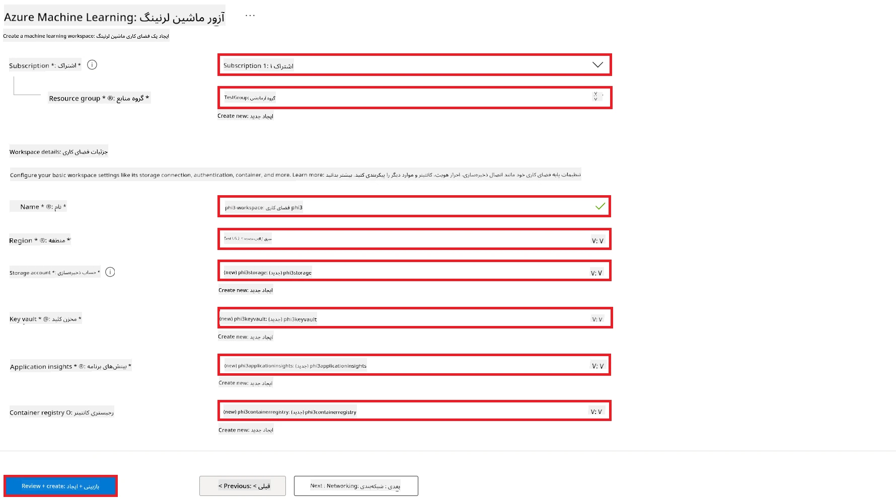

5. روی **Review + Create** کلیک کنید.

6. سپس **Create** را انتخاب کنید.

### درخواست سهمیه GPU در اشتراک Azure

در این آموزش، خواهید آموخت چگونه مدل Phi-3 را با استفاده از GPU ها تنظیم دقیق و مستقر کنید. برای تنظیم دقیق، از GPU *Standard_NC24ads_A100_v4* استفاده می‌کنید که نیاز به درخواست سهمیه دارد. برای استقرار، از GPU *Standard_NC6s_v3* استفاده خواهد شد که آن نیز نیازمند درخواست سهمیه است.

> [!NOTE]
>
> تنها اشتراک‌های Pay-As-You-Go (نوع استاندارد اشتراک) واجد شرایط تخصیص GPU هستند؛ اشتراک‌های مزایایی در حال حاضر پشتیبانی نمی‌شوند.
>

1. به [Azure ML Studio](https://ml.azure.com/home?wt.mc_id=studentamb_279723) مراجعه کنید.

1. برای درخواست سهمیه *Standard NCADSA100v4 Family* اقدامات زیر را انجام دهید:

    - از تب سمت چپ، **Quota** را انتخاب کنید.
    - خانواده ماشین مجازی مورد استفاده را انتخاب کنید. مثلاً، **Standard NCADSA100v4 Family Cluster Dedicated vCPUs** که شامل GPU *Standard_NC24ads_A100_v4* است.
    - از منوی ناوبر، **Request quota** را انتخاب کنید.

        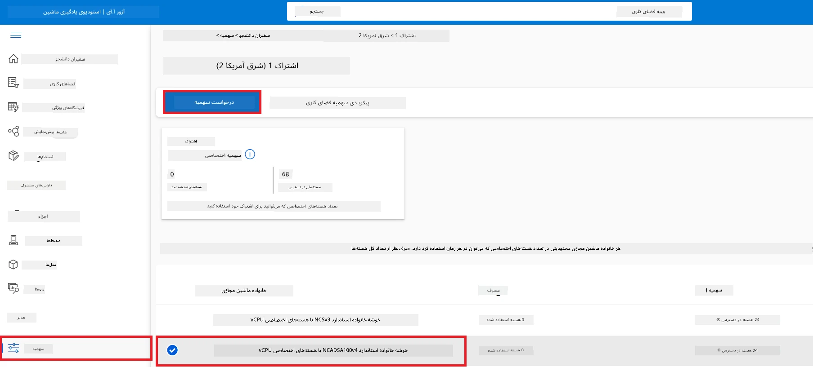

    - در صفحه درخواست سهمیه، مقدار **New cores limit** که می‌خواهید استفاده کنید را وارد کنید. مثلاً 24.
    - در همان صفحه، **Submit** را انتخاب کنید تا درخواست سهمیه GPU ارسال شود.

1. برای درخواست سهمیه *Standard NCSv3 Family* اقدامات زیر را انجام دهید:

    - از تب سمت چپ، **Quota** را انتخاب کنید.
    - خانواده ماشین مجازی مورد استفاده را انتخاب کنید. مثلاً **Standard NCSv3 Family Cluster Dedicated vCPUs** که شامل GPU *Standard_NC6s_v3* است.
    - از منوی ناوبر، **Request quota** را انتخاب کنید.
    - در صفحه درخواست سهمیه، مقدار **New cores limit** را وارد کنید. مثلاً 24.
    - **Submit** را برای ارسال درخواست سهمیه GPU انتخاب کنید.

### افزودن انتساب نقش

برای تنظیم دقیق و استقرار مدل‌های خود، ابتدا باید یک هویت مدیریت داده شده توسط کاربر (User Assigned Managed Identity - UAI) ایجاد کنید و مجوزهای مناسب را به آن اختصاص دهید. این UAI برای احراز هویت در هنگام استقرار استفاده خواهد شد.

#### ایجاد User Assigned Managed Identity (UAI)

1. در **نوار جستجو** در بالای صفحه پرتال، *managed identities* را تایپ کنید و از گزینه‌های ظاهر شده **Managed Identities** را انتخاب کنید.

    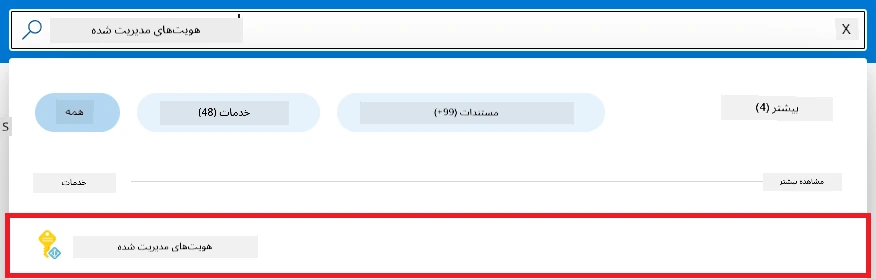

1. **+ Create** را انتخاب کنید.

    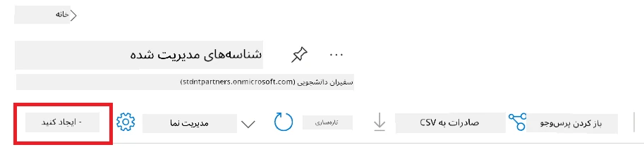

1. کارهای زیر را انجام دهید:

    - اشتراک Azure خود را انتخاب کنید **Subscription**.
    - گروه منابع مورد استفاده را انتخاب کنید **Resource group** (در صورت نیاز یک گروه جدید ایجاد کنید).
    - منطقه‌ای که می‌خواهید استفاده کنید را انتخاب کنید **Region**.
    - نام را وارد کنید **Name**. این نام باید یکتا باشد.

    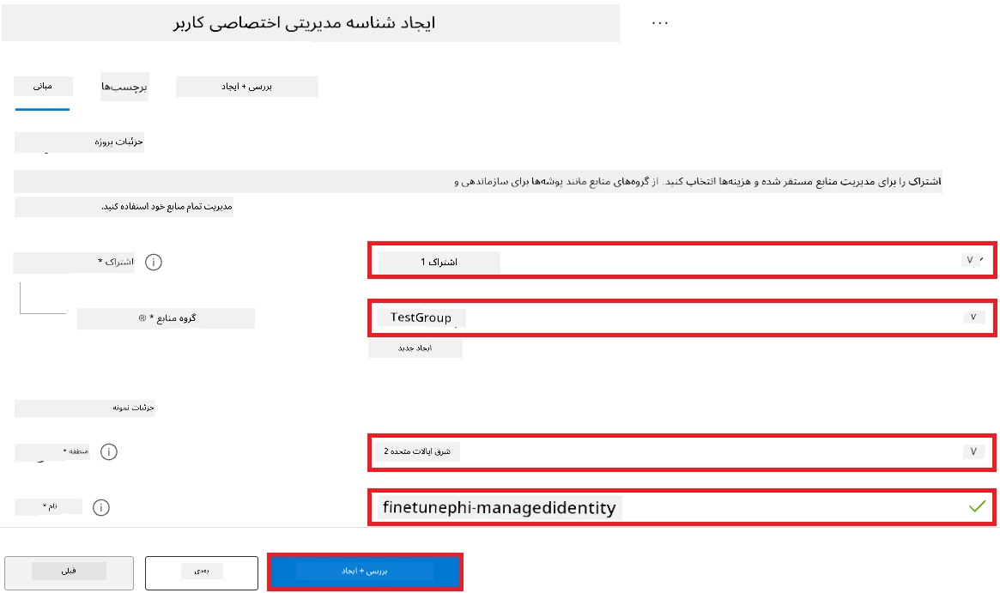

1. روی **Review + create** کلیک کنید.

1. سپس **+ Create** را انتخاب کنید.

#### افزودن انتساب نقش Contributor به Managed Identity

1. به منبع Managed Identity که ایجاد کرده‌اید بروید.

1. از تب سمت چپ، **Azure role assignments** را انتخاب کنید.

1. از منوی ناوبر، **+Add role assignment** را انتخاب کنید.

1. در صفحه افزودن انتساب نقش، کارهای زیر را انجام دهید:
    - حوزه **Scope** را روی **Resource group** قرار دهید.
    - اشتراک Azure خود را انتخاب کنید **Subscription**.
    - گروه منابع مورد استفاده را انتخاب کنید **Resource group**.
    - نقش **Role** را روی **Contributor** تنظیم کنید.

    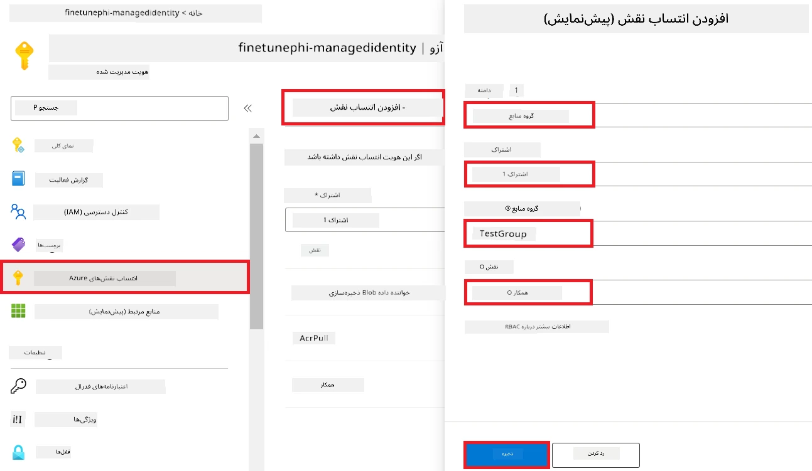

2. روی **Save** کلیک کنید.

#### افزودن انتساب نقش Storage Blob Data Reader به Managed Identity

1. در **نوار جستجو** در بالای صفحه پرتال، *storage accounts* را تایپ کنید و از گزینه‌های ظاهر شده **Storage accounts** را انتخاب کنید.

    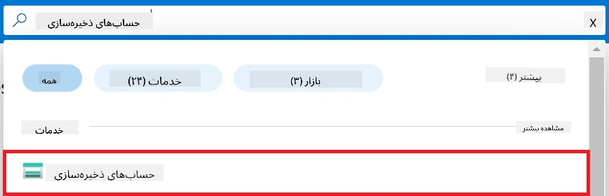

1. حساب ذخیره‌سازی که به فضای کاری Azure Machine Learning مرتبط است را انتخاب کنید. برای مثال، *finetunephistorage*.

1. برای رفتن به صفحه افزودن انتساب نقش، کارهای زیر را انجام دهید:

    - به حساب ذخیره‌سازی Azure که ایجاد کرده‌اید بروید.
    - از تب سمت چپ، **Access Control (IAM)** را انتخاب کنید.
    - از منوی ناوبر، **+ Add** را انتخاب کنید.
    - سپس **Add role assignment** را انتخاب کنید.

    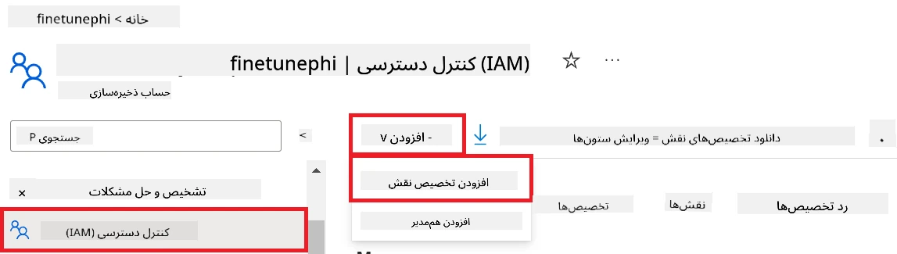

1. در صفحه افزودن انتساب نقش، کارهای زیر را انجام دهید:

    - در صفحه نقش، *Storage Blob Data Reader* را در **نوار جستجو** تایپ کنید و از گزینه‌های ظاهر شده **Storage Blob Data Reader** را انتخاب کنید.
    - در همان صفحه، روی **Next** کلیک کنید.
    - در صفحه اعضا، گزینه **Assign access to** را روی **Managed identity** قرار دهید.
    - در صفحه اعضا، **+ Select members** را انتخاب کنید.
    - در صفحه انتخاب هویت‌های مدیریت شده، اشتراک Azure خود را انتخاب کنید **Subscription**.
    - هویت مدیریت شده را برای **Manage Identity** انتخاب کنید.
    - هویت مدیریت شده‌ای که ایجاد کرده‌اید را انتخاب کنید. برای مثال، *finetunephi-managedidentity*.
    - روی **Select** کلیک کنید.

    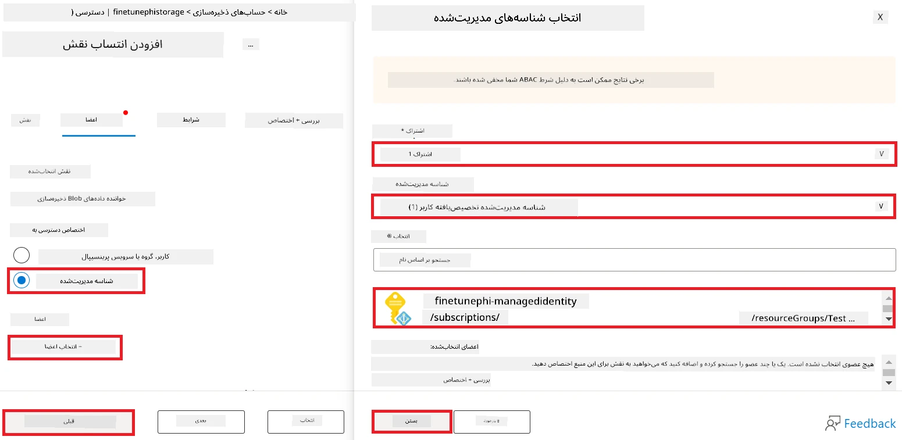

1. روی **Review + assign** کلیک کنید.

#### افزودن انتساب نقش AcrPull به Managed Identity

1. در **نوار جستجو** در بالای صفحه پرتال، *container registries* را تایپ کنید و از گزینه‌های ظاهر شده **Container registries** را انتخاب کنید.

    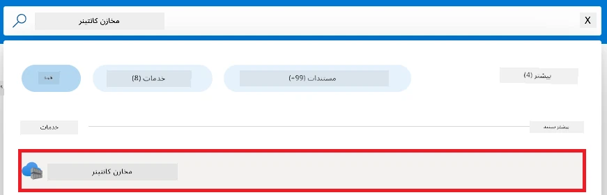

1. رجیستری کانتینری که با فضای کاری Azure Machine Learning مرتبط است را انتخاب کنید. برای مثال، *finetunephicontainerregistry*

1. برای رفتن به صفحه افزودن انتساب نقش، کارهای زیر را انجام دهید:

    - از تب سمت چپ، **Access Control (IAM)** را انتخاب کنید.
    - از منوی ناوبر، **+ Add** را انتخاب کنید.
    - سپس **Add role assignment** را انتخاب کنید.

1. در صفحه افزودن انتساب نقش، کارهای زیر را انجام دهید:

    - در صفحه نقش، *AcrPull* را در **نوار جستجو** تایپ کنید و از گزینه‌های ظاهر شده **AcrPull** را انتخاب کنید.
    - در همان صفحه، روی **Next** کلیک کنید.
    - در صفحه اعضا، گزینه **Assign access to** را روی **Managed identity** قرار دهید.
    - در صفحه اعضا، **+ Select members** را انتخاب کنید.
    - در صفحه انتخاب هویت‌های مدیریت شده، اشتراک Azure خود را انتخاب کنید **Subscription**.
    - هویت مدیریت شده را برای **Manage Identity** انتخاب کنید.
    - هویت مدیریت شده‌ای که ایجاد کرده‌اید را انتخاب کنید. برای مثال، *finetunephi-managedidentity*.
    - روی **Select** کلیک کنید.
    - سپس **Review + assign** را انتخاب کنید.

### راه‌اندازی پروژه

برای دانلود مجموعه داده‌های لازم برای تنظیم دقیق، باید یک محیط محلی راه‌اندازی کنید.

در این تمرین، شما:

- یک پوشه برای کار ایجاد خواهید کرد.
- یک محیط مجازی ایجاد خواهید کرد.
- بسته‌های مورد نیاز را نصب خواهید کرد.
- فایلی به نام *download_dataset.py* ایجاد خواهید کرد تا مجموعه داده را دانلود کند.

#### ایجاد یک پوشه برای کار

1. پنجره ترمینال را باز کنید و دستور زیر را برای ایجاد پوشه‌ای به نام *finetune-phi* در مسیر پیش‌فرض تایپ کنید.

    ```console
    mkdir finetune-phi
    ```

2. در ترمینال، دستور زیر را وارد کنید تا به پوشه *finetune-phi* که ایجاد کرده‌اید بروید.

    ```console
    cd finetune-phi
    ```

#### ایجاد یک محیط مجازی

1. در ترمینال، دستور زیر را وارد کنید تا یک محیط مجازی به نام *.venv* ایجاد شود.
    ```console
    python -m venv .venv
    ```

2. فرمان زیر را در ترمینال خود تایپ کنید تا محیط مجازی فعال شود.

    ```console
    .venv\Scripts\activate.bat
    ```

> [!NOTE]
> اگر کار کرد، باید *(.venv)* را قبل از نشانگر فرمان مشاهده کنید.

#### نصب بسته‌های مورد نیاز

1. فرمان‌های زیر را در ترمینال خود تایپ کنید تا بسته‌های مورد نیاز نصب شوند.

    ```console
    pip install datasets==2.19.1
    ```

#### ایجاد `donload_dataset.py`

> [!NOTE]
> ساختار کامل پوشه:
>
> ```text
> └── YourUserName
> .    └── finetune-phi
> .        └── download_dataset.py
> ```

1. **Visual Studio Code** را باز کنید.

1. از نوار منو گزینه **File** را انتخاب کنید.

1. گزینه **Open Folder** را انتخاب کنید.

1. پوشه *finetune-phi* که ایجاد کرده‌اید و در مسیر *C:\Users\yourUserName\finetune-phi* قرار دارد را انتخاب کنید.

    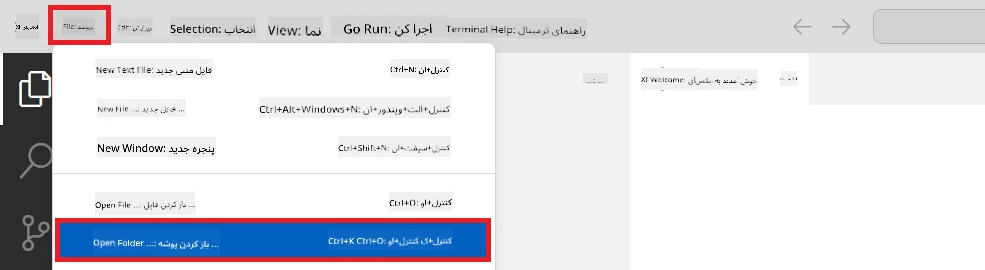

1. در پنل سمت چپ Visual Studio Code، راست‌کلیک کرده و گزینه **New File** را انتخاب کنید تا فایل جدیدی به نام *download_dataset.py* ایجاد شود.

    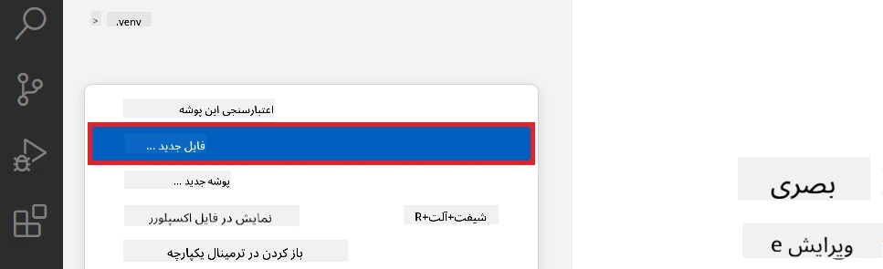

### آماده‌سازی داده‌ها برای آموزش دقیق

در این تمرین، فایل *download_dataset.py* را اجرا خواهید کرد تا دیتاست‌های *ultrachat_200k* را در محیط محلی خود دانلود کنید. سپس از این دیتاست‌ها برای آموزش دقیق مدل Phi-3 در Azure Machine Learning استفاده خواهید کرد.

در این تمرین، شما:

- کد را به فایل *download_dataset.py* برای دانلود دیتاست‌ها اضافه می‌کنید.
- فایل *download_dataset.py* را اجرا کرده و دیتاست‌ها را به محیط محلی خود دانلود می‌کنید.

#### دانلود دیتاست خود با استفاده از *download_dataset.py*

1. فایل *download_dataset.py* را در Visual Studio Code باز کنید.

1. کد زیر را در فایل *download_dataset.py* وارد کنید.

    ```python
    import json
    import os
    from datasets import load_dataset

    def load_and_split_dataset(dataset_name, config_name, split_ratio):
        """
        Load and split a dataset.
        """
        # بارگذاری مجموعه داده با نام مشخص شده، پیکربندی و نسبت تقسیم
        dataset = load_dataset(dataset_name, config_name, split=split_ratio)
        print(f"Original dataset size: {len(dataset)}")
        
        # تقسیم مجموعه داده به مجموعه‌های آموزش و تست (۸۰٪ آموزش، ۲۰٪ تست)
        split_dataset = dataset.train_test_split(test_size=0.2)
        print(f"Train dataset size: {len(split_dataset['train'])}")
        print(f"Test dataset size: {len(split_dataset['test'])}")
        
        return split_dataset

    def save_dataset_to_jsonl(dataset, filepath):
        """
        Save a dataset to a JSONL file.
        """
        # ایجاد پوشه در صورت وجود نداشتن
        os.makedirs(os.path.dirname(filepath), exist_ok=True)
        
        # باز کردن فایل در حالت نوشتن
        with open(filepath, 'w', encoding='utf-8') as f:
            # تکرار روی هر رکورد در مجموعه داده
            for record in dataset:
                # تبدیل رکورد به شیء JSON و نوشتن آن در فایل
                json.dump(record, f)
                # نوشتن کاراکتر خط جدید برای جدا کردن رکوردها
                f.write('\n')
        
        print(f"Dataset saved to {filepath}")

    def main():
        """
        Main function to load, split, and save the dataset.
        """
        # بارگذاری و تقسیم مجموعه داده ULTRACHAT_200k با پیکربندی و نسبت تقسیم خاص
        dataset = load_and_split_dataset("HuggingFaceH4/ultrachat_200k", 'default', 'train_sft[:1%]')
        
        # استخراج مجموعه‌های آموزش و تست از تقسیم‌بندی
        train_dataset = dataset['train']
        test_dataset = dataset['test']

        # ذخیره مجموعه داده آموزش در فایل JSONL
        save_dataset_to_jsonl(train_dataset, "data/train_data.jsonl")
        
        # ذخیره مجموعه داده تست در فایل JSONL جداگانه
        save_dataset_to_jsonl(test_dataset, "data/test_data.jsonl")

    if __name__ == "__main__":
        main()

    ```

1. فرمان زیر را در ترمینال خود تایپ کنید تا اسکریپت اجرا شده و دیتاست را به محیط محلی شما دانلود کند.

    ```console
    python download_dataset.py
    ```

1. بررسی کنید که دیتاست‌ها با موفقیت در مسیر محلی *finetune-phi/data* ذخیره شده‌اند.

> [!NOTE]
>
> #### نکته در مورد حجم دیتاست و زمان آموزش دقیق
>
> در این آموزش، شما تنها ۱٪ از دیتاست را استفاده می‌کنید (`split='train[:1%]'`). این کار مقدار داده‌ها را به طور قابل توجهی کاهش می‌دهد و فرآیند آپلود و آموزش دقیق را سریع‌تر می‌کند. می‌توانید درصد را تنظیم کنید تا تعادل مناسبی بین زمان آموزش و عملکرد مدل پیدا کنید. استفاده از زیرمجموعه کوچکتر دیتاست، زمان مورد نیاز برای آموزش دقیق را کاهش می‌دهد و روند آموزش را برای آموزش‌های آموزشی قابل مدیریت‌تر می‌کند.

## سناریو ۲: آموزش دقیق مدل Phi-3 و ارائه آن در Azure Machine Learning Studio

### آموزش دقیق مدل Phi-3

در این تمرین، مدل Phi-3 را در Azure Machine Learning Studio به صورت دقیق آموزش خواهید داد.

در این تمرین، شما:

- ایجاد کلاستر محاسباتی برای آموزش دقیق.
- آموزش دقیق مدل Phi-3 در Azure Machine Learning Studio.

#### ایجاد کلاستر محاسباتی برای آموزش دقیق

1. به [Azure ML Studio](https://ml.azure.com/home?wt.mc_id=studentamb_279723) مراجعه کنید.

1. از تب سمت چپ گزینه **Compute** را انتخاب کنید.

1. از منوی ناوبری **Compute clusters** را انتخاب کنید.

1. گزینه **+ New** را انتخاب کنید.

    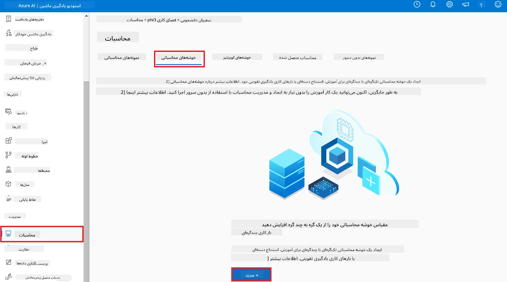

1. انجام کارهای زیر:

    - انتخاب **Region** که می‌خواهید استفاده کنید.
    - انتخاب **Virtual machine tier** به **Dedicated**.
    - انتخاب **Virtual machine type** به **GPU**.
    - انتخاب فیلتر **Virtual machine size** به **Select from all options**.
    - انتخاب اندازه ماشین مجازی به **Standard_NC24ads_A100_v4**.

    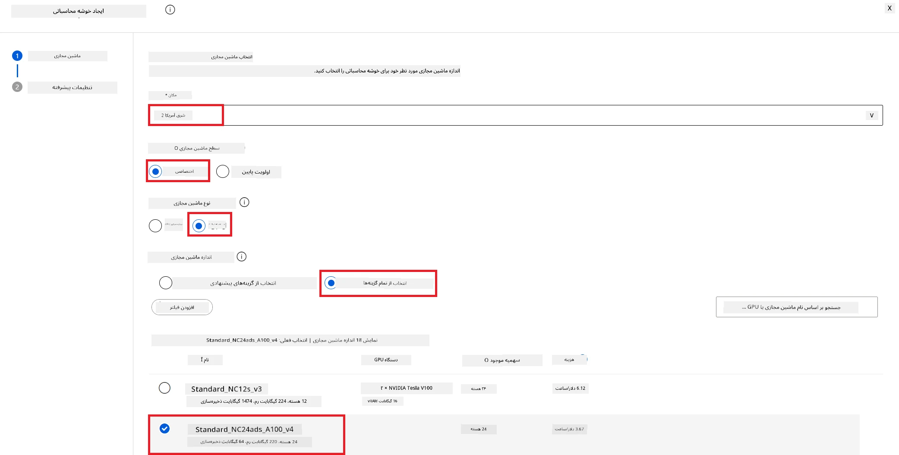

1. گزینه **Next** را انتخاب کنید.

1. انجام کارهای زیر:

    - وارد کردن **Compute name** که باید مقدار منحصر به فردی باشد.
    - تنظیم **Minimum number of nodes** به **0**.
    - تنظیم **Maximum number of nodes** به **1**.
    - تنظیم **Idle seconds before scale down** به **120**.

    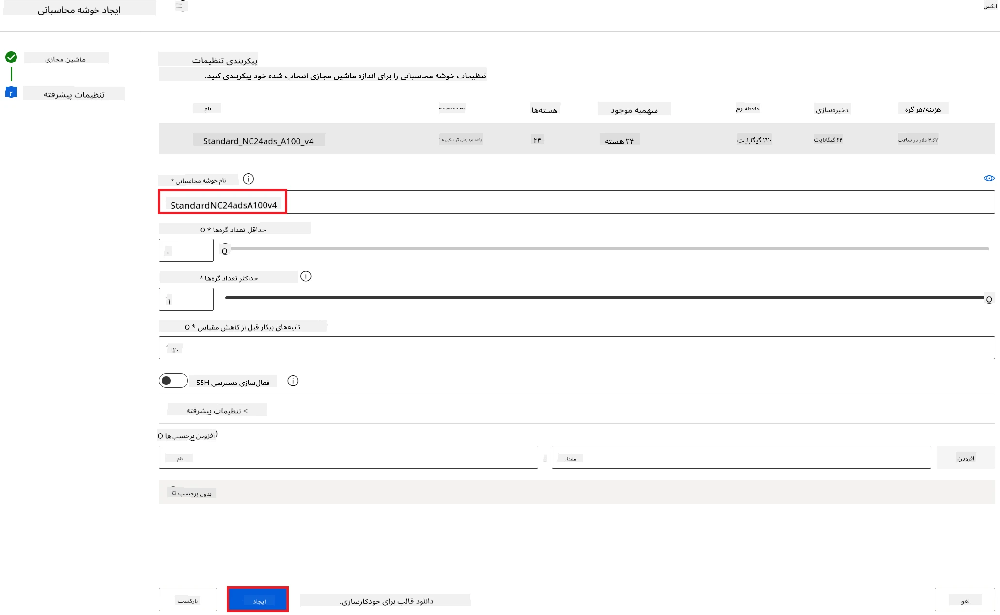

1. گزینه **Create** را انتخاب کنید.

#### آموزش دقیق مدل Phi-3

1. به [Azure ML Studio](https://ml.azure.com/home?wt.mc_id=studentamb_279723) مراجعه کنید.

1. فضای کاری Azure Machine Learning که ایجاد کرده‌اید را انتخاب کنید.

    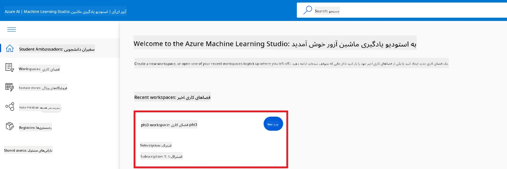

1. انجام کارهای زیر:

    - انتخاب **Model catalog** از تب سمت چپ.
    - تایپ *phi-3-mini-4k* در نوار جستجو و انتخاب **Phi-3-mini-4k-instruct** از گزینه‌های ظاهر شده.

    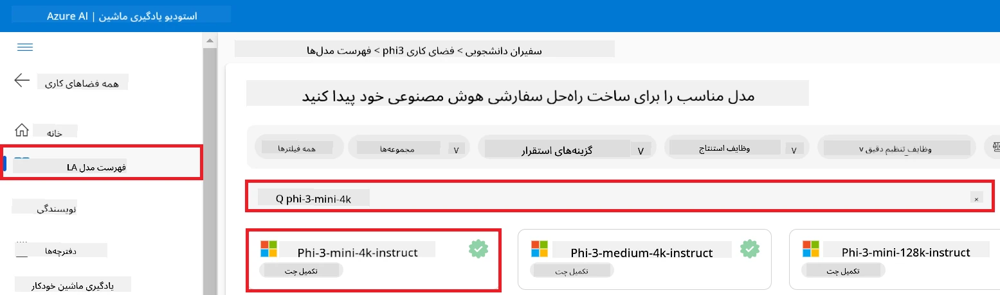

1. از منوی ناوبری گزینه **Fine-tune** را انتخاب کنید.

    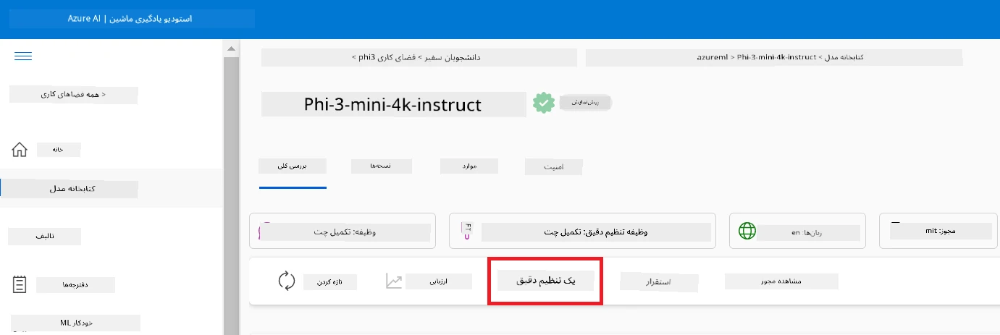

1. انجام کارهای زیر:

    - انتخاب **Select task type** به **Chat completion**.
    - انتخاب **+ Select data** برای بارگذاری **داده‌های آموزشی**.
    - انتخاب نوع بارگذاری Validation data به **Provide different validation data**.
    - انتخاب **+ Select data** برای بارگذاری **Validation data**.

    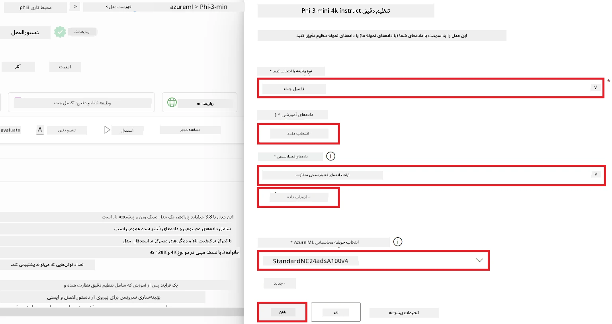

> [!TIP]
>
> می‌توانید **Advanced settings** را انتخاب کنید تا پیکربندی‌هایی مانند **learning_rate** و **lr_scheduler_type** را سفارشی کنید و فرآیند آموزش دقیق را بر اساس نیازهای خاص خود بهینه کنید.

1. گزینه **Finish** را انتخاب کنید.

1. در این تمرین، شما با موفقیت مدل Phi-3 را با استفاده از Azure Machine Learning آموزش دقیق دادید. توجه داشته باشید که فرآیند آموزش دقیق ممکن است زمان قابل توجهی طول بکشد. پس از اجرای کار آموزش دقیق، باید منتظر بمانید تا کامل شود. می‌توانید وضعیت کار آموزش دقیق را با مراجعه به تب Jobs در سمت چپ فضای کاری Azure Machine Learning خود دنبال کنید. در قسمت بعدی، مدل آموزش‌دیده را منتشر کرده و آن را با Prompt flow ادغام خواهید کرد.

    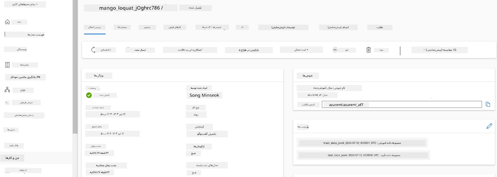

### انتشار مدل Phi-3 آموزش‌دیده

برای ادغام مدل Phi-3 آموزش‌دیده با Prompt flow، لازم است مدل را نشر دهید تا در دسترس برای استنتاج بلادرنگ قرار گیرد. این فرآیند شامل ثبت مدل، ایجاد یک نقطه پایانی آنلاین و انتشار مدل است.

در این تمرین، شما:

- مدل آموزش‌دیده را در فضای کاری Azure Machine Learning ثبت می‌کنید.
- یک نقطه پایانی آنلاین ایجاد می‌کنید.
- مدل Phi-3 آموزش‌دیده ثبت‌شده را منتشر می‌کنید.

#### ثبت مدل آموزش‌دیده

1. به [Azure ML Studio](https://ml.azure.com/home?wt.mc_id=studentamb_279723) مراجعه کنید.

1. فضای کاری Azure Machine Learning که ایجاد کرده‌اید را انتخاب کنید.

    

1. از تب سمت چپ گزینه **Models** را انتخاب کنید.
1. گزینه **+ Register** را انتخاب کنید.
1. گزینه **From a job output** را انتخاب کنید.

    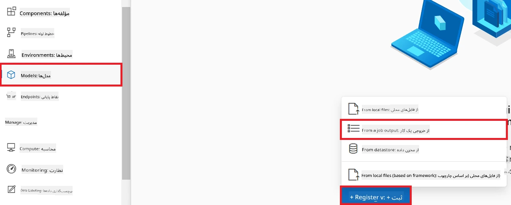

1. کاری را که ایجاد کرده‌اید انتخاب کنید.

    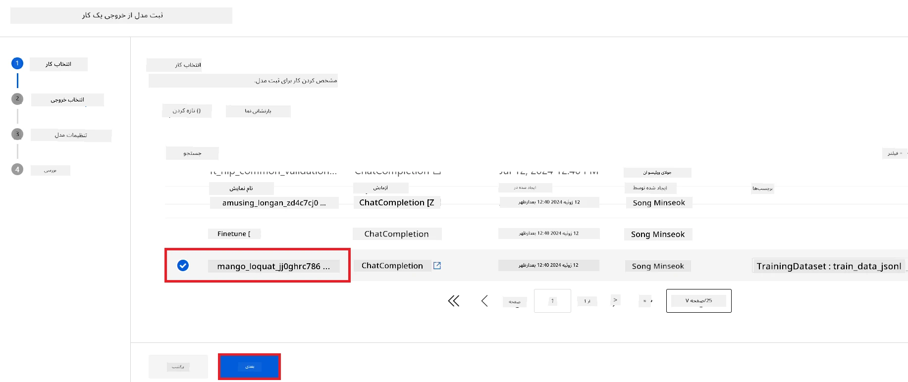

1. گزینه **Next** را انتخاب کنید.

1. نوع مدل را به **MLflow** تنظیم کنید.

1. اطمینان حاصل کنید که **Job output** انتخاب شده است؛ این باید به صورت خودکار انتخاب شود.

    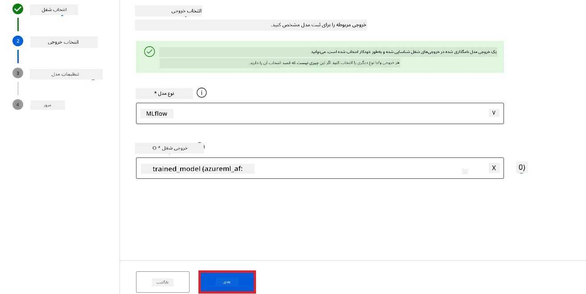

2. گزینه **Next** را انتخاب کنید.

3. گزینه **Register** را انتخاب کنید.

    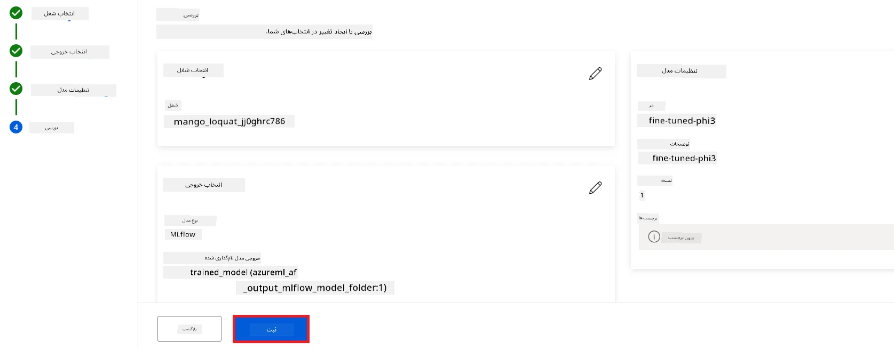

4. می‌توانید مدل ثبت‌شده خود را با رفتن به منوی **Models** در تب سمت چپ مشاهده کنید.

    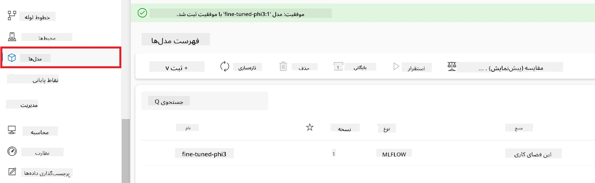

#### انتشار مدل آموزش‌دیده

1. به فضای کاری Azure Machine Learning که ایجاد کرده‌اید بروید.

1. گزینه **Endpoints** را از تب سمت چپ انتخاب کنید.

1. از منوی ناوبری گزینه **Real-time endpoints** را انتخاب کنید.

    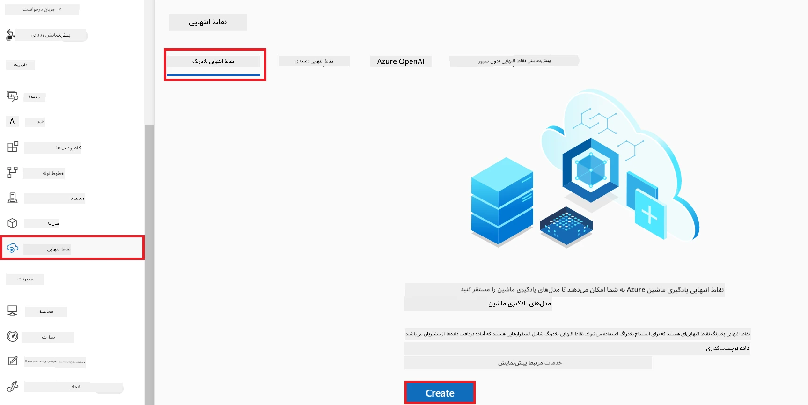

1. گزینه **Create** را انتخاب کنید.

1. مدل ثبت‌شده‌ای که ایجاد کرده‌اید را انتخاب کنید.

    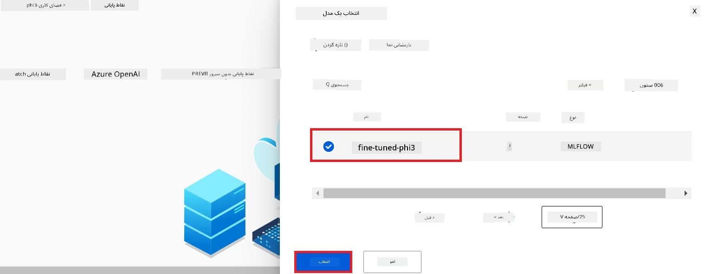

1. گزینه **Select** را انتخاب کنید.

1. انجام کارهای زیر:

    - انتخاب **Virtual machine** به *Standard_NC6s_v3*.
    - تعداد نمونه (Instance count) که قصد استفاده دارید را انتخاب کنید؛ برای مثال *1*.
    - گزینه **Endpoint** را به **New** برای ایجاد یک نقطه پایانی تنظیم کنید.
    - وارد کردن **Endpoint name** که باید مقدار منحصر به فردی باشد.
    - وارد کردن **Deployment name** که باید مقدار منحصر به فردی باشد.

    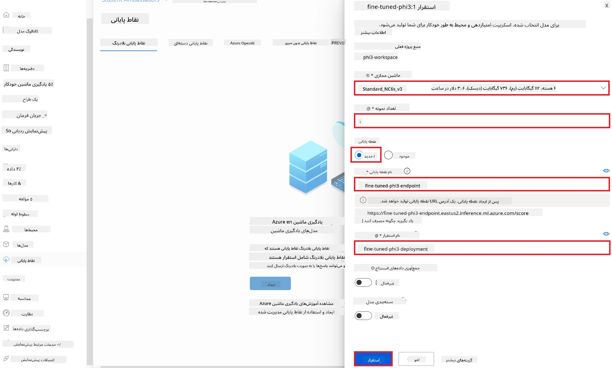

1. گزینه **Deploy** را انتخاب کنید.

> [!WARNING]
> برای جلوگیری از هزینه‌های اضافی در حساب خود، مطمئن شوید که نقطه پایانی ایجاد شده را در فضای کاری Azure Machine Learning حذف کنید.
>

#### بررسی وضعیت انتشار در فضای کاری Azure Machine Learning

1. به فضای کاری Azure Machine Learning که ایجاد کرده‌اید بروید.

1. گزینه **Endpoints** را از تب سمت چپ انتخاب کنید.

1. نقطه پایانی که ایجاد کرده‌اید را انتخاب کنید.

    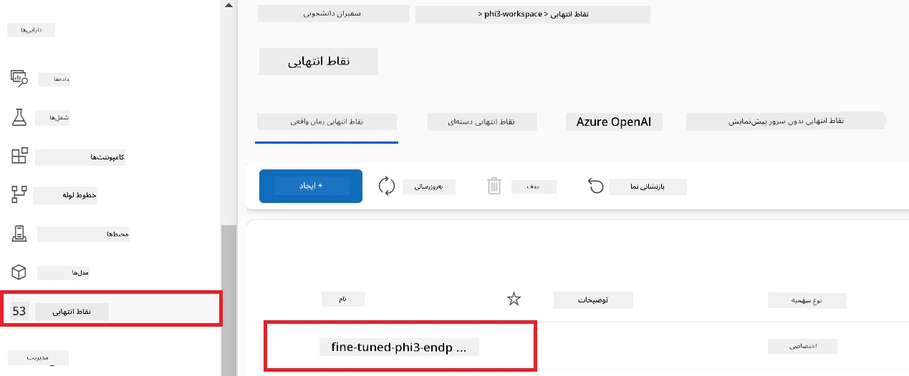

1. در این صفحه می‌توانید نقاط انتهایی را در طول فرآیند انتشار مدیریت کنید.

> [!NOTE]
> پس از اتمام انتشار، اطمینان حاصل کنید که **Live traffic** به **100%** تنظیم شده است. اگر اینطور نیست، گزینه **Update traffic** را برای تنظیم تنظیمات ترافیک انتخاب کنید. توجه داشته باشید که اگر ترافیک روی 0% باشد، نمی‌توانید مدل را تست کنید.
>
> 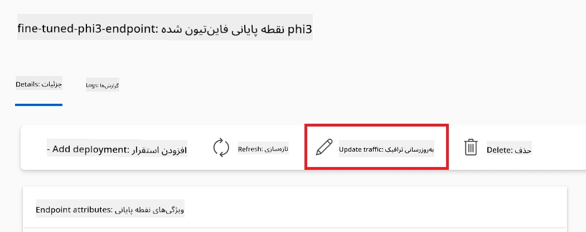
>

## سناریو ۳: ادغام با Prompt flow و گفتگو با مدل سفارشی شما در Microsoft Foundry

### ادغام مدل سفارشی Phi-3 با Prompt flow

پس از استقرار موفق مدل آموزش‌دیده خود، اکنون می‌توانید آن را با Prompt Flow ادغام کنید تا در برنامه‌های بلادرنگ خود استفاده کنید و مجموعه‌ای از وظایف تعاملی را با مدل سفارشی Phi-3 خود انجام دهید.

در این تمرین، شما:

- ایجاد Microsoft Foundry Hub.
- ایجاد پروژه Microsoft Foundry.
- ایجاد Prompt flow.
- افزودن یک اتصال سفارشی برای مدل Phi-3 آموزش‌دیده.
- راه‌اندازی Prompt flow برای گفتگو با مدل سفارشی Phi-3 شما

> [!NOTE]
> همچنین می‌توانید با استفاده از Azure ML Studio با Promptflow ادغام کنید. همان فرایند ادغام می‌تواند در Azure ML Studio نیز اعمال شود.

#### ایجاد Microsoft Foundry Hub

قبل از ایجاد پروژه، باید یک Hub ایجاد کنید. Hub مانند یک گروه منابع عمل می‌کند و به شما اجازه می‌دهد چندین پروژه را در Microsoft Foundry سازماندهی و مدیریت کنید.
1. به [Microsoft Foundry](https://ai.azure.com/?WT.mc_id=aiml-137032-kinfeylo) مراجعه کنید.

1. از برگه سمت چپ گزینه **All hubs** را انتخاب کنید.

1. از منوی ناوبری، **+ New hub** را انتخاب کنید.

    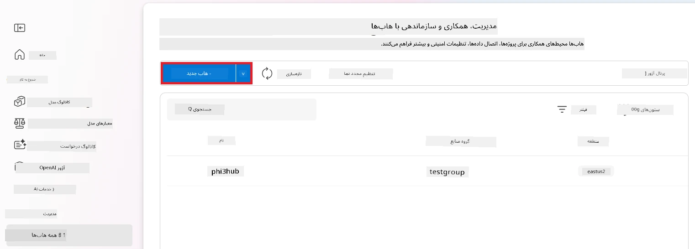

1. کارهای زیر را انجام دهید:

    - نام **Hub name** را وارد کنید. باید یک مقدار منحصر به فرد باشد.
    - اشتراک Azure خود را انتخاب کنید.
    - گروه منابع (**Resource group**) مورد استفاده را انتخاب کنید (در صورت نیاز یک گروه جدید ایجاد کنید).
    - مکان (**Location**) مورد نظر خود را انتخاب کنید.
    - سرویس‌های Azure AI که می‌خواهید به آن متصل شوید را انتخاب کنید (در صورت نیاز یک مورد جدید ایجاد کنید).
    - گزینه **Connect Azure AI Search** را روی **Skip connecting** تنظیم کنید.

    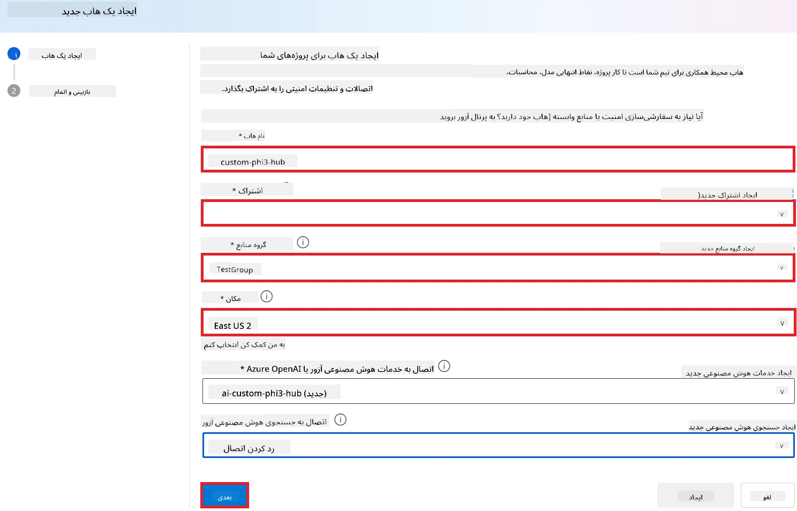

1. گزینه **Next** را انتخاب کنید.

#### ایجاد پروژه Microsoft Foundry

1. در هابی که ایجاد کرده‌اید، از برگه سمت چپ گزینه **All projects** را انتخاب کنید.

1. از منوی ناوبری، **+ New project** را انتخاب کنید.

    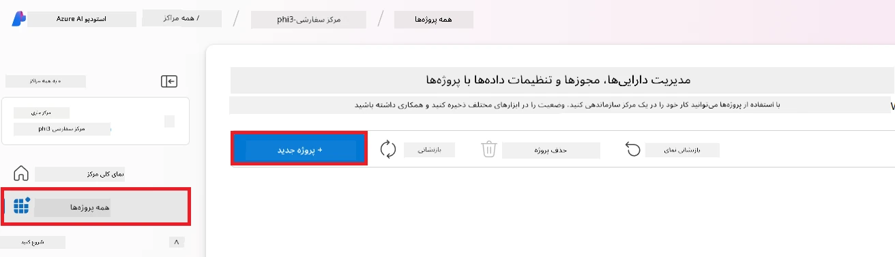

1. نام پروژه (**Project name**) را وارد کنید. باید یک مقدار منحصر به فرد باشد.

    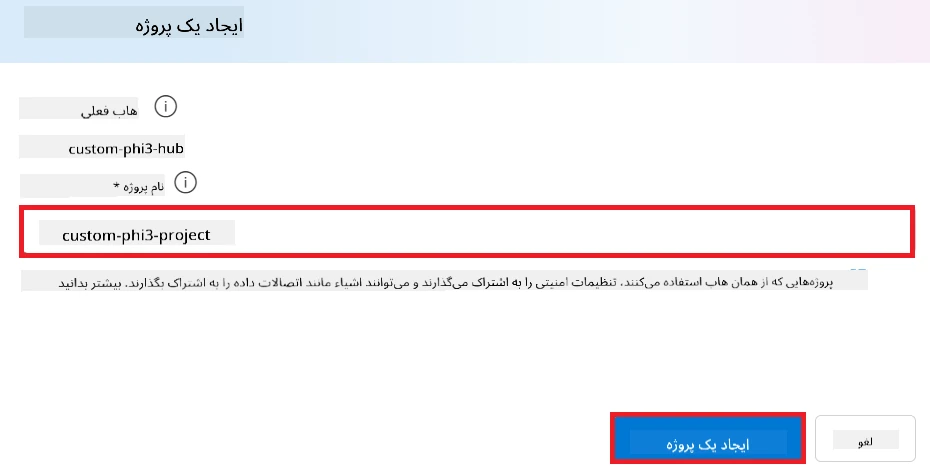

1. گزینه **Create a project** را انتخاب کنید.

#### افزودن اتصال سفارشی برای مدل Phi-3 بهینه‌سازی شده

برای ادغام مدل سفارشی Phi-3 خود با Prompt flow، باید نقطه پایان (endpoint) و کلید مدل را در یک اتصال سفارشی ذخیره کنید. این تنظیم تضمین می‌کند که در Prompt flow به مدل سفارشی Phi-3 خود دسترسی داشته باشید.

#### تنظیم کلید API و مقدار URI نقطه پایان مدل Phi-3 بهینه‌سازی شده

1. به [Azure ML Studio](https://ml.azure.com/home?WT.mc_id=aiml-137032-kinfeylo) مراجعه کنید.

1. به فضای کاری Azure Machine learning که ایجاد کرده‌اید، بروید.

1. از برگه سمت چپ گزینه **Endpoints** را انتخاب کنید.

    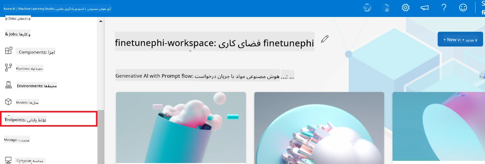

1. نقطه پایانی که ایجاد کرده‌اید را انتخاب کنید.

    

1. از منوی ناوبری، گزینه **Consume** را انتخاب کنید.

1. **REST endpoint** و **Primary key** خود را کپی کنید.

    

#### افزودن اتصال سفارشی

1. به [Microsoft Foundry](https://ai.azure.com/?WT.mc_id=aiml-137032-kinfeylo) مراجعه کنید.

1. به پروژه Microsoft Foundry که ایجاد کرده‌اید، بروید.

1. در پروژه‌ای که ایجاد کرده‌اید، از برگه سمت چپ گزینه **Settings** را انتخاب کنید.

1. گزینه **+ New connection** را انتخاب کنید.

    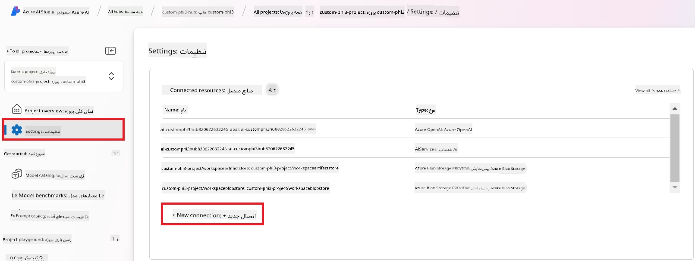

1. از منوی ناوبری گزینه **Custom keys** را انتخاب کنید.

    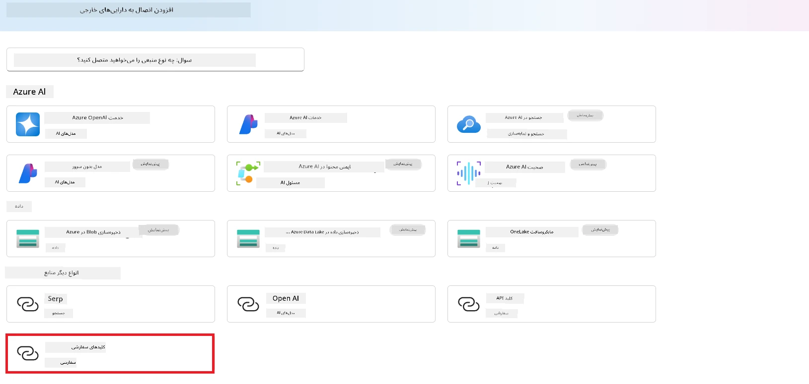

1. کارهای زیر را انجام دهید:

    - گزینه **+ Add key value pairs** را انتخاب کنید.
    - برای نام کلید، **endpoint** را وارد کرده و مقدار endpoint که از Azure ML Studio کپی کرده‌اید را در فیلد مقدار الصاق کنید.
    - مجدداً گزینه **+ Add key value pairs** را انتخاب کنید.
    - برای نام کلید، **key** را وارد کرده و کلیدی که از Azure ML Studio کپی کرده‌اید را در فیلد مقدار الصاق کنید.
    - پس از افزودن کلیدها، گزینه **is secret** را انتخاب کنید تا از نمایش کلید جلوگیری شود.

    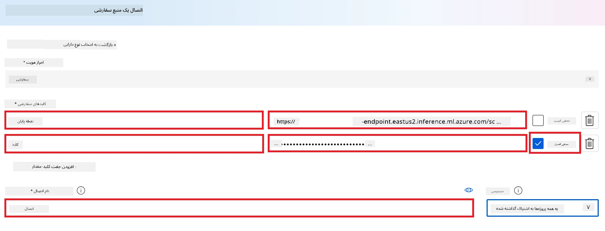

1. گزینه **Add connection** را انتخاب کنید.

#### ایجاد Prompt flow

شما یک اتصال سفارشی در Microsoft Foundry اضافه کرده‌اید. حالا بیایید یک Prompt flow با استفاده از مراحل زیر ایجاد کنیم. سپس این Prompt flow را به اتصال سفارشی متصل خواهید کرد تا بتوانید از مدل بهینه‌سازی شده در داخل Prompt flow استفاده کنید.

1. به پروژه Microsoft Foundry که ایجاد کرده‌اید بروید.

1. از برگه سمت چپ گزینه **Prompt flow** را انتخاب کنید.

1. از منوی ناوبری، گزینه **+ Create** را انتخاب کنید.

    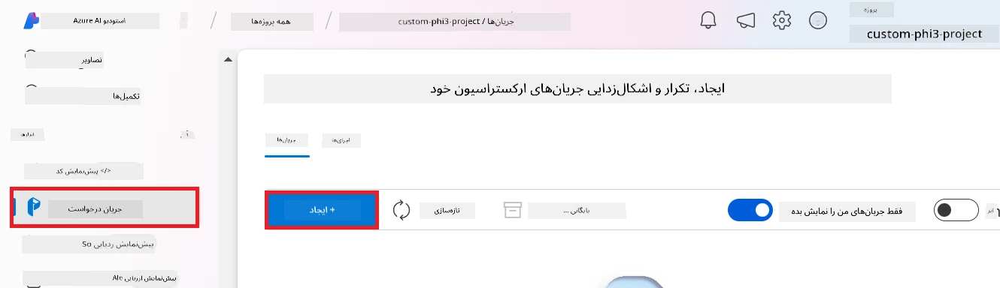

1. از منوی ناوبری، گزینه **Chat flow** را انتخاب کنید.

    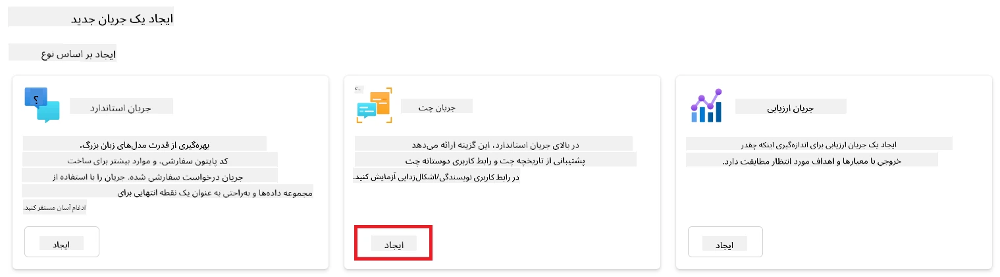

1. نام پوشه (**Folder name**) مورد استفاده را وارد کنید.

    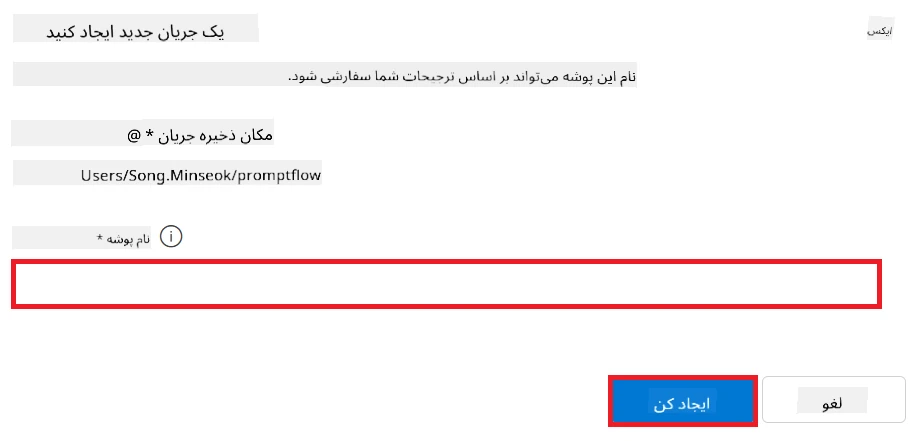

2. گزینه **Create** را انتخاب کنید.

#### راه‌اندازی Prompt flow برای چت با مدل سفارشی Phi-3 شما

باید مدل بهینه‌سازی شده Phi-3 را درون Prompt flow ادغام کنید. با این حال، Prompt flow موجود برای این منظور طراحی نشده است. بنابراین، باید Prompt flow را بازطراحی کنید تا بتوانید مدل سفارشی را به آن متصل کنید.

1. در Prompt flow، برای بازسازی جریان موجود، کارهای زیر را انجام دهید:

    - حالت **Raw file mode** را انتخاب کنید.
    - تمام کد موجود در فایل *flow.dag.yml* را حذف کنید.
    - کد زیر را به فایل *flow.dag.yml* اضافه کنید.

        ```yml
        inputs:
          input_data:
            type: string
            default: "Who founded Microsoft?"

        outputs:
          answer:
            type: string
            reference: ${integrate_with_promptflow.output}

        nodes:
        - name: integrate_with_promptflow
          type: python
          source:
            type: code
            path: integrate_with_promptflow.py
          inputs:
            input_data: ${inputs.input_data}
        ```

    - گزینه **Save** را انتخاب کنید.

    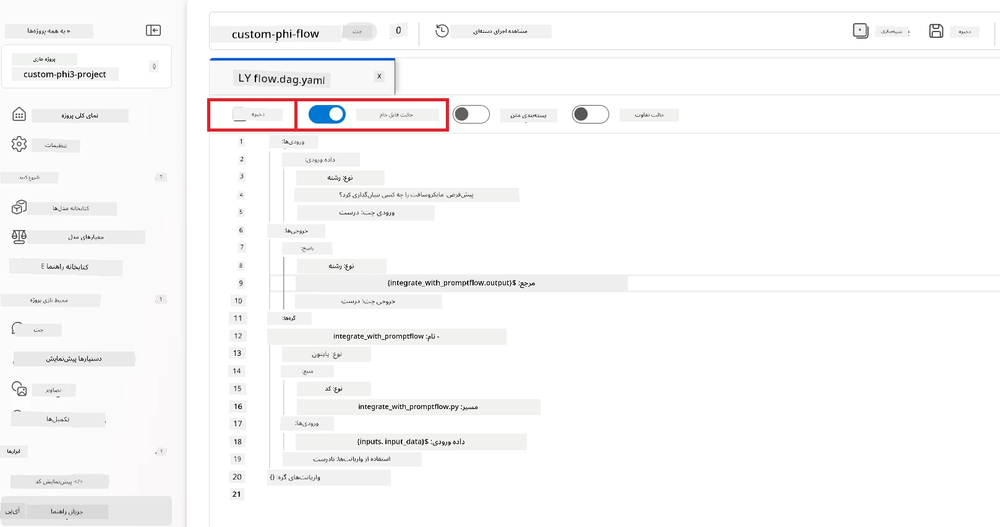

1. کد زیر را به فایل *integrate_with_promptflow.py* اضافه کنید تا از مدل سفارشی Phi-3 در Prompt flow استفاده کنید.

    ```python
    import logging
    import requests
    from promptflow import tool
    from promptflow.connections import CustomConnection

    # تنظیمات ثبت لاگ
    logging.basicConfig(
        format="%(asctime)s - %(levelname)s - %(name)s - %(message)s",
        datefmt="%Y-%m-%d %H:%M:%S",
        level=logging.DEBUG
    )
    logger = logging.getLogger(__name__)

    def query_phi3_model(input_data: str, connection: CustomConnection) -> str:
        """
        Send a request to the Phi-3 model endpoint with the given input data using Custom Connection.
        """

        # "connection" نام اتصال سفارشی است، "endpoint"، "key" کلیدهای موجود در اتصال سفارشی هستند
        endpoint_url = connection.endpoint
        api_key = connection.key

        headers = {
            "Content-Type": "application/json",
            "Authorization": f"Bearer {api_key}"
        }
        data = {
            "input_data": {
                "input_string": [
                    {"role": "user", "content": input_data}
                ],
                "parameters": {
                    "temperature": 0.7,
                    "max_new_tokens": 128
                }
            }
        }
        try:
            response = requests.post(endpoint_url, json=data, headers=headers)
            response.raise_for_status()
            
            # ثبت کامل پاسخ JSON
            logger.debug(f"Full JSON response: {response.json()}")

            result = response.json()["output"]
            logger.info("Successfully received response from Azure ML Endpoint.")
            return result
        except requests.exceptions.RequestException as e:
            logger.error(f"Error querying Azure ML Endpoint: {e}")
            raise

    @tool
    def my_python_tool(input_data: str, connection: CustomConnection) -> str:
        """
        Tool function to process input data and query the Phi-3 model.
        """
        return query_phi3_model(input_data, connection)

    ```

    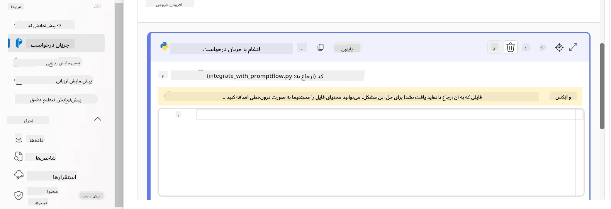

> [!NOTE]
> برای اطلاعات بیشتر در مورد استفاده از Prompt flow در Microsoft Foundry، می‌توانید به [Prompt flow in Microsoft Foundry](https://learn.microsoft.com/azure/ai-studio/how-to/prompt-flow) مراجعه کنید.

1. گزینه‌های **Chat input** و **Chat output** را برای فعال‌سازی چت با مدل خود انتخاب کنید.

    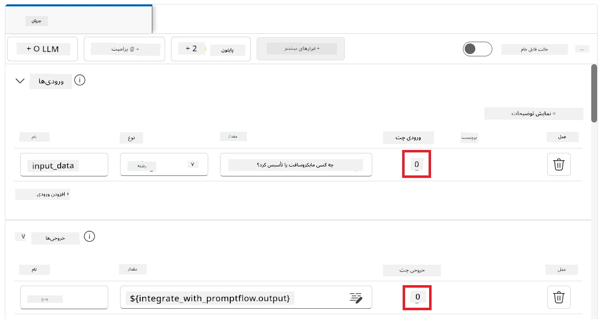

1. حالا آماده‌اید تا با مدل سفارشی Phi-3 خود چت کنید. در تمرین بعدی، نحوه راه‌اندازی Prompt flow و استفاده از آن برای چت با مدل بهینه‌سازی شده Phi-3 را خواهید آموخت.

> [!NOTE]
>
> جریان بازسازی‌شده باید شبیه تصویر زیر باشد:
>
> 
>

### چت با مدل سفارشی Phi-3 شما

اکنون که مدل سفارشی Phi-3 خود را بهینه‌سازی و با Prompt flow ادغام کرده‌اید، آماده شروع تعامل با آن هستید. این تمرین شما را در فرایند راه‌اندازی و شروع چت با مدل با استفاده از Prompt flow راهنمایی خواهد کرد. با دنبال کردن این مراحل، خواهید توانست از توانایی‌های مدل بهینه‌سازی شده Phi-3 خود برای وظایف مختلف و گفتگوها به طور کامل بهره ببرید.

- با مدل سفارشی Phi-3 خود از طریق Prompt flow چت کنید.

#### شروع Prompt flow

1. گزینه **Start compute sessions** را برای شروع Prompt flow انتخاب کنید.

    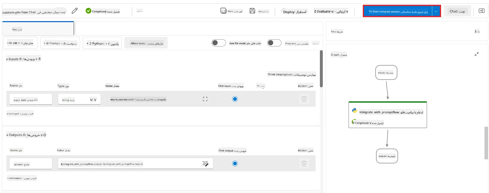

1. گزینه **Validate and parse input** را برای به‌روزرسانی پارامترها انتخاب کنید.

    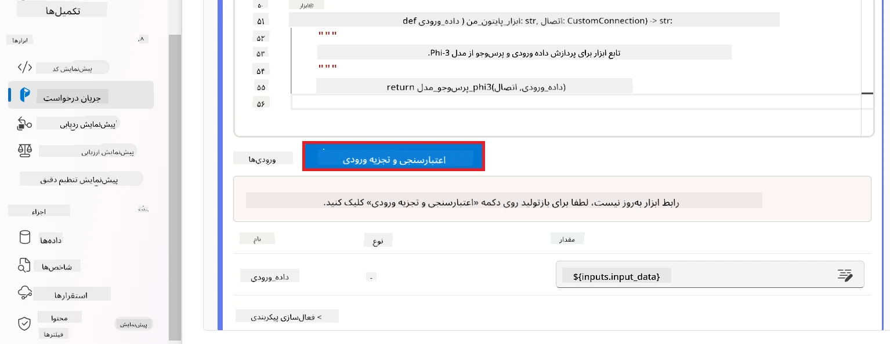

1. مقدار **Value** مربوط به **connection** را به اتصال سفارشی که ایجاد کرده‌اید تغییر دهید. مثلاً *connection*.

    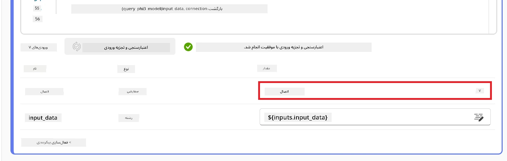

#### چت با مدل سفارشی شما

1. گزینه **Chat** را انتخاب کنید.

    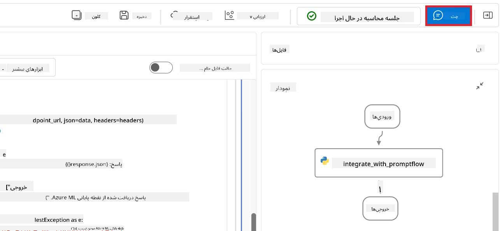

1. نمونه‌ای از نتایج: اکنون می‌توانید با مدل سفارشی Phi-3 خود چت کنید. توصیه می‌شود سوالات را بر اساس داده‌های بهینه‌سازی شده مطرح کنید.

    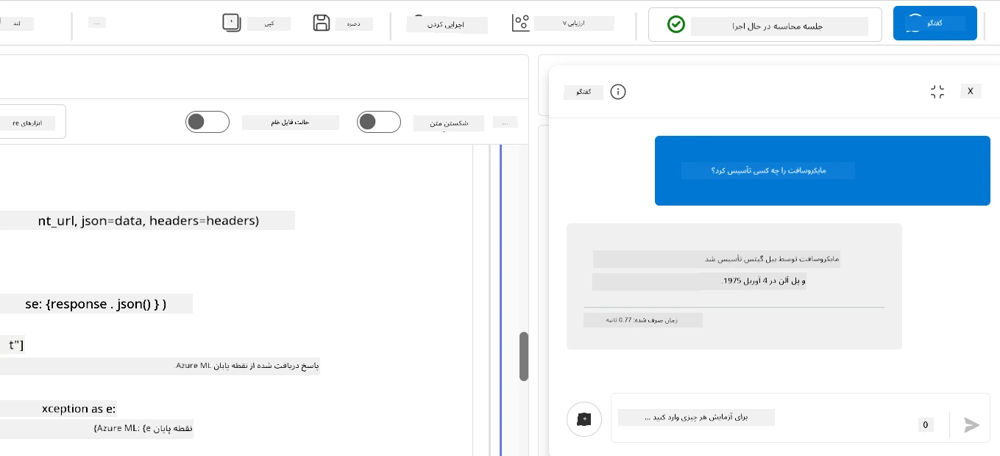

---

<!-- CO-OP TRANSLATOR DISCLAIMER START -->
**سلب مسئولیت**:  
این سند با استفاده از سرویس ترجمه هوش مصنوعی [Co-op Translator](https://github.com/Azure/co-op-translator) ترجمه شده است. در حالی که ما برای دقت تلاش می‌کنیم، لطفاً توجه داشته باشید که ترجمه‌های خودکار ممکن است شامل خطاها یا نادرستی‌هایی باشند. نسخه اصلی سند به زبان مبدا باید به عنوان منبع معتبر در نظر گرفته شود. برای اطلاعات حساس، استفاده از ترجمه حرفه‌ای انسانی توصیه می‌شود. ما مسئول هیچ گونه سوتفاهم یا تفسیر نادرستی که ناشی از استفاده از این ترجمه باشد، نیستیم.
<!-- CO-OP TRANSLATOR DISCLAIMER END -->