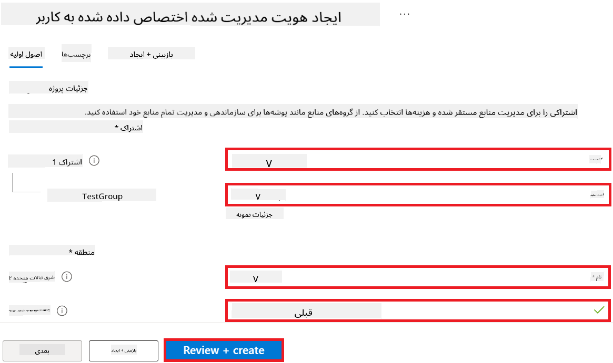
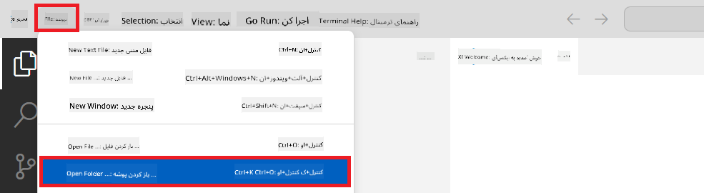

<!--
CO_OP_TRANSLATOR_METADATA:
{
  "original_hash": "ecbd9179a21edbaafaf114d47f09f3e3",
  "translation_date": "2025-05-07T14:11:41+00:00",
  "source_file": "md/02.Application/01.TextAndChat/Phi3/E2E_Phi-3-FineTuning_PromptFlow_Integration_AIFoundry.md",
  "language_code": "fa"
}
-->
# تنظیم دقیق و یکپارچه‌سازی مدل‌های سفارشی Phi-3 با Prompt flow در Azure AI Foundry

این نمونه انتها به انتها (E2E) بر اساس راهنمای "[Fine-Tune and Integrate Custom Phi-3 Models with Prompt Flow in Azure AI Foundry](https://techcommunity.microsoft.com/t5/educator-developer-blog/fine-tune-and-integrate-custom-phi-3-models-with-prompt-flow-in/ba-p/4191726?WT.mc_id=aiml-137032-kinfeylo)" از Microsoft Tech Community تهیه شده است. این آموزش فرآیندهای تنظیم دقیق، استقرار و یکپارچه‌سازی مدل‌های سفارشی Phi-3 با Prompt flow در Azure AI Foundry را معرفی می‌کند. بر خلاف نمونه E2E "[Fine-Tune and Integrate Custom Phi-3 Models with Prompt Flow](./E2E_Phi-3-FineTuning_PromptFlow_Integration.md)" که شامل اجرای کد به صورت محلی بود، این آموزش کاملاً بر روی تنظیم دقیق و یکپارچه‌سازی مدل شما در داخل Azure AI / ML Studio تمرکز دارد.

## مرور کلی

در این نمونه E2E، شما یاد می‌گیرید چگونه مدل Phi-3 را تنظیم دقیق کنید و آن را با Prompt flow در Azure AI Foundry یکپارچه نمایید. با استفاده از Azure AI / ML Studio، یک جریان کاری برای استقرار و استفاده از مدل‌های هوش مصنوعی سفارشی ایجاد خواهید کرد. این نمونه E2E به سه سناریو تقسیم شده است:

**سناریو ۱: راه‌اندازی منابع Azure و آماده‌سازی برای تنظیم دقیق**

**سناریو ۲: تنظیم دقیق مدل Phi-3 و استقرار در Azure Machine Learning Studio**

**سناریو ۳: یکپارچه‌سازی با Prompt flow و گفتگو با مدل سفارشی خود در Azure AI Foundry**

در ادامه نمای کلی این نمونه E2E آورده شده است.


### فهرست مطالب

1. **[سناریو ۱: راه‌اندازی منابع Azure و آماده‌سازی برای تنظیم دقیق](../../../../../../md/02.Application/01.TextAndChat/Phi3)**
    - [ایجاد یک فضای کاری Azure Machine Learning](../../../../../../md/02.Application/01.TextAndChat/Phi3)
    - [درخواست سهمیه GPU در اشتراک Azure](../../../../../../md/02.Application/01.TextAndChat/Phi3)
    - [افزودن تخصیص نقش](../../../../../../md/02.Application/01.TextAndChat/Phi3)
    - [راه‌اندازی پروژه](../../../../../../md/02.Application/01.TextAndChat/Phi3)
    - [آماده‌سازی مجموعه داده برای تنظیم دقیق](../../../../../../md/02.Application/01.TextAndChat/Phi3)

1. **[سناریو ۲: تنظیم دقیق مدل Phi-3 و استقرار در Azure Machine Learning Studio](../../../../../../md/02.Application/01.TextAndChat/Phi3)**
    - [تنظیم دقیق مدل Phi-3](../../../../../../md/02.Application/01.TextAndChat/Phi3)
    - [استقرار مدل Phi-3 تنظیم دقیق شده](../../../../../../md/02.Application/01.TextAndChat/Phi3)

1. **[سناریو ۳: یکپارچه‌سازی با Prompt flow و گفتگو با مدل سفارشی خود در Azure AI Foundry](../../../../../../md/02.Application/01.TextAndChat/Phi3)**
    - [یکپارچه‌سازی مدل سفارشی Phi-3 با Prompt flow](../../../../../../md/02.Application/01.TextAndChat/Phi3)
    - [گفتگو با مدل سفارشی Phi-3 خود](../../../../../../md/02.Application/01.TextAndChat/Phi3)

## سناریو ۱: راه‌اندازی منابع Azure و آماده‌سازی برای تنظیم دقیق

### ایجاد یک فضای کاری Azure Machine Learning

1. در **نوار جستجو** بالای صفحه پرتال، عبارت *azure machine learning* را تایپ کنید و از گزینه‌های ظاهر شده **Azure Machine Learning** را انتخاب کنید.

    

2. از منوی ناوبری، گزینه **+ Create** را انتخاب کنید.

3. از منوی ناوبری، **New workspace** را انتخاب کنید.

    

4. موارد زیر را انجام دهید:

    - اشتراک Azure خود را انتخاب کنید.
    - گروه منابع (Resource group) مورد نظر را انتخاب کنید (در صورت نیاز یک گروه جدید بسازید).
    - نام فضای کاری (Workspace Name) را وارد کنید. این نام باید منحصر به فرد باشد.
    - منطقه (Region) مورد نظر خود را انتخاب کنید.
    - حساب ذخیره‌سازی (Storage account) مورد استفاده را انتخاب کنید (در صورت نیاز یک حساب جدید بسازید).
    - مخزن کلید (Key vault) مورد استفاده را انتخاب کنید (در صورت نیاز یک مخزن جدید بسازید).
    - Application insights مورد استفاده را انتخاب کنید (در صورت نیاز یک نمونه جدید بسازید).
    - مخزن کانتینر (Container registry) مورد استفاده را انتخاب کنید (در صورت نیاز یک مخزن جدید بسازید).

    

5. روی **Review + Create** کلیک کنید.

6. سپس **Create** را انتخاب کنید.

### درخواست سهمیه GPU در اشتراک Azure

در این آموزش، شما یاد می‌گیرید چگونه مدل Phi-3 را با استفاده از GPUها تنظیم دقیق و استقرار دهید. برای تنظیم دقیق، از GPU نوع *Standard_NC24ads_A100_v4* استفاده می‌کنید که نیاز به درخواست سهمیه دارد. برای استقرار نیز از GPU نوع *Standard_NC6s_v3* استفاده می‌شود که آن هم نیاز به درخواست سهمیه دارد.

> [!NOTE]
>
> فقط اشتراک‌های Pay-As-You-Go (نوع اشتراک استاندارد) برای تخصیص GPU واجد شرایط هستند؛ اشتراک‌های بهره‌مند در حال حاضر پشتیبانی نمی‌شوند.
>

1. به [Azure ML Studio](https://ml.azure.com/home?wt.mc_id=studentamb_279723) مراجعه کنید.

1. برای درخواست سهمیه *Standard NCADSA100v4 Family* مراحل زیر را انجام دهید:

    - از تب سمت چپ **Quota** را انتخاب کنید.
    - خانواده ماشین مجازی مورد نظر را انتخاب کنید. به عنوان مثال، **Standard NCADSA100v4 Family Cluster Dedicated vCPUs** که شامل GPU *Standard_NC24ads_A100_v4* است.
    - از منوی ناوبری، **Request quota** را انتخاب کنید.

        

    - در صفحه درخواست سهمیه، مقدار **New cores limit** مورد نظر خود را وارد کنید، مثلاً ۲۴.
    - در همان صفحه، روی **Submit** کلیک کنید تا درخواست سهمیه GPU ثبت شود.

1. برای درخواست سهمیه *Standard NCSv3 Family* مراحل زیر را انجام دهید:

    - از تب سمت چپ **Quota** را انتخاب کنید.
    - خانواده ماشین مجازی مورد نظر را انتخاب کنید. به عنوان مثال، **Standard NCSv3 Family Cluster Dedicated vCPUs** که شامل GPU *Standard_NC6s_v3* است.
    - از منوی ناوبری، **Request quota** را انتخاب کنید.
    - مقدار **New cores limit** مورد نظر خود را وارد کنید، مثلاً ۲۴.
    - روی **Submit** کلیک کنید تا درخواست سهمیه GPU ثبت شود.

### افزودن تخصیص نقش

برای تنظیم دقیق و استقرار مدل‌های خود، ابتدا باید یک Managed Identity اختصاص داده شده به کاربر (User Assigned Managed Identity یا UAI) ایجاد کرده و مجوزهای لازم را به آن اختصاص دهید. این UAI برای احراز هویت در هنگام استقرار استفاده خواهد شد.

#### ایجاد User Assigned Managed Identity (UAI)

1. در **نوار جستجو** بالای صفحه پرتال، عبارت *managed identities* را تایپ کرده و از گزینه‌های ظاهر شده **Managed Identities** را انتخاب کنید.

    

1. روی **+ Create** کلیک کنید.

    

1. موارد زیر را انجام دهید:

    - اشتراک Azure خود را انتخاب کنید.
    - گروه منابع (Resource group) مورد نظر را انتخاب کنید (در صورت نیاز یک گروه جدید بسازید).
    - منطقه (Region) مورد نظر را انتخاب کنید.
    - نامی منحصر به فرد وارد کنید.

    

1. روی **Review + create** کلیک کنید.

1. سپس **+ Create** را انتخاب کنید.

#### افزودن تخصیص نقش Contributor به Managed Identity

1. به منبع Managed Identity که ایجاد کرده‌اید بروید.

1. از تب سمت چپ، **Azure role assignments** را انتخاب کنید.

1. از منوی ناوبری، **+Add role assignment** را انتخاب کنید.

1. در صفحه افزودن تخصیص نقش، موارد زیر را انجام دهید:
    - **Scope** را روی **Resource group** تنظیم کنید.
    - اشتراک Azure خود را انتخاب کنید.
    - گروه منابع مورد استفاده را انتخاب کنید.
    - نقش (Role) را روی **Contributor** تنظیم کنید.

    

2. روی **Save** کلیک کنید.

#### افزودن تخصیص نقش Storage Blob Data Reader به Managed Identity

1. در **نوار جستجو** بالای صفحه پرتال، عبارت *storage accounts* را تایپ کرده و از گزینه‌های ظاهر شده **Storage accounts** را انتخاب کنید.

    

1. حساب ذخیره‌سازی مرتبط با فضای کاری Azure Machine Learning که ایجاد کرده‌اید را انتخاب کنید. برای مثال، *finetunephistorage*.

1. برای رفتن به صفحه افزودن تخصیص نقش، مراحل زیر را انجام دهید:

    - به حساب ذخیره‌سازی Azure که ایجاد کرده‌اید بروید.
    - از تب سمت چپ، **Access Control (IAM)** را انتخاب کنید.
    - از منوی ناوبری، **+ Add** را انتخاب کنید.
    - سپس **Add role assignment** را انتخاب کنید.

    

1. در صفحه افزودن تخصیص نقش، موارد زیر را انجام دهید:

    - در صفحه نقش (Role)، عبارت *Storage Blob Data Reader* را در **نوار جستجو** وارد کرده و از گزینه‌های ظاهر شده **Storage Blob Data Reader** را انتخاب کنید.
    - روی **Next** کلیک کنید.
    - در صفحه اعضا (Members)، گزینه **Assign access to** را روی **Managed identity** تنظیم کنید.
    - روی **+ Select members** کلیک کنید.
    - در صفحه انتخاب Managed Identity، اشتراک Azure خود را انتخاب کنید.
    - Managed identity مورد نظر را انتخاب کنید.
    - Managed Identity که ایجاد کرده‌اید را انتخاب کنید. برای مثال، *finetunephi-managedidentity*.
    - روی **Select** کلیک کنید.

    

1. روی **Review + assign** کلیک کنید.

#### افزودن تخصیص نقش AcrPull به Managed Identity

1. در **نوار جستجو** بالای صفحه پرتال، عبارت *container registries* را تایپ کرده و از گزینه‌های ظاهر شده **Container registries** را انتخاب کنید.

    

1. مخزن کانتینری که مرتبط با فضای کاری Azure Machine Learning است را انتخاب کنید. برای مثال، *finetunephicontainerregistry*.

1. برای رفتن به صفحه افزودن تخصیص نقش، مراحل زیر را انجام دهید:

    - از تب سمت چپ، **Access Control (IAM)** را انتخاب کنید.
    - از منوی ناوبری، **+ Add** را انتخاب کنید.
    - سپس **Add role assignment** را انتخاب کنید.

1. در صفحه افزودن تخصیص نقش، موارد زیر را انجام دهید:

    - در صفحه نقش (Role)، عبارت *AcrPull* را در **نوار جستجو** وارد کرده و از گزینه‌های ظاهر شده **AcrPull** را انتخاب کنید.
    - روی **Next** کلیک کنید.
    - در صفحه اعضا (Members)، گزینه **Assign access to** را روی **Managed identity** تنظیم کنید.
    - روی **+ Select members** کلیک کنید.
    - اشتراک Azure خود را انتخاب کنید.
    - Managed identity مورد نظر را انتخاب کنید.
    - Managed Identity که ایجاد کرده‌اید را انتخاب کنید. برای مثال، *finetunephi-managedidentity*.
    - روی **Select** کلیک کنید.
    - روی **Review + assign** کلیک کنید.

### راه‌اندازی پروژه

برای دانلود مجموعه داده‌های مورد نیاز برای تنظیم دقیق، باید یک محیط محلی راه‌اندازی کنید.

در این تمرین، شما:

- یک پوشه برای کار ایجاد می‌کنید.
- یک محیط مجازی ایجاد می‌کنید.
- بسته‌های مورد نیاز را نصب می‌کنید.
- یک فایل *download_dataset.py* برای دانلود مجموعه داده ایجاد می‌کنید.

#### ایجاد پوشه‌ای برای کار

1. یک پنجره ترمینال باز کنید و دستور زیر را برای ایجاد پوشه‌ای به نام *finetune-phi* در مسیر پیش‌فرض وارد کنید.

    ```console
    mkdir finetune-phi
    ```

2. دستور زیر را در ترمینال وارد کنید تا به پوشه *finetune-phi* که ایجاد کرده‌اید بروید.

    ```console
    cd finetune-phi
    ```

#### ایجاد محیط مجازی

1. دستور زیر را در ترمینال وارد کنید تا محیط مجازی‌ای به نام *.venv* ایجاد شود.

    ```console
    python -m venv .venv
    ```

2. دستور زیر را برای فعال‌سازی محیط مجازی وارد کنید.

    ```console
    .venv\Scripts\activate.bat
    ```

> [!NOTE]
> اگر موفق بود، باید *(.venv)* قبل از خط فرمان نمایش داده شود.

#### نصب بسته‌های مورد نیاز

1. دستورات زیر را در ترمینال وارد کنید تا بسته‌های مورد نیاز نصب شوند.

    ```console
    pip install datasets==2.19.1
    ```

#### ایجاد `download_dataset.py`

> [!NOTE]
> ساختار کامل پوشه:
>
> ```text
> └── YourUserName
> .    └── finetune-phi
> .        └── download_dataset.py
> ```

1. **Visual Studio Code** را باز کنید.

1. از نوار منو، **File** را انتخاب کنید.

1. گزینه **Open Folder** را انتخاب کنید.

1. پوشه *finetune-phi* که ایجاد کرده‌اید را انتخاب کنید، که معمولاً در مسیر *C:\Users\yourUserName\finetune-phi* قرار دارد.

    

1. در پنل سمت چپ Visual Studio Code، راست‌کلیک کرده و **New File** را انتخاب کنید تا فایل جدیدی به نام *download_dataset.py* ایجاد شود.

    

### آماده‌سازی مجموعه داده برای تنظیم دقیق

در این تمرین، فایل *download_dataset.py* را اجرا می‌کنید تا مجموعه داده‌های *ultrachat_200k* را به محیط محلی خود دانلود کنید. سپس از این مجموعه داده‌ها برای تنظیم دقیق مدل Phi-3 در Azure Machine Learning استفاده خواهید کرد.

در این تمرین، شما:

- کد لازم را به فایل *download_dataset.py* اضافه می‌کنید تا مجموعه داده‌ها دانلود شوند.
- فایل *download_dataset.py* را اجرا می‌کنید تا مجموعه داده‌ها به محیط محلی شما منتقل شوند.

#### دانلود مجموعه داده با استفاده از *download_dataset.py*

1. فایل *download_dataset.py* را در Visual Studio Code باز کنید.

1. کد زیر را در فایل *download_dataset.py* وارد کنید.

    ```python
    import json
    import os
    from datasets import load_dataset

    def load_and_split_dataset(dataset_name, config_name, split_ratio):
        """
        Load and split a dataset.
        """
        # Load the dataset with the specified name, configuration, and split ratio
        dataset = load_dataset(dataset_name, config_name, split=split_ratio)
        print(f"Original dataset size: {len(dataset)}")
        
        # Split the dataset into train and test sets (80% train, 20% test)
        split_dataset = dataset.train_test_split(test_size=0.2)
        print(f"Train dataset size: {len(split_dataset['train'])}")
        print(f"Test dataset size: {len(split_dataset['test'])}")
        
        return split_dataset

    def save_dataset_to_jsonl(dataset, filepath):
        """
        Save a dataset to a JSONL file.
        """
        # Create the directory if it does not exist
        os.makedirs(os.path.dirname(filepath), exist_ok=True)
        
        # Open the file in write mode
        with open(filepath, 'w', encoding='utf-8') as f:
            # Iterate over each record in the dataset
            for record in dataset:
                # Dump the record as a JSON object and write it to the file
                json.dump(record, f)
                # Write a newline character to separate records
                f.write('\n')
        
        print(f"Dataset saved to {filepath}")

    def main():
        """
        Main function to load, split, and save the dataset.
        """
        # Load and split the ULTRACHAT_200k dataset with a specific configuration and split ratio
        dataset = load_and_split_dataset("HuggingFaceH4/ultrachat_200k", 'default', 'train_sft[:1%]')
        
        # Extract the train and test datasets from the split
        train_dataset = dataset['train']
        test_dataset = dataset['test']

        # Save the train dataset to a JSONL file
        save_dataset_to_jsonl(train_dataset, "data/train_data.jsonl")
        
        # Save the test dataset to a separate JSONL file
        save_dataset_to_jsonl(test_dataset, "data/test_data.jsonl")

    if __name__ == "__main__":
        main()

    ```

1. دستور زیر را در ترمینال وارد کنید تا اسکریپت اجرا شده و مجموعه داده به محیط محلی شما دانلود شود.

    ```console
    python download_dataset.py
    ```

1. مطمئن شوید که مجموعه داده‌ها با موفقیت در دایرکتوری محلی *finetune-phi/data* ذخیره شده‌اند.

> [!NOTE]
>
> #### نکته درباره حجم مجموعه داده و زمان تنظیم دقیق
>
> در این آموزش، تنها از ۱٪ مجموعه داده استفاده می‌کنید (`split='train[:1%]'`). این کار حجم داده‌ها را به طور قابل توجهی کاهش می‌دهد و سرعت آپلود و فرآیند تنظیم دقیق را افزایش می‌دهد. می‌توانید درصد را تنظیم کنید تا تعادل مناسبی بین زمان آموزش و عملکرد مدل پیدا کنید. استفاده از زیرمجموعه کوچکتر از داده‌ها، زمان مورد نیاز برای تنظیم دقیق را کاهش می‌دهد و این فرآیند را برای آموزش قابل مدیریت‌تر می‌کند.

## سناریو ۲: تنظیم دقیق مدل Phi-3 و استقرار در Azure Machine Learning Studio

### تنظیم دقیق مدل Phi-3

در این تمرین، مدل Phi-3 را در Azure Machine Learning Studio تنظیم دقیق خواهید کرد.

در این تمرین، شما:

- خوشه کامپیوتری برای تنظیم دقیق ایجاد می‌کنید.
- مدل Phi-3 را در Azure Machine Learning Studio تنظیم دقیق می‌کنید.

#### ایجاد خوشه کامپیوتری برای تنظیم دقیق
۱. به [Azure ML Studio](https://ml.azure.com/home?wt.mc_id=studentamb_279723) مراجعه کنید.

۱. از تب سمت چپ، **Compute** را انتخاب کنید.

۱. از منوی ناوبری، **Compute clusters** را انتخاب کنید.

۱. روی **+ New** کلیک کنید.

    

۱. کارهای زیر را انجام دهید:

    - منطقه (**Region**) مورد نظر خود را انتخاب کنید.
    - سطح ماشین مجازی (**Virtual machine tier**) را روی **Dedicated** تنظیم کنید.
    - نوع ماشین مجازی (**Virtual machine type**) را روی **GPU** تنظیم کنید.
    - فیلتر اندازه ماشین مجازی (**Virtual machine size**) را روی **Select from all options** تنظیم کنید.
    - اندازه ماشین مجازی (**Virtual machine size**) را روی **Standard_NC24ads_A100_v4** انتخاب کنید.

    

۱. روی **Next** کلیک کنید.

۱. کارهای زیر را انجام دهید:

    - نام کامپیوتر (**Compute name**) را وارد کنید. باید یکتا باشد.
    - حداقل تعداد نودها (**Minimum number of nodes**) را روی **0** تنظیم کنید.
    - حداکثر تعداد نودها (**Maximum number of nodes**) را روی **1** تنظیم کنید.
    - زمان بیکاری قبل از کاهش مقیاس (**Idle seconds before scale down**) را روی **120** تنظیم کنید.

    

۱. روی **Create** کلیک کنید.

#### تنظیم دقیق مدل Phi-3

۱. به [Azure ML Studio](https://ml.azure.com/home?wt.mc_id=studentamb_279723) مراجعه کنید.

۱. فضای کاری Azure Machine Learning که ایجاد کرده‌اید را انتخاب کنید.

    

۱. کارهای زیر را انجام دهید:

    - از تب سمت چپ، **Model catalog** را انتخاب کنید.
    - عبارت *phi-3-mini-4k* را در **نوار جستجو** تایپ کرده و گزینه **Phi-3-mini-4k-instruct** را انتخاب کنید.

    

۱. از منوی ناوبری، **Fine-tune** را انتخاب کنید.

    

۱. کارهای زیر را انجام دهید:

    - نوع کار (**Select task type**) را روی **Chat completion** تنظیم کنید.
    - روی **+ Select data** کلیک کرده و **داده‌های آموزش** را بارگذاری کنید.
    - نوع بارگذاری داده‌های اعتبارسنجی (**Validation data upload type**) را روی **Provide different validation data** تنظیم کنید.
    - روی **+ Select data** کلیک کرده و **داده‌های اعتبارسنجی** را بارگذاری کنید.

    

    > [!TIP]
    >
    > می‌توانید با انتخاب **Advanced settings**، تنظیماتی مانند **learning_rate** و **lr_scheduler_type** را به دلخواه تغییر دهید تا فرایند تنظیم دقیق بهینه شود.

۱. روی **Finish** کلیک کنید.

۱. در این تمرین، مدل Phi-3 را با موفقیت با استفاده از Azure Machine Learning تنظیم دقیق کردید. توجه داشته باشید که فرایند تنظیم دقیق ممکن است زمان قابل توجهی طول بکشد. پس از اجرای کار تنظیم دقیق، باید منتظر بمانید تا تکمیل شود. می‌توانید وضعیت کار تنظیم دقیق را با مراجعه به تب Jobs در سمت چپ فضای کاری Azure Machine Learning خود پیگیری کنید. در سری بعدی، مدل تنظیم شده را مستقر کرده و آن را با Prompt flow یکپارچه خواهید کرد.

    

### استقرار مدل Phi-3 تنظیم شده

برای ادغام مدل Phi-3 تنظیم شده با Prompt flow، باید مدل را مستقر کنید تا برای استنتاج در زمان واقعی قابل دسترسی باشد. این فرایند شامل ثبت مدل، ایجاد یک نقطه انتهایی آنلاین و استقرار مدل است.

در این تمرین، شما:

- مدل تنظیم شده را در فضای کاری Azure Machine Learning ثبت می‌کنید.
- یک نقطه انتهایی آنلاین ایجاد می‌کنید.
- مدل Phi-3 تنظیم شده ثبت شده را مستقر می‌کنید.

#### ثبت مدل تنظیم شده

۱. به [Azure ML Studio](https://ml.azure.com/home?wt.mc_id=studentamb_279723) مراجعه کنید.

۱. فضای کاری Azure Machine Learning که ایجاد کرده‌اید را انتخاب کنید.

    

۱. از تب سمت چپ، **Models** را انتخاب کنید.
۱. روی **+ Register** کلیک کنید.
۱. گزینه **From a job output** را انتخاب کنید.

    

۱. کاری که ایجاد کرده‌اید را انتخاب کنید.

    

۱. روی **Next** کلیک کنید.

۱. نوع مدل (**Model type**) را روی **MLflow** تنظیم کنید.

۱. اطمینان حاصل کنید که **Job output** انتخاب شده است؛ این گزینه به صورت خودکار انتخاب می‌شود.

    

۲. روی **Next** کلیک کنید.

۳. روی **Register** کلیک کنید.

    

۴. می‌توانید مدل ثبت شده خود را با مراجعه به منوی **Models** در تب سمت چپ مشاهده کنید.

    

#### استقرار مدل تنظیم شده

۱. به فضای کاری Azure Machine Learning که ایجاد کرده‌اید مراجعه کنید.

۱. از تب سمت چپ، **Endpoints** را انتخاب کنید.

۱. از منوی ناوبری، **Real-time endpoints** را انتخاب کنید.

    

۱. روی **Create** کلیک کنید.

۱. مدل ثبت شده‌ای که ایجاد کرده‌اید را انتخاب کنید.

    

۱. روی **Select** کلیک کنید.

۱. کارهای زیر را انجام دهید:

    - ماشین مجازی (**Virtual machine**) را روی *Standard_NC6s_v3* تنظیم کنید.
    - تعداد نمونه‌ها (**Instance count**) مورد نظر خود را انتخاب کنید؛ مثلاً *1*.
    - نقطه انتهایی (**Endpoint**) را روی **New** تنظیم کنید تا یک نقطه انتهایی جدید ایجاد شود.
    - نام نقطه انتهایی (**Endpoint name**) را وارد کنید. باید یکتا باشد.
    - نام استقرار (**Deployment name**) را وارد کنید. باید یکتا باشد.

    

۱. روی **Deploy** کلیک کنید.

> [!WARNING]
> برای جلوگیری از هزینه‌های اضافی در حساب خود، حتماً نقطه انتهایی ایجاد شده را در فضای کاری Azure Machine Learning حذف کنید.
>

#### بررسی وضعیت استقرار در فضای کاری Azure Machine Learning

۱. به فضای کاری Azure Machine Learning که ایجاد کرده‌اید مراجعه کنید.

۱. از تب سمت چپ، **Endpoints** را انتخاب کنید.

۱. نقطه انتهایی که ایجاد کرده‌اید را انتخاب کنید.

    

۱. در این صفحه می‌توانید نقطه‌های انتهایی را در طول فرایند استقرار مدیریت کنید.

> [!NOTE]
> پس از اتمام استقرار، مطمئن شوید که **Live traffic** روی **100%** تنظیم شده است. اگر اینطور نیست، روی **Update traffic** کلیک کنید تا تنظیمات ترافیک را اصلاح کنید. توجه داشته باشید که اگر ترافیک روی ۰٪ باشد، نمی‌توانید مدل را تست کنید.
>
> 
>

## سناریو ۳: ادغام با Prompt flow و گفتگو با مدل سفارشی شما در Azure AI Foundry

### ادغام مدل سفارشی Phi-3 با Prompt flow

پس از استقرار موفق مدل تنظیم شده، اکنون می‌توانید آن را با Prompt Flow ادغام کنید تا از مدل خود در برنامه‌های زمان واقعی استفاده کنید و انواع وظایف تعاملی را با مدل سفارشی Phi-3 خود انجام دهید.

در این تمرین، شما:

- ایجاد Azure AI Foundry Hub.
- ایجاد پروژه Azure AI Foundry.
- ایجاد Prompt flow.
- افزودن اتصال سفارشی برای مدل Phi-3 تنظیم شده.
- راه‌اندازی Prompt flow برای گفتگو با مدل سفارشی Phi-3 خود.

> [!NOTE]
> همچنین می‌توانید با استفاده از Azure ML Studio با Promptflow ادغام شوید. همان فرایند ادغام را می‌توان در Azure ML Studio نیز به کار برد.

#### ایجاد Azure AI Foundry Hub

قبل از ایجاد پروژه، باید یک Hub بسازید. Hub مانند یک Resource Group عمل می‌کند و به شما امکان می‌دهد چندین پروژه را در Azure AI Foundry سازماندهی و مدیریت کنید.

۱. به [Azure AI Foundry](https://ai.azure.com/?WT.mc_id=aiml-137032-kinfeylo) مراجعه کنید.

۱. از تب سمت چپ، **All hubs** را انتخاب کنید.

۱. از منوی ناوبری، روی **+ New hub** کلیک کنید.

    

۱. کارهای زیر را انجام دهید:

    - نام هاب (**Hub name**) را وارد کنید. باید یکتا باشد.
    - اشتراک Azure خود را انتخاب کنید.
    - گروه منابع (**Resource group**) مورد نظر را انتخاب کنید (در صورت نیاز یک گروه جدید ایجاد کنید).
    - منطقه (**Location**) مورد نظر خود را انتخاب کنید.
    - سرویس‌های Azure AI مورد اتصال را انتخاب کنید (در صورت نیاز یک اتصال جدید ایجاد کنید).
    - اتصال Azure AI Search را روی **Skip connecting** تنظیم کنید.

    

۱. روی **Next** کلیک کنید.

#### ایجاد پروژه Azure AI Foundry

۱. در هاب ایجاد شده، از تب سمت چپ، **All projects** را انتخاب کنید.

۱. از منوی ناوبری، روی **+ New project** کلیک کنید.

    

۱. نام پروژه (**Project name**) را وارد کنید. باید یکتا باشد.

    

۱. روی **Create a project** کلیک کنید.

#### افزودن اتصال سفارشی برای مدل Phi-3 تنظیم شده

برای ادغام مدل سفارشی Phi-3 با Prompt flow، باید نقطه انتهایی و کلید مدل را در یک اتصال سفارشی ذخیره کنید. این تنظیم دسترسی به مدل سفارشی Phi-3 شما در Prompt flow را ممکن می‌سازد.

#### تنظیم api key و آدرس endpoint مدل Phi-3 تنظیم شده

۱. به [Azure ML Studio](https://ml.azure.com/home?WT.mc_id=aiml-137032-kinfeylo) مراجعه کنید.

۱. به فضای کاری Azure Machine Learning که ایجاد کرده‌اید بروید.

۱. از تب سمت چپ، **Endpoints** را انتخاب کنید.

    

۱. نقطه انتهایی که ایجاد کرده‌اید را انتخاب کنید.

    

۱. از منوی ناوبری، **Consume** را انتخاب کنید.

۱. **REST endpoint** و **Primary key** خود را کپی کنید.


#### افزودن اتصال سفارشی

1. به [Azure AI Foundry](https://ai.azure.com/?WT.mc_id=aiml-137032-kinfeylo) مراجعه کنید.

1. به پروژه Azure AI Foundry که ایجاد کرده‌اید بروید.

1. در پروژه‌ای که ایجاد کرده‌اید، از تب سمت چپ **Settings** را انتخاب کنید.

1. گزینه **+ New connection** را انتخاب کنید.

    

1. از منوی ناوبری، **Custom keys** را انتخاب کنید.

    

1. کارهای زیر را انجام دهید:

    - گزینه **+ Add key value pairs** را انتخاب کنید.
    - برای نام کلید، **endpoint** را وارد کنید و آدرس endpoint که از Azure ML Studio کپی کرده‌اید را در فیلد مقدار بچسبانید.
    - دوباره **+ Add key value pairs** را انتخاب کنید.
    - برای نام کلید، **key** را وارد کنید و کلیدی که از Azure ML Studio کپی کرده‌اید را در فیلد مقدار بچسبانید.
    - پس از افزودن کلیدها، گزینه **is secret** را فعال کنید تا کلیدها مخفی بمانند و نمایش داده نشوند.

    

1. گزینه **Add connection** را انتخاب کنید.

#### ایجاد Prompt flow

شما یک اتصال سفارشی در Azure AI Foundry اضافه کرده‌اید. حالا بیایید با مراحل زیر یک Prompt flow ایجاد کنیم. سپس این Prompt flow را به اتصال سفارشی متصل می‌کنید تا بتوانید از مدل فاین‌تیون‌شده در داخل Prompt flow استفاده کنید.

1. به پروژه Azure AI Foundry که ایجاد کرده‌اید بروید.

1. از تب سمت چپ، **Prompt flow** را انتخاب کنید.

1. از منوی ناوبری، **+ Create** را انتخاب کنید.

    

1. از منوی ناوبری، **Chat flow** را انتخاب کنید.

    

1. نام پوشه‌ای که می‌خواهید استفاده کنید را وارد کنید.

    

2. گزینه **Create** را انتخاب کنید.

#### تنظیم Prompt flow برای چت با مدل سفارشی Phi-3 شما

شما باید مدل فاین‌تیون‌شده Phi-3 را در یک Prompt flow ادغام کنید. با این حال، Prompt flow موجود برای این منظور طراحی نشده است. بنابراین باید Prompt flow را بازطراحی کنید تا بتوانید مدل سفارشی را در آن بگنجانید.

1. در Prompt flow، کارهای زیر را برای بازسازی جریان موجود انجام دهید:

    - گزینه **Raw file mode** را انتخاب کنید.
    - تمام کدهای موجود در فایل *flow.dag.yml* را حذف کنید.
    - کد زیر را در فایل *flow.dag.yml* اضافه کنید.

        ```yml
        inputs:
          input_data:
            type: string
            default: "Who founded Microsoft?"

        outputs:
          answer:
            type: string
            reference: ${integrate_with_promptflow.output}

        nodes:
        - name: integrate_with_promptflow
          type: python
          source:
            type: code
            path: integrate_with_promptflow.py
          inputs:
            input_data: ${inputs.input_data}
        ```

    - گزینه **Save** را انتخاب کنید.

    

1. کد زیر را در فایل *integrate_with_promptflow.py* اضافه کنید تا مدل سفارشی Phi-3 را در Prompt flow استفاده کنید.

    ```python
    import logging
    import requests
    from promptflow import tool
    from promptflow.connections import CustomConnection

    # Logging setup
    logging.basicConfig(
        format="%(asctime)s - %(levelname)s - %(name)s - %(message)s",
        datefmt="%Y-%m-%d %H:%M:%S",
        level=logging.DEBUG
    )
    logger = logging.getLogger(__name__)

    def query_phi3_model(input_data: str, connection: CustomConnection) -> str:
        """
        Send a request to the Phi-3 model endpoint with the given input data using Custom Connection.
        """

        # "connection" is the name of the Custom Connection, "endpoint", "key" are the keys in the Custom Connection
        endpoint_url = connection.endpoint
        api_key = connection.key

        headers = {
            "Content-Type": "application/json",
            "Authorization": f"Bearer {api_key}"
        }
        data = {
            "input_data": {
                "input_string": [
                    {"role": "user", "content": input_data}
                ],
                "parameters": {
                    "temperature": 0.7,
                    "max_new_tokens": 128
                }
            }
        }
        try:
            response = requests.post(endpoint_url, json=data, headers=headers)
            response.raise_for_status()
            
            # Log the full JSON response
            logger.debug(f"Full JSON response: {response.json()}")

            result = response.json()["output"]
            logger.info("Successfully received response from Azure ML Endpoint.")
            return result
        except requests.exceptions.RequestException as e:
            logger.error(f"Error querying Azure ML Endpoint: {e}")
            raise

    @tool
    def my_python_tool(input_data: str, connection: CustomConnection) -> str:
        """
        Tool function to process input data and query the Phi-3 model.
        """
        return query_phi3_model(input_data, connection)

    ```

    

> [!NOTE]
> برای اطلاعات دقیق‌تر درباره استفاده از Prompt flow در Azure AI Foundry، می‌توانید به [Prompt flow in Azure AI Foundry](https://learn.microsoft.com/azure/ai-studio/how-to/prompt-flow) مراجعه کنید.

1. گزینه‌های **Chat input** و **Chat output** را انتخاب کنید تا چت با مدل شما فعال شود.

    

1. حالا آماده‌اید تا با مدل سفارشی Phi-3 خود چت کنید. در تمرین بعدی، یاد می‌گیرید چگونه Prompt flow را راه‌اندازی کنید و از آن برای چت با مدل فاین‌تیون‌شده Phi-3 خود استفاده کنید.

> [!NOTE]
>
> جریان بازسازی‌شده باید مشابه تصویر زیر باشد:
>
> 
>

### چت با مدل سفارشی Phi-3 شما

حالا که مدل سفارشی Phi-3 خود را فاین‌تیون و در Prompt flow ادغام کرده‌اید، آماده‌اید تا با آن تعامل داشته باشید. این تمرین شما را در روند راه‌اندازی و شروع چت با مدل خود از طریق Prompt flow راهنمایی می‌کند. با دنبال کردن این مراحل، می‌توانید از قابلیت‌های مدل فاین‌تیون‌شده Phi-3 برای انجام وظایف و مکالمات مختلف به طور کامل بهره‌مند شوید.

- با مدل سفارشی Phi-3 خود از طریق Prompt flow چت کنید.

#### شروع Prompt flow

1. گزینه **Start compute sessions** را انتخاب کنید تا Prompt flow آغاز شود.

    

1. گزینه **Validate and parse input** را انتخاب کنید تا پارامترها به‌روزرسانی شوند.

    

1. مقدار **connection** را به اتصال سفارشی که ایجاد کرده‌اید انتخاب کنید. برای مثال، *connection*.

    

#### چت با مدل سفارشی شما

1. گزینه **Chat** را انتخاب کنید.

    

1. اینجا یک نمونه از نتایج است: اکنون می‌توانید با مدل سفارشی Phi-3 خود چت کنید. توصیه می‌شود سوالات خود را بر اساس داده‌های استفاده شده برای فاین‌تیون مطرح کنید.

    

**سلب مسئولیت**:  
این سند با استفاده از سرویس ترجمه هوش مصنوعی [Co-op Translator](https://github.com/Azure/co-op-translator) ترجمه شده است. در حالی که ما در تلاش برای دقت هستیم، لطفاً توجه داشته باشید که ترجمه‌های خودکار ممکن است شامل خطاها یا نادرستی‌هایی باشند. سند اصلی به زبان بومی آن باید به عنوان منبع معتبر در نظر گرفته شود. برای اطلاعات حیاتی، ترجمه حرفه‌ای انسانی توصیه می‌شود. ما مسئول هیچ‌گونه سوءتفاهم یا برداشت نادرستی که از استفاده این ترجمه ناشی شود، نیستیم.