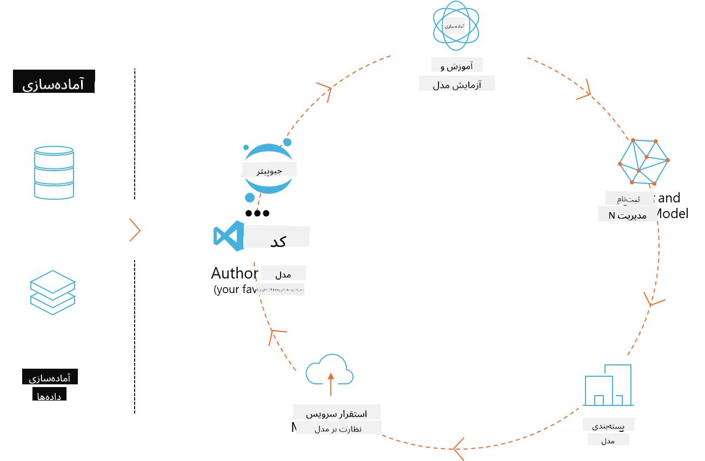
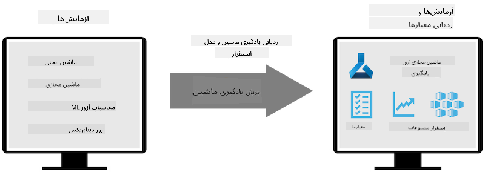
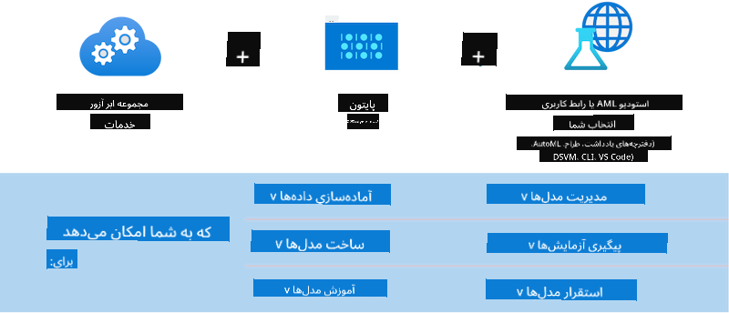

<!--
CO_OP_TRANSLATOR_METADATA:
{
  "original_hash": "f61c383bbf0c3dac97e43f833c258731",
  "translation_date": "2025-07-17T02:26:23+00:00",
  "source_file": "md/02.Application/01.TextAndChat/Phi3/E2E_Phi-3-MLflow.md",
  "language_code": "fa"
}
-->
# MLflow

[MLflow](https://mlflow.org/) یک پلتفرم متن‌باز است که برای مدیریت چرخه کامل یادگیری ماشین طراحی شده است.



MLFlow برای مدیریت چرخه یادگیری ماشین استفاده می‌شود، شامل آزمایش‌ها، قابلیت بازتولید، استقرار و یک رجیستری مرکزی مدل. MLflow در حال حاضر چهار مؤلفه ارائه می‌دهد.

- **MLflow Tracking:** ثبت و جستجوی آزمایش‌ها، کد، پیکربندی داده و نتایج.
- **MLflow Projects:** بسته‌بندی کد علوم داده به شکلی که بتوان اجرای آن را روی هر پلتفرمی بازتولید کرد.
- **Mlflow Models:** استقرار مدل‌های یادگیری ماشین در محیط‌های مختلف سرویس‌دهی.
- **Model Registry:** ذخیره، حاشیه‌نویسی و مدیریت مدل‌ها در یک مخزن مرکزی.

این پلتفرم قابلیت‌هایی برای پیگیری آزمایش‌ها، بسته‌بندی کد به اجرای قابل بازتولید و به اشتراک‌گذاری و استقرار مدل‌ها دارد. MLFlow در Databricks ادغام شده و از کتابخانه‌های مختلف یادگیری ماشین پشتیبانی می‌کند، به طوری که وابسته به کتابخانه خاصی نیست. می‌توان آن را با هر کتابخانه یادگیری ماشین و در هر زبان برنامه‌نویسی استفاده کرد، زیرا API REST و CLI برای سهولت فراهم می‌کند.



ویژگی‌های کلیدی MLFlow شامل موارد زیر است:

- **پیگیری آزمایش‌ها:** ثبت و مقایسه پارامترها و نتایج.
- **مدیریت مدل:** استقرار مدل‌ها در پلتفرم‌های مختلف سرویس‌دهی و استنتاج.
- **رجیستری مدل:** مدیریت مشترک چرخه عمر مدل‌های MLflow، شامل نسخه‌بندی و حاشیه‌نویسی.
- **پروژه‌ها:** بسته‌بندی کد یادگیری ماشین برای به اشتراک‌گذاری یا استفاده در تولید.
MLFlow همچنین از حلقه MLOps پشتیبانی می‌کند که شامل آماده‌سازی داده، ثبت و مدیریت مدل‌ها، بسته‌بندی مدل‌ها برای اجرا، استقرار سرویس‌ها و نظارت بر مدل‌ها است. هدف آن ساده‌سازی فرآیند انتقال از نمونه اولیه به جریان کاری تولید، به ویژه در محیط‌های ابری و لبه است.

## سناریوی انتها به انتها - ساخت یک wrapper و استفاده از Phi-3 به عنوان مدل MLFlow

در این نمونه انتها به انتها، دو رویکرد مختلف برای ساخت یک wrapper دور مدل زبان کوچک Phi-3 (SLM) و سپس اجرای آن به عنوان مدل MLFlow، چه به صورت محلی و چه در فضای ابری مانند Azure Machine Learning workspace، نشان داده خواهد شد.



| پروژه | توضیحات | محل قرارگیری |
| ------------ | ----------- | -------- |
| Transformer Pipeline | Transformer Pipeline ساده‌ترین گزینه برای ساخت wrapper است اگر بخواهید از مدل HuggingFace با طعم آزمایشی transformers در MLFlow استفاده کنید. | [**TransformerPipeline.ipynb**](../../../../../../code/06.E2E/E2E_Phi-3-MLflow_TransformerPipeline.ipynb) |
| Custom Python Wrapper | در زمان نگارش، pipeline ترنسفورمر از تولید wrapper MLFlow برای مدل‌های HuggingFace در فرمت ONNX، حتی با بسته آزمایشی optimum پایتون، پشتیبانی نمی‌کرد. در چنین مواردی می‌توانید wrapper پایتون سفارشی خود را برای حالت MLFlow بسازید. | [**CustomPythonWrapper.ipynb**](../../../../../../code/06.E2E/E2E_Phi-3-MLflow_CustomPythonWrapper.ipynb) |

## پروژه: Transformer Pipeline

1. شما به بسته‌های پایتون مرتبط از MLFlow و HuggingFace نیاز خواهید داشت:

    ``` Python
    import mlflow
    import transformers
    ```

2. سپس باید یک pipeline ترنسفورمر را با ارجاع به مدل هدف Phi-3 در رجیستری HuggingFace راه‌اندازی کنید. همانطور که در کارت مدل _Phi-3-mini-4k-instruct_ دیده می‌شود، وظیفه آن از نوع «تولید متن» است:

    ``` Python
    pipeline = transformers.pipeline(
        task = "text-generation",
        model = "microsoft/Phi-3-mini-4k-instruct"
    )
    ```

3. اکنون می‌توانید pipeline ترنسفورمر مدل Phi-3 خود را در قالب MLFlow ذخیره کنید و جزئیات اضافی مانند مسیر هدف آثار، تنظیمات خاص مدل و نوع API استنتاج را ارائه دهید:

    ``` Python
    model_info = mlflow.transformers.log_model(
        transformers_model = pipeline,
        artifact_path = "phi3-mlflow-model",
        model_config = model_config,
        task = "llm/v1/chat"
    )
    ```

## پروژه: Custom Python Wrapper

1. در اینجا می‌توانیم از [API generate() ONNX Runtime](https://github.com/microsoft/onnxruntime-genai) مایکروسافت برای استنتاج مدل ONNX و رمزگذاری/رمزگشایی توکن‌ها استفاده کنیم. باید بسته _onnxruntime_genai_ را برای محاسبات هدف خود انتخاب کنید، در مثال زیر هدف CPU است:

    ``` Python
    import mlflow
    from mlflow.models import infer_signature
    import onnxruntime_genai as og
    ```

1. کلاس سفارشی ما دو متد پیاده‌سازی می‌کند: _load_context()_ برای مقداردهی اولیه **مدل ONNX** Phi-3 Mini 4K Instruct، **پارامترهای تولیدکننده** و **توکنایزر**؛ و _predict()_ برای تولید توکن‌های خروجی بر اساس prompt داده شده:

    ``` Python
    class Phi3Model(mlflow.pyfunc.PythonModel):
        def load_context(self, context):
            # Retrieving model from the artifacts
            model_path = context.artifacts["phi3-mini-onnx"]
            model_options = {
                 "max_length": 300,
                 "temperature": 0.2,         
            }
        
            # Defining the model
            self.phi3_model = og.Model(model_path)
            self.params = og.GeneratorParams(self.phi3_model)
            self.params.set_search_options(**model_options)
            
            # Defining the tokenizer
            self.tokenizer = og.Tokenizer(self.phi3_model)
    
        def predict(self, context, model_input):
            # Retrieving prompt from the input
            prompt = model_input["prompt"][0]
            self.params.input_ids = self.tokenizer.encode(prompt)
    
            # Generating the model's response
            response = self.phi3_model.generate(self.params)
    
            return self.tokenizer.decode(response[0][len(self.params.input_ids):])
    ```

1. اکنون می‌توانید از تابع _mlflow.pyfunc.log_model()_ برای تولید wrapper پایتون سفارشی (در قالب pickle) برای مدل Phi-3، همراه با مدل اصلی ONNX و وابستگی‌های لازم استفاده کنید:

    ``` Python
    model_info = mlflow.pyfunc.log_model(
        artifact_path = artifact_path,
        python_model = Phi3Model(),
        artifacts = {
            "phi3-mini-onnx": "cpu_and_mobile/cpu-int4-rtn-block-32-acc-level-4",
        },
        input_example = input_example,
        signature = infer_signature(input_example, ["Run"]),
        extra_pip_requirements = ["torch", "onnxruntime_genai", "numpy"],
    )
    ```

## امضاهای مدل‌های تولید شده MLFlow

1. در مرحله ۳ پروژه Transformer Pipeline بالا، وظیفه مدل MLFlow را به «_llm/v1/chat_» تنظیم کردیم. چنین دستوری یک wrapper API مدل تولید می‌کند که با Chat API شرکت OpenAI سازگار است، همانطور که در زیر نشان داده شده:

    ``` Python
    {inputs: 
      ['messages': Array({content: string (required), name: string (optional), role: string (required)}) (required), 'temperature': double (optional), 'max_tokens': long (optional), 'stop': Array(string) (optional), 'n': long (optional), 'stream': boolean (optional)],
    outputs: 
      ['id': string (required), 'object': string (required), 'created': long (required), 'model': string (required), 'choices': Array({finish_reason: string (required), index: long (required), message: {content: string (required), name: string (optional), role: string (required)} (required)}) (required), 'usage': {completion_tokens: long (required), prompt_tokens: long (required), total_tokens: long (required)} (required)],
    params: 
      None}
    ```

1. در نتیجه، می‌توانید prompt خود را به فرمت زیر ارسال کنید:

    ``` Python
    messages = [{"role": "user", "content": "What is the capital of Spain?"}]
    ```

1. سپس، از پردازش پس از پاسخ سازگار با OpenAI، مانند _response[0][‘choices’][0][‘message’][‘content’]_ استفاده کنید تا خروجی خود را به شکلی زیباتر تبدیل کنید، مثلاً به این صورت:

    ``` JSON
    Question: What is the capital of Spain?
    
    Answer: The capital of Spain is Madrid. It is the largest city in Spain and serves as the political, economic, and cultural center of the country. Madrid is located in the center of the Iberian Peninsula and is known for its rich history, art, and architecture, including the Royal Palace, the Prado Museum, and the Plaza Mayor.
    
    Usage: {'prompt_tokens': 11, 'completion_tokens': 73, 'total_tokens': 84}
    ```

1. در مرحله ۳ پروژه Custom Python Wrapper بالا، اجازه می‌دهیم بسته MLFlow امضای مدل را از یک نمونه ورودی داده شده تولید کند. امضای wrapper MLFlow ما به این شکل خواهد بود:

    ``` Python
    {inputs: 
      ['prompt': string (required)],
    outputs: 
      [string (required)],
    params: 
      None}
    ```

1. بنابراین، prompt ما باید شامل کلید دیکشنری "prompt" باشد، مشابه این:

    ``` Python
    {"prompt": "<|system|>You are a stand-up comedian.<|end|><|user|>Tell me a joke about atom<|end|><|assistant|>",}
    ```

1. خروجی مدل سپس به صورت رشته ارائه خواهد شد:

    ``` JSON
    Alright, here's a little atom-related joke for you!
    
    Why don't electrons ever play hide and seek with protons?
    
    Because good luck finding them when they're always "sharing" their electrons!
    
    Remember, this is all in good fun, and we're just having a little atomic-level humor!
    ```

**سلب مسئولیت**:  
این سند با استفاده از سرویس ترجمه هوش مصنوعی [Co-op Translator](https://github.com/Azure/co-op-translator) ترجمه شده است. در حالی که ما در تلاش برای دقت هستیم، لطفاً توجه داشته باشید که ترجمه‌های خودکار ممکن است حاوی خطاها یا نواقصی باشند. سند اصلی به زبان بومی خود باید به عنوان منبع معتبر در نظر گرفته شود. برای اطلاعات حیاتی، ترجمه حرفه‌ای انسانی توصیه می‌شود. ما مسئول هیچ گونه سوءتفاهم یا تفسیر نادرستی که از استفاده این ترجمه ناشی شود، نیستیم.