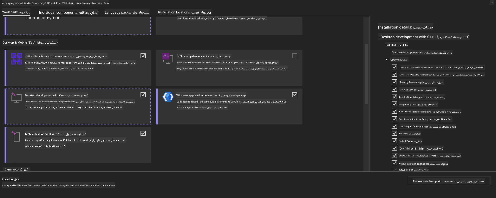
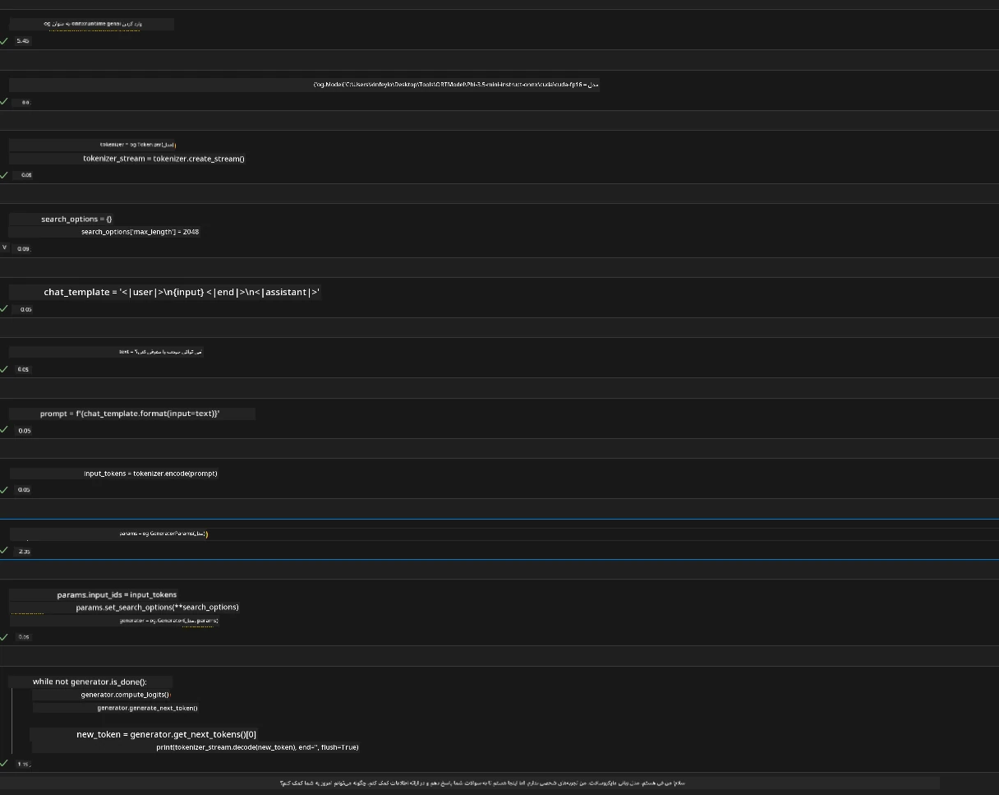
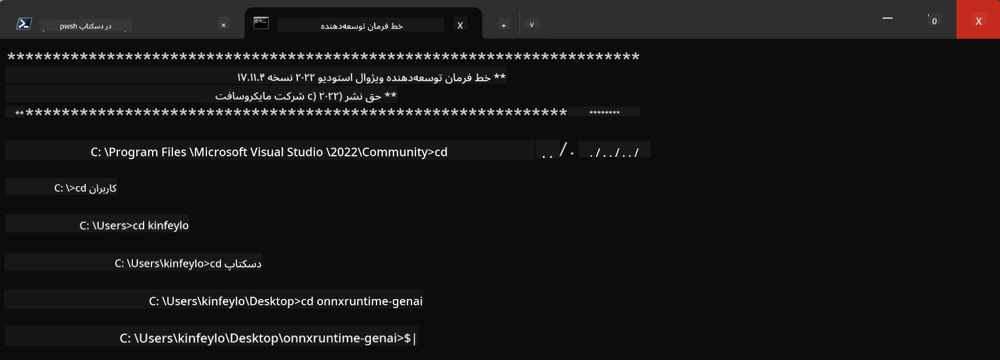

# **راهنمای استفاده از OnnxRuntime GenAI روی ویندوز با GPU**

این راهنما مراحل راه‌اندازی و استفاده از ONNX Runtime (ORT) با استفاده از GPU روی ویندوز را ارائه می‌دهد. هدف آن کمک به شما برای بهره‌گیری از شتاب‌دهی GPU برای مدل‌هایتان است تا عملکرد و کارایی بهتری داشته باشید.

در این سند راهنمایی‌هایی درباره موارد زیر ارائه شده است:

- راه‌اندازی محیط: دستورالعمل نصب وابستگی‌های لازم مانند CUDA، cuDNN و ONNX Runtime.
- پیکربندی: نحوه تنظیم محیط و ONNX Runtime برای استفاده بهینه از منابع GPU.
- نکات بهینه‌سازی: توصیه‌هایی برای تنظیم دقیق تنظیمات GPU جهت دستیابی به بهترین عملکرد.

### **1. Python 3.10.x /3.11.8**

   ***Note*** پیشنهاد می‌شود از [miniforge](https://github.com/conda-forge/miniforge/releases/latest/download/Miniforge3-Windows-x86_64.exe) به عنوان محیط پایتون خود استفاده کنید

   ```bash

   conda create -n pydev python==3.11.8

   conda activate pydev

   ```

   ***Reminder*** اگر هر کتابخانه مرتبط با ONNX در پایتون نصب کرده‌اید، لطفاً آن را حذف کنید

### **2. نصب CMake با winget**

   ```bash

   winget install -e --id Kitware.CMake

   ```

### **3. نصب Visual Studio 2022 - توسعه دسکتاپ با C++**

   ***Note*** اگر نمی‌خواهید کامپایل کنید، می‌توانید این مرحله را رد کنید



### **4. نصب درایور NVIDIA**

1. **درایور GPU انویدیا**  [https://www.nvidia.com/en-us/drivers/](https://www.nvidia.com/en-us/drivers/)

2. **NVIDIA CUDA 12.4** [https://developer.nvidia.com/cuda-12-4-0-download-archive](https://developer.nvidia.com/cuda-12-4-0-download-archive)

3. **NVIDIA CUDNN 9.4**  [https://developer.nvidia.com/cudnn-downloads](https://developer.nvidia.com/cudnn-downloads)

***Reminder*** لطفاً در هنگام نصب از تنظیمات پیش‌فرض استفاده کنید

### **5. تنظیم محیط NVIDIA**

فایل‌های lib، bin و include مربوط به NVIDIA CUDNN 9.4 را به پوشه‌های lib، bin و include مربوط به NVIDIA CUDA 12.4 کپی کنید

- فایل‌های *'C:\Program Files\NVIDIA\CUDNN\v9.4\bin\12.6'* را به *'C:\Program Files\NVIDIA GPU Computing Toolkit\CUDA\v12.4\bin'* کپی کنید

- فایل‌های *'C:\Program Files\NVIDIA\CUDNN\v9.4\include\12.6'* را به *'C:\Program Files\NVIDIA GPU Computing Toolkit\CUDA\v12.4\include'* کپی کنید

- فایل‌های *'C:\Program Files\NVIDIA\CUDNN\v9.4\lib\12.6'* را به *'C:\Program Files\NVIDIA GPU Computing Toolkit\CUDA\v12.4\lib\x64'* کپی کنید

### **6. دانلود Phi-3.5-mini-instruct-onnx**

   ```bash

   winget install -e --id Git.Git

   winget install -e --id GitHub.GitLFS

   git lfs install

   git clone https://huggingface.co/microsoft/Phi-3.5-mini-instruct-onnx

   ```

### **7. اجرای InferencePhi35Instruct.ipynb**

   فایل [Notebook](../../../../../../code/09.UpdateSamples/Aug/ortgpu-phi35-instruct.ipynb) را باز کرده و اجرا کنید



### **8. کامپایل ORT GenAI GPU**

   ***Note*** 
   
   1. لطفاً ابتدا تمام بسته‌های مرتبط با onnx، onnxruntime و onnxruntime-genai را حذف کنید

   ```bash

   pip list 
   
   ```

   سپس تمام کتابخانه‌های onnxruntime را حذف کنید، به عنوان مثال:

   ```bash

   pip uninstall onnxruntime

   pip uninstall onnxruntime-genai

   pip uninstall onnxruntume-genai-cuda
   
   ```

   2. بررسی پشتیبانی افزونه Visual Studio

   پوشه C:\Program Files\NVIDIA GPU Computing Toolkit\CUDA\v12.4\extras را بررسی کنید تا مطمئن شوید پوشه C:\Program Files\NVIDIA GPU Computing Toolkit\CUDA\v12.4\extras\visual_studio_integration وجود دارد.
   
   اگر وجود ندارد، پوشه‌های دیگر درایور Cuda toolkit را بررسی کرده و پوشه visual_studio_integration و محتویات آن را به C:\Program Files\NVIDIA GPU Computing Toolkit\CUDA\v12.4\extras\visual_studio_integration کپی کنید

   - اگر نمی‌خواهید کامپایل کنید، می‌توانید این مرحله را رد کنید

   ```bash

   git clone https://github.com/microsoft/onnxruntime-genai

   ```

   - دانلود [https://github.com/microsoft/onnxruntime/releases/download/v1.19.2/onnxruntime-win-x64-gpu-1.19.2.zip](https://github.com/microsoft/onnxruntime/releases/download/v1.19.2/onnxruntime-win-x64-gpu-1.19.2.zip)

   - فایل onnxruntime-win-x64-gpu-1.19.2.zip را استخراج کرده و نام پوشه را به **ort** تغییر دهید، سپس پوشه ort را به onnxruntime-genai کپی کنید

   - با استفاده از Windows Terminal به Developer Command Prompt برای VS 2022 بروید و به پوشه onnxruntime-genai بروید



   - آن را با محیط پایتون خود کامپایل کنید

   ```bash

   cd onnxruntime-genai

   python build.py --use_cuda  --cuda_home "C:\Program Files\NVIDIA GPU Computing Toolkit\CUDA\v12.4" --config Release
 

   cd build/Windows/Release/Wheel

   pip install .whl

   ```

**سلب مسئولیت**:  
این سند با استفاده از سرویس ترجمه هوش مصنوعی [Co-op Translator](https://github.com/Azure/co-op-translator) ترجمه شده است. در حالی که ما در تلاش برای دقت هستیم، لطفاً توجه داشته باشید که ترجمه‌های خودکار ممکن است حاوی خطاها یا نادرستی‌هایی باشند. سند اصلی به زبان بومی خود باید به عنوان منبع معتبر در نظر گرفته شود. برای اطلاعات حیاتی، ترجمه حرفه‌ای انسانی توصیه می‌شود. ما مسئول هیچ گونه سوءتفاهم یا تفسیر نادرستی که از استفاده این ترجمه ناشی شود، نیستیم.