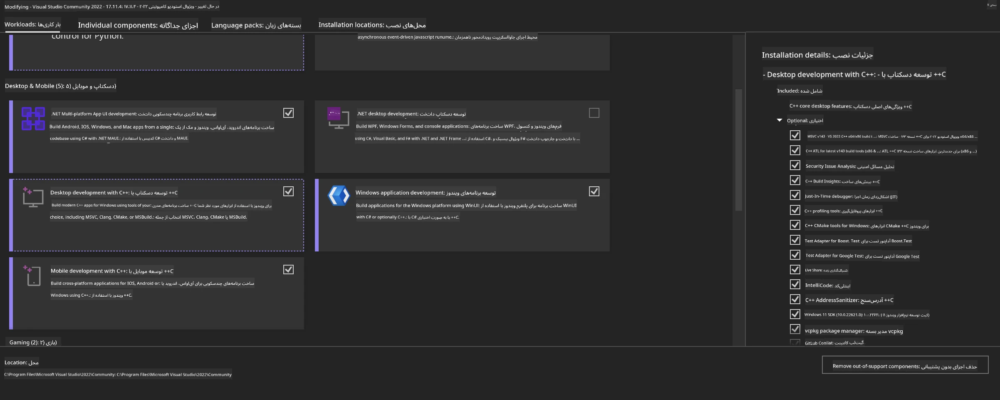
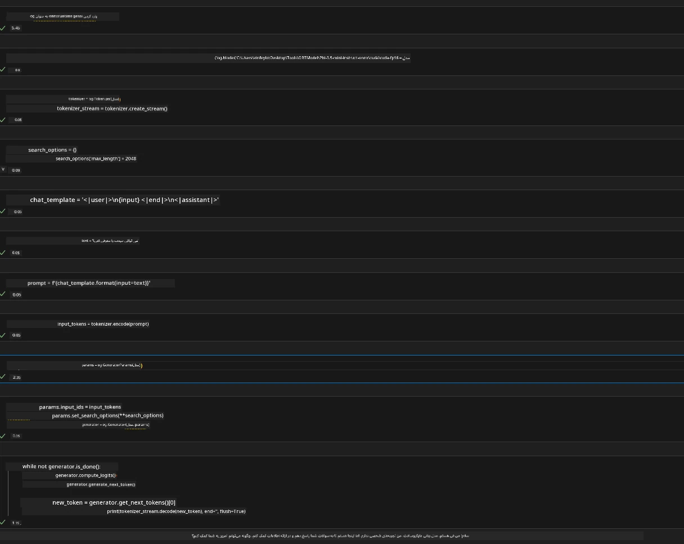
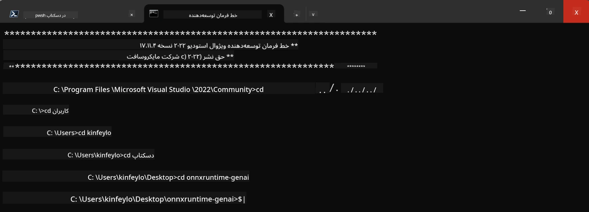

# **راهنمای استفاده از OnnxRuntime GenAI برای ویندوز GPU**

این راهنما مراحل نصب و استفاده از ONNX Runtime (ORT) با GPUها در ویندوز را ارائه می‌دهد. هدف آن کمک به شما برای بهره‌گیری از تسریع GPU برای مدل‌هایتان است تا عملکرد و کارایی را بهبود ببخشید.

این سند راهنمایی هایی در زمینه:

- راه‌اندازی محیط: دستورالعمل نصب وابستگی‌های لازم مانند CUDA، cuDNN و ONNX Runtime.
- پیکربندی: نحوه تنظیم محیط و ONNX Runtime برای استفاده مؤثر از منابع GPU.
- نکات بهینه‌سازی: راهنمایی برای تنظیم دقیق تنظیمات GPU برای بهترین عملکرد.

### **۱. Python 3.10.x /3.11.8**

   ***نکته*** پیشنهاد می‌شود از [miniforge](https://github.com/conda-forge/miniforge/releases/latest/download/Miniforge3-Windows-x86_64.exe) به‌عنوان محیط پایتون خود استفاده کنید

   ```bash

   conda create -n pydev python==3.11.8

   conda activate pydev

   ```

   ***یادآوری*** اگر کتابخانه‌ای مرتبط با پایتون ONNX نصب کرده‌اید، لطفا آن را حذف کنید

### **۲. نصب CMake با winget**


   ```bash

   winget install -e --id Kitware.CMake

   ```

### **۳. نصب Visual Studio 2022 - توسعه دسکتاپ با C++**

   ***نکته*** اگر نمی‌خواهید کامپایل کنید، می‌توانید این مرحله را رد کنید




### **۴. نصب درایور NVIDIA**

۱. **درایور GPU انویدیا**  [https://www.nvidia.com/en-us/drivers/](https://www.nvidia.com/en-us/drivers/)

۲. **NVIDIA CUDA 12.4** [https://developer.nvidia.com/cuda-12-4-0-download-archive](https://developer.nvidia.com/cuda-12-4-0-download-archive)

۳. **NVIDIA CUDNN 9.4**  [https://developer.nvidia.com/cudnn-downloads](https://developer.nvidia.com/cudnn-downloads)

***یادآوری*** لطفاً از تنظیمات پیش‌فرض در فرایند نصب استفاده کنید

### **۵. تنظیم محیط NVIDIA**

فایل‌های lib، bin، include از NVIDIA CUDNN 9.4 را به NVIDIA CUDA 12.4 کپی کنید

- کپی فایل‌های *'C:\Program Files\NVIDIA\CUDNN\v9.4\bin\12.6'* به *'C:\Program Files\NVIDIA GPU Computing Toolkit\CUDA\v12.4\bin'*

- کپی فایل‌های *'C:\Program Files\NVIDIA\CUDNN\v9.4\include\12.6'* به *'C:\Program Files\NVIDIA GPU Computing Toolkit\CUDA\v12.4\include'*

- کپی فایل‌های *'C:\Program Files\NVIDIA\CUDNN\v9.4\lib\12.6'* به *'C:\Program Files\NVIDIA GPU Computing Toolkit\CUDA\v12.4\lib\x64'*


### **۶. دانلود Phi-3.5-mini-instruct-onnx**


   ```bash

   winget install -e --id Git.Git

   winget install -e --id GitHub.GitLFS

   git lfs install

   git clone https://huggingface.co/microsoft/Phi-3.5-mini-instruct-onnx

   ```

### **۷. اجرای InferencePhi35Instruct.ipynb**

   فایل [Notebook](../../../../code/09.UpdateSamples/Aug/ortgpu-phi35-instruct.ipynb) را باز کرده و اجرا کنید





### **۸. کامپایل ORT GenAI GPU**


   ***نکته*** 
   
   ۱. لطفاً ابتدا همه بسته‌های مرتبط با onnx و onnxruntime و onnxruntime-genai را حذف کنید

   
   ```bash

   pip list 
   
   ```

   سپس همه کتابخانه‌های onnxruntime را حذف کنید، مثلا 


   ```bash

   pip uninstall onnxruntime

   pip uninstall onnxruntime-genai

   pip uninstall onnxruntume-genai-cuda
   
   ```

   ۲. پشتیبانی افزونه Visual Studio را بررسی کنید

   مسیر C:\Program Files\NVIDIA GPU Computing Toolkit\CUDA\v12.4\extras را بررسی کنید تا مطمئن شوید پوشه C:\Program Files\NVIDIA GPU Computing Toolkit\CUDA\v12.4\extras\visual_studio_integration موجود است.
   
   اگر موجود نبود، سایر پوشه‌های درایور Cuda Toolkit را بررسی کنید و پوشه visual_studio_integration و محتوای آن را به C:\Program Files\NVIDIA GPU Computing Toolkit\CUDA\v12.4\extras\visual_studio_integration کپی کنید


   - اگر نمی‌خواهید کامپایل کنید، می‌توانید این مرحله را رد کنید


   ```bash

   git clone https://github.com/microsoft/onnxruntime-genai

   ```

   - دانلود [https://github.com/microsoft/onnxruntime/releases/download/v1.19.2/onnxruntime-win-x64-gpu-1.19.2.zip](https://github.com/microsoft/onnxruntime/releases/download/v1.19.2/onnxruntime-win-x64-gpu-1.19.2.zip)

   - فایل onnxruntime-win-x64-gpu-1.19.2.zip را از حالت فشرده خارج کرده و نام پوشه را به **ort** تغییر دهید، پوشه ort را به onnxruntime-genai کپی کنید

   - با استفاده از Windows Terminal، وارد Developer Command Prompt for VS 2022 شده و به پوشه onnxruntime-genai بروید



   - آن را با محیط پایتون خود کامپایل کنید

   
   ```bash

   cd onnxruntime-genai

   python build.py --use_cuda  --cuda_home "C:\Program Files\NVIDIA GPU Computing Toolkit\CUDA\v12.4" --config Release
 

   cd build/Windows/Release/Wheel

   pip install .whl

   ```

---

<!-- CO-OP TRANSLATOR DISCLAIMER START -->
**سلب مسئولیت**:
این سند با استفاده از سرویس ترجمه هوش مصنوعی [Co-op Translator](https://github.com/Azure/co-op-translator) ترجمه شده است. در حالی که ما در تلاش برای دقت هستیم، لطفاً توجه داشته باشید که ترجمه‌های خودکار ممکن است شامل خطاها یا نادرستی‌هایی باشند. سند اصلی به زبان مادری خود باید به عنوان منبع معتبر در نظر گرفته شود. برای اطلاعات حیاتی، ترجمه حرفه‌ای انسانی توصیه می‌شود. ما در قبال هرگونه سوء تفاهم یا برداشت نادرست ناشی از استفاده از این ترجمه مسئولیتی نداریم.
<!-- CO-OP TRANSLATOR DISCLAIMER END -->