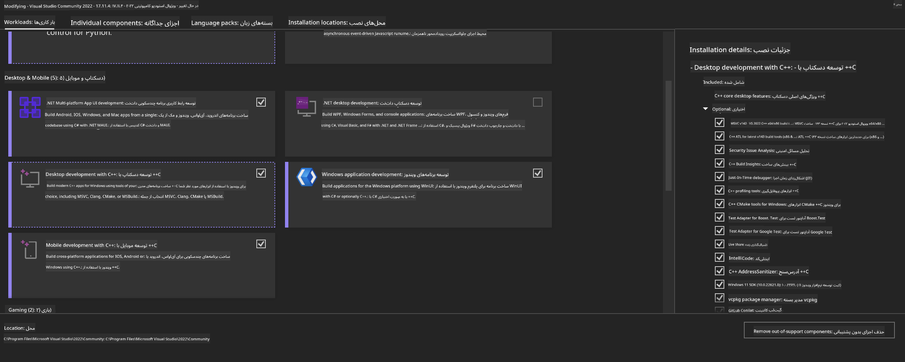
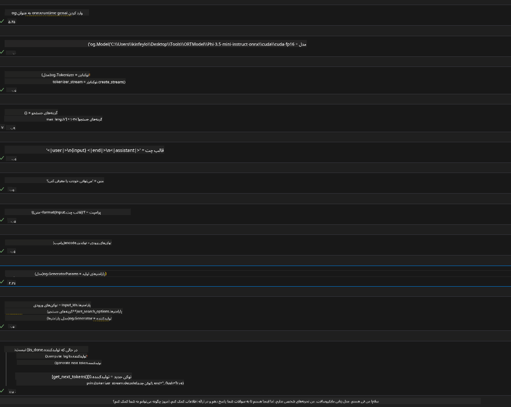

<!--
CO_OP_TRANSLATOR_METADATA:
{
  "original_hash": "b066fc29c1b2129df84e027cb75119ce",
  "translation_date": "2025-05-07T14:19:27+00:00",
  "source_file": "md/02.Application/01.TextAndChat/Phi3/ORTWindowGPUGuideline.md",
  "language_code": "fa"
}
-->
# **راهنمای استفاده از OnnxRuntime GenAI روی GPU ویندوز**

این راهنما مراحل نصب و استفاده از ONNX Runtime (ORT) با استفاده از GPU روی ویندوز را توضیح می‌دهد. هدف آن کمک به شما برای بهره‌گیری از شتاب GPU جهت بهبود عملکرد و کارایی مدل‌هایتان است.

در این سند راهنمایی‌هایی درباره موارد زیر ارائه شده است:

- راه‌اندازی محیط: دستورالعمل‌های نصب پیش‌نیازهایی مانند CUDA، cuDNN و ONNX Runtime.
- پیکربندی: چگونگی تنظیم محیط و ONNX Runtime برای استفاده بهینه از منابع GPU.
- نکات بهینه‌سازی: توصیه‌هایی برای تنظیم دقیق GPU جهت کسب بهترین عملکرد.

### **1. نسخه Python 3.10.x /3.11.8**

   ***Note*** پیشنهاد می‌شود از [miniforge](https://github.com/conda-forge/miniforge/releases/latest/download/Miniforge3-Windows-x86_64.exe) به عنوان محیط پایتون خود استفاده کنید

   ```bash

   conda create -n pydev python==3.11.8

   conda activate pydev

   ```

   ***Reminder*** اگر پیش‌تر هر کتابخانه مرتبط با ONNX در پایتون نصب کرده‌اید، لطفاً آن را حذف کنید

### **2. نصب CMake با استفاده از winget**

   ```bash

   winget install -e --id Kitware.CMake

   ```

### **3. نصب Visual Studio 2022 - توسعه دسکتاپ با C++**

   ***Note*** اگر قصد کامپایل ندارید، می‌توانید این مرحله را رد کنید



### **4. نصب درایور NVIDIA**

1. **درایور GPU انویدیا**  [https://www.nvidia.com/en-us/drivers/](https://www.nvidia.com/en-us/drivers/)

2. **NVIDIA CUDA نسخه 12.4** [https://developer.nvidia.com/cuda-12-4-0-download-archive](https://developer.nvidia.com/cuda-12-4-0-download-archive)

3. **NVIDIA CUDNN نسخه 9.4**  [https://developer.nvidia.com/cudnn-downloads](https://developer.nvidia.com/cudnn-downloads)

***Reminder*** لطفاً تنظیمات پیش‌فرض را در طول نصب حفظ کنید

### **5. تنظیم محیط NVIDIA**

کتابخانه‌ها و فایل‌های bin و include مربوط به NVIDIA CUDNN 9.4 را به پوشه‌های متناظر در NVIDIA CUDA 12.4 کپی کنید

- فایل‌های *'C:\Program Files\NVIDIA\CUDNN\v9.4\bin\12.6'* را به *'C:\Program Files\NVIDIA GPU Computing Toolkit\CUDA\v12.4\bin'* منتقل کنید

- فایل‌های *'C:\Program Files\NVIDIA\CUDNN\v9.4\include\12.6'* را به *'C:\Program Files\NVIDIA GPU Computing Toolkit\CUDA\v12.4\include'* منتقل کنید

- فایل‌های *'C:\Program Files\NVIDIA\CUDNN\v9.4\lib\12.6'* را به *'C:\Program Files\NVIDIA GPU Computing Toolkit\CUDA\v12.4\lib\x64'* منتقل کنید

### **6. دانلود Phi-3.5-mini-instruct-onnx**

   ```bash

   winget install -e --id Git.Git

   winget install -e --id GitHub.GitLFS

   git lfs install

   git clone https://huggingface.co/microsoft/Phi-3.5-mini-instruct-onnx

   ```

### **7. اجرای InferencePhi35Instruct.ipynb**

   فایل [Notebook](../../../../../../code/09.UpdateSamples/Aug/ortgpu-phi35-instruct.ipynb) را باز کرده و اجرا کنید



### **8. کامپایل ORT GenAI GPU**

   ***Note*** 
   
   1. ابتدا همه بسته‌های onnx، onnxruntime و onnxruntime-genai را حذف کنید

   
   ```bash

   pip list 
   
   ```

   سپس تمام کتابخانه‌های onnxruntime را حذف کنید، به عنوان مثال: 


   ```bash

   pip uninstall onnxruntime

   pip uninstall onnxruntime-genai

   pip uninstall onnxruntume-genai-cuda
   
   ```

   2. پشتیبانی افزونه Visual Studio را بررسی کنید

   مسیر C:\Program Files\NVIDIA GPU Computing Toolkit\CUDA\v12.4\extras را چک کنید تا اطمینان حاصل شود پوشه C:\Program Files\NVIDIA GPU Computing Toolkit\CUDA\v12.4\extras\visual_studio_integration وجود دارد.
   
   اگر وجود نداشت، سایر پوشه‌های ابزار Cuda را بررسی کنید و پوشه visual_studio_integration و محتویات آن را به مسیر بالا کپی کنید.

   - اگر نمی‌خواهید کامپایل کنید، می‌توانید این مرحله را رد کنید

   ```bash

   git clone https://github.com/microsoft/onnxruntime-genai

   ```

   - فایل [https://github.com/microsoft/onnxruntime/releases/download/v1.19.2/onnxruntime-win-x64-gpu-1.19.2.zip](https://github.com/microsoft/onnxruntime/releases/download/v1.19.2/onnxruntime-win-x64-gpu-1.19.2.zip) را دانلود کنید

   - فایل onnxruntime-win-x64-gpu-1.19.2.zip را استخراج کرده، نام پوشه را به **ort** تغییر داده و پوشه ort را در onnxruntime-genai کپی کنید

   - با استفاده از Windows Terminal به Developer Command Prompt برای VS 2022 رفته و به پوشه onnxruntime-genai بروید


   - آن را با محیط پایتون خود کامپایل کنید

   
   ```bash

   cd onnxruntime-genai

   python build.py --use_cuda  --cuda_home "C:\Program Files\NVIDIA GPU Computing Toolkit\CUDA\v12.4" --config Release
 

   cd build/Windows/Release/Wheel

   pip install .whl

   ```

**سلب مسئولیت**:  
این سند با استفاده از سرویس ترجمه هوش مصنوعی [Co-op Translator](https://github.com/Azure/co-op-translator) ترجمه شده است. در حالی که ما برای دقت تلاش می‌کنیم، لطفاً توجه داشته باشید که ترجمه‌های خودکار ممکن است حاوی خطاها یا نادرستی‌هایی باشند. سند اصلی به زبان بومی خود باید به عنوان منبع معتبر در نظر گرفته شود. برای اطلاعات حیاتی، ترجمه حرفه‌ای انسانی توصیه می‌شود. ما در قبال هرگونه سوءتفاهم یا تفسیر نادرست ناشی از استفاده از این ترجمه مسئولیتی نداریم.