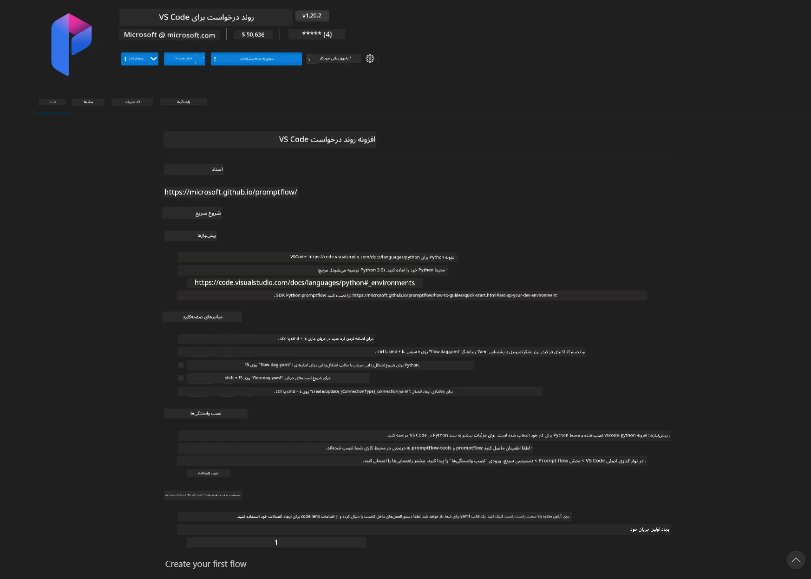
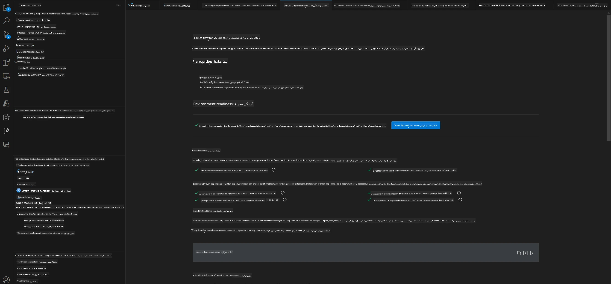
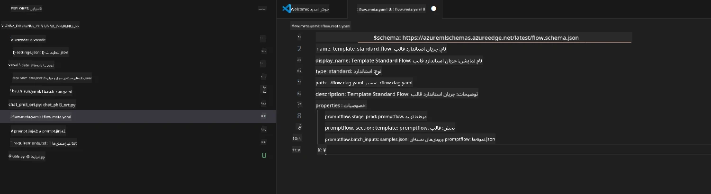
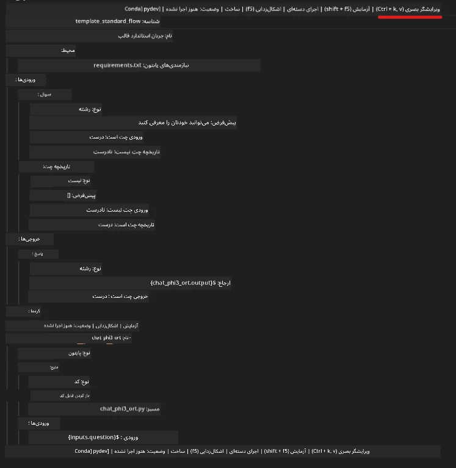
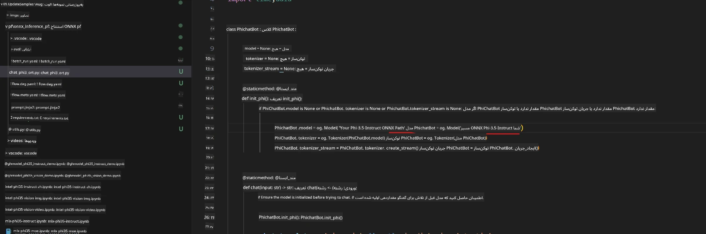
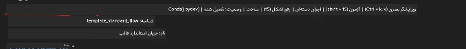
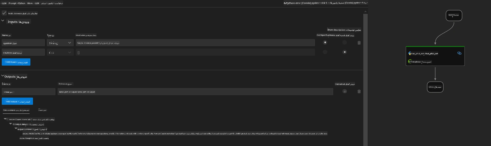
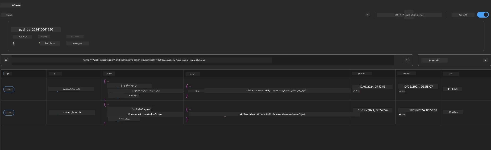

# استفاده از GPU ویندوز برای ایجاد راهکار Prompt flow با Phi-3.5-Instruct ONNX

سند زیر نمونه‌ای از نحوه استفاده از PromptFlow با ONNX (Open Neural Network Exchange) برای توسعه برنامه‌های هوش مصنوعی مبتنی بر مدل‌های Phi-3 است.

PromptFlow مجموعه‌ای از ابزارهای توسعه است که برای ساده‌سازی چرخه توسعه انتها به انتهای برنامه‌های هوش مصنوعی مبتنی بر LLM (مدل زبان بزرگ) از ایده‌پردازی و نمونه‌سازی تا تست و ارزیابی طراحی شده است.

با ادغام PromptFlow با ONNX، توسعه‌دهندگان می‌توانند:

- بهینه‌سازی عملکرد مدل: بهره‌گیری از ONNX برای استنتاج و استقرار کارآمد مدل.
- ساده‌سازی توسعه: استفاده از PromptFlow برای مدیریت جریان کار و خودکارسازی وظایف تکراری.
- افزایش همکاری: تسهیل همکاری بهتر بین اعضای تیم با فراهم کردن محیط توسعه یکپارچه.

**Prompt flow** مجموعه‌ای از ابزارهای توسعه است که برای ساده‌سازی چرخه توسعه انتها به انتهای برنامه‌های هوش مصنوعی مبتنی بر LLM طراحی شده است، از ایده‌پردازی، نمونه‌سازی، تست، ارزیابی تا استقرار در تولید و نظارت. این ابزار مهندسی پرامپت را بسیار آسان‌تر می‌کند و به شما امکان می‌دهد برنامه‌های LLM با کیفیت تولید بسازید.

Prompt flow می‌تواند به OpenAI، سرویس Azure OpenAI و مدل‌های قابل تنظیم (Huggingface، مدل محلی LLM/SLM) وصل شود. ما امیدواریم مدل کمیتی‌شده ONNX Phi-3.5 را به برنامه‌های محلی استقرار دهیم. Prompt flow می‌تواند به ما کمک کند کسب‌وکار خود را بهتر برنامه‌ریزی کنیم و راهکارهای محلی مبتنی بر Phi-3.5 را کامل کنیم. در این مثال، ما کتابخانه ONNX Runtime GenAI را ترکیب خواهیم کرد تا راهکار Prompt flow مبتنی بر GPU ویندوز را کامل کنیم.

## **نصب**

### **ONNX Runtime GenAI برای GPU ویندوز**

این راهنما را برای تنظیم ONNX Runtime GenAI برای GPU ویندوز بخوانید [اینجا کلیک کنید](./ORTWindowGPUGuideline.md)

### **راه‌اندازی Prompt flow در VSCode**

1. نصب افزونه Prompt flow در VS Code



2. پس از نصب افزونه Prompt flow در VS Code، روی افزونه کلیک کنید و **Installation dependencies** را انتخاب کنید و این راهنما را دنبال کنید تا SDK پرامپت فلو را در محیط خود نصب کنید



3. [نمونه کد](../../../../../../code/09.UpdateSamples/Aug/pf/onnx_inference_pf) را دانلود کنید و با VS Code این نمونه را باز کنید



4. فایل **flow.dag.yaml** را باز کنید و محیط پایتون خود را انتخاب کنید



   فایل **chat_phi3_ort.py** را باز کنید تا مکان مدل ONNX Phi-3.5-instruct خود را تغییر دهید



5. پرامپت فلو خود را اجرا کنید و تست کنید

فایل **flow.dag.yaml** را باز کنید و روی ویرایشگر بصری کلیک کنید



پس از کلیک، آن را اجرا کنید و تست کنید



1. می‌توانید به صورت دسته‌ای در ترمینال اجرا کنید تا نتایج بیشتری بررسی کنید


```bash

pf run create --file batch_run.yaml --stream --name 'Your eval qa name'    

```

می‌توانید نتایج را در مرورگر پیش‌فرض خود ببینید




---

<!-- CO-OP TRANSLATOR DISCLAIMER START -->
**سلب مسئولیت**:
این سند با استفاده از سرویس ترجمه هوش مصنوعی [Co-op Translator](https://github.com/Azure/co-op-translator) ترجمه شده است. در حالی که ما در تلاش برای دقت هستیم، لطفاً توجه داشته باشید که ترجمه‌های خودکار ممکن است شامل خطاها یا نادرستی‌هایی باشند. سند اصلی به زبان مادری خود باید به عنوان منبع معتبر در نظر گرفته شود. برای اطلاعات حیاتی، ترجمه حرفه‌ای انسانی توصیه می‌شود. ما در قبال هرگونه سوء تفاهم یا برداشت نادرست ناشی از استفاده از این ترجمه مسئولیتی نداریم.
<!-- CO-OP TRANSLATOR DISCLAIMER END -->