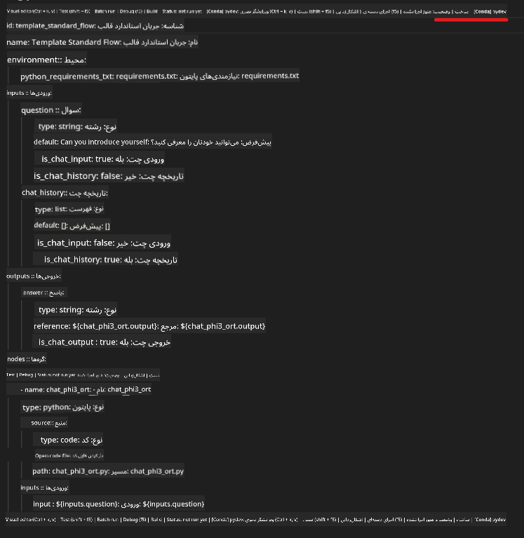
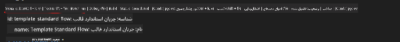
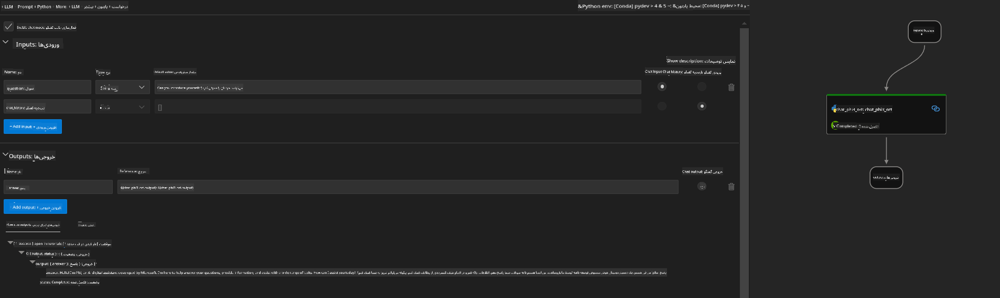
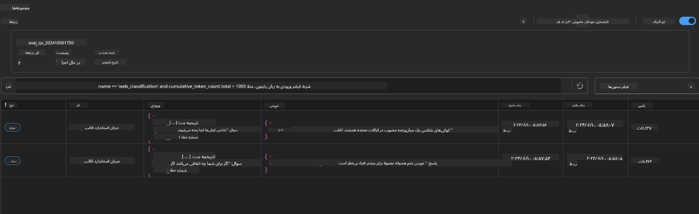

<!--
CO_OP_TRANSLATOR_METADATA:
{
  "original_hash": "92e7dac1e5af0dd7c94170fdaf6860fe",
  "translation_date": "2025-07-17T02:57:18+00:00",
  "source_file": "md/02.Application/01.TextAndChat/Phi3/UsingPromptFlowWithONNX.md",
  "language_code": "fa"
}
-->
# استفاده از GPU ویندوز برای ایجاد راهکار Prompt flow با Phi-3.5-Instruct ONNX

سند زیر نمونه‌ای است از نحوه استفاده از PromptFlow با ONNX (Open Neural Network Exchange) برای توسعه برنامه‌های هوش مصنوعی مبتنی بر مدل‌های Phi-3.

PromptFlow مجموعه‌ای از ابزارهای توسعه است که برای ساده‌سازی چرخه کامل توسعه برنامه‌های هوش مصنوعی مبتنی بر مدل‌های زبان بزرگ (LLM) طراحی شده است، از ایده‌پردازی و نمونه‌سازی اولیه گرفته تا تست و ارزیابی.

با ادغام PromptFlow با ONNX، توسعه‌دهندگان می‌توانند:

- بهینه‌سازی عملکرد مدل: استفاده از ONNX برای استنتاج و استقرار کارآمد مدل.
- ساده‌سازی توسعه: استفاده از PromptFlow برای مدیریت جریان کاری و خودکارسازی وظایف تکراری.
- افزایش همکاری: تسهیل همکاری بهتر بین اعضای تیم با فراهم کردن محیط توسعه یکپارچه.

**Prompt flow** مجموعه‌ای از ابزارهای توسعه است که برای ساده‌سازی چرخه کامل توسعه برنامه‌های هوش مصنوعی مبتنی بر LLM طراحی شده است، از ایده‌پردازی، نمونه‌سازی اولیه، تست، ارزیابی تا استقرار در تولید و نظارت. این ابزار مهندسی پرامپت را بسیار آسان‌تر می‌کند و به شما امکان می‌دهد برنامه‌های LLM با کیفیت تولید بسازید.

Prompt flow می‌تواند به OpenAI، Azure OpenAI Service و مدل‌های قابل سفارشی‌سازی (Huggingface، LLM/SLM محلی) متصل شود. ما امیدواریم مدل ONNX کوانتیزه شده Phi-3.5 را در برنامه‌های محلی مستقر کنیم. Prompt flow می‌تواند به ما کمک کند کسب‌وکار خود را بهتر برنامه‌ریزی کنیم و راهکارهای محلی مبتنی بر Phi-3.5 را کامل کنیم. در این مثال، ما کتابخانه ONNX Runtime GenAI را برای تکمیل راهکار Prompt flow مبتنی بر GPU ویندوز ترکیب خواهیم کرد.

## **نصب**

### **ONNX Runtime GenAI برای GPU ویندوز**

برای تنظیم ONNX Runtime GenAI برای GPU ویندوز این راهنما را مطالعه کنید [کلیک کنید](./ORTWindowGPUGuideline.md)

### **راه‌اندازی Prompt flow در VSCode**

1. افزونه Prompt flow برای VS Code را نصب کنید


2. پس از نصب افزونه Prompt flow در VS Code، روی افزونه کلیک کنید و گزینه **Installation dependencies** را انتخاب کنید و طبق این راهنما SDK پرامپت فلو را در محیط خود نصب کنید


3. [نمونه کد](../../../../../../code/09.UpdateSamples/Aug/pf/onnx_inference_pf) را دانلود کرده و با VS Code این نمونه را باز کنید


4. فایل **flow.dag.yaml** را باز کنید و محیط پایتون خود را انتخاب کنید



   فایل **chat_phi3_ort.py** را باز کنید و مسیر مدل Phi-3.5-instruct ONNX خود را تغییر دهید


5. پرامپت فلو خود را برای تست اجرا کنید

فایل **flow.dag.yaml** را باز کنید و روی ویرایشگر بصری کلیک کنید



پس از کلیک، آن را اجرا کنید تا تست شود



1. می‌توانید در ترمینال به صورت دسته‌ای اجرا کنید تا نتایج بیشتری ببینید


```bash

pf run create --file batch_run.yaml --stream --name 'Your eval qa name'    

```

می‌توانید نتایج را در مرورگر پیش‌فرض خود مشاهده کنید




**سلب مسئولیت**:  
این سند با استفاده از سرویس ترجمه هوش مصنوعی [Co-op Translator](https://github.com/Azure/co-op-translator) ترجمه شده است. در حالی که ما در تلاش برای دقت هستیم، لطفاً توجه داشته باشید که ترجمه‌های خودکار ممکن است حاوی خطاها یا نادرستی‌هایی باشند. سند اصلی به زبان بومی خود باید به عنوان منبع معتبر در نظر گرفته شود. برای اطلاعات حیاتی، ترجمه حرفه‌ای انسانی توصیه می‌شود. ما مسئول هیچ گونه سوءتفاهم یا تفسیر نادرستی که از استفاده این ترجمه ناشی شود، نیستیم.