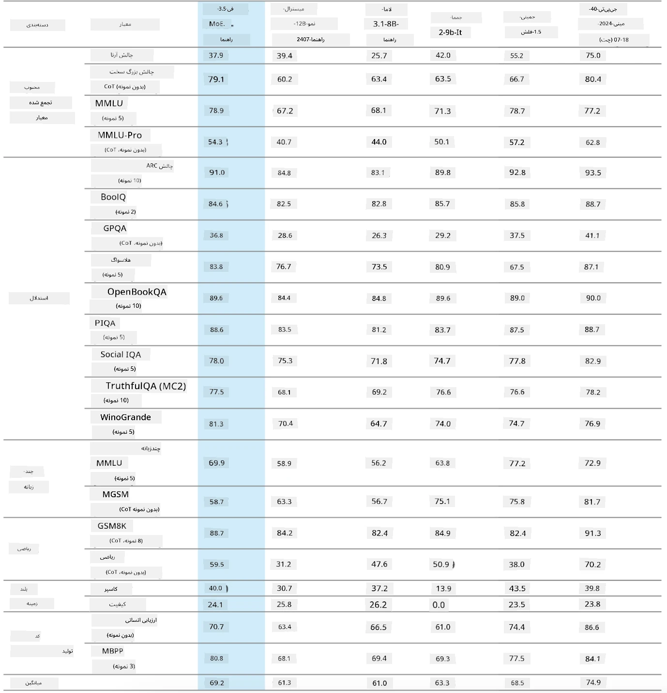
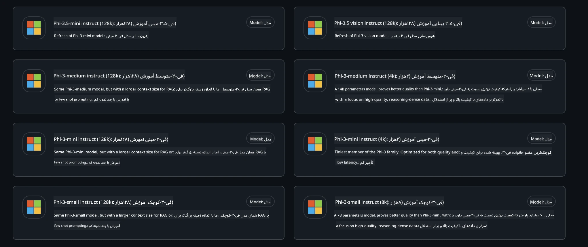
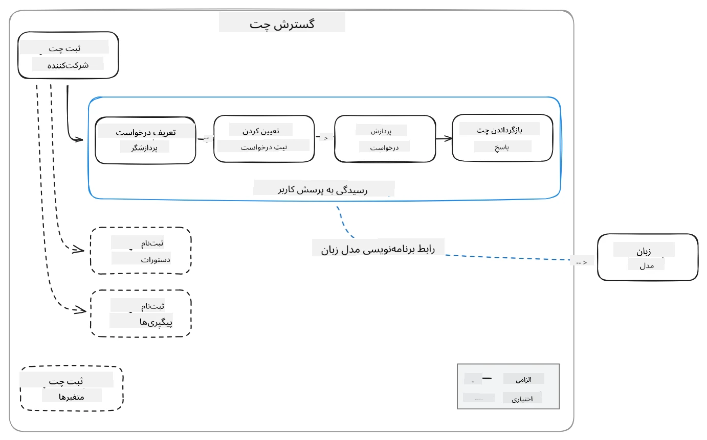
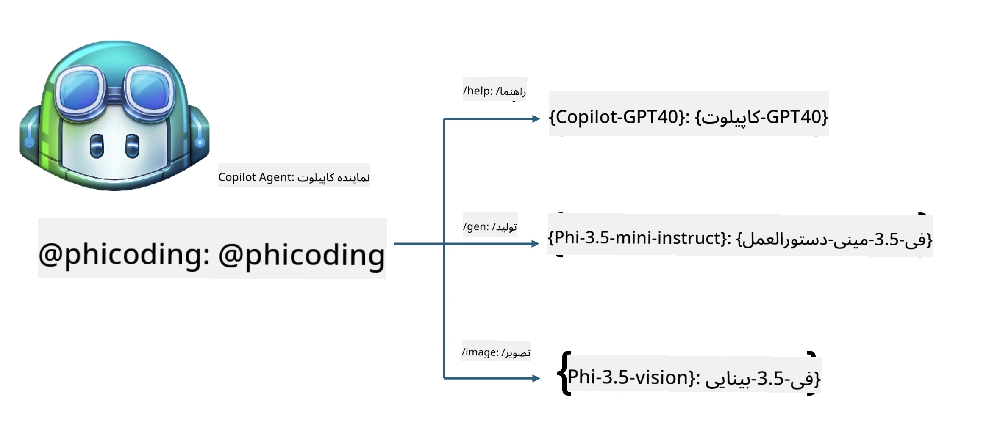
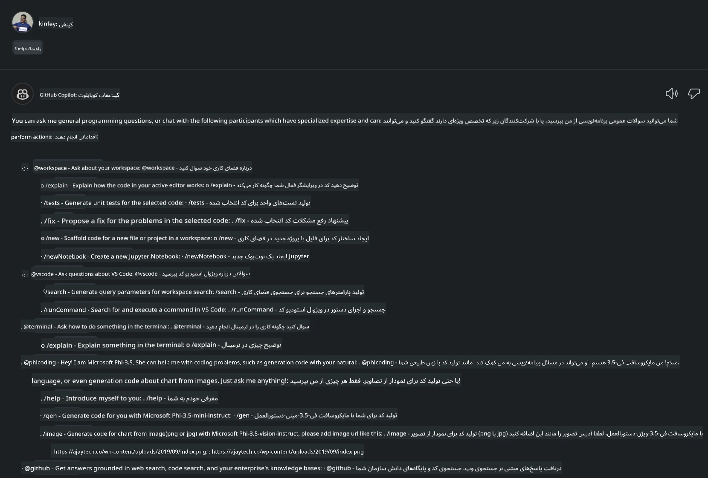
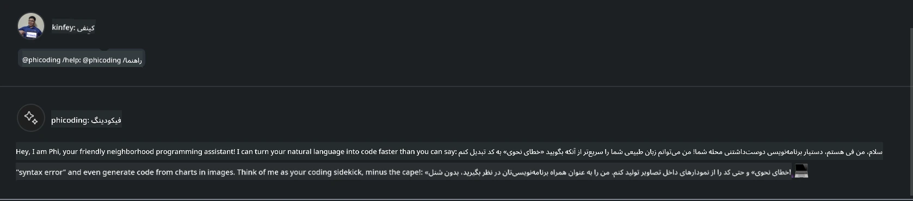
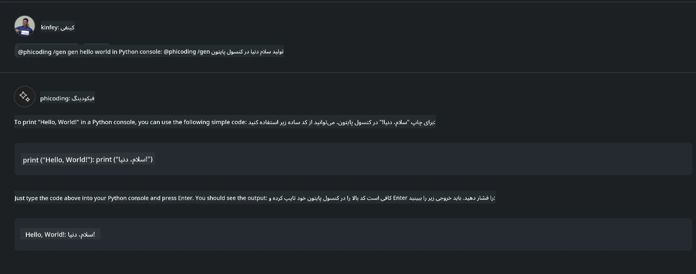
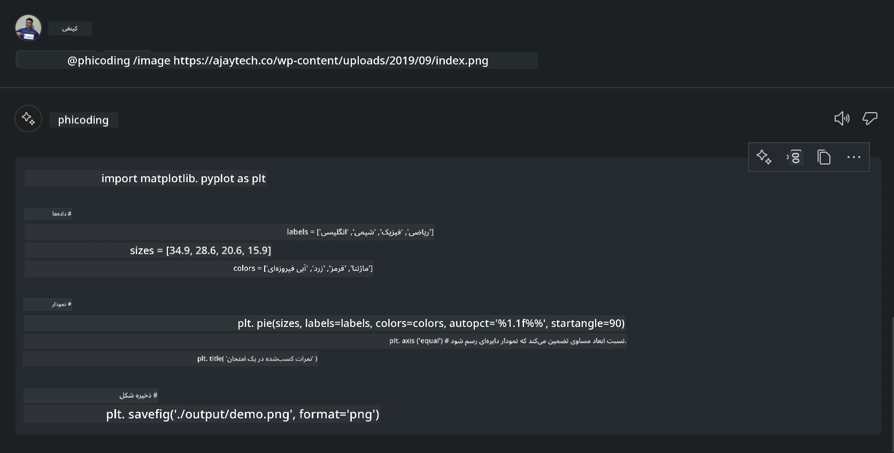

# **ایجاد عامل چت Visual Studio Code خودتان با Phi-3.5 توسط GitHub Models**

آیا از Visual Studio Code Copilot استفاده می‌کنید؟ به‌ویژه در بخش چت، می‌توانید از عوامل مختلفی برای بهبود توانایی ایجاد، نوشتن و نگهداری پروژه‌ها در Visual Studio Code بهره ببرید. Visual Studio Code یک API ارائه می‌دهد که به شرکت‌ها و افراد اجازه می‌دهد عوامل مختلفی بر اساس کسب‌وکار خود بسازند تا قابلیت‌هایشان را در حوزه‌های اختصاصی مختلف گسترش دهند. در این مقاله، تمرکز ما بر روی **Phi-3.5-mini-instruct (128k)** و **Phi-3.5-vision-instruct (128k)** از GitHub Models برای ساخت عامل Visual Studio Code خودتان خواهد بود.

## **درباره Phi-3.5 در GitHub Models**

می‌دانیم که Phi-3/3.5-mini-instruct در خانواده Phi-3/3.5 توانایی‌های قوی در درک و تولید کد دارد و نسبت به Gemma-2-9b و Mistral-Nemo-12B-instruct-2407 مزیت‌هایی دارد.



جدیدترین GitHub Models دسترسی به مدل‌های Phi-3.5-mini-instruct (128k) و Phi-3.5-vision-instruct (128k) را فراهم کرده‌اند. توسعه‌دهندگان می‌توانند از طریق OpenAI SDK، Azure AI Inference SDK و REST API به آن‌ها دسترسی پیدا کنند.



***توجه:*** توصیه می‌شود از Azure AI Inference SDK استفاده کنید، زیرا در محیط تولید بهتر می‌تواند با Azure Model Catalog جابجا شود.

در ادامه نتایج **Phi-3.5-mini-instruct (128k)** و **Phi-3.5-vision-instruct (128k)** در سناریوی تولید کد پس از اتصال به GitHub Models آمده است و همچنین برای مثال‌های بعدی آماده شده‌اند.

**دمو: تولید کد توسط GitHub Models Phi-3.5-mini-instruct (128k) از روی Prompt** ([برای مشاهده اینجا کلیک کنید](../../../../../../code/09.UpdateSamples/Aug/ghmodel_phi35_instruct_demo.ipynb))

**دمو: تولید کد توسط GitHub Models Phi-3.5-vision-instruct (128k) از روی تصویر** ([برای مشاهده اینجا کلیک کنید](../../../../../../code/09.UpdateSamples/Aug/ghmodel_phi35_vision_demo.ipynb))


## **درباره عامل چت GitHub Copilot**

عامل چت GitHub Copilot می‌تواند وظایف مختلفی را در سناریوهای پروژه متفاوت بر اساس کد انجام دهد. این سیستم چهار عامل دارد: workspace، github، terminal، vscode


با اضافه کردن نام عامل به همراه ‘@’ می‌توانید به سرعت کار مربوطه را انجام دهید. برای شرکت‌ها، اگر محتوای مرتبط با کسب‌وکار خود مانند نیازمندی‌ها، کدنویسی، مشخصات تست و انتشار را اضافه کنید، می‌توانید قابلیت‌های خصوصی قدرتمندتری بر اساس GitHub Copilot داشته باشید.

عامل چت Visual Studio Code اکنون به‌طور رسمی API خود را منتشر کرده است که به شرکت‌ها یا توسعه‌دهندگان سازمانی اجازه می‌دهد عوامل مبتنی بر اکوسیستم‌های مختلف نرم‌افزاری بسازند. بر اساس روش توسعه افزونه Visual Studio Code، می‌توانید به راحتی به رابط API عامل چت Visual Studio Code دسترسی پیدا کنید. ما می‌توانیم بر اساس این روند توسعه دهیم.



سناریوی توسعه می‌تواند از دسترسی به API مدل‌های شخص ثالث (مانند GitHub Models، Azure Model Catalog و سرویس‌های خودساخته بر اساس مدل‌های متن‌باز) پشتیبانی کند و همچنین می‌تواند از مدل‌های gpt-35-turbo، gpt-4 و gpt-4o ارائه شده توسط GitHub Copilot استفاده کند.

## **افزودن عامل @phicoding بر پایه Phi-3.5**

ما تلاش می‌کنیم توانایی‌های برنامه‌نویسی Phi-3.5 را برای تکمیل نوشتن کد، تولید کد از تصویر و سایر وظایف ادغام کنیم. یک عامل ساخته شده حول Phi-3.5 - @PHI را کامل کنیم، که برخی از قابلیت‌های آن عبارتند از:

1. تولید معرفی‌نامه خودکار بر اساس GPT-4o ارائه شده توسط GitHub Copilot از طریق دستور **@phicoding /help**

2. تولید کد برای زبان‌های برنامه‌نویسی مختلف بر اساس **Phi-3.5-mini-instruct (128k)** از طریق دستور **@phicoding /gen**

3. تولید کد بر اساس **Phi-3.5-vision-instruct (128k)** و تکمیل تصویر از طریق دستور **@phicoding /image**



## **مراحل مرتبط**

1. نصب پشتیبانی توسعه افزونه Visual Studio Code با استفاده از npm

```bash

npm install --global yo generator-code 

```
2. ایجاد افزونه Visual Studio Code (با حالت توسعه Typescript، با نام phiext)

```bash

yo code 

```

3. پروژه ایجاد شده را باز کرده و package.json را ویرایش کنید. در اینجا دستورالعمل‌ها و پیکربندی‌های مرتبط و همچنین پیکربندی GitHub Models آمده است. توجه داشته باشید که باید توکن GitHub Models خود را اینجا اضافه کنید.

```json

{
  "name": "phiext",
  "displayName": "phiext",
  "description": "",
  "version": "0.0.1",
  "engines": {
    "vscode": "^1.93.0"
  },
  "categories": [
    "AI",
    "Chat"
  ],
  "activationEvents": [],
  "enabledApiProposals": [
      "chatVariableResolver"
  ],
  "main": "./dist/extension.js",
  "contributes": {
    "chatParticipants": [
        {
            "id": "chat.phicoding",
            "name": "phicoding",
            "description": "Hey! I am Microsoft Phi-3.5, She can help me with coding problems, such as generation code with your natural language, or even generation code about chart from images. Just ask me anything!",
            "isSticky": true,
            "commands": [
                {
                    "name": "help",
                    "description": "Introduce myself to you"
                },
                {
                    "name": "gen",
                    "description": "Generate code for you with Microsoft Phi-3.5-mini-instruct"
                },
                {
                    "name": "image",
                    "description": "Generate code for chart from image(png or jpg) with Microsoft Phi-3.5-vision-instruct, please add image url like this : https://ajaytech.co/wp-content/uploads/2019/09/index.png"
                }
            ]
        }
    ],
    "commands": [
        {
            "command": "phicoding.namesInEditor",
            "title": "Use Microsoft Phi 3.5 in Editor"
        }
    ],
    "configuration": {
      "type": "object",
      "title": "githubmodels",
      "properties": {
        "githubmodels.endpoint": {
          "type": "string",
          "default": "https://models.inference.ai.azure.com",
          "description": "Your GitHub Models Endpoint",
          "order": 0
        },
        "githubmodels.api_key": {
          "type": "string",
          "default": "Your GitHub Models Token",
          "description": "Your GitHub Models Token",
          "order": 1
        },
        "githubmodels.phi35instruct": {
          "type": "string",
          "default": "Phi-3.5-mini-instruct",
          "description": "Your Phi-35-Instruct Model",
          "order": 2
        },
        "githubmodels.phi35vision": {
          "type": "string",
          "default": "Phi-3.5-vision-instruct",
          "description": "Your Phi-35-Vision Model",
          "order": 3
        }
      }
    }
  },
  "scripts": {
    "vscode:prepublish": "npm run package",
    "compile": "webpack",
    "watch": "webpack --watch",
    "package": "webpack --mode production --devtool hidden-source-map",
    "compile-tests": "tsc -p . --outDir out",
    "watch-tests": "tsc -p . -w --outDir out",
    "pretest": "npm run compile-tests && npm run compile && npm run lint",
    "lint": "eslint src",
    "test": "vscode-test"
  },
  "devDependencies": {
    "@types/vscode": "^1.93.0",
    "@types/mocha": "^10.0.7",
    "@types/node": "20.x",
    "@typescript-eslint/eslint-plugin": "^8.3.0",
    "@typescript-eslint/parser": "^8.3.0",
    "eslint": "^9.9.1",
    "typescript": "^5.5.4",
    "ts-loader": "^9.5.1",
    "webpack": "^5.94.0",
    "webpack-cli": "^5.1.4",
    "@vscode/test-cli": "^0.0.10",
    "@vscode/test-electron": "^2.4.1"
  },
  "dependencies": {
    "@types/node-fetch": "^2.6.11",
    "node-fetch": "^3.3.2",
    "@azure-rest/ai-inference": "latest",
    "@azure/core-auth": "latest",
    "@azure/core-sse": "latest"
  }
}


```

4. ویرایش فایل src/extension.ts

```typescript

// The module 'vscode' contains the VS Code extensibility API
// Import the module and reference it with the alias vscode in your code below
import * as vscode from 'vscode';
import ModelClient from "@azure-rest/ai-inference";
import { AzureKeyCredential } from "@azure/core-auth";


interface IPhiChatResult extends vscode.ChatResult {
    metadata: {
        command: string;
    };
}


const MODEL_SELECTOR: vscode.LanguageModelChatSelector = { vendor: 'copilot', family: 'gpt-4o' };

function isValidImageUrl(url: string): boolean {
    const regex = /^(https?:\/\/.*\.(?:png|jpg))$/i;
    return regex.test(url);
}
  

// This method is called when your extension is activated
// Your extension is activated the very first time the command is executed
export function activate(context: vscode.ExtensionContext) {

    const codinghandler: vscode.ChatRequestHandler = async (request: vscode.ChatRequest, context: vscode.ChatContext, stream: vscode.ChatResponseStream, token: vscode.CancellationToken): Promise<IPhiChatResult> => {


        const config : any = vscode.workspace.getConfiguration('githubmodels');
        const endPoint: string = config.get('endpoint');
        const apiKey: string = config.get('api_key');
        const phi35instruct: string = config.get('phi35instruct');
        const phi35vision: string = config.get('phi35vision');
        
        if (request.command === 'help') {

            const content = "Welcome to Coding assistant with Microsoft Phi-3.5"; 
            stream.progress(content);


            try {
                const [model] = await vscode.lm.selectChatModels(MODEL_SELECTOR);
                if (model) {
                    const messages = [
                        vscode.LanguageModelChatMessage.User("Please help me express this content in a humorous way: I am a programming assistant who can help you convert natural language into code and generate code based on the charts in the images. output format like this : Hey I am Phi ......")
                    ];
                    const chatResponse = await model.sendRequest(messages, {}, token);
                    for await (const fragment of chatResponse.text) {
                        stream.markdown(fragment);
                    }
                }
            } catch(err) {
                console.log(err);
            }


            return { metadata: { command: 'help' } };

        }

        
        if (request.command === 'gen') {

            const content = "Welcome to use phi-3.5 to generate code";

            stream.progress(content);

            const client = new ModelClient(endPoint, new AzureKeyCredential(apiKey));

            const response = await client.path("/chat/completions").post({
              body: {
                messages: [
                  { role:"system", content: "You are a coding assistant.Help answer all code generation questions." },
                  { role:"user", content: request.prompt }
                ],
                model: phi35instruct,
                temperature: 0.4,
                max_tokens: 1000,
                top_p: 1.
              }
            });

            stream.markdown(response.body.choices[0].message.content);

            return { metadata: { command: 'gen' } };

        }


        
        if (request.command === 'image') {


            const content = "Welcome to use phi-3.5 to generate code from image(png or jpg),image url like this:https://ajaytech.co/wp-content/uploads/2019/09/index.png";

            stream.progress(content);

            if (!isValidImageUrl(request.prompt)) {
                stream.markdown('Please provide a valid image URL');
                return { metadata: { command: 'image' } };
            }
            else
            {

                const client = new ModelClient(endPoint, new AzureKeyCredential(apiKey));
    
                const response = await client.path("/chat/completions").post({
                    body: {
                      messages: [
                        { role: "system", content: "You are a helpful assistant that describes images in details." },
                        { role: "user", content: [
                            { type: "text", text: "Please generate code according to the chart in the picture according to the following requirements\n1. Keep all information in the chart, including data and text\n2. Do not generate additional information that is not included in the chart\n3. Please extract data from the picture, do not generate it from csv\n4. Please save the regenerated chart as a chart and save it to ./output/demo.png"},
                            { type: "image_url", image_url: {url: request.prompt}
                            }
                          ]
                        }
                      ],
                      model: phi35vision,
                      temperature: 0.4,
                      max_tokens: 2048,
                      top_p: 1.
                    }
                  });
    
                
                stream.markdown(response.body.choices[0].message.content);
    
                return { metadata: { command: 'image' } };
            }


        }


        return { metadata: { command: '' } };
    };


    const phi_ext = vscode.chat.createChatParticipant("chat.phicoding", codinghandler);

    phi_ext.iconPath = new vscode.ThemeIcon('sparkle');


    phi_ext.followupProvider = {
        provideFollowups(result: IPhiChatResult, context: vscode.ChatContext, token: vscode.CancellationToken) {
            return [{
                prompt: 'Let us coding with Phi-3.5 😋😋😋😋',
                label: vscode.l10n.t('Enjoy coding with Phi-3.5'),
                command: 'help'
            } satisfies vscode.ChatFollowup];
        }
    };

    context.subscriptions.push(phi_ext);
}

// This method is called when your extension is deactivated
export function deactivate() {}


```

6. اجرا

***/help***



***@phicoding /help***



***@phicoding /gen***



***@phicoding /image***



می‌توانید کد نمونه را دانلود کنید: [کلیک کنید](../../../../../../code/09.UpdateSamples/Aug/vscode)

## **منابع**

1. ثبت‌نام در GitHub Models [https://gh.io/models](https://gh.io/models)

2. یادگیری توسعه افزونه Visual Studio Code [https://code.visualstudio.com/api/get-started/your-first-extension](https://code.visualstudio.com/api/get-started/your-first-extension)

3. آشنایی با API چت Visual Studio Code Coilot [https://code.visualstudio.com/api/extension-guides/chat](https://code.visualstudio.com/api/extension-guides/chat)

**سلب مسئولیت**:  
این سند با استفاده از سرویس ترجمه هوش مصنوعی [Co-op Translator](https://github.com/Azure/co-op-translator) ترجمه شده است. در حالی که ما در تلاش برای دقت هستیم، لطفاً توجه داشته باشید که ترجمه‌های خودکار ممکن است حاوی خطاها یا نادرستی‌هایی باشند. سند اصلی به زبان بومی خود باید به عنوان منبع معتبر در نظر گرفته شود. برای اطلاعات حیاتی، ترجمه حرفه‌ای انسانی توصیه می‌شود. ما مسئول هیچ گونه سوءتفاهم یا تفسیر نادرستی که از استفاده این ترجمه ناشی شود، نیستیم.