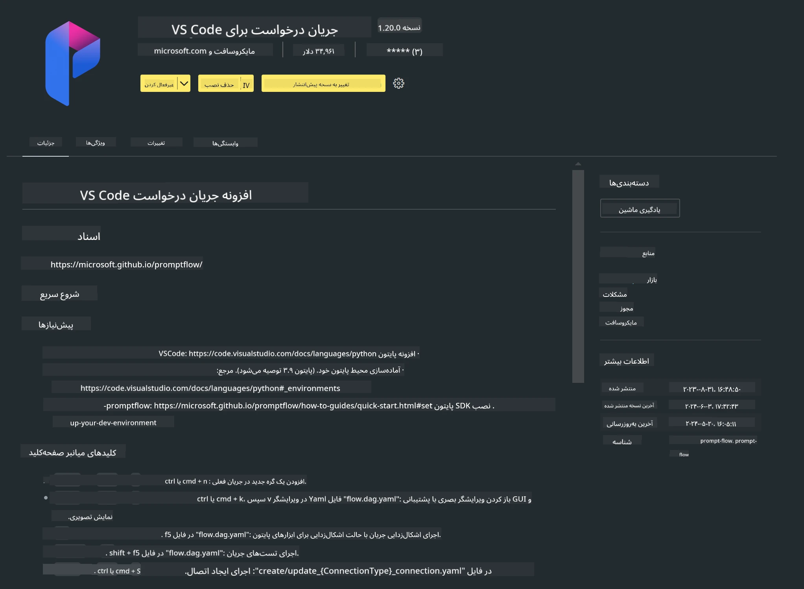

# **آزمایشگاه ۰ - نصب**

وقتی وارد آزمایشگاه می‌شویم، باید محیط مربوطه را پیکربندی کنیم:


### **۱. پایتون ۳.۱۱ به بالا**

توصیه می‌شود برای پیکربندی محیط پایتون خود از miniforge استفاده کنید.

برای پیکربندی miniforge، لطفاً به [https://github.com/conda-forge/miniforge](https://github.com/conda-forge/miniforge) مراجعه کنید.

پس از پیکربندی miniforge، دستور زیر را در Power Shell اجرا کنید

```bash

conda create -n pyenv python==3.11.8 -y

conda activate pyenv

```


### **۲. نصب Prompt flow SDK**

در آزمایشگاه ۱، از Prompt flow استفاده می‌کنیم، بنابراین باید Prompt flow SDK را پیکربندی کنید.

```bash

pip install promptflow --upgrade

```

می‌توانید با این دستور، promptflow sdk را بررسی کنید

```bash

pf --version

```

### **۳. نصب افزونه Prompt flow برای Visual Studio Code**




### **۴. کتابخانه شتاب‌دهنده Intel NPU**

پردازنده‌های نسل جدید اینتل از NPU پشتیبانی می‌کنند. اگر می‌خواهید از NPU برای اجرای محلی LLMs / SLMs استفاده کنید، می‌توانید از ***کتابخانه شتاب‌دهنده Intel NPU*** بهره ببرید. برای اطلاعات بیشتر می‌توانید این صفحه را مطالعه کنید: [https://github.com/microsoft/PhiCookBook/blob/main/md/01.Introduction/03/AIPC_Inference.md](https://github.com/microsoft/PhiCookBook/blob/main/md/01.Introduction/03/AIPC_Inference.md).

کتابخانه شتاب‌دهنده Intel NPU را در bash نصب کنید

```bash

pip install intel-npu-acceleration-library

```

***توجه***: لطفاً دقت کنید که این کتابخانه از transformers نسخه ***4.40.2*** پشتیبانی می‌کند، لطفاً نسخه را تأیید کنید.


### **۵. سایر کتابخانه‌های پایتون**

فایل requirements.txt را ایجاد کرده و این محتوا را اضافه کنید

```txt

notebook
numpy 
scipy 
scikit-learn 
matplotlib 
pandas 
pillow 
graphviz

```


### **۶. نصب NVM**

nvm را در Powershell نصب کنید

```bash

winget install -e --id CoreyButler.NVMforWindows

```

نسخه nodejs 18.20 را نصب کنید

```bash

nvm install 18.20.0

nvm use 18.20.0

```

### **۷. نصب پشتیبانی توسعه Visual Studio Code**

```bash

npm install --global yo generator-code

```

تبریک! شما با موفقیت SDK را پیکربندی کردید. حالا به مراحل عملی ادامه دهید.

**سلب مسئولیت**:  
این سند با استفاده از سرویس ترجمه هوش مصنوعی [Co-op Translator](https://github.com/Azure/co-op-translator) ترجمه شده است. در حالی که ما در تلاش برای دقت هستیم، لطفاً توجه داشته باشید که ترجمه‌های خودکار ممکن است حاوی خطاها یا نادرستی‌هایی باشند. سند اصلی به زبان بومی خود باید به عنوان منبع معتبر در نظر گرفته شود. برای اطلاعات حیاتی، ترجمه حرفه‌ای انسانی توصیه می‌شود. ما مسئول هیچ گونه سوءتفاهم یا تفسیر نادرستی که از استفاده این ترجمه ناشی شود، نیستیم.