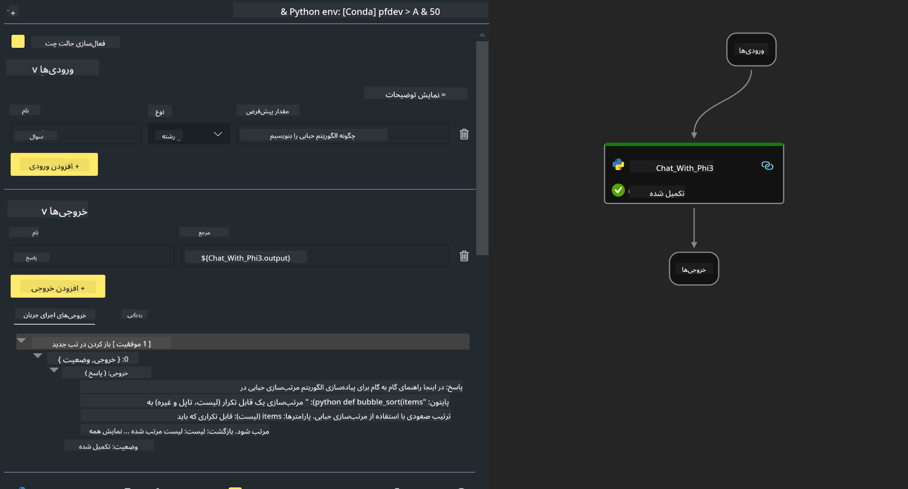

<!--
CO_OP_TRANSLATOR_METADATA:
{
  "original_hash": "bc29f7fe7fc16bed6932733eac8c81b8",
  "translation_date": "2025-05-07T13:49:59+00:00",
  "source_file": "md/02.Application/02.Code/Phi3/VSCodeExt/HOL/AIPC/02.PromptflowWithNPU.md",
  "language_code": "fa"
}
-->
# **آزمایشگاه ۲ - اجرای Prompt flow با Phi-3-mini در AIPC**

## **Prompt flow چیست**

Prompt flow مجموعه‌ای از ابزارهای توسعه است که برای ساده‌سازی چرخه کامل توسعه برنامه‌های هوش مصنوعی مبتنی بر مدل‌های زبانی بزرگ (LLM) طراحی شده است؛ از ایده‌پردازی، نمونه‌سازی، آزمایش، ارزیابی تا استقرار و نظارت در محیط تولید. این ابزار مهندسی پرامپت را بسیار آسان‌تر می‌کند و به شما امکان می‌دهد برنامه‌های LLM با کیفیت تولید بسازید.

با استفاده از prompt flow، شما قادر خواهید بود:

- جریان‌هایی بسازید که LLMها، پرامپت‌ها، کد پایتون و سایر ابزارها را در یک روند اجرایی به هم متصل می‌کند.

- جریان‌های خود را اشکال‌زدایی و تکرار کنید، به‌ویژه تعامل با LLMها را به راحتی مدیریت کنید.

- جریان‌هایتان را ارزیابی کرده و معیارهای کیفیت و عملکرد را با مجموعه داده‌های بزرگ‌تر محاسبه کنید.

- تست و ارزیابی را در سیستم CI/CD خود ادغام کنید تا کیفیت جریان خود را تضمین کنید.

- جریان‌های خود را به پلتفرم سرویس‌دهی مورد نظر خود مستقر کنید یا به آسانی در کد برنامه خود ادغام کنید.

- (اختیاری اما بسیار توصیه شده) با تیم خود همکاری کنید و از نسخه ابری Prompt flow در Azure AI بهره ببرید.

## **AIPC چیست**

یک AI PC شامل CPU، GPU و NPU است که هرکدام قابلیت‌های شتاب‌دهی خاص هوش مصنوعی دارند. NPU یا واحد پردازش عصبی، یک شتاب‌دهنده تخصصی است که وظایف هوش مصنوعی (AI) و یادگیری ماشین (ML) را مستقیماً روی کامپیوتر شما انجام می‌دهد، بدون اینکه داده‌ها به فضای ابری ارسال شوند. GPU و CPU نیز می‌توانند این بار کاری را پردازش کنند، اما NPU در محاسبات هوش مصنوعی کم‌مصرف عملکرد ویژه‌ای دارد. AI PC نمایانگر تغییر بنیادی در نحوه عملکرد کامپیوترهای ما است. این راه‌حلی برای مشکلی که قبلاً وجود نداشت نیست، بلکه وعده بهبود چشمگیر در استفاده‌های روزمره از کامپیوتر را می‌دهد.

پس چگونه کار می‌کند؟ در مقایسه با هوش مصنوعی مولد و مدل‌های زبانی بزرگ عظیمی که روی داده‌های عمومی گسترده آموزش دیده‌اند، هوش مصنوعی که روی کامپیوتر شما اجرا می‌شود در سطحی بسیار قابل دسترس‌تر است. این مفهوم ساده‌تر قابل درک است و چون روی داده‌های شما آموزش دیده و نیازی به دسترسی به فضای ابری ندارد، مزایای آن برای جمعیت وسیع‌تری بلافاصله جذاب‌تر است.

در کوتاه‌مدت، دنیای AI PC شامل دستیارهای شخصی و مدل‌های کوچک‌تر هوش مصنوعی است که مستقیماً روی کامپیوتر شما اجرا می‌شوند و با استفاده از داده‌های شما، ارتقاءهای شخصی، خصوصی و امن‌تری برای کارهایی که روزانه انجام می‌دهید ارائه می‌دهند – ثبت صورتجلسات، سازماندهی لیگ فوتبال فانتزی، خودکارسازی بهبودهای ویرایش عکس و ویدئو، یا برنامه‌ریزی دقیق برای یک گردهمایی خانوادگی بر اساس زمان‌های ورود و خروج همه.

## **ساخت جریان‌های تولید کد روی AIPC**

***Note*** ：اگر نصب محیط را کامل نکرده‌اید، لطفاً به [Lab 0 -Installations](./01.Installations.md) مراجعه کنید

1. افزونه Prompt flow را در Visual Studio Code باز کرده و یک پروژه جریان خالی ایجاد کنید


2. پارامترهای ورودی و خروجی را اضافه کرده و کد پایتون را به عنوان جریان جدید وارد کنید



می‌توانید از این ساختار (flow.dag.yaml) برای ساخت جریان خود استفاده کنید

```yaml

inputs:
  question:
    type: string
    default: how to write Bubble Algorithm
outputs:
  answer:
    type: string
    reference: ${Chat_With_Phi3.output}
nodes:
- name: Chat_With_Phi3
  type: python
  source:
    type: code
    path: Chat_With_Phi3.py
  inputs:
    question: ${inputs.question}


```

3. کد را در ***Chat_With_Phi3.py*** اضافه کنید

```python


from promptflow.core import tool

# import torch
from transformers import AutoTokenizer, pipeline,TextStreamer
import intel_npu_acceleration_library as npu_lib

import warnings

import asyncio
import platform

class Phi3CodeAgent:
    
    model = None
    tokenizer = None
    text_streamer = None
    
    model_id = "microsoft/Phi-3-mini-4k-instruct"

    @staticmethod
    def init_phi3():
        
        if Phi3CodeAgent.model is None or Phi3CodeAgent.tokenizer is None or Phi3CodeAgent.text_streamer is None:
            Phi3CodeAgent.model = npu_lib.NPUModelForCausalLM.from_pretrained(
                                    Phi3CodeAgent.model_id,
                                    torch_dtype="auto",
                                    dtype=npu_lib.int4,
                                    trust_remote_code=True
                                )
            Phi3CodeAgent.tokenizer = AutoTokenizer.from_pretrained(Phi3CodeAgent.model_id)
            Phi3CodeAgent.text_streamer = TextStreamer(Phi3CodeAgent.tokenizer, skip_prompt=True)

    

    @staticmethod
    def chat_with_phi3(prompt):
        
        Phi3CodeAgent.init_phi3()

        messages = "<|system|>You are a AI Python coding assistant. Please help me to generate code in Python.The answer only genertated Python code, but any comments and instructions do not need to be generated<|end|><|user|>" + prompt +"<|end|><|assistant|>"


        generation_args = {
            "max_new_tokens": 1024,
            "return_full_text": False,
            "temperature": 0.3,
            "do_sample": False,
            "streamer": Phi3CodeAgent.text_streamer,
        }

        pipe = pipeline(
            "text-generation",
            model=Phi3CodeAgent.model,
            tokenizer=Phi3CodeAgent.tokenizer,
            # **generation_args
        )

        result = ''

        with warnings.catch_warnings():
            warnings.simplefilter("ignore")
            response = pipe(messages, **generation_args)
            result =response[0]['generated_text']
            return result


@tool
def my_python_tool(question: str) -> str:
    if platform.system() == 'Windows':
        asyncio.set_event_loop_policy(asyncio.WindowsSelectorEventLoopPolicy())
    return Phi3CodeAgent.chat_with_phi3(question)


```

4. می‌توانید جریان را از طریق Debug یا Run تست کنید تا مطمئن شوید کد تولید به درستی کار می‌کند


5. اجرای جریان به عنوان API توسعه در ترمینال

```

pf flow serve --source ./ --port 8080 --host localhost   

```

می‌توانید آن را در Postman / Thunder Client تست کنید

### **Note**

1. اجرای اول زمان‌بر است. توصیه می‌شود مدل phi-3 را از طریق Hugging face CLI دانلود کنید.

2. با توجه به قدرت محاسباتی محدود Intel NPU، استفاده از Phi-3-mini-4k-instruct توصیه می‌شود.

3. ما از شتاب‌دهی Intel NPU برای کوانتیزه کردن تبدیل INT4 استفاده می‌کنیم، اما اگر سرویس را دوباره اجرا کنید، باید پوشه‌های cache و nc_workshop را حذف کنید.

## **منابع**

1. آموزش Promptflow [https://microsoft.github.io/promptflow/](https://microsoft.github.io/promptflow/)

2. آموزش شتاب‌دهی Intel NPU [https://github.com/intel/intel-npu-acceleration-library](https://github.com/intel/intel-npu-acceleration-library)

3. کد نمونه، دانلود [Local NPU Agent Sample Code](../../../../../../../../../code/07.Lab/01/AIPC)

**سلب مسئولیت**:  
این سند با استفاده از سرویس ترجمه هوش مصنوعی [Co-op Translator](https://github.com/Azure/co-op-translator) ترجمه شده است. در حالی که ما در تلاش برای دقت هستیم، لطفاً توجه داشته باشید که ترجمه‌های خودکار ممکن است حاوی خطاها یا نواقصی باشند. سند اصلی به زبان بومی خود باید به عنوان منبع معتبر در نظر گرفته شود. برای اطلاعات حیاتی، ترجمه حرفه‌ای انسانی توصیه می‌شود. ما مسئول هیچ گونه سوء تفاهم یا تفسیر نادرست ناشی از استفاده از این ترجمه نیستیم.