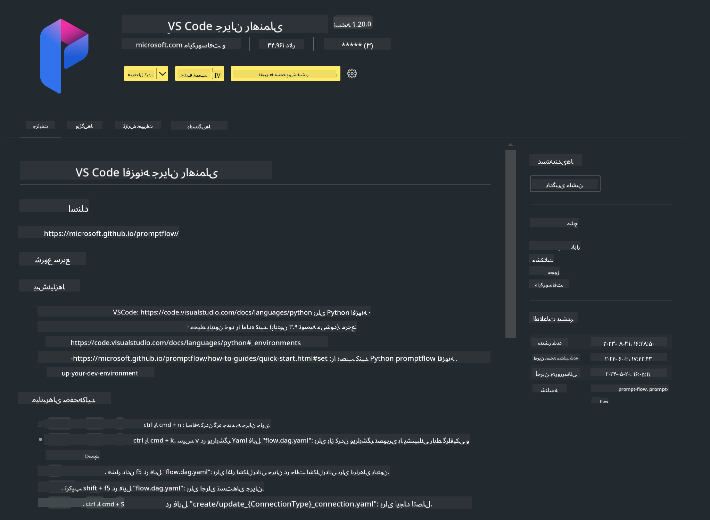

<!--
CO_OP_TRANSLATOR_METADATA:
{
  "original_hash": "4b16264917d9b93169745d92b8ce8c65",
  "translation_date": "2025-05-07T13:54:29+00:00",
  "source_file": "md/02.Application/02.Code/Phi3/VSCodeExt/HOL/Apple/01.Installations.md",
  "language_code": "fa"
}
-->
# **آزمایشگاه 0 - نصب**

وقتی وارد آزمایشگاه می‌شویم، باید محیط مرتبط را پیکربندی کنیم:


### **1. پایتون 3.11+**

توصیه می‌شود برای پیکربندی محیط پایتون خود از miniforge استفاده کنید

برای پیکربندی miniforge، لطفاً به [https://github.com/conda-forge/miniforge](https://github.com/conda-forge/miniforge) مراجعه کنید

پس از پیکربندی miniforge، دستور زیر را در Power Shell اجرا کنید

```bash

conda create -n pyenv python==3.11.8 -y

conda activate pyenv

```


### **2. نصب Prompt flow SDK**

در آزمایشگاه 1، از Prompt flow استفاده می‌کنیم، بنابراین باید SDK مربوط به Prompt flow را پیکربندی کنید.

```bash

pip install promptflow --upgrade

```

می‌توانید با این دستور، promptflow sdk را بررسی کنید

```bash

pf --version

```

### **3. نصب افزونه Prompt flow برای Visual Studio Code**



### **4. چارچوب MLX اپل**

MLX یک چارچوب آرایه‌ای برای پژوهش‌های یادگیری ماشین روی سیلیکون اپل است که توسط تیم پژوهش یادگیری ماشین اپل ارائه شده است. می‌توانید از **چارچوب Apple MLX** برای تسریع LLM / SLM با سیلیکون اپل استفاده کنید. اگر می‌خواهید بیشتر بدانید، می‌توانید به [https://github.com/microsoft/PhiCookBook/blob/main/md/01.Introduction/03/MLX_Inference.md](https://github.com/microsoft/PhiCookBook/blob/main/md/01.Introduction/03/MLX_Inference.md) مراجعه کنید.

نصب کتابخانه چارچوب MLX در bash

```bash

pip install mlx-lm

```


### **5. سایر کتابخانه‌های پایتون**

فایل requirements.txt را ایجاد کرده و این محتوا را اضافه کنید

```txt

notebook
numpy 
scipy 
scikit-learn 
matplotlib 
pandas 
pillow 
graphviz

```


### **6. نصب NVM**

نصب nvm در Powershell

```bash

brew install nvm

```

نصب nodejs نسخه 18.20

```bash

nvm install 18.20.0

nvm use 18.20.0

```

### **7. نصب پشتیبانی توسعه Visual Studio Code**

```bash

npm install --global yo generator-code

```

تبریک! شما با موفقیت SDK را پیکربندی کرده‌اید. حالا می‌توانید به مراحل عملی ادامه دهید.

**سلب مسئولیت**:  
این سند با استفاده از سرویس ترجمه هوش مصنوعی [Co-op Translator](https://github.com/Azure/co-op-translator) ترجمه شده است. در حالی که ما برای دقت تلاش می‌کنیم، لطفاً توجه داشته باشید که ترجمه‌های خودکار ممکن است حاوی خطاها یا نادرستی‌هایی باشند. سند اصلی به زبان بومی آن باید به عنوان منبع معتبر در نظر گرفته شود. برای اطلاعات حیاتی، ترجمه حرفه‌ای انسانی توصیه می‌شود. ما مسئول هیچگونه سوءتفاهم یا برداشت نادرستی که از استفاده این ترجمه ناشی شود، نیستیم.