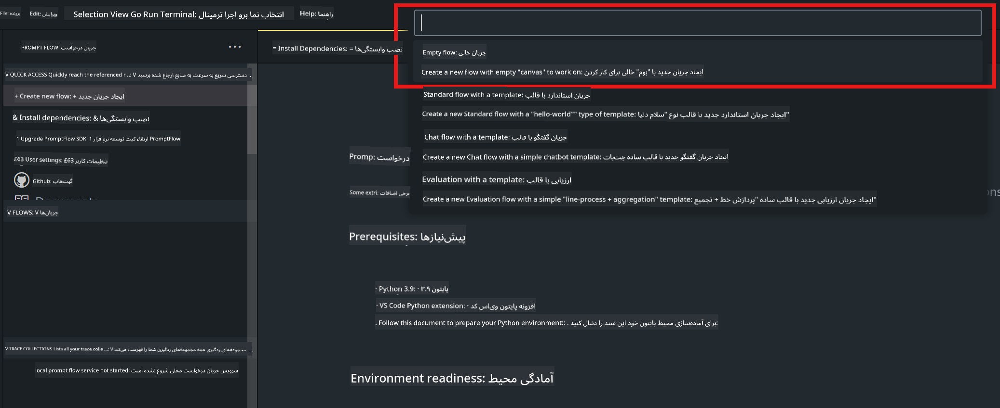

<!--
CO_OP_TRANSLATOR_METADATA:
{
  "original_hash": "3dbbf568625b1ee04b354c2dc81d3248",
  "translation_date": "2025-05-07T13:52:53+00:00",
  "source_file": "md/02.Application/02.Code/Phi3/VSCodeExt/HOL/Apple/02.PromptflowWithMLX.md",
  "language_code": "fa"
}
-->
# **آزمایشگاه ۲ - اجرای Prompt flow با Phi-3-mini در AIPC**

## **Prompt flow چیست**

Prompt flow مجموعه‌ای از ابزارهای توسعه است که برای ساده‌سازی چرخه توسعه کامل برنامه‌های هوش مصنوعی مبتنی بر LLM طراحی شده است، از ایده‌پردازی، نمونه‌سازی، تست، ارزیابی تا استقرار در تولید و نظارت. این ابزار مهندسی پرامپت را بسیار آسان‌تر می‌کند و به شما امکان می‌دهد برنامه‌های LLM با کیفیت تولید بسازید.

با استفاده از prompt flow، شما قادر خواهید بود:

- جریان‌هایی ایجاد کنید که LLMها، پرامپت‌ها، کد پایتون و ابزارهای دیگر را در یک روند اجرایی به هم متصل کنند.

- جریان‌های خود را به‌خصوص تعامل با LLMها به‌سادگی دیباگ و تکرار کنید.

- جریان‌های خود را ارزیابی کنید و معیارهای کیفیت و عملکرد را با مجموعه داده‌های بزرگ‌تر محاسبه کنید.

- تست و ارزیابی را در سیستم CI/CD خود ادغام کنید تا از کیفیت جریان خود اطمینان حاصل کنید.

- جریان‌های خود را به پلتفرم سرویس‌دهی مورد نظر خود مستقر کرده یا به‌راحتی در کد برنامه خود ادغام کنید.

- (اختیاری اما بسیار توصیه شده) با استفاده از نسخه ابری Prompt flow در Azure AI با تیم خود همکاری کنید.

## **ساخت جریان‌های تولید کد روی Apple Silicon**

***Note*** ：اگر نصب محیط را کامل نکرده‌اید، لطفاً به [Lab 0 -Installations](./01.Installations.md) مراجعه کنید.

1. افزونه Prompt flow را در Visual Studio Code باز کنید و یک پروژه جریان خالی ایجاد کنید



2. پارامترهای ورودی و خروجی را اضافه کنید و کد پایتون را به‌عنوان جریان جدید اضافه کنید


می‌توانید برای ساخت جریان خود به این ساختار (flow.dag.yaml) مراجعه کنید

```yaml

inputs:
  prompt:
    type: string
    default: Write python code for Fibonacci serie. Please use markdown as output
outputs:
  result:
    type: string
    reference: ${gen_code_by_phi3.output}
nodes:
- name: gen_code_by_phi3
  type: python
  source:
    type: code
    path: gen_code_by_phi3.py
  inputs:
    prompt: ${inputs.prompt}


```

3. کمیت‌سازی phi-3-mini

هدف ما اجرای بهتر SLM روی دستگاه‌های محلی است. معمولاً مدل را کمیت‌سازی می‌کنیم (INT4، FP16، FP32)

```bash

python -m mlx_lm.convert --hf-path microsoft/Phi-3-mini-4k-instruct

```

**Note:** پوشه پیش‌فرض mlx_model است

4. کد را در ***Chat_With_Phi3.py*** اضافه کنید

```python


from promptflow import tool

from mlx_lm import load, generate


# The inputs section will change based on the arguments of the tool function, after you save the code
# Adding type to arguments and return value will help the system show the types properly
# Please update the function name/signature per need
@tool
def my_python_tool(prompt: str) -> str:

    model_id = './mlx_model_phi3_mini'

    model, tokenizer = load(model_id)

    # <|user|>\nWrite python code for Fibonacci serie. Please use markdown as output<|end|>\n<|assistant|>

    response = generate(model, tokenizer, prompt="<|user|>\n" + prompt  + "<|end|>\n<|assistant|>", max_tokens=2048, verbose=True)

    return response


```

4. می‌توانید جریان را از طریق Debug یا Run تست کنید تا بررسی کنید کد تولید به درستی کار می‌کند یا خیر


5. اجرای جریان به‌عنوان API توسعه در ترمینال

```

pf flow serve --source ./ --port 8080 --host localhost   

```

می‌توانید آن را در Postman / Thunder Client تست کنید

### **Note**

1. اولین اجرا زمان زیادی می‌برد. توصیه می‌شود مدل phi-3 را از طریق Hugging face CLI دانلود کنید.

2. با توجه به محدودیت قدرت محاسباتی Intel NPU، توصیه می‌شود از Phi-3-mini-4k-instruct استفاده کنید.

3. ما از شتاب‌دهنده Intel NPU برای کمیت‌سازی تبدیل INT4 استفاده می‌کنیم، اما اگر سرویس را دوباره اجرا کنید، باید پوشه‌های cache و nc_workshop را حذف کنید.

## **منابع**

1. آموزش Promptflow [https://microsoft.github.io/promptflow/](https://microsoft.github.io/promptflow/)

2. آموزش شتاب‌دهنده Intel NPU [https://github.com/intel/intel-npu-acceleration-library](https://github.com/intel/intel-npu-acceleration-library)

3. کد نمونه، دانلود [Local NPU Agent Sample Code](../../../../../../../../../code/07.Lab/01/AIPC/local-npu-agent)

**سلب مسئولیت**:  
این سند با استفاده از سرویس ترجمه هوش مصنوعی [Co-op Translator](https://github.com/Azure/co-op-translator) ترجمه شده است. در حالی که ما در تلاش برای دقت هستیم، لطفاً توجه داشته باشید که ترجمه‌های خودکار ممکن است حاوی خطاها یا نادرستی‌هایی باشند. سند اصلی به زبان بومی آن باید به عنوان منبع معتبر در نظر گرفته شود. برای اطلاعات حیاتی، ترجمه حرفه‌ای انسانی توصیه می‌شود. ما مسئول هیچ گونه سوء تفاهم یا تفسیر نادرستی که ناشی از استفاده از این ترجمه باشد، نیستیم.