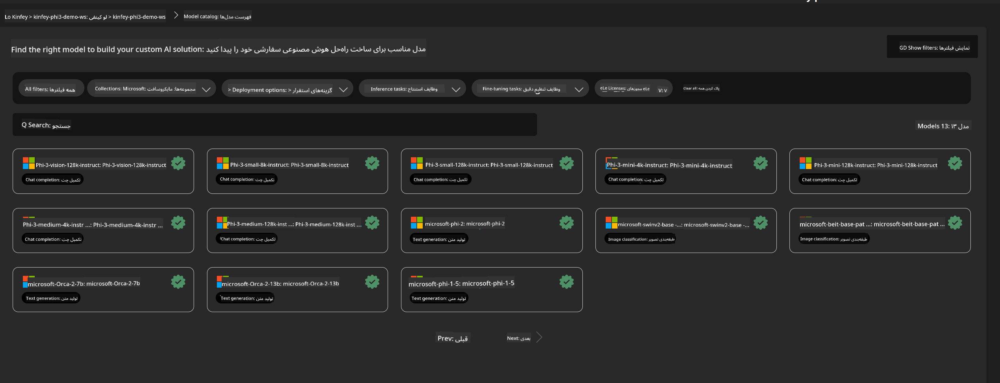
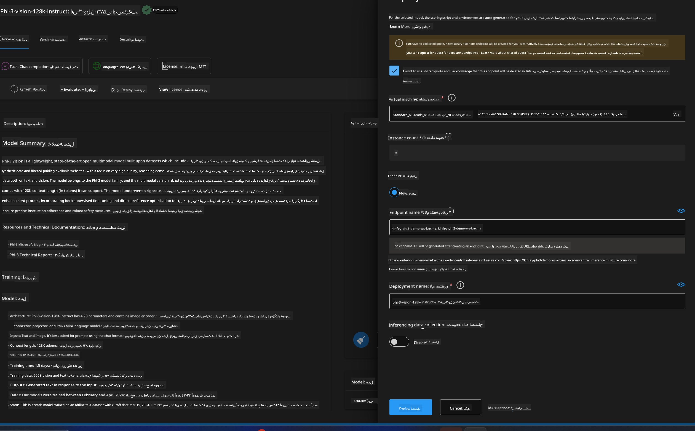
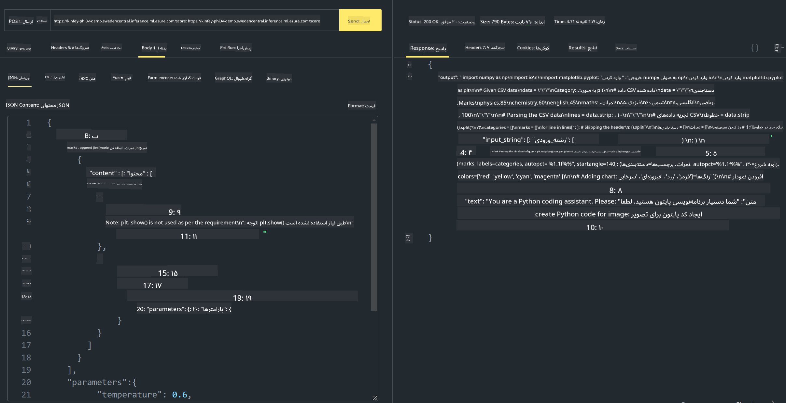

<!--
CO_OP_TRANSLATOR_METADATA:
{
  "original_hash": "20cb4e6ac1686248e8be913ccf6c2bc2",
  "translation_date": "2025-05-07T13:55:21+00:00",
  "source_file": "md/02.Application/02.Code/Phi3/VSCodeExt/HOL/Apple/03.DeployPhi3VisionOnAzure.md",
  "language_code": "fa"
}
-->
# **آزمایشگاه ۳ - استقرار Phi-3-vision در Azure Machine Learning Service**

ما از NPU برای انجام استقرار تولید کد محلی استفاده می‌کنیم، سپس می‌خواهیم قابلیت معرفی PHI-3-VISION را از طریق آن فراهم کنیم تا بتوانیم تصاویر را به کد تبدیل کنیم.

در این معرفی، می‌توانیم به سرعت یک سرویس مدل به عنوان سرویس Phi-3 Vision را در Azure Machine Learning Service بسازیم.

***Note***: Phi-3 Vision برای تولید محتوا با سرعت بالاتر به قدرت پردازشی نیاز دارد. ما به قدرت پردازش ابری نیاز داریم تا این کار را برایمان ممکن کند.


### **۱. ایجاد Azure Machine Learning Service**

ما باید یک Azure Machine Learning Service در پورتال Azure ایجاد کنیم. اگر می‌خواهید نحوه انجام آن را یاد بگیرید، لطفاً به این لینک مراجعه کنید [https://learn.microsoft.com/azure/machine-learning/quickstart-create-resources?view=azureml-api-2](https://learn.microsoft.com/azure/machine-learning/quickstart-create-resources?view=azureml-api-2)


### **۲. انتخاب Phi-3 Vision در Azure Machine Learning Service**




### **۳. استقرار Phi-3-Vision در Azure**





### **۴. تست Endpoint در Postman**





***Note***

۱. پارامترهای ارسالی باید شامل Authorization، azureml-model-deployment و Content-Type باشند. برای به دست آوردن این مقادیر باید اطلاعات استقرار را بررسی کنید.

۲. برای ارسال پارامترها، Phi-3-Vision نیاز به ارسال لینک تصویر دارد. لطفاً به روش GPT-4-Vision برای ارسال پارامترها مراجعه کنید، مانند

```json

{
  "input_data":{
    "input_string":[
      {
        "role":"user",
        "content":[ 
          {
            "type": "text",
            "text": "You are a Python coding assistant.Please create Python code for image "
          },
          {
              "type": "image_url",
              "image_url": {
                "url": "https://ajaytech.co/wp-content/uploads/2019/09/index.png"
              }
          }
        ]
      }
    ],
    "parameters":{
          "temperature": 0.6,
          "top_p": 0.9,
          "do_sample": false,
          "max_new_tokens": 2048
    }
  }
}

```

۳. با متد Post به **/score** فراخوانی کنید

**تبریک!** شما استقرار سریع PHI-3-VISION را به پایان رسانده‌اید و نحوه استفاده از تصاویر برای تولید کد را امتحان کرده‌اید. در ادامه می‌توانیم برنامه‌ها را با ترکیب NPU و سرویس‌های ابری بسازیم.

**سلب مسئولیت**:  
این سند با استفاده از سرویس ترجمه هوش مصنوعی [Co-op Translator](https://github.com/Azure/co-op-translator) ترجمه شده است. در حالی که ما برای دقت تلاش می‌کنیم، لطفاً توجه داشته باشید که ترجمه‌های خودکار ممکن است حاوی اشتباهات یا نواقصی باشند. سند اصلی به زبان بومی آن باید به عنوان منبع معتبر در نظر گرفته شود. برای اطلاعات حیاتی، ترجمه حرفه‌ای انسانی توصیه می‌شود. ما مسئول هیچ گونه سوءتفاهم یا تفسیر نادرست ناشی از استفاده از این ترجمه نیستیم.