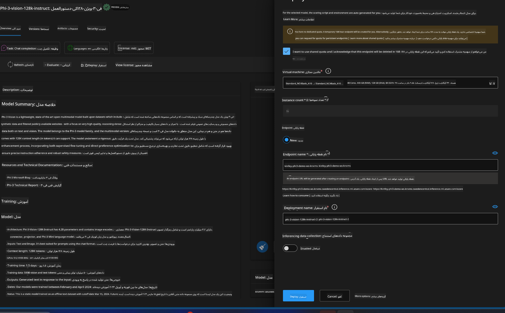

<!--
CO_OP_TRANSLATOR_METADATA:
{
  "original_hash": "20cb4e6ac1686248e8be913ccf6c2bc2",
  "translation_date": "2025-07-17T04:31:02+00:00",
  "source_file": "md/02.Application/02.Code/Phi3/VSCodeExt/HOL/Apple/03.DeployPhi3VisionOnAzure.md",
  "language_code": "fa"
}
-->
# **آزمایشگاه ۳ - استقرار Phi-3-vision در سرویس یادگیری ماشین Azure**

ما از NPU برای تکمیل استقرار تولید کد محلی استفاده می‌کنیم، و سپس می‌خواهیم قابلیت معرفی PHI-3-VISION را از طریق آن فراهم کنیم تا بتوانیم تصاویر را به کد تبدیل کنیم.

در این معرفی، می‌توانیم به سرعت یک سرویس مدل به عنوان سرویس Phi-3 Vision را در سرویس یادگیری ماشین Azure بسازیم.

***Note***: Phi-3 Vision برای تولید محتوا با سرعت بالاتر به قدرت محاسباتی نیاز دارد. ما به قدرت محاسبات ابری نیاز داریم تا به ما در این زمینه کمک کند.

### **۱. ایجاد سرویس یادگیری ماشین Azure**

ما باید یک سرویس یادگیری ماشین Azure را در پرتال Azure ایجاد کنیم. اگر می‌خواهید نحوه انجام این کار را یاد بگیرید، لطفاً به این لینک مراجعه کنید [https://learn.microsoft.com/azure/machine-learning/quickstart-create-resources?view=azureml-api-2](https://learn.microsoft.com/azure/machine-learning/quickstart-create-resources?view=azureml-api-2)

### **۲. انتخاب Phi-3 Vision در سرویس یادگیری ماشین Azure**


### **۳. استقرار Phi-3-Vision در Azure**



### **۴. آزمایش Endpoint در Postman**


***Note***

1. پارامترهایی که باید ارسال شوند باید شامل Authorization، azureml-model-deployment و Content-Type باشند. شما باید اطلاعات استقرار را بررسی کنید تا این موارد را به دست آورید.

2. برای ارسال پارامترها، Phi-3-Vision نیاز دارد که لینک تصویر ارسال شود. لطفاً به روش GPT-4-Vision برای ارسال پارامترها مراجعه کنید، مانند

```json

{
  "input_data":{
    "input_string":[
      {
        "role":"user",
        "content":[ 
          {
            "type": "text",
            "text": "You are a Python coding assistant.Please create Python code for image "
          },
          {
              "type": "image_url",
              "image_url": {
                "url": "https://ajaytech.co/wp-content/uploads/2019/09/index.png"
              }
          }
        ]
      }
    ],
    "parameters":{
          "temperature": 0.6,
          "top_p": 0.9,
          "do_sample": false,
          "max_new_tokens": 2048
    }
  }
}

```

3. با استفاده از متد Post، به **/score** فراخوانی کنید

**تبریک می‌گوییم**! شما استقرار سریع PHI-3-VISION را به پایان رسانده‌اید و نحوه استفاده از تصاویر برای تولید کد را امتحان کرده‌اید. در ادامه، می‌توانیم برنامه‌هایی را با ترکیب NPU و ابر بسازیم.

**سلب مسئولیت**:  
این سند با استفاده از سرویس ترجمه هوش مصنوعی [Co-op Translator](https://github.com/Azure/co-op-translator) ترجمه شده است. در حالی که ما در تلاش برای دقت هستیم، لطفاً توجه داشته باشید که ترجمه‌های خودکار ممکن است حاوی خطاها یا نواقصی باشند. سند اصلی به زبان بومی خود باید به عنوان منبع معتبر در نظر گرفته شود. برای اطلاعات حیاتی، ترجمه حرفه‌ای انسانی توصیه می‌شود. ما مسئول هیچ گونه سوءتفاهم یا تفسیر نادرستی که از استفاده از این ترجمه ناشی شود، نیستیم.