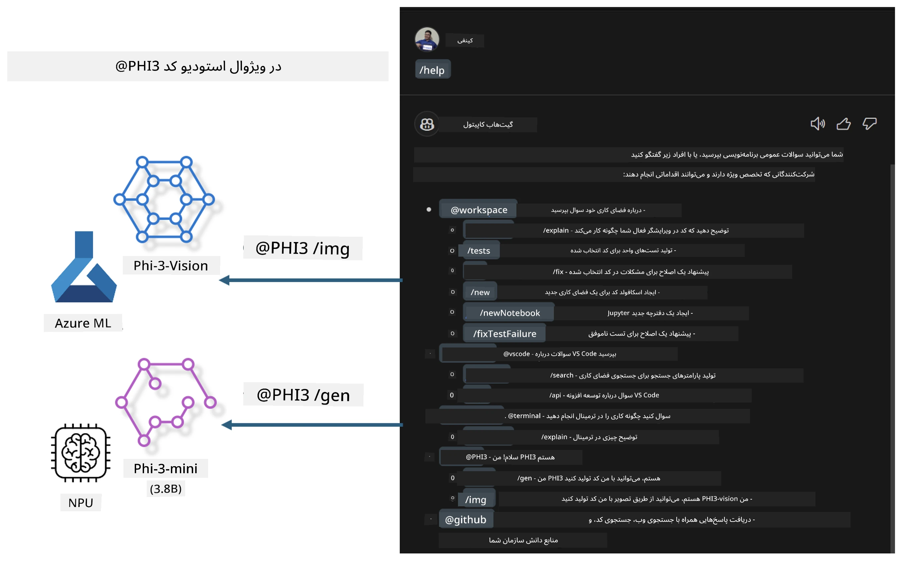

# **ساخت Visual Studio Code GitHub Copilot Chat اختصاصی با خانواده Microsoft Phi-3**

آیا تا به حال از عامل workspace در GitHub Copilot Chat استفاده کرده‌اید؟ آیا می‌خواهید عامل کد اختصاصی تیم خود را بسازید؟ این آزمایش کاربردی امیدوار است مدل متن‌باز را ترکیب کند تا یک عامل کد تجاری در سطح سازمانی بسازد.

## **مبانی**

### **چرا Microsoft Phi-3 را انتخاب کنیم**

Phi-3 یک سری خانواده‌ای است که شامل phi-3-mini، phi-3-small و phi-3-medium بر اساس پارامترهای مختلف آموزش برای تولید متن، تکمیل دیالوگ و تولید کد می‌باشد. همچنین phi-3-vision مبتنی بر Vision وجود دارد. این خانواده برای شرکت‌ها یا تیم‌های مختلف مناسب است تا راهکارهای تولید هوش مصنوعی آفلاین بسازند.

پیشنهاد می‌شود این لینک را مطالعه کنید [https://github.com/microsoft/PhiCookBook/blob/main/md/01.Introduction/01/01.PhiFamily.md](https://github.com/microsoft/PhiCookBook/blob/main/md/01.Introduction/01/01.PhiFamily.md)

### **Microsoft GitHub Copilot Chat**

افزونه GitHub Copilot Chat یک رابط گفتگویی به شما می‌دهد که می‌توانید با GitHub Copilot تعامل داشته باشید و پاسخ‌های مرتبط با برنامه‌نویسی را مستقیماً در VS Code دریافت کنید، بدون نیاز به مرور مستندات یا جستجو در انجمن‌های آنلاین.

Copilot Chat ممکن است از هایلایت نحو، تورفتگی و سایر ویژگی‌های قالب‌بندی برای وضوح پاسخ تولید شده استفاده کند. بسته به نوع سؤال کاربر، نتیجه می‌تواند شامل لینک‌هایی به متنی باشد که Copilot برای تولید پاسخ استفاده کرده، مانند فایل‌های کد منبع یا مستندات، یا دکمه‌هایی برای دسترسی به قابلیت‌های VS Code.

- Copilot Chat در جریان توسعه شما یکپارچه شده و در جایی که نیاز است به شما کمک می‌کند:

- مستقیم از ویرایشگر یا ترمینال گفتگوی داخلی را برای کمک هنگام کدنویسی آغاز کنید

- از نمای گفت‌وگو استفاده کنید تا یک دستیار هوش مصنوعی در کنار خود داشته باشید که در هر زمان کمک کند

- گفتگوی سریع را برای پرسیدن سؤال فوری راه‌اندازی کنید و سریع به کار خود بازگردید

می‌توانید از GitHub Copilot Chat در سناریوهای مختلف استفاده کنید، مانند:

- پاسخ دادن به پرسش‌های برنامه‌نویسی درباره بهترین راه حل مشکلات

- توضیح کد دیگران و پیشنهاد بهبودها

- پیشنهاد رفع مشکلات کد

- تولید موارد تست واحد

- تولید مستندات کد

پیشنهاد می‌شود این لینک را مطالعه کنید [https://code.visualstudio.com/docs/copilot/copilot-chat](https://code.visualstudio.com/docs/copilot/copilot-chat?WT.mc_id=aiml-137032-kinfeylo)

###  **Microsoft GitHub Copilot Chat @workspace**

ارجاع به **@workspace** در Copilot Chat به شما امکان می‌دهد درباره کل کدبیس خود سؤال بپرسید. بر اساس سؤال، Copilot به هوشمندی فایل‌ها و نمادهای مرتبط را بازیابی می‌کند و آنها را به صورت لینک و نمونه کد در پاسخ خود ارجاع می‌دهد.

برای پاسخ به سؤال شما، **@workspace** از همان منابعی استفاده می‌کند که یک توسعه‌دهنده هنگام مرور کدبیس در VS Code استفاده می‌کند:

- تمامی فایل‌ها در محیط کاری، به جز فایل‌هایی که توسط فایل .gitignore نادیده گرفته شده‌اند

- ساختار دایرکتوری با نام پوشه‌ها و فایل‌های تو در تو

- شاخص جستجوی کد GitHub، اگر محیط کاری یک مخزن GitHub بوده و توسط جستجوی کد نمایه شده باشد

- نمادها و تعاریف در محیط کاری

- متن انتخاب شده فعلی یا متن قابل مشاهده در ویرایشگر فعال

توجه: فایل .gitignore نادیده گرفته می‌شود اگر فایلی باز باشد یا متنی داخل فایل نادیده گرفته شده انتخاب شده باشد.

پیشنهاد می‌شود این لینک را مطالعه کنید [[https://code.visualstudio.com/docs/copilot/copilot-chat](https://code.visualstudio.com/docs/copilot/workspace-context?WT.mc_id=aiml-137032-kinfeylo)]

## **بیشتر درباره این آزمایش**

GitHub Copilot به طور چشمگیری کارایی برنامه‌نویسی در سازمان‌ها را افزایش داده است، و هر سازمانی امید دارد عملکردهای مرتبط GitHub Copilot را سفارشی کند. بسیاری از سازمان‌ها بر اساس سناریوهای تجاری خود و مدل‌های متن‌باز، افزونه‌های مشابه GitHub Copilot را سفارشی کرده‌اند. برای سازمان‌ها، افزونه‌های سفارشی آسان‌تر مدیریت می‌شوند، اما این روی تجربه کاربری تأثیر می‌گذارد. به هر حال، GitHub Copilot در برخورد با سناریوهای عمومی و حرفه‌ای عملکرد قوی‌تری دارد. اگر امکان حفظ تجربه سازگار باشد، سفارشی‌سازی افزونه سازمان بهتر خواهد بود. GitHub Copilot Chat APIهای مرتبطی برای توسعه در تجربه چت ارائه می‌دهد. حفظ تجربه سازگار و داشتن قابلیت‌های سفارشی تجربه کاربری بهتری است.

این آزمایش عمدتاً از مدل Phi-3 به همراه NPU محلی و ترکیب Azure برای ساخت یک عامل سفارشی در GitHub Copilot Chat به نام ***@PHI3*** استفاده می‌کند تا به توسعه‌دهندگان سازمان در تکمیل تولید کد ***(@PHI3 /gen)*** و تولید کد بر اساس تصاویر ***(@PHI3 /img)*** کمک کند.

### ***توجه:*** 

این آزمایش در حال حاضر در AIPC پردازنده‌های Intel و Apple Silicon پیاده‌سازی شده است. نسخه NPU کوالکام نیز به‌زودی به‌روزرسانی خواهد شد.

## **آزمایشگاه**

| نام | توضیحات | AIPC | Apple |
| ------------ | ----------- | -------- |-------- |
| Lab0 - نصب‌ها(✅) | پیکربندی و نصب محیط‌ها و ابزارهای مورد نیاز | [برو](./HOL/AIPC/01.Installations.md) |[برو](./HOL/Apple/01.Installations.md) |
| Lab1 - اجرای Prompt flow با Phi-3-mini (✅) | ادغام با AIPC / Apple Silicon، استفاده از NPU محلی برای ایجاد تولید کد با Phi-3-mini | [برو](./HOL/AIPC/02.PromptflowWithNPU.md) |  [برو](./HOL/Apple/02.PromptflowWithMLX.md) |
| Lab2 - استقرار Phi-3-vision در سرویس Azure Machine Learning (✅) | تولید کد با استقرار کاتالوگ مدل سرویس Azure Machine Learning - تصویر Phi-3-vision | [برو](./HOL/AIPC/03.DeployPhi3VisionOnAzure.md) |[برو](./HOL/Apple/03.DeployPhi3VisionOnAzure.md) |
| Lab3 - ساخت عامل @phi-3 در GitHub Copilot Chat(✅)  | ساخت عامل Phi-3 سفارشی در GitHub Copilot Chat برای تکمیل تولید کد، تولید کد گراف، RAG و غیره | [برو](./HOL/AIPC/04.CreatePhi3AgentInVSCode.md) | [برو](./HOL/Apple/04.CreatePhi3AgentInVSCode.md) |
| نمونه کد (✅)  | دانلود نمونه کد | [برو](../../../../../../../code/07.Lab/01/AIPC) | [برو](../../../../../../../code/07.Lab/01/Apple) |

## **منابع**

1. Phi-3 Cookbook [https://github.com/microsoft/Phi-3CookBook](https://github.com/microsoft/Phi-3CookBook)

2. بیشتر درباره GitHub Copilot بیاموزید [https://learn.microsoft.com/training/paths/copilot/](https://learn.microsoft.com/training/paths/copilot/?WT.mc_id=aiml-137032-kinfeylo)

3. بیشتر درباره GitHub Copilot Chat بیاموزید [https://learn.microsoft.com/training/paths/accelerate-app-development-using-github-copilot/](https://learn.microsoft.com/training/paths/accelerate-app-development-using-github-copilot/?WT.mc_id=aiml-137032-kinfeylo)

4. بیشتر درباره GitHub Copilot Chat API بیاموزید [https://code.visualstudio.com/api/extension-guides/chat](https://code.visualstudio.com/api/extension-guides/chat?WT.mc_id=aiml-137032-kinfeylo)

5. بیشتر درباره Microsoft Foundry بیاموزید [https://learn.microsoft.com/training/paths/create-custom-copilots-ai-studio/](https://learn.microsoft.com/training/paths/create-custom-copilots-ai-studio/?WT.mc_id=aiml-137032-kinfeylo)

6. بیشتر درباره کاتالوگ مدل Microsoft Foundry بیاموزید [https://learn.microsoft.com/azure/ai-studio/how-to/model-catalog-overview](https://learn.microsoft.com/azure/ai-studio/how-to/model-catalog-overview)

---

<!-- CO-OP TRANSLATOR DISCLAIMER START -->
**اعلان مسئولیت**:  
این سند با استفاده از سرویس ترجمه هوش مصنوعی [Co-op Translator](https://github.com/Azure/co-op-translator) ترجمه شده است. در حالی که ما برای دقت تلاش می‌کنیم، لطفاً توجه داشته باشید که ترجمه‌های خودکار ممکن است حاوی اشتباهات یا نواقص باشند. سند اصلی به زبان مادری آن باید به‌عنوان منبع معتبر در نظر گرفته شود. برای اطلاعات حیاتی، ترجمه حرفه‌ای انسانی توصیه می‌شود. ما در قبال هرگونه سوء تفاهم یا تفسیر نادرست ناشی از استفاده از این ترجمه مسئولیتی نداریم.
<!-- CO-OP TRANSLATOR DISCLAIMER END -->