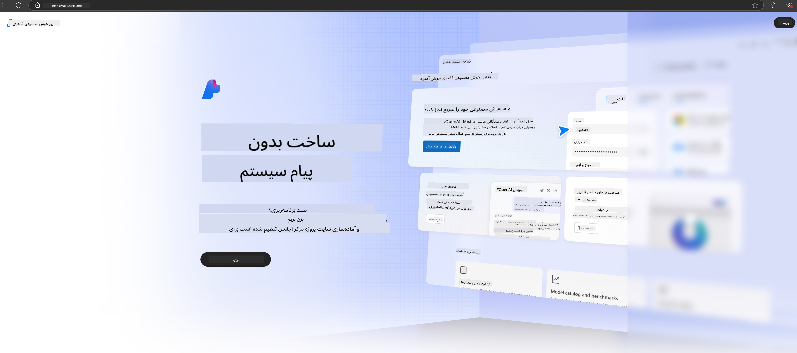

<!--
CO_OP_TRANSLATOR_METADATA:
{
  "original_hash": "3a1e48b628022485aac989c9f733e792",
  "translation_date": "2025-05-07T13:06:15+00:00",
  "source_file": "md/02.QuickStart/AzureAIFoundry_QuickStart.md",
  "language_code": "fa"
}
-->
# **استفاده از Phi-3 در Azure AI Foundry**

با پیشرفت هوش مصنوعی مولد، هدف ما استفاده از یک پلتفرم یکپارچه برای مدیریت مدل‌های زبان بزرگ (LLM) و مدل‌های زبان کوچک (SLM)، یکپارچه‌سازی داده‌های سازمانی، عملیات تنظیم دقیق/RAG، و ارزیابی کسب‌وکارهای مختلف سازمانی پس از ادغام LLM و SLM است تا برنامه‌های هوشمند مبتنی بر هوش مصنوعی مولد بهتر اجرا شوند. [Azure AI Foundry](https://ai.azure.com) یک پلتفرم کاربردی هوش مصنوعی مولد در سطح سازمانی است.

با Azure AI Foundry می‌توانید پاسخ‌های مدل زبان بزرگ (LLM) را ارزیابی کرده و اجزای برنامه درخواست را با prompt flow هماهنگ کنید تا عملکرد بهتری داشته باشید. این پلتفرم امکان مقیاس‌پذیری را فراهم می‌کند تا نمونه‌های اولیه به راحتی به تولید کامل تبدیل شوند. نظارت و بهبود مداوم، موفقیت بلندمدت را تضمین می‌کند.

می‌توانیم مدل Phi-3 را به سرعت در Azure AI Foundry از طریق مراحل ساده مستقر کنیم و سپس با استفاده از Azure AI Foundry کارهای مرتبط با Playground/Chat، تنظیم دقیق، ارزیابی و سایر امور مرتبط با Phi-3 را انجام دهیم.

## **1. آماده‌سازی**

اگر از قبل [Azure Developer CLI](https://learn.microsoft.com/azure/developer/azure-developer-cli/overview?WT.mc_id=aiml-138114-kinfeylo) را روی دستگاه خود نصب کرده‌اید، استفاده از این قالب به سادگی اجرای این دستور در یک دایرکتوری جدید است.

## ایجاد دستی

ساخت یک پروژه و هاب در Microsoft Azure AI Foundry راهی عالی برای سازماندهی و مدیریت کارهای هوش مصنوعی شماست. در اینجا راهنمای گام به گام برای شروع آورده شده است:

### ساخت پروژه در Azure AI Foundry

1. **وارد Azure AI Foundry شوید**: به پورتال Azure AI Foundry وارد شوید.
2. **ایجاد پروژه**:
   - اگر در یک پروژه هستید، در بالای صفحه سمت چپ «Azure AI Foundry» را انتخاب کنید تا به صفحه اصلی بروید.
   - روی "+ Create project" کلیک کنید.
   - نامی برای پروژه وارد کنید.
   - اگر هاب دارید، به طور پیش‌فرض انتخاب می‌شود. اگر به بیش از یک هاب دسترسی دارید، می‌توانید از منوی کشویی هاب دیگری را انتخاب کنید. اگر می‌خواهید هاب جدیدی بسازید، «Create new hub» را انتخاب کرده و نامی وارد کنید.
   - روی «Create» کلیک کنید.

### ساخت هاب در Azure AI Foundry

1. **وارد Azure AI Foundry شوید**: با حساب Azure خود وارد شوید.
2. **ایجاد هاب**:
   - از منوی سمت چپ، مرکز مدیریت را انتخاب کنید.
   - «All resources» را انتخاب کنید، سپس فلش پایین کنار «+ New project» را زده و «+ New hub» را انتخاب کنید.
   - در پنجره «Create a new hub»، نام هاب خود (مثلاً contoso-hub) را وارد کرده و سایر فیلدها را به دلخواه تنظیم کنید.
   - روی «Next» کلیک کرده، اطلاعات را مرور کنید و سپس «Create» را بزنید.

برای دستورالعمل‌های دقیق‌تر می‌توانید به مستندات رسمی [مایکروسافت](https://learn.microsoft.com/azure/ai-studio/how-to/create-projects) مراجعه کنید.

پس از ساخت موفق، می‌توانید از طریق [ai.azure.com](https://ai.azure.com/) به استودیویی که ساخته‌اید دسترسی داشته باشید.

ممکن است چندین پروژه در یک AI Foundry وجود داشته باشد. برای آماده‌سازی، یک پروژه در AI Foundry بسازید.

ساخت Azure AI Foundry [QuickStarts](https://learn.microsoft.com/azure/ai-studio/quickstarts/get-started-code)

## **2. استقرار مدل Phi در Azure AI Foundry**

گزینه Explore پروژه را کلیک کنید تا وارد Model Catalog شوید و Phi-3 را انتخاب کنید.

Phi-3-mini-4k-instruct را انتخاب کنید.

برای استقرار مدل Phi-3-mini-4k-instruct روی «Deploy» کلیک کنید.

> [!NOTE]
>
> هنگام استقرار می‌توانید قدرت محاسباتی را انتخاب کنید

## **3. چت Playground با Phi در Azure AI Foundry**

به صفحه استقرار بروید، Playground را انتخاب کنید و با Phi-3 در Azure AI Foundry گفتگو کنید.

## **4. استقرار مدل از Azure AI Foundry**

برای استقرار مدل از Azure Model Catalog، مراحل زیر را دنبال کنید:

- وارد Azure AI Foundry شوید.
- مدلی را که می‌خواهید مستقر کنید از کاتالوگ مدل‌های Azure AI Foundry انتخاب کنید.
- در صفحه جزئیات مدل، روی Deploy کلیک کرده و سپس Serverless API با Azure AI Content Safety را انتخاب کنید.
- پروژه‌ای که می‌خواهید مدل‌ها را در آن مستقر کنید انتخاب کنید. برای استفاده از Serverless API، فضای کاری شما باید در منطقه East US 2 یا Sweden Central باشد. می‌توانید نام استقرار را سفارشی کنید.
- در جادوگر استقرار، بخش Pricing and terms را برای آشنایی با قیمت و شرایط استفاده انتخاب کنید.
- روی Deploy کلیک کنید. تا آماده شدن استقرار صبر کنید و وقتی به صفحه Deployments هدایت شدید، ادامه دهید.
- برای شروع تعامل با مدل، Open in playground را انتخاب کنید.
- می‌توانید به صفحه Deployments بازگردید، استقرار را انتخاب کنید و URL هدف و کلید مخفی را یادداشت کنید که برای فراخوانی استقرار و تولید پاسخ‌ها استفاده می‌شود.
- همیشه می‌توانید جزئیات endpoint، URL و کلیدهای دسترسی را با رفتن به تب Build و انتخاب Deployments از بخش Components پیدا کنید.

> [!NOTE]
> توجه داشته باشید که حساب کاربری شما باید مجوزهای نقش Azure AI Developer را روی Resource Group داشته باشد تا بتوانید این مراحل را انجام دهید.

## **5. استفاده از Phi API در Azure AI Foundry**

می‌توانید از طریق Postman با درخواست GET به https://{Your project name}.region.inference.ml.azure.com/swagger.json دسترسی پیدا کنید و با استفاده از کلید، رابط‌های ارائه شده را بررسی کنید.

پارامترهای درخواست و پاسخ را به راحتی می‌توانید دریافت کنید.

**سلب مسئولیت**:  
این سند با استفاده از سرویس ترجمه هوش مصنوعی [Co-op Translator](https://github.com/Azure/co-op-translator) ترجمه شده است. در حالی که ما در تلاش برای دقت هستیم، لطفاً توجه داشته باشید که ترجمه‌های خودکار ممکن است شامل خطاها یا نادرستی‌هایی باشند. سند اصلی به زبان بومی آن باید به عنوان منبع معتبر در نظر گرفته شود. برای اطلاعات حیاتی، توصیه می‌شود از ترجمه حرفه‌ای انسانی استفاده شود. ما مسئول هیچ گونه سوءتفاهم یا تفسیر نادرستی که ناشی از استفاده از این ترجمه باشد، نیستیم.