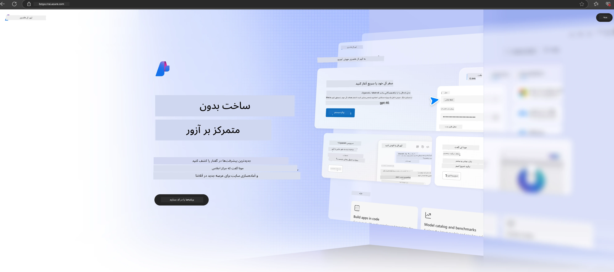

# **استفاده از Phi-3 در Microsoft Foundry**

با توسعه هوش مصنوعی مولد، هدف ما استفاده از یک پلتفرم یکپارچه برای مدیریت مدل‌های زبان بزرگ (LLM) و مدل‌های زبان کوچک (SLM)، یکپارچه‌سازی داده‌های سازمانی، عملیات تطبیق دقیق/ RAG و ارزیابی کسب‌وکارهای مختلف سازمانی پس از ادغام LLM و SLM و غیره است، تا برنامه‌های هوشمند مبتنی بر هوش مصنوعی مولد بهتر پیاده‌سازی شوند. [Microsoft Foundry](https://ai.azure.com) یک پلتفرم برنامه‌های هوش مصنوعی مولد در سطح سازمانی است.

با استفاده از Microsoft Foundry، می‌توانید پاسخ‌های مدل زبان بزرگ (LLM) را ارزیابی کنید و اجزای برنامه درخواست را با جریان درخواست (prompt flow) برای عملکرد بهتر هماهنگ کنید. این پلتفرم امکان مقیاس‌پذیری را برای تبدیل نمونه‌های مفهومی به تولید کامل به آسانی فراهم می‌کند. نظارت و اصلاح مداوم، پشتیبانی موفقیت بلندمدت را تضمین می‌کند.

می‌توانیم مدل Phi-3 را به سرعت و از طریق مراحل ساده بر روی Microsoft Foundry مستقر کنیم و سپس با استفاده از Microsoft Foundry کارهای مربوط به Playground/چت، تطبیق دقیق، ارزیابی و سایر کارهای مرتبط با Phi-3 را انجام دهیم.

## **1. آماده‌سازی**

اگر شما قبلاً [Azure Developer CLI](https://learn.microsoft.com/azure/developer/azure-developer-cli/overview?WT.mc_id=aiml-138114-kinfeylo) را روی دستگاه خود نصب کرده‌اید، استفاده از این قالب به سادگی اجرای این دستور در یک پوشه جدید است.

## ایجاد دستی

ایجاد یک پروژه و هاب Microsoft Foundry راه بسیار خوبی برای سازماندهی و مدیریت کارهای هوش مصنوعی شماست. در اینجا یک راهنمای گام‌به‌گام برای شروع شما آمده است:

### ایجاد پروژه در Microsoft Foundry

1. **وارد Microsoft Foundry شوید**: در پورتال Microsoft Foundry وارد شوید.
2. **ایجاد پروژه**:
   - اگر در یک پروژه هستید، برای بازگشت به صفحه اصلی، در بالای سمت چپ صفحه "Microsoft Foundry" را انتخاب کنید.
   - "+ ایجاد پروژه" را انتخاب کنید.
   - یک نام برای پروژه وارد کنید.
   - اگر هابی دارید، به صورت پیش‌فرض انتخاب می‌شود. اگر به بیش از یک هاب دسترسی دارید، می‌توانید هاب دیگری را از فهرست کشویی انتخاب کنید. اگر می‌خواهید یک هاب جدید بسازید، گزینه "ایجاد هاب جدید" را انتخاب کرده و یک نام ارائه دهید.
   - "ایجاد" را انتخاب کنید.

### ایجاد هاب در Microsoft Foundry

1. **وارد Microsoft Foundry شوید**: با حساب Azure خود وارد شوید.
2. **ایجاد هاب**:
   - از منوی سمت چپ، مرکز مدیریت را انتخاب کنید.
   - "تمام منابع" را انتخاب کنید، سپس پیکان پایین کنار "+ پروژه جدید" را زده و "+ هاب جدید" را انتخاب کنید.
   - در کادر گفتگوی "ایجاد هاب جدید"، نامی برای هاب خود وارد کنید (مثلاً contoso-hub) و سایر موارد را در صورت نیاز تغییر دهید.
   - "بعدی" را انتخاب کنید، اطلاعات را بازبینی کرده و سپس "ایجاد" را بزنید.

برای دستورالعمل‌های دقیق‌تر، می‌توانید به مستندات رسمی [مایکروسافت](https://learn.microsoft.com/azure/ai-studio/how-to/create-projects) مراجعه کنید.

پس از ایجاد موفق، می‌توانید از طریق [ai.azure.com](https://ai.azure.com/) به استودیویی که ایجاد کرده‌اید دسترسی پیدا کنید.

ممکن است چندین پروژه روی یک AI Foundry وجود داشته باشد. برای آماده‌سازی، در AI Foundry پروژه‌ای ایجاد کنید.

ایجاد Microsoft Foundry [QuickStarts](https://learn.microsoft.com/azure/ai-studio/quickstarts/get-started-code)

## **2. استقرار مدل Phi در Microsoft Foundry**

گزینه Explore پروژه را کلیک کنید تا وارد کاتالوگ مدل‌ها شوید و Phi-3 را انتخاب کنید.

Phi-3-mini-4k-instruct را انتخاب کنید.

برای استقرار مدل Phi-3-mini-4k-instruct روی 'Deploy' کلیک کنید.

> [!NOTE]
>
> هنگام استقرار می‌توانید قدرت محاسباتی را انتخاب کنید.

## **3. چت Playground Phi در Microsoft Foundry**

به صفحه استقرار بروید، Playground را انتخاب کنید و با Phi-3 در Microsoft Foundry چت کنید.

## **4. استقرار مدل از Microsoft Foundry**

برای استقرار یک مدل از کاتالوگ مدل Azure، می‌توانید مراحل زیر را دنبال کنید:

- وارد Microsoft Foundry شوید.
- مدلی را که می‌خواهید از کاتالوگ مدل Microsoft Foundry استقرار دهید، انتخاب کنید.
- در صفحه اطلاعات مدل، Deploy را انتخاب کرده و سپس Serverless API با Azure AI Content Safety را انتخاب کنید.
- پروژه‌ای که می‌خواهید مدل‌ها را در آن استقرار دهید انتخاب کنید. برای استفاده از سرویس Serverless API، فضای کاری شما باید متعلق به منطقه East US 2 یا Sweden Central باشد. می‌توانید نام استقرار را سفارشی کنید.
- در جادوگر استقرار، قیمت‌گذاری و شرایط استفاده را برای آشنایی با قیمت‌ها و شرایط انتخاب کنید.
- Deploy را انتخاب کنید. منتظر بمانید تا استقرار آماده شود و به صفحه Deployments هدایت شوید.
- روی Open in playground کلیک کنید تا با مدل تعامل کنید.
- می‌توانید به صفحه Deployments بازگردید، استقرار را انتخاب کرده و URL هدف و کلید مخفی را که برای فراخوانی استقرار و تولید پاسخ‌ها استفاده می‌کنید، یادداشت کنید.
- همیشه می‌توانید با رفتن به بخش Build و انتخاب Deployments از قسمت Components، جزئیات نقطه پایانی، URL و کلیدهای دسترسی را پیدا کنید.

> [!NOTE]
> لطفاً توجه داشته باشید که حساب شما باید دارای مجوزهای نقش Azure AI Developer روی Resource Group باشد تا این مراحل را انجام دهید.

## **5. استفاده از Phi API در Microsoft Foundry**

شما می‌توانید از طریق Postman با متد GET به https://{نام پروژه شما}.region.inference.ml.azure.com/swagger.json دسترسی پیدا کرده و با ترکیب آن با کلید، با رابط‌های ارائه شده آشنا شوید.

می‌توانید پارامترهای درخواست و پاسخ را بسیار راحت دریافت کنید.

---

<!-- CO-OP TRANSLATOR DISCLAIMER START -->
**سلب مسئولیت**:  
این سند با استفاده از سرویس ترجمه هوش مصنوعی [Co-op Translator](https://github.com/Azure/co-op-translator) ترجمه شده است. در حالی که ما در تلاش برای دقت هستیم، لطفاً توجه داشته باشید که ترجمه‌های خودکار ممکن است دارای خطا یا عدم دقت باشند. سند اصلی به زبان بومی خود منبع معتبر به حساب می‌آید. برای اطلاعات حیاتی، ترجمه حرفه‌ای انسانی توصیه می‌شود. ما مسئول هیچ گونه سوءتفاهم یا تفسیر نادرستی که از استفاده این ترجمه ناشی شود، نمی‌باشیم.
<!-- CO-OP TRANSLATOR DISCLAIMER END -->