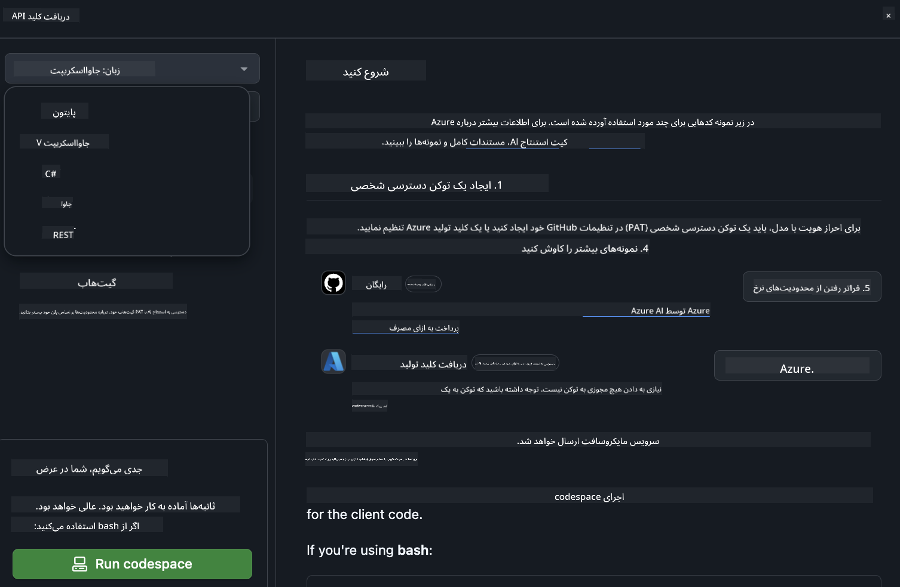
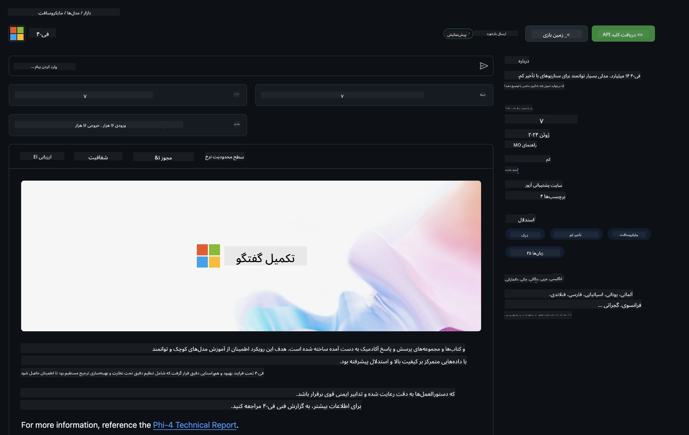

<!--
CO_OP_TRANSLATOR_METADATA:
{
  "original_hash": "5113634b77370af6790f9697d5d7de90",
  "translation_date": "2025-07-17T05:31:24+00:00",
  "source_file": "md/02.QuickStart/GitHubModel_QuickStart.md",
  "language_code": "fa"
}
-->
## مدل‌های GitHub - نسخه بتای محدود عمومی

به [مدل‌های GitHub](https://github.com/marketplace/models) خوش آمدید! همه چیز آماده است تا شما مدل‌های هوش مصنوعی میزبانی شده روی Azure AI را کشف کنید.


برای اطلاعات بیشتر درباره مدل‌های موجود در مدل‌های GitHub، به [بازار مدل‌های GitHub](https://github.com/marketplace/models) مراجعه کنید.

## مدل‌های موجود

هر مدل دارای یک محیط آزمایشی اختصاصی و کد نمونه است


### مدل‌های Phi-3 در کاتالوگ مدل‌های GitHub

[Phi-3-Medium-128k-Instruct](https://github.com/marketplace/models/azureml/Phi-3-medium-128k-instruct)

[Phi-3-medium-4k-instruct](https://github.com/marketplace/models/azureml/Phi-3-medium-4k-instruct)

[Phi-3-mini-128k-instruct](https://github.com/marketplace/models/azureml/Phi-3-mini-128k-instruct)

[Phi-3-mini-4k-instruct](https://github.com/marketplace/models/azureml/Phi-3-mini-4k-instruct)

[Phi-3-small-128k-instruct](https://github.com/marketplace/models/azureml/Phi-3-small-128k-instruct)

[Phi-3-small-8k-instruct](https://github.com/marketplace/models/azureml/Phi-3-small-8k-instruct)

## شروع به کار

چند نمونه پایه آماده اجرا برای شما وجود دارد. می‌توانید آن‌ها را در پوشه samples پیدا کنید. اگر می‌خواهید مستقیماً به زبان مورد علاقه‌تان بروید، نمونه‌ها در زبان‌های زیر موجود هستند:

- Python
- JavaScript
- cURL

همچنین یک محیط Codespaces اختصاصی برای اجرای نمونه‌ها و مدل‌ها وجود دارد.



## کد نمونه

در ادامه چند قطعه کد نمونه برای چند مورد استفاده آورده شده است. برای اطلاعات بیشتر درباره Azure AI Inference SDK، به مستندات کامل و نمونه‌ها مراجعه کنید.

## راه‌اندازی

1. ایجاد یک توکن دسترسی شخصی  
نیازی به دادن هیچ مجوزی به توکن نیست. توجه داشته باشید که توکن به یک سرویس مایکروسافت ارسال خواهد شد.

برای استفاده از قطعات کد زیر، یک متغیر محیطی ایجاد کنید و توکن خود را به عنوان کلید برای کد کلاینت تنظیم کنید.

اگر از bash استفاده می‌کنید:  
```
export GITHUB_TOKEN="<your-github-token-goes-here>"
```  
اگر در powershell هستید:  

```
$Env:GITHUB_TOKEN="<your-github-token-goes-here>"
```  

اگر از خط فرمان ویندوز استفاده می‌کنید:  

```
set GITHUB_TOKEN=<your-github-token-goes-here>
```  

## نمونه Python

### نصب وابستگی‌ها  
Azure AI Inference SDK را با pip نصب کنید (نیازمند: Python >=3.8):

```
pip install azure-ai-inference
```  
### اجرای یک نمونه کد پایه

این نمونه یک فراخوانی ساده به API تکمیل چت را نشان می‌دهد. این فراخوانی از نقطه انتهایی استنتاج مدل هوش مصنوعی GitHub و توکن GitHub شما استفاده می‌کند. فراخوانی به صورت همزمان است.

```
import os
from azure.ai.inference import ChatCompletionsClient
from azure.ai.inference.models import SystemMessage, UserMessage
from azure.core.credentials import AzureKeyCredential

endpoint = "https://models.inference.ai.azure.com"
# Replace Model_Name 
model_name = "Phi-3-small-8k-instruct"
token = os.environ["GITHUB_TOKEN"]

client = ChatCompletionsClient(
    endpoint=endpoint,
    credential=AzureKeyCredential(token),
)

response = client.complete(
    messages=[
        SystemMessage(content="You are a helpful assistant."),
        UserMessage(content="What is the capital of France?"),
    ],
    model=model_name,
    temperature=1.,
    max_tokens=1000,
    top_p=1.
)

print(response.choices[0].message.content)
```

### اجرای یک مکالمه چند مرحله‌ای

این نمونه یک مکالمه چند مرحله‌ای با API تکمیل چت را نشان می‌دهد. هنگام استفاده از مدل برای یک برنامه چت، باید تاریخچه آن مکالمه را مدیریت کرده و آخرین پیام‌ها را به مدل ارسال کنید.

```
import os
from azure.ai.inference import ChatCompletionsClient
from azure.ai.inference.models import AssistantMessage, SystemMessage, UserMessage
from azure.core.credentials import AzureKeyCredential

token = os.environ["GITHUB_TOKEN"]
endpoint = "https://models.inference.ai.azure.com"
# Replace Model_Name
model_name = "Phi-3-small-8k-instruct"

client = ChatCompletionsClient(
    endpoint=endpoint,
    credential=AzureKeyCredential(token),
)

messages = [
    SystemMessage(content="You are a helpful assistant."),
    UserMessage(content="What is the capital of France?"),
    AssistantMessage(content="The capital of France is Paris."),
    UserMessage(content="What about Spain?"),
]

response = client.complete(messages=messages, model=model_name)

print(response.choices[0].message.content)
```

### پخش خروجی به صورت جریان

برای تجربه کاربری بهتر، می‌خواهید پاسخ مدل را به صورت جریان دریافت کنید تا اولین توکن زودتر نمایش داده شود و مجبور نباشید برای پاسخ‌های طولانی منتظر بمانید.

```
import os
from azure.ai.inference import ChatCompletionsClient
from azure.ai.inference.models import SystemMessage, UserMessage
from azure.core.credentials import AzureKeyCredential

token = os.environ["GITHUB_TOKEN"]
endpoint = "https://models.inference.ai.azure.com"
# Replace Model_Name
model_name = "Phi-3-small-8k-instruct"

client = ChatCompletionsClient(
    endpoint=endpoint,
    credential=AzureKeyCredential(token),
)

response = client.complete(
    stream=True,
    messages=[
        SystemMessage(content="You are a helpful assistant."),
        UserMessage(content="Give me 5 good reasons why I should exercise every day."),
    ],
    model=model_name,
)

for update in response:
    if update.choices:
        print(update.choices[0].delta.content or "", end="")

client.close()
```  
## JavaScript

### نصب وابستگی‌ها

Node.js را نصب کنید.

خطوط زیر را کپی کرده و به عنوان فایل package.json در پوشه خود ذخیره کنید.

```
{
  "type": "module",
  "dependencies": {
    "@azure-rest/ai-inference": "latest",
    "@azure/core-auth": "latest",
    "@azure/core-sse": "latest"
  }
}
```

توجه: @azure/core-sse فقط زمانی لازم است که پاسخ‌های تکمیل چت را به صورت جریان دریافت کنید.

یک پنجره ترمینال در این پوشه باز کنید و npm install را اجرا کنید.

برای هر یک از قطعات کد زیر، محتوا را در فایلی به نام sample.js کپی کرده و با node sample.js اجرا کنید.

### اجرای یک نمونه کد پایه

این نمونه یک فراخوانی ساده به API تکمیل چت را نشان می‌دهد. این فراخوانی از نقطه انتهایی استنتاج مدل هوش مصنوعی GitHub و توکن GitHub شما استفاده می‌کند. فراخوانی به صورت همزمان است.

```
import ModelClient from "@azure-rest/ai-inference";
import { AzureKeyCredential } from "@azure/core-auth";

const token = process.env["GITHUB_TOKEN"];
const endpoint = "https://models.inference.ai.azure.com";
// Update your modelname
const modelName = "Phi-3-small-8k-instruct";

export async function main() {

  const client = new ModelClient(endpoint, new AzureKeyCredential(token));

  const response = await client.path("/chat/completions").post({
    body: {
      messages: [
        { role:"system", content: "You are a helpful assistant." },
        { role:"user", content: "What is the capital of France?" }
      ],
      model: modelName,
      temperature: 1.,
      max_tokens: 1000,
      top_p: 1.
    }
  });

  if (response.status !== "200") {
    throw response.body.error;
  }
  console.log(response.body.choices[0].message.content);
}

main().catch((err) => {
  console.error("The sample encountered an error:", err);
});
```

### اجرای یک مکالمه چند مرحله‌ای

این نمونه یک مکالمه چند مرحله‌ای با API تکمیل چت را نشان می‌دهد. هنگام استفاده از مدل برای یک برنامه چت، باید تاریخچه آن مکالمه را مدیریت کرده و آخرین پیام‌ها را به مدل ارسال کنید.

```
import ModelClient from "@azure-rest/ai-inference";
import { AzureKeyCredential } from "@azure/core-auth";

const token = process.env["GITHUB_TOKEN"];
const endpoint = "https://models.inference.ai.azure.com";
// Update your modelname
const modelName = "Phi-3-small-8k-instruct";

export async function main() {

  const client = new ModelClient(endpoint, new AzureKeyCredential(token));

  const response = await client.path("/chat/completions").post({
    body: {
      messages: [
        { role: "system", content: "You are a helpful assistant." },
        { role: "user", content: "What is the capital of France?" },
        { role: "assistant", content: "The capital of France is Paris." },
        { role: "user", content: "What about Spain?" },
      ],
      model: modelName,
    }
  });

  if (response.status !== "200") {
    throw response.body.error;
  }

  for (const choice of response.body.choices) {
    console.log(choice.message.content);
  }
}

main().catch((err) => {
  console.error("The sample encountered an error:", err);
});
```

### پخش خروجی به صورت جریان  
برای تجربه کاربری بهتر، می‌خواهید پاسخ مدل را به صورت جریان دریافت کنید تا اولین توکن زودتر نمایش داده شود و مجبور نباشید برای پاسخ‌های طولانی منتظر بمانید.

```
import ModelClient from "@azure-rest/ai-inference";
import { AzureKeyCredential } from "@azure/core-auth";
import { createSseStream } from "@azure/core-sse";

const token = process.env["GITHUB_TOKEN"];
const endpoint = "https://models.inference.ai.azure.com";
// Update your modelname
const modelName = "Phi-3-small-8k-instruct";

export async function main() {

  const client = new ModelClient(endpoint, new AzureKeyCredential(token));

  const response = await client.path("/chat/completions").post({
    body: {
      messages: [
        { role: "system", content: "You are a helpful assistant." },
        { role: "user", content: "Give me 5 good reasons why I should exercise every day." },
      ],
      model: modelName,
      stream: true
    }
  }).asNodeStream();

  const stream = response.body;
  if (!stream) {
    throw new Error("The response stream is undefined");
  }

  if (response.status !== "200") {
    stream.destroy();
    throw new Error(`Failed to get chat completions, http operation failed with ${response.status} code`);
  }

  const sseStream = createSseStream(stream);

  for await (const event of sseStream) {
    if (event.data === "[DONE]") {
      return;
    }
    for (const choice of (JSON.parse(event.data)).choices) {
        process.stdout.write(choice.delta?.content ?? ``);
    }
  }
}

main().catch((err) => {
  console.error("The sample encountered an error:", err);
});
```

## REST

### اجرای یک نمونه کد پایه

متن زیر را در یک شل وارد کنید:

```
curl -X POST "https://models.inference.ai.azure.com/chat/completions" \
    -H "Content-Type: application/json" \
    -H "Authorization: Bearer $GITHUB_TOKEN" \
    -d '{
        "messages": [
            {
                "role": "system",
                "content": "You are a helpful assistant."
            },
            {
                "role": "user",
                "content": "What is the capital of France?"
            }
        ],
        "model": "Phi-3-small-8k-instruct"
    }'
```  
### اجرای یک مکالمه چند مرحله‌ای

API تکمیل چت را فراخوانی کرده و تاریخچه چت را ارسال کنید:

```
curl -X POST "https://models.inference.ai.azure.com/chat/completions" \
    -H "Content-Type: application/json" \
    -H "Authorization: Bearer $GITHUB_TOKEN" \
    -d '{
        "messages": [
            {
                "role": "system",
                "content": "You are a helpful assistant."
            },
            {
                "role": "user",
                "content": "What is the capital of France?"
            },
            {
                "role": "assistant",
                "content": "The capital of France is Paris."
            },
            {
                "role": "user",
                "content": "What about Spain?"
            }
        ],
        "model": "Phi-3-small-8k-instruct"
    }'
```  
### پخش خروجی به صورت جریان

این نمونه‌ای از فراخوانی نقطه انتهایی و پخش پاسخ به صورت جریان است.

```
curl -X POST "https://models.inference.ai.azure.com/chat/completions" \
    -H "Content-Type: application/json" \
    -H "Authorization: Bearer $GITHUB_TOKEN" \
    -d '{
        "messages": [
            {
                "role": "system",
                "content": "You are a helpful assistant."
            },
            {
                "role": "user",
                "content": "Give me 5 good reasons why I should exercise every day."
            }
        ],
        "stream": true,
        "model": "Phi-3-small-8k-instruct"
    }'
```

## استفاده رایگان و محدودیت‌های نرخ برای مدل‌های GitHub



[محدودیت‌های نرخ برای محیط آزمایشی و استفاده رایگان از API](https://docs.github.com/en/github-models/prototyping-with-ai-models#rate-limits) به شما کمک می‌کند تا با مدل‌ها آزمایش کنید و برنامه هوش مصنوعی خود را نمونه‌سازی کنید. برای استفاده فراتر از این محدودیت‌ها و مقیاس‌بندی برنامه خود، باید منابع را از یک حساب Azure تهیه کرده و به جای توکن دسترسی شخصی GitHub خود، از آنجا احراز هویت کنید. نیازی به تغییر چیز دیگری در کد خود ندارید. از این لینک برای آشنایی با نحوه عبور از محدودیت‌های رایگان در Azure AI استفاده کنید.

### افشاسازی‌ها

به یاد داشته باشید هنگام تعامل با یک مدل، در حال آزمایش هوش مصنوعی هستید، بنابراین امکان اشتباه در محتوا وجود دارد.

این ویژگی محدودیت‌های مختلفی دارد (از جمله درخواست‌ها در دقیقه، درخواست‌ها در روز، توکن‌ها در هر درخواست و درخواست‌های همزمان) و برای موارد استفاده تولیدی طراحی نشده است.

مدل‌های GitHub از Azure AI Content Safety استفاده می‌کنند. این فیلترها به عنوان بخشی از تجربه مدل‌های GitHub قابل غیرفعال شدن نیستند. اگر تصمیم به استفاده از مدل‌ها از طریق سرویس‌های پولی گرفتید، لطفاً فیلترهای محتوای خود را مطابق نیازهای خود تنظیم کنید.

این سرویس تحت شرایط پیش‌انتشار GitHub قرار دارد.

**سلب مسئولیت**:  
این سند با استفاده از سرویس ترجمه هوش مصنوعی [Co-op Translator](https://github.com/Azure/co-op-translator) ترجمه شده است. در حالی که ما در تلاش برای دقت هستیم، لطفاً توجه داشته باشید که ترجمه‌های خودکار ممکن است حاوی خطاها یا نواقصی باشند. سند اصلی به زبان بومی خود باید به عنوان منبع معتبر در نظر گرفته شود. برای اطلاعات حیاتی، ترجمه حرفه‌ای انسانی توصیه می‌شود. ما مسئول هیچ گونه سوءتفاهم یا تفسیر نادرستی که از استفاده این ترجمه ناشی شود، نیستیم.