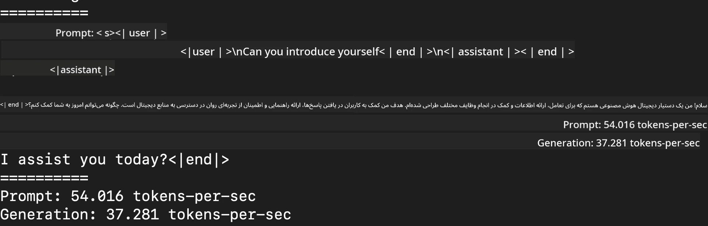
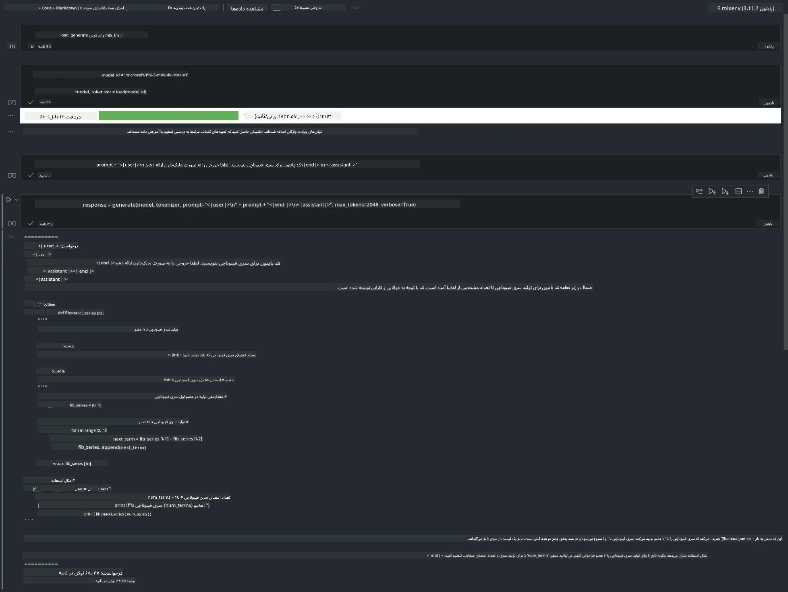

# **استنتاج Phi-3 با فریمورک Apple MLX**

## **فریمورک MLX چیست**

MLX یک فریمورک آرایه‌ای برای پژوهش‌های یادگیری ماشین روی تراشه‌های Apple Silicon است که توسط تیم پژوهش یادگیری ماشین اپل ارائه شده است.

MLX توسط پژوهشگران یادگیری ماشین برای پژوهشگران یادگیری ماشین طراحی شده است. این فریمورک به گونه‌ای ساخته شده که کاربرپسند باشد، اما در عین حال برای آموزش و استقرار مدل‌ها کارآمد باشد. طراحی خود فریمورک نیز از نظر مفهومی ساده است. هدف ما این است که به پژوهشگران امکان دهیم به راحتی MLX را توسعه داده و بهبود بخشند تا بتوانند ایده‌های جدید را سریع‌تر بررسی کنند.

مدل‌های زبان بزرگ (LLM) می‌توانند در دستگاه‌های Apple Silicon با استفاده از MLX تسریع شوند و مدل‌ها به راحتی به صورت محلی اجرا شوند.

## **استفاده از MLX برای استنتاج Phi-3-mini**

### **1. راه‌اندازی محیط MLX**

1. پایتون 3.11.x  
2. نصب کتابخانه MLX

```bash

pip install mlx-lm

```

### **2. اجرای Phi-3-mini در ترمینال با MLX**

```bash

python -m mlx_lm.generate --model microsoft/Phi-3-mini-4k-instruct --max-token 2048 --prompt  "<|user|>\nCan you introduce yourself<|end|>\n<|assistant|>"

```

نتیجه (محیط من Apple M1 Max با 64 گیگابایت رم است) به شکل زیر است:


### **3. کم‌دقت‌سازی Phi-3-mini با MLX در ترمینال**

```bash

python -m mlx_lm.convert --hf-path microsoft/Phi-3-mini-4k-instruct

```

***توجه:*** مدل می‌تواند از طریق mlx_lm.convert کم‌دقت‌سازی شود و کم‌دقت‌سازی پیش‌فرض INT4 است. این مثال Phi-3-mini را به INT4 کم‌دقت‌سازی می‌کند.

مدل می‌تواند از طریق mlx_lm.convert کم‌دقت‌سازی شود و کم‌دقت‌سازی پیش‌فرض INT4 است. در این مثال، Phi-3-mini به INT4 کم‌دقت‌سازی می‌شود. پس از کم‌دقت‌سازی، مدل در مسیر پیش‌فرض ./mlx_model ذخیره خواهد شد.

می‌توانیم مدل کم‌دقت‌شده با MLX را از طریق ترمینال تست کنیم.

```bash

python -m mlx_lm.generate --model ./mlx_model/ --max-token 2048 --prompt  "<|user|>\nCan you introduce yourself<|end|>\n<|assistant|>"

```

نتیجه به شکل زیر است:



### **4. اجرای Phi-3-mini با MLX در Jupyter Notebook**



***توجه:*** لطفاً این نمونه را مطالعه کنید [برای مشاهده اینجا کلیک کنید](../../../../../code/03.Inference/MLX/MLX_DEMO.ipynb)

## **منابع**

1. آشنایی با فریمورک Apple MLX [https://ml-explore.github.io](https://ml-explore.github.io/mlx/build/html/index.html)

2. مخزن GitHub اپل MLX [https://github.com/ml-explore](https://github.com/ml-explore)

**سلب مسئولیت**:  
این سند با استفاده از سرویس ترجمه هوش مصنوعی [Co-op Translator](https://github.com/Azure/co-op-translator) ترجمه شده است. در حالی که ما در تلاش برای دقت هستیم، لطفاً توجه داشته باشید که ترجمه‌های خودکار ممکن است حاوی خطاها یا نواقصی باشند. سند اصلی به زبان بومی خود باید به عنوان منبع معتبر در نظر گرفته شود. برای اطلاعات حیاتی، ترجمه حرفه‌ای انسانی توصیه می‌شود. ما مسئول هیچ گونه سوءتفاهم یا تفسیر نادرستی که از استفاده این ترجمه ناشی شود، نیستیم.