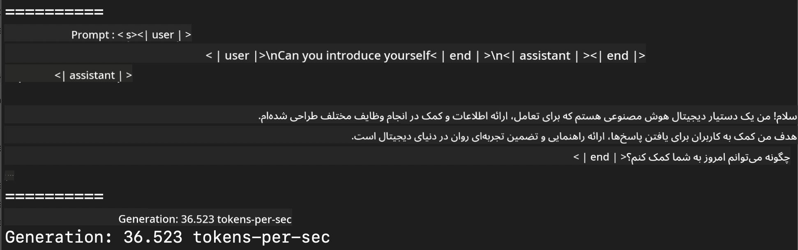
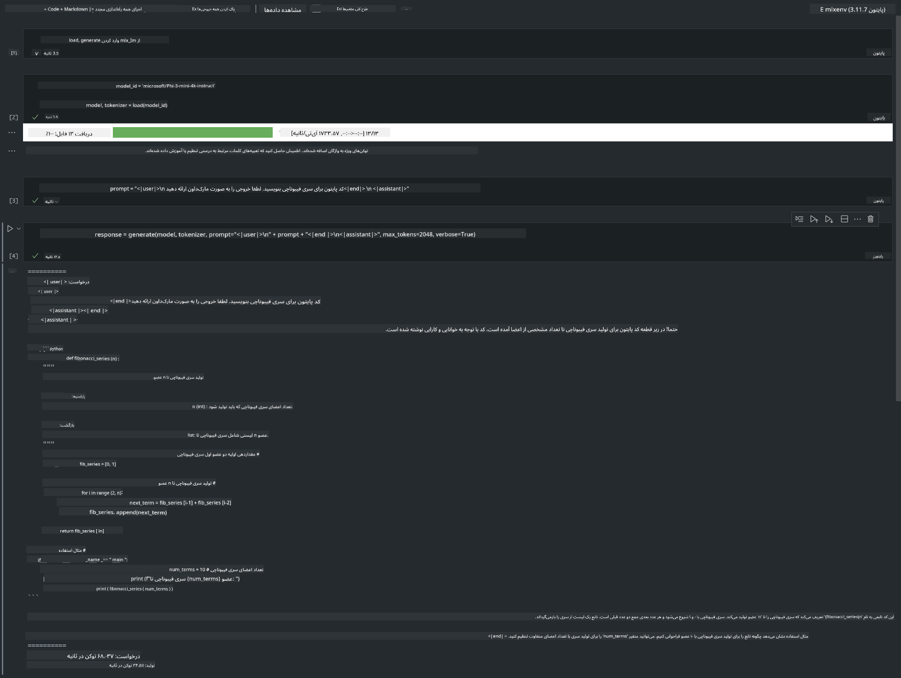

<!--
CO_OP_TRANSLATOR_METADATA:
{
  "original_hash": "dcb656f3d206fc4968e236deec5d4384",
  "translation_date": "2025-05-07T13:41:08+00:00",
  "source_file": "md/03.FineTuning/03.Inference/MLX_Inference.md",
  "language_code": "fa"
}
-->
# **استنتاج Phi-3 با چارچوب Apple MLX**

## **چارچوب MLX چیست**

MLX یک چارچوب آرایه‌ای برای تحقیقات یادگیری ماشین روی سیلیکون اپل است که توسط تیم تحقیقاتی یادگیری ماشین اپل ارائه شده است.

MLX توسط پژوهشگران یادگیری ماشین برای پژوهشگران یادگیری ماشین طراحی شده است. هدف این چارچوب، ساده بودن برای کاربران در عین حال کارآمد بودن برای آموزش و اجرای مدل‌ها است. طراحی خود چارچوب نیز به لحاظ مفهومی ساده است. ما قصد داریم به پژوهشگران کمک کنیم تا به راحتی MLX را توسعه داده و بهبود دهند تا بتوانند ایده‌های جدید را سریع‌تر آزمایش کنند.

مدل‌های بزرگ زبانی (LLM) می‌توانند با استفاده از MLX روی دستگاه‌های سیلیکون اپل تسریع شوند و مدل‌ها به صورت محلی به‌راحتی اجرا شوند.

## **استفاده از MLX برای استنتاج Phi-3-mini**

### **۱. راه‌اندازی محیط MLX**

1. Python 3.11.x  
2. نصب کتابخانه MLX

```bash

pip install mlx-lm

```

### **۲. اجرای Phi-3-mini در ترمینال با MLX**

```bash

python -m mlx_lm.generate --model microsoft/Phi-3-mini-4k-instruct --max-token 2048 --prompt  "<|user|>\nCan you introduce yourself<|end|>\n<|assistant|>"

```

نتیجه (محیط من Apple M1 Max با ۶۴ گیگابایت رم است)



### **۳. کم‌دقت‌سازی (Quantizing) Phi-3-mini با MLX در ترمینال**

```bash

python -m mlx_lm.convert --hf-path microsoft/Phi-3-mini-4k-instruct

```

***توجه:*** مدل را می‌توان از طریق mlx_lm.convert کم‌دقت کرد و کم‌دقت‌سازی پیش‌فرض INT4 است. در این مثال، Phi-3-mini به INT4 کم‌دقت شده است.

مدل را می‌توان با mlx_lm.convert کم‌دقت کرد و کم‌دقت‌سازی پیش‌فرض INT4 است. این مثال برای کم‌دقت کردن Phi-3-mini به INT4 است. پس از کم‌دقت‌سازی، مدل در پوشه پیش‌فرض ./mlx_model ذخیره می‌شود.

می‌توانیم مدل کم‌دقت شده با MLX را از طریق ترمینال آزمایش کنیم

```bash

python -m mlx_lm.generate --model ./mlx_model/ --max-token 2048 --prompt  "<|user|>\nCan you introduce yourself<|end|>\n<|assistant|>"

```

نتیجه به شکل زیر است


### **۴. اجرای Phi-3-mini با MLX در Jupyter Notebook**



***توجه:*** لطفاً این نمونه را مطالعه کنید [click this link](../../../../../code/03.Inference/MLX/MLX_DEMO.ipynb)

## **منابع**

1. آشنایی با چارچوب Apple MLX [https://ml-explore.github.io](https://ml-explore.github.io/mlx/build/html/index.html)

2. مخزن GitHub اپل MLX [https://github.com/ml-explore](https://github.com/ml-explore)

**سلب مسئولیت**:  
این سند با استفاده از سرویس ترجمه هوش مصنوعی [Co-op Translator](https://github.com/Azure/co-op-translator) ترجمه شده است. در حالی که ما در تلاش برای دقت هستیم، لطفاً توجه داشته باشید که ترجمه‌های خودکار ممکن است حاوی اشتباهات یا نادرستی‌هایی باشند. سند اصلی به زبان بومی آن باید به عنوان منبع معتبر در نظر گرفته شود. برای اطلاعات حیاتی، توصیه می‌شود از ترجمه حرفه‌ای انسانی استفاده شود. ما مسئول هیچ گونه سوءتفاهم یا تفسیر نادرستی که ناشی از استفاده از این ترجمه باشد، نیستیم.