# فاین‌تیونینگ Phi-3 با Microsoft Foundry

بیایید بررسی کنیم چگونه می‌توان مدل زبان Phi-3 Mini مایکروسافت را با استفاده از Microsoft Foundry فاین‌تیون کرد. فاین‌تیونینگ به شما امکان می‌دهد Phi-3 Mini را برای وظایف خاص تطبیق دهید و آن را قدرتمندتر و آگاه به متن نماید.

## ملاحظات

- **قابلیت‌ها:** کدام مدل‌ها قابل فاین‌تیون هستند؟ مدل پایه می‌تواند برای چه کاری فاین‌تیون شود؟
- **هزینه:** مدل قیمت‌گذاری فاین‌تیونینگ چگونه است؟
- **قابلیت سفارشی‌سازی:** تا چه حد می‌توانم مدل پایه را تغییر دهم – و به چه روش‌هایی؟
- **راحتی:** فاین‌تیونینگ چگونه انجام می‌شود – آیا نیاز به نوشتن کد اختصاصی دارم؟ آیا باید سخت‌افزار محاسباتی خود را بیاورم؟
- **ایمنی:** مدل‌های فاین‌تیون شده ممکن است ریسک‌های ایمنی داشته باشند – آیا محدودیت‌ها یا محافظ‌هایی برای جلوگیری از آسیب ناخواسته وجود دارد؟

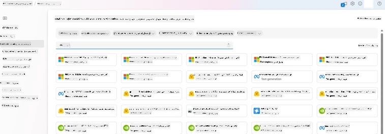

## آمادگی برای فاین‌تیونینگ

### پیش‌نیازها

> [!NOTE]
> برای مدل‌های خانواده Phi-3، گزینه فاین‌تیون به صورت پرداخت به میزان استفاده فقط با هاب‌هایی که در مناطق **East US 2** ایجاد شده‌اند، در دسترس است.

- یک اشتراک Azure. اگر اشتراک Azure ندارید، یک [حساب Azure پولی](https://azure.microsoft.com/pricing/purchase-options/pay-as-you-go) ایجاد کنید.

- یک [پروژه AI Foundry](https://ai.azure.com?WT.mc_id=aiml-138114-kinfeylo).
- برای دسترسی به عملیات در Microsoft Foundry، از کنترل‌های دسترسی مبتنی بر نقش Azure (Azure RBAC) استفاده می‌شود. برای اجرای مراحل این مقاله، حساب کاربری شما باید نقش __Azure AI Developer__ را روی گروه منابع داشته باشد.

### ثبت ارائه‌دهنده اشتراک

تأیید کنید اشتراک به ارائه‌دهنده منابع `Microsoft.Network` ثبت شده است.

1. وارد [پورتال Azure](https://portal.azure.com) شوید.
1. از منوی سمت چپ، **Subscriptions** را انتخاب کنید.
1. اشتراکی که می‌خواهید استفاده کنید را انتخاب کنید.
1. از منوی سمت چپ، **AI project settings** > **Resource providers** را انتخاب کنید.
1. تأیید کنید که **Microsoft.Network** در فهرست ارائه‌دهندگان منابع باشد. اگر نبود، آن را اضافه کنید.

### آماده‌سازی داده

داده‌های آموزش و اعتبارسنجی خود را برای فاین‌تیون کردن مدل آماده کنید. داده‌های آموزش و اعتبارسنجی شما شامل نمونه‌های ورودی و خروجی از نحوه عملکرد مطلوب مدل است.

مطمئن شوید همه نمونه‌های آموزش شما از قالب مورد انتظار برای استنتاج پیروی می‌کنند. برای فاین‌تیون موثر مدل‌ها، یک مجموعه داده متوازن و متنوع لازم است.

این شامل حفظ تعادل داده، درج سناریوهای مختلف و بازبینی دوره‌ای داده‌های آموزش برای تطابق با انتظارات دنیای واقعی است که در نهایت منجر به پاسخ‌های دقیق‌تر و متوازن‌تر مدل می‌شود.

انواع مختلف مدل، فرمت‌های متفاوتی از داده‌های آموزشی نیاز دارند.

### تکمیل گفت‌وگو

داده‌های آموزش و اعتبارسنجی که استفاده می‌کنید **باید** به صورت یک سند JSON Lines (JSONL) قالب‌بندی شده باشند. برای `Phi-3-mini-128k-instruct` مجموعه داده فاین‌تیونینگ باید در قالب محاوره‌ای باشد که توسط API تکمیل گفت‌وگو استفاده می‌شود.

### فرمت نمونه فایل

```json
    {"messages": [{"role": "system", "content": "You are an Xbox customer support agent whose primary goal is to help users with issues they are experiencing with their Xbox devices. You are friendly and concise. You only provide factual answers to queries, and do not provide answers that are not related to Xbox."}, {"role": "user", "content": "Is Xbox better than PlayStation?"}, {"role": "assistant", "content": "I apologize, but I cannot provide personal opinions. My primary job is to assist you with any issues related to your Xbox device. Do you have any Xbox-related issues that need addressing?"}]}
    {"messages": [{"role": "system", "content": "You are an Xbox customer support agent whose primary goal is to help users with issues they are experiencing with their Xbox devices. You are friendly and concise. You only provide factual answers to queries, and do not provide answers that are not related to Xbox."}, {"role": "user", "content": "Can I play PC games on my Xbox?"}, {"role": "assistant", "content": "While Xbox consoles don't natively support PC games, they can play an array of Xbox games, many of which are also available on PC. Can I assist you with finding games compatible with your Xbox device?"}]}
    {"messages": [{"role": "system", "content": "You are an Xbox customer support agent whose primary goal is to help users with issues they are experiencing with their Xbox devices. You are friendly and concise. You only provide factual answers to queries, and do not provide answers that are not related to Xbox."}, {"role": "user", "content": "I'm having trouble connecting my Xbox to the Wi-Fi."}, {"role": "assistant", "content": "No worries, let's go through the network settings on your Xbox. Can you please tell me what happens when you try to connect it to the Wi-Fi?"}]}
```
  
نوع فایل پشتیبانی شده JSON Lines است. فایل‌ها به دیتاستور پیش‌فرض آپلود شده و در پروژه شما قابل دسترسی می‌شوند.

## فاین‌تیونینگ Phi-3 با Microsoft Foundry

Microsoft Foundry امکان شخصی‌سازی مدل‌های زبان بزرگ را با استفاده از فرآیندی به نام فاین‌تیونینگ فراهم می‌کند. فاین‌تیونینگ ارزش زیادی از طریق سفارشی‌سازی و بهینه‌سازی برای وظایف و کاربردهای خاص ارائه می‌دهد. این کار منجر به بهبود عملکرد، صرفه‌جویی در هزینه، کاهش تأخیر و خروجی‌های سفارشی می‌شود.

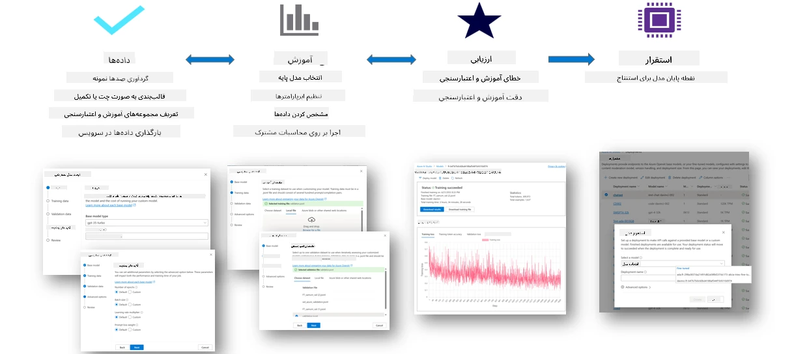

### ایجاد پروژه جدید

1. وارد [Microsoft Foundry](https://ai.azure.com) شوید.

1. برای ایجاد پروژه جدید، گزینه **+New project** را انتخاب کنید.

    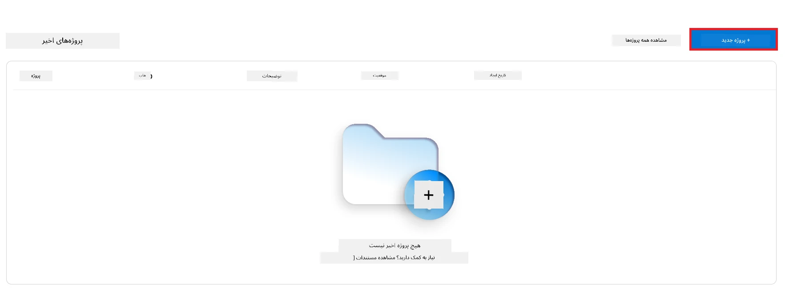

1. اقدامات زیر را انجام دهید:

    - نام **Hub پروژه** را وارد کنید. باید یک مقدار یکتا باشد.
    - **Hub** مورد استفاده را انتخاب کنید (در صورت نیاز یک هاب جدید ایجاد کنید).

    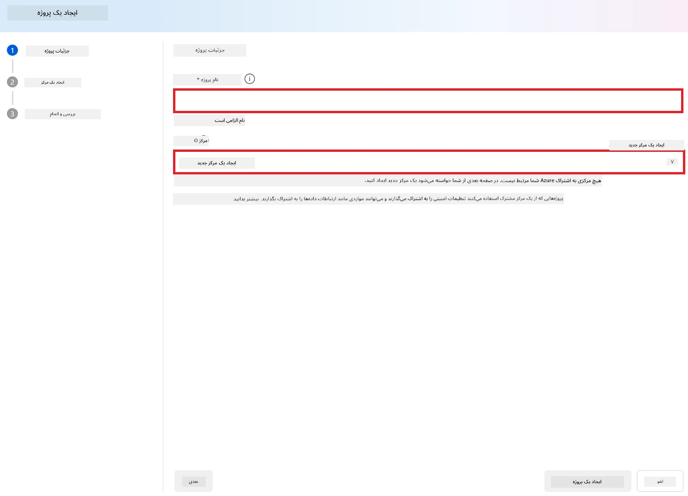

1. اقدامات زیر را برای ایجاد هاب جدید انجام دهید:

    - نام **Hub** را وارد کنید. باید یکتا باشد.
    - اشتراک Azure خود را انتخاب کنید.
    - گروه منابع (Resource group) را انتخاب کنید (در صورت نیاز ایجاد کنید).
    - مکان (Location) موردنظر خود را انتخاب کنید.
    - سرویس‌های Azure AI قابل اتصال (Connect Azure AI Services) را انتخاب کنید (در صورت نیاز ایجاد کنید).
    - اتصال Azure AI Search را **Skip connecting** انتخاب کنید.

    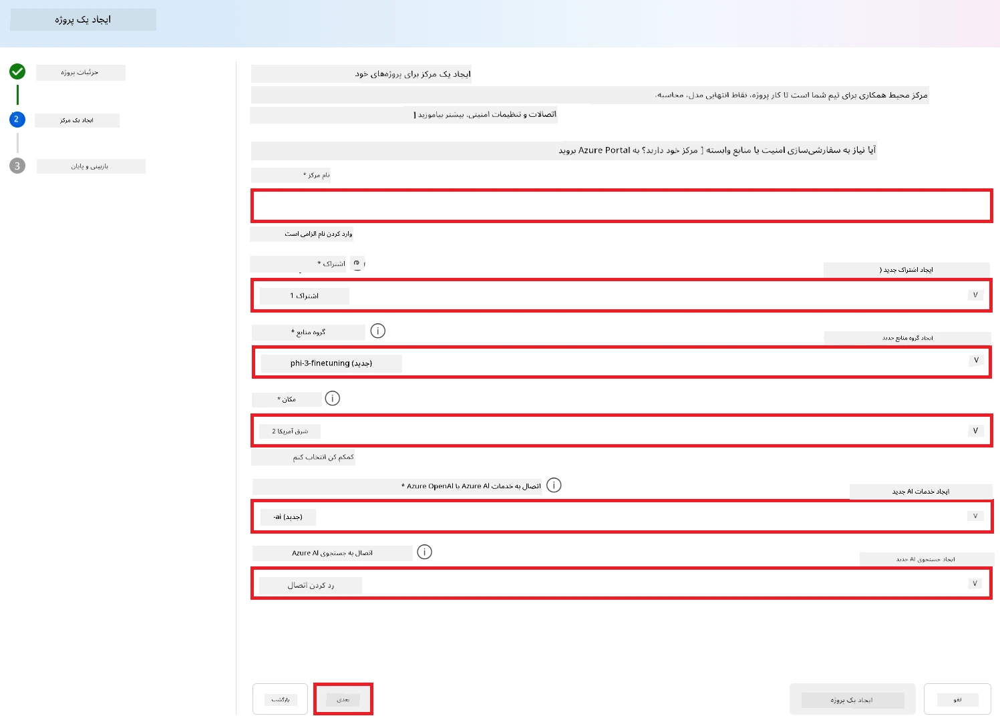

1. ***بعدی*** را انتخاب کنید.
1. گزینه ***ایجاد پروژه*** را انتخاب کنید.

### آماده‌سازی داده

قبل از فاین‌تیونینگ، یک مجموعه داده مرتبط با وظیفه خود جمع‌آوری یا ایجاد کنید؛ مثل دستورالعمل‌های چت، جفت‌های سوال و جواب یا هر داده متنی مرتبط دیگر. این داده‌ها را پاک‌سازی و پیش‌پردازش کنید، شامل حذف نویز، رسیدگی به مقادیر گمشده و توکن‌سازی متن.

### فاین‌تیونینگ مدل‌های Phi-3 در Microsoft Foundry

> [!NOTE]
> فاین‌تیونینگ مدل‌های Phi-3 در حال حاضر فقط در پروژه‌های واقع در East US 2 پشتیبانی می‌شود.

1. از تب سمت چپ، **Model catalog** را انتخاب کنید.

1. عبارت *phi-3* را در **نوار جستجو** وارد کرده و مدل phi-3 مورد نظر خود را انتخاب کنید.

    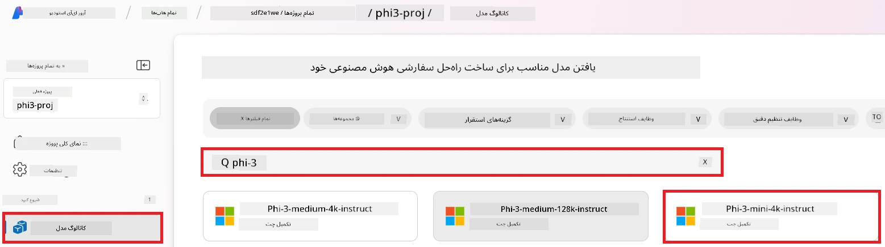

1. گزینه **Fine-tune** را انتخاب کنید.

    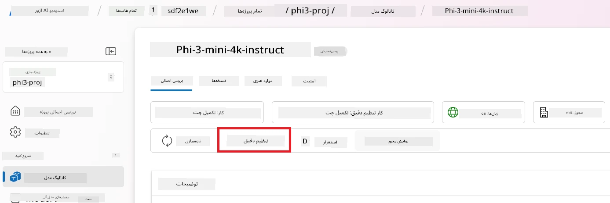

1. نام **مدل فاین‌تیون شده** را وارد کنید.

    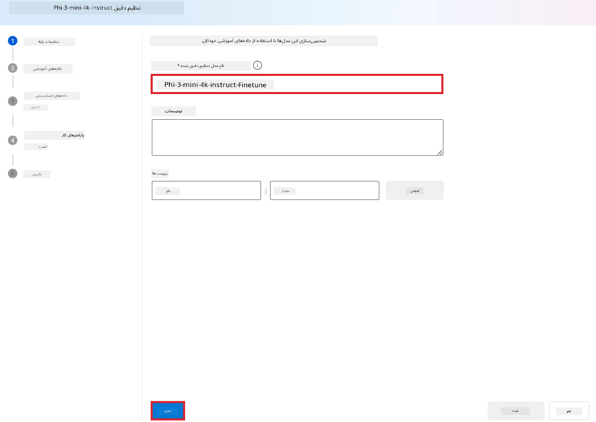

1. ***بعدی*** را انتخاب کنید.

1. اقدامات زیر را انجام دهید:

    - نوع **وظیفه** را روی **Chat completion** تنظیم کنید.
    - داده‌های **آموزش** موردنظر را انتخاب کنید. می‌توانید از طریق داده‌های Microsoft Foundry یا محیط محلی خود آپلود کنید.

    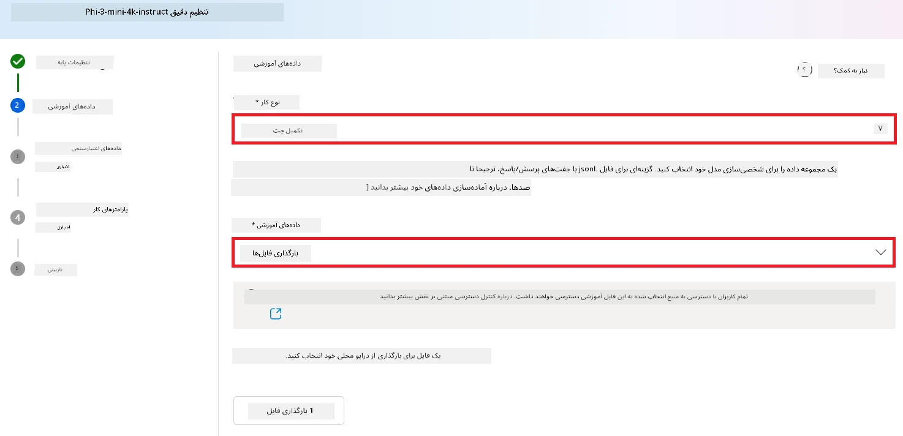

1. ***بعدی*** را انتخاب کنید.

1. داده‌های **اعتبارسنجی** موردنظر را آپلود کنید یا گزینه **Automatic split of training data** را انتخاب کنید.

    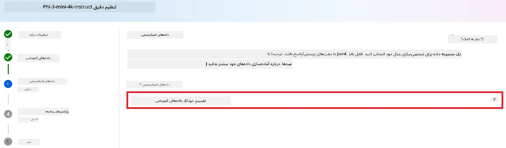

1. ***بعدی*** را انتخاب کنید.

1. اقدامات زیر را انجام دهید:

    - ضریب **Batch size multiplier** را انتخاب کنید.
    - نرخ یادگیری (Learning rate) را انتخاب کنید.
    - تعداد دوره‌ها (Epochs) را انتخاب کنید.

    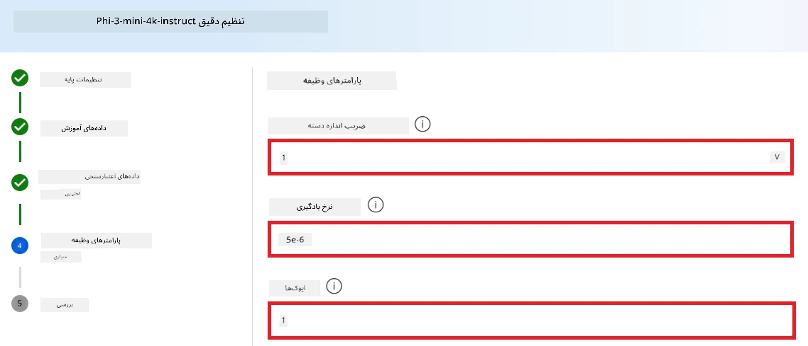

1. برای شروع فرایند فاین‌تیونینگ، گزینه **Submit** را انتخاب کنید.

    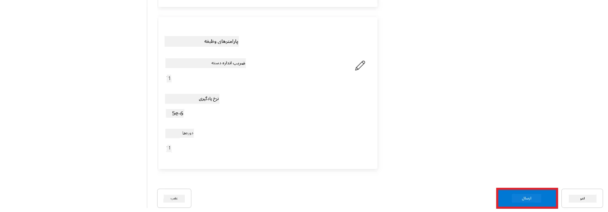


1. پس از فاین‌تیونینگ مدل، وضعیت آن به صورت **Completed** نمایش داده می‌شود، همانطور که در تصویر زیر نشان داده شده است. اکنون می‌توانید مدل را مستقر کرده و در برنامه خود، در پلِی‌گراند یا در Prompt Flow استفاده کنید. برای اطلاعات بیشتر، به [نحوه استقرار مدل‌های خانواده Phi-3 با Microsoft Foundry](https://learn.microsoft.com/azure/ai-studio/how-to/deploy-models-phi-3?tabs=phi-3-5&pivots=programming-language-python) مراجعه کنید.

    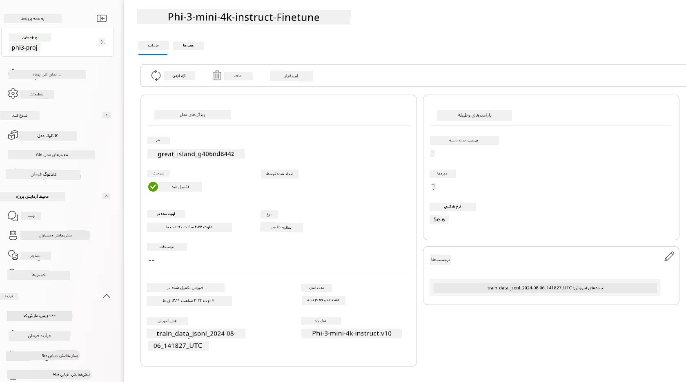

> [!NOTE]
> برای اطلاعات دقیق‌تر در مورد فاین‌تیون کردن Phi-3، لطفاً به [فاین‌تیون مدل‌های Phi-3 در Microsoft Foundry](https://learn.microsoft.com/azure/ai-studio/how-to/fine-tune-phi-3?tabs=phi-3-mini) مراجعه کنید.

## پاک‌سازی مدل‌های فاین‌تیون شده شما

می‌توانید یک مدل فاین‌تیون شده را از فهرست مدل‌های فاین‌تیون در [Microsoft Foundry](https://ai.azure.com) یا از صفحه جزئیات مدل حذف کنید. مدل فاین‌تیون شده مورد نظر را در صفحه Fine-tuning انتخاب کنید و سپس دکمه Delete را برای حذف آن انتخاب کنید.

> [!NOTE]
> اگر مدل سفارشی دارای استقرار فعلی باشد، نمی‌توانید آن را حذف کنید. ابتدا باید استقرار مدل خود را حذف کنید تا بتوانید مدل سفارشی خود را حذف کنید.

## هزینه‌ها و محدودیت‌ها

### ملاحظات هزینه و سهمیه برای مدل‌های Phi-3 فاین‌تیون شده به عنوان سرویس

مدل‌های Phi که به عنوان سرویس فاین‌تیون شده‌اند توسط مایکروسافت ارائه شده و با Microsoft Foundry یکپارچه شده‌اند. می‌توانید قیمت‌گذاری را هنگام [استقرار](https://learn.microsoft.com/azure/ai-studio/how-to/deploy-models-phi-3?tabs=phi-3-5&pivots=programming-language-python) یا فاین‌تیونینگ مدل‌ها در زبانه قیمت‌گذاری و شرایط در ویزارد استقرار پیدا کنید.

## فیلترینگ محتوا

مدل‌هایی که به صورت سرویس با پرداخت به میزان استفاده مستقر شده‌اند توسط Azure AI Content Safety محافظت می‌شوند. هنگام استقرار به نقاط پایانی زمان واقعی، می‌توانید از این قابلیت انصراف دهید. با فعال بودن Azure AI Content Safety، هم ورودی و هم خروجی از یک مجموعه مدل طبقه‌بندی عبور می‌کنند که برای شناسایی و جلوگیری از تولید محتوای مضر طراحی شده‌اند. سیستم فیلترینگ محتوا دسته‌بندی‌های خاصی از محتوای بالقوه مضر را در هر دو ورودی و خروجی شناسایی و اقدام می‌کند. برای اطلاعات بیشتر به [Azure AI Content Safety](https://learn.microsoft.com/azure/ai-studio/concepts/content-filtering) مراجعه کنید.

**پیکربندی فاین‌تیونینگ**

تعریف ابرپارامترها: مثل نرخ یادگیری، اندازه دسته و تعداد دوره‌های آموزش.

**تابع خطا**

انتخاب تابع خطای مناسب برای وظیفه شما (مثلاً کراس انتروپی).

**بهینه‌ساز**

انتخاب بهینه‌ساز (مثلاً Adam) برای به‌روزرسانی گرادیان‌ها در طول آموزش.

**فرآیند فاین‌تیونینگ**

- بارگذاری مدل پیش‌آموزش دیده: بارگذاری چک‌پوینت Phi-3 Mini.
- افزودن لایه‌های سفارشی: افزودن لایه‌های مخصوص وظیفه (مثلاً سری دسته‌بندی برای دستورالعمل چت).

**آموزش مدل**  
مدل را با مجموعه داده آماده شده فاین‌تیون کنید. پیشرفت آموزش را رصد کرده و در صورت نیاز ابرپارامترها را تنظیم کنید.

**ارزیابی و اعتبارسنجی**

مجموعه اعتبارسنجی: داده‌های خود را به مجموعه‌های آموزش و اعتبارسنجی تقسیم کنید.

**ارزیابی عملکرد**  
از معیارهایی مانند دقت، امتیاز F1 یا پرپلکسی برای ارزیابی عملکرد مدل استفاده کنید.

## ذخیره مدل فاین‌تیون شده

**چک‌پوینت**  
چک‌پوینت مدل فاین‌تیون شده را برای استفاده‌های بعدی ذخیره کنید.

## استقرار

- استقرار به عنوان سرویس وب: مدل فاین‌تیون شده خود را به عنوان سرویس وب در Microsoft Foundry مستقر کنید.
- تست نقطه پایان: درخواست‌های تست را به نقطه پایان مستقر شده ارسال کنید تا عملکرد آن را تأیید کنید.

## تکرار و بهبود

تکرار: اگر عملکرد رضایت‌بخش نبود، با تنظیم ابرپارامترها، افزودن داده‌های بیشتر یا فاین‌تیونینگ بیشتر به بهبود بپردازید.

## پایش و اصلاح

رفتار مدل را به طور مداوم پایش کرده و در صورت نیاز اصلاح کنید.

## سفارشی‌سازی و گسترش

وظایف سفارشی: Phi-3 Mini می‌تواند برای وظایف مختلفی فراتر از دستورالعمل‌های چت فاین‌تیون شود. موارد استفاده دیگر را بررسی کنید!  
آزمایش: معماری‌ها، ترکیب لایه‌ها و تکنیک‌های مختلف را برای افزایش عملکرد امتحان کنید.

> [!NOTE]
> فاین‌تیونینگ یک فرآیند تکراری است. آزمایش کنید، بیاموزید و مدل خود را برای بهترین نتایج در وظیفه خاص خود تطبیق دهید!

---

<!-- CO-OP TRANSLATOR DISCLAIMER START -->
**سلب مسئولیت**:  
این سند با استفاده از سرویس ترجمه هوش مصنوعی [Co-op Translator](https://github.com/Azure/co-op-translator) ترجمه شده است. در حالی که ما در تلاش برای دقت هستیم، لطفاً توجه داشته باشید که ترجمه‌های خودکار ممکن است شامل خطاها یا نادرستی‌هایی باشند. سند اصلی به زبان بومی آن باید به عنوان منبع معتبر در نظر گرفته شود. برای اطلاعات حساس، ترجمه حرفه‌ای انسانی توصیه می‌شود. ما مسئول سوءتفاهم‌ها یا برداشت‌های نادرست ناشی از استفاده از این ترجمه نیستیم.
<!-- CO-OP TRANSLATOR DISCLAIMER END -->