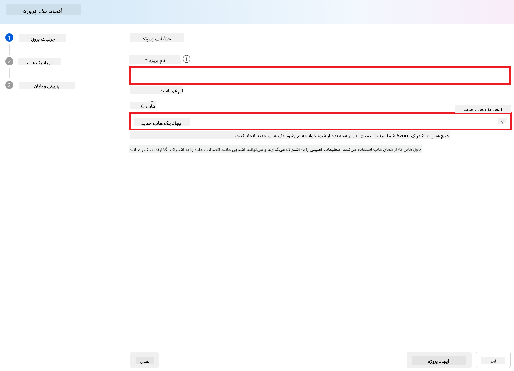

<!--
CO_OP_TRANSLATOR_METADATA:
{
  "original_hash": "c1559c5af6caccf6f623fd43a6b3a9a3",
  "translation_date": "2025-07-17T05:56:03+00:00",
  "source_file": "md/03.FineTuning/FineTuning_AIFoundry.md",
  "language_code": "fa"
}
-->
# آموزش دقیق Phi-3 با Azure AI Foundry

بیایید ببینیم چگونه می‌توان مدل زبان Phi-3 Mini مایکروسافت را با استفاده از Azure AI Foundry به‌صورت دقیق آموزش داد. آموزش دقیق به شما امکان می‌دهد Phi-3 Mini را برای وظایف خاصی تطبیق دهید و آن را قدرتمندتر و آگاه‌تر به زمینه کنید.

## ملاحظات

- **قابلیت‌ها:** کدام مدل‌ها قابل آموزش دقیق هستند؟ مدل پایه را می‌توان برای انجام چه کارهایی آموزش داد؟
- **هزینه:** مدل قیمت‌گذاری آموزش دقیق چگونه است؟
- **قابلیت سفارشی‌سازی:** چقدر می‌توانم مدل پایه را تغییر دهم و به چه روش‌هایی؟
- **سهولت:** آموزش دقیق چگونه انجام می‌شود؟ آیا نیاز به نوشتن کد سفارشی دارم؟ آیا باید منابع محاسباتی خودم را بیاورم؟
- **ایمنی:** مدل‌های آموزش دیده دقیق ممکن است ریسک‌های ایمنی داشته باشند – آیا محدودیت‌هایی برای جلوگیری از آسیب ناخواسته وجود دارد؟


## آماده‌سازی برای آموزش دقیق

### پیش‌نیازها

> [!NOTE]
> برای مدل‌های خانواده Phi-3، گزینه آموزش دقیق با مدل پرداخت به ازای مصرف فقط در هاب‌هایی که در منطقه **East US 2** ایجاد شده‌اند، در دسترس است.

- یک اشتراک Azure. اگر اشتراک Azure ندارید، یک [حساب Azure پرداختی](https://azure.microsoft.com/pricing/purchase-options/pay-as-you-go) بسازید تا شروع کنید.

- یک [پروژه AI Foundry](https://ai.azure.com?WT.mc_id=aiml-138114-kinfeylo).
- کنترل‌های دسترسی مبتنی بر نقش Azure (Azure RBAC) برای اعطای دسترسی به عملیات در Azure AI Foundry استفاده می‌شود. برای انجام مراحل این مقاله، حساب کاربری شما باید نقش __Azure AI Developer__ را روی گروه منابع داشته باشد.

### ثبت ارائه‌دهنده اشتراک

اطمینان حاصل کنید که اشتراک شما به ارائه‌دهنده منابع `Microsoft.Network` ثبت شده است.

1. وارد [پورتال Azure](https://portal.azure.com) شوید.
1. از منوی سمت چپ، **Subscriptions** را انتخاب کنید.
1. اشتراکی که می‌خواهید استفاده کنید را انتخاب کنید.
1. از منوی سمت چپ، **AI project settings** > **Resource providers** را انتخاب کنید.
1. تأیید کنید که **Microsoft.Network** در لیست ارائه‌دهندگان منابع وجود دارد. در غیر این صورت آن را اضافه کنید.

### آماده‌سازی داده‌ها

داده‌های آموزش و اعتبارسنجی خود را برای آموزش دقیق مدل آماده کنید. مجموعه داده‌های آموزش و اعتبارسنجی شما شامل نمونه‌های ورودی و خروجی است که نشان می‌دهد مدل چگونه باید عمل کند.

اطمینان حاصل کنید که تمام نمونه‌های آموزش شما قالب مورد انتظار برای استنتاج را رعایت می‌کنند. برای آموزش دقیق مؤثر، یک مجموعه داده متعادل و متنوع داشته باشید.

این شامل حفظ تعادل داده‌ها، گنجاندن سناریوهای مختلف و به‌روزرسانی دوره‌ای داده‌های آموزش برای هماهنگی با انتظارات دنیای واقعی است که در نهایت منجر به پاسخ‌های دقیق‌تر و متعادل‌تر مدل می‌شود.

انواع مختلف مدل‌ها به قالب‌های متفاوتی از داده‌های آموزش نیاز دارند.

### تکمیل چت

داده‌های آموزش و اعتبارسنجی که استفاده می‌کنید **باید** به صورت یک سند JSON Lines (JSONL) قالب‌بندی شده باشند. برای `Phi-3-mini-128k-instruct`، مجموعه داده آموزش دقیق باید در قالب مکالمه‌ای باشد که توسط API تکمیل چت استفاده می‌شود.

### قالب نمونه فایل

```json
    {"messages": [{"role": "system", "content": "You are an Xbox customer support agent whose primary goal is to help users with issues they are experiencing with their Xbox devices. You are friendly and concise. You only provide factual answers to queries, and do not provide answers that are not related to Xbox."}, {"role": "user", "content": "Is Xbox better than PlayStation?"}, {"role": "assistant", "content": "I apologize, but I cannot provide personal opinions. My primary job is to assist you with any issues related to your Xbox device. Do you have any Xbox-related issues that need addressing?"}]}
    {"messages": [{"role": "system", "content": "You are an Xbox customer support agent whose primary goal is to help users with issues they are experiencing with their Xbox devices. You are friendly and concise. You only provide factual answers to queries, and do not provide answers that are not related to Xbox."}, {"role": "user", "content": "Can I play PC games on my Xbox?"}, {"role": "assistant", "content": "While Xbox consoles don't natively support PC games, they can play an array of Xbox games, many of which are also available on PC. Can I assist you with finding games compatible with your Xbox device?"}]}
    {"messages": [{"role": "system", "content": "You are an Xbox customer support agent whose primary goal is to help users with issues they are experiencing with their Xbox devices. You are friendly and concise. You only provide factual answers to queries, and do not provide answers that are not related to Xbox."}, {"role": "user", "content": "I'm having trouble connecting my Xbox to the Wi-Fi."}, {"role": "assistant", "content": "No worries, let's go through the network settings on your Xbox. Can you please tell me what happens when you try to connect it to the Wi-Fi?"}]}
```

نوع فایل پشتیبانی شده JSON Lines است. فایل‌ها در دیتاستور پیش‌فرض بارگذاری شده و در پروژه شما در دسترس قرار می‌گیرند.

## آموزش دقیق Phi-3 با Azure AI Foundry

Azure AI Foundry به شما امکان می‌دهد مدل‌های زبان بزرگ را با استفاده از فرآیندی به نام آموزش دقیق، بر اساس داده‌های شخصی خود تنظیم کنید. آموزش دقیق ارزش زیادی دارد زیرا امکان سفارشی‌سازی و بهینه‌سازی برای وظایف و کاربردهای خاص را فراهم می‌کند. این کار منجر به بهبود عملکرد، صرفه‌جویی در هزینه، کاهش تأخیر و خروجی‌های متناسب می‌شود.


### ایجاد پروژه جدید

1. وارد [Azure AI Foundry](https://ai.azure.com) شوید.

1. برای ایجاد پروژه جدید، **+New project** را انتخاب کنید.

    

1. کارهای زیر را انجام دهید:

    - نام **Hub** پروژه. باید یک مقدار یکتا باشد.
    - **Hub** مورد نظر را انتخاب کنید (در صورت نیاز یک هاب جدید بسازید).

    

1. برای ایجاد یک هاب جدید، کارهای زیر را انجام دهید:

    - نام **Hub** را وارد کنید. باید یکتا باشد.
    - اشتراک Azure خود را انتخاب کنید.
    - گروه منابع (**Resource group**) را انتخاب کنید (در صورت نیاز جدید بسازید).
    - موقعیت مکانی (**Location**) مورد نظر را انتخاب کنید.
    - سرویس‌های Azure AI را برای اتصال انتخاب کنید (در صورت نیاز جدید بسازید).
    - گزینه **Connect Azure AI Search** را روی **Skip connecting** قرار دهید.

    

1. روی **Next** کلیک کنید.
1. روی **Create a project** کلیک کنید.

### آماده‌سازی داده‌ها

قبل از آموزش دقیق، یک مجموعه داده مرتبط با وظیفه خود جمع‌آوری یا ایجاد کنید، مانند دستورالعمل‌های چت، جفت‌های سوال و جواب یا هر داده متنی مرتبط دیگر. این داده‌ها را پاک‌سازی و پیش‌پردازش کنید، نویز را حذف کنید، مقادیر گمشده را مدیریت کنید و متن را توکنیزه کنید.

### آموزش دقیق مدل‌های Phi-3 در Azure AI Foundry

> [!NOTE]
> آموزش دقیق مدل‌های Phi-3 در حال حاضر فقط در پروژه‌هایی که در منطقه East US 2 قرار دارند پشتیبانی می‌شود.

1. از تب سمت چپ، **Model catalog** را انتخاب کنید.

1. در **نوار جستجو** عبارت *phi-3* را تایپ کرده و مدل phi-3 مورد نظر خود را انتخاب کنید.

    

1. روی **Fine-tune** کلیک کنید.

    

1. نام **مدل آموزش دیده دقیق** را وارد کنید.

    

1. روی **Next** کلیک کنید.

1. کارهای زیر را انجام دهید:

    - نوع **وظیفه** را روی **Chat completion** تنظیم کنید.
    - داده‌های **آموزش** مورد نظر خود را انتخاب کنید. می‌توانید آن را از داده‌های Azure AI Foundry یا محیط محلی خود بارگذاری کنید.

    

1. روی **Next** کلیک کنید.

1. داده‌های **اعتبارسنجی** مورد نظر خود را بارگذاری کنید یا گزینه **Automatic split of training data** را انتخاب کنید.

    

1. روی **Next** کلیک کنید.

1. کارهای زیر را انجام دهید:

    - ضریب **Batch size** را انتخاب کنید.
    - نرخ **Learning rate** را انتخاب کنید.
    - تعداد **Epochs** را انتخاب کنید.

    

1. برای شروع فرآیند آموزش دقیق، روی **Submit** کلیک کنید.

    

1. پس از اتمام آموزش دقیق، وضعیت مدل به صورت **Completed** نمایش داده می‌شود، همانطور که در تصویر زیر می‌بینید. اکنون می‌توانید مدل را مستقر کرده و در برنامه خود، در محیط آزمایشی یا در prompt flow استفاده کنید. برای اطلاعات بیشتر، به [نحوه استقرار خانواده مدل‌های کوچک زبان Phi-3 با Azure AI Foundry](https://learn.microsoft.com/azure/ai-studio/how-to/deploy-models-phi-3?tabs=phi-3-5&pivots=programming-language-python) مراجعه کنید.

    

> [!NOTE]
> برای اطلاعات دقیق‌تر درباره آموزش دقیق Phi-3، لطفاً به [Fine-tune Phi-3 models in Azure AI Foundry](https://learn.microsoft.com/azure/ai-studio/how-to/fine-tune-phi-3?tabs=phi-3-mini) مراجعه کنید.

## پاک‌سازی مدل‌های آموزش دیده دقیق

می‌توانید یک مدل آموزش دیده دقیق را از فهرست مدل‌های آموزش دقیق در [Azure AI Foundry](https://ai.azure.com) یا از صفحه جزئیات مدل حذف کنید. مدل آموزش دیده دقیق مورد نظر برای حذف را از صفحه Fine-tuning انتخاب کرده و سپس دکمه Delete را بزنید.

> [!NOTE]
> اگر مدل سفارشی شما در حال حاضر مستقر شده باشد، نمی‌توانید آن را حذف کنید. ابتدا باید استقرار مدل خود را حذف کنید تا بتوانید مدل سفارشی را حذف کنید.

## هزینه‌ها و سهمیه‌ها

### ملاحظات هزینه و سهمیه برای مدل‌های Phi-3 آموزش دیده به عنوان سرویس

مدل‌های Phi که به عنوان سرویس آموزش دیده شده‌اند توسط مایکروسافت ارائه شده و با Azure AI Foundry یکپارچه شده‌اند. قیمت‌گذاری هنگام [استقرار](https://learn.microsoft.com/azure/ai-studio/how-to/deploy-models-phi-3?tabs=phi-3-5&pivots=programming-language-python) یا آموزش دقیق مدل‌ها در تب Pricing and terms در جادوگر استقرار قابل مشاهده است.

## فیلتر کردن محتوا

مدل‌هایی که به صورت سرویس با پرداخت به ازای مصرف مستقر می‌شوند، توسط Azure AI Content Safety محافظت می‌شوند. هنگام استقرار در نقاط انتهایی زمان واقعی، می‌توانید این قابلیت را غیرفعال کنید. با فعال بودن Azure AI Content Safety، هم ورودی (prompt) و هم خروجی (completion) از مجموعه‌ای از مدل‌های طبقه‌بندی عبور می‌کنند که هدفشان شناسایی و جلوگیری از تولید محتوای مضر است. سیستم فیلتر محتوا، دسته‌بندی‌های خاصی از محتوای بالقوه مضر را در ورودی و خروجی شناسایی و اقدام می‌کند. برای اطلاعات بیشتر به [Azure AI Content Safety](https://learn.microsoft.com/azure/ai-studio/concepts/content-filtering) مراجعه کنید.

**پیکربندی آموزش دقیق**

پارامترهای ابر: پارامترهای ابر مانند نرخ یادگیری، اندازه دسته و تعداد دوره‌های آموزش را تعریف کنید.

**تابع خطا**

یک تابع خطای مناسب برای وظیفه خود انتخاب کنید (مثلاً cross-entropy).

**بهینه‌ساز**

یک بهینه‌ساز (مثلاً Adam) برای به‌روزرسانی گرادیان‌ها در طول آموزش انتخاب کنید.

**فرآیند آموزش دقیق**

- بارگذاری مدل پیش‌آموزش‌دیده: چک‌پوینت Phi-3 Mini را بارگذاری کنید.
- افزودن لایه‌های سفارشی: لایه‌های مخصوص وظیفه (مثلاً سر طبقه‌بندی برای دستورالعمل‌های چت) را اضافه کنید.

**آموزش مدل**

مدل را با استفاده از مجموعه داده آماده شده آموزش دقیق دهید. پیشرفت آموزش را زیر نظر بگیرید و پارامترهای ابر را در صورت نیاز تنظیم کنید.

**ارزیابی و اعتبارسنجی**

مجموعه اعتبارسنجی: داده‌های خود را به مجموعه‌های آموزش و اعتبارسنجی تقسیم کنید.

**ارزیابی عملکرد**

از معیارهایی مانند دقت، F1-score یا perplexity برای سنجش عملکرد مدل استفاده کنید.

## ذخیره مدل آموزش دیده دقیق

**چک‌پوینت**

چک‌پوینت مدل آموزش دیده دقیق را برای استفاده‌های بعدی ذخیره کنید.

## استقرار

- استقرار به عنوان سرویس وب: مدل آموزش دیده دقیق خود را به عنوان یک سرویس وب در Azure AI Foundry مستقر کنید.
- تست نقطه انتهایی: درخواست‌های آزمایشی به نقطه انتهایی مستقر شده ارسال کنید تا عملکرد آن را بررسی کنید.

## تکرار و بهبود

تکرار: اگر عملکرد رضایت‌بخش نیست، با تنظیم پارامترهای ابر، افزودن داده بیشتر یا آموزش دقیق در دوره‌های بیشتر، فرآیند را تکرار کنید.

## نظارت و اصلاح

رفتار مدل را به طور مداوم زیر نظر بگیرید و در صورت نیاز اصلاح کنید.

## سفارشی‌سازی و گسترش

وظایف سفارشی: Phi-3 Mini را می‌توان برای وظایف مختلف فراتر از دستورالعمل‌های چت آموزش دقیق داد. موارد استفاده دیگر را بررسی کنید!
آزمایش: معماری‌ها، ترکیب لایه‌ها و تکنیک‌های مختلف را امتحان کنید تا عملکرد را بهبود دهید.

> [!NOTE]
> آموزش دقیق یک فرآیند تکراری است. آزمایش کنید، یاد بگیرید و مدل خود را برای رسیدن به بهترین نتایج در وظیفه خاص خود تطبیق دهید!

**سلب مسئولیت**:  
این سند با استفاده از سرویس ترجمه هوش مصنوعی [Co-op Translator](https://github.com/Azure/co-op-translator) ترجمه شده است. در حالی که ما در تلاش برای دقت هستیم، لطفاً توجه داشته باشید که ترجمه‌های خودکار ممکن است حاوی خطاها یا نواقصی باشند. سند اصلی به زبان بومی خود باید به عنوان منبع معتبر در نظر گرفته شود. برای اطلاعات حیاتی، ترجمه حرفه‌ای انسانی توصیه می‌شود. ما مسئول هیچ گونه سوءتفاهم یا تفسیر نادرستی که از استفاده این ترجمه ناشی شود، نیستیم.