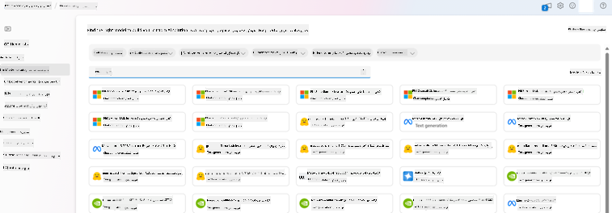
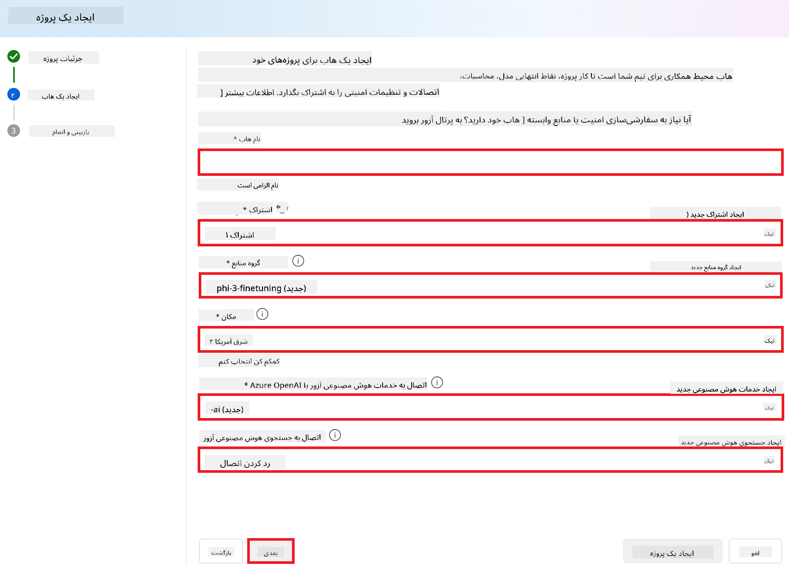
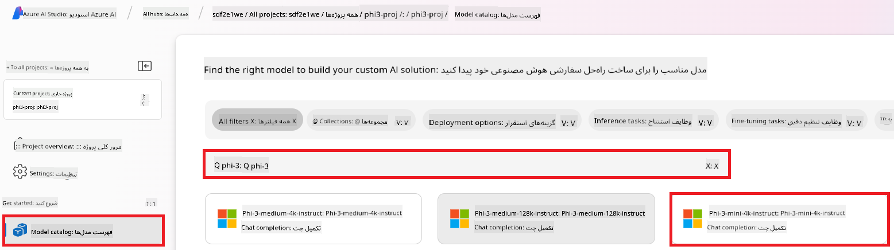
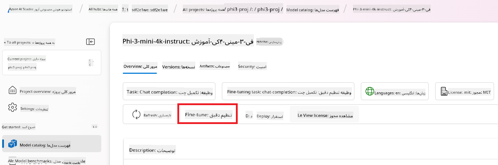
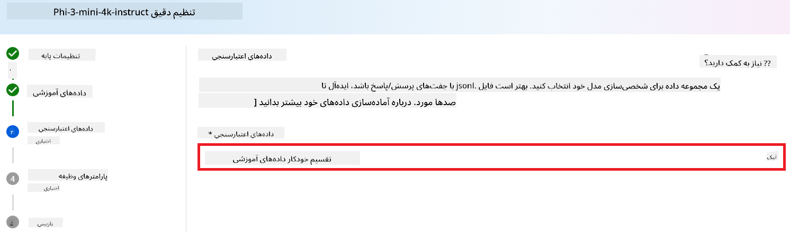
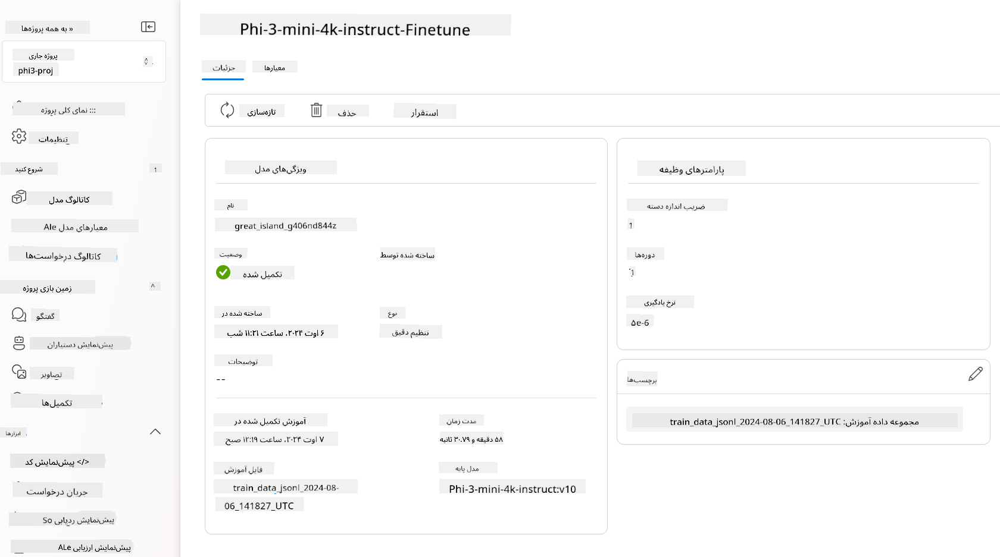

<!--
CO_OP_TRANSLATOR_METADATA:
{
  "original_hash": "c1559c5af6caccf6f623fd43a6b3a9a3",
  "translation_date": "2025-05-07T13:10:20+00:00",
  "source_file": "md/03.FineTuning/FineTuning_AIFoundry.md",
  "language_code": "fa"
}
-->
# تنظیم دقیق Phi-3 با Azure AI Foundry

بیایید ببینیم چگونه می‌توان مدل زبان Phi-3 Mini مایکروسافت را با استفاده از Azure AI Foundry به صورت دقیق تنظیم کرد. تنظیم دقیق به شما امکان می‌دهد Phi-3 Mini را برای وظایف خاص تطبیق دهید و آن را قدرتمندتر و آگاه‌تر به زمینه کنید.

## ملاحظات

- **قابلیت‌ها:** کدام مدل‌ها قابل تنظیم دقیق هستند؟ مدل پایه را می‌توان برای انجام چه کارهایی تنظیم کرد؟
- **هزینه:** مدل قیمت‌گذاری برای تنظیم دقیق چگونه است؟
- **قابلیت سفارشی‌سازی:** چقدر می‌توانم مدل پایه را تغییر دهم – و به چه روش‌هایی؟
- **راحتی:** تنظیم دقیق چگونه انجام می‌شود – آیا نیاز به نوشتن کد سفارشی دارم؟ آیا باید منابع محاسباتی خودم را بیاورم؟
- **ایمنی:** مدل‌های تنظیم دقیق شده ممکن است خطرات ایمنی داشته باشند – آیا محافظ‌هایی برای جلوگیری از آسیب ناخواسته وجود دارد؟



## آماده‌سازی برای تنظیم دقیق

### پیش‌نیازها

> [!NOTE]
> برای مدل‌های خانواده Phi-3، ارائه تنظیم دقیق با مدل پرداخت به ازای مصرف تنها در هاب‌های ایجاد شده در منطقه **East US 2** در دسترس است.

- یک اشتراک Azure. اگر اشتراک Azure ندارید، یک [حساب Azure پولی](https://azure.microsoft.com/pricing/purchase-options/pay-as-you-go) ایجاد کنید تا شروع کنید.

- یک [پروژه AI Foundry](https://ai.azure.com?WT.mc_id=aiml-138114-kinfeylo).
- کنترل‌های دسترسی مبتنی بر نقش Azure (Azure RBAC) برای اعطای دسترسی به عملیات در Azure AI Foundry استفاده می‌شود. برای انجام مراحل این مقاله، حساب کاربری شما باید نقش __Azure AI Developer__ را روی گروه منابع داشته باشد.

### ثبت ارائه‌دهنده اشتراک

اطمینان حاصل کنید که اشتراک به ارائه‌دهنده منابع `Microsoft.Network` ثبت شده است.

1. وارد [Azure portal](https://portal.azure.com) شوید.
1. از منوی سمت چپ **Subscriptions** را انتخاب کنید.
1. اشتراکی که می‌خواهید استفاده کنید را انتخاب کنید.
1. از منوی سمت چپ **AI project settings** > **Resource providers** را انتخاب کنید.
1. تأیید کنید که **Microsoft.Network** در لیست ارائه‌دهندگان منابع باشد، در غیر این صورت آن را اضافه کنید.

### آماده‌سازی داده‌ها

داده‌های آموزش و اعتبارسنجی خود را برای تنظیم دقیق مدل آماده کنید. مجموعه داده‌های آموزش و اعتبارسنجی شما شامل نمونه‌های ورودی و خروجی است که نشان می‌دهد مدل چگونه باید عمل کند.

اطمینان حاصل کنید که همه نمونه‌های آموزشی شما فرمت مورد انتظار برای استنتاج را دارند. برای تنظیم دقیق مؤثر، مجموعه داده‌ای متعادل و متنوع فراهم کنید.

این شامل حفظ تعادل داده‌ها، گنجاندن سناریوهای مختلف و بازبینی دوره‌ای داده‌های آموزشی برای هماهنگی با انتظارات دنیای واقعی است که در نهایت به پاسخ‌های دقیق‌تر و متعادل‌تر مدل منجر می‌شود.

انواع مختلف مدل‌ها به فرمت‌های متفاوتی از داده‌های آموزشی نیاز دارند.

### Chat Completion

داده‌های آموزش و اعتبارسنجی که استفاده می‌کنید **باید** به صورت یک سند JSON Lines (JSONL) قالب‌بندی شده باشند. برای `Phi-3-mini-128k-instruct` مجموعه داده تنظیم دقیق باید به فرمت مکالمه‌ای باشد که توسط API تکمیل چت استفاده می‌شود.

### فرمت نمونه فایل

```json
    {"messages": [{"role": "system", "content": "You are an Xbox customer support agent whose primary goal is to help users with issues they are experiencing with their Xbox devices. You are friendly and concise. You only provide factual answers to queries, and do not provide answers that are not related to Xbox."}, {"role": "user", "content": "Is Xbox better than PlayStation?"}, {"role": "assistant", "content": "I apologize, but I cannot provide personal opinions. My primary job is to assist you with any issues related to your Xbox device. Do you have any Xbox-related issues that need addressing?"}]}
    {"messages": [{"role": "system", "content": "You are an Xbox customer support agent whose primary goal is to help users with issues they are experiencing with their Xbox devices. You are friendly and concise. You only provide factual answers to queries, and do not provide answers that are not related to Xbox."}, {"role": "user", "content": "Can I play PC games on my Xbox?"}, {"role": "assistant", "content": "While Xbox consoles don't natively support PC games, they can play an array of Xbox games, many of which are also available on PC. Can I assist you with finding games compatible with your Xbox device?"}]}
    {"messages": [{"role": "system", "content": "You are an Xbox customer support agent whose primary goal is to help users with issues they are experiencing with their Xbox devices. You are friendly and concise. You only provide factual answers to queries, and do not provide answers that are not related to Xbox."}, {"role": "user", "content": "I'm having trouble connecting my Xbox to the Wi-Fi."}, {"role": "assistant", "content": "No worries, let's go through the network settings on your Xbox. Can you please tell me what happens when you try to connect it to the Wi-Fi?"}]}
```

نوع فایل پشتیبانی شده JSON Lines است. فایل‌ها در دیتاستور پیش‌فرض آپلود شده و در پروژه شما قابل دسترسی خواهند بود.

## تنظیم دقیق Phi-3 با Azure AI Foundry

Azure AI Foundry به شما امکان می‌دهد مدل‌های زبان بزرگ را با استفاده از فرآیندی به نام تنظیم دقیق، بر اساس داده‌های شخصی خود سفارشی کنید. تنظیم دقیق ارزش قابل توجهی دارد زیرا امکان سفارشی‌سازی و بهینه‌سازی برای وظایف و کاربردهای خاص را فراهم می‌کند. این کار به بهبود عملکرد، صرفه‌جویی در هزینه، کاهش تأخیر و خروجی‌های متناسب منجر می‌شود.


### ایجاد پروژه جدید

1. وارد [Azure AI Foundry](https://ai.azure.com) شوید.

1. برای ایجاد پروژه جدید، **+New project** را انتخاب کنید.

    

1. کارهای زیر را انجام دهید:

    - نام **Hub پروژه**. باید یک مقدار یکتا باشد.
    - **Hub** مورد استفاده را انتخاب کنید (در صورت نیاز یک مورد جدید بسازید).

    

1. برای ایجاد هاب جدید، موارد زیر را انجام دهید:

    - نام **Hub** را وارد کنید. باید یک مقدار یکتا باشد.
    - اشتراک Azure خود را انتخاب کنید.
    - گروه منابع (**Resource group**) مورد استفاده را انتخاب کنید (در صورت نیاز یک مورد جدید بسازید).
    - موقعیت مکانی (**Location**) مورد نظر خود را انتخاب کنید.
    - سرویس‌های Azure AI را که می‌خواهید وصل کنید انتخاب کنید (در صورت نیاز یک مورد جدید بسازید).
    - گزینه **Connect Azure AI Search** را روی **Skip connecting** تنظیم کنید.

    

1. **Next** را انتخاب کنید.
1. **Create a project** را انتخاب کنید.

### آماده‌سازی داده‌ها

قبل از تنظیم دقیق، مجموعه داده مرتبط با وظیفه خود را جمع‌آوری یا ایجاد کنید، مانند دستورالعمل‌های چت، جفت‌های سوال-پاسخ یا هر داده متنی مرتبط دیگر. داده‌ها را پاک‌سازی و پیش‌پردازش کنید، نویز را حذف کنید، مقادیر گمشده را مدیریت کنید و متن را توکنیزه کنید.

### تنظیم دقیق مدل‌های Phi-3 در Azure AI Foundry

> [!NOTE]
> تنظیم دقیق مدل‌های Phi-3 در حال حاضر فقط در پروژه‌های واقع در منطقه East US 2 پشتیبانی می‌شود.

1. از تب سمت چپ **Model catalog** را انتخاب کنید.

1. عبارت *phi-3* را در **نوار جستجو** تایپ کرده و مدل phi-3 مورد نظر خود را انتخاب کنید.

    

1. گزینه **Fine-tune** را انتخاب کنید.

    

1. نام **مدل تنظیم دقیق شده** را وارد کنید.

    

1. **Next** را انتخاب کنید.

1. کارهای زیر را انجام دهید:

    - نوع وظیفه (**task type**) را روی **Chat completion** تنظیم کنید.
    - داده‌های آموزش (**Training data**) مورد نظر خود را انتخاب کنید. می‌توانید آن را از طریق داده‌های Azure AI Foundry یا محیط محلی خود آپلود کنید.

    

1. **Next** را انتخاب کنید.

1. داده‌های اعتبارسنجی (**Validation data**) مورد نظر خود را آپلود کنید یا گزینه **Automatic split of training data** را انتخاب کنید.

    

1. **Next** را انتخاب کنید.

1. کارهای زیر را انجام دهید:

    - ضریب اندازه دسته (**Batch size multiplier**) را انتخاب کنید.
    - نرخ یادگیری (**Learning rate**) را انتخاب کنید.
    - تعداد دورهای آموزش (**Epochs**) را انتخاب کنید.

    

1. برای شروع فرآیند تنظیم دقیق، **Submit** را انتخاب کنید.

    

1. پس از اتمام تنظیم دقیق مدل، وضعیت به صورت **Completed** نمایش داده می‌شود، همانطور که در تصویر زیر نشان داده شده است. اکنون می‌توانید مدل را مستقر کنید و در برنامه خود، محیط آزمایش یا prompt flow از آن استفاده کنید. برای اطلاعات بیشتر، به [نحوه استقرار مدل‌های خانواده Phi-3 با Azure AI Foundry](https://learn.microsoft.com/azure/ai-studio/how-to/deploy-models-phi-3?tabs=phi-3-5&pivots=programming-language-python) مراجعه کنید.

    

> [!NOTE]
> برای اطلاعات دقیق‌تر درباره تنظیم دقیق Phi-3، لطفاً به [Fine-tune Phi-3 models in Azure AI Foundry](https://learn.microsoft.com/azure/ai-studio/how-to/fine-tune-phi-3?tabs=phi-3-mini) مراجعه کنید.

## پاک‌سازی مدل‌های تنظیم دقیق شده

می‌توانید یک مدل تنظیم دقیق شده را از لیست مدل‌های تنظیم دقیق در [Azure AI Foundry](https://ai.azure.com) یا از صفحه جزئیات مدل حذف کنید. مدل تنظیم دقیق شده مورد نظر برای حذف را در صفحه Fine-tuning انتخاب کرده و سپس دکمه Delete را بزنید.

> [!NOTE]
> اگر یک مدل سفارشی دارای استقرار فعال باشد، نمی‌توانید آن را حذف کنید. ابتدا باید استقرار مدل را حذف کنید سپس می‌توانید مدل سفارشی را حذف کنید.

## هزینه و سهمیه‌ها

### ملاحظات هزینه و سهمیه برای مدل‌های Phi-3 تنظیم دقیق شده به صورت سرویس

مدل‌های Phi که به عنوان سرویس تنظیم دقیق شده‌اند توسط مایکروسافت ارائه شده و با Azure AI Foundry یکپارچه شده‌اند. می‌توانید قیمت‌گذاری را هنگام [استقرار](https://learn.microsoft.com/azure/ai-studio/how-to/deploy-models-phi-3?tabs=phi-3-5&pivots=programming-language-python) یا تنظیم دقیق مدل‌ها در تب قیمت‌گذاری و شرایط در ویزارد استقرار مشاهده کنید.

## فیلتر محتوا

مدل‌هایی که به صورت سرویس با پرداخت به ازای مصرف مستقر شده‌اند توسط Azure AI Content Safety محافظت می‌شوند. هنگام استقرار در نقاط پایانی زمان واقعی، می‌توانید از این قابلیت انصراف دهید. با فعال بودن Azure AI Content Safety، هم ورودی (prompt) و هم خروجی (completion) از طریق مجموعه‌ای از مدل‌های طبقه‌بندی عبور می‌کنند که هدفشان شناسایی و جلوگیری از تولید محتوای مضر است. سیستم فیلترینگ محتوا دسته‌بندی‌های خاصی از محتوای بالقوه مضر را در ورودی‌ها و خروجی‌ها تشخیص داده و اقدام می‌کند. برای اطلاعات بیشتر به [Azure AI Content Safety](https://learn.microsoft.com/azure/ai-studio/concepts/content-filtering) مراجعه کنید.

**پیکربندی تنظیم دقیق**

هایپرپارامترها: هایپرپارامترهایی مانند نرخ یادگیری، اندازه دسته و تعداد دورهای آموزش را تعریف کنید.

**تابع زیان**

برای وظیفه خود یک تابع زیان مناسب انتخاب کنید (مثلاً cross-entropy).

**بهینه‌ساز**

یک بهینه‌ساز (مثلاً Adam) برای به‌روزرسانی گرادیان‌ها در طول آموزش انتخاب کنید.

**فرآیند تنظیم دقیق**

- بارگذاری مدل پیش‌آموزش دیده: چک‌پوینت Phi-3 Mini را بارگذاری کنید.
- افزودن لایه‌های سفارشی: لایه‌های خاص وظیفه (مثلاً سر طبقه‌بندی برای دستورالعمل‌های چت) را اضافه کنید.

**آموزش مدل**  
مدل را با استفاده از مجموعه داده آماده شده خود تنظیم دقیق کنید. پیشرفت آموزش را دنبال کنید و در صورت نیاز هایپرپارامترها را تنظیم کنید.

**ارزیابی و اعتبارسنجی**

مجموعه اعتبارسنجی: داده‌های خود را به مجموعه‌های آموزش و اعتبارسنجی تقسیم کنید.

**ارزیابی عملکرد**

از معیارهایی مانند دقت، امتیاز F1 یا perplexity برای ارزیابی عملکرد مدل استفاده کنید.

## ذخیره مدل تنظیم دقیق شده

**چک‌پوینت**  
چک‌پوینت مدل تنظیم دقیق شده را برای استفاده‌های بعدی ذخیره کنید.

## استقرار

- استقرار به عنوان سرویس وب: مدل تنظیم دقیق شده خود را به عنوان یک سرویس وب در Azure AI Foundry مستقر کنید.
- تست نقطه پایان: درخواست‌های آزمایشی به نقطه انتهایی مستقر شده ارسال کنید تا عملکرد آن را بررسی کنید.

## تکرار و بهبود

تکرار: اگر عملکرد رضایت‌بخش نیست، با تنظیم هایپرپارامترها، افزودن داده بیشتر یا آموزش در دوره‌های بیشتر، فرآیند را تکرار کنید.

## نظارت و اصلاح

رفتار مدل را به طور مداوم نظارت کرده و در صورت نیاز اصلاح کنید.

## سفارشی‌سازی و گسترش

وظایف سفارشی: Phi-3 Mini را می‌توان برای وظایف مختلف فراتر از دستورالعمل‌های چت تنظیم دقیق کرد. سایر کاربردها را کاوش کنید!  
آزمایش: معماری‌ها، ترکیب لایه‌ها و تکنیک‌های مختلف را امتحان کنید تا عملکرد را بهبود بخشید.

> [!NOTE]
> تنظیم دقیق یک فرآیند تکراری است. آزمایش کنید، یاد بگیرید و مدل خود را برای دستیابی به بهترین نتایج در وظیفه خاص خود تطبیق دهید!

**سلب مسئولیت**:  
این سند با استفاده از سرویس ترجمه هوش مصنوعی [Co-op Translator](https://github.com/Azure/co-op-translator) ترجمه شده است. در حالی که ما در تلاش برای دقت هستیم، لطفاً توجه داشته باشید که ترجمه‌های خودکار ممکن است حاوی خطاها یا نواقصی باشند. سند اصلی به زبان مادری آن باید به عنوان منبع معتبر در نظر گرفته شود. برای اطلاعات حیاتی، توصیه می‌شود از ترجمه حرفه‌ای انسانی استفاده شود. ما مسئول هیچ گونه سوء تفاهم یا تفسیر نادرستی که ناشی از استفاده از این ترجمه باشد، نیستیم.