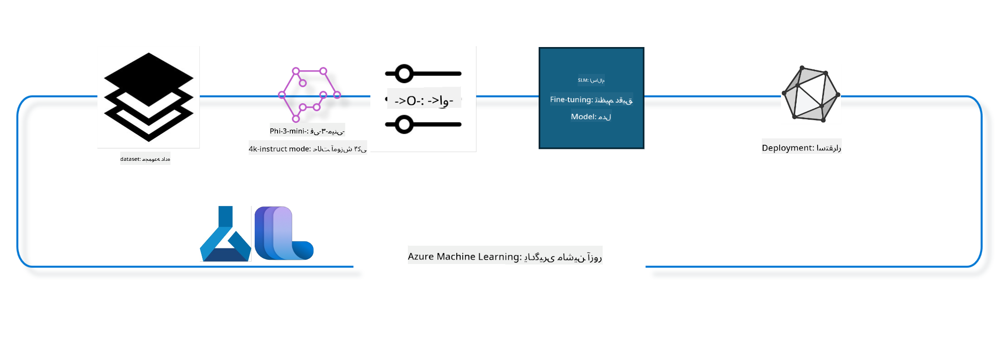

<!--
CO_OP_TRANSLATOR_METADATA:
{
  "original_hash": "944949f040e61b2ea25b3460f7394fd4",
  "translation_date": "2025-05-07T13:16:27+00:00",
  "source_file": "md/03.FineTuning/FineTuning_MLSDK.md",
  "language_code": "fa"
}
-->
## نحوه استفاده از کامپوننت‌های chat-completion از Azure ML system registry برای فاین‌تیون مدل

در این مثال، فاین‌تیون مدل Phi-3-mini-4k-instruct را برای تکمیل یک مکالمه بین دو نفر با استفاده از دیتاست ultrachat_200k انجام خواهیم داد.



این مثال نشان می‌دهد چگونه با استفاده از Azure ML SDK و پایتون فاین‌تیون انجام داده و سپس مدل فاین‌تیون شده را برای استنتاج در زمان واقعی روی یک endpoint آنلاین مستقر کنیم.

### داده‌های آموزشی

از دیتاست ultrachat_200k استفاده خواهیم کرد. این نسخه‌ای بسیار پالایش شده از دیتاست UltraChat است که برای آموزش Zephyr-7B-β، یک مدل چت پیشرفته با 7 میلیارد پارامتر، به کار رفته است.

### مدل

برای نشان دادن نحوه فاین‌تیون مدل برای وظیفه chat-completion از مدل Phi-3-mini-4k-instruct استفاده می‌کنیم. اگر این نوت‌بوک را از یک کارت مدل خاص باز کرده‌اید، به یاد داشته باشید نام مدل را جایگزین کنید.

### وظایف

- انتخاب مدلی برای فاین‌تیون
- انتخاب و بررسی داده‌های آموزشی
- پیکربندی کار فاین‌تیون
- اجرای کار فاین‌تیون
- بررسی معیارهای آموزش و ارزیابی
- ثبت مدل فاین‌تیون شده
- استقرار مدل فاین‌تیون شده برای استنتاج در زمان واقعی
- پاکسازی منابع

## 1. راه‌اندازی پیش‌نیازها

- نصب وابستگی‌ها
- اتصال به AzureML Workspace. برای اطلاعات بیشتر به راه‌اندازی احراز هویت SDK مراجعه کنید. در ادامه <WORKSPACE_NAME>، <RESOURCE_GROUP> و <SUBSCRIPTION_ID> را جایگزین کنید.
- اتصال به AzureML system registry
- تعیین نام اختیاری برای experiment
- بررسی یا ایجاد compute

> [!NOTE]
> نیازمندی‌ها: یک نود GPU می‌تواند چند کارت GPU داشته باشد. برای مثال، در یک نود از Standard_NC24rs_v3، ۴ کارت NVIDIA V100 وجود دارد در حالی که در Standard_NC12s_v3، ۲ کارت NVIDIA V100 است. برای اطلاعات بیشتر به مستندات مراجعه کنید. تعداد کارت‌های GPU در هر نود در پارامتر gpus_per_node زیر تنظیم می‌شود. تنظیم درست این مقدار تضمین می‌کند که همه GPUهای نود استفاده شوند. SKUهای پیشنهادی برای GPU compute را می‌توانید اینجا و اینجا پیدا کنید.

### کتابخانه‌های پایتون

برای نصب وابستگی‌ها سلول زیر را اجرا کنید. این مرحله در محیط جدید اختیاری نیست.

```bash
pip install azure-ai-ml
pip install azure-identity
pip install datasets==2.9.0
pip install mlflow
pip install azureml-mlflow
```

### تعامل با Azure ML

1. این اسکریپت پایتون برای تعامل با سرویس Azure Machine Learning (Azure ML) نوشته شده است. شرح عملکرد آن به شرح زیر است:

    - وارد کردن ماژول‌های لازم از بسته‌های azure.ai.ml، azure.identity و azure.ai.ml.entities و همچنین ماژول time.

    - تلاش برای احراز هویت با DefaultAzureCredential() که تجربه ساده‌شده‌ای برای شروع سریع توسعه برنامه‌های ابری Azure فراهم می‌کند. در صورت شکست، به InteractiveBrowserCredential() که یک ورود تعاملی ارائه می‌دهد، برمی‌گردد.

    - سپس تلاش می‌کند یک نمونه MLClient با استفاده از متد from_config ایجاد کند که تنظیمات را از فایل config.json می‌خواند. اگر موفق نشد، با ارائه دستی subscription_id، resource_group_name و workspace_name یک MLClient می‌سازد.

    - یک نمونه دیگر از MLClient برای Azure ML registry به نام "azureml" می‌سازد که محل ذخیره مدل‌ها، pipelineهای فاین‌تیون و محیط‌ها است.

    - experiment_name را روی "chat_completion_Phi-3-mini-4k-instruct" تنظیم می‌کند.

    - یک timestamp یکتا تولید می‌کند که از تبدیل زمان فعلی (بر حسب ثانیه از epoch به عدد صحیح و سپس رشته) به دست می‌آید. این timestamp برای ایجاد نام‌ها و نسخه‌های یکتا استفاده می‌شود.

    ```python
    # Import necessary modules from Azure ML and Azure Identity
    from azure.ai.ml import MLClient
    from azure.identity import (
        DefaultAzureCredential,
        InteractiveBrowserCredential,
    )
    from azure.ai.ml.entities import AmlCompute
    import time  # Import time module
    
    # Try to authenticate using DefaultAzureCredential
    try:
        credential = DefaultAzureCredential()
        credential.get_token("https://management.azure.com/.default")
    except Exception as ex:  # If DefaultAzureCredential fails, use InteractiveBrowserCredential
        credential = InteractiveBrowserCredential()
    
    # Try to create an MLClient instance using the default config file
    try:
        workspace_ml_client = MLClient.from_config(credential=credential)
    except:  # If that fails, create an MLClient instance by manually providing the details
        workspace_ml_client = MLClient(
            credential,
            subscription_id="<SUBSCRIPTION_ID>",
            resource_group_name="<RESOURCE_GROUP>",
            workspace_name="<WORKSPACE_NAME>",
        )
    
    # Create another MLClient instance for the Azure ML registry named "azureml"
    # This registry is where models, fine-tuning pipelines, and environments are stored
    registry_ml_client = MLClient(credential, registry_name="azureml")
    
    # Set the experiment name
    experiment_name = "chat_completion_Phi-3-mini-4k-instruct"
    
    # Generate a unique timestamp that can be used for names and versions that need to be unique
    timestamp = str(int(time.time()))
    ```

## 2. انتخاب مدل پایه برای فاین‌تیون

1. مدل Phi-3-mini-4k-instruct یک مدل سبک و پیشرفته با ۳.۸ میلیارد پارامتر است که بر اساس دیتاست‌های Phi-2 ساخته شده است. این مدل از خانواده Phi-3 است و نسخه Mini آن در دو نوع 4K و 128K (طول زمینه به تعداد توکن) عرضه شده است. برای استفاده باید مدل را برای هدف خاص خود فاین‌تیون کنیم. می‌توانید این مدل‌ها را در Model Catalog در AzureML Studio مرور کنید و بر اساس وظیفه chat-completion فیلتر کنید. در این مثال از مدل Phi-3-mini-4k-instruct استفاده شده است. اگر این نوت‌بوک را برای مدل دیگری باز کرده‌اید، نام مدل و نسخه را متناسب جایگزین کنید.

    > [!NOTE]
    > شناسه مدل (model id) که به عنوان ورودی به کار فاین‌تیون ارسال می‌شود. این شناسه همچنین در صفحه جزئیات مدل در AzureML Studio Model Catalog به عنوان Asset ID موجود است.

2. این اسکریپت پایتون با سرویس Azure Machine Learning تعامل دارد. شرح عملکرد آن:

    - مدل_name را روی "Phi-3-mini-4k-instruct" تنظیم می‌کند.

    - با استفاده از متد get روی property models از registry_ml_client، آخرین نسخه مدل با نام مشخص شده را از Azure ML registry دریافت می‌کند. متد get دو آرگومان می‌گیرد: نام مدل و برچسبی که نشان می‌دهد آخرین نسخه مدل باید گرفته شود.

    - پیامی در کنسول چاپ می‌کند که نام، نسخه و شناسه مدلی که برای فاین‌تیون استفاده می‌شود را نشان می‌دهد. از متد format رشته برای وارد کردن این مقادیر استفاده می‌شود.

    ```python
    # Set the model name
    model_name = "Phi-3-mini-4k-instruct"
    
    # Get the latest version of the model from the Azure ML registry
    foundation_model = registry_ml_client.models.get(model_name, label="latest")
    
    # Print the model name, version, and id
    # This information is useful for tracking and debugging
    print(
        "\n\nUsing model name: {0}, version: {1}, id: {2} for fine tuning".format(
            foundation_model.name, foundation_model.version, foundation_model.id
        )
    )
    ```

## 3. ایجاد یک compute برای استفاده در کار

کار فاین‌تیون فقط با compute GPU کار می‌کند. اندازه compute بستگی به بزرگی مدل دارد و در بیشتر موارد انتخاب compute مناسب دشوار است. در این سلول به کاربر راهنمایی می‌شود که compute مناسب را انتخاب کند.

> [!NOTE]
> computeهای زیر با پیکربندی بهینه شده کار می‌کنند. هر تغییر در پیکربندی ممکن است منجر به خطای Cuda Out Of Memory شود. در این موارد، سعی کنید compute را به اندازه بزرگ‌تر ارتقا دهید.

> [!NOTE]
> هنگام انتخاب compute_cluster_size زیر، مطمئن شوید که compute در resource group شما موجود است. اگر compute خاصی موجود نیست، می‌توانید درخواست دسترسی به منابع compute را بدهید.

### بررسی پشتیبانی مدل برای فاین‌تیون

1. این اسکریپت پایتون با مدل Azure ML تعامل دارد. شرح عملکرد:

    - ماژول ast را وارد می‌کند که برای پردازش درخت‌های دستور زبان انتزاعی پایتون کاربرد دارد.

    - بررسی می‌کند آیا شی foundation_model دارای تگی به نام finetune_compute_allow_list است یا خیر. تگ‌ها در Azure ML جفت‌های کلید-مقدار هستند که برای فیلتر و مرتب‌سازی مدل‌ها استفاده می‌شوند.

    - اگر تگ finetune_compute_allow_list وجود داشته باشد، با استفاده از ast.literal_eval مقدار رشته‌ای تگ را به یک لیست پایتون تبدیل می‌کند و آن را به متغیر computes_allow_list اختصاص می‌دهد. سپس پیامی چاپ می‌کند که باید compute از این لیست ساخته شود.

    - اگر تگ وجود نداشته باشد، computes_allow_list را None قرار داده و پیامی چاپ می‌کند که تگ finetune_compute_allow_list جزو تگ‌های مدل نیست.

    - به طور خلاصه، این اسکریپت بررسی می‌کند که آیا تگ خاصی در متادیتای مدل وجود دارد، مقدار آن را به لیست تبدیل می‌کند و بازخوردی به کاربر می‌دهد.

    ```python
    # Import the ast module, which provides functions to process trees of the Python abstract syntax grammar
    import ast
    
    # Check if the 'finetune_compute_allow_list' tag is present in the model's tags
    if "finetune_compute_allow_list" in foundation_model.tags:
        # If the tag is present, use ast.literal_eval to safely parse the tag's value (a string) into a Python list
        computes_allow_list = ast.literal_eval(
            foundation_model.tags["finetune_compute_allow_list"]
        )  # convert string to python list
        # Print a message indicating that a compute should be created from the list
        print(f"Please create a compute from the above list - {computes_allow_list}")
    else:
        # If the tag is not present, set computes_allow_list to None
        computes_allow_list = None
        # Print a message indicating that the 'finetune_compute_allow_list' tag is not part of the model's tags
        print("`finetune_compute_allow_list` is not part of model tags")
    ```

### بررسی Compute Instance

1. این اسکریپت پایتون با سرویس Azure Machine Learning تعامل دارد و چندین بررسی روی یک compute instance انجام می‌دهد. شرح عملکرد:

    - تلاش می‌کند compute instance با نام ذخیره شده در compute_cluster را از workspace بازیابی کند. اگر وضعیت provisioning آن "failed" باشد، خطای ValueError ایجاد می‌کند.

    - بررسی می‌کند اگر computes_allow_list مقدار None ندارد، همه اندازه‌های compute در لیست را به حروف کوچک تبدیل کرده و بررسی می‌کند آیا اندازه compute فعلی در لیست است یا خیر. اگر نباشد، خطای ValueError ایجاد می‌کند.

    - اگر computes_allow_list برابر None باشد، بررسی می‌کند آیا اندازه compute در لیست اندازه‌های GPU VM پشتیبانی نشده هست یا خیر. اگر باشد، خطا ایجاد می‌کند.

    - لیستی از همه اندازه‌های compute موجود در workspace می‌گیرد و برای هر اندازه بررسی می‌کند آیا نام آن با اندازه compute فعلی مطابقت دارد یا خیر. اگر بله، تعداد GPUهای آن اندازه را دریافت کرده و gpu_count_found را True می‌کند.

    - اگر gpu_count_found برابر True باشد، تعداد GPUهای compute instance را چاپ می‌کند. اگر False باشد، خطای ValueError ایجاد می‌کند.

    - به طور خلاصه، این اسکریپت چندین بررسی روی compute instance در workspace انجام می‌دهد، از جمله وضعیت provisioning، اندازه compute بر اساس لیست مجاز یا غیرمجاز، و تعداد GPUهای آن.

    ```python
    # Print the exception message
    print(e)
    # Raise a ValueError if the compute size is not available in the workspace
    raise ValueError(
        f"WARNING! Compute size {compute_cluster_size} not available in workspace"
    )
    
    # Retrieve the compute instance from the Azure ML workspace
    compute = workspace_ml_client.compute.get(compute_cluster)
    # Check if the provisioning state of the compute instance is "failed"
    if compute.provisioning_state.lower() == "failed":
        # Raise a ValueError if the provisioning state is "failed"
        raise ValueError(
            f"Provisioning failed, Compute '{compute_cluster}' is in failed state. "
            f"please try creating a different compute"
        )
    
    # Check if computes_allow_list is not None
    if computes_allow_list is not None:
        # Convert all compute sizes in computes_allow_list to lowercase
        computes_allow_list_lower_case = [x.lower() for x in computes_allow_list]
        # Check if the size of the compute instance is in computes_allow_list_lower_case
        if compute.size.lower() not in computes_allow_list_lower_case:
            # Raise a ValueError if the size of the compute instance is not in computes_allow_list_lower_case
            raise ValueError(
                f"VM size {compute.size} is not in the allow-listed computes for finetuning"
            )
    else:
        # Define a list of unsupported GPU VM sizes
        unsupported_gpu_vm_list = [
            "standard_nc6",
            "standard_nc12",
            "standard_nc24",
            "standard_nc24r",
        ]
        # Check if the size of the compute instance is in unsupported_gpu_vm_list
        if compute.size.lower() in unsupported_gpu_vm_list:
            # Raise a ValueError if the size of the compute instance is in unsupported_gpu_vm_list
            raise ValueError(
                f"VM size {compute.size} is currently not supported for finetuning"
            )
    
    # Initialize a flag to check if the number of GPUs in the compute instance has been found
    gpu_count_found = False
    # Retrieve a list of all available compute sizes in the workspace
    workspace_compute_sku_list = workspace_ml_client.compute.list_sizes()
    available_sku_sizes = []
    # Iterate over the list of available compute sizes
    for compute_sku in workspace_compute_sku_list:
        available_sku_sizes.append(compute_sku.name)
        # Check if the name of the compute size matches the size of the compute instance
        if compute_sku.name.lower() == compute.size.lower():
            # If it does, retrieve the number of GPUs for that compute size and set gpu_count_found to True
            gpus_per_node = compute_sku.gpus
            gpu_count_found = True
    # If gpu_count_found is True, print the number of GPUs in the compute instance
    if gpu_count_found:
        print(f"Number of GPU's in compute {compute.size}: {gpus_per_node}")
    else:
        # If gpu_count_found is False, raise a ValueError
        raise ValueError(
            f"Number of GPU's in compute {compute.size} not found. Available skus are: {available_sku_sizes}."
            f"This should not happen. Please check the selected compute cluster: {compute_cluster} and try again."
        )
    ```

## 4. انتخاب دیتاست برای فاین‌تیون مدل

1. از دیتاست ultrachat_200k استفاده می‌کنیم. این دیتاست چهار بخش دارد که مناسب برای Supervised fine-tuning (sft) است.
نسخه Generation ranking (gen). تعداد نمونه‌ها در هر بخش به شرح زیر است:

    ```bash
    train_sft test_sft  train_gen  test_gen
    207865  23110  256032  28304
    ```

1. چند سلول بعدی آماده‌سازی پایه داده برای فاین‌تیون را نشان می‌دهد:

### مشاهده چند ردیف داده

می‌خواهیم این نمونه سریع اجرا شود، بنابراین فایل‌های train_sft و test_sft را که حاوی ۵٪ از ردیف‌های پالایش شده هستند، ذخیره می‌کنیم. این به معنای دقت کمتر مدل فاین‌تیون شده است، بنابراین نباید در کاربردهای واقعی استفاده شود.
اسکریپت download-dataset.py برای دانلود دیتاست ultrachat_200k و تبدیل آن به فرمت قابل استفاده در pipeline فاین‌تیون به کار می‌رود. همچنین چون دیتاست بزرگ است، اینجا فقط بخشی از آن موجود است.

1. اجرای اسکریپت زیر فقط ۵٪ از داده‌ها را دانلود می‌کند. این مقدار با تغییر پارامتر dataset_split_pc به درصد دلخواه قابل افزایش است.

    > [!NOTE]
    > برخی مدل‌های زبانی کدهای زبانی متفاوتی دارند و بنابراین نام ستون‌های دیتاست باید متناسب با آن‌ها باشد.

1. نمونه‌ای از شکل داده‌ها به این صورت است:
دیتاست chat-completion در فرمت parquet ذخیره شده است که هر ورودی از ساختار زیر استفاده می‌کند:

    - این یک سند JSON (JavaScript Object Notation) است که فرمت محبوبی برای تبادل داده است. این کد اجرایی نیست بلکه روشی برای ذخیره و انتقال داده است. ساختار آن به شرح زیر است:

    - "prompt": کلیدی که رشته‌ای را نگه می‌دارد که یک وظیفه یا سوال مطرح شده به دستیار هوش مصنوعی است.

    - "messages": آرایه‌ای از اشیاء که هر کدام نمایانگر یک پیام در مکالمه بین کاربر و دستیار هوش مصنوعی هستند. هر پیام دو کلید دارد:

    - "content": رشته‌ای که محتوای پیام را نشان می‌دهد.
    - "role": رشته‌ای که نقش فرستنده پیام را مشخص می‌کند. می‌تواند "user" یا "assistant" باشد.
    - "prompt_id": رشته‌ای که شناسه یکتای prompt را نگه می‌دارد.

1. در این سند JSON خاص، مکالمه‌ای نشان داده شده است که کاربر از دستیار هوش مصنوعی می‌خواهد قهرمان یک داستان دیستوپیایی بسازد. دستیار پاسخ می‌دهد و کاربر جزئیات بیشتری می‌خواهد. دستیار موافقت می‌کند جزئیات بیشتری ارائه دهد. کل مکالمه به یک شناسه prompt خاص مرتبط است.

    ```python
    {
        // The task or question posed to an AI assistant
        "prompt": "Create a fully-developed protagonist who is challenged to survive within a dystopian society under the rule of a tyrant. ...",
        
        // An array of objects, each representing a message in a conversation between a user and an AI assistant
        "messages":[
            {
                // The content of the user's message
                "content": "Create a fully-developed protagonist who is challenged to survive within a dystopian society under the rule of a tyrant. ...",
                // The role of the entity that sent the message
                "role": "user"
            },
            {
                // The content of the assistant's message
                "content": "Name: Ava\n\n Ava was just 16 years old when the world as she knew it came crashing down. The government had collapsed, leaving behind a chaotic and lawless society. ...",
                // The role of the entity that sent the message
                "role": "assistant"
            },
            {
                // The content of the user's message
                "content": "Wow, Ava's story is so intense and inspiring! Can you provide me with more details.  ...",
                // The role of the entity that sent the message
                "role": "user"
            }, 
            {
                // The content of the assistant's message
                "content": "Certainly! ....",
                // The role of the entity that sent the message
                "role": "assistant"
            }
        ],
        
        // A unique identifier for the prompt
        "prompt_id": "d938b65dfe31f05f80eb8572964c6673eddbd68eff3db6bd234d7f1e3b86c2af"
    }
    ```

### دانلود داده‌ها

1. این اسکریپت پایتون برای دانلود دیتاست با استفاده از اسکریپت کمکی download-dataset.py نوشته شده است. شرح عملکرد:

    - وارد کردن ماژول os که امکان استفاده از قابلیت‌های وابسته به سیستم عامل را فراهم می‌کند.

    - با استفاده از os.system اسکریپت download-dataset.py را در شل اجرا می‌کند با آرگومان‌هایی که مشخص می‌کنند دیتاست HuggingFaceH4/ultrachat_200k دانلود شود، در دایرکتوری ultrachat_200k_dataset ذخیره شود و ۵٪ دیتاست جدا شود. خروجی os.system در exit_status ذخیره می‌شود.

    - بررسی می‌کند اگر exit_status برابر ۰ نباشد (که معمولاً به معنای خطا است)، استثنایی با پیام خطا در دانلود دیتاست ایجاد می‌کند.

    - به طور خلاصه، این اسکریپت دستور دانلود دیتاست را اجرا می‌کند و در صورت شکست خطا می‌دهد.

    ```python
    # Import the os module, which provides a way of using operating system dependent functionality
    import os
    
    # Use the os.system function to run the download-dataset.py script in the shell with specific command-line arguments
    # The arguments specify the dataset to download (HuggingFaceH4/ultrachat_200k), the directory to download it to (ultrachat_200k_dataset), and the percentage of the dataset to split (5)
    # The os.system function returns the exit status of the command it executed; this status is stored in the exit_status variable
    exit_status = os.system(
        "python ./download-dataset.py --dataset HuggingFaceH4/ultrachat_200k --download_dir ultrachat_200k_dataset --dataset_split_pc 5"
    )
    
    # Check if exit_status is not 0
    # In Unix-like operating systems, an exit status of 0 usually indicates that a command has succeeded, while any other number indicates an error
    # If exit_status is not 0, raise an Exception with a message indicating that there was an error downloading the dataset
    if exit_status != 0:
        raise Exception("Error downloading dataset")
    ```

### بارگذاری داده‌ها در DataFrame

1. این اسکریپت پایتون یک فایل JSON Lines را به یک pandas DataFrame بارگذاری کرده و ۵ ردیف اول را نمایش می‌دهد. شرح عملکرد:

    - وارد کردن کتابخانه pandas که برای دستکاری و تحلیل داده‌ها کاربردی است.

    - تنظیم حداکثر عرض ستون‌ها در نمایش pandas به ۰ که به معنای نمایش کامل متن ستون‌ها بدون کوتاه‌شدن است.

    - استفاده از تابع pd.read_json برای بارگذاری فایل train_sft.jsonl از دایرکتوری ultrachat_200k_dataset به DataFrame. آرگومان lines=True نشان می‌دهد که فایل در فرمت JSON Lines است که هر خط یک شی JSON جداگانه است.

    - استفاده از متد head برای نمایش ۵ ردیف اول DataFrame. اگر تعداد ردیف‌ها کمتر از ۵ باشد، همه آن‌ها نمایش داده می‌شوند.

    - به طور خلاصه، این اسکریپت فایل JSON Lines را بارگذاری و ۵ ردیف اول را با نمایش کامل ستون‌ها نشان می‌دهد.

    ```python
    # Import the pandas library, which is a powerful data manipulation and analysis library
    import pandas as pd
    
    # Set the maximum column width for pandas' display options to 0
    # This means that the full text of each column will be displayed without truncation when the DataFrame is printed
    pd.set_option("display.max_colwidth", 0)
    
    # Use the pd.read_json function to load the train_sft.jsonl file from the ultrachat_200k_dataset directory into a DataFrame
    # The lines=True argument indicates that the file is in JSON Lines format, where each line is a separate JSON object
    df = pd.read_json("./ultrachat_200k_dataset/train_sft.jsonl", lines=True)
    
    # Use the head method to display the first 5 rows of the DataFrame
    # If the DataFrame has less than 5 rows, it will display all of them
    df.head()
    ```

## 5. ارسال کار فاین‌تیون با استفاده از مدل و داده‌ها به عنوان ورودی

کار فاین‌تیون را که از کامپوننت pipeline chat-completion استفاده می‌کند، ایجاد کنید. برای اطلاعات بیشتر درباره همه پارامترهای پشتیبانی شده به مستندات مراجعه کنید.

### تعریف پارامترهای فاین‌تیون

1. پارامترهای فاین‌تیون به دو دسته تقسیم می‌شوند: پارامترهای آموزش و پارامترهای بهینه‌سازی

1. پارامترهای آموزش جنبه‌های آموزشی مانند -

    - بهینه‌ساز، scheduler مورد استفاده
    - معیاری که برای بهینه‌سازی فاین‌تیون انتخاب می‌شود
    - تعداد گام‌های آموزش، اندازه batch و غیره
    - پارامترهای بهینه‌سازی کمک می‌کنند تا حافظه GPU بهینه مصرف شود و منابع compute به شکل مؤثری استفاده گردند.

1. در زیر چند نمونه از پارامترهای این دسته آمده است. پارامترهای بهینه‌سازی برای هر مدل متفاوت است و همراه مدل بسته‌بندی شده تا این تفاوت‌ها را مدیریت کند.

    - فعال‌سازی deepspeed و LoRA
    - فعال‌سازی آموزش با دقت مخلوط (mixed precision)
    - فعال‌سازی آموزش چند نودی

> [!NOTE]
> فاین‌تیون تحت نظارت ممکن است باعث از دست رفتن هم‌راستایی یا فراموشی فاجعه‌بار شود. توصیه می‌کنیم پس از فاین‌تیون، مرحله‌ای برای هم‌راستایی اجرا کنید.

### پارامترهای فاین‌تیون

1. این اسکریپت پایتون پارامترهای فاین‌تیون مدل یادگیری ماشین را تنظیم می‌کند. شرح عملکرد:

- پارامترهای پیش‌فرض آموزش مانند تعداد epochهای آموزش، اندازه batch برای آموزش و ارزیابی، نرخ یادگیری و نوع scheduler نرخ یادگیری را تنظیم می‌کند.
- پارامترهای بهینه‌سازی پیش‌فرض مانند فعال بودن Layer-wise Relevance Propagation (LoRa) و DeepSpeed و مرحله DeepSpeed را تنظیم می‌کند.
- پارامترهای آموزش و بهینه‌سازی را در یک دیکشنری به نام finetune_parameters ترکیب می‌کند.
- بررسی می‌کند آیا foundation_model پارامترهای پیش‌فرض خاص خود را دارد یا خیر. اگر دارد، پیغام هشدار چاپ کرده و دیکشنری finetune_parameters را با این پیش‌فرض‌های خاص مدل به‌روزرسانی می‌کند. برای تبدیل رشته به دیکشنری پایتون از ast.literal_eval استفاده می‌شود.
- مجموعه نهایی پارامترهای فاین‌تیون که برای اجرا استفاده می‌شود را چاپ می‌کند.
- به طور خلاصه، این اسکریپت پارامترهای فاین‌تیون را تنظیم و نمایش می‌دهد و امکان بازنویسی پارامترها با پارامترهای خاص مدل را فراهم می‌کند.

```python
    # Set up default training parameters such as the number of training epochs, batch sizes for training and evaluation, learning rate, and learning rate scheduler type
    training_parameters = dict(
        num_train_epochs=3,
        per_device_train_batch_size=1,
        per_device_eval_batch_size=1,
        learning_rate=5e-6,
        lr_scheduler_type="cosine",
    )
    
    # Set up default optimization parameters such as whether to apply Layer-wise Relevance Propagation (LoRa) and DeepSpeed, and the DeepSpeed stage
    optimization_parameters = dict(
        apply_lora="true",
        apply_deepspeed="true",
        deepspeed_stage=2,
    )
    
    # Combine the training and optimization parameters into a single dictionary called finetune_parameters
    finetune_parameters = {**training_parameters, **optimization_parameters}
    
    # Check if the foundation_model has any model-specific default parameters
    # If it does, print a warning message and update the finetune_parameters dictionary with these model-specific defaults
    # The ast.literal_eval function is used to convert the model-specific defaults from a string to a Python dictionary
    if "model_specific_defaults" in foundation_model.tags:
        print("Warning! Model specific defaults exist. The defaults could be overridden.")
        finetune_parameters.update(
            ast.literal_eval(  # convert string to python dict
                foundation_model.tags["model_specific_defaults"]
            )
        )
    
    # Print the final set of fine-tuning parameters that will be used for the run
    print(
        f"The following finetune parameters are going to be set for the run: {finetune_parameters}"
    )
    ```

### pipeline آموزش

1. این اسکریپت پایتون تابعی برای تولید نام نمایشی (display name) برای pipeline آموزش مدل یادگیری ماشین تعریف می‌کند و سپس این تابع را برای تولید و چاپ نام فراخوانی می‌کند. شرح عملکرد:

1. تابع get_pipeline_display_name تعریف شده است که نام نمایشی را بر اساس پارامترهای مختلف مرتبط با pipeline آموزش تولید می‌کند.

1. درون تابع، اندازه کل batch با ضرب اندازه batch در هر دستگاه، تعداد مراحل تجمع گرادیان، تعداد GPU در هر نود و تعداد نودهای استفاده شده برای فاین‌تیون محاسبه می‌شود.

1. پارامترهای دیگری مانند نوع scheduler نرخ یادگیری، فعال بودن DeepSpeed، مرحله DeepSpeed، فعال بودن LoRa، محدودیت تعداد checkpointهای مدل نگه داشته شده و حداکثر طول توالی بازیابی می‌شوند.

1. رشته‌ای ساخته می‌شود که همه این پارامترها را با خط تیره جدا می‌کند. اگر DeepSpeed یا LoRa فعال باشد، رشته شامل "ds" به همراه مرحله DeepSpeed یا "lora" است؛ در غیر این صورت "nods" یا "nolora" درج می‌شود.

1. این رشته به عنوان
pipeline آموزشی بر اساس پارامترهای مختلف ساخته شده و سپس این نام نمایشی چاپ می‌شود. ```python
    # Define a function to generate a display name for the training pipeline
    def get_pipeline_display_name():
        # Calculate the total batch size by multiplying the per-device batch size, the number of gradient accumulation steps, the number of GPUs per node, and the number of nodes used for fine-tuning
        batch_size = (
            int(finetune_parameters.get("per_device_train_batch_size", 1))
            * int(finetune_parameters.get("gradient_accumulation_steps", 1))
            * int(gpus_per_node)
            * int(finetune_parameters.get("num_nodes_finetune", 1))
        )
        # Retrieve the learning rate scheduler type
        scheduler = finetune_parameters.get("lr_scheduler_type", "linear")
        # Retrieve whether DeepSpeed is applied
        deepspeed = finetune_parameters.get("apply_deepspeed", "false")
        # Retrieve the DeepSpeed stage
        ds_stage = finetune_parameters.get("deepspeed_stage", "2")
        # If DeepSpeed is applied, include "ds" followed by the DeepSpeed stage in the display name; if not, include "nods"
        if deepspeed == "true":
            ds_string = f"ds{ds_stage}"
        else:
            ds_string = "nods"
        # Retrieve whether Layer-wise Relevance Propagation (LoRa) is applied
        lora = finetune_parameters.get("apply_lora", "false")
        # If LoRa is applied, include "lora" in the display name; if not, include "nolora"
        if lora == "true":
            lora_string = "lora"
        else:
            lora_string = "nolora"
        # Retrieve the limit on the number of model checkpoints to keep
        save_limit = finetune_parameters.get("save_total_limit", -1)
        # Retrieve the maximum sequence length
        seq_len = finetune_parameters.get("max_seq_length", -1)
        # Construct the display name by concatenating all these parameters, separated by hyphens
        return (
            model_name
            + "-"
            + "ultrachat"
            + "-"
            + f"bs{batch_size}"
            + "-"
            + f"{scheduler}"
            + "-"
            + ds_string
            + "-"
            + lora_string
            + f"-save_limit{save_limit}"
            + f"-seqlen{seq_len}"
        )
    
    # Call the function to generate the display name
    pipeline_display_name = get_pipeline_display_name()
    # Print the display name
    print(f"Display name used for the run: {pipeline_display_name}")
    ```

### پیکربندی Pipeline
این اسکریپت پایتون یک pipeline یادگیری ماشین را با استفاده از Azure Machine Learning SDK تعریف و پیکربندی می‌کند. شرح کارهای انجام شده به شرح زیر است:
1. ماژول‌های مورد نیاز از Azure AI ML SDK وارد می‌شوند.
2. یک کامپوننت pipeline با نام "chat_completion_pipeline" از رجیستری دریافت می‌شود.
3. یک job pipeline با استفاده از `@pipeline` decorator and the function `create_pipeline`. The name of the pipeline is set to `pipeline_display_name`.

1. Inside the `create_pipeline` function, it initializes the fetched pipeline component with various parameters, including the model path, compute clusters for different stages, dataset splits for training and testing, the number of GPUs to use for fine-tuning, and other fine-tuning parameters.

1. It maps the output of the fine-tuning job to the output of the pipeline job. This is done so that the fine-tuned model can be easily registered, which is required to deploy the model to an online or batch endpoint.

1. It creates an instance of the pipeline by calling the `create_pipeline` function.

1. It sets the `force_rerun` setting of the pipeline to `True`, meaning that cached results from previous jobs will not be used.

1. It sets the `continue_on_step_failure` setting of the pipeline to `False` تعریف می‌شود، به این معنی که اگر هر مرحله‌ای شکست بخورد، pipeline متوقف خواهد شد.
4. به طور خلاصه، این اسکریپت یک pipeline یادگیری ماشین برای وظیفه تکمیل چت با استفاده از Azure Machine Learning SDK تعریف و پیکربندی می‌کند.
```python
    # Import necessary modules from the Azure AI ML SDK
    from azure.ai.ml.dsl import pipeline
    from azure.ai.ml import Input
    
    # Fetch the pipeline component named "chat_completion_pipeline" from the registry
    pipeline_component_func = registry_ml_client.components.get(
        name="chat_completion_pipeline", label="latest"
    )
    
    # Define the pipeline job using the @pipeline decorator and the function create_pipeline
    # The name of the pipeline is set to pipeline_display_name
    @pipeline(name=pipeline_display_name)
    def create_pipeline():
        # Initialize the fetched pipeline component with various parameters
        # These include the model path, compute clusters for different stages, dataset splits for training and testing, the number of GPUs to use for fine-tuning, and other fine-tuning parameters
        chat_completion_pipeline = pipeline_component_func(
            mlflow_model_path=foundation_model.id,
            compute_model_import=compute_cluster,
            compute_preprocess=compute_cluster,
            compute_finetune=compute_cluster,
            compute_model_evaluation=compute_cluster,
            # Map the dataset splits to parameters
            train_file_path=Input(
                type="uri_file", path="./ultrachat_200k_dataset/train_sft.jsonl"
            ),
            test_file_path=Input(
                type="uri_file", path="./ultrachat_200k_dataset/test_sft.jsonl"
            ),
            # Training settings
            number_of_gpu_to_use_finetuning=gpus_per_node,  # Set to the number of GPUs available in the compute
            **finetune_parameters
        )
        return {
            # Map the output of the fine tuning job to the output of pipeline job
            # This is done so that we can easily register the fine tuned model
            # Registering the model is required to deploy the model to an online or batch endpoint
            "trained_model": chat_completion_pipeline.outputs.mlflow_model_folder
        }
    
    # Create an instance of the pipeline by calling the create_pipeline function
    pipeline_object = create_pipeline()
    
    # Don't use cached results from previous jobs
    pipeline_object.settings.force_rerun = True
    
    # Set continue on step failure to False
    # This means that the pipeline will stop if any step fails
    pipeline_object.settings.continue_on_step_failure = False
    ```

### ارسال Job
1. این اسکریپت پایتون یک job pipeline یادگیری ماشین را به workspace Azure Machine Learning ارسال کرده و منتظر اتمام آن می‌ماند. شرح کارهای انجام شده به شرح زیر است:
- با استفاده از متد create_or_update شی jobs در workspace_ml_client، job pipeline ارسال می‌شود. pipeline ای که اجرا خواهد شد توسط pipeline_object مشخص شده و آزمایش (experiment) تحت آن job با نام experiment_name تعیین می‌شود.
- سپس با استفاده از متد stream شی jobs در workspace_ml_client، منتظر اتمام job pipeline می‌ماند. job مورد انتظار با استفاده از ویژگی name از pipeline_job مشخص شده است.
- به طور خلاصه، این اسکریپت یک job pipeline یادگیری ماشین را به workspace Azure Machine Learning ارسال کرده و منتظر اتمام آن می‌ماند.
```python
    # Submit the pipeline job to the Azure Machine Learning workspace
    # The pipeline to be run is specified by pipeline_object
    # The experiment under which the job is run is specified by experiment_name
    pipeline_job = workspace_ml_client.jobs.create_or_update(
        pipeline_object, experiment_name=experiment_name
    )
    
    # Wait for the pipeline job to complete
    # The job to wait for is specified by the name attribute of the pipeline_job object
    workspace_ml_client.jobs.stream(pipeline_job.name)
    ```

## ۶. ثبت مدل تنظیم شده در workspace
مدل را از خروجی job تنظیم دقیق ثبت خواهیم کرد. این کار ارتباط بین مدل تنظیم شده و job تنظیم دقیق را پیگیری می‌کند. همچنین، job تنظیم دقیق ارتباط با مدل پایه، داده‌ها و کد آموزش را پیگیری می‌کند.

### ثبت مدل ML
1. این اسکریپت پایتون، مدلی را که در یک pipeline یادگیری ماشین Azure آموزش داده شده، ثبت می‌کند. شرح کارهای انجام شده به شرح زیر است:
- ماژول‌های مورد نیاز از Azure AI ML SDK وارد می‌شوند.
- بررسی می‌کند که آیا خروجی trained_model از job pipeline موجود است یا خیر، با فراخوانی متد get از شی jobs در workspace_ml_client و دسترسی به ویژگی outputs آن.
- مسیری به مدل آموزش دیده ساخته می‌شود که شامل نام job pipeline و نام خروجی ("trained_model") است.
- نامی برای مدل تنظیم شده تعریف می‌کند که با افزودن "-ultrachat-200k" به نام اصلی مدل و جایگزینی هر اسلش با خط تیره ساخته شده است.
- برای ثبت مدل، یک شی Model با پارامترهای مختلف از جمله مسیر مدل، نوع مدل (MLflow)، نام و نسخه مدل و توضیحی درباره مدل ساخته می‌شود.
- مدل با فراخوانی متد create_or_update از شی models در workspace_ml_client و ارسال شی Model ثبت می‌شود.
- مدل ثبت شده چاپ می‌شود.
1. به طور خلاصه، این اسکریپت یک مدل یادگیری ماشین را که در pipeline Azure آموزش داده شده ثبت می‌کند.
```python
    # Import necessary modules from the Azure AI ML SDK
    from azure.ai.ml.entities import Model
    from azure.ai.ml.constants import AssetTypes
    
    # Check if the `trained_model` output is available from the pipeline job
    print("pipeline job outputs: ", workspace_ml_client.jobs.get(pipeline_job.name).outputs)
    
    # Construct a path to the trained model by formatting a string with the name of the pipeline job and the name of the output ("trained_model")
    model_path_from_job = "azureml://jobs/{0}/outputs/{1}".format(
        pipeline_job.name, "trained_model"
    )
    
    # Define a name for the fine-tuned model by appending "-ultrachat-200k" to the original model name and replacing any slashes with hyphens
    finetuned_model_name = model_name + "-ultrachat-200k"
    finetuned_model_name = finetuned_model_name.replace("/", "-")
    
    print("path to register model: ", model_path_from_job)
    
    # Prepare to register the model by creating a Model object with various parameters
    # These include the path to the model, the type of the model (MLflow model), the name and version of the model, and a description of the model
    prepare_to_register_model = Model(
        path=model_path_from_job,
        type=AssetTypes.MLFLOW_MODEL,
        name=finetuned_model_name,
        version=timestamp,  # Use timestamp as version to avoid version conflict
        description=model_name + " fine tuned model for ultrachat 200k chat-completion",
    )
    
    print("prepare to register model: \n", prepare_to_register_model)
    
    # Register the model by calling the create_or_update method of the models object in the workspace_ml_client with the Model object as the argument
    registered_model = workspace_ml_client.models.create_or_update(
        prepare_to_register_model
    )
    
    # Print the registered model
    print("registered model: \n", registered_model)
    ```

## ۷. استقرار مدل تنظیم شده در یک endpoint آنلاین
endpointهای آنلاین یک API REST پایدار ارائه می‌دهند که می‌توان از آن برای یکپارچه‌سازی با برنامه‌هایی که نیاز به استفاده از مدل دارند استفاده کرد.

### مدیریت Endpoint
1. این اسکریپت پایتون یک endpoint آنلاین مدیریت شده در Azure Machine Learning برای مدل ثبت شده ایجاد می‌کند. شرح کارهای انجام شده به شرح زیر است:
- ماژول‌های مورد نیاز از Azure AI ML SDK وارد می‌شوند.
- نامی یکتا برای endpoint آنلاین با افزودن timestamp به رشته "ultrachat-completion-" تعریف می‌شود.
- برای ایجاد endpoint آنلاین، یک شی ManagedOnlineEndpoint با پارامترهای مختلف شامل نام endpoint، توضیحی درباره آن و حالت احراز هویت ("key") ساخته می‌شود.
- با فراخوانی متد begin_create_or_update از workspace_ml_client و ارسال شی ManagedOnlineEndpoint، endpoint آنلاین ایجاد می‌شود و سپس با فراخوانی متد wait منتظر اتمام عملیات ایجاد می‌ماند.
1. به طور خلاصه، این اسکریپت یک endpoint آنلاین مدیریت شده در Azure Machine Learning برای مدل ثبت شده ایجاد می‌کند.
```python
    # Import necessary modules from the Azure AI ML SDK
    from azure.ai.ml.entities import (
        ManagedOnlineEndpoint,
        ManagedOnlineDeployment,
        ProbeSettings,
        OnlineRequestSettings,
    )
    
    # Define a unique name for the online endpoint by appending a timestamp to the string "ultrachat-completion-"
    online_endpoint_name = "ultrachat-completion-" + timestamp
    
    # Prepare to create the online endpoint by creating a ManagedOnlineEndpoint object with various parameters
    # These include the name of the endpoint, a description of the endpoint, and the authentication mode ("key")
    endpoint = ManagedOnlineEndpoint(
        name=online_endpoint_name,
        description="Online endpoint for "
        + registered_model.name
        + ", fine tuned model for ultrachat-200k-chat-completion",
        auth_mode="key",
    )
    
    # Create the online endpoint by calling the begin_create_or_update method of the workspace_ml_client with the ManagedOnlineEndpoint object as the argument
    # Then wait for the creation operation to complete by calling the wait method
    workspace_ml_client.begin_create_or_update(endpoint).wait()
    ```

> [!NOTE]
> می‌توانید فهرست SKUهای پشتیبانی شده برای استقرار را در اینجا بیابید - [Managed online endpoints SKU list](https://learn.microsoft.com/azure/machine-learning/reference-managed-online-endpoints-vm-sku-list)

### استقرار مدل ML

1. این اسکریپت پایتون یک مدل یادگیری ماشین ثبت شده را در یک endpoint آنلاین مدیریت شده در Azure Machine Learning مستقر می‌کند. شرح کارهای انجام شده به شرح زیر است:

    - ماژول ast را وارد می‌کند که توابعی برای پردازش درخت‌های گرامر انتزاعی پایتون فراهم می‌کند.

    - نوع نمونه (instance) برای استقرار را روی "Standard_NC6s_v3" تنظیم می‌کند.

    - بررسی می‌کند که آیا برچسب inference_compute_allow_list در مدل پایه وجود دارد یا خیر. اگر وجود داشته باشد، مقدار آن را از رشته به لیست پایتون تبدیل کرده و به inference_computes_allow_list اختصاص می‌دهد. در غیر این صورت، مقدار آن None تنظیم می‌شود.

    - بررسی می‌کند که آیا نوع نمونه مشخص شده در لیست مجاز است یا خیر. اگر نیست، پیامی چاپ می‌کند که از کاربر می‌خواهد نوع نمونه‌ای از لیست مجاز انتخاب کند.

    - برای ایجاد استقرار، یک شی ManagedOnlineDeployment با پارامترهای مختلف شامل نام استقرار، نام endpoint، شناسه مدل، نوع و تعداد نمونه‌ها، تنظیمات پروب سلامت و تنظیمات درخواست ساخته می‌شود.

    - با فراخوانی متد begin_create_or_update از workspace_ml_client و ارسال شی ManagedOnlineDeployment، استقرار ساخته می‌شود و سپس با فراخوانی متد wait منتظر اتمام عملیات می‌ماند.

    - ترافیک endpoint را تنظیم می‌کند تا ۱۰۰٪ ترافیک به استقرار "demo" هدایت شود.

    - با فراخوانی متد begin_create_or_update از workspace_ml_client و ارسال شی endpoint، endpoint به‌روزرسانی می‌شود و سپس با فراخوانی متد result منتظر اتمام عملیات به‌روزرسانی می‌ماند.

1. به طور خلاصه، این اسکریپت یک مدل یادگیری ماشین ثبت شده را در یک endpoint آنلاین مدیریت شده در Azure Machine Learning مستقر می‌کند.

```python
    # Import the ast module, which provides functions to process trees of the Python abstract syntax grammar
    import ast
    
    # Set the instance type for the deployment
    instance_type = "Standard_NC6s_v3"
    
    # Check if the `inference_compute_allow_list` tag is present in the foundation model
    if "inference_compute_allow_list" in foundation_model.tags:
        # If it is, convert the tag value from a string to a Python list and assign it to `inference_computes_allow_list`
        inference_computes_allow_list = ast.literal_eval(
            foundation_model.tags["inference_compute_allow_list"]
        )
        print(f"Please create a compute from the above list - {computes_allow_list}")
    else:
        # If it's not, set `inference_computes_allow_list` to `None`
        inference_computes_allow_list = None
        print("`inference_compute_allow_list` is not part of model tags")
    
    # Check if the specified instance type is in the allow list
    if (
        inference_computes_allow_list is not None
        and instance_type not in inference_computes_allow_list
    ):
        print(
            f"`instance_type` is not in the allow listed compute. Please select a value from {inference_computes_allow_list}"
        )
    
    # Prepare to create the deployment by creating a `ManagedOnlineDeployment` object with various parameters
    demo_deployment = ManagedOnlineDeployment(
        name="demo",
        endpoint_name=online_endpoint_name,
        model=registered_model.id,
        instance_type=instance_type,
        instance_count=1,
        liveness_probe=ProbeSettings(initial_delay=600),
        request_settings=OnlineRequestSettings(request_timeout_ms=90000),
    )
    
    # Create the deployment by calling the `begin_create_or_update` method of the `workspace_ml_client` with the `ManagedOnlineDeployment` object as the argument
    # Then wait for the creation operation to complete by calling the `wait` method
    workspace_ml_client.online_deployments.begin_create_or_update(demo_deployment).wait()
    
    # Set the traffic of the endpoint to direct 100% of the traffic to the "demo" deployment
    endpoint.traffic = {"demo": 100}
    
    # Update the endpoint by calling the `begin_create_or_update` method of the `workspace_ml_client` with the `endpoint` object as the argument
    # Then wait for the update operation to complete by calling the `result` method
    workspace_ml_client.begin_create_or_update(endpoint).result()
    ```

## ۸. آزمایش endpoint با داده نمونه

ما مقداری داده نمونه از دیتاست تست دریافت کرده و به endpoint آنلاین برای استنتاج ارسال می‌کنیم. سپس برچسب‌های پیش‌بینی شده را در کنار برچسب‌های واقعی نمایش می‌دهیم.

### خواندن نتایج

1. این اسکریپت پایتون یک فایل JSON Lines را به یک DataFrame از pandas می‌خواند، یک نمونه تصادفی می‌گیرد و ایندکس را بازنشانی می‌کند. شرح کارهای انجام شده به شرح زیر است:

    - فایل ./ultrachat_200k_dataset/test_gen.jsonl را با استفاده از تابع read_json به یک DataFrame تبدیل می‌کند. از آرگومان lines=True استفاده می‌کند چون فایل در فرمت JSON Lines است که هر خط یک شی JSON جداگانه است.

    - یک نمونه تصادفی از ۱ سطر از DataFrame انتخاب می‌کند. تابع sample با آرگومان n=1 برای مشخص کردن تعداد ردیف‌های تصادفی استفاده می‌شود.

    - ایندکس DataFrame را بازنشانی می‌کند. تابع reset_index با آرگومان drop=True استفاده می‌شود تا ایندکس قبلی حذف شده و با ایندکس جدید عدد صحیح جایگزین شود.

    - دو ردیف اول DataFrame را با استفاده از تابع head با آرگومان 2 نمایش می‌دهد. اما از آنجا که بعد از نمونه‌گیری فقط یک ردیف وجود دارد، تنها همان یک ردیف نمایش داده می‌شود.

1. به طور خلاصه، این اسکریپت یک فایل JSON Lines را به DataFrame pandas می‌خواند، یک نمونه تصادفی ۱ ردیفی می‌گیرد، ایندکس را بازنشانی کرده و اولین ردیف را نمایش می‌دهد.
    
```python
    # Import pandas library
    import pandas as pd
    
    # Read the JSON Lines file './ultrachat_200k_dataset/test_gen.jsonl' into a pandas DataFrame
    # The 'lines=True' argument indicates that the file is in JSON Lines format, where each line is a separate JSON object
    test_df = pd.read_json("./ultrachat_200k_dataset/test_gen.jsonl", lines=True)
    
    # Take a random sample of 1 row from the DataFrame
    # The 'n=1' argument specifies the number of random rows to select
    test_df = test_df.sample(n=1)
    
    # Reset the index of the DataFrame
    # The 'drop=True' argument indicates that the original index should be dropped and replaced with a new index of default integer values
    # The 'inplace=True' argument indicates that the DataFrame should be modified in place (without creating a new object)
    test_df.reset_index(drop=True, inplace=True)
    
    # Display the first 2 rows of the DataFrame
    # However, since the DataFrame only contains one row after the sampling, this will only display that one row
    test_df.head(2)
    ```

### ایجاد شی JSON

1. این اسکریپت پایتون یک شی JSON با پارامترهای مشخص ایجاد کرده و آن را در یک فایل ذخیره می‌کند. شرح کارهای انجام شده به شرح زیر است:

    - ماژول json را وارد می‌کند که توابعی برای کار با داده‌های JSON فراهم می‌کند.

    - یک دیکشنری parameters با کلیدها و مقادیری که پارامترهای مدل یادگیری ماشین را نشان می‌دهند می‌سازد. کلیدها "temperature"، "top_p"، "do_sample" و "max_new_tokens" و مقادیر متناظر ۰.۶، ۰.۹، True و ۲۰۰ هستند.

    - یک دیکشنری دیگر به نام test_json با دو کلید "input_data" و "params" می‌سازد. مقدار "input_data" خود یک دیکشنری با کلیدهای "input_string" و "parameters" است. مقدار "input_string" لیستی است که اولین پیام از DataFrame test_df را شامل می‌شود. مقدار "parameters" همان دیکشنری parameters ساخته شده قبلی است. مقدار "params" یک دیکشنری خالی است.

    - فایلی به نام sample_score.json را باز می‌کند.

```python
    # Import the json module, which provides functions to work with JSON data
    import json
    
    # Create a dictionary `parameters` with keys and values that represent parameters for a machine learning model
    # The keys are "temperature", "top_p", "do_sample", and "max_new_tokens", and their corresponding values are 0.6, 0.9, True, and 200 respectively
    parameters = {
        "temperature": 0.6,
        "top_p": 0.9,
        "do_sample": True,
        "max_new_tokens": 200,
    }
    
    # Create another dictionary `test_json` with two keys: "input_data" and "params"
    # The value of "input_data" is another dictionary with keys "input_string" and "parameters"
    # The value of "input_string" is a list containing the first message from the `test_df` DataFrame
    # The value of "parameters" is the `parameters` dictionary created earlier
    # The value of "params" is an empty dictionary
    test_json = {
        "input_data": {
            "input_string": [test_df["messages"][0]],
            "parameters": parameters,
        },
        "params": {},
    }
    
    # Open a file named `sample_score.json` in the `./ultrachat_200k_dataset` directory in write mode
    with open("./ultrachat_200k_dataset/sample_score.json", "w") as f:
        # Write the `test_json` dictionary to the file in JSON format using the `json.dump` function
        json.dump(test_json, f)
    ```

### فراخوانی Endpoint

1. این اسکریپت پایتون یک endpoint آنلاین در Azure Machine Learning را برای امتیازدهی به یک فایل JSON فراخوانی می‌کند. شرح کارهای انجام شده به شرح زیر است:

    - متد invoke از ویژگی online_endpoints شی workspace_ml_client را فراخوانی می‌کند. این متد برای ارسال درخواست به یک endpoint آنلاین و دریافت پاسخ استفاده می‌شود.

    - نام endpoint و استقرار را با آرگومان‌های endpoint_name و deployment_name مشخص می‌کند. در این مورد، نام endpoint در متغیر online_endpoint_name و نام استقرار "demo" ذخیره شده است.

    - مسیر فایل JSON برای امتیازدهی را با آرگومان request_file مشخص می‌کند. در این مورد، فایل ./ultrachat_200k_dataset/sample_score.json است.

    - پاسخ دریافتی از endpoint را در متغیر response ذخیره می‌کند.

    - پاسخ خام را چاپ می‌کند.

1. به طور خلاصه، این اسکریپت یک endpoint آنلاین در Azure Machine Learning را برای امتیازدهی به یک فایل JSON فراخوانی کرده و پاسخ را چاپ می‌کند.

```python
    # Invoke the online endpoint in Azure Machine Learning to score the `sample_score.json` file
    # The `invoke` method of the `online_endpoints` property of the `workspace_ml_client` object is used to send a request to an online endpoint and get a response
    # The `endpoint_name` argument specifies the name of the endpoint, which is stored in the `online_endpoint_name` variable
    # The `deployment_name` argument specifies the name of the deployment, which is "demo"
    # The `request_file` argument specifies the path to the JSON file to be scored, which is `./ultrachat_200k_dataset/sample_score.json`
    response = workspace_ml_client.online_endpoints.invoke(
        endpoint_name=online_endpoint_name,
        deployment_name="demo",
        request_file="./ultrachat_200k_dataset/sample_score.json",
    )
    
    # Print the raw response from the endpoint
    print("raw response: \n", response, "\n")
    ```

## ۹. حذف endpoint آنلاین

1. فراموش نکنید که endpoint آنلاین را حذف کنید، در غیر این صورت هزینه استفاده از منابع محاسباتی آن ادامه خواهد داشت. این خط کد پایتون یک endpoint آنلاین در Azure Machine Learning را حذف می‌کند. شرح کارهای انجام شده به شرح زیر است:

    - متد begin_delete از ویژگی online_endpoints شی workspace_ml_client را فراخوانی می‌کند. این متد برای شروع عملیات حذف یک endpoint آنلاین استفاده می‌شود.

    - نام endpoint مورد نظر برای حذف را با آرگومان name مشخص می‌کند. در این مورد، نام endpoint در متغیر online_endpoint_name ذخیره شده است.

    - متد wait را فراخوانی می‌کند تا منتظر اتمام عملیات حذف بماند. این یک عملیات مسدودکننده است و اسکریپت تا پایان حذف متوقف می‌شود.

    - به طور خلاصه، این خط کد شروع عملیات حذف یک endpoint آنلاین در Azure Machine Learning را انجام داده و منتظر اتمام آن می‌ماند.

```python
    # Delete the online endpoint in Azure Machine Learning
    # The `begin_delete` method of the `online_endpoints` property of the `workspace_ml_client` object is used to start the deletion of an online endpoint
    # The `name` argument specifies the name of the endpoint to be deleted, which is stored in the `online_endpoint_name` variable
    # The `wait` method is called to wait for the deletion operation to complete. This is a blocking operation, meaning that it will prevent the script from continuing until the deletion is finished
    workspace_ml_client.online_endpoints.begin_delete(name=online_endpoint_name).wait()
    ```

**سلب مسئولیت**:  
این سند با استفاده از سرویس ترجمه هوش مصنوعی [Co-op Translator](https://github.com/Azure/co-op-translator) ترجمه شده است. در حالی که ما برای دقت تلاش می‌کنیم، لطفاً توجه داشته باشید که ترجمه‌های خودکار ممکن است حاوی اشتباهات یا نواقصی باشند. سند اصلی به زبان بومی خود باید به عنوان منبع معتبر در نظر گرفته شود. برای اطلاعات حیاتی، ترجمه حرفه‌ای انسانی توصیه می‌شود. ما مسئول هیچ گونه سوء تفاهم یا تفسیر نادرستی که از استفاده از این ترجمه ناشی شود، نیستیم.