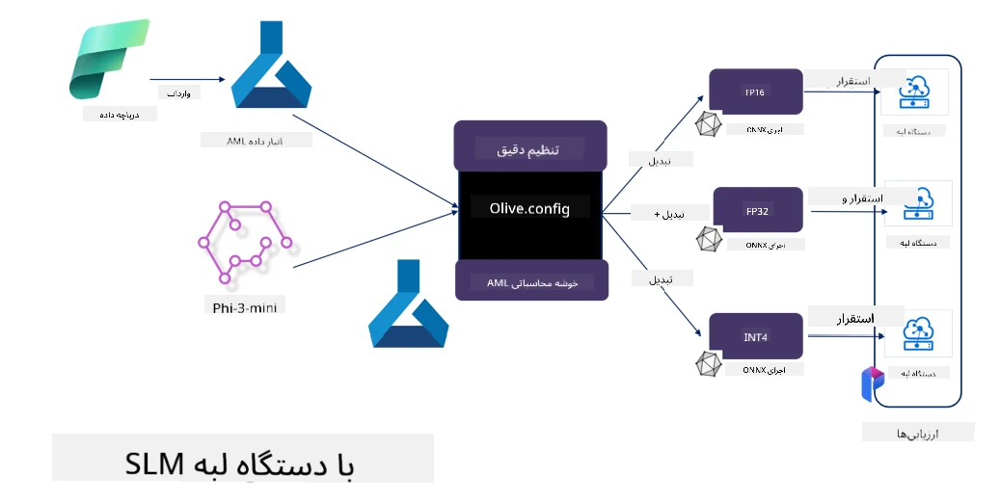

# **تنظیم دقیق Phi-3 با Microsoft Olive**

[Olive](https://github.com/microsoft/OLive?WT.mc_id=aiml-138114-kinfeylo) ابزاری ساده و آگاه به سخت‌افزار برای بهینه‌سازی مدل است که تکنیک‌های پیشرو در صنعت را در زمینه فشرده‌سازی، بهینه‌سازی و کامپایل مدل‌ها گرد هم آورده است.

این ابزار برای ساده‌سازی فرآیند بهینه‌سازی مدل‌های یادگیری ماشین طراحی شده تا اطمینان حاصل شود که مدل‌ها به بهترین شکل ممکن از معماری‌های سخت‌افزاری خاص بهره می‌برند.

چه روی برنامه‌های ابری کار کنید و چه روی دستگاه‌های لبه، Olive به شما امکان می‌دهد مدل‌هایتان را به سادگی و به طور مؤثر بهینه کنید.

## ویژگی‌های کلیدی:
- Olive تکنیک‌های بهینه‌سازی را برای اهداف سخت‌افزاری مورد نظر جمع‌آوری و خودکار می‌کند.
- هیچ تکنیک بهینه‌سازی واحدی برای همه سناریوها مناسب نیست، بنابراین Olive امکان توسعه‌پذیری را فراهم می‌کند تا کارشناسان صنعت بتوانند نوآوری‌های بهینه‌سازی خود را اضافه کنند.

## کاهش تلاش مهندسی:
- توسعه‌دهندگان معمولاً باید چندین زنجیره ابزار خاص فروشنده سخت‌افزار را یاد بگیرند و استفاده کنند تا مدل‌های آموزش‌دیده را برای استقرار آماده و بهینه کنند.
- Olive این تجربه را با خودکارسازی تکنیک‌های بهینه‌سازی برای سخت‌افزار مورد نظر ساده می‌کند.

## راه‌حل بهینه‌سازی انتها به انتها آماده استفاده:

با ترکیب و تنظیم تکنیک‌های یکپارچه، Olive راه‌حلی یکپارچه برای بهینه‌سازی انتها به انتها ارائه می‌دهد.
این ابزار محدودیت‌هایی مانند دقت و تأخیر را در حین بهینه‌سازی مدل‌ها در نظر می‌گیرد.

## استفاده از Microsoft Olive برای تنظیم دقیق

Microsoft Olive ابزاری متن‌باز و بسیار ساده برای بهینه‌سازی مدل است که می‌تواند هم تنظیم دقیق و هم مرجع در حوزه هوش مصنوعی مولد را پوشش دهد. تنها به پیکربندی ساده نیاز دارد و با استفاده از مدل‌های زبان کوچک متن‌باز و محیط‌های اجرایی مرتبط (AzureML / GPU محلی، CPU، DirectML) می‌توانید تنظیم دقیق یا مرجع مدل را از طریق بهینه‌سازی خودکار انجام دهید و بهترین مدل را برای استقرار در ابر یا دستگاه‌های لبه پیدا کنید. این امکان را به شرکت‌ها می‌دهد تا مدل‌های عمودی صنعتی خود را هم در محل و هم در ابر بسازند.


## تنظیم دقیق Phi-3 با Microsoft Olive



## نمونه کد و مثال Phi-3 Olive
در این مثال از Olive استفاده خواهید کرد برای:

- تنظیم دقیق یک آداپتور LoRA برای دسته‌بندی عبارات به چهار دسته غم، شادی، ترس، تعجب.
- ادغام وزن‌های آداپتور در مدل پایه.
- بهینه‌سازی و کمّی‌سازی مدل به int4.

[Sample Code](../../code/03.Finetuning/olive-ort-example/README.md)

### راه‌اندازی Microsoft Olive

نصب Microsoft Olive بسیار ساده است و می‌توان آن را برای CPU، GPU، DirectML و Azure ML نصب کرد.

```bash
pip install olive-ai
```

اگر می‌خواهید مدل ONNX را با CPU اجرا کنید، می‌توانید از این استفاده کنید:

```bash
pip install olive-ai[cpu]
```

اگر می‌خواهید مدل ONNX را با GPU اجرا کنید، می‌توانید از این استفاده کنید:

```python
pip install olive-ai[gpu]
```

اگر می‌خواهید از Azure ML استفاده کنید، از این استفاده کنید:

```python
pip install git+https://github.com/microsoft/Olive#egg=olive-ai[azureml]
```

**توجه**
نیازمندی سیستم عامل: Ubuntu 20.04 / 22.04

### **Config.json مایکروسافت Olive**

پس از نصب، می‌توانید تنظیمات مختلف مربوط به مدل را از طریق فایل Config پیکربندی کنید، از جمله داده‌ها، محاسبات، آموزش، استقرار و تولید مدل.

**1. داده**

در Microsoft Olive، آموزش روی داده‌های محلی و داده‌های ابری پشتیبانی می‌شود و می‌توان آن را در تنظیمات پیکربندی کرد.

*تنظیمات داده محلی*

می‌توانید به سادگی مجموعه داده‌ای که نیاز به آموزش برای تنظیم دقیق دارد را تنظیم کنید، معمولاً در قالب json، و آن را با قالب داده تطبیق دهید. این باید بر اساس نیازهای مدل تنظیم شود (برای مثال، تطبیق با قالب مورد نیاز Microsoft Phi-3-mini. اگر مدل‌های دیگری دارید، لطفاً به قالب‌های تنظیم دقیق مورد نیاز مدل‌های دیگر مراجعه کنید.)

```json

    "data_configs": [
        {
            "name": "dataset_default_train",
            "type": "HuggingfaceContainer",
            "load_dataset_config": {
                "params": {
                    "data_name": "json", 
                    "data_files":"dataset/dataset-classification.json",
                    "split": "train"
                }
            },
            "pre_process_data_config": {
                "params": {
                    "dataset_type": "corpus",
                    "text_cols": [
                            "phrase",
                            "tone"
                    ],
                    "text_template": "### Text: {phrase}\n### The tone is:\n{tone}",
                    "corpus_strategy": "join",
                    "source_max_len": 2048,
                    "pad_to_max_len": false,
                    "use_attention_mask": false
                }
            }
        }
    ],
```

**تنظیمات منبع داده ابری**

با اتصال فروشگاه داده Azure AI Studio / Azure Machine Learning Service برای لینک داده‌های ابری، می‌توانید منابع داده مختلف را از طریق Microsoft Fabric و Azure Data به Azure AI Studio / Azure Machine Learning Service وارد کنید تا به عنوان پشتیبانی برای تنظیم دقیق داده‌ها استفاده شود.

```json

    "data_configs": [
        {
            "name": "dataset_default_train",
            "type": "HuggingfaceContainer",
            "load_dataset_config": {
                "params": {
                    "data_name": "json", 
                    "data_files": {
                        "type": "azureml_datastore",
                        "config": {
                            "azureml_client": {
                                "subscription_id": "Your Azure Subscrition ID",
                                "resource_group": "Your Azure Resource Group",
                                "workspace_name": "Your Azure ML Workspaces name"
                            },
                            "datastore_name": "workspaceblobstore",
                            "relative_path": "Your train_data.json Azure ML Location"
                        }
                    },
                    "split": "train"
                }
            },
            "pre_process_data_config": {
                "params": {
                    "dataset_type": "corpus",
                    "text_cols": [
                            "Question",
                            "Best Answer"
                    ],
                    "text_template": "<|user|>\n{Question}<|end|>\n<|assistant|>\n{Best Answer}\n<|end|>",
                    "corpus_strategy": "join",
                    "source_max_len": 2048,
                    "pad_to_max_len": false,
                    "use_attention_mask": false
                }
            }
        }
    ],
    
```

**2. پیکربندی محاسبات**

اگر نیاز به اجرای محلی دارید، می‌توانید مستقیماً از منابع داده محلی استفاده کنید. اگر می‌خواهید از منابع Azure AI Studio / Azure Machine Learning Service استفاده کنید، باید پارامترهای مرتبط Azure، نام قدرت محاسباتی و غیره را پیکربندی کنید.

```json

    "systems": {
        "aml": {
            "type": "AzureML",
            "config": {
                "accelerators": ["gpu"],
                "hf_token": true,
                "aml_compute": "Your Azure AI Studio / Azure Machine Learning Service Compute Name",
                "aml_docker_config": {
                    "base_image": "Your Azure AI Studio / Azure Machine Learning Service docker",
                    "conda_file_path": "conda.yaml"
                }
            }
        },
        "azure_arc": {
            "type": "AzureML",
            "config": {
                "accelerators": ["gpu"],
                "aml_compute": "Your Azure AI Studio / Azure Machine Learning Service Compute Name",
                "aml_docker_config": {
                    "base_image": "Your Azure AI Studio / Azure Machine Learning Service docker",
                    "conda_file_path": "conda.yaml"
                }
            }
        }
    },
```

***توجه***

از آنجا که اجرای آن از طریق کانتینر در Azure AI Studio / Azure Machine Learning Service انجام می‌شود، محیط مورد نیاز باید پیکربندی شود. این در فایل conda.yaml تنظیم می‌شود.

```yaml

name: project_environment
channels:
  - defaults
dependencies:
  - python=3.8.13
  - pip=22.3.1
  - pip:
      - einops
      - accelerate
      - azure-keyvault-secrets
      - azure-identity
      - bitsandbytes
      - datasets
      - huggingface_hub
      - peft
      - scipy
      - sentencepiece
      - torch>=2.2.0
      - transformers
      - git+https://github.com/microsoft/Olive@jiapli/mlflow_loading_fix#egg=olive-ai[gpu]
      - --extra-index-url https://aiinfra.pkgs.visualstudio.com/PublicPackages/_packaging/ORT-Nightly/pypi/simple/ 
      - ort-nightly-gpu==1.18.0.dev20240307004
      - --extra-index-url https://aiinfra.pkgs.visualstudio.com/PublicPackages/_packaging/onnxruntime-genai/pypi/simple/
      - onnxruntime-genai-cuda

    

```

**3. انتخاب SLM خود**

می‌توانید مدل را مستقیماً از Hugging Face استفاده کنید، یا می‌توانید آن را مستقیماً با کاتالوگ مدل Azure AI Studio / Azure Machine Learning ترکیب کنید تا مدل مورد استفاده را انتخاب کنید. در مثال کد زیر، از Microsoft Phi-3-mini به عنوان نمونه استفاده خواهیم کرد.

اگر مدل را به صورت محلی دارید، می‌توانید از این روش استفاده کنید:

```json

    "input_model":{
        "type": "PyTorchModel",
        "config": {
            "hf_config": {
                "model_name": "model-cache/microsoft/phi-3-mini",
                "task": "text-generation",
                "model_loading_args": {
                    "trust_remote_code": true
                }
            }
        }
    },
```

اگر می‌خواهید از مدلی در Azure AI Studio / Azure Machine Learning Service استفاده کنید، می‌توانید از این روش استفاده کنید:

```json

    "input_model":{
        "type": "PyTorchModel",
        "config": {
            "model_path": {
                "type": "azureml_registry_model",
                "config": {
                    "name": "microsoft/Phi-3-mini-4k-instruct",
                    "registry_name": "azureml-msr",
                    "version": "11"
                }
            },
             "model_file_format": "PyTorch.MLflow",
             "hf_config": {
                "model_name": "microsoft/Phi-3-mini-4k-instruct",
                "task": "text-generation",
                "from_pretrained_args": {
                    "trust_remote_code": true
                }
            }
        }
    },
```

**توجه:**
ما باید با Azure AI Studio / Azure Machine Learning Service یکپارچه شویم، بنابراین هنگام راه‌اندازی مدل، لطفاً به شماره نسخه و نام‌گذاری‌های مرتبط توجه کنید.

تمام مدل‌ها در Azure باید روی PyTorch.MLflow تنظیم شوند.

شما باید حساب Hugging Face داشته باشید و کلید آن را به مقدار کلید Azure AI Studio / Azure Machine Learning متصل کنید.

**4. الگوریتم**

Microsoft Olive الگوریتم‌های تنظیم دقیق Lora و QLora را به خوبی بسته‌بندی کرده است. تنها کاری که باید انجام دهید پیکربندی برخی پارامترهای مرتبط است. در اینجا QLora را به عنوان مثال می‌آورم.

```json
        "lora": {
            "type": "LoRA",
            "config": {
                "target_modules": [
                    "o_proj",
                    "qkv_proj"
                ],
                "double_quant": true,
                "lora_r": 64,
                "lora_alpha": 64,
                "lora_dropout": 0.1,
                "train_data_config": "dataset_default_train",
                "eval_dataset_size": 0.3,
                "training_args": {
                    "seed": 0,
                    "data_seed": 42,
                    "per_device_train_batch_size": 1,
                    "per_device_eval_batch_size": 1,
                    "gradient_accumulation_steps": 4,
                    "gradient_checkpointing": false,
                    "learning_rate": 0.0001,
                    "num_train_epochs": 3,
                    "max_steps": 10,
                    "logging_steps": 10,
                    "evaluation_strategy": "steps",
                    "eval_steps": 187,
                    "group_by_length": true,
                    "adam_beta2": 0.999,
                    "max_grad_norm": 0.3
                }
            }
        },
```

اگر می‌خواهید تبدیل کمّی‌سازی انجام دهید، شاخه اصلی Microsoft Olive در حال حاضر روش onnxruntime-genai را پشتیبانی می‌کند. می‌توانید بر اساس نیاز خود آن را تنظیم کنید:

1. ادغام وزن‌های آداپتور در مدل پایه  
2. تبدیل مدل به مدل onnx با دقت مورد نیاز توسط ModelBuilder

مانند تبدیل به INT4 کمّی‌شده

```json

        "merge_adapter_weights": {
            "type": "MergeAdapterWeights"
        },
        "builder": {
            "type": "ModelBuilder",
            "config": {
                "precision": "int4"
            }
        }
```

**توجه**  
- اگر از QLoRA استفاده می‌کنید، تبدیل کمّی‌سازی ONNXRuntime-genai فعلاً پشتیبانی نمی‌شود.

- لازم به ذکر است که می‌توانید مراحل بالا را بر اساس نیاز خود تنظیم کنید. نیازی نیست همه این مراحل را به طور کامل پیکربندی کنید. بسته به نیازتان می‌توانید مستقیماً از مراحل الگوریتم بدون تنظیم دقیق استفاده کنید. در نهایت باید موتورهای مرتبط را پیکربندی کنید.

```json

    "engine": {
        "log_severity_level": 0,
        "host": "aml",
        "target": "aml",
        "search_strategy": false,
        "execution_providers": ["CUDAExecutionProvider"],
        "cache_dir": "../model-cache/models/phi3-finetuned/cache",
        "output_dir" : "../model-cache/models/phi3-finetuned"
    }
```

**5. پایان تنظیم دقیق**

در خط فرمان، در دایرکتوری olive-config.json اجرا کنید:

```bash
olive run --config olive-config.json  
```

**سلب مسئولیت**:  
این سند با استفاده از سرویس ترجمه هوش مصنوعی [Co-op Translator](https://github.com/Azure/co-op-translator) ترجمه شده است. در حالی که ما در تلاش برای دقت هستیم، لطفاً توجه داشته باشید که ترجمه‌های خودکار ممکن است حاوی خطاها یا نادرستی‌هایی باشند. سند اصلی به زبان بومی خود باید به عنوان منبع معتبر در نظر گرفته شود. برای اطلاعات حیاتی، ترجمه حرفه‌ای انسانی توصیه می‌شود. ما مسئول هیچ گونه سوءتفاهم یا تفسیر نادرستی که از استفاده از این ترجمه ناشی شود، نیستیم.