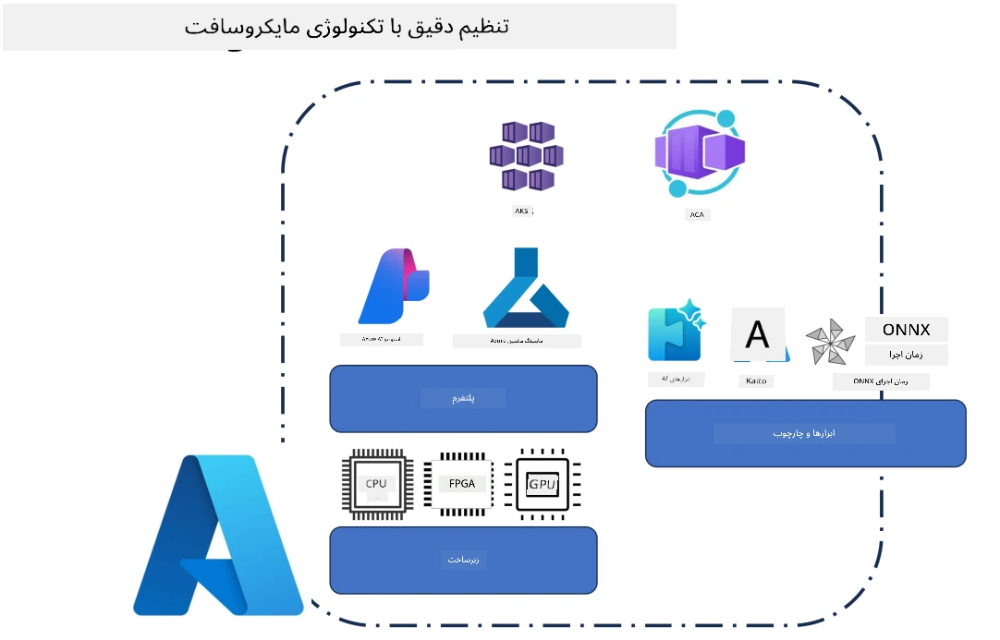
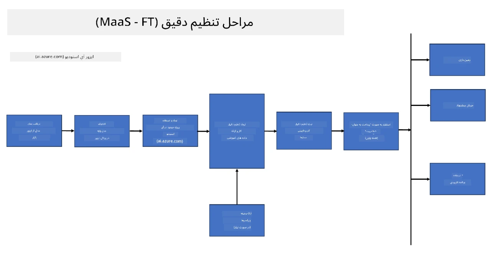
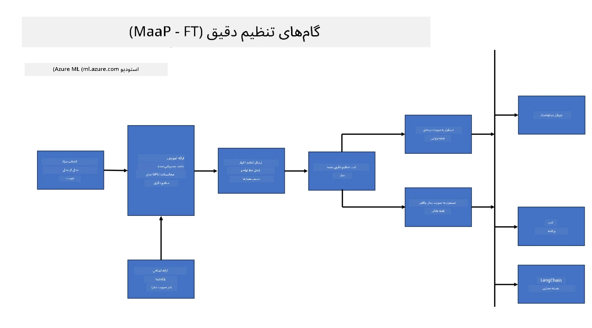
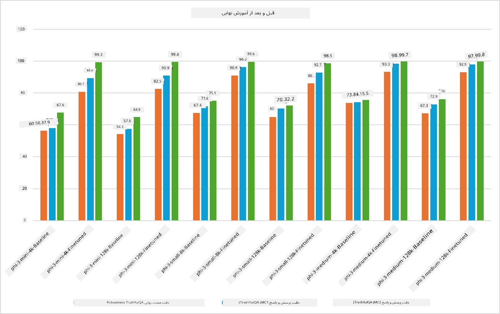

## سناریوهای ریزتنظیم

این بخش نمای کلی از سناریوهای ریزتنظیم در محیط‌های Microsoft Foundry و Azure را ارائه می‌دهد، شامل مدل‌های استقرار، لایه‌های زیرساخت، و تکنیک‌های بهینه‌سازی رایج.

**پلتفرم**  
این شامل سرویس‌های مدیریت شده‌ای مانند Microsoft Foundry (قبلاً Microsoft Foundry) و Azure Machine Learning است که مدیریت مدل، ارکستراسیون، ردیابی آزمایش‌ها و جریان‌های کاری استقرار را فراهم می‌کنند.

**زیرساخت**  
ریزتنظیم به منابع محاسباتی مقیاس‌پذیر نیاز دارد. در محیط‌های آژور، این معمولاً شامل ماشین‌های مجازی مبتنی بر GPU و منابع CPU برای بارهای کاری سبک، همراه با ذخیره‌سازی مقیاس‌پذیر برای داده‌ها و نقاط بررسی است.

**ابزار و چارچوب**  
جریان‌های کاری ریزتنظیم معمولاً به چارچوب‌ها و کتابخانه‌های بهینه‌سازی مانند Hugging Face Transformers، DeepSpeed، و PEFT (ریزتنظیم کارآمد پارامتری) وابسته هستند.

فرآیند ریزتنظیم با فناوری‌های مایکروسافت شامل سرویس‌های پلتفرم، زیرساخت محاسباتی و چارچوب‌های آموزش می‌شود. با درک نحوه کار این اجزا با هم، توسعه‌دهندگان می‌توانند به طور مؤثر مدل‌های پایه را برای وظایف خاص و سناریوهای تولید تطبیق دهند.

## مدل به عنوان سرویس

ریزتنظیم مدل را با استفاده از ریزتنظیم میزبانی شده انجام دهید، بدون نیاز به ایجاد و مدیریت محاسبه.

ریزتنظیم بدون سرور اکنون برای خانواده مدل‌های Phi-3، Phi-3.5، و Phi-4 در دسترس است، که به توسعه‌دهندگان اجازه می‌دهد مدل‌ها را برای سناریوهای ابری و لبه به سرعت و به آسانی سفارشی کنند بدون اینکه نیازی به ترتیب دادن منابع محاسباتی باشد.

## مدل به عنوان پلتفرم

کاربران محاسبات خود را مدیریت می‌کنند تا مدل‌های خود را ریزتنظیم کنند.

[نمونه ریزتنظیم](https://github.com/Azure/azureml-examples/blob/main/sdk/python/foundation-models/system/finetune/chat-completion/chat-completion.ipynb)

## مقایسه تکنیک‌های ریزتنظیم

|سناریو|LoRA|QLoRA|PEFT|DeepSpeed|ZeRO|DoRA|
|---|---|---|---|---|---|---|
|تطبیق LLMهای پیش‌آموزش دیده برای وظایف یا حوزه‌های خاص|بله|بله|بله|بله|بله|بله|
|ریزتنظیم برای وظایف NLP مانند طبقه‌بندی متن، شناسایی نام‌های موجودیت، و ترجمه ماشینی|بله|بله|بله|بله|بله|بله|
|ریزتنظیم برای وظایف پرسش و پاسخ|بله|بله|بله|بله|بله|بله|
|ریزتنظیم برای تولید پاسخ‌های انسانی مانند در چت‌بات‌ها|بله|بله|بله|بله|بله|بله|
|ریزتنظیم برای تولید موسیقی، هنر یا اشکال دیگر خلاقیت|بله|بله|بله|بله|بله|بله|
|کاهش هزینه‌های محاسباتی و مالی|بله|بله|بله|بله|بله|بله|
|کاهش مصرف حافظه|بله|بله|بله|بله|بله|بله|
|استفاده از پارامترهای کمتر برای ریزتنظیم بهینه|بله|بله|بله|خیر|خیر|بله|
|شکل بهینه‌ حافظه از موازی‌سازی داده که اجازه دسترسی به حافظه‌ی مجتمع GPU تمام دستگاه‌های موجود را می‌دهد|خیر|خیر|خیر|بله|بله|خیر|

> [!NOTE]
> LoRA، QLoRA، PEFT، و DoRA روش‌های ریزتنظیم کارآمد پارامتری هستند، در حالی که DeepSpeed و ZeRO بر آموزش توزیع‌شده و بهینه‌سازی حافظه تمرکز دارند.

## مثال‌هایی از عملکرد ریزتنظیم

---

<!-- CO-OP TRANSLATOR DISCLAIMER START -->
**سلب مسئولیت**:  
این سند با استفاده از خدمت ترجمه ماشینی [Co-op Translator](https://github.com/Azure/co-op-translator) ترجمه شده است. در حالی که تلاش ما بر دقت است، لطفاً توجه داشته باشید که ترجمه‌های خودکار ممکن است دارای خطا یا نواقص باشند. سند اصلی به زبان بومی خود به عنوان منبع معتبر در نظر گرفته شود. برای اطلاعات حیاتی، ترجمه حرفه‌ای انسانی توصیه می‌شود. ما مسئولیتی در قبال هرگونه سوءتفاهم یا برداشت نادرست ناشی از استفاده از این ترجمه نداریم.
<!-- CO-OP TRANSLATOR DISCLAIMER END -->