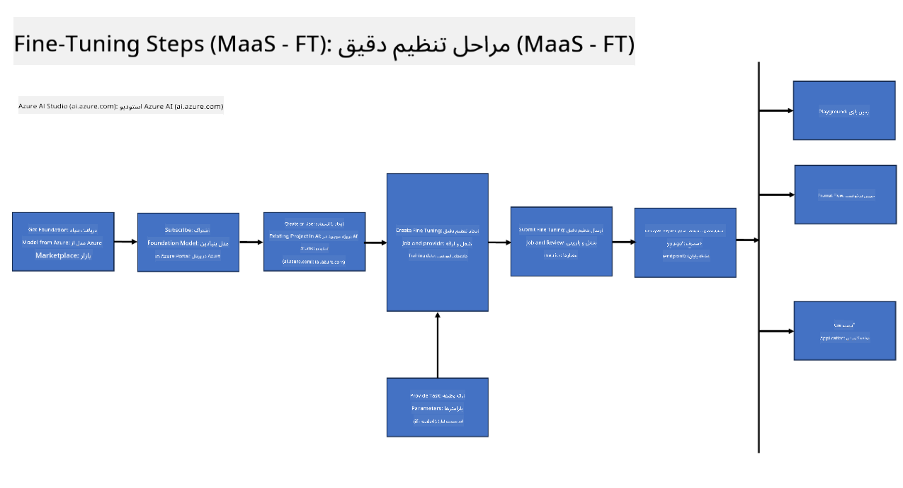
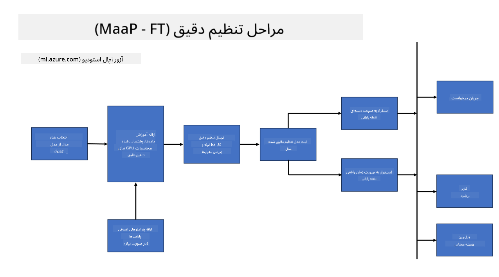
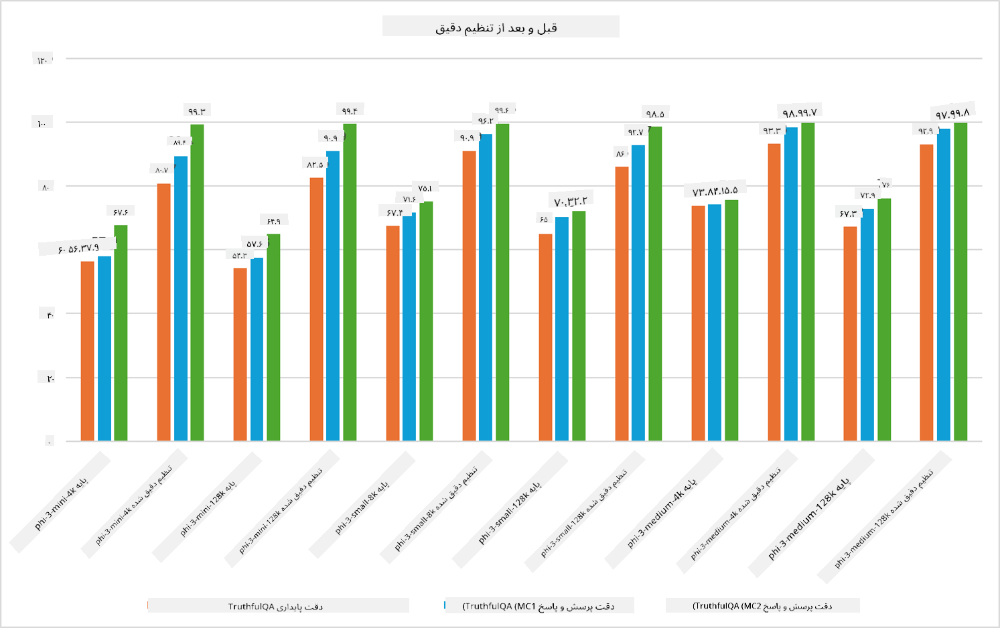

<!--
CO_OP_TRANSLATOR_METADATA:
{
  "original_hash": "cb5648935f63edc17e95ce38f23adc32",
  "translation_date": "2025-07-17T08:22:56+00:00",
  "source_file": "md/03.FineTuning/FineTuning_Scenarios.md",
  "language_code": "fa"
}
-->
## سناریوهای تنظیم دقیق

**پلتفرم** این شامل فناوری‌های مختلفی مانند Azure AI Foundry، Azure Machine Learning، AI Tools، Kaito و ONNX Runtime است.

**زیرساخت** این شامل CPU و FPGA است که برای فرآیند تنظیم دقیق ضروری هستند. اجازه دهید آیکون‌های هر یک از این فناوری‌ها را به شما نشان دهم.

**ابزارها و چارچوب‌ها** این شامل ONNX Runtime و ONNX Runtime است. اجازه دهید آیکون‌های هر یک از این فناوری‌ها را به شما نشان دهم.  
[آیکون‌های ONNX Runtime و ONNX Runtime را وارد کنید]

فرآیند تنظیم دقیق با فناوری‌های مایکروسافت شامل اجزا و ابزارهای مختلفی است. با درک و استفاده از این فناوری‌ها، می‌توانیم برنامه‌های خود را به‌طور مؤثر تنظیم دقیق کنیم و راه‌حل‌های بهتری ایجاد کنیم.

## مدل به عنوان سرویس

مدل را با استفاده از تنظیم دقیق میزبانی شده، بدون نیاز به ایجاد و مدیریت محاسبات، تنظیم دقیق کنید.

تنظیم دقیق بدون سرور برای مدل‌های Phi-3-mini و Phi-3-medium در دسترس است که به توسعه‌دهندگان امکان می‌دهد به سرعت و به آسانی مدل‌ها را برای سناریوهای ابری و لبه‌ای سفارشی کنند بدون اینکه نیاز به ترتیب دادن محاسبات باشد. همچنین اعلام کرده‌ایم که Phi-3-small اکنون از طریق سرویس Models-as-a-Service ما در دسترس است تا توسعه‌دهندگان بتوانند به سرعت و به آسانی توسعه هوش مصنوعی را بدون نیاز به مدیریت زیرساخت‌های پایه آغاز کنند.

## مدل به عنوان پلتفرم

کاربران محاسبات خود را مدیریت می‌کنند تا مدل‌های خود را تنظیم دقیق کنند.

[نمونه تنظیم دقیق](https://github.com/Azure/azureml-examples/blob/main/sdk/python/foundation-models/system/finetune/chat-completion/chat-completion.ipynb)

## سناریوهای تنظیم دقیق

| | | | | | | |
|-|-|-|-|-|-|-|
|سناریو|LoRA|QLoRA|PEFT|DeepSpeed|ZeRO|DORA|
|سفارشی‌سازی مدل‌های پیش‌آموزش‌دیده بزرگ برای وظایف یا حوزه‌های خاص|بله|بله|بله|بله|بله|بله|
|تنظیم دقیق برای وظایف پردازش زبان طبیعی مانند طبقه‌بندی متن، شناسایی موجودیت‌های نام‌دار و ترجمه ماشینی|بله|بله|بله|بله|بله|بله|
|تنظیم دقیق برای وظایف پرسش و پاسخ|بله|بله|بله|بله|بله|بله|
|تنظیم دقیق برای تولید پاسخ‌های شبیه انسان در چت‌بات‌ها|بله|بله|بله|بله|بله|بله|
|تنظیم دقیق برای تولید موسیقی، هنر یا سایر اشکال خلاقیت|بله|بله|بله|بله|بله|بله|
|کاهش هزینه‌های محاسباتی و مالی|بله|بله|خیر|بله|بله|خیر|
|کاهش مصرف حافظه|خیر|بله|خیر|بله|بله|بله|
|استفاده از پارامترهای کمتر برای تنظیم دقیق کارآمد|خیر|بله|بله|خیر|خیر|بله|
|شکل حافظه‌کارآمد موازی‌سازی داده که دسترسی به حافظه کل GPUهای موجود را فراهم می‌کند|خیر|خیر|خیر|بله|بله|بله|

## نمونه‌های عملکرد تنظیم دقیق

**سلب مسئولیت**:  
این سند با استفاده از سرویس ترجمه هوش مصنوعی [Co-op Translator](https://github.com/Azure/co-op-translator) ترجمه شده است. در حالی که ما در تلاش برای دقت هستیم، لطفاً توجه داشته باشید که ترجمه‌های خودکار ممکن است حاوی خطاها یا نادرستی‌هایی باشند. سند اصلی به زبان بومی خود باید به عنوان منبع معتبر در نظر گرفته شود. برای اطلاعات حیاتی، ترجمه حرفه‌ای انسانی توصیه می‌شود. ما مسئول هیچ گونه سوءتفاهم یا تفسیر نادرستی که از استفاده از این ترجمه ناشی شود، نیستیم.