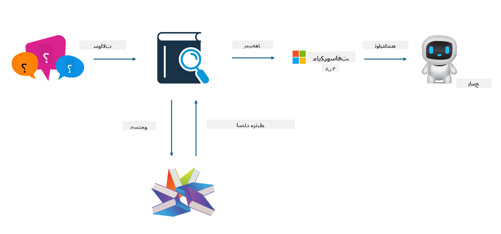

<!--
CO_OP_TRANSLATOR_METADATA:
{
  "original_hash": "e4e010400c2918557b36bb932a14004c",
  "translation_date": "2025-05-07T13:32:37+00:00",
  "source_file": "md/03.FineTuning/FineTuning_vs_RAG.md",
  "language_code": "fa"
}
-->
## تنظیم دقیق در مقابل RAG

## تولید افزوده شده با بازیابی

RAG ترکیبی از بازیابی داده‌ها و تولید متن است. داده‌های ساختاریافته و بدون ساختار سازمان در پایگاه داده برداری ذخیره می‌شوند. هنگام جستجوی محتوای مرتبط، خلاصه و محتوای مرتبط پیدا شده تا یک زمینه شکل بگیرد و قابلیت تکمیل متن مدل‌های LLM/SLM برای تولید محتوا به کار گرفته می‌شود.

## فرآیند RAG

## تنظیم دقیق
تنظیم دقیق بر بهبود یک مدل خاص تمرکز دارد. نیازی نیست از الگوریتم مدل شروع شود، اما داده‌ها باید به طور مداوم جمع‌آوری شوند. اگر به اصطلاحات و بیان زبانی دقیق‌تر در کاربردهای صنعتی نیاز دارید، تنظیم دقیق انتخاب بهتری است. اما اگر داده‌های شما به‌طور مکرر تغییر می‌کنند، تنظیم دقیق می‌تواند پیچیده شود.

## چگونه انتخاب کنیم
اگر پاسخ ما نیاز به معرفی داده‌های خارجی دارد، RAG بهترین انتخاب است.

اگر نیاز به خروجی دانش صنعتی پایدار و دقیق دارید، تنظیم دقیق گزینه مناسبی است. RAG اولویت را به کشیدن محتوای مرتبط می‌دهد اما ممکن است همیشه جزئیات تخصصی را به درستی ارائه نکند.

تنظیم دقیق نیاز به مجموعه داده با کیفیت بالا دارد و اگر فقط داده‌های محدودی باشد، تفاوت زیادی ایجاد نمی‌کند. RAG انعطاف‌پذیرتر است.  
تنظیم دقیق یک جعبه سیاه است، یک امر متافیزیکی و درک مکانیزم داخلی آن دشوار است. اما RAG می‌تواند منبع داده‌ها را راحت‌تر پیدا کند و به این ترتیب توهمات یا خطاهای محتوا را به طور مؤثری تنظیم کرده و شفافیت بهتری ارائه دهد.

**سلب مسئولیت**:  
این سند با استفاده از سرویس ترجمه هوش مصنوعی [Co-op Translator](https://github.com/Azure/co-op-translator) ترجمه شده است. در حالی که ما در تلاش برای دقت هستیم، لطفاً توجه داشته باشید که ترجمه‌های خودکار ممکن است حاوی خطاها یا نادرستی‌هایی باشند. سند اصلی به زبان مادری آن باید به عنوان منبع معتبر در نظر گرفته شود. برای اطلاعات حیاتی، ترجمه حرفه‌ای انسانی توصیه می‌شود. ما مسئول هیچ گونه سوءتفاهم یا تفسیر نادرستی که ناشی از استفاده از این ترجمه باشد، نیستیم.