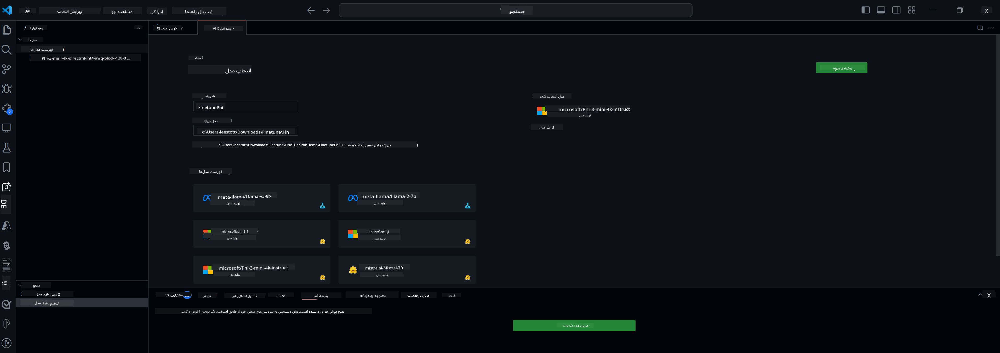

<!--
CO_OP_TRANSLATOR_METADATA:
{
  "original_hash": "c2bc0950f44919ac75a88c1a871680c2",
  "translation_date": "2025-05-07T13:27:04+00:00",
  "source_file": "md/03.FineTuning/Finetuning_VSCodeaitoolkit.md",
  "language_code": "fa"
}
-->
## خوش‌آمدید به AI Toolkit برای VS Code

[AI Toolkit برای VS Code](https://github.com/microsoft/vscode-ai-toolkit/tree/main) مجموعه‌ای از مدل‌های مختلف از Azure AI Studio Catalog و کاتالوگ‌های دیگر مانند Hugging Face را گرد هم آورده است. این کیت ابزار، کارهای رایج توسعه برای ساخت اپلیکیشن‌های هوش مصنوعی با استفاده از ابزارها و مدل‌های تولیدی AI را ساده می‌کند از طریق:
- شروع کار با کشف مدل و محیط آزمایشی.
- تنظیم دقیق مدل و استنتاج با استفاده از منابع محاسباتی محلی.
- تنظیم دقیق و استنتاج از راه دور با استفاده از منابع Azure

[نصب AI Toolkit برای VSCode](https://marketplace.visualstudio.com/items?itemName=ms-windows-ai-studio.windows-ai-studio)




**[Private Preview]** تهیه یک‌کلیکی Azure Container Apps برای اجرای تنظیم دقیق مدل و استنتاج در فضای ابری.

حالا بیایید به توسعه اپلیکیشن هوش مصنوعی شما بپردازیم:

- [خوش‌آمدید به AI Toolkit برای VS Code](../../../../md/03.FineTuning)
- [توسعه محلی](../../../../md/03.FineTuning)
  - [آمادگی‌ها](../../../../md/03.FineTuning)
  - [فعال‌سازی Conda](../../../../md/03.FineTuning)
  - [تنظیم دقیق فقط مدل پایه](../../../../md/03.FineTuning)
  - [تنظیم دقیق مدل و استنتاج](../../../../md/03.FineTuning)
  - [تنظیم دقیق مدل](../../../../md/03.FineTuning)
  - [Microsoft Olive](../../../../md/03.FineTuning)
  - [نمونه‌ها و منابع تنظیم دقیق](../../../../md/03.FineTuning)
- [**\[Private Preview\]** توسعه از راه دور](../../../../md/03.FineTuning)
  - [پیش‌نیازها](../../../../md/03.FineTuning)
  - [راه‌اندازی پروژه توسعه از راه دور](../../../../md/03.FineTuning)
  - [تهیه منابع Azure](../../../../md/03.FineTuning)
  - [\[اختیاری\] افزودن توکن Huggingface به راز Azure Container App](../../../../md/03.FineTuning)
  - [اجرای تنظیم دقیق](../../../../md/03.FineTuning)
  - [تهیه نقطه پایانی استنتاج](../../../../md/03.FineTuning)
  - [استقرار نقطه پایانی استنتاج](../../../../md/03.FineTuning)
  - [کاربرد پیشرفته](../../../../md/03.FineTuning)

## توسعه محلی
### آمادگی‌ها

1. مطمئن شوید درایور NVIDIA روی میزبان نصب شده است.
2. اگر از HF برای استفاده از دیتاست استفاده می‌کنید، `huggingface-cli login` را اجرا کنید.
3. توضیحات کلیدی `Olive` برای هر چیزی که مصرف حافظه را تغییر می‌دهد.

### فعال‌سازی Conda
از آنجا که ما از محیط WSL استفاده می‌کنیم و این محیط مشترک است، باید به صورت دستی محیط conda را فعال کنید. پس از این مرحله می‌توانید تنظیم دقیق یا استنتاج را اجرا کنید.

```bash
conda activate [conda-env-name] 
```

### فقط تنظیم دقیق مدل پایه
برای اینکه فقط مدل پایه را بدون تنظیم دقیق امتحان کنید، پس از فعال‌سازی conda می‌توانید این دستور را اجرا کنید.

```bash
cd inference

# Web browser interface allows to adjust a few parameters like max new token length, temperature and so on.
# User has to manually open the link (e.g. http://0.0.0.0:7860) in a browser after gradio initiates the connections.
python gradio_chat.py --baseonly
```

### تنظیم دقیق مدل و استنتاج

وقتی فضای کاری در یک کانتینر توسعه باز شد، یک ترمینال باز کنید (مسیر پیش‌فرض ریشه پروژه است)، سپس دستور زیر را برای تنظیم دقیق یک LLM روی دیتاست انتخاب شده اجرا کنید.

```bash
python finetuning/invoke_olive.py 
```

نقاط بررسی و مدل نهایی در `models` folder.

Next run inferencing with the fune-tuned model through chats in a `console`, `web browser` or `prompt flow` ذخیره خواهند شد.

```bash
cd inference

# Console interface.
python console_chat.py

# Web browser interface allows to adjust a few parameters like max new token length, temperature and so on.
# User has to manually open the link (e.g. http://127.0.0.1:7860) in a browser after gradio initiates the connections.
python gradio_chat.py
```

برای استفاده از `prompt flow` in VS Code, please refer to this [Quick Start](https://microsoft.github.io/promptflow/how-to-guides/quick-start.html).

### Model Fine-tuning

Next, download the following model depending on the availability of a GPU on your device.

To initiate the local fine-tuning session using QLoRA, select a model you want to fine-tune from our catalog.
| Platform(s) | GPU available | Model name | Size (GB) |
|---------|---------|--------|--------|
| Windows | Yes | Phi-3-mini-4k-**directml**-int4-awq-block-128-onnx | 2.13GB |
| Linux | Yes | Phi-3-mini-4k-**cuda**-int4-onnx | 2.30GB |
| Windows<br>Linux | No | Phi-3-mini-4k-**cpu**-int4-rtn-block-32-acc-level-4-onnx | 2.72GB |

**_Note_** You do not need an Azure Account to download the models

The Phi3-mini (int4) model is approximately 2GB-3GB in size. Depending on your network speed, it could take a few minutes to download.

Start by selecting a project name and location.
Next, select a model from the model catalog. You will be prompted to download the project template. You can then click "Configure Project" to adjust various settings.

### Microsoft Olive 

We use [Olive](https://microsoft.github.io/Olive/why-olive.html) to run QLoRA fine-tuning on a PyTorch model from our catalog. All of the settings are preset with the default values to optimize to run the fine-tuning process locally with optimized use of memory, but it can be adjusted for your scenario.

### Fine Tuning Samples and Resoures

- [Fine tuning Getting Started Guide](https://learn.microsoft.com/windows/ai/toolkit/toolkit-fine-tune)
- [Fine tuning with a HuggingFace Dataset](https://github.com/microsoft/vscode-ai-toolkit/blob/main/archive/walkthrough-hf-dataset.md)
- [Fine tuning with Simple DataSet](https://github.com/microsoft/vscode-ai-toolkit/blob/main/archive/walkthrough-simple-dataset.md)

## **[Private Preview]** Remote Development

### Prerequisites

1. To run the model fine-tuning in your remote Azure Container App Environment, make sure your subscription has enough GPU capacity. Submit a [support ticket](https://azure.microsoft.com/support/create-ticket/) to request the required capacity for your application. [Get More Info about GPU capacity](https://learn.microsoft.com/azure/container-apps/workload-profiles-overview)
2. If you are using private dataset on HuggingFace, make sure you have a [HuggingFace account](https://huggingface.co/?WT.mc_id=aiml-137032-kinfeylo) and [generate an access token](https://huggingface.co/docs/hub/security-tokens?WT.mc_id=aiml-137032-kinfeylo)
3. Enable Remote Fine-tuning and Inference feature flag in the AI Toolkit for VS Code
   1. Open the VS Code Settings by selecting *File -> Preferences -> Settings*.
   2. Navigate to *Extensions* and select *AI Toolkit*.
   3. Select the *"Enable Remote Fine-tuning And Inference"* option.
   4. Reload VS Code to take effect.

- [Remote Fine tuning](https://github.com/microsoft/vscode-ai-toolkit/blob/main/archive/remote-finetuning.md)

### Setting Up a Remote Development Project
1. Execute the command palette `AI Toolkit: Focus on Resource View`.
2. Navigate to *Model Fine-tuning* to access the model catalog. Assign a name to your project and select its location on your machine. Then, hit the *"Configure Project"* button.
3. Project Configuration
    1. Avoid enabling the *"Fine-tune locally"* option.
    2. The Olive configuration settings will appear with pre-set default values. Please adjust and fill in these configurations as required.
    3. Move on to *Generate Project*. This stage leverages WSL and involves setting up a new Conda environment, preparing for future updates that include Dev Containers.
4. Click on *"Relaunch Window In Workspace"* to open your remote development project.

> **Note:** The project currently works either locally or remotely within the AI Toolkit for VS Code. If you choose *"Fine-tune locally"* during project creation, it will operate exclusively in WSL without remote development capabilities. On the other hand, if you forego enabling *"Fine-tune locally"*, the project will be restricted to the remote Azure Container App environment.

### Provision Azure Resources
To get started, you need to provision the Azure Resource for remote fine-tuning. Do this by running the `AI Toolkit: Provision Azure Container Apps job for fine-tuning` from the command palette.

Monitor the progress of the provision through the link displayed in the output channel.

### [Optional] Add Huggingface Token to the Azure Container App Secret
If you're using private HuggingFace dataset, set your HuggingFace token as an environment variable to avoid the need for manual login on the Hugging Face Hub.
You can do this using the `AI Toolkit: Add Azure Container Apps Job secret for fine-tuning command`. With this command, you can set the secret name as [`HF_TOKEN`](https://huggingface.co/docs/huggingface_hub/package_reference/environment_variables#hftoken) and use your Hugging Face token as the secret value.

### Run Fine-tuning
To start the remote fine-tuning job, execute the `AI Toolkit: Run fine-tuning` command.

To view the system and console logs, you can visit the Azure portal using the link in the output panel (more steps at [View and Query Logs on Azure](https://aka.ms/ai-toolkit/remote-provision#view-and-query-logs-on-azure)). Or, you can view the console logs directly in the VSCode output panel by running the command `AI Toolkit: Show the running fine-tuning job streaming logs`. 
> **Note:** The job might be queued due to insufficient resources. If the log is not displayed, execute the `AI Toolkit: Show the running fine-tuning job streaming logs` command, wait for a while and then execute the command again to re-connect to the streaming log.

During this process, QLoRA will be used for fine-tuning, and will create LoRA adapters for the model to use during inference.
The results of the fine-tuning will be stored in the Azure Files.

### Provision Inference Endpoint
After the adapters are trained in the remote environment, use a simple Gradio application to interact with the model.
Similar to the fine-tuning process, you need to set up the Azure Resources for remote inference by executing the `AI Toolkit: Provision Azure Container Apps for inference` from the command palette.

By default, the subscription and the resource group for inference should match those used for fine-tuning. The inference will use the same Azure Container App Environment and access the model and model adapter stored in Azure Files, which were generated during the fine-tuning step. 


### Deploy the Inference Endpoint
If you wish to revise the inference code or reload the inference model, please execute the `AI Toolkit: Deploy for inference` command. This will synchronize your latest code with Azure Container App and restart the replica.  

Once deployment is successfully completed, you can access the inference API by clicking on the "*Go to Inference Endpoint*" button displayed in the VSCode notification. Or, the web API endpoint can be found under `ACA_APP_ENDPOINT` in `./infra/inference.config.json` و در پنل خروجی. اکنون آماده هستید تا مدل را با استفاده از این نقطه پایانی ارزیابی کنید.

### کاربرد پیشرفته
برای اطلاعات بیشتر درباره توسعه از راه دور با AI Toolkit، به مستندات [تنظیم دقیق مدل‌ها از راه دور](https://aka.ms/ai-toolkit/remote-provision) و [استنتاج با مدل تنظیم دقیق شده](https://aka.ms/ai-toolkit/remote-inference) مراجعه کنید.

**سلب مسئولیت**:  
این سند با استفاده از سرویس ترجمه هوش مصنوعی [Co-op Translator](https://github.com/Azure/co-op-translator) ترجمه شده است. در حالی که ما در تلاش برای دقت هستیم، لطفاً توجه داشته باشید که ترجمه‌های خودکار ممکن است حاوی اشتباهات یا نواقصی باشند. سند اصلی به زبان مادری آن باید به عنوان منبع معتبر در نظر گرفته شود. برای اطلاعات حیاتی، ترجمه حرفه‌ای انسانی توصیه می‌شود. ما مسئول هیچ گونه سوء تفاهم یا تفسیر نادرست ناشی از استفاده از این ترجمه نیستیم.