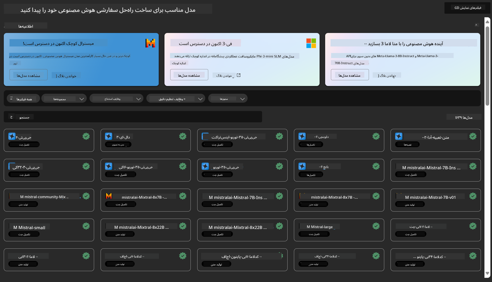

<!--
CO_OP_TRANSLATOR_METADATA:
{
  "original_hash": "7fe541373802e33568e94e13226d463c",
  "translation_date": "2025-05-07T13:31:03+00:00",
  "source_file": "md/03.FineTuning/Introduce_AzureML.md",
  "language_code": "fa"
}
-->
# **معرفی سرویس Azure Machine Learning**

[Azure Machine Learning](https://ml.azure.com?WT.mc_id=aiml-138114-kinfeylo) یک سرویس ابری برای تسریع و مدیریت چرخه عمر پروژه‌های یادگیری ماشین (ML) است.

متخصصان ML، دانشمندان داده و مهندسان می‌توانند در جریان کار روزمره خود از آن استفاده کنند تا:

- مدل‌ها را آموزش دهند و مستقر کنند.
- عملیات یادگیری ماشین (MLOps) را مدیریت کنند.
- می‌توانید یک مدل را در Azure Machine Learning ایجاد کنید یا از مدلی استفاده کنید که از یک پلتفرم متن‌باز مانند PyTorch، TensorFlow یا scikit-learn ساخته شده است.
- ابزارهای MLOps به شما کمک می‌کنند مدل‌ها را نظارت، دوباره آموزش و مجدداً مستقر کنید.

## Azure Machine Learning برای چه کسانی است؟

**دانشمندان داده و مهندسان ML**

آنها می‌توانند از ابزارها برای تسریع و خودکارسازی جریان کار روزانه خود استفاده کنند.
Azure ML امکاناتی برای عدالت، قابلیت توضیح، ردیابی و حسابرسی فراهم می‌کند.

**توسعه‌دهندگان برنامه**

آنها می‌توانند مدل‌ها را به راحتی در برنامه‌ها یا خدمات یکپارچه کنند.

**توسعه‌دهندگان پلتفرم**

آنها به مجموعه‌ای قوی از ابزارها دسترسی دارند که توسط APIهای پایدار Azure Resource Manager پشتیبانی می‌شوند.
این ابزارها امکان ساخت ابزارهای پیشرفته ML را فراهم می‌کنند.

**سازمان‌ها**

با کار در فضای ابری Microsoft Azure، سازمان‌ها از امنیت آشنا و کنترل دسترسی مبتنی بر نقش بهره‌مند می‌شوند.
می‌توانند پروژه‌ها را تنظیم کنند تا دسترسی به داده‌های محافظت‌شده و عملیات خاص کنترل شود.

## بهره‌وری برای همه اعضای تیم

پروژه‌های ML معمولاً به تیمی با مهارت‌های متنوع برای ساخت و نگهداری نیاز دارند.

Azure ML ابزارهایی ارائه می‌دهد که به شما امکان می‌دهد:
- از طریق دفترچه‌های مشترک، منابع محاسباتی، محاسبات بدون سرور، داده‌ها و محیط‌ها با تیم خود همکاری کنید.
- مدل‌هایی با عدالت، قابلیت توضیح، ردیابی و حسابرسی توسعه دهید تا نیازهای ردیابی و تطابق حسابرسی را برآورده کنید.
- مدل‌های ML را سریع و آسان در مقیاس مستقر کنید و با MLOps آنها را به طور مؤثر مدیریت و کنترل کنید.
- بارهای کاری یادگیری ماشین را در هر مکان با حاکمیت، امنیت و تطابق تعبیه‌شده اجرا کنید.

## ابزارهای پلتفرم چندسکویی

هرکسی در تیم ML می‌تواند از ابزارهای مورد علاقه خود برای انجام کار استفاده کند.
چه در حال اجرای آزمایش‌های سریع، تنظیم ابرپارامترها، ساخت خطوط لوله یا مدیریت استنتاج‌ها باشید، می‌توانید از رابط‌های آشنا از جمله:
- Azure Machine Learning Studio
- Python SDK (v2)
- Azure CLI (v2)
- Azure Resource Manager REST APIs

استفاده کنید.

در حین بهینه‌سازی مدل‌ها و همکاری در طول چرخه توسعه، می‌توانید دارایی‌ها، منابع و معیارها را در رابط کاربری Azure Machine Learning studio به اشتراک بگذارید و پیدا کنید.

## **LLM/SLM در Azure ML**

Azure ML عملکردهای متعددی مرتبط با LLM/SLM را اضافه کرده است و LLMOps و SLMOps را ترکیب کرده تا یک پلتفرم فناوری هوش مصنوعی مولد سازمانی ایجاد کند.

### **کتابخانه مدل**

کاربران سازمانی می‌توانند مدل‌های مختلف را بر اساس سناریوهای کسب‌وکار مختلف از طریق کتابخانه مدل مستقر کنند و خدماتی به صورت Model as Service برای توسعه‌دهندگان یا کاربران سازمانی فراهم کنند.

کتابخانه مدل در Azure Machine Learning studio مرکز کشف و استفاده از طیف گسترده‌ای از مدل‌ها است که به شما امکان ساخت برنامه‌های هوش مصنوعی مولد را می‌دهد. این کتابخانه شامل صدها مدل از ارائه‌دهندگان مدل مانند Azure OpenAI service، Mistral، Meta، Cohere، Nvidia، Hugging Face و مدل‌هایی است که توسط مایکروسافت آموزش داده شده‌اند. مدل‌های ارائه‌دهندگان غیر از مایکروسافت، محصولات غیرمایکروسافتی هستند که مطابق با شرایط محصول مایکروسافت تعریف شده و تابع شرایط ارائه‌شده همراه مدل می‌باشند.

### **خط لوله کاری**

هسته یک خط لوله یادگیری ماشین تقسیم یک کار کامل یادگیری ماشین به یک جریان کاری چند مرحله‌ای است. هر مرحله یک مؤلفه قابل مدیریت است که می‌توان آن را به صورت جداگانه توسعه، بهینه‌سازی، پیکربندی و خودکار کرد. مراحل از طریق رابط‌های تعریف‌شده به هم متصل می‌شوند. سرویس خط لوله Azure Machine Learning به صورت خودکار تمام وابستگی‌های بین مراحل خط لوله را هماهنگ می‌کند.

در تنظیم دقیق SLM / LLM، می‌توانیم فرآیندهای داده، آموزش و تولید خود را از طریق خط لوله مدیریت کنیم.

### **Prompt flow**

مزایای استفاده از Azure Machine Learning prompt flow  
Azure Machine Learning prompt flow مجموعه‌ای از مزایا را ارائه می‌دهد که به کاربران کمک می‌کند از ایده‌پردازی به آزمایش و در نهایت به برنامه‌های آماده تولید مبتنی بر LLM منتقل شوند:

**چابکی مهندسی پرامپت**

تجربه نویسندگی تعاملی: Azure Machine Learning prompt flow نمایش بصری ساختار جریان را فراهم می‌کند که به کاربران امکان می‌دهد پروژه‌های خود را به راحتی درک و پیمایش کنند. همچنین تجربه کدنویسی مشابه دفترچه یادداشت را برای توسعه و اشکال‌زدایی مؤثر جریان ارائه می‌دهد.  
تنوع در تنظیم پرامپت: کاربران می‌توانند چندین نسخه مختلف پرامپت ایجاد و مقایسه کنند که فرآیند اصلاح تکراری را تسهیل می‌کند.

ارزیابی: جریان‌های ارزیابی تعبیه‌شده به کاربران امکان می‌دهد کیفیت و اثربخشی پرامپت‌ها و جریان‌ها را بسنجند.

منابع جامع: Azure Machine Learning prompt flow شامل کتابخانه‌ای از ابزارها، نمونه‌ها و قالب‌های داخلی است که به عنوان نقطه شروع توسعه عمل می‌کنند، خلاقیت را تحریک و فرآیند را تسریع می‌کنند.

**آمادگی سازمانی برای برنامه‌های مبتنی بر LLM**

همکاری: Azure Machine Learning prompt flow از همکاری تیمی پشتیبانی می‌کند و به چندین کاربر اجازه می‌دهد روی پروژه‌های مهندسی پرامپت به صورت مشترک کار کنند، دانش را به اشتراک بگذارند و کنترل نسخه را حفظ کنند.

پلتفرم همه‌کاره: Azure Machine Learning prompt flow کل فرآیند مهندسی پرامپت را از توسعه و ارزیابی تا استقرار و نظارت ساده می‌کند. کاربران می‌توانند جریان‌های خود را به راحتی به عنوان نقاط انتهایی Azure Machine Learning مستقر کنند و عملکرد آنها را به صورت زنده نظارت کنند تا عملکرد بهینه و بهبود مستمر تضمین شود.

راهکارهای آمادگی سازمانی Azure Machine Learning: prompt flow از راهکارهای قوی آمادگی سازمانی Azure Machine Learning بهره می‌برد و پایه‌ای امن، مقیاس‌پذیر و قابل اعتماد برای توسعه، آزمایش و استقرار جریان‌ها فراهم می‌کند.

با Azure Machine Learning prompt flow، کاربران می‌توانند چابکی مهندسی پرامپت خود را آزاد کنند، به طور مؤثر همکاری کنند و از راهکارهای سازمانی درجه یک برای توسعه و استقرار موفق برنامه‌های مبتنی بر LLM بهره‌مند شوند.

با ترکیب قدرت محاسباتی، داده‌ها و اجزای مختلف Azure ML، توسعه‌دهندگان سازمانی می‌توانند به راحتی برنامه‌های هوش مصنوعی خود را بسازند.

**سلب مسئولیت**:  
این سند با استفاده از سرویس ترجمه ماشینی هوش مصنوعی [Co-op Translator](https://github.com/Azure/co-op-translator) ترجمه شده است. در حالی که ما در تلاش برای دقت هستیم، لطفاً توجه داشته باشید که ترجمه‌های خودکار ممکن است حاوی خطاها یا نادرستی‌هایی باشند. سند اصلی به زبان مادری خود باید به عنوان منبع معتبر در نظر گرفته شود. برای اطلاعات حیاتی، استفاده از ترجمه حرفه‌ای انسانی توصیه می‌شود. ما مسئول هیچ گونه سوءتفاهم یا برداشت نادرستی که از استفاده از این ترجمه ناشی شود، نیستیم.