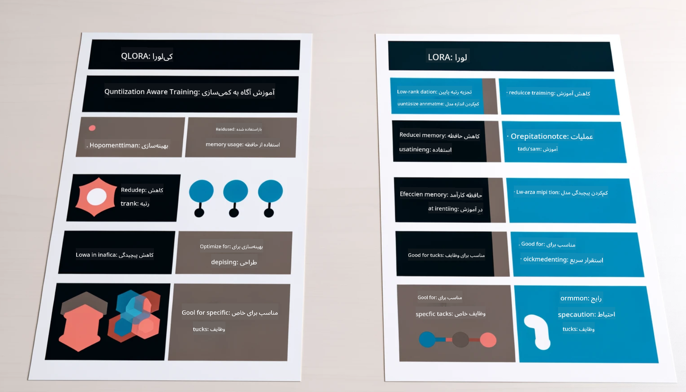

<!--
CO_OP_TRANSLATOR_METADATA:
{
  "original_hash": "743d7e9cb9c4e8ea642d77bee657a7fa",
  "translation_date": "2025-05-07T13:33:13+00:00",
  "source_file": "md/03.FineTuning/LetPhi3gotoIndustriy.md",
  "language_code": "fa"
}
-->
# **اجازه دهید Phi-3 به یک متخصص صنعتی تبدیل شود**

برای به‌کارگیری مدل Phi-3 در یک صنعت، باید داده‌های کسب‌وکار صنعتی را به مدل Phi-3 اضافه کنید. ما دو گزینه متفاوت داریم، اولی RAG (تولید تقویت‌شده با بازیابی) و دومی Fine Tuning (تنظیم دقیق).

## **RAG در مقابل Fine-Tuning**

### **تولید تقویت‌شده با بازیابی**

RAG ترکیبی از بازیابی داده و تولید متن است. داده‌های ساختاریافته و غیرساختاریافته سازمان در پایگاه داده برداری ذخیره می‌شوند. هنگام جستجوی محتوای مرتبط، خلاصه و محتوای مرتبط پیدا شده و برای شکل دادن به زمینه استفاده می‌شود، و قابلیت تکمیل متن مدل‌های LLM/SLM برای تولید محتوا ترکیب می‌شود.

### **تنظیم دقیق**

تنظیم دقیق بر اساس بهبود یک مدل خاص انجام می‌شود. نیازی نیست از الگوریتم مدل شروع کنید، اما باید داده‌ها به‌طور مداوم جمع‌آوری شوند. اگر به اصطلاحات و بیان زبانی دقیق‌تر در کاربردهای صنعتی نیاز دارید، تنظیم دقیق گزینه بهتری است. اما اگر داده‌های شما به‌طور مکرر تغییر می‌کنند، تنظیم دقیق ممکن است پیچیده شود.

### **چگونه انتخاب کنیم**

1. اگر پاسخ ما نیاز به معرفی داده‌های خارجی دارد، RAG بهترین انتخاب است.

2. اگر به خروجی دانش صنعتی پایدار و دقیق نیاز دارید، تنظیم دقیق انتخاب خوبی است. RAG اولویت را به کشیدن محتوای مرتبط می‌دهد اما ممکن است همیشه نکات تخصصی را به‌طور کامل درک نکند.

3. تنظیم دقیق به مجموعه داده با کیفیت بالا نیاز دارد و اگر داده‌ها در محدوده کوچکی باشند، تفاوت زیادی ایجاد نمی‌کند. RAG انعطاف‌پذیرتر است.

4. تنظیم دقیق یک جعبه سیاه است، متافیزیکی است و درک مکانیزم داخلی آن دشوار است. اما RAG یافتن منبع داده را آسان‌تر می‌کند و بدین ترتیب به اصلاح توهمات یا خطاهای محتوا کمک می‌کند و شفافیت بهتری فراهم می‌آورد.

### **سناریوها**

1. صنایع تخصصی که به واژگان و عبارات حرفه‌ای خاص نیاز دارند، ***تنظیم دقیق*** بهترین انتخاب است.

2. سیستم‌های پرسش و پاسخ که ترکیبی از نقاط دانش مختلف را در بر می‌گیرند، ***RAG*** بهترین انتخاب است.

3. ترکیب جریان کسب‌وکار خودکار ***RAG + تنظیم دقیق*** بهترین انتخاب است.

## **چگونه از RAG استفاده کنیم**

پایگاه داده برداری مجموعه‌ای از داده‌هاست که به صورت ریاضی ذخیره شده‌اند. پایگاه‌های داده برداری به مدل‌های یادگیری ماشین کمک می‌کنند ورودی‌های قبلی را بهتر به خاطر بسپارند و استفاده از یادگیری ماشین را برای مواردی مانند جستجو، توصیه‌ها و تولید متن ممکن می‌سازند. داده‌ها بر اساس معیارهای شباهت شناسایی می‌شوند نه تطابق دقیق، که به مدل‌های کامپیوتری اجازه می‌دهد زمینه داده‌ها را درک کنند.

پایگاه داده برداری کلید تحقق RAG است. ما می‌توانیم داده‌ها را از طریق مدل‌های برداری مانند text-embedding-3، jina-ai-embedding و غیره به ذخیره برداری تبدیل کنیم.

برای اطلاعات بیشتر درباره ایجاد برنامه RAG به [https://github.com/microsoft/Phi-3CookBook](https://github.com/microsoft/Phi-3CookBook?WT.mc_id=aiml-138114-kinfeylo) مراجعه کنید.

## **چگونه از Fine-tuning استفاده کنیم**

الگوریتم‌های معمول در Fine-tuning شامل Lora و QLora هستند. چگونه انتخاب کنیم؟
- [برای یادگیری بیشتر با این دفترچه نمونه](../../../../code/04.Finetuning/Phi_3_Inference_Finetuning.ipynb)
- [نمونه اسکریپت FineTuning پایتون](../../../../code/04.Finetuning/FineTrainingScript.py)

### **Lora و QLora**

LoRA (تطبیق با رتبه پایین) و QLoRA (تطبیق با رتبه پایین کوانتیزه‌شده) هر دو تکنیک‌هایی برای تنظیم دقیق مدل‌های زبان بزرگ (LLMs) با استفاده از روش Parameter Efficient Fine Tuning (PEFT) هستند. تکنیک‌های PEFT برای آموزش مدل‌ها به شیوه‌ای بهینه‌تر نسبت به روش‌های سنتی طراحی شده‌اند.  
LoRA تکنیک تنظیم دقیقی مستقل است که با اعمال تقریب رتبه پایین به ماتریس به‌روزرسانی وزن، حافظه مورد نیاز را کاهش می‌دهد. این روش زمان آموزش سریعی دارد و عملکردی نزدیک به تنظیم دقیق سنتی ارائه می‌کند.

QLoRA نسخه توسعه‌یافته LoRA است که تکنیک‌های کوانتیزه‌سازی را برای کاهش بیشتر مصرف حافظه به کار می‌گیرد. QLoRA دقت پارامترهای وزن در مدل پیش‌آموزش‌دیده را به دقت ۴ بیتی کاهش می‌دهد که نسبت به LoRA حافظه کمتری مصرف می‌کند. با این حال، آموزش QLoRA حدود ۳۰٪ کندتر از LoRA است به دلیل مراحل اضافی کوانتیزه‌سازی و دکوانتیزه‌سازی.

QLoRA از LoRA به عنوان مکملی برای اصلاح خطاهای ناشی از کوانتیزه‌سازی استفاده می‌کند. QLoRA امکان تنظیم دقیق مدل‌های عظیم با میلیاردها پارامتر را روی GPUهای نسبتاً کوچک و در دسترس فراهم می‌کند. برای مثال، QLoRA می‌تواند مدلی با ۷۰ میلیارد پارامتر را که به ۳۶ GPU نیاز دارد، تنها با ۲...

**سلب مسئولیت**:  
این سند با استفاده از سرویس ترجمه ماشینی [Co-op Translator](https://github.com/Azure/co-op-translator) ترجمه شده است. در حالی که ما در تلاش برای دقت هستیم، لطفاً توجه داشته باشید که ترجمه‌های خودکار ممکن است حاوی خطاها یا نادرستی‌هایی باشند. سند اصلی به زبان بومی خود باید به عنوان منبع معتبر در نظر گرفته شود. برای اطلاعات حیاتی، ترجمه حرفه‌ای انسانی توصیه می‌شود. ما مسئول هیچگونه سوءتفاهم یا برداشت نادرستی که از استفاده این ترجمه ناشی شود، نیستیم.