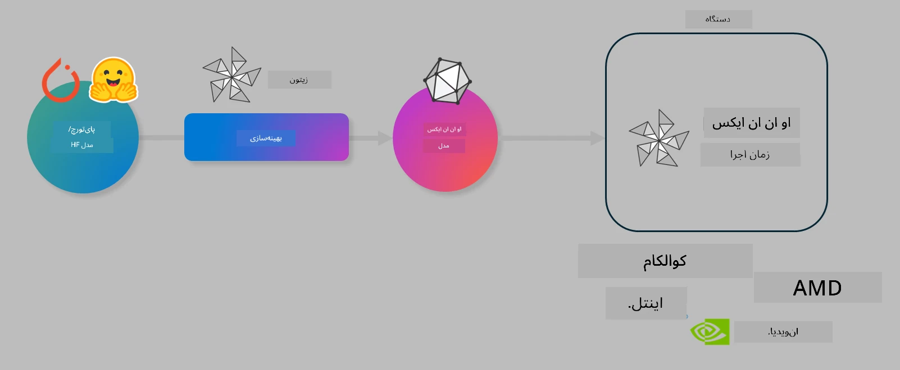

<!--
CO_OP_TRANSLATOR_METADATA:
{
  "original_hash": "6bbe47de3b974df7eea29dfeccf6032b",
  "translation_date": "2025-07-17T10:12:38+00:00",
  "source_file": "md/03.FineTuning/olive-lab/readme.md",
  "language_code": "fa"
}
-->
# آزمایشگاه. بهینه‌سازی مدل‌های هوش مصنوعی برای استنتاج روی دستگاه

## مقدمه

> [!IMPORTANT]  
> این آزمایشگاه نیازمند **کارت گرافیک Nvidia A10 یا A100** به همراه درایورها و ابزار CUDA (نسخه 12 به بالا) نصب شده است.

> [!NOTE]  
> این یک آزمایشگاه **۳۵ دقیقه‌ای** است که به شما مقدمه‌ای عملی درباره مفاهیم اصلی بهینه‌سازی مدل‌ها برای استنتاج روی دستگاه با استفاده از OLIVE ارائه می‌دهد.

## اهداف یادگیری

در پایان این آزمایشگاه، شما قادر خواهید بود با استفاده از OLIVE:

- مدل هوش مصنوعی را با روش کوانتیزاسیون AWQ کوانتیزه کنید.  
- مدل هوش مصنوعی را برای یک وظیفه خاص فاین‌تیون کنید.  
- آداپتورهای LoRA (مدل فاین‌تیون شده) را برای استنتاج بهینه روی دستگاه با ONNX Runtime تولید کنید.

### Olive چیست

Olive (*O*NNX *live*) یک مجموعه ابزار بهینه‌سازی مدل است که همراه با CLI ارائه می‌شود و به شما امکان می‌دهد مدل‌ها را برای ONNX runtime +++https://onnxruntime.ai+++ با کیفیت و عملکرد مناسب آماده کنید.



ورودی Olive معمولاً یک مدل PyTorch یا Hugging Face است و خروجی آن یک مدل ONNX بهینه‌شده است که روی دستگاه (هدف استقرار) با ONNX runtime اجرا می‌شود. Olive مدل را برای شتاب‌دهنده هوش مصنوعی هدف استقرار (NPU، GPU، CPU) که توسط فروشنده سخت‌افزار مانند Qualcomm، AMD، Nvidia یا Intel ارائه شده، بهینه می‌کند.

Olive یک *گردش‌کار* اجرا می‌کند که دنباله‌ای مرتب از وظایف بهینه‌سازی مدل به نام *پَس‌ها* است - نمونه پَس‌ها شامل: فشرده‌سازی مدل، ضبط گراف، کوانتیزاسیون، بهینه‌سازی گراف. هر پَس مجموعه‌ای از پارامترها دارد که می‌توان آن‌ها را تنظیم کرد تا بهترین معیارها مانند دقت و تأخیر که توسط ارزیاب مربوطه سنجیده می‌شوند، به دست آید. Olive از یک استراتژی جستجو استفاده می‌کند که با الگوریتم جستجو هر پَس را به صورت خودکار یکی‌یکی یا به صورت مجموعه‌ای تنظیم می‌کند.

#### مزایای Olive

- **کاهش زمان و خستگی** ناشی از آزمایش‌های دستی و آزمون و خطا با تکنیک‌های مختلف بهینه‌سازی گراف، فشرده‌سازی و کوانتیزاسیون. محدودیت‌های کیفیت و عملکرد خود را تعریف کنید و اجازه دهید Olive بهترین مدل را به طور خودکار برای شما پیدا کند.  
- **بیش از ۴۰ مؤلفه بهینه‌سازی مدل** داخلی که تکنیک‌های پیشرفته در کوانتیزاسیون، فشرده‌سازی، بهینه‌سازی گراف و فاین‌تیون را پوشش می‌دهند.  
- **رابط خط فرمان آسان** برای وظایف رایج بهینه‌سازی مدل. برای مثال، olive quantize، olive auto-opt، olive finetune.  
- بسته‌بندی و استقرار مدل به صورت داخلی.  
- پشتیبانی از تولید مدل‌ها برای **خدمات چندگانه LoRA**.  
- ساخت گردش‌کارها با استفاده از YAML/JSON برای هماهنگی وظایف بهینه‌سازی و استقرار مدل.  
- ادغام با **Hugging Face** و **Azure AI**.  
- مکانیزم **کشینگ** داخلی برای **صرفه‌جویی در هزینه‌ها**.

## دستورالعمل‌های آزمایشگاه

> [!NOTE]  
> لطفاً اطمینان حاصل کنید که Azure AI Hub و پروژه خود را راه‌اندازی کرده‌اید و محاسبات A100 خود را مطابق آزمایشگاه ۱ تنظیم کرده‌اید.

### گام ۰: اتصال به محاسبات Azure AI

شما با استفاده از قابلیت ریموت در **VS Code** به محاسبات Azure AI متصل خواهید شد.

1. برنامه دسکتاپ **VS Code** را باز کنید:  
2. با استفاده از **Shift+Ctrl+P** پنل فرمان را باز کنید.  
3. در پنل فرمان جستجو کنید برای **AzureML - remote: Connect to compute instance in New Window**.  
4. دستورالعمل‌های روی صفحه را برای اتصال به Compute دنبال کنید. این شامل انتخاب اشتراک Azure، گروه منابع، پروژه و نام محاسباتی است که در آزمایشگاه ۱ تنظیم کرده‌اید.  
5. پس از اتصال به گره محاسبات Azure ML، نام آن در **پایین سمت چپ Visual Code** نمایش داده می‌شود: `><Azure ML: Compute Name`

### گام ۱: کلون کردن این مخزن

در VS Code می‌توانید با **Ctrl+J** یک ترمینال جدید باز کنید و این مخزن را کلون کنید:

در ترمینال باید پرامپت زیر را ببینید:

```
azureuser@computername:~/cloudfiles/code$ 
```  
کلون کردن راه‌حل

```bash
cd ~/localfiles
git clone https://github.com/microsoft/phi-3cookbook.git
```

### گام ۲: باز کردن پوشه در VS Code

برای باز کردن VS Code در پوشه مربوطه، دستور زیر را در ترمینال اجرا کنید که یک پنجره جدید باز می‌کند:

```bash
code phi-3cookbook/code/04.Finetuning/Olive-lab
```

همچنین می‌توانید پوشه را با انتخاب **File** > **Open Folder** باز کنید.

### گام ۳: نصب وابستگی‌ها

یک پنجره ترمینال در VS Code در نمونه محاسبات Azure AI خود باز کنید (نکته: **Ctrl+J**) و دستورات زیر را برای نصب وابستگی‌ها اجرا کنید:

```bash
conda create -n olive-ai python=3.11 -y
conda activate olive-ai
pip install -r requirements.txt
az extension remove -n azure-cli-ml
az extension add -n ml
```

> [!NOTE]  
> نصب تمام وابستگی‌ها حدود ۵ دقیقه طول می‌کشد.

در این آزمایشگاه شما مدل‌ها را به کاتالوگ مدل Azure AI دانلود و آپلود خواهید کرد. برای دسترسی به کاتالوگ مدل، باید با استفاده از دستور زیر وارد Azure شوید:

```bash
az login
```

> [!NOTE]  
> هنگام ورود، از شما خواسته می‌شود اشتراک خود را انتخاب کنید. مطمئن شوید اشتراک مربوط به این آزمایشگاه را انتخاب کرده‌اید.

### گام ۴: اجرای دستورات Olive

یک پنجره ترمینال در VS Code در نمونه محاسبات Azure AI خود باز کنید (نکته: **Ctrl+J**) و مطمئن شوید محیط `olive-ai` conda فعال است:

```bash
conda activate olive-ai
```

سپس دستورات زیر Olive را در خط فرمان اجرا کنید.

1. **بررسی داده‌ها:** در این مثال، شما مدل Phi-3.5-Mini را فاین‌تیون می‌کنید تا در پاسخ به سوالات مرتبط با سفر تخصصی شود. کد زیر چند رکورد اول دیتاست را که در قالب JSON lines هستند نمایش می‌دهد:

    ```bash
    head data/data_sample_travel.jsonl
    ```

2. **کوانتیزه کردن مدل:** قبل از آموزش مدل، ابتدا با دستور زیر که از تکنیکی به نام Active Aware Quantization (AWQ) +++https://arxiv.org/abs/2306.00978+++ استفاده می‌کند، مدل را کوانتیزه می‌کنید. AWQ وزن‌های مدل را با در نظر گرفتن فعال‌سازی‌های تولید شده در زمان استنتاج کوانتیزه می‌کند. این یعنی فرایند کوانتیزاسیون توزیع واقعی داده‌ها در فعال‌سازی‌ها را لحاظ می‌کند که منجر به حفظ بهتر دقت مدل نسبت به روش‌های سنتی کوانتیزاسیون وزن می‌شود.

    ```bash
    olive quantize \
       --model_name_or_path microsoft/Phi-3.5-mini-instruct \
       --trust_remote_code \
       --algorithm awq \
       --output_path models/phi/awq \
       --log_level 1
    ```

    این فرایند حدود **۸ دقیقه** طول می‌کشد و اندازه مدل را از حدود ۷.۵ گیگابایت به حدود ۲.۵ گیگابایت کاهش می‌دهد.

    در این آزمایشگاه، نحوه ورودی گرفتن مدل‌ها از Hugging Face (مثلاً: `microsoft/Phi-3.5-mini-instruct`) را نشان می‌دهیم. با این حال، Olive همچنین به شما امکان می‌دهد مدل‌ها را از کاتالوگ Azure AI با به‌روزرسانی آرگومان `model_name_or_path` به شناسه دارایی Azure AI (مثلاً: `azureml://registries/azureml/models/Phi-3.5-mini-instruct/versions/4`) وارد کنید.

3. **آموزش مدل:** سپس دستور `olive finetune` مدل کوانتیزه شده را فاین‌تیون می‌کند. کوانتیزه کردن مدل *قبل از* فاین‌تیون به جای بعد از آن دقت بهتری می‌دهد چون فرایند فاین‌تیون مقداری از افت دقت ناشی از کوانتیزاسیون را جبران می‌کند.

    ```bash
    olive finetune \
        --method lora \
        --model_name_or_path models/phi/awq \
        --data_files "data/data_sample_travel.jsonl" \
        --data_name "json" \
        --text_template "<|user|>\n{prompt}<|end|>\n<|assistant|>\n{response}<|end|>" \
        --max_steps 100 \
        --output_path ./models/phi/ft \
        --log_level 1
    ```

    این فرایند حدود **۶ دقیقه** طول می‌کشد (با ۱۰۰ مرحله).

4. **بهینه‌سازی:** پس از آموزش مدل، اکنون مدل را با دستور `auto-opt` Olive بهینه می‌کنید که گراف ONNX را ضبط کرده و به طور خودکار تعدادی بهینه‌سازی برای بهبود عملکرد مدل روی CPU انجام می‌دهد، از جمله فشرده‌سازی مدل و انجام فیوژن‌ها. لازم به ذکر است که می‌توانید برای دستگاه‌های دیگر مانند NPU یا GPU نیز بهینه‌سازی کنید فقط کافی است آرگومان‌های `--device` و `--provider` را به‌روزرسانی کنید - اما برای اهداف این آزمایشگاه از CPU استفاده می‌کنیم.

    ```bash
    olive auto-opt \
       --model_name_or_path models/phi/ft/model \
       --adapter_path models/phi/ft/adapter \
       --device cpu \
       --provider CPUExecutionProvider \
       --use_ort_genai \
       --output_path models/phi/onnx-ao \
       --log_level 1
    ```

    این فرایند حدود **۵ دقیقه** طول می‌کشد.

### گام ۵: تست سریع استنتاج مدل

برای تست استنتاج مدل، یک فایل پایتون به نام **app.py** در پوشه خود ایجاد کنید و کد زیر را کپی و جای‌گذاری کنید:

```python
import onnxruntime_genai as og
import numpy as np

print("loading model and adapters...", end="", flush=True)
model = og.Model("models/phi/onnx-ao/model")
adapters = og.Adapters(model)
adapters.load("models/phi/onnx-ao/model/adapter_weights.onnx_adapter", "travel")
print("DONE!")

tokenizer = og.Tokenizer(model)
tokenizer_stream = tokenizer.create_stream()

params = og.GeneratorParams(model)
params.set_search_options(max_length=100, past_present_share_buffer=False)
user_input = "what is the best thing to see in chicago"
params.input_ids = tokenizer.encode(f"<|user|>\n{user_input}<|end|>\n<|assistant|>\n")

generator = og.Generator(model, params)

generator.set_active_adapter(adapters, "travel")

print(f"{user_input}")

while not generator.is_done():
    generator.compute_logits()
    generator.generate_next_token()

    new_token = generator.get_next_tokens()[0]
    print(tokenizer_stream.decode(new_token), end='', flush=True)

print("\n")
```

کد را با دستور زیر اجرا کنید:

```bash
python app.py
```

### گام ۶: آپلود مدل به Azure AI

آپلود مدل به مخزن مدل Azure AI باعث می‌شود مدل قابل اشتراک‌گذاری با سایر اعضای تیم توسعه شما باشد و همچنین کنترل نسخه مدل را مدیریت می‌کند. برای آپلود مدل دستور زیر را اجرا کنید:

> [!NOTE]  
> جایگزین‌های `{}` را با نام گروه منابع و نام پروژه Azure AI خود به‌روزرسانی کنید.

برای یافتن نام گروه منابع `"resourceGroup"` و نام پروژه Azure AI، دستور زیر را اجرا کنید:

```
az ml workspace show
```

یا با مراجعه به +++ai.azure.com+++ و انتخاب **management center** > **project** > **overview**

جایگزین‌های `{}` را با نام گروه منابع و نام پروژه Azure AI خود به‌روزرسانی کنید.

```bash
az ml model create \
    --name ft-for-travel \
    --version 1 \
    --path ./models/phi/onnx-ao \
    --resource-group {RESOURCE_GROUP_NAME} \
    --workspace-name {PROJECT_NAME}
```  
سپس می‌توانید مدل آپلود شده خود را مشاهده کرده و مدل خود را در https://ml.azure.com/model/list مستقر کنید.

**سلب مسئولیت**:  
این سند با استفاده از سرویس ترجمه هوش مصنوعی [Co-op Translator](https://github.com/Azure/co-op-translator) ترجمه شده است. در حالی که ما در تلاش برای دقت هستیم، لطفاً توجه داشته باشید که ترجمه‌های خودکار ممکن است حاوی خطاها یا نادرستی‌هایی باشند. سند اصلی به زبان بومی خود باید به عنوان منبع معتبر در نظر گرفته شود. برای اطلاعات حیاتی، ترجمه حرفه‌ای انسانی توصیه می‌شود. ما مسئول هیچ گونه سوءتفاهم یا تفسیر نادرستی که از استفاده از این ترجمه ناشی شود، نیستیم.