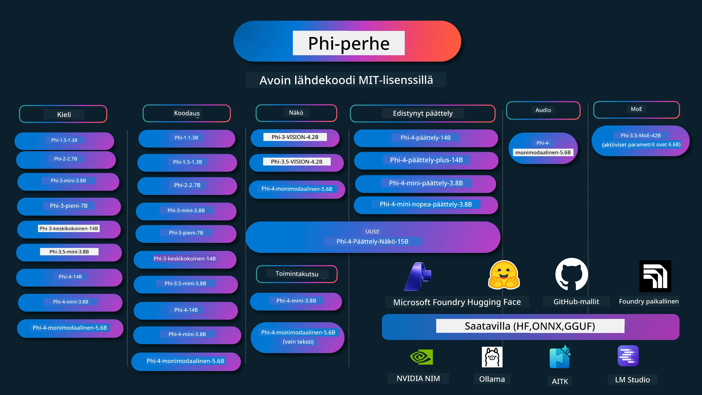

<!--
CO_OP_TRANSLATOR_METADATA:
{
  "original_hash": "c2e4b490f4bd424b095f21e38c6af33b",
  "translation_date": "2026-01-05T12:39:28+00:00",
  "source_file": "README.md",
  "language_code": "fi"
}
-->
# Phi-keittokirja: Käytännön esimerkkejä Microsoftin Phi-malleilla

[](https://codespaces.new/microsoft/phicookbook)
[](https://vscode.dev/redirect?url=vscode://ms-vscode-remote.remote-containers/cloneInVolume?url=https://github.com/microsoft/phicookbook)

[](https://GitHub.com/microsoft/phicookbook/graphs/contributors/?WT.mc_id=aiml-137032-kinfeylo)
[](https://GitHub.com/microsoft/phicookbook/issues/?WT.mc_id=aiml-137032-kinfeylo)
[](https://GitHub.com/microsoft/phicookbook/pulls/?WT.mc_id=aiml-137032-kinfeylo)
[](http://makeapullrequest.com?WT.mc_id=aiml-137032-kinfeylo)

[](https://GitHub.com/microsoft/phicookbook/watchers/?WT.mc_id=aiml-137032-kinfeylo)
[](https://GitHub.com/microsoft/phicookbook/network/?WT.mc_id=aiml-137032-kinfeylo)
[](https://GitHub.com/microsoft/phicookbook/stargazers/?WT.mc_id=aiml-137032-kinfeylo)

[](https://discord.com/invite/ByRwuEEgH4)

Phi on Microsoftin kehittämä avoimen lähdekoodin tekoälymallien sarja.

Phi on tällä hetkellä tehokkain ja kustannustehokkain pieni kielimalli (SLM), jolla on erittäin hyvät tulokset monikielisyydessä, päättelyssä, tekstin/keskustelun generoinnissa, koodauksessa, kuvissa, äänissä ja muissa käyttötapauksissa.

Voit ottaa Phin käyttöön pilvessä tai reunalaitteissa, ja voit helposti rakentaa generatiivisia tekoälysovelluksia rajallisella laskentateholla.

Noudata näitä vaiheita aloittaaksesi näiden resurssien käytön:
1. **Haarukoi repository**: Klikkaa [](https://GitHub.com/microsoft/phicookbook/network/?WT.mc_id=aiml-137032-kinfeylo)
2. **Kloonaa repository**:   `git clone https://github.com/microsoft/PhiCookBook.git`
3. [**Liity Microsoft AI Discord -yhteisöön ja tapaa asiantuntijoita ja muita kehittäjiä**](https://discord.com/invite/ByRwuEEgH4?WT.mc_id=aiml-137032-kinfeylo)



### 🌐 Monikielinen tuki

#### Tuettu GitHub-toiminnon kautta (automaattinen ja aina ajan tasalla)

<!-- CO-OP TRANSLATOR LANGUAGES TABLE START -->
[Arabia](../ar/README.md) | [Bengali](../bn/README.md) | [Bulgaria](../bg/README.md) | [Burma (Myanmar)](../my/README.md) | [Kiina (yksinkertaistettu)](../zh/README.md) | [Kiina (perinteinen, Hong Kong)](../hk/README.md) | [Kiina (perinteinen, Makao)](../mo/README.md) | [Kiina (perinteinen, Taiwan)](../tw/README.md) | [Kroatia](../hr/README.md) | [Tšekki](../cs/README.md) | [Tanska](../da/README.md) | [Hollanti](../nl/README.md) | [Viro](../et/README.md) | [Suomi](./README.md) | [Ranska](../fr/README.md) | [Saksa](../de/README.md) | [Kreikka](../el/README.md) | [Heprea](../he/README.md) | [Hindi](../hi/README.md) | [Unkari](../hu/README.md) | [Indonesia](../id/README.md) | [Italia](../it/README.md) | [Japani](../ja/README.md) | [Kannada](../kn/README.md) | [Korea](../ko/README.md) | [Liettua](../lt/README.md) | [Malaiji](../ms/README.md) | [Malajalami](../ml/README.md) | [Marathi](../mr/README.md) | [Nepali](../ne/README.md) | [Nigerian Pidgin](../pcm/README.md) | [Norja](../no/README.md) | [Persia (Farsi)](../fa/README.md) | [Puola](../pl/README.md) | [Portugali (Brasilia)](../br/README.md) | [Portugali (Portugali)](../pt/README.md) | [Punjabi (Gurmukhi)](../pa/README.md) | [Romania](../ro/README.md) | [Venäjä](../ru/README.md) | [Serbia (kyrillinen)](../sr/README.md) | [Slovakki](../sk/README.md) | [Slovenia](../sl/README.md) | [Espanja](../es/README.md) | [Swahili](../sw/README.md) | [Ruotsi](../sv/README.md) | [Tagalog (Filippiinit)](../tl/README.md) | [Tamil](../ta/README.md) | [Telugu](../te/README.md) | [Thai](../th/README.md) | [Turkki](../tr/README.md) | [Ukraina](../uk/README.md) | [Urdu](../ur/README.md) | [Vietnam](../vi/README.md)

> **Haluatko mieluummin kloonata paikallisesti?**

> Tässä repossa on yli 50 kielen käännöksiä, mikä kasvattaa lataustiedoston kokoa merkittävästi. Kloonaa ilman käännöksiä käyttämällä sparse checkout:
> ```bash
> git clone --filter=blob:none --sparse https://github.com/microsoft/PhiCookBook.git
> cd PhiCookBook
> git sparse-checkout set --no-cone '/*' '!translations' '!translated_images'
> ```
> Tämä antaa sinulle kaiken tarvittavan kurssin suorittamiseen paljon nopeammalla latauksella.
<!-- CO-OP TRANSLATOR LANGUAGES TABLE END -->

## Sisällysluettelo

- Johdanto
  - [Tervetuloa Phi-perheeseen](./md/01.Introduction/01/01.PhiFamily.md)
  - [Ympäristön asennus](./md/01.Introduction/01/01.EnvironmentSetup.md)
  - [Avainteknologioiden ymmärtäminen](./md/01.Introduction/01/01.Understandingtech.md)
  - [Tekoälyn turvallisuus Phi-malleille](./md/01.Introduction/01/01.AISafety.md)
  - [Phi-laitteistotuki](./md/01.Introduction/01/01.Hardwaresupport.md)
  - [Phi-mallit ja saatavuus eri alustoilla](./md/01.Introduction/01/01.Edgeandcloud.md)
  - [Guidance-ai:n ja Phin käyttö](./md/01.Introduction/01/01.Guidance.md)
  - [GitHub Marketplace -mallit](https://github.com/marketplace/models)
  - [Azure AI -malliluettelo](https://ai.azure.com)

- Phi-inferenssi eri ympäristöissä
    -  [Hugging face](./md/01.Introduction/02/01.HF.md)
    -  [GitHub-mallit](./md/01.Introduction/02/02.GitHubModel.md)
    -  [Azure AI Foundry -malliluettelo](./md/01.Introduction/02/03.AzureAIFoundry.md)
    -  [Ollama](./md/01.Introduction/02/04.Ollama.md)
    -  [AI Toolkit VSCode (AITK)](./md/01.Introduction/02/05.AITK.md)
    -  [NVIDIA NIM](./md/01.Introduction/02/06.NVIDIA.md)
    -  [Foundry Local](./md/01.Introduction/02/07.FoundryLocal.md)

- Phi-perheen inferenssi
    - [Phi-inferenssi iOS:ssä](./md/01.Introduction/03/iOS_Inference.md)
    - [Phi-inferenssi Androidissa](./md/01.Introduction/03/Android_Inference.md)
    - [Phi-inferenssi Jetsoneilla](./md/01.Introduction/03/Jetson_Inference.md)
    - [Phi-inferenssi AI-PC:llä](./md/01.Introduction/03/AIPC_Inference.md)
    - [Phi-inferenssi Apple MLX -kehyksellä](./md/01.Introduction/03/MLX_Inference.md)
    - [Phi-inferenssi paikallisella palvelimella](./md/01.Introduction/03/Local_Server_Inference.md)
    - [Phi-inferenssi kauko-palvelimella AI Toolkitin avulla](./md/01.Introduction/03/Remote_Interence.md)
    - [Phi-inferenssi Rustilla](./md/01.Introduction/03/Rust_Inference.md)
    - [Phi--Vision-inferenssi paikallisesti](./md/01.Introduction/03/Vision_Inference.md)
    - [Phi-inferenssi Kaito AKS:llä, Azure Containers (virallinen tuki)](./md/01.Introduction/03/Kaito_Inference.md)
-  [Phi-perheen kvantisointi](./md/01.Introduction/04/QuantifyingPhi.md)
    - [Phi-3.5 / 4 kvantisointi käyttäen llama.cppä](./md/01.Introduction/04/UsingLlamacppQuantifyingPhi.md)
    - [Phi-3.5 / 4 kvantisointi käyttämällä Generative AI -laajennuksia onnxruntimeen](./md/01.Introduction/04/UsingORTGenAIQuantifyingPhi.md)
    - [Phi-3.5 / 4 kvantisointi käyttäen Intel OpenVINOa](./md/01.Introduction/04/UsingIntelOpenVINOQuantifyingPhi.md)
    - [Phi-3.5 / 4 kvantisointi käyttäen Apple MLX -kehystä](./md/01.Introduction/04/UsingAppleMLXQuantifyingPhi.md)

-  Phi:n arviointi
    - [Vastuullinen tekoäly](./md/01.Introduction/05/ResponsibleAI.md)
    - [Azure AI Foundry arviointiin](./md/01.Introduction/05/AIFoundry.md)
    - [Promptflow'n käyttö arviointiin](./md/01.Introduction/05/Promptflow.md)
 
- RAG Azure AI Searchilla
    - [Kuinka käyttää Phi-4-minin ja Phi-4-monimuotoista (RAG) Azure AI Searchin kanssa](https://github.com/microsoft/PhiCookBook/blob/main/code/06.E2E/E2E_Phi-4-RAG-Azure-AI-Search.ipynb)

- Phi-sovelluskehityksen esimerkit
  - Teksti- ja keskustelusovellukset
    - Phi-4 esimerkit 🆕
      - [📓] [Keskustele Phi-4-mini ONNX-mallin kanssa](./md/02.Application/01.TextAndChat/Phi4/ChatWithPhi4ONNX/README.md)
      - [Keskustele Phi-4 paikallisen ONNX-mallin kanssa .NET](../../md/04.HOL/dotnet/src/LabsPhi4-Chat-01OnnxRuntime)
      - [Keskustelu .NET-konsolisovelluksella Phi-4 ONNX:llä käyttäen Semantic Kernelia](../../md/04.HOL/dotnet/src/LabsPhi4-Chat-02SK)
    - Phi-3 / 3.5 esimerkit
      - [Paikallinen chatbot selaimessa käyttäen Phi3:ta, ONNX Runtime Webiä ja WebGPU:ta](https://github.com/microsoft/onnxruntime-inference-examples/tree/main/js/chat)
      - [OpenVino-keskustelu](./md/02.Application/01.TextAndChat/Phi3/E2E_OpenVino_Chat.md)
      - [Multi Model - Vuorovaikutteinen Phi-3-mini ja OpenAI Whisper](./md/02.Application/01.TextAndChat/Phi3/E2E_Phi-3-mini_with_whisper.md)
      - [MLFlow - Kehitä wrapper ja käytä Phi-3:ta MLFlow'n kanssa](./md//02.Application/01.TextAndChat/Phi3/E2E_Phi-3-MLflow.md)
      - [Mallin optimointi - Kuinka optimoida Phi-3-minimalli ONNX Runtime Webiä varten Olive-työkalulla](https://github.com/microsoft/Olive/tree/main/examples/phi3)
      - [WinUI3-sovellus Phi-3 mini-4k-instruct-onnx:llä](https://github.com/microsoft/Phi3-Chat-WinUI3-Sample/)
      -[WinUI3 Multi Model tekoälyllä varustettu muistiinpanosovellus näyte](https://github.com/microsoft/ai-powered-notes-winui3-sample)
      - [Säädä ja integroi custom Phi-3-mallit Prompt flow -työkalulla](./md/02.Application/01.TextAndChat/Phi3/E2E_Phi-3-FineTuning_PromptFlow_Integration.md)
      - [Säädä ja integroi custom Phi-3-mallit Prompt flow -työkalulla Azure AI Foundryssä](./md/02.Application/01.TextAndChat/Phi3/E2E_Phi-3-FineTuning_PromptFlow_Integration_AIFoundry.md)
      - [Arvioi hienosäädetty Phi-3 / Phi-3.5 malli Azure AI Foundryssä keskittyen Microsoftin vastuullisen tekoälyn periaatteisiin](./md/02.Application/01.TextAndChat/Phi3/E2E_Phi-3-Evaluation_AIFoundry.md)
      - [📓] [Phi-3.5-mini-instruct kieliennusteenäyte (kiina/englanti)](./md/02.Application/01.TextAndChat/Phi3/phi3-instruct-demo.ipynb)
      - [Phi-3.5-Instruct WebGPU RAG Chatbot](./md/02.Application/01.TextAndChat/Phi3/WebGPUWithPhi35Readme.md)
      - [Windowsin GPU:n hyödyntäminen Prompt flow -ratkaisun luomiseksi Phi-3.5-Instruct ONNX:n avulla](./md/02.Application/01.TextAndChat/Phi3/UsingPromptFlowWithONNX.md)
      - [Microsoft Phi-3.5 tflite -mallin käyttö Android-sovelluksen luomisessa](./md/02.Application/01.TextAndChat/Phi3/UsingPhi35TFLiteCreateAndroidApp.md)
      - [Q&A .NET-esimerkki paikallisen ONNX Phi-3 -mallin kanssa Microsoft.ML.OnnxRuntimea käyttäen](../../md/04.HOL/dotnet/src/LabsPhi301)
      - [Konsolissa toimiva chat .NET-sovellus Semantic Kernelilla ja Phi-3:lla](../../md/04.HOL/dotnet/src/LabsPhi302)

  - Azure AI Inference SDK Koodipohjaiset näytteet 
    - Phi-4 Näytteet 🆕
      - [📓] [Projektikoodin generointi Phi-4-multimodalilla](./md/02.Application/02.Code/Phi4/GenProjectCode/README.md)
    - Phi-3 / 3.5 Näytteet
      - [Rakenna oma Visual Studio Code GitHub Copilot Chat Microsoft Phi-3 -perheen avulla](./md/02.Application/02.Code/Phi3/VSCodeExt/README.md)
      - [Luo oma Visual Studio Code Chat Copilot Agent Phi-3.5:n avulla GitHub-malleilla](/md/02.Application/02.Code/Phi3/CreateVSCodeChatAgentWithGitHubModels.md)

  - Edistyneet päättelynäytteet
    - Phi-4 Näytteet 🆕
      - [📓] [Phi-4-mini-päättelytai Phi-4-päättelyn näytteet](./md/02.Application/03.AdvancedReasoning/Phi4/AdvancedResoningPhi4mini/README.md)
      - [📓] [Phi-4-mini-päättelyn hienosäätö Microsoft Olivella](./md/02.Application/03.AdvancedReasoning/Phi4/AdvancedResoningPhi4mini/olive_ft_phi_4_reasoning_with_medicaldata.ipynb)
      - [📓] [Phi-4-mini-päättelyn hienosäätö Apple MLX:llä](./md/02.Application/03.AdvancedReasoning/Phi4/AdvancedResoningPhi4mini/mlx_ft_phi_4_reasoning_with_medicaldata.ipynb)
      - [📓] [Phi-4-mini-päättely GitHub-malleilla](./md/02.Application/02.Code/Phi4r/github_models_inference.ipynb)
      - [📓] [Phi-4-mini-päättely Azure AI Foundryn malleilla](./md/02.Application/02.Code/Phi4r/azure_models_inference.ipynb)
  - Demos
      - [Phi-4-mini demonstraatiot Hugging Face Spacesissa](https://huggingface.co/spaces/microsoft/phi-4-mini?WT.mc_id=aiml-137032-kinfeylo)
      - [Phi-4-multimodal demonstraatiot Hugginge Face Spacesissa](https://huggingface.co/spaces/microsoft/phi-4-multimodal?WT.mc_id=aiml-137032-kinfeylo)
  - Vision-näytteet
    - Phi-4 Näytteet 🆕
      - [📓] [Käytä Phi-4-multimodalia kuvien lukuun ja koodin generointiin](./md/02.Application/04.Vision/Phi4/CreateFrontend/README.md) 
    - Phi-3 / 3.5 Näytteet
      -  [📓][Phi-3-vision-Kuvan tekstiksi tekstiksi](./md/02.Application/04.Vision/Phi3/E2E_Phi-3-vision-image-text-to-text-online-endpoint.ipynb)
      - [Phi-3-vision-ONNX](https://onnxruntime.ai/docs/genai/tutorials/phi3-v.html)
      - [📓][Phi-3-vision CLIP-sisätys](./md/02.Application/04.Vision/Phi3/E2E_Phi-3-vision-image-text-to-text-online-endpoint.ipynb)
      - [DEMO: Phi-3 kierrätys](https://github.com/jennifermarsman/PhiRecycling/)
      - [Phi-3-vision - Visuaalinen kieliavustaja - Phi3-Visionin ja OpenVINOn avulla](https://docs.openvino.ai/nightly/notebooks/phi-3-vision-with-output.html)
      - [Phi-3 Vision Nvidia NIM](./md/02.Application/04.Vision/Phi3/E2E_Nvidia_NIM_Vision.md)
      - [Phi-3 Vision OpenVino](./md/02.Application/04.Vision/Phi3/E2E_OpenVino_Phi3Vision.md)
      - [📓][Phi-3.5 Vision monikehys- tai monikuvanäyte](./md/02.Application/04.Vision/Phi3/phi3-vision-demo.ipynb)
      - [Phi-3 Vision paikallinen ONNX-malli Microsoft.ML.OnnxRuntime .NETillä](../../md/04.HOL/dotnet/src/LabsPhi303)
      - [Valikkopohjainen Phi-3 Vision paikallinen ONNX-malli Microsoft.ML.OnnxRuntime .NETillä](../../md/04.HOL/dotnet/src/LabsPhi304)

  - Matematiikka-näytteet
    -  Phi-4-Mini-Flash-päättely-ohjeistuksen näytteet 🆕 [Matematiikkademo Phi-4-Mini-Flash-päättelyllä](./md/02.Application/09.Math/MathDemo.ipynb)

  - Ääni-näytteet
    - Phi-4 Näytteet 🆕
      - [📓] [Äänitallenteiden transkriptioiden poiminta Phi-4-multimodalilla](./md/02.Application/05.Audio/Phi4/Transciption/README.md)
      - [📓] [Phi-4-multimodal Ääni-näyte](./md/02.Application/05.Audio/Phi4/Siri/demo.ipynb)
      - [📓] [Phi-4-multimodal Puheen käännösnäyte](./md/02.Application/05.Audio/Phi4/Translate/demo.ipynb)
      - [.NET-konsolisovellus käyttäen Phi-4-multimodal Ääntä analysoimaan äänitiedoston ja generoimaan transkriptio](../../md/04.HOL/dotnet/src/LabsPhi4-MultiModal-02Audio)

  - MOE-näytteet
    - Phi-3 / 3.5 Näytteet
      - [📓] [Phi-3.5 Eksperttimallien sekoitus (MoEs) sosiaalisen median näyte](./md/02.Application/06.MoE/Phi3/phi3_moe_demo.ipynb)
      - [📓] [Hakua ja generoimista yhdistävän putken rakentaminen NVIDIA NIM Phi-3 MOE:lla, Azure AI Searchilla ja LlamaIndexillä](./md/02.Application/06.MoE/Phi3/azure-ai-search-nvidia-rag.ipynb)
      - 
  - Funktioiden kutsun näytteet
    - Phi-4 Näytteet 🆕
      -  [📓] [Funktioiden kutsun käyttö Phi-4-minin kanssa](./md/02.Application/07.FunctionCalling/Phi4/FunctionCallingBasic/README.md)
      -  [📓] [Funktioiden kutsun käyttö multi-agenttien luomiseen Phi-4-minillä](./md/02.Application/07.FunctionCalling/Phi4/Multiagents/Phi_4_mini_multiagent.ipynb)
      -  [📓] [Funktioiden kutsun käyttö Ollaman kanssa](./md/02.Application/07.FunctionCalling/Phi4/Ollama/ollama_functioncalling.ipynb)
      -  [📓] [Funktioiden kutsun käyttö ONNX:n kanssa](./md/02.Application/07.FunctionCalling/Phi4/ONNX/onnx_parallel_functioncalling.ipynb)
  - Monimodalin sekoitusnäytteet
    - Phi-4 Näytteet 🆕
      -  [📓] [Phi-4-multimodalin käyttö teknologiatoimittajana](./md/02.Application/08.Multimodel/Phi4/TechJournalist/phi_4_mm_audio_text_publish_news.ipynb)
      - [.NET-konsolisovellus käyttäen Phi-4-multimodalia kuvien analysointiin](../../md/04.HOL/dotnet/src/LabsPhi4-MultiModal-01Images)

- Phi-mallien hienosäätö
  - [Hienosäätötilanteet](./md/03.FineTuning/FineTuning_Scenarios.md)
  - [Hienosäätö vs RAG](./md/03.FineTuning/FineTuning_vs_RAG.md)
  - [Anna Phi-3:n tulla alan asiantuntijaksi](./md/03.FineTuning/LetPhi3gotoIndustriy.md)
  - [Phi-3:n hienosäätö AI Toolkitilla VS Codeen](./md/03.FineTuning/Finetuning_VSCodeaitoolkit.md)
  - [Phi-3:n hienosäätö Azure Machine Learning Servicen avulla](./md/03.FineTuning/Introduce_AzureML.md)
  - [Phi-3:n hienosäätö Loralla](./md/03.FineTuning/FineTuning_Lora.md)
  - [Phi-3:n hienosäätö QLoralla](./md/03.FineTuning/FineTuning_Qlora.md)
  - [Phi-3:n hienosäätö Azure AI Foundryllä](./md/03.FineTuning/FineTuning_AIFoundry.md)
  - [Phi-3:n hienosäätö Azure ML CLI/SDK:lla](./md/03.FineTuning/FineTuning_MLSDK.md)
  - [Hienosäätö Microsoft Olivella](./md/03.FineTuning/FineTuning_MicrosoftOlive.md)
  - [Microsoft Olive Hands-On -laboratorio hienosäätöön](./md/03.FineTuning/olive-lab/readme.md)
  - [Phi-3-vision hienosäätö Weights and Biasesilla](./md/03.FineTuning/FineTuning_Phi-3-visionWandB.md)
  - [Phi-3:n hienosäätö Apple MLX Frameworkilla](./md/03.FineTuning/FineTuning_MLX.md)
  - [Phi-3-vision hienosäätö (virallinen tuki)](./md/03.FineTuning/FineTuning_Vision.md)
  - [Phi-3:n hienosäätö Kaito AKS:llä , Azure Containers (virallinen tuki)](./md/03.FineTuning/FineTuning_Kaito.md)
  - [Phi-3:n ja 3.5 Vision hienosäätö](https://github.com/2U1/Phi3-Vision-Finetune)

- Hands on Lab
  - [Tutustu huipputason malleihin: LLM:t, SLM:t, paikallinen kehitys ja muuta](https://github.com/microsoft/aitour-exploring-cutting-edge-models)
  - [NLP:n potentiaalin avaaminen: hienosäätö Microsoft Olivella](https://github.com/azure/Ignite_FineTuning_workshop)

- Akateemiset tutkimuspaperit ja julkaisut
  - [Kirjat ovat kaikki mitä tarvitset II: phi-1.5 tekninen raportti](https://arxiv.org/abs/2309.05463)
  - [Phi-3 tekninen raportti: erittäin kykenevä kielimalli paikallisesti puhelimessasi](https://arxiv.org/abs/2404.14219)
  - [Phi-4 tekninen raportti](https://arxiv.org/abs/2412.08905)
  - [Phi-4-Mini tekninen raportti: Pienikokoiset mutta tehokkaat multimodaaliset kielimallit LoRA-yhdistelmillä](https://arxiv.org/abs/2503.01743)
  - [Pienten kielimallien optimointi ajoneuvojen toimintokutsuihin](https://arxiv.org/abs/2501.02342)
  - [(WhyPHI) PHI-3 hienosäätö monivalintakysymysten vastaamiseen: menetelmät, tulokset ja haasteet](https://arxiv.org/abs/2501.01588)
  - [Phi-4-päättely tekninen raportti](https://www.microsoft.com/en-us/research/wp-content/uploads/2025/04/phi_4_reasoning.pdf)
  - [Phi-4-mini-päättely tekninen raportti](https://huggingface.co/microsoft/Phi-4-mini-reasoning/blob/main/Phi-4-Mini-Reasoning.pdf)

## Phi-mallien käyttö

### Phi Azure AI Foundryssa

Voit oppia käyttämään Microsoft Phia ja rakentamaan kokonaisia ratkaisuja eri laitteillasi. Kokeillaksesi Phia itse, aloita leikkimällä malleilla ja muokkaamalla Phi-sovellusta omiin tarpeisiisi käyttämällä [Azure AI Foundryn Azure AI Model Catalogia](https://aka.ms/phi3-azure-ai). Lisätietoja saat oppaasta Aloitus [Azure AI Foundryn kanssa](/md/02.QuickStart/AzureAIFoundry_QuickStart.md)

**Leikkikenttä**  
Jokaisella mallilla on oma leikkikenttä mallin testaamiseen [Azure AI Playground](https://aka.ms/try-phi3).

### Phi GitHub-malliceilla

Voit oppia käyttämään Microsoft Phia ja rakentamaan kokonaisia ratkaisuja eri laitteillasi. Kokeillaksesi Phia itse, aloita leikkimällä mallilla ja muokkaamalla Phi-sovellusta omiin tarpeisiisi käyttämällä [GitHub Model Catalogia](https://github.com/marketplace/models?WT.mc_id=aiml-137032-kinfeylo). Lisätietoja saat oppaasta Aloitus [GitHub Model Catalogin kanssa](/md/02.QuickStart/GitHubModel_QuickStart.md)

**Leikkikenttä**  
Jokaisella mallilla on oma [leikkikenttä mallin testaamiseen](/md/02.QuickStart/GitHubModel_QuickStart.md).

### Phi Hugging Facessa

Mallin löydät myös [Hugging Facesta](https://huggingface.co/microsoft)

**Leikkikenttä**  
[Hugging Chat -leikkikenttä](https://huggingface.co/chat/models/microsoft/Phi-3-mini-4k-instruct)

## 🎒 Muut kurssit

Tiimimme tuottaa myös muita kursseja! Tutustu:

<!-- CO-OP TRANSLATOR OTHER COURSES START -->
### LangChain  
[](https://aka.ms/langchain4j-for-beginners)  
[](https://aka.ms/langchainjs-for-beginners?WT.mc_id=m365-94501-dwahlin)

---

### Azure / Edge / MCP / Agentit  
[](https://github.com/microsoft/AZD-for-beginners?WT.mc_id=academic-105485-koreyst)  
[](https://github.com/microsoft/edgeai-for-beginners?WT.mc_id=academic-105485-koreyst)  
[](https://github.com/microsoft/mcp-for-beginners?WT.mc_id=academic-105485-koreyst)  
[](https://github.com/microsoft/ai-agents-for-beginners?WT.mc_id=academic-105485-koreyst)

---

### Generatiivisen tekoälyn sarja  
[](https://github.com/microsoft/generative-ai-for-beginners?WT.mc_id=academic-105485-koreyst)  
[-9333EA?style=for-the-badge&labelColor=E5E7EB&color=9333EA)](https://github.com/microsoft/Generative-AI-for-beginners-dotnet?WT.mc_id=academic-105485-koreyst)  
[-C084FC?style=for-the-badge&labelColor=E5E7EB&color=C084FC)](https://github.com/microsoft/generative-ai-for-beginners-java?WT.mc_id=academic-105485-koreyst)  
[-E879F9?style=for-the-badge&labelColor=E5E7EB&color=E879F9)](https://github.com/microsoft/generative-ai-with-javascript?WT.mc_id=academic-105485-koreyst)

---

### Perusopetus  
[](https://aka.ms/ml-beginners?WT.mc_id=academic-105485-koreyst)  
[](https://aka.ms/datascience-beginners?WT.mc_id=academic-105485-koreyst)  
[](https://aka.ms/ai-beginners?WT.mc_id=academic-105485-koreyst)  
[](https://github.com/microsoft/Security-101?WT.mc_id=academic-96948-sayoung)  
[](https://aka.ms/webdev-beginners?WT.mc_id=academic-105485-koreyst)  
[](https://aka.ms/iot-beginners?WT.mc_id=academic-105485-koreyst)  
[](https://github.com/microsoft/xr-development-for-beginners?WT.mc_id=academic-105485-koreyst)

---

### Copilot-sarja  
[](https://aka.ms/GitHubCopilotAI?WT.mc_id=academic-105485-koreyst)  
[](https://github.com/microsoft/mastering-github-copilot-for-dotnet-csharp-developers?WT.mc_id=academic-105485-koreyst)  
[](https://github.com/microsoft/CopilotAdventures?WT.mc_id=academic-105485-koreyst)  
<!-- CO-OP TRANSLATOR OTHER COURSES END -->

## Vastuullinen tekoäly

Microsoft on sitoutunut auttamaan asiakkaitamme käyttämään tekoälytuotteitamme vastuullisesti, jakamaan oppejamme ja rakentamaan luottamukseen perustuvia kumppanuuksia esimerkiksi Työkalujen, kuten Läpinäkyvyysmuistioiden ja Vaikutusarviointien avulla. Monet näistä resursseista löytyvät osoitteesta [https://aka.ms/RAI](https://aka.ms/RAI).  
Microsoftin vastuullisen tekoälyn lähestymistapa perustuu tekoälyn periaatteisiimme oikeudenmukaisuudesta, luotettavuudesta ja turvallisuudesta, yksityisyydestä ja tietoturvasta, osallisuudesta, läpinäkyvyydestä sekä vastuullisuudesta.

Suurten kieli-, kuva- ja puhemallien - kuten tässä esimerkissä käytettyjen - käyttäytyminen voi olla ajoittain epäoikeudenmukaista, epäluotettavaa tai loukkaavaa, mikä voi aiheuttaa haittoja. Tutustu [Azure OpenAI -palvelun läpinäkyvyysmuistioon](https://learn.microsoft.com/legal/cognitive-services/openai/transparency-note?tabs=text) pysyäksesi ajan tasalla riskeistä ja rajoituksista.

Suositeltu tapa riskien vähentämiseksi on lisätä arkkitehtuuriisi turvajärjestelmä, joka tunnistaa ja estää haitallista käyttäytymistä. [Azure AI Content Safety](https://learn.microsoft.com/azure/ai-services/content-safety/overview) tarjoaa riippumattoman suojakerroksen, joka pystyy tunnistamaan haitallista käyttäjien ja tekoälyn tuottamaa sisältöä sovelluksissa ja palveluissa. Azure AI Content Safety sisältää tekstin ja kuvien API-rajapinnat, joiden avulla voit havaita haitallista materiaalia. Azure AI Foundryn sisältöturvapalvelulla voit tarkastella, tutkia ja kokeilla mallikoodia haitallisen sisällön tunnistamiseksi eri muodoissa. Seuraava [aloitusopas](https://learn.microsoft.com/azure/ai-services/content-safety/quickstart-text?tabs=visual-studio%2Clinux&pivots=programming-language-rest) ohjaa sinua tekemään pyyntöjä palveluun.

Toinen huomioitava seikka on koko sovelluksen suorituskyky. Multimodaalisissa ja monimallijärjestelmissä suorituskyvyllä tarkoitetaan käytännössä sitä, että järjestelmä toimii odotetusti – mukaan lukien haitallisten tulosteiden välttäminen. On tärkeää arvioida koko sovelluksen suorituskyky käyttämällä [Suorituskyky- ja laatu- sekä Riski- ja turvallisuusarvioijia](https://learn.microsoft.com/azure/ai-studio/concepts/evaluation-metrics-built-in). Lisäksi voit luoda ja arvioida suorituskykyä [kustomoiduilla arvioijilla](https://learn.microsoft.com/azure/ai-studio/how-to/develop/evaluate-sdk#custom-evaluators).
Voit arvioida tekoälysovellustasi kehitysympäristössäsi käyttämällä [Azure AI Evaluation SDK:ta](https://microsoft.github.io/promptflow/index.html). Olipa käytössäsi testidata tai tavoite, generatiivisen tekoälysovelluksesi luomukset mitataan määrällisesti sisäänrakennetuilla arvioijilla tai haluamillasi mukautetuilla arvioijilla. Päästäksesi alkuun azure ai evaluation sdk:n kanssa järjestelmäsi arvioimiseksi voit seurata [aloitusopasta](https://learn.microsoft.com/azure/ai-studio/how-to/develop/flow-evaluate-sdk). Kun suoritat arviointikierroksen, voit [visualisoida tulokset Azure AI Foundryssa](https://learn.microsoft.com/azure/ai-studio/how-to/evaluate-flow-results).

## Tavaramerkit

Tässä projektissa saattaa olla tavaramerkkejä tai logoja projekteille, tuotteille tai palveluille. Microsoftin tavaramerkkien tai logojen valtuutettu käyttö on Microsoftin [tavaramerkkien ja brändiohjeistusten](https://www.microsoft.com/legal/intellectualproperty/trademarks/usage/general) alainen ja niitä on noudatettava.
Microsoftin tavaramerkkien tai logojen käyttö muokatuissa versioissa tästä projektista ei saa aiheuttaa sekaannusta tai antaa vaikutelmaa Microsoftin sponsoroinnista. Kolmansien osapuolien tavaramerkkien tai logojen käyttö on kyseisten kolmansien osapuolien politiikkojen alaista.

## Avun saaminen

Jos jumitut tai sinulla on kysyttävää tekoälysovellusten rakentamisesta, liity:

[](https://aka.ms/foundry/discord)

Jos sinulla on palautetta tuotteesta tai kohtaat virheitä rakentamisen aikana, käy:

[](https://aka.ms/foundry/forum)

---

<!-- CO-OP TRANSLATOR DISCLAIMER START -->
**Vastuuvapauslauseke**:
Tämä asiakirja on käännetty käyttämällä tekoälypohjaista käännöspalvelua [Co-op Translator](https://github.com/Azure/co-op-translator). Pyrimme tarkkuuteen, mutta huomioithan, että automaattikäännöksissä saattaa esiintyä virheitä tai epätarkkuuksia. Alkuperäinen asiakirja sen alkuperäiskielellä on virallinen lähde. Tärkeissä tiedoissa suosittelemme ammattimaista ihmiskäännöstä. Emme ole vastuussa tämän käännöksen käytöstä aiheutuvista väärinymmärryksistä tai tulkinnoista.
<!-- CO-OP TRANSLATOR DISCLAIMER END -->