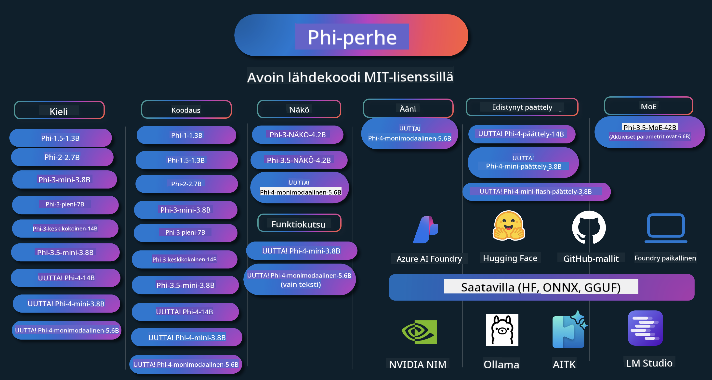

<!--
CO_OP_TRANSLATOR_METADATA:
{
  "original_hash": "ef3a50368712b1a7483d0def1f70c490",
  "translation_date": "2025-12-21T12:15:01+00:00",
  "source_file": "README.md",
  "language_code": "fi"
}
-->
# Phi-keittokirja: Käytännön esimerkkejä Microsoftin Phi-malleilla

Phi on Microsoftin kehittämä avoimen lähdekoodin tekoälymallisarja. 

Phi on tällä hetkellä tehokkain ja kustannustehokkain pieni kielimalli (SLM), jolla on erinomaiset vertailuarvot monikielisyydessä, päättelyssä, tekstin/chatin generoinnissa, koodaamisessa, kuvissa, äänessä ja muissa skenaarioissa. 

Voit ottaa Phin käyttöön pilvessä tai reunalaitteissa, ja voit helposti rakentaa generatiivisia tekoälysovelluksia rajallisilla laskentaresursseilla.

Noudata näitä vaiheita aloittaaksesi näiden resurssien käytön:
1. **Forkkaa repositorio**: Click 
2. **Kloonaa repositorio**:   `git clone https://github.com/microsoft/PhiCookBook.git`
3. [**Liity Microsoft AI Discord -yhteisöön ja tapaa asiantuntijoita ja muita kehittäjiä**](https://discord.com/invite/ByRwuEEgH4?WT.mc_id=aiml-137032-kinfeylo)

### 🌐 Monikielituki

#### Tuettu GitHub Actionin kautta (automaattinen & aina ajan tasalla)

<!-- CO-OP TRANSLATOR LANGUAGES TABLE START -->
[Arabic](../ar/README.md) | [Bengali](../bn/README.md) | [Bulgarian](../bg/README.md) | [Burmese (Myanmar)](../my/README.md) | [Chinese (Simplified)](../zh/README.md) | [Chinese (Traditional, Hong Kong)](../hk/README.md) | [Chinese (Traditional, Macau)](../mo/README.md) | [Chinese (Traditional, Taiwan)](../tw/README.md) | [Croatian](../hr/README.md) | [Czech](../cs/README.md) | [Danish](../da/README.md) | [Dutch](../nl/README.md) | [Estonian](../et/README.md) | [Finnish](./README.md) | [French](../fr/README.md) | [German](../de/README.md) | [Greek](../el/README.md) | [Hebrew](../he/README.md) | [Hindi](../hi/README.md) | [Hungarian](../hu/README.md) | [Indonesian](../id/README.md) | [Italian](../it/README.md) | [Japanese](../ja/README.md) | [Kannada](../kn/README.md) | [Korean](../ko/README.md) | [Lithuanian](../lt/README.md) | [Malay](../ms/README.md) | [Malayalam](../ml/README.md) | [Marathi](../mr/README.md) | [Nepali](../ne/README.md) | [Nigerian Pidgin](../pcm/README.md) | [Norwegian](../no/README.md) | [Persian (Farsi)](../fa/README.md) | [Polish](../pl/README.md) | [Portuguese (Brazil)](../br/README.md) | [Portuguese (Portugal)](../pt/README.md) | [Punjabi (Gurmukhi)](../pa/README.md) | [Romanian](../ro/README.md) | [Russian](../ru/README.md) | [Serbian (Cyrillic)](../sr/README.md) | [Slovak](../sk/README.md) | [Slovenian](../sl/README.md) | [Spanish](../es/README.md) | [Swahili](../sw/README.md) | [Swedish](../sv/README.md) | [Tagalog (Filipino)](../tl/README.md) | [Tamil](../ta/README.md) | [Telugu](../te/README.md) | [Thai](../th/README.md) | [Turkish](../tr/README.md) | [Ukrainian](../uk/README.md) | [Urdu](../ur/README.md) | [Vietnamese](../vi/README.md)
<!-- CO-OP TRANSLATOR LANGUAGES TABLE END -->

## Sisällysluettelo

- Johdanto
  - [Tervetuloa Phi-perheeseen](./md/01.Introduction/01/01.PhiFamily.md)
  - [Ympäristön pystyttäminen](./md/01.Introduction/01/01.EnvironmentSetup.md)
  - [Keskeisten teknologioiden ymmärtäminen](./md/01.Introduction/01/01.Understandingtech.md)
  - [Phi-mallien tekoälyn turvallisuus](./md/01.Introduction/01/01.AISafety.md)
  - [Phi-laitteiden tuki](./md/01.Introduction/01/01.Hardwaresupport.md)
  - [Phi-mallit ja saatavuus eri alustoilla](./md/01.Introduction/01/01.Edgeandcloud.md)
  - [Guidance-ai:n ja Phin käyttö](./md/01.Introduction/01/01.Guidance.md)
  - [GitHub Marketplacen mallit](https://github.com/marketplace/models)
  - [Azure AI -malliluettelo](https://ai.azure.com)

- Phi-inferenssi eri ympäristöissä
    -  [Hugging Face](./md/01.Introduction/02/01.HF.md)
    -  [GitHub-mallit](./md/01.Introduction/02/02.GitHubModel.md)
    -  [Azure AI Foundry -malliluettelo](./md/01.Introduction/02/03.AzureAIFoundry.md)
    -  [Ollama](./md/01.Introduction/02/04.Ollama.md)
    -  [AI Toolkit VSCode (AITK)](./md/01.Introduction/02/05.AITK.md)
    -  [NVIDIA NIM](./md/01.Introduction/02/06.NVIDIA.md)
    -  [Foundry Local](./md/01.Introduction/02/07.FoundryLocal.md)

- Phi-perheen inferointi
    - [Phi-inferenssi iOS:ssä](./md/01.Introduction/03/iOS_Inference.md)
    - [Phi-inferenssi Androidissa](./md/01.Introduction/03/Android_Inference.md)
    - [Phi-inferenssi Jetsonissa](./md/01.Introduction/03/Jetson_Inference.md)
    - [Phi-inferenssi AI-PC:ssä](./md/01.Introduction/03/AIPC_Inference.md)
    - [Phi-inferenssi Apple MLX -kehyksellä](./md/01.Introduction/03/MLX_Inference.md)
    - [Phi-inferenssi paikallisella palvelimella](./md/01.Introduction/03/Local_Server_Inference.md)
    - [Phi-inferenssi etäpalvelimella AI Toolkitin avulla](./md/01.Introduction/03/Remote_Interence.md)
    - [Phi-inferenssi Rustilla](./md/01.Introduction/03/Rust_Inference.md)
    - [Phi-inferenssi--Visio paikallisesti](./md/01.Introduction/03/Vision_Inference.md)
    - [Phi-inferenssi Kaito AKS:lla, Azure Containers (virallinen tuki)](./md/01.Introduction/03/Kaito_Inference.md)
-  [Phi-perheen kvantifiointi](./md/01.Introduction/04/QuantifyingPhi.md)
    - [Phi-3.5 / 4 kvantisointi käyttäen llama.cpp](./md/01.Introduction/04/UsingLlamacppQuantifyingPhi.md)
    - [Phi-3.5 / 4 kvantisointi käyttäen Generative AI -laajennuksia onnxruntimelle](./md/01.Introduction/04/UsingORTGenAIQuantifyingPhi.md)
    - [Phi-3.5 / 4 kvantisointi käyttäen Intel OpenVINOa](./md/01.Introduction/04/UsingIntelOpenVINOQuantifyingPhi.md)
    - [Phi-3.5 / 4 kvantisointi käyttäen Apple MLX -kehystä](./md/01.Introduction/04/UsingAppleMLXQuantifyingPhi.md)

-  Phi:n arviointi
    - [Vastuullinen tekoäly](./md/01.Introduction/05/ResponsibleAI.md)
    - [Azure AI Foundry arviointiin](./md/01.Introduction/05/AIFoundry.md)
    - [Promptflowin käyttäminen arviointiin](./md/01.Introduction/05/Promptflow.md)
 
- RAG Azure AI Searchin kanssa
    - [Kuinka käyttää Phi-4-miniä ja Phi-4-multimodalia(RAG) Azure AI Searchin kanssa](https://github.com/microsoft/PhiCookBook/blob/main/code/06.E2E/E2E_Phi-4-RAG-Azure-AI-Search.ipynb)

- Phi-sovelluskehityksen esimerkit
  - Teksti- ja chat-sovellukset
    - Phi-4-esimerkit 🆕
      - [📓] [Keskustele Phi-4-minin ONNX-mallin kanssa](./md/02.Application/01.TextAndChat/Phi4/ChatWithPhi4ONNX/README.md)
      - [Chat Phi-4:n paikallisen ONNX-mallin kanssa (.NET)](../../md/04.HOL/dotnet/src/LabsPhi4-Chat-01OnnxRuntime)
      - [Chat .NET -konsolisovellus Phi-4 ONNX:llä käyttäen Semantic Kernelia](../../md/04.HOL/dotnet/src/LabsPhi4-Chat-02SK)
    - Phi-3 / 3.5 -esimerkit
      - [Paikallinen chatbot selaimessa käyttäen Phi3:aa, ONNX Runtime Webiä ja WebGPU:ta](https://github.com/microsoft/onnxruntime-inference-examples/tree/main/js/chat)
      - [OpenVINO-chat](./md/02.Application/01.TextAndChat/Phi3/E2E_OpenVino_Chat.md)
      - [Monimalli - Interaktiivinen Phi-3-mini ja OpenAI Whisper](./md/02.Application/01.TextAndChat/Phi3/E2E_Phi-3-mini_with_whisper.md)
      - [MLFlow - Wrapperin rakentaminen ja Phi-3:n käyttäminen MLFlow'n kanssa](./md//02.Application/01.TextAndChat/Phi3/E2E_Phi-3-MLflow.md)
      - [Mallin optimointi - Kuinka optimoida Phi-3-min-malli ONNX Runtime Webille Olivella](https://github.com/microsoft/Olive/tree/main/examples/phi3)
      - [WinUI3-sovellus Phi-3 mini-4k-instruct-onnx:n kanssa](https://github.com/microsoft/Phi3-Chat-WinUI3-Sample/)
      -[WinUI3-monimalli AI-voimainen muistiinpanosovellusnäyte](https://github.com/microsoft/ai-powered-notes-winui3-sample)
      - [Hienosäädä ja integroi mukautetut Phi-3-mallit Prompt Flown kanssa](./md/02.Application/01.TextAndChat/Phi3/E2E_Phi-3-FineTuning_PromptFlow_Integration.md)
      - [Hienosäädä ja integroi mukautetut Phi-3-mallit Prompt Flown kanssa Azure AI Foundryssa](./md/02.Application/01.TextAndChat/Phi3/E2E_Phi-3-FineTuning_PromptFlow_Integration_AIFoundry.md)
      - [Arvioi hienosäädetty Phi-3 / Phi-3.5 -malli Azure AI Foundryssa keskittyen Microsoftin vastuullisen tekoälyn periaatteisiin](./md/02.Application/01.TextAndChat/Phi3/E2E_Phi-3-Evaluation_AIFoundry.md)
      - [📓] [Phi-3.5-mini-instruct kielen ennustusnäyte (kiina/englanti)](./md/02.Application/01.TextAndChat/Phi3/phi3-instruct-demo.ipynb)
      - [Phi-3.5-Instruct WebGPU RAG -chatbotti](./md/02.Application/01.TextAndChat/Phi3/WebGPUWithPhi35Readme.md)
      - [Windowsin GPU:n käyttäminen Prompt flow -ratkaisun luomiseen Phi-3.5-Instruct ONNX:lla](./md/02.Application/01.TextAndChat/Phi3/UsingPromptFlowWithONNX.md)
      - [Microsoft Phi-3.5 tflite:n käyttäminen Android-sovelluksen luomiseen](./md/02.Application/01.TextAndChat/Phi3/UsingPhi35TFLiteCreateAndroidApp.md)
      - [Kysymykset ja vastaukset .NET -esimerkki paikallisella ONNX Phi-3 -mallilla Microsoft.ML.OnnxRuntimea käyttäen](../../md/04.HOL/dotnet/src/LabsPhi301)
      - [Konsolichat .NET -sovellus Semantic Kernelin ja Phi-3:n kanssa](../../md/04.HOL/dotnet/src/LabsPhi302)

  - Azure AI Inference SDK Code Based Samples 
    - Phi-4-esimerkit 🆕
      - [📓] [Luo projektikoodi käyttäen Phi-4-multimodalia](./md/02.Application/02.Code/Phi4/GenProjectCode/README.md)
    - Phi-3 / 3.5 -esimerkit
      - [Rakenna oma Visual Studio Code GitHub Copilot Chat Microsoft Phi-3 -perheen kanssa](./md/02.Application/02.Code/Phi3/VSCodeExt/README.md)
      - [Luo oma Visual Studio Code Chat Copilot -agentti Phi-3.5:llä GitHub Modelsin avulla](/md/02.Application/02.Code/Phi3/CreateVSCodeChatAgentWithGitHubModels.md)

  - Edistyneen päättelyn esimerkit
    - Phi-4-esimerkit 🆕
      - [📓] [Phi-4-mini-reasoning tai Phi-4-reasoning -esimerkit](./md/02.Application/03.AdvancedReasoning/Phi4/AdvancedResoningPhi4mini/README.md)
      - [📓] [Phi-4-mini-reasoningin hienosäätö Microsoft Oliven avulla](./md/02.Application/03.AdvancedReasoning/Phi4/AdvancedResoningPhi4mini/olive_ft_phi_4_reasoning_with_medicaldata.ipynb)
      - [📓] [Phi-4-mini-reasoningin hienosäätö Apple MLX:n avulla](./md/02.Application/03.AdvancedReasoning/Phi4/AdvancedResoningPhi4mini/mlx_ft_phi_4_reasoning_with_medicaldata.ipynb)
      - [📓] [Phi-4-mini-reasoning GitHub Modelsin kanssa](./md/02.Application/02.Code/Phi4r/github_models_inference.ipynb)
      - [📓] [Phi-4-mini-reasoning Azure AI Foundryn mallien kanssa](./md/02.Application/02.Code/Phi4r/azure_models_inference.ipynb)
  - Demos
      - [Phi-4-mini -demonstraatiot isännöity Hugging Face Spacesissa](https://huggingface.co/spaces/microsoft/phi-4-mini?WT.mc_id=aiml-137032-kinfeylo)
      - [Phi-4-multimodaaliset demonstraatiot isännöity Hugging Face Spacesissa](https://huggingface.co/spaces/microsoft/phi-4-multimodal?WT.mc_id=aiml-137032-kinfeylo)
  - Kuvantunnistus-esimerkit
    - Phi-4-esimerkit 🆕
      - [📓] [Käytä Phi-4-multimodalia kuvien lukemiseen ja koodin generoimiseen](./md/02.Application/04.Vision/Phi4/CreateFrontend/README.md) 
    - Phi-3 / 3.5 -esimerkit
      -  [📓][Phi-3-vision - kuva tekstiin](./md/02.Application/04.Vision/Phi3/E2E_Phi-3-vision-image-text-to-text-online-endpoint.ipynb)
      - [Phi-3-vision-ONNX](https://onnxruntime.ai/docs/genai/tutorials/phi3-v.html)
      - [📓][Phi-3-vision CLIP-upotus](./md/02.Application/04.Vision/Phi3/E2E_Phi-3-vision-image-text-to-text-online-endpoint.ipynb)
      - [DEMO: Phi-3 Kierrätys](https://github.com/jennifermarsman/PhiRecycling/)
      - [Phi-3-vision - Visuaalinen kieliavustaja - Phi3-Visionin ja OpenVINO:n kanssa](https://docs.openvino.ai/nightly/notebooks/phi-3-vision-with-output.html)
      - [Phi-3 Vision Nvidia NIM](./md/02.Application/04.Vision/Phi3/E2E_Nvidia_NIM_Vision.md)
      - [Phi-3 Vision OpenVino](./md/02.Application/04.Vision/Phi3/E2E_OpenVino_Phi3Vision.md)
      - [📓][Phi-3.5 Vision monikehys- tai monikuvainen esimerkki](./md/02.Application/04.Vision/Phi3/phi3-vision-demo.ipynb)
      - [Phi-3 Vision paikallinen ONNX-malli Microsoft.ML.OnnxRuntime .NET:llä](../../md/04.HOL/dotnet/src/LabsPhi303)
      - [Valikkopohjainen Phi-3 Vision paikallinen ONNX-malli Microsoft.ML.OnnxRuntime .NET:llä](../../md/04.HOL/dotnet/src/LabsPhi304)

  - Matematiikkaesimerkit
    -  Phi-4-Mini-Flash-Reasoning-Instruct -esimerkit 🆕 [Matematiikkaesittely Phi-4-Mini-Flash-Reasoning-Instruct -mallilla](./md/02.Application/09.Math/MathDemo.ipynb)

  - Ääni-esimerkit
    - Phi-4-esimerkit 🆕
      - [📓] [Äänen transkriptien poiminta Phi-4-multimodalia käyttäen](./md/02.Application/05.Audio/Phi4/Transciption/README.md)
      - [📓] [Phi-4-multimodal ääninäyte](./md/02.Application/05.Audio/Phi4/Siri/demo.ipynb)
      - [📓] [Phi-4-multimodal puheen käännösnäyte](./md/02.Application/05.Audio/Phi4/Translate/demo.ipynb)
      - [.NET-konsolisovellus, joka käyttää Phi-4-multimodalia äänen analysointiin ja transkriptin luomiseen](../../md/04.HOL/dotnet/src/LabsPhi4-MultiModal-02Audio)

  - MOE-esimerkit
    - Phi-3 / 3.5 -esimerkit
      - [📓] [Phi-3.5 Mixture of Experts -mallit (MoEs) sosiaalisen median esimerkki](./md/02.Application/06.MoE/Phi3/phi3_moe_demo.ipynb)
      - [📓] [Retrieval-Augmented Generation (RAG) -putken rakentaminen NVIDIA NIM Phi-3 MOE:n, Azure AI Searchin ja LlamaIndexin kanssa](./md/02.Application/06.MoE/Phi3/azure-ai-search-nvidia-rag.ipynb)
      - 

  - Funktiokutsujen esimerkit
    - Phi-4-esimerkit 🆕
      -  [📓] [Funktiokutsujen käyttäminen Phi-4-minin kanssa](./md/02.Application/07.FunctionCalling/Phi4/FunctionCallingBasic/README.md)
      -  [📓] [Funktiokutsujen käyttäminen moniagenttien luomiseen Phi-4-minin kanssa](./md/02.Application/07.FunctionCalling/Phi4/Multiagents/Phi_4_mini_multiagent.ipynb)
      -  [📓] [Funktiokutsujen käyttäminen Ollaman kanssa](./md/02.Application/07.FunctionCalling/Phi4/Ollama/ollama_functioncalling.ipynb)
      -  [📓] [Funktiokutsujen käyttäminen ONNX:n kanssa](../../md/02.Application/07.FunctionCalling/Phi4/ONNX/onnx_parallel_functioncalling_ipynb)

  - Monimodaaliset sekoitusesimerkit
    - Phi-4-esimerkit 🆕
      -  [📓] [Phi-4-multimodalin käyttäminen teknologiatoimittajana](./md/02.Application/08.Multimodel/Phi4/TechJournalist/phi_4_mm_audio_text_publish_news.ipynb)
      - [.NET-konsolisovellus, joka käyttää Phi-4-multimodalia kuvien analysointiin](../../md/04.HOL/dotnet/src/LabsPhi4-MultiModal-01Images)

- Phi-mallien hienosäätö
  - [Hienosäätötilanteet](./md/03.FineTuning/FineTuning_Scenarios.md)
  - [Hienosäätö vs RAG](./md/03.FineTuning/FineTuning_vs_RAG.md)
  - [Hienosäätö – Anna Phi-3:n tulla alan asiantuntijaksi](./md/03.FineTuning/LetPhi3gotoIndustriy.md)
  - [Phi-3:n hienosäätö AI Toolkit for VS Code -työkalulla](./md/03.FineTuning/Finetuning_VSCodeaitoolkit.md)
  - [Phi-3:n hienosäätö Azure Machine Learning -palvelulla](./md/03.FineTuning/Introduce_AzureML.md)
  - [Phi-3:n hienosäätö Loralla](./md/03.FineTuning/FineTuning_Lora.md)
  - [Phi-3:n hienosäätö QLora:lla](./md/03.FineTuning/FineTuning_Qlora.md)
  - [Phi-3:n hienosäätö Azure AI Foundryn kanssa](./md/03.FineTuning/FineTuning_AIFoundry.md)
  - [Phi-3:n hienosäätö Azure ML CLI/SDK:lla](./md/03.FineTuning/FineTuning_MLSDK.md)
  - [Hienosäätö Microsoft Oliven avulla](./md/03.FineTuning/FineTuning_MicrosoftOlive.md)
  - [Hienosäätö Microsoft Oliven Hands-On -työpaja](./md/03.FineTuning/olive-lab/readme.md)
  - [Phi-3-visionin hienosäätö Weights and Biasesilla](./md/03.FineTuning/FineTuning_Phi-3-visionWandB.md)
  - [Phi-3:n hienosäätö Apple MLX -kehyksellä](./md/03.FineTuning/FineTuning_MLX.md)
  - [Phi-3-visionin hienosäätö (virallinen tuki)](./md/03.FineTuning/FineTuning_Vision.md)
  - [Phi-3:n hienosäätö Kaito AKS:llä , Azure Containers (virallinen tuki)](./md/03.FineTuning/FineTuning_Kaito.md)
  - [Phi-3 ja 3.5 Vision hienosäätö](https://github.com/2U1/Phi3-Vision-Finetune)

- Käytännön harjoitukset
  - [Tutustu huipputeknologian malleihin: LLM:t, SLM:t, paikallinen kehitys ja muuta](https://github.com/microsoft/aitour-exploring-cutting-edge-models)
  - [NLP-potentiaalin avaaminen: Hienosäätö Microsoft Oliven kanssa](https://github.com/azure/Ignite_FineTuning_workshop)

- Akateemiset tutkimuspaperit ja julkaisut
  - [Textbooks Are All You Need II: phi-1.5 tekninen raportti](https://arxiv.org/abs/2309.05463)
  - [Phi-3 tekninen raportti: erittäin kykenevä kielimalli paikallisesti puhelimessasi](https://arxiv.org/abs/2404.14219)
  - [Phi-4 tekninen raportti](https://arxiv.org/abs/2412.08905)
  - [Phi-4-Mini Technical Report: Compact yet Powerful Multimodal Language Models via Mixture-of-LoRAs](https://arxiv.org/abs/2503.01743)
  - [Optimizing Small Language Models for In-Vehicle Function-Calling](https://arxiv.org/abs/2501.02342)
  - [(WhyPHI) Fine-Tuning PHI-3 for Multiple-Choice Question Answering: Methodology, Results, and Challenges](https://arxiv.org/abs/2501.01588)
  - [Phi-4-reasoning Technical Report](https://www.microsoft.com/en-us/research/wp-content/uploads/2025/04/phi_4_reasoning.pdf)
  - [Phi-4-mini-reasoning Technical Report](https://huggingface.co/microsoft/Phi-4-mini-reasoning/blob/main/Phi-4-Mini-Reasoning.pdf)

## Phi-mallien käyttö

### Phi Azure AI Foundry -palvelussa

Voit oppia, miten Microsoft Phi:tä käytetään ja miten rakennetaan E2E-ratkaisuja eri laitteillesi. Kokeaksesi Phi:tä itse, aloita leikkimällä malleilla ja mukauttamalla Phi:tä omiin käyttötapauksiisi käyttämällä [Azure AI Foundry Azure AI Model Catalog](https://aka.ms/phi3-azure-ai). Lisätietoja ja aloitusohjeita löydät kohdasta Getting Started with [Azure AI Foundry](/md/02.QuickStart/AzureAIFoundry_QuickStart.md)

**Harjoitusympäristö**
Jokaisella mallilla on oma harjoitusympäristönsä mallin testaamiseen [Azure AI Playground](https://aka.ms/try-phi3).

### Phi GitHub Models -palvelussa

Voit oppia, miten Microsoft Phi:tä käytetään ja miten rakennetaan E2E-ratkaisuja eri laitteillesi. Kokeaksesi Phi:tä itse, aloita leikkimällä mallilla ja mukauttamalla Phi:tä omiin käyttötapauksiisi käyttämällä [GitHub Model Catalog](https://github.com/marketplace/models?WT.mc_id=aiml-137032-kinfeylo). Lisätietoja ja aloitusohjeita löydät kohdasta Getting Started with [GitHub Model Catalog](/md/02.QuickStart/GitHubModel_QuickStart.md)

**Harjoitusympäristö**
Jokaisella mallilla on oma [harjoitusympäristö mallin testaamiseen](/md/02.QuickStart/GitHubModel_QuickStart.md).

### Phi Hugging Face -palvelussa

Voit myös löytää mallin osoitteesta [Hugging Face](https://huggingface.co/microsoft)

**Harjoitusympäristö**
 [Hugging Chat -harjoitusympäristö](https://huggingface.co/chat/models/microsoft/Phi-3-mini-4k-instruct)

 ## 🎒 Muut kurssit

Tiimimme tuottaa myös muita kursseja! Tutustu:

<!-- CO-OP TRANSLATOR OTHER COURSES START -->
### LangChain

---

### Azure / Edge / MCP / Agentit

---
 
### Generatiivinen AI -sarja

[-9333EA?style=for-the-badge&labelColor=E5E7EB&color=9333EA)](https://github.com/microsoft/Generative-AI-for-beginners-dotnet?WT.mc_id=academic-105485-koreyst)
[-C084FC?style=for-the-badge&labelColor=E5E7EB&color=C084FC)](https://github.com/microsoft/generative-ai-for-beginners-java?WT.mc_id=academic-105485-koreyst)
[-E879F9?style=for-the-badge&labelColor=E5E7EB&color=E879F9)](https://github.com/microsoft/generative-ai-with-javascript?WT.mc_id=academic-105485-koreyst)

---
 
### Perusoppiminen

---
 
### Copilot-sarja

<!-- CO-OP TRANSLATOR OTHER COURSES END -->

## Vastuullinen tekoäly 

Microsoft on sitoutunut auttamaan asiakkaitamme käyttämään tekoälytuotteitamme vastuullisesti, jakamaan oppejamme ja rakentamaan luottamukseen perustuvia kumppanuuksia esimerkiksi Transparency Notes- ja Impact Assessments -työkaluilla. Monet näistä resursseista löytyvät osoitteesta [https://aka.ms/RAI](https://aka.ms/RAI).
Microsoftin lähestymistapa vastuulliseen tekoälyyn perustuu tekoälyn periaatteisiimme: oikeudenmukaisuuteen, luotettavuuteen ja turvallisuuteen, yksityisyyteen ja tietoturvaan, osallistavuuteen, läpinäkyvyyteen ja vastuullisuuteen.

Suurikokoiset luonnollisen kielen, kuvan ja puheen mallit — kuten tässä esimerkissä käytetyt — voivat mahdollisesti toimia tavoilla, jotka ovat epäoikeudenmukaisia, epäluotettavia tai loukkaavia, ja aiheuttaa siten haittaa. Tutustu riskeihin ja rajoituksiin koskeviin tietoihin [Azure OpenAI -palvelun läpinäkyvyysmuistiossa](https://learn.microsoft.com/legal/cognitive-services/openai/transparency-note?tabs=text).

Suositeltu tapa vähentää näitä riskejä on sisällyttää arkkitehtuuriisi turvallisuusjärjestelmä, joka voi havaita ja estää haitallisen toiminnan. [Azure AI Content Safety](https://learn.microsoft.com/azure/ai-services/content-safety/overview) tarjoaa riippumattoman suojaustason, joka pystyy havaitsemaan haitallista käyttäjän tuottamaa ja tekoälyn tuottamaa sisältöä sovelluksissa ja palveluissa. Azure AI Content Safety sisältää tekstin ja kuvan API:t, joiden avulla voit havaita haitallista materiaalia. Azure AI Foundry -ympäristössä Content Safety -palvelu antaa sinun tarkastella, tutkia ja kokeilla esimerkkikoodia haitallisen sisällön havaitsemiseksi eri modaliteeteissa. Seuraava [aloitusohjeistus](https://learn.microsoft.com/azure/ai-services/content-safety/quickstart-text?tabs=visual-studio%2Clinux&pivots=programming-language-rest) opastaa sinua tekemään pyyntöjä palveluun.

Toinen huomioon otettava seikka on sovelluksen kokonais-suorituskyky. Monimodaalisissa ja monimallipohjaisissa sovelluksissa suorituskyvyn katsotaan tarkoittavan, että järjestelmä toimii odotustenne mukaisesti, mukaan lukien se, ettei se tuota haitallisia vastauksia. On tärkeää arvioida koko sovelluksesi suorituskykyä käyttämällä [Performance and Quality and Risk and Safety evaluators](https://learn.microsoft.com/azure/ai-studio/concepts/evaluation-metrics-built-in). Sinulla on myös mahdollisuus luoda ja arvioida [omilla arvioijilla](https://learn.microsoft.com/azure/ai-studio/how-to/develop/evaluate-sdk#custom-evaluators).

Voit arvioida tekoälysovellustasi kehitysympäristössäsi käyttämällä [Azure AI Evaluation SDK](https://microsoft.github.io/promptflow/index.html). Antamasi testidatasarjan tai tavoitteen perusteella generatiivisen tekoälysovelluksesi generoinnit mitataan kvantitatiivisesti sisäänrakennetuilla arvioijilla tai valitsemillasi mukautetuilla arvioijilla. Aloittaaksesi järjestelmäsi arvioinnin azure ai evaluation sdk:n avulla voit seurata [aloitusoppaan ohjeita](https://learn.microsoft.com/azure/ai-studio/how-to/develop/flow-evaluate-sdk). Kun olet suorittanut arviointiajon, voit [visualisoida tulokset Azure AI Foundryssä](https://learn.microsoft.com/azure/ai-studio/how-to/evaluate-flow-results). 

## Tavaramerkit
Tässä projektissa saattaa olla tavaramerkkejä tai logoja projekteille, tuotteille tai palveluille. Microsoftin tavaramerkkien tai logojen luvallinen käyttö on ehdollista ja sen on noudatettava [Microsoftin tavaramerkki- ja brändiohjeita](https://www.microsoft.com/legal/intellectualproperty/trademarks/usage/general).
Microsoftin tavaramerkkien tai logojen käyttäminen tämän projektin muokatuissa versioissa ei saa aiheuttaa sekaannusta tai antaa vaikutelmaa Microsoftin sponsoroimisesta. Kolmansien osapuolten tavaramerkkien tai logojen käyttöä koskevat kyseisten kolmansien osapuolten käytännöt.

## Saat apua

Jos jäät jumiin tai sinulla on kysyttävää tekoälysovellusten rakentamisesta, liity:

Jos sinulla on tuotepalautetta tai kohtaat virheitä rakentamisen aikana, käy:

---

<!-- CO-OP TRANSLATOR DISCLAIMER START -->
Vastuuvapauslauseke:
Tämä asiakirja on käännetty käyttämällä tekoälypohjaista käännöspalvelua Co-op Translator (https://github.com/Azure/co-op-translator). Vaikka pyrimme tarkkuuteen, ota huomioon, että automatisoiduissa käännöksissä voi olla virheitä tai epätarkkuuksia. Alkuperäistä asiakirjaa sen alkuperäiskielellä tulee pitää ensisijaisena lähteenä. Kriittisten tietojen osalta suositellaan ammattimaista ihmiskääntäjää. Emme ole vastuussa tämän käännöksen käytöstä aiheutuvista väärinymmärryksistä tai virhetulkinnasta.
<!-- CO-OP TRANSLATOR DISCLAIMER END -->