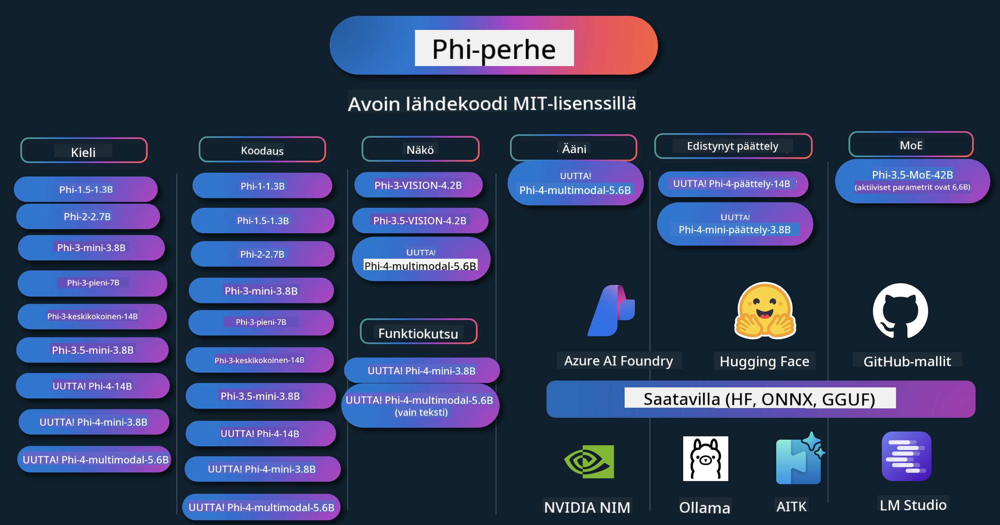

<!--
CO_OP_TRANSLATOR_METADATA:
{
  "original_hash": "1cab9282e04f2e1c388a38dca7763c16",
  "translation_date": "2025-05-09T04:00:52+00:00",
  "source_file": "README.md",
  "language_code": "fi"
}
-->
# Phi Cookbook: Käytännön esimerkkejä Microsoftin Phi-malleilla

  

  
  
  

  
  

Phi on Microsoftin kehittämä sarja avoimen lähdekoodin tekoälymalleja.

Phi on tällä hetkellä tehokkain ja kustannustehokkain pieni kielimalli (SLM), jolla on erinomaiset tulokset monikielisyydessä, päättelyssä, tekstin/chatin generoinnissa, koodaamisessa, kuvissa, äänessä ja muissa käyttötapauksissa.

Voit ottaa Phi-mallin käyttöön pilvessä tai reunalaitteissa, ja voit helposti rakentaa generatiivisia tekoälysovelluksia rajallisella laskentateholla.

Seuraa näitä vaiheita aloittaaksesi näiden resurssien käytön:  
1. **Forkkaa repositorio**: Klikkaa   
2. **Kloonaa repositorio**: `git clone https://github.com/microsoft/PhiCookBook.git`  
3. [**Liity Microsoft AI Discord -yhteisöön ja tapaa asiantuntijoita sekä muita kehittäjiä**](https://discord.com/invite/ByRwuEEgH4?WT.mc_id=aiml-137032-kinfeylo)

## 🌐 Monikielinen tuki

### Tuettu GitHub Actionin kautta (automaattinen ja aina ajan tasalla)

[Ranska](../fr/README.md) | [Espanja](../es/README.md) | [Saksa](../de/README.md) | [Venäjä](../ru/README.md) | [Arabia](../ar/README.md) | [Persia (farsi)](../fa/README.md) | [Urdu](../ur/README.md) | [Kiina (yksinkertaistettu)](../zh/README.md) | [Kiina (perinteinen, Macao)](../mo/README.md) | [Kiina (perinteinen, Hongkong)](../hk/README.md) | [Kiina (perinteinen, Taiwan)](../tw/README.md) | [Japani](../ja/README.md) | [Korea](../ko/README.md) | [Hindi](../hi/README.md)

### Tuettu CLI:n kautta
[Bengali](../bn/README.md) | [Marathi](../mr/README.md) | [Nepali](../ne/README.md) | [Punjabi (Gurmukhi)](../pa/README.md) | [Portuguese (Portugal)](../pt/README.md) | [Portuguese (Brazil)](../br/README.md) | [Italian](../it/README.md) | [Polish](../pl/README.md) | [Turkish](../tr/README.md) | [Greek](../el/README.md) | [Thai](../th/README.md) | [Swedish](../sv/README.md) | [Danish](../da/README.md) | [Norwegian](../no/README.md) | [Finnish](./README.md) | [Dutch](../nl/README.md) | [Hebrew](../he/README.md) | [Vietnamese](../vi/README.md) | [Indonesian](../id/README.md) | [Malay](../ms/README.md) | [Tagalog (Filipino)](../tl/README.md) | [Swahili](../sw/README.md) | [Hungarian](../hu/README.md) | [Czech](../cs/README.md) | [Slovak](../sk/README.md) | [Romanian](../ro/README.md) | [Bulgarian](../bg/README.md) | [Serbian (Cyrillic)](../sr/README.md) | [Croatian](../hr/README.md) | [Slovenian](../sl/README.md)

## Sisällysluettelo

- Johdanto
- [Tervetuloa Phi-perheeseen](./md/01.Introduction/01/01.PhiFamily.md)
  - [Ympäristön asetukset](./md/01.Introduction/01/01.EnvironmentSetup.md)
  - [Keskeisten teknologioiden ymmärtäminen](./md/01.Introduction/01/01.Understandingtech.md)
  - [AI:n turvallisuus Phi-malleille](./md/01.Introduction/01/01.AISafety.md)
  - [Phi-laitetuki](./md/01.Introduction/01/01.Hardwaresupport.md)
  - [Phi-mallit ja niiden saatavuus eri alustoilla](./md/01.Introduction/01/01.Edgeandcloud.md)
  - [Guidance-ai:n ja Phin käyttö](./md/01.Introduction/01/01.Guidance.md)
  - [GitHub Marketplace -mallit](https://github.com/marketplace/models)
  - [Azure AI Model Catalog](https://ai.azure.com)

- Phi-päättely eri ympäristöissä
    -  [Hugging face](./md/01.Introduction/02/01.HF.md)
    -  [GitHub-mallit](./md/01.Introduction/02/02.GitHubModel.md)
    -  [Azure AI Foundry Model Catalog](./md/01.Introduction/02/03.AzureAIFoundry.md)
    -  [Ollama](./md/01.Introduction/02/04.Ollama.md)
    -  [AI Toolkit VSCode (AITK)](./md/01.Introduction/02/05.AITK.md)
    -  [NVIDIA NIM](./md/01.Introduction/02/06.NVIDIA.md)

- Phi-perheen päättely
    - [Phi-päättely iOS:llä](./md/01.Introduction/03/iOS_Inference.md)
    - [Phi-päättely Androidilla](./md/01.Introduction/03/Android_Inference.md)
    - [Phi-päättely Jetsonilla](./md/01.Introduction/03/Jetson_Inference.md)
    - [Phi-päättely AI-PC:llä](./md/01.Introduction/03/AIPC_Inference.md)
    - [Phi-päättely Apple MLX -kehyksellä](./md/01.Introduction/03/MLX_Inference.md)
    - [Phi-päättely paikallisella palvelimella](./md/01.Introduction/03/Local_Server_Inference.md)
    - [Phi-päättely etäpalvelimella AI Toolkitin avulla](./md/01.Introduction/03/Remote_Interence.md)
    - [Phi-päättely Rustilla](./md/01.Introduction/03/Rust_Inference.md)
    - [Phi-päättely Visionilla paikallisesti](./md/01.Introduction/03/Vision_Inference.md)
    - [Phi-päättely Kaito AKS:llä, Azure Containers (virallinen tuki)](./md/01.Introduction/03/Kaito_Inference.md)
-  [Phi-perheen kvantisointi](./md/01.Introduction/04/QuantifyingPhi.md)
    - [Phi-3.5 / 4 kvantisointi llama.cpp:llä](./md/01.Introduction/04/UsingLlamacppQuantifyingPhi.md)
    - [Phi-3.5 / 4 kvantisointi Generative AI -laajennuksilla onnxruntimeen](./md/01.Introduction/04/UsingORTGenAIQuantifyingPhi.md)
    - [Phi-3.5 / 4 kvantisointi Intel OpenVINO:lla](./md/01.Introduction/04/UsingIntelOpenVINOQuantifyingPhi.md)
    - [Phi-3.5 / 4 kvantisointi Apple MLX -kehyksellä](./md/01.Introduction/04/UsingAppleMLXQuantifyingPhi.md)

-  Phi:n arviointi
- [Response AI](./md/01.Introduction/05/ResponsibleAI.md)
    - [Azure AI Foundry for Evaluation](./md/01.Introduction/05/AIFoundry.md)
    - [Using Promptflow for Evaluation](./md/01.Introduction/05/Promptflow.md)
 
- RAG with Azure AI Search
    - [How to use Phi-4-mini and Phi-4-multimodal(RAG) with Azure AI Search](https://github.com/microsoft/PhiCookBook/blob/main/code/06.E2E/E2E_Phi-4-RAG-Azure-AI-Search.ipynb)

- Phi-sovelluksen kehitysesimerkit
  - Teksti- ja chat-sovellukset
    - Phi-4-esimerkit 🆕
      - [📓] [Chat with Phi-4-mini ONNX Model](./md/02.Application/01.TextAndChat/Phi4/ChatWithPhi4ONNX/README.md)
      - [Chat with Phi-4 local ONNX Model .NET](../../md/04.HOL/dotnet/src/LabsPhi4-Chat-01OnnxRuntime)
      - [Chat .NET Console App with Phi-4 ONNX using Semantic Kernel](../../md/04.HOL/dotnet/src/LabsPhi4-Chat-02SK)
    - Phi-3 / 3.5-esimerkit
      - [Paikallinen chatbot selaimessa käyttäen Phi3, ONNX Runtime Web ja WebGPU](https://github.com/microsoft/onnxruntime-inference-examples/tree/main/js/chat)
      - [OpenVino Chat](./md/02.Application/01.TextAndChat/Phi3/E2E_OpenVino_Chat.md)
      - [Monimalli - Interaktiivinen Phi-3-mini ja OpenAI Whisper](./md/02.Application/01.TextAndChat/Phi3/E2E_Phi-3-mini_with_whisper.md)
      - [MLFlow - Wrapperin rakentaminen ja Phi-3:n käyttö MLFlow’n kanssa](./md//02.Application/01.TextAndChat/Phi3/E2E_Phi-3-MLflow.md)
      - [Mallin optimointi - Kuinka optimoida Phi-3-minimalli ONNX Runtime Webille Olive-työkalulla](https://github.com/microsoft/Olive/tree/main/examples/phi3)
      - [WinUI3-sovellus Phi-3 mini-4k-instruct-onnx:lla](https://github.com/microsoft/Phi3-Chat-WinUI3-Sample/)
      - [WinUI3 Monimalli tekoälyllä toimiva muistiinpanosovellus -esimerkki](https://github.com/microsoft/ai-powered-notes-winui3-sample)
      - [Hienosäädä ja integroi omat Phi-3-mallit Prompt flow’n avulla](./md/02.Application/01.TextAndChat/Phi3/E2E_Phi-3-FineTuning_PromptFlow_Integration.md)
      - [Hienosäädä ja integroi omat Phi-3-mallit Prompt flow’n avulla Azure AI Foundryssa](./md/02.Application/01.TextAndChat/Phi3/E2E_Phi-3-FineTuning_PromptFlow_Integration_AIFoundry.md)
      - [Arvioi hienosäädetty Phi-3 / Phi-3.5 -malli Azure AI Foundryssa keskittyen Microsoftin Responsible AI -periaatteisiin](./md/02.Application/01.TextAndChat/Phi3/E2E_Phi-3-Evaluation_AIFoundry.md)
      - [📓] [Phi-3.5-mini-instruct kieliennusteesimerkki (kiina/englanti)](../../md/02.Application/01.TextAndChat/Phi3/phi3-instruct-demo.ipynb)
      - [Phi-3.5-Instruct WebGPU RAG Chatbot](./md/02.Application/01.TextAndChat/Phi3/WebGPUWithPhi35Readme.md)
      - [Windows GPU:n käyttö Prompt flow -ratkaisun luomiseen Phi-3.5-Instruct ONNX:lla](./md/02.Application/01.TextAndChat/Phi3/UsingPromptFlowWithONNX.md)
      - [Microsoft Phi-3.5 tflite:n käyttö Android-sovelluksen luomiseen](./md/02.Application/01.TextAndChat/Phi3/UsingPhi35TFLiteCreateAndroidApp.md)
      - [Kysymys & vastaus .NET-esimerkki paikallisella ONNX Phi-3 -mallilla käyttäen Microsoft.ML.OnnxRuntimea](../../md/04.HOL/dotnet/src/LabsPhi301)
      - [Konsolichat .NET-sovellus Semantic Kernelillä ja Phi-3:lla](../../md/04.HOL/dotnet/src/LabsPhi302)

  - Azure AI Inference SDK:n koodipohjaiset esimerkit
    - Phi-4-esimerkit 🆕
      - [📓] [Projektikoodin generointi Phi-4-multimodalilla](./md/02.Application/02.Code/Phi4/GenProjectCode/README.md)
    - Phi-3 / 3.5-esimerkit
      - [Rakenna oma Visual Studio Code GitHub Copilot Chat Microsoft Phi-3 -perheen avulla](./md/02.Application/02.Code/Phi3/VSCodeExt/README.md)
      - [Luo oma Visual Studio Code Chat Copilot Agent Phi-3.5:llä GitHub-mallien avulla](/md/02.Application/02.Code/Phi3/CreateVSCodeChatAgentWithGitHubModels.md)

  - Edistyneet päättelyesimerkit
    - Phi-4-esimerkit 🆕
      - [📓] [Phi-4-mini-reasoning tai Phi-4-reasoning -esimerkit](./md/02.Application/03.AdvancedReasoning/Phi4/AdvancedResoningPhi4mini/README.md)
      - [📓] [Phi-4-mini-reasoningin hienosäätö Microsoft Olivella](../../md/02.Application/03.AdvancedReasoning/Phi4/AdvancedResoningPhi4mini/olive_ft_phi_4_reasoning_with_medicaldata.ipynb)
      - [📓] [Phi-4-mini-reasoningin hienosäätö Apple MLX:llä](../../md/02.Application/03.AdvancedReasoning/Phi4/AdvancedResoningPhi4mini/mlx_ft_phi_4_reasoning_with_medicaldata.ipynb)
      - [📓] [Phi-4-mini-reasoning GitHub-mallien kanssa](../../md/02.Application/02.Code/Phi4r/github_models_inference.ipynb)
- [📓] [Phi-4-mini-päättely Azure AI Foundry -malleilla](../../md/02.Application/02.Code/Phi4r/azure_models_inference.ipynb)
  - Demos
      - [Phi-4-mini demonstraatiot Hugging Face Spacesissa](https://huggingface.co/spaces/microsoft/phi-4-mini?WT.mc_id=aiml-137032-kinfeylo)
      - [Phi-4-multimodaaliset demonstraatiot Hugginge Face Spacesissa](https://huggingface.co/spaces/microsoft/phi-4-multimodal?WT.mc_id=aiml-137032-kinfeylo)
  - Näytekuvia
    - Phi-4 Näytteet 🆕
      - [📓] [Käytä Phi-4-multimodaalista kuvien lukemiseen ja koodin generointiin](./md/02.Application/04.Vision/Phi4/CreateFrontend/README.md) 
    - Phi-3 / 3.5 Näytteet
      -  [📓][Phi-3-vision-Kuvan teksti tekstiksi](../../md/02.Application/04.Vision/Phi3/E2E_Phi-3-vision-image-text-to-text-online-endpoint.ipynb)
      - [Phi-3-vision-ONNX](https://onnxruntime.ai/docs/genai/tutorials/phi3-v.html)
      - [📓][Phi-3-vision CLIP upotus](../../md/02.Application/04.Vision/Phi3/E2E_Phi-3-vision-image-text-to-text-online-endpoint.ipynb)
      - [DEMO: Phi-3 kierrätys](https://github.com/jennifermarsman/PhiRecycling/)
      - [Phi-3-vision - Visuaalinen kieliavustaja - Phi3-Vision ja OpenVINO](https://docs.openvino.ai/nightly/notebooks/phi-3-vision-with-output.html)
      - [Phi-3 Vision Nvidia NIM](./md/02.Application/04.Vision/Phi3/E2E_Nvidia_NIM_Vision.md)
      - [Phi-3 Vision OpenVino](./md/02.Application/04.Vision/Phi3/E2E_OpenVino_Phi3Vision.md)
      - [📓][Phi-3.5 Vision monikehys- tai monikuvaesimerkki](../../md/02.Application/04.Vision/Phi3/phi3-vision-demo.ipynb)
      - [Phi-3 Vision paikallinen ONNX-malli Microsoft.ML.OnnxRuntime .NETillä](../../md/04.HOL/dotnet/src/LabsPhi303)
      - [Valikkopohjainen Phi-3 Vision paikallinen ONNX-malli Microsoft.ML.OnnxRuntime .NETillä](../../md/04.HOL/dotnet/src/LabsPhi304)

  - Ääni Näytteet
    - Phi-4 Näytteet 🆕
      - [📓] [Äänitallenteiden tekstityksen poimiminen Phi-4-multimodaalilla](./md/02.Application/05.Audio/Phi4/Transciption/README.md)
      - [📓] [Phi-4-multimodaalinen ääninäyte](../../md/02.Application/05.Audio/Phi4/Siri/demo.ipynb)
      - [📓] [Phi-4-multimodaalinen puheen käännösnäyte](../../md/02.Application/05.Audio/Phi4/Translate/demo.ipynb)
      - [.NET-konsolisovellus, joka käyttää Phi-4-multimodaalista ääntä äänitiedoston analysointiin ja tekstityksen generointiin](../../md/04.HOL/dotnet/src/LabsPhi4-MultiModal-02Audio)

  - MOE Näytteet
    - Phi-3 / 3.5 Näytteet
      - [📓] [Phi-3.5 Mixture of Experts (MoEs) sosiaalisen median näyte](../../md/02.Application/06.MoE/Phi3/phi3_moe_demo.ipynb)
      - [📓] [Hae-Augmentoidun Generoinnin (RAG) putken rakentaminen NVIDIA NIM Phi-3 MOE:lla, Azure AI Searchilla ja LlamaIndexillä](../../md/02.Application/06.MoE/Phi3/azure-ai-search-nvidia-rag.ipynb)
  - Funktiokutsut Näytteet
    - Phi-4 Näytteet 🆕
      -  [📓] [Funktiokutsujen käyttäminen Phi-4-minin kanssa](./md/02.Application/07.FunctionCalling/Phi4/FunctionCallingBasic/README.md)
      -  [📓] [Funktiokutsujen käyttäminen moniagenttien luomiseen Phi-4-minin kanssa](../../md/02.Application/07.FunctionCalling/Phi4/Multiagents/Phi_4_mini_multiagent.ipynb)
      -  [📓] [Funktiokutsujen käyttäminen Ollaman kanssa](../../md/02.Application/07.FunctionCalling/Phi4/Ollama/ollama_functioncalling.ipynb)
  - Multimodaalinen sekoitus Näytteet
    - Phi-4 Näytteet 🆕
      -  [📓] [Phi-4-multimodaalisen käyttäminen teknologiatoimittajana](../../md/02.Application/08.Multimodel/Phi4/TechJournalist/phi_4_mm_audio_text_publish_news.ipynb)
      - [.NET-konsolisovellus, joka käyttää Phi-4-multimodaalista kuvien analysointiin](../../md/04.HOL/dotnet/src/LabsPhi4-MultiModal-01Images)

- Hienosäätö Phi Näytteet
  - [Hienosäätötilanteet](./md/03.FineTuning/FineTuning_Scenarios.md)
  - [Hienosäätö vs RAG](./md/03.FineTuning/FineTuning_vs_RAG.md)
  - [Anna Phi-3:n tulla teollisuuden asiantuntijaksi](./md/03.FineTuning/LetPhi3gotoIndustriy.md)
  - [Hienosäätö Phi-3 AI Toolkitilla VS Codeen](./md/03.FineTuning/Finetuning_VSCodeaitoolkit.md)
  - [Hienosäätö Phi-3 Azure Machine Learning Servicellä](./md/03.FineTuning/Introduce_AzureML.md)
- [Phi-3:n hienosäätö Loran avulla](./md/03.FineTuning/FineTuning_Lora.md)
  - [Phi-3:n hienosäätö QLoran avulla](./md/03.FineTuning/FineTuning_Qlora.md)
  - [Phi-3:n hienosäätö Azure AI Foundryn avulla](./md/03.FineTuning/FineTuning_AIFoundry.md)
  - [Phi-3:n hienosäätö Azure ML CLI/SDK:lla](./md/03.FineTuning/FineTuning_MLSDK.md)
  - [Hienosäätö Microsoft Olivella](./md/03.FineTuning/FineTuning_MicrosoftOlive.md)
  - [Hienosäätö Microsoft Olive Hands-On Labissa](./md/03.FineTuning/olive-lab/readme.md)
  - [Phi-3-vision hienosäätö Weights and Biasin avulla](./md/03.FineTuning/FineTuning_Phi-3-visionWandB.md)
  - [Phi-3:n hienosäätö Apple MLX Frameworkilla](./md/03.FineTuning/FineTuning_MLX.md)
  - [Phi-3-vision hienosäätö (virallinen tuki)](./md/03.FineTuning/FineTuning_Vision.md)
  - [Phi-3:n hienosäätö Kaito AKS:lla, Azure Containers (virallinen tuki)](./md/03.FineTuning/FineTuning_Kaito.md)
  - [Phi-3:n ja 3.5 Vision hienosäätö](https://github.com/2U1/Phi3-Vision-Finetune)

- Hands on Lab
  - [Huippuluokan mallien tutkiminen: LLM:t, SLM:t, paikallinen kehitys ja muuta](https://github.com/microsoft/aitour-exploring-cutting-edge-models)
  - [NLP:n potentiaalin avaaminen: hienosäätö Microsoft Olivella](https://github.com/azure/Ignite_FineTuning_workshop)

- Akateemiset tutkimuspaperit ja julkaisut
  - [Textbooks Are All You Need II: phi-1.5 tekninen raportti](https://arxiv.org/abs/2309.05463)
  - [Phi-3 tekninen raportti: erittäin kykenevä kielimalli paikallisesti puhelimellasi](https://arxiv.org/abs/2404.14219)
  - [Phi-4 tekninen raportti](https://arxiv.org/abs/2412.08905)
  - [Phi-4-Mini tekninen raportti: kompaktit mutta tehokkaat multimodaaliset kielimallit Mixture-of-LoRAs -menetelmällä](https://arxiv.org/abs/2503.01743)
  - [Pienten kielimallien optimointi ajoneuvon sisäisiin funktiokutsuihin](https://arxiv.org/abs/2501.02342)
  - [(WhyPHI) PHI-3:n hienosäätö monivalintakysymyksiin vastaamiseen: menetelmät, tulokset ja haasteet](https://arxiv.org/abs/2501.01588)
  - [Phi-4-päätelmä tekninen raportti](https://www.microsoft.com/en-us/research/wp-content/uploads/2025/04/phi_4_reasoning.pdf)
  - [Phi-4-mini-päätelmä tekninen raportti](https://huggingface.co/microsoft/Phi-4-mini-reasoning/blob/main/Phi-4-Mini-Reasoning.pdf)

## Phi-mallien käyttö

### Phi Azure AI Foundryssa

Voit oppia käyttämään Microsoft Phitä ja rakentamaan E2E-ratkaisuja erilaisilla laitteillasi. Kokeillaksesi Phiä itse, aloita leikkimällä malleilla ja räätälöimällä Phi omiin käyttötapauksiisi käyttämällä [Azure AI Foundryn Azure AI Model Catalogia](https://aka.ms/phi3-azure-ai). Lisätietoja löydät Aloittaminen [Azure AI Foundryn kanssa](/md/02.QuickStart/AzureAIFoundry_QuickStart.md)

**Playground**  
Jokaisella mallilla on oma testialusta, jossa voit kokeilla mallia [Azure AI Playground](https://aka.ms/try-phi3).

### Phi GitHub-malleissa

Voit oppia käyttämään Microsoft Phitä ja rakentamaan E2E-ratkaisuja erilaisilla laitteillasi. Kokeillaksesi Phiä itse, aloita leikkimällä mallilla ja räätälöimällä Phi omiin käyttötapauksiisi käyttämällä [GitHub Model Catalogia](https://github.com/marketplace/models?WT.mc_id=aiml-137032-kinfeylo). Lisätietoja löydät Aloittaminen [GitHub Model Catalogin kanssa](/md/02.QuickStart/GitHubModel_QuickStart.md)

**Playground**  
Jokaisella mallilla on oma [testialusta mallin kokeiluun](/md/02.QuickStart/GitHubModel_QuickStart.md).

### Phi Hugging Facessa

Mallin löydät myös [Hugging Facesta](https://huggingface.co/microsoft)

**Playground**  
[Hugging Chat -testialusta](https://huggingface.co/chat/models/microsoft/Phi-3-mini-4k-instruct)

## Vastuullinen tekoäly

Microsoft sitoutuu auttamaan asiakkaitaan käyttämään tekoälytuotteitamme vastuullisesti, jakamaan oppejamme ja rakentamaan luottamukseen perustuvia kumppanuuksia työkaluilla kuten Transparency Notes ja Impact Assessments. Monet näistä resursseista löytyvät osoitteesta [https://aka.ms/RAI](https://aka.ms/RAI).  
Microsoftin lähestymistapa vastuulliseen tekoälyyn perustuu tekoälyperiaatteisiimme, jotka korostavat oikeudenmukaisuutta, luotettavuutta ja turvallisuutta, yksityisyyttä ja tietoturvaa, osallisuutta, läpinäkyvyyttä sekä vastuullisuutta.
Suurten luonnollisen kielen, kuvan ja puheen mallien - kuten tässä esimerkissä käytettyjen - käyttäytyminen voi olla epäoikeudenmukaista, epäluotettavaa tai loukkaavaa, mikä voi aiheuttaa haittaa. Tutustu [Azure OpenAI service Transparency note](https://learn.microsoft.com/legal/cognitive-services/openai/transparency-note?tabs=text) -sivuun saadaksesi tietoa riskeistä ja rajoituksista.

Suositeltu tapa hallita näitä riskejä on sisällyttää arkkitehtuuriisi turvajärjestelmä, joka pystyy havaitsemaan ja estämään haitallisen toiminnan. [Azure AI Content Safety](https://learn.microsoft.com/azure/ai-services/content-safety/overview) tarjoaa itsenäisen suojaustason, joka pystyy tunnistamaan haitallisen käyttäjän tai tekoälyn tuottaman sisällön sovelluksissa ja palveluissa. Azure AI Content Safety sisältää tekstin ja kuvien API:t, joiden avulla voit havaita haitallista materiaalia. Azure AI Foundryn Content Safety -palvelussa voit tarkastella, tutkia ja kokeilla esimerkkikoodeja haitallisen sisällön tunnistamiseksi eri muodoissa. Seuraava [quickstart-dokumentaatio](https://learn.microsoft.com/azure/ai-services/content-safety/quickstart-text?tabs=visual-studio%2Clinux&pivots=programming-language-rest) ohjaa sinua tekemään pyyntöjä palveluun.

Toinen huomioon otettava seikka on sovelluksen kokonaisvaltainen suorituskyky. Monimuotoisissa ja monimallipohjaisissa sovelluksissa suorituskyvyllä tarkoitetaan sitä, että järjestelmä toimii odotustesi ja käyttäjiesi odotusten mukaisesti, mukaan lukien haitallisten tulosten välttäminen. On tärkeää arvioida sovelluksesi kokonaisvaltaista suorituskykyä käyttämällä [Performance and Quality and Risk and Safety evaluators](https://learn.microsoft.com/azure/ai-studio/concepts/evaluation-metrics-built-in) -arvioijia. Sinulla on myös mahdollisuus luoda ja arvioida [custom evaluators](https://learn.microsoft.com/azure/ai-studio/how-to/develop/evaluate-sdk#custom-evaluators).

Voit arvioida tekoälysovellustasi kehitysympäristössäsi käyttämällä [Azure AI Evaluation SDK:ta](https://microsoft.github.io/promptflow/index.html). Olipa käytössäsi testidatasarja tai tavoite, generatiivisen tekoälysovelluksesi tuotokset mitataan määrällisesti valmiilla arvioijilla tai valitsemillasi mukautetuilla arvioijilla. Aloittaaksesi järjestelmäsi arvioinnin azure ai evaluation sdk:lla, voit seurata [quickstart-opasta](https://learn.microsoft.com/azure/ai-studio/how-to/develop/flow-evaluate-sdk). Kun suoritat arviointikierroksen, voit [visualisoida tulokset Azure AI Foundryssa](https://learn.microsoft.com/azure/ai-studio/how-to/evaluate-flow-results).

## Tavamerkit

Tämä projekti voi sisältää tavamerkkejä tai logoja projekteille, tuotteille tai palveluille. Microsoftin tavaramerkkien tai logojen luvallinen käyttö edellyttää [Microsoftin tavaramerkki- ja brändiohjeiden](https://www.microsoft.com/legal/intellectualproperty/trademarks/usage/general) noudattamista. Microsoftin tavaramerkkien tai logojen käyttö muokatuissa versioissa tästä projektista ei saa aiheuttaa sekaannusta tai antaa ymmärtää Microsoftin sponsoroivan. Kolmansien osapuolien tavaramerkkien tai logojen käyttö on näiden osapuolten sääntöjen alaista.

**Vastuuvapauslauseke**:  
Tämä asiakirja on käännetty käyttämällä tekoälypohjaista käännöspalvelua [Co-op Translator](https://github.com/Azure/co-op-translator). Vaikka pyrimme tarkkuuteen, ole hyvä ja huomioi, että automaattikäännöksissä voi esiintyä virheitä tai epätarkkuuksia. Alkuperäistä asiakirjaa sen alkuperäisellä kielellä tulisi pitää auktoritatiivisena lähteenä. Tärkeissä tiedoissa suositellaan ammattimaista ihmiskäännöstä. Emme ole vastuussa tämän käännöksen käytöstä johtuvista väärinymmärryksistä tai virhetulkinnoista.